# myCHEF Hawaii — Master Discovery Report

> **Master Discovery Report — myCHEF Hawaii digital ecosystem rebuild**
> Properties: mychef-hawaii.com (statewide hub) · oahu / maui / kauai / bigisland .mychef-hawaii.com
> Research and audit date: 2026-09-06 · Prepared by the myCHEF AI strategy team
> Citation scheme: `[^dimNN-N^]` refers to footnote N of research dimension file NN (`/mnt/agents/output/research/mychef_hi_dimNN.md`); each chapter closes with its own Sources list.
> Truth flags used throughout: VERIFIED · APPROVED BUSINESS POLICY · RESEARCH SUPPORTED · ESTIMATED · REQUIRES APPROVAL / PRICE REQUIRES APPROVAL · REQUIRES LEGAL VERIFICATION · DO NOT PUBLISH.

## Executive Summary

The verdict of this report: myCHEF Hawaii does not need a new strategy — it needs to finish the one it already started. The five-property estate has quietly solved the two hardest problems in its market — published, itemized pricing and a correct keyword-ownership architecture — and undermined both with unfinished execution. Chapters 1–7 specify a prune-and-elevate program: preserve the differentiated assets verbatim, repair a defined register of quality debt, and rebuild around a 531-page architecture in which every URL earns its place.

### The Situation

#### The current 637-URL estate pairs a genuinely differentiated trust-and-pricing posture with severe quality debt (doorway stubs, leaked SEO annotations, sitewide duplication)

The audit found 637 URLs across the statewide hub and four island subdomains.[^01-2^] Inside sits an asset almost no competitor in Hawaiʻi operates: full per-island rate cards — Signature dinners at $125–$250 per guest, Stay Chef multi-day rates from $850–$1,100 per day — plus a published fee stack (20% service charge, GET up to 4.7120% on its own line through December 31, 2030, 50% deposit, voluntary gratuity) that lets a buyer compute an all-in number before contact, and an honesty register that refuses to fabricate reviews or credentials.[^01-8^][^01-19^]

The debt is equally concrete. Roughly 150 two-to-four-sentence stubs are fully indexed while the money pages (`/pricing`, `/quote`, `/trust`, `/legal`) sit outside every XML sitemap; internal SEO annotations leak into visible copy; identical blocks repeat sitewide; edge caching is disabled.[^01-2^] The so-what: this is a young estate whose equity concentrates in a few dozen pages, so aggressive pruning is cheap now and permanently expensive later. The window is open once.

### The Market Reality

#### Fragmented competitors, marketplace incumbency, and a transparency gap myCHEF already uniquely owns

The market splits into three layers, each leaving a door open. Marketplaces — Take a Chef above all — own the informational high ground with programmatic location pages and group-size tiers ($106–$210 per person by island; average booked menus of roughly $175–$190), but they sell ranges and chef bids, never a written confirmed total.[^07-2^][^07-3^][^07-4^][^07-5^] Of roughly 50 local chef-operators, exactly eight publish any private-chef price (nine counting Kenekes' wedding packages). Full-service caterers hide behind "request a quote," and resort venues attach 23–25% service charges to their F&B minimums.[^06-36^][^06-15^]

Demand is substantial and segmented: Oʻahu alone drew 5,679,047 visitors spending $9.42B in CY2025, and the statewide wedding market reached 17,370 weddings and $927M in 2025.[^03-49^][^07-60^] Crucially, the fragmentation is structural — food permits are per-island with no reciprocity, liquor licensing runs through four county commissions, inter-island equipment moves by barge at $1,000–$2,500 one-way.[^07-41^] No competitor can cheaply become statewide, so a network that presents as statewide occupies a position the market structure itself protects. The transparency gap myCHEF already owns is a wedge competitors cannot copy without abandoning their quoting models.

### The Architecture Decision

#### One statewide authority hub + four deliberately different island commercial engines; 531 proposed pages with keyword-ownership law

The rebuild retains the five-host architecture because the evidence says it is correct: Google segments these SERPs by island, the strongest marketplace runs the identical hub-and-island split, and Hawaiʻi's legal geography is per-island. The hub is an authority and routing layer — it owns statewide terms, the tariff, and the decision content, then pushes commercial intent down to island properties that each own their island phrase outright. The keyword-ownership law — one owner per keyword; hub statewide, hosts island-level, corridors resort areas only where service terms genuinely differ — moves from visible page copy, where it leaks today, into an enforced internal specification.

The islands are deliberately asymmetric, because their buyers are. Maui carries the deepest wedding cluster; Kauaʻi carries retreat and estate-week depth; Oʻahu carries corporate, convention, and a Japanese-language cluster (Japan sent 693,066 visitors to Oʻahu in 2024; zero competitors publish Japanese-language private-chef pages); Hawaiʻi Island runs a dual-hub structure — Kona–Kohala west, Hilo–Volcano east — with a naming duality to respect: visitors search "Big Island" while "Hawaiʻi Island" is the official form.[^03-47^]

| Property | Role | Proposed pages | Owns | Signature depth |
|---|---|---|---|---|
| mychef-hawaii.com (hub) | Authority + router | 48 | "private chef Hawaii," cost/decision queries, the tariff, fee stack, island chooser | Statewide comparisons, trust framework, zero location pages by design |
| oahu.mychef-hawaii.com | Metropolitan commercial engine | 123 | "private chef Oʻahu / Honolulu" | Corporate, conventions, Japanese-language cluster, kamaʻāina weekly line |
| maui.mychef-hawaii.com | Wedding-week engine | 126 | "private chef Maui" | 18-page wedding cluster, per-format children, resort corridors (Wailea, Kāʻanapali, Kapalua) |
| kauai.mychef-hawaii.com | Retreat + estate engine | 113 | "private chef Kauaʻi" | 7-page retreat cluster, estate weeks, two-shore coverage |
| bigisland.mychef-hawaii.com | Dual-hub engine | 121 | "private chef Big Island / Kona" | 12 location pages, resort corridor, east-side retreats, Ironman weeks |
| **Network total** | — | **531** | One owner per keyword, enforced in the IA specification | Asymmetric by evidence, not by template |

**Interpretation.** The table's real content is its asymmetry. Page counts cluster tightly (113–126 per island) because scale was never the problem — the current estate already runs 134–138 URLs per host — but composition was: cloned service slugs and stub editorials where rate cards and wedding-week budgets should be. The variance is the strategy: Maui's wedding cluster is double any other island's because Maui is the state's #2 wedding market; Kauaʻi's retreat pages exist because research found zero dedicated competition there. The hub's 48-page cap is a deliberate dilution guard, since every hub page competes with an island page for ownership. Where the table refuses to build matters as much as where it builds — no Kauaʻi west-side pages, no Maui Haleakalā pages — because inventory the demand evidence does not support becomes the next generation's quality debt.

### The Commercial System

#### Pricing transparency as the wedge; wedding-week, retreat-catering, and vacation-chef whitespace as the growth vectors

The commercial system systematizes what exists rather than inventing new pricing. Every number anchors to the approved published cards — anything beyond them is flagged PRICE REQUIRES APPROVAL — and the cards gain the mechanics they lack: worked per-person × guest-count math, included/separate line lists, and the fee stack taught as a named notation: 20% service against the 23–25% resort norm, GET as its own verified line, gratuity always voluntary.[^07-28^][^06-36^]

Three growth vectors sit on documented whitespace. First, the wedding week as one contract: the multi-meal pattern (welcome dinner → rehearsal → reception → recovery brunch) is proven demand against a 17,370-wedding, $927M market, yet no competitor sells the week as a single contract — myCHEF already publishes the state's only wedding-week rate lines.[^07-60^] Second, retreat catering: "retreat catering Kauai" returns zero dedicated SERP results while retreats priced at $2,000–$4,499 per ticket already hire chefs ad hoc, and Kauaʻi's 7.33-day average stay favors multi-day engagements.[^05-35^][^05-32^] Third, the vacation-rental chef: the query "private chef for vacation rental Hawaii" triggers an AI Overview answered by rental-company concierge pages — no chef company ranks with a dedicated page — while Stay Chef is the state's only published multi-day chef product.[^08-18^]

### The Design Decision

#### Four evidence-based island worlds — different typography, surfaces, motion, wireframes — on one shared platform

Design is treated as a conversion strategy, not decoration. When the product — a chef cooking in your villa — is identical across providers, the brand that looks native to each island's luxury vernacular wins the first five seconds of trust. The four worlds derive from documented landscape and buyer evidence: Oʻahu is modern Pacific metropolitan luxury; Maui is cinematic resort-villa hospitality; Kauaʻi is organic estate luxury; Hawaiʻi Island is volcanic minimalism. One platform, one brand, one quote infrastructure, one design-token schema — with island-specific values for typeface pairing, spacing, radius, motion, and surfaces, so the properties cannot drift into recolored clones. Commissioned per-island photography replaces the current AI-looking imagery; the trust assets — rate cards, fee stack, honesty register, the terse voice — appear inside all four worlds unchanged.

### The Execution Plan

#### 30-day build order, 90-day SEO roadmap, migration with equity protection; the decisions that need human approval

The 30-day build front-loads revenue-adjacent surfaces: Week 1, the platform and governance spine (the BUSINESS FACTS file as the single source of approved prices); Week 2, the five homepages; Week 3, the highest-intent commercial clusters per island, retreat catering first on Kauaʻi and Hawaiʻi Island; Week 4, the pricing cluster that turns the transparency wedge into a conversion system. Migration runs in parallel under one rule: every one of the 637 known URLs gets an explicit keep / improve / merge / redirect / remove decision — single-hop 301s, no wildcards, staging-first with the hub cut over last, JSON-LD parity verified before launch. The 90-day roadmap then publishes in waves, with a verified-event review pipeline as a launch KPI: the map-pack leader in the state's most valuable local SERP holds 534 Google reviews and myCHEF holds zero by policy.[^08-6^]

What the plan cannot resolve is the decision register, and that is the binding constraint. Legal items carry REQUIRES LEGAL VERIFICATION flags: alcohol-service posture for the bar line, HRS §481B-14 service-charge wording, cancellation terms, DOH permit posture. Commercial items carry PRICE REQUIRES APPROVAL flags for anything beyond the current cards. Operational decisions — publishing a phone number/NAP, review-acquisition policy, named-team disclosure, the villa-manager partner program — gate the local-search and B2B theses. The platform is buildable in 30 days; the compounding assets only start compounding once a human signs. The immediate next actions: send the alcohol and §481B-14 questions to counsel this week; approve the BUSINESS FACTS rate-card file as written; commission per-island photography; and stand up the review pipeline so the first post-launch events generate the proof the map pack runs on.

---

### Sources

[^01-2^] myCHEF Hawaii — network-wide sitemap (637 URLs) — https://mychef-hawaii.com/sitemap.xml (accessed 2026-09-06)
[^01-8^] myCHEF Hawaii — statewide tariff — https://mychef-hawaii.com/pricing (accessed 2026-09-06)
[^01-19^] myCHEF Hawaii — legal/booking notes (GET, HRS §481B-14, cancellation posture) — https://mychef-hawaii.com/legal (accessed 2026-09-06)
[^03-47^] RoadGenius — Oʻahu tourism statistics (2024 source markets; Japan 693,066) — https://roadgenius.com/statistics/tourism/usa/hawaii/oahu/ (accessed 2026-09-06)
[^03-49^] DBEDT — Oʻahu CY2025 visitor statistics (5,679,047 visitors; $9.42B spend) — https://dbedt.hawaii.gov/blog/26-04/ (accessed 2026-09-06)
[^05-32^] DBEDT — CY2025 visitor statistics (Kauaʻi 1,419,943 visitors; 7.33-day average stay) — https://dbedt.hawaii.gov/blog/26-04/ (accessed 2026-09-06)
[^05-35^] BookRetreats — Kauaʻi yoga retreat listings & prices ($2,000–$4,499 tickets) — https://bookretreats.com/s/yoga-retreats/kauai (accessed 2026-09-06)
[^06-15^] Papa Kona Events & Catering — packages, 23% service charge — https://papakonaevents.com/ (accessed 2026-09-06)
[^06-36^] Here Comes The Guide — Fairmont Orchid ($120/person and up; 25% service charge) — https://www.herecomestheguide.com/wedding-venues/hawaii/fairmont-orchid (accessed 2026-09-06)
[^07-2^] Take a Chef — Private Chef in Maui — https://www.takeachef.com/en-us/private-chef/maui (accessed 2026-09-06)
[^07-3^] Take a Chef — Private Chef in Kauai — https://www.takeachef.com/en-us/private-chef/kauai (accessed 2026-09-06)
[^07-4^] Take a Chef — Hire a Private Chef in Big Island — https://www.takeachef.com/en-us/private-chef/big-island (accessed 2026-09-06)
[^07-5^] Take a Chef — Private Chef in Honolulu — https://www.takeachef.com/en-us/private-chef/honolulu (accessed 2026-09-06)
[^07-28^] Hawaii Department of Taxation — County Surcharge on General Excise and Use Tax (4.7120% max pass-on; sunset 12/31/2030) — https://tax.hawaii.gov/geninfo/countysurcharge/ (accessed 2026-09-06)
[^07-41^] GetVendorLoop — How to Start a Food Truck in Hawaii (DOH per-island permits, Young Brothers barge $1,000–$2,500) — https://getvendorloop.com/guides/how-to-start-a-food-truck-in-hawaii (accessed 2026-09-06)
[^07-60^] The Wedding Report — 2025 Hawaii wedding market statistics (17,370 weddings; $927M; $53,369 avg / $21,117 median) — https://wedding.report/action/wedding_statistics/view/market/id/15/idtype/s/location/Hawaii/ (accessed 2026-09-06)
[^08-6^] Google SERP "private chef maui" (map pack; Raffin 534 GBP reviews) — https://www.google.com/search?q=private+chef+maui (accessed 2026-09-06)
[^08-18^] Google SERP "private chef for vacation rental hawaii" (AI Overview; concierge pages rank) — https://www.google.com/search?q=private+chef+for+vacation+rental+hawaii (accessed 2026-09-06)

---

## 1. Existing Website Audit

The myCHEF Hawaii web ecosystem is not a blank slate, and it is not the site the original client brief described. The audit behind this chapter — a full XML sitemap extraction, direct fetches of more than twenty pages, HTTP header and markup inspection, and Google `site:` index queries across all five hosts, all performed 2026-09-06 — found a 637-URL estate that already solved two of the hardest strategic problems (published pricing and keyword ownership) while undermining both with thin content, inverted crawl priorities, and internal working notes leaking into public copy.[^01-2^][^01-25^] The rebuild is therefore a **prune-and-elevate** exercise: preserve a small corpus of genuinely differentiated assets verbatim, repair a defined register of quality debt, and make 637 redirect decisions deliberately rather than by accident.

One correction frames everything that follows. The client brief assumed the old strategy avoided location URLs and neighborhood pages; the research shows this holds **only for the hub** — the four island subdomains already carry roughly 60 corridor location pages plus approximately 54 neighborhood `blog/dining-in-*` posts.[^01-1^][^01-2^] The question for the rebuild is not whether to add location coverage, but whether the location coverage that already exists deserves to survive.

### 1.1 Property Inventory and Subdomain Architecture

#### 1.1.1 Full URL inventory per property with page-type classification

The network runs on Next.js served from Vercel, server-rendered, with canonical tags, meta descriptions, and multiple JSON-LD blocks on every sampled page; robots.txt is fully open and declares the sitemap.[^01-3^][^01-25^] The apex sitemap at `mychef-hawaii.com/sitemap.xml` is a network-wide mega-sitemap listing all five hosts; each subdomain also serves its own.[^01-2^] The inventory below is the definitive census of what exists today.

| Host | Total URLs | Home | Top-level (excl. locations) | Location / corridor pages | Cloned sub-directories (29 slugs) | Journal | Blog (incl. `dining-in-*`) |
|---|---|---|---|---|---|---|---|
| mychef-hawaii.com (hub) | 94 [^01-2^] | 1 | 27 | 0 — by design [^01-1^] | 29 | 10 | 27 |
| oahu.mychef-hawaii.com | 136 [^01-2^] | 1 | 40 | 14 (`/honolulu`, `/waikiki`, `/kahala`, `/ko-olina`, `/north-shore` …) | 29 | 11 | 41 |
| maui.mychef-hawaii.com | 135 [^01-2^] | 1 | 38 | 15 (`/wailea`, `/kaanapali`, `/lahaina`, `/kapalua` …) | 29 | 11 | 41 |
| kauai.mychef-hawaii.com | 134 [^01-2^] | 1 | 38 | 15 (`/princeville`, `/poipu`, `/hanalei`, `/kapaa` …) | 29 | 11 | 40 |
| bigisland.mychef-hawaii.com | 138 [^01-2^] | 1 | 39 | 16 (`/kona`, `/kailua-kona`, `/kohala`, `/waikoloa`, `/hilo` …) | 29 | 11 | 42 |
| **Network total** | **637** | 5 | 182 | **60** | 145 | 54 | 191 |

*Source: network-wide XML sitemap and per-host sitemaps, extracted 2026-09-06.[^01-2^] "Cloned sub-directories" = the identical 7 `events/*` + 6 `catering/*` + 4 `fine-dining/*` + 3 `staffing/*` + 4 `menus/*` + 5 `help/*` slugs replicated on every host (hub 29 + home = 30 top-level structural URLs).*

The complete enumerated inventory behind this census — every URL on all five hosts, grouped by host and page type — lives in research dimension 01 (`/mnt/agents/output/research/mychef_hi_dim01.md`, §1.2–1.6); the census above is its decision-grade summary.

**Interpretation.** Three structural facts matter more than the raw count. First, the estate is remarkably symmetrical — each island host is the hub's template plus one location layer and one island-specific layer (Oʻahu adds `/kamaaina`, `/conventions`, `/short-stay`; Maui and Kauaʻi add `/wedding-week`; Hawaiʻi Island adds `/ironman-weeks` and `/coffee-act-198`) — a strength for maintenance but a weakness for differentiation: 145 of the 637 URLs (23%) are the same 29 sub-directory slugs cloned five times, and 191 more are blog URLs built from one 27-topic set mirrored across hosts plus `dining-in-*` variants.[^01-2^] Second, the location strategy the brief believed was missing is already deployed — 60 corridor pages — and in places **over-built** relative to demand evidence: Kauaʻi carries standalone `/waimea`, `/hanapepe`, `/eleele`, and `/kalaheo` pages that later demand research recommends folding; Maui carries `/haleakala`, `/waikapu`, and `/honokowai`.[^01-2^] Third, the census has a blind spot that will matter at migration: the sitemap is not the site. The hub's `/pricing`, `/quote`, `/trust`, `/legal`, and `/corporate`, and the subdomains' `/pricing`, `/quote`, `/private-chef`, and `/bar` all return HTTP 200 yet are absent from every XML sitemap — and several, including Kauaʻi's `/pricing`, are confirmed indexed by Google.[^01-2^][^01-24^][^01-25^] Any inventory that trusts the sitemap alone will silently drop the site's most important conversion pages.

#### 1.1.2 Current subdomain roles, shared footer/service-area pattern, journal/blog usage

The five-host architecture implements an explicit three-tier keyword-ownership scheme, stated on the pages themselves: the hub owns statewide phrases ("Hub `/` owns private chef Hawaii. This page is the tariff"), each subdomain owns its island phrase ("This home still owns private chef Oahu"), and corridor pages own neighborhood queries ("They are not hub paths").[^01-1^][^01-8^][^01-15^] Independent SERP pre-work confirms the scheme matches how Google segments these result sets — distinct map packs per island, people-also-search-for divergence, and the dominant marketplace (Take a Chef) running the identical hub-vs-island split.[^08-1^][^08-6^][^08-7^] **The architecture is sound and should be retained as the rebuild's information-architecture specification; the risk is execution, not strategy.**

Two shared patterns bind the hosts, one deliberate and one pathological. The deliberate pattern is the service-area taxonomy: every island defines base zones, published travel surcharges ("from $75" North Shore Oʻahu; "from $50–$75" Princeville/Poʻipū), and quote-only areas, with operational justifications (the Hanalei bridge closure clause, Hāʻena's 72-hour notice, the Kona–Hilo same-day refusal).[^01-4^][^01-6^][^01-7^] The pathological pattern is duplication: every page ends with an identical "Where we cook" locations block and an identical footer slogan reciting the Oʻahu and Maui price bands — on the Oʻahu homepage the block renders **twice consecutively** — so hundreds of pages share long runs of byte-identical copy, including price claims for other islands.[^01-1^][^01-4^]

Journal and blog usage is where the architecture most clearly failed in execution. The 54 journal and 191 blog URLs were conceived as a "picker" layer routing users to island documents, but the published articles are two-to-four-sentence stubs — a sampled hub journal article is three sentences plus "Open the island document below."[^01-13^][^01-22^] Worse, the stubs expose internal keyword-ownership annotations to users and to Google: *"Private chef Oahu (90) stays on this host's home"* and *"Oahu catering (720) stays on /catering."*[^01-15^][^01-22^] (The parenthetical numbers are the team's own search-volume guesses; they are unverified and **must not be reused as demand evidence anywhere in this report or the rebuild**.) The editorial layer, roughly 245 URLs strong, is currently the network's largest liability rather than an asset.

### 1.2 Products, Pricing and Terminology as Published Today

#### 1.2.1 Current product set (Signature dinner, Stay Chef, catering, wedding week) with exact published prices

The published product set spans ten lines, each with dedicated URLs: the **Signature dinner** (the coursed in-villa "CORE" product, groceries included), **Stay Chef** (a proprietary multi-day chef day rate, groceries billed at cost with receipts), **Date Night / dinner for two**, **wedding week** (welcome dinner, rehearsal, reception, and recovery brunch as separate lines), **catering** for staffed events of 10–75 guests ("Over seventy-five is a written exception, never implied as standard"), the **Packaged cart** mobile bar, a **kamaʻāina weekly** resident line on Oʻahu, **vacation chef** multi-day programs, a long tail of occasion services (meal prep, cooking classes, omakase-at-home, chef's table, kids menus, honeymoon and rehearsal dinners, retreat and corporate catering, event staffing), and an explicit decline list (hotel rooms without kitchens, ballrooms, named-chef marketplace bookings).[^01-1^][^01-18^][^01-4^] The pricing corpus below is recorded verbatim because it is the highest-value content asset on the network — and the numbers feed every later chapter.

| Line | Oʻahu [^01-21^] | Maui [^01-5^] | Kauaʻi [^01-23^] | Hawaiʻi Island [^01-7^] |
|---|---|---|---|---|
| Entry tier ("Table" / "ENTRY") | $95–$125/guest | — | $125–$150/guest | from $110/guest |
| **Signature dinner (CORE)** | **$125–$190/guest** | **$150–$250/guest** | **$150–$250/guest** | **$150–$225/guest** |
| Premium | $190–$275/guest | — | $250–$350/guest | above CORE |
| Chef's table | $275–$400+/guest, quoted manually | — | $350+/guest | — |
| Stay Chef day rate | from $850/day | from $1,050/day | from $1,100/day | from $950/day |
| Packaged cart (bar, 4 hr) | from $650 + $45/guest | from $800 | from $850 + $60/guest | from $725 |
| Date Night / dinner for two | from $450/event | from $500+ | from $650–$950/event | from $550 |
| Wedding week / reception | from $125/person + staffing | from $150/guest + staffing | from $175/person + staffing | from $150/guest + staffing |
| Vacation chef / multi-day | from $179–$300+/person/day | — | from $250–$300+/person/day | — |
| Weekly meal prep (kamaʻāina) | from $300–$1,200/week | — | from $550–$1,200/week | — |
| Event staffing | server $55/hr; sous-chef $75/hr; 4–5 hr minimums | — | server $55/hr; sous $75/hr; 4-hr floor | server $55/hr; sous $75/hr; 4-hr floor |
| Travel surcharge | from $75 (North Shore/Turtle Bay) | from $75 (Upcountry; Pāʻia/Haʻikū quote-only) | from $50–$75 (Princeville/Poʻipū; far-North quote-only; Hāʻena 72-hr notice) [^01-6^] | from $75 zone line ("east side is its own quote") |

*Fee stack, identical on all islands: 20% service charge ("distributed to staff or disclosed in writing," HRS §481B-14 posture), Hawaiʻi GET up to 4.7120% as its own line "valid through Dec 31, 2030," a 50% deposit to lock the date, and gratuity always voluntary — with the explicit commitment "We will never display the obsolete 4.166% figure."[^01-8^][^01-19^]*

**Interpretation.** This corpus does three things almost no competitor in the state attempts: it publishes *totals-shaped* information — bands, floors, day rates, hourlys, surcharges — rather than "call for quote"; it differentiates honestly by island, encoding real cost geography (Kauaʻi's logistics premium prices Stay Chef $250/day above Oʻahu); and it externalizes the fee stack so a buyer can compute an all-in number before contact.[^01-8^] Cross-verification confirms the rate cards are internally consistent across the audit and the island research dimensions, with **one exception**: the Hawaiʻi Island homepage hero states "Signature dinner from $125 a guest" while its own card sets CORE at $150–$225 with ENTRY from $110 — a copy inconsistency to fix, not to migrate.[^01-7^] The GET copy is **VERIFIED** accurate against the Department of Taxation posture (4.5% owed, 4.7120% maximum visible pass-on, county surcharges sunset 12/31/2030); the cancellation tiers, self-described as "proposed … pending attorney review," carry a **REQUIRES LEGAL VERIFICATION** flag before republication.[^01-19^] Note also the terminology drift inside an otherwise disciplined system — hub and Oʻahu label tiers Table/Signature/Premium while Hawaiʻi Island uses ENTRY/CORE/PREMIUM; the rebuild should lock one vocabulary.[^01-7^][^01-8^][^01-21^]

#### 1.2.2 Brand voice and trust posture (no fake reviews, no invented local signals, written-quote policy)

The network's trust posture is its most unusual asset: a launch-stage business that refuses to simulate maturity. The `/trust` page is styled as an **"Honesty register"** with status chips — reviews "NOT AVAILABLE — YET," local awards and press "PROHIBITED — LAUNCH GATE," farm claims "PENDING — WRITTEN VERIFICATION," itemised fees "VERIFIED — POLICY" — and the no-fake-reviews policy is plain: *"We do not yet have Hawaiʻi guest reviews. We will not invent them, buy them, or write them in-house."*[^01-1^][^01-10^] The same discipline extends to photography disclaimers (crew photos "illustrate how a booking is crewed," not a claim of twenty-five W-2 employees per island), sourcing claims (farm names print only with written verification; Hawaiʻi Island carries a Kona coffee origin-labeling page), and a legal page that declines to display licenses or certificates the business does not hold.[^01-11^][^01-2^][^01-19^]

The counterweight is radical identity minimalism: *"We do not publish an 808 number, a street office, a founding year, or chef names. Contact is the quote form and WhatsApp."*[^01-1^] Conversion runs through a single door — a five-field quote form plus WhatsApp — with the explicit stance that "the button is not 'Book now'" and the repeated mantra that "the written quote is the confirmed total — never a chat estimate."[^01-9^][^01-8^] On Kauaʻi and Hawaiʻi Island the CTA degrades to an "inquiry list" rather than a quote — an operationally honest signal of roster depth, but a second-class funnel.[^01-6^][^01-9^]

Two cautions belong on the record. Indexed snippets claim parent-brand operating history — "Part of the myCHEF family. Bali Verified — International; Dubai Verified — International" — while the Hawaiʻi entity describes itself as launching; those claims are **UNVERIFIED** and must not be laundered into factual rebuild copy.[^01-24^] And the trust posture is a policy choice, not a permanent identity: the honesty register is designed to evolve as reviews, named chefs, and entity details become real, so the rebuild should treat "launch posture" as version one of the trust architecture. The voice itself — terse, anti-hype ("Honesty is the inventory"; "A dinner for six is not a reception for sixty") — is ownable and consistent across 600+ pages; preserve it selectively, undiluted.[^01-1^][^01-7^]

### 1.3 Content and Design Weaknesses

#### 1.3.1 Content gaps: thin commercial coverage, limited location strategy, missing price depth

The network's content problem is an inversion: its strongest asset is hidden from crawlers while its weakest is fully exposed. The money pages — `/pricing`, `/quote`, `/trust`, `/legal` on the hub and `/pricing`, `/quote`, `/private-chef`, `/bar` on the subdomains — return 200 and earn indexation, yet are absent from every XML sitemap, while roughly 150 thin journal and blog stubs are included and fully crawlable.[^01-2^][^01-24^][^01-25^] Sitemap priorities compound the signal: homepage 1.0/0.9, catering and weddings 0.8, everything else a flat 0.55–0.6 — the pages that differentiate the business carry no priority signal at all.[^01-2^]

Three specific gaps follow. **Thin commercial coverage:** the ~245 journal/blog URLs that should answer high-intent cost and logistics questions are doorway stubs whose substance is a cross-link; the cost query a competitor's blog currently wins statewide ("private chef Hawaii cost," where Jason Raffin ranks with substantive posts) is exactly the question myCHEF's own corpus could answer better than anyone.[^01-13^][^08-14^][^08-15^] **Mis-sized location strategy:** against the brief's assumption of missing location pages, the real defect is the opposite of absence — coverage exists but is indiscriminate, with corridor pages built beyond demand evidence (Kauaʻi's west-side towns, Maui's `/haleakala` class) while the corridors that deserve pages share cloned copy and cloned price blocks, exposing the network to thin near-duplicate risk precisely where marketplace competitors hold only thin templates.[^01-2^][^08-6^] **Missing price depth:** the rate cards publish bands and floors, but there is no worked math anywhere — no per-person × guest-count grid, no worked wedding-week budget, no Stay Chef week example — so the transparency asset stops one step short of the confirmed-total logic the brand itself preaches.[^01-8^]

#### 1.3.2 Design/UX/SEO weaknesses observed across the five properties

The register below consolidates every weakness the audit documented, with evidence and the rebuild disposition for each. It is the working defect list for Chapters 4 and 7.

| # | Weakness | Evidence (verbatim where available) | Scope | Rebuild disposition |
|---|---|---|---|---|
| W1 | ~150 thin journal/blog doorway stubs (2–4 sentences) [^01-13^][^01-22^] | "Open the island document below. Kauaʻi and Hawaiʻi Island stay inquiry." | All 5 hosts | 301-or-expand; keep only slugs mapped to real FAQ/PAA demand, rewritten as full-prose answers |
| W2 | Internal SEO annotations leak into visible copy [^01-15^][^01-22^] | "Private chef Oahu (90) stays on this host's home. This article does not steal that title."; "Oahu catering (720) stays on /catering." | Journal/blog, hub + islands | Strip all annotations; keep keyword ownership as an internal IA document (Chapter 4) |
| W3 | Money pages missing from XML sitemaps while indexed [^01-2^][^01-24^][^01-25^] | `/pricing`, `/quote`, `/trust`, `/legal`, `/private-chef`, `/bar` return 200; Kauaʻi `/pricing` indexed | All 5 hosts | Include money pages in sitemaps at priority 0.8–0.9; full URL census before migration |
| W4 | Massive cross-page duplication [^01-1^][^01-4^] | Identical "Where we cook" block + identical footer slogan sitewide; block renders twice consecutively on the Oʻahu home; 29 sub-directory slugs cloned × 5 hosts | All 5 hosts | Deduplicate shared blocks; differentiate cloned sub-pages or consolidate |
| W5 | Zero social proof [^01-10^][^01-11^] | No reviews, testimonials, chef bios, or real event photos; imagery is illustrative/AI-appearing and self-disclaimed | All 5 hosts | Verified-event review pipeline + real per-island photography at relaunch (Chapter 7) |
| W6 | No business identity / NAP void [^01-1^] | "We do not publish an 808 number, a street office, a founding year, or chef names." | All 5 hosts | Publish real entity/trust assets as they mature; do not fabricate (policy preserved) |
| W7 | Keyword-stuffed meta descriptions [^01-24^] | Maui home meta repeats "Best private chef Maui from $150/pp" twice | Island hosts | Rewrite meta descriptions to one value proposition each |
| W8 | Price/copy inconsistencies [^01-7^] | Big Island hero "from $125" vs its own CORE $150–$225 / ENTRY from $110; Table-vs-ENTRY tier naming drift | Big Island; hub vs islands | Fix in copy QA; lock one tier vocabulary |
| W9 | Odd indexed URL artifacts [^01-24^][^01-25^] | `/bigisland/catering` on the bigisland host; `/kauai/events` on the kauai host; parameterized `/quote?island=maui&service=wedding` indexed; legacy 301s (`/locations/waikiki`, `/wedding-catering`) | Kauaʻi, Big Island, Maui, Oʻahu | Canonical cleanup; fold artifacts into the 301 map |
| W10 | Second-class funnels on two islands [^01-6^][^01-9^] | Kauaʻi/Big Island CTAs lead to an "inquiry list," not a quote | Kauaʻi, Big Island | Unify the funnel; frame inquiry-stage with the operational "why" |
| W11 | Edge caching disabled [^01-25^] | `cache-control: private, no-cache, no-store`; `x-vercel-cache: MISS` on homepage | All 5 hosts (platform-level) | Enable edge caching; TTFB/performance budget in rebuild spec |
| W12 | Launch-posture hedging reads as not-open [^01-6^][^01-19^] | "Inquiry-stage," "proposed tiers pending attorney review," "launch gate" copy throughout | Kauaʻi, Big Island most exposed | Reword to operational confidence as assets verify; legal items flagged **REQUIRES LEGAL VERIFICATION** |

**Interpretation.** These twelve defects share a single root cause: the site was shipped as a strategy document rather than finished as a product. The ownership scheme, the tariff, the fee stack, and the trust register are all genuinely sophisticated — and execution undermines each at the point of publication: annotations left in copy (W2), the tariff left out of the sitemap (W3), the honesty register paired with zero proof assets (W5, W6), polished design served with caching switched off (W11). None requires new strategy to fix; all are mechanical. The structural implication runs the other way: because W1–W4 and W9 are URL-level problems, they cannot be repaired without touching the redirect map — the migration plan (Chapter 7) and the content remediation are the same project, and sequencing content fixes before the URL census would double the work.

### 1.4 Preservation and Migration Risk

#### 1.4.1 Content and URLs worth preserving (search equity candidates)

The preservation list is short by design. Of 637 URLs, the assets with durable value — search equity, conversion value, or differentiation no competitor can quickly copy — concentrate in a few dozen pages and one corpus of copy. Everything else is a candidate for expansion, consolidation, or a disciplined 301.

| Asset | What to preserve | Why (evidence) | Disposition |
|---|---|---|---|
| Pricing corpus | All per-island rate cards, fee stack (20% service / GET 4.7120% through 2030 / 50% deposit), travel-zone lines [^01-8^][^01-19^][^01-21^][^01-23^] | Highest-value content on the network; near-zero competitor publication statewide; GET copy **VERIFIED** against DOTAX posture | Migrate **verbatim**; fix only the Big Island "$125" hero and tier-naming drift |
| Trust framework | `/trust` honesty register, no-fake-reviews policy, photo disclaimers, `/what-we-dont-do`, `/legal` structure (7-section fine-print-in-large-type model) [^01-10^][^01-11^][^01-19^] | Unique trust architecture; converts the industry's fee-opacity pain point into proof of honesty | Preserve and evolve (status chips update as assets verify); cancellation tiers hold **REQUIRES LEGAL VERIFICATION** flag |
| Terminology system | Signature dinner / CORE band, Stay Chef, Date Night, Family Feast, Packaged cart, kamaʻāina line, "the tariff" / "the stack," corridor/base-zone language [^01-1^][^01-8^] | Ownable, consistent vocabulary across 600+ pages; differentiates from generic luxury-chef copy | Preserve; lock one tier vocabulary network-wide |
| Operational-truth content | Hanalei bridge clause, Ironman-week compression, Kona–Hilo same-day refusal, Waikīkī COI/freight-elevator logistics, Ko Olina provisioning, Upcountry surcharge [^01-4^][^01-5^][^01-6^][^01-7^] | Demonstrates real island operations knowledge no template competitor shows; marketplace-differentiation lever [^08-13^][^08-33^] | Preserve; promote into corridor pages and trust blocks |
| Sample menus | Per-island three-course menus + estate catering menu [^01-4^][^01-5^][^01-18^] | Concrete product imagery (ahi poke, macadamia-crusted catch, lilikoi cheesecake) that the stub editorial layer lacks | Preserve; expand |
| Indexed URLs | 5 homepages; `/pricing` (all hosts — Kauaʻi's confirmed indexed); `/catering`, `/weddings`, `/private-chef-cost`, corridor pages (`/wailea`, `/honolulu`, `/kahala`, `/princeville`, `/kona`, `/waikoloa` — several confirmed indexed); `/journal/how-much-does-a-private-chef-cost`; `/trust`, `/legal`, `/quote` [^01-24^][^01-25^] | Confirmed Google indexation = existing search equity; corridor ownership matches verified SERP demand [^08-6^][^08-43^][^08-3^] | Keep URLs stable where possible; 301 every restructured slug (Chapter 7 map) |
| Structured data | Organization, LocalBusiness (`priceRange "$125–$250"`), OfferCatalog with min/max USD price specifications, FoodService, FAQPage JSON-LD [^01-25^] | Rich-result eligibility that a naive rebuild would silently lose | Re-implement equivalent JSON-LD on the new stack |
| Keyword-ownership scheme | Hub = statewide, island hosts = island phrases, corridors = neighborhoods [^01-1^][^01-15^] | Independently prescribed by SERP research; matches marketplace structure and distinct per-island map packs [^08-1^][^08-6^][^08-7^] | Retain as the rebuild IA specification — enforced in an internal document, never again in visible copy |

**Interpretation.** Notice what is *not* on this list: the ~150 editorial stubs, the 145 cloned sub-directory URLs as written, and the over-built corridor pages carry no equity worth defending beyond whatever indexation they hold — and that indexation is thin (Google `site:` queries surfaced only roughly 40 results across all five hosts, a figure the audit marks **UNVERIFIED** but directionally consistent with a young, partially indexed estate).[^01-24^] The consequence is liberating: a young estate with concentrated equity gives the rebuild a one-time window to prune aggressively at low cost. Every pruning decision deferred past migration becomes permanently more expensive, because it then means maintaining redirects for URLs never worth keeping. The preservation table is therefore also the pruning boundary: anything not listed needs an affirmative argument to survive.

#### 1.4.2 Migration risks and equity-protection requirements

The migration is a five-host, 637-URL problem with a documented blind spot: the sitemap understates the site. The risk register below is sequenced by severity and feeds directly into the Chapter 7 migration plan.

| # | Risk | Mechanism | Severity | Equity-protection requirement |
|---|---|---|---|---|
| R1 | Incomplete URL census | Money pages (`/pricing`, `/quote`, `/trust`, `/legal`, `/private-chef`, `/bar`) live outside all sitemaps yet several are indexed; crawl-based inventories would drop the highest-value pages [^01-2^][^01-24^][^01-25^] | Critical | Build the census from sitemap **+** server/CMS route table **+** Google Search Console export + log analysis before any redirect decision |
| R2 | 637-URL redirect mapping | Any consolidation (subdomain → path routing, or pruning) requires a deliberate 301 decision per URL; the 145 cloned sub-pages and ~150 stubs are prune candidates, not automatic keeps [^01-2^] | Critical | Full redirect map with destination-type rules (keep / fold / expand-then-keep); no wildcard catch-all redirects to homepages |
| R3 | Five-host equity split | Each subdomain accumulates authority separately; consolidation changes the link-equity equation in ways that cannot be fully predicted (inbound-link profile **UNVERIFIED** by the audit) [^01-25^] | High | Backlink profile audit before architecture decision; if subdomains are retained (recommended — the architecture mirrors verified SERP segmentation [^08-1^][^08-6^]), equity risk converts to a hosting decision only |
| R4 | Keyword-ownership collapse | The hub/island/corridor allocation is enforced in copy ("This article does not steal that title"); naive consolidation would create cannibalization between hub and island pages competing for the same queries [^01-15^][^08-1^] | High | Migrate the ownership map as an IA specification; enforce uniqueness via differentiated price cards, FAQs, and schema per tier rather than copy annotations [^08-13^][^08-67^] |
| R5 | Sitemap-invisible indexed pages | Indexed artifacts (`/bigisland/catering`, `/kauai/events`, `/quote?island=maui&service=wedding`, legacy 301s `/locations/waikiki`, `/wedding-catering`) prove historical URL variants exist beyond any current inventory [^01-24^][^01-25^] | Medium | Pre-migration log/GSC export to catch legacy variants; each gets an explicit redirect or 410 decision |
| R6 | Structured-data loss | OfferCatalog (with min/max USD prices), FAQPage, LocalBusiness JSON-LD must be re-implemented or rich-result eligibility is lost at cutover [^01-25^] | Medium | JSON-LD parity checklist in the rebuild acceptance criteria; validate per template before launch |
| R7 | Migrating the defects | Big Island "$125" hero, Table/ENTRY drift, duplicated locations block, leaked annotations, keyword-stuffed metas are content bugs, not content [^01-4^][^01-7^][^01-15^][^01-24^] | Medium | Copy-QA gate in the migration plan: known defects are fixed, never ported; the weaknesses register (§1.3.2) is the checklist |
| R8 | Anchoring perpetual launch posture | Migrating "no reviews, no names, inquiry-stage" copy verbatim anchors the brand as permanently new as the business matures [^01-10^][^01-19^] | Medium | Trust-asset roadmap (reviews pipeline, named team, entity details) built into Chapter 7; honesty-register chips designed to change state |
| R9 | Legal posture drift | Cancellation/deposit tiers are "proposed … pending attorney review"; HRS §481B-14 service-charge wording and the alcohol-service status of the Packaged cart line carry open legal questions [^01-19^] | High (gating) | All items on the **REQUIRES LEGAL VERIFICATION** register must resolve before final copy lock; GET pass-on line needs a review date against the 12/31/2030 surcharge sunset |

**Interpretation.** Two risks are genuinely strategic; the rest are discipline. R1 and R2 are the project-killers if mishandled: the sitemap cannot be trusted as the inventory (R1), and 637 decisions made by default are 637 opportunities for silent equity loss (R2). R3 deserves an explicit verdict: the evidence assembled across this report — distinct map packs per island, per-island legal and logistical reality, the marketplace leader's own hub-and-island structure — supports **retaining the subdomain architecture**, which converts the five-host equity split from a migration risk into a hosting decision and removes the largest single class of redirect risk.[^08-1^][^08-6^] The remaining risks define the migration plan's non-negotiables — a real census, a real redirect map, JSON-LD parity, a copy-QA gate, legal sign-off on flagged items — and Chapter 7 builds on exactly this register.

The audit's net conclusion favors the rebuild. The estate contains a small, identifiable core — the pricing corpus, trust framework, terminology, operational-truth content, and a verified keyword-ownership architecture — that competitors cannot quickly replicate, wrapped in a large layer of quality debt that is cheap to remove now and expensive later. The correct posture is neither reverence nor demolition: preserve the core verbatim, fix the defects at the copy-QA gate, prune the debt at the redirect map. Chapter 2 shows why that core is the right foundation: the competitive landscape confirms almost nobody else in this market publishes what myCHEF already publishes.

---

### Sources

[^01-1^] myCHEF Hawaii — hub homepage — https://mychef-hawaii.com/ (accessed 2026-09-06)
[^01-2^] myCHEF Hawaii — network-wide XML sitemap (637 URLs; per-host sitemaps at each subdomain /sitemap.xml) — https://mychef-hawaii.com/sitemap.xml (accessed 2026-09-06)
[^01-3^] myCHEF Hawaii — robots.txt — https://mychef-hawaii.com/robots.txt (accessed 2026-09-06)
[^01-4^] myCHEF Oʻahu — homepage — https://oahu.mychef-hawaii.com/ (accessed 2026-09-06)
[^01-5^] myCHEF Maui — homepage — https://maui.mychef-hawaii.com/ (accessed 2026-09-06)
[^01-6^] myCHEF Kauaʻi — homepage — https://kauai.mychef-hawaii.com/ (accessed 2026-09-06)
[^01-7^] myCHEF Hawaiʻi Island — homepage — https://bigisland.mychef-hawaii.com/ (accessed 2026-09-06)
[^01-8^] myCHEF Hawaii — statewide tariff (/pricing) — https://mychef-hawaii.com/pricing (accessed 2026-09-06)
[^01-9^] myCHEF Hawaii — quote mechanism — https://mychef-hawaii.com/quote (accessed 2026-09-06)
[^01-10^] myCHEF Hawaii — honesty register (/trust) — https://mychef-hawaii.com/trust (accessed 2026-09-06)
[^01-11^] myCHEF Hawaii — about/brigade, photo disclaimer — https://mychef-hawaii.com/about (accessed 2026-09-06)
[^01-13^] myCHEF Hawaii — hub journal stub, "How much does a private chef cost" — https://mychef-hawaii.com/journal/how-much-does-a-private-chef-cost (accessed 2026-09-06)
[^01-15^] myCHEF Oʻahu — island journal stub with leaked SEO annotation — https://oahu.mychef-hawaii.com/journal/how-much-does-a-private-chef-cost (accessed 2026-09-06)
[^01-18^] myCHEF Hawaii — catering service page — https://mychef-hawaii.com/catering (accessed 2026-09-06)
[^01-19^] myCHEF Hawaii — legal/booking notes (GET, HRS §481B-14, cancellation posture) — https://mychef-hawaii.com/legal (accessed 2026-09-06)
[^01-21^] myCHEF Oʻahu — rate card (/pricing) — https://oahu.mychef-hawaii.com/pricing (accessed 2026-09-06)
[^01-22^] myCHEF Oʻahu — blog stub sample ("cleanup standard") — https://oahu.mychef-hawaii.com/blog/cleanup-standard (accessed 2026-09-06)
[^01-23^] myCHEF Kauaʻi — rate card (/pricing) — https://kauai.mychef-hawaii.com/pricing (accessed 2026-09-06)
[^01-24^] Google `site:` queries (site:mychef-hawaii.com and per-subdomain) — indexed titles/snippets (accessed 2026-09-06)
[^01-25^] Direct HTTP inspection (curl) of headers, HTML head, JSON-LD, and status codes for sitemap-vs-live URL comparison (accessed 2026-09-06)
[^08-1^] Google SERP "private chef hawaii" — https://www.google.com/search?q=private+chef+hawaii (accessed 2026-09-06)
[^08-3^] Take a Chef — Kailua-Kona — https://www.takeachef.com/en-us/private-chef/kailua-kona (accessed 2026-09-06)
[^08-6^] Google SERP "private chef maui" — https://www.google.com/search?q=private+chef+maui (accessed 2026-09-06)
[^08-7^] Google SERP "private chef kauai" — https://www.google.com/search?q=private+chef+kauai (accessed 2026-09-06)
[^08-13^] myCHEF Kauaʻi — Weddings page — https://kauai.mychef-hawaii.com/weddings (accessed 2026-09-06)
[^08-14^] Google SERP "private chef hawaii cost" — https://www.google.com/search?q=private+chef+hawaii+cost (accessed 2026-09-06)
[^08-15^] Jason Raffin — "Private Chef Pricing Maui" — https://www.jasonraffin.com/post/breaking-down-the-cost-of-a-private-chef-in-maui-private-chef-pricing-maui (accessed 2026-09-06)
[^08-33^] myCHEF Hawaiʻi Island — journal, "How far ahead to book" — https://bigisland.mychef-hawaii.com/journal/how-far-ahead-to-book (accessed 2026-09-06)
[^08-43^] Take a Chef — Princeville — https://www.takeachef.com/en-us/private-chef/princeville (accessed 2026-09-06)
[^08-67^] myCHEF Hawaii — journal hub — https://mychef-hawaii.com/journal (accessed 2026-09-06)

---

## 2. Hawaii Competitor Landscape and Pricing Research

**Bottom line:** myCHEF Hawaii competes in a fragmented, three-layer market — global marketplaces that publish tiered prices but cannot confirm a total, local chef-operators who can cook superbly but publish almost nothing, and full-service caterers who hide behind "request a quote." Across all four islands, the research surfaced exactly **eight of ~50 local operators who publish any private-chef price at all** (nine counting Kenekes, which publishes wedding packages but no private-chef price) — and zero wedding caterers who publish a full rate card. This is the structural opening: a published, itemized tariff — which myCHEF already operates (Chapter 1) — is a wedge that no competitor in-market can copy without abandoning their quoting model. This chapter documents who the competitors are, island by island; what they charge, verbatim and sourced; and where the transparency gap, the wedding-week vacuum, and the marketplaces' own template failures create beatable positions. Pricing *recommendations* are deliberately out of scope — Chapter 5 builds the pricing architecture on this evidence base.

---

### 2.1 Market Structure

#### 2.1.1 Fragmented market: marketplaces vs local operators vs full-service caterers

The Hawaii private-chef and catering market splits into three distinct competitive layers, each with a different business model, a different pricing posture, and a different vulnerability. Understanding the layers matters because myCHEF's rebuild must position *against all three simultaneously* — and the evidence shows each layer leaves a different door open.

**Layer 1 — Global marketplaces (Take a Chef, Cozymeal, Yhangry, MiumMium, Thumbtack, Airbnb Services, Food Fire + Knives).** These platforms own the informational high ground: programmatic location pages for every island and town, published group-size price tiers, platform-level review counts, and FAQ schema answering "how much does a private chef cost in {island}." Take a Chef is the category's SEO incumbent, with live pricing pages for Honolulu County, Waikīkī, Kailua, Maui, Wailea, Lahaina, Kauaʻi, Poʻipū, and Big Island.[^03-4^][^03-5^][^04-22^][^05-20^][^06-7^] Their structural weaknesses are equally clear: they sell single dinners, not stay-rhythm service; the chef is a bid, not a brand (the strongest local chefs — JP on Oʻahu, Raffin on Maui, Rio on Big Island — are simultaneously platform-listed, commoditizing their own identities[^03-17^][^04-12^][^06-7^]); and their location pages are template products with documented quality failures (§2.3.3).

**Layer 2 — Local independent chef-operators.** One-to-three-person, chef-owned businesses, often with genuine pedigree: ex-Mama's Fish House (Aloha Party Chef, Maui[^04-14^][^04-16^]), Peter Merriman-trained (Private Dining Hawaii, Oʻahu[^03-21^]), James Beard Foundation-recognized (Chef David Paul, Oʻahu[^03-25^]), Michelin-trained (Jason Raffin, Maui[^04-8^]). They win referrals through concierges, villa managers, and planners. Their near-universal weakness: no published pricing, thin websites, no location-page architecture, single-chef capacity ceilings. Of the ~50 local operators profiled across the four island research dimensions, only eight publish any private-chef price at all (nine counting Kenekes' wedding-package menus — counting rule: private-chef or catering per-person/hourly rates; fee-structure-only disclosures like Tailor Made's do not count).

**Layer 3 — Full-service caterers and venue-caterer hybrids.** Scale incumbents such as Contemporary Flavors (Kauaʻi, 50+ staff, "the largest and finest full-service licensed catering company on the island"[^05-13^]), A Catered Experience (Oʻahu, FCH Enterprises/Zippy's family, "serving Oahu since 1978"[^03-27^]), Celebrations by Bev Gannon (Maui, 30+ years[^04-32^]), and Papa Kona (Big Island, oceanfront venue plus off-site catering[^06-15^]). They dominate "catering {island}" and The Knot/WeddingWire directories and lock up venue exclusivity in places (Waimea Valley's exclusive caterer Ke Nui Kitchen on Oʻahu[^03-66^]). Almost none publish pricing, and their product is the buffet line, not the in-villa chef experience.

**Why the fragmentation persists — and why it matters for the rebuild.** Hawaii's operating environment enforces fragmentation by law and logistics: DOH food permits are per-island with no reciprocity, liquor licensing runs through four separate county commissions, GET is filed multi-county with the rate following where service is performed, and there is no consumer inter-island vehicle ferry (equipment moves by barge at $1,000–$2,500 one-way).[^07-41^][^07-38^][^07-28^] No competitor can cheaply become a statewide operator — which means a network that presents *as* statewide (hub plus four island properties), with per-island rate cards reflecting real per-island cost structures, occupies a position the fragmentation itself protects. One industry estimate sizes the Hawaii-plus-California private-chef service market at USD 130.2M in 2026 growing to 194.4M by 2033 (CAGR 5.9%), with meal prep the largest segment (26.5%) and B2B at 66.1% — single-source, paywalled research-firm data, so treat as directional, but its named market restraint matches everything the island research found: "fragmented supply — many independent chefs with variable quality & vetting."[^03-23^]

#### 2.1.2 Marketplace threat profile (Take a Chef, Cozymeal, Yhangry, Thumbtack, Bark)

Marketplaces are the only competitor class that currently answers the price question in public. They are therefore myCHEF's primary SERP competition for cost-intent queries — and the table below is the evidence that their answer is systematically incomplete: tiers and averages, never a confirmed total; platform review counts, never local accountability; and in two documented cases, boilerplate statistics recycled across geographies.

| Marketplace | Hawaii footprint | Published pricing (verbatim) | Scale claims | Structural weaknesses for myCHEF to exploit |
|---|---|---|---|---|
| **Take a Chef** | Per-island + per-town pages: Honolulu County, Waikīkī, Kailua, Ko Olina; Maui, Wailea, Lahaina, Kapalua, "Kula"; Kauaʻi, Poʻipū, Princeville; Big Island, Kailua-Kona[^03-4^][^08-40^][^08-41^][^08-42^][^08-43^] | Group-size tiers per island: Maui $119–$171/pp (avg menu ~$175); Kauaʻi $118–$210/pp (avg ~$176); Big Island $106–$169/pp (avg ~$176); Honolulu $110–$149/pp (avg menu $190.6)[^07-2^][^07-3^][^07-4^][^07-5^] | 72+ chefs Honolulu County, 7,941 guests served since Feb 2018; 50+ chefs Maui, 3,459 guests; 23–24 chefs Kauaʻi, 6,890 guests; 73+ chefs Big Island, 10,447 guests; ratings 4.78–4.95/5[^03-5^][^04-22^][^05-20^][^06-7^] | Template reuse documented: statewide page repeats Maui numbers verbatim; Maui page H1 erroneously reads "Private Chef in Kula" (direct HTML inspection)[^07-1^][^07-2^][^08-4^] — ranges, never a confirmed total; chef-bid variance; no stay-rhythm or multi-day product |
| **Cozymeal** | Oʻahu and Maui pages; named-locale FAQ (Waikīkī, Kailua, North Shore)[^03-7^][^04-20^] | "Starting at $59 per person"; FAQ "$59 to over $100 per person" (Oʻahu); Maui "Starting at $119 per person"[^03-7^][^04-20^] | "45,000+ 5-Star Reviews" platform-wide; Oʻahu chef roster thin (new profiles with 1 review)[^03-9^] | Experience-platform genericness; no Maui/Oʻahu storytelling; price anchors sit below local indie rates, attracting budget buyers; actively recruiting island chefs (roster not yet built)[^04-21^] |
| **Yhangry** | Hawaii state page + Oʻahu, Kauaʻi County, Princeville, Hanalei pages[^03-10^][^05-24^] | "customers booking a private chef in Oahu spend around $817"; hourly "$40 and $60 per hour"[^03-10^] | "17 private chefs currently in Oahu, ~3 new registrations/month"[^03-12^] | **Boilerplate contamination:** the identical "$817" and "17 chefs" figures appear on its Oʻahu, Kauaʻi County, and statewide pages — platform-wide text, not island data; cite only with that caveat[^03-11^][^05-23^] |
| **MiumMium** | Honolulu, Kapolei, Aiea, Laie; Kailua-Kona[^03-13^][^06-23^] | "average sum paid… was $50.65 + tip per person, the lowest priced meals… in the low thirties and the highest… over $150 per guest" (all-in incl. taxes)[^03-13^] | Reservation fee "less than 18% of the total"[^03-13^] | **Boilerplate contamination:** identical $50.65 average on Honolulu and Kailua-Kona pages — a platform-wide figure reused per city; price-leader positioning serves the budget/meal-prep segment myCHEF should not chase |
| **Thumbtack** | Honolulu cost-guide page[^03-14^] | "Hiring a personal chef usually costs anywhere from $40–$100 or more per person"[^03-14^] | Per-pro quotes | Lead-gen, no curation, no vetting narrative; cost guide is generic national content localized |
| **Airbnb Services / Food Fire + Knives / Bark** | Airbnb "Chef in Oahu" listings (6+ visible); FFK Honolulu page; Bark directory listings[^03-1^][^03-38^] | Airbnb sample host displayed in BRL only ("R$894 per guest, Minimum R$3,317 to book" — no USD conversion published); FFK prices à la carte at booking[^03-1^] | Airbnb vetting claim "Chefs on Airbnb are vetted for quality"[^03-1^] | New channel (Airbnb Services, 2025) with currency-localization bugs; no published ranges; FFK/Bark have no Hawaii-specific content depth |

The strategic read is threefold. First, **Take a Chef is the real competitor** — the only marketplace with genuine per-island pricing data, real booking volumes, and a location-page architecture that mirrors (and validates) myCHEF's own hub-island-corridor scheme; its per-island price variation (Kauaʻi 2-person $210 vs Big Island $169) is market proof that island-differentiated rate cards match how this market actually prices.[^07-3^][^07-4^] Second, **every marketplace sells ranges and bids, never a written confirmed total** — the gap between "tier table" and "the price is the price" is exactly where myCHEF's published tariff wins the comparison. Third, **marketplace location pages are beatable on quality**: when the incumbent's statewide page reuses another island's numbers and its Maui page is titled for the wrong town, a curated, locally literate island page with real prices and real logistics outclasses the template on every quality signal that matters. And the marketplaces' remaining weakness is structural, not fixable: they monetize single-dinner bookings and show no multi-day, wedding-week, or retreat product anywhere in their Hawaii inventory.

---

### 2.2 Island-by-Island Competitor Databases

The tables below consolidate the operators that matter on each island: direct private-chef competitors, the caterers who contest adjacent queries, and the demand channels (concierges, villa managers) that function as gatekeepers rather than competitors. Prices are verbatim from competitor sites, all accessed 2026-09-06. "None published" is itself the finding — it is the norm, not the exception.

#### 2.2.1 Oʻahu competitor table

Oʻahu is the deepest and most layered market: 23 operators profiled, every marketplace present, a year-round demand base (5,679,047 visitors in 2025, −2.0% vs 2024, but spending up 5.3% to $9.42B — fewer visitors, richer spend), and the state's only Japanese-language opportunity.[^03-49^]

| Competitor | URL | Offer | Published pricing (verbatim) | Reviews visible | Strengths | Weaknesses |
|---|---|---|---|---|---|---|
| JP Private Chef Services (Jeffrey Pearson) | personalchefoahu.com | Ultra-premium staffed in-home fine dining, Oʻahu + Maui; 27-course omakase/kaiseki | "9 Course Tasting Menu with Signature Cocktail Pairing — $595 per person (6 person minimum)"; "Hawaiian 4 Course Menu — $325 per person 6 guest minimum"; "5 Course… $495 per person includes cocktail pairing"[^03-16^] | Not shown; also on Take a Chef[^03-17^] | Only Oʻahu local with full per-person menu pricing; NYC sister LLC "BBB A+ Rated, Fully Insured"; published address; staffing model ("one server per 10 guests")[^03-18^] | Dated site, no review widgets, no location pages |
| Kenekes (Waimānalo) | kenekes.net | Filipino/seafood/BBQ value caterer with full wedding menus | "Wedding Special #1 – $78.88 per guest… #3 – $67.88… Hawaiian Wedding Special #2 – $88.48… #5 – $89.88 (1 carving station) / $98.88 (2) / $108.88 (3)" incl. delivery, staff, cake service[^03-36^] | Not shown | Rare full price transparency in wedding catering | Value segment; not a villa private-chef competitor |
| Chef Coco Hawaii (Coco Gallagher) | chefcocohawaii.com | Boutique private chef + catering, Kailua | None — custom quote[^03-19^] | Not shown | Strong visual/tablescape brand; named in industry report as key HI player[^03-23^] | No pricing, no reviews, no location pages; Wix site |
| Private Dining Hawaii (John Seymour) | privatedininghawaii.com | North Shore private chef, island-wide + yachts | None published[^03-21^] | Testimonials (no count) | Merriman/Hula Grill pedigree; high-profile guest positioning | No prices, no review counts, thin content |
| Chef David Paul | chefdavidpaul.com | Legacy fine-dining personal chef, Honolulu | "one elegant, all-inclusive price" (no number)[^03-24^] | "James Beard Foundation-recognized chef with 50 years of experience" (site copy)[^03-25^] | SEO-forward occasion subpages (anniversary dinner etc.) — an architecture worth noting | No explicit prices |
| Tailor Made Custom Catering | tmcustomcatering.com | Wedding/event catering; "LUXE BOUTIQUE EVENTS… Yachts & private engagements"; elopement chef | Base menu prices + "Gratuity, Delivery, GE TAX 20% Service Charge & Labor & rentals"[^03-37^] | Not shown | Publishes its fee-stack structure (rare) | Base numbers buried on menu pages; fee stack disclosed but additive, not all-in |
| A Catered Experience | acateredexperience.com | Mass-market island-style catering (FCH/Zippy's group), Waipahu | Buffet staffing tiers "starting at $525.00 ($2,000 food minimum)" scaling to $675 ($5,000 minimum); "A 20% service fee and 4.712% tax added to total"; staff "not authorized to pour or serve alcoholic beverages"[^07-21^] | "serving Oahu since 1978"[^03-27^] | Scale, corporate banquets, published fee mechanics | Not a luxury/villa product |
| Aloha Culinary Group | alohaculinarygroup.com | Caterer + private chef; yacht dining from Ala Wai Boat Harbor | None published | "catering for happy couples since 2010"[^03-32^] | Weddings, vacation-rental dining, dockside yacht delivery niche | No rate card |
| Memoirs Hawaii | memoirshawaii.com | Large-scale corporate + wedding caterer, Honolulu | None; The Knot tier "$$ – affordable"[^03-30^] | The Knot 5.0 (20 reviews); "17+ years"[^03-30^][^03-31^] | Corporate scale; sister rentals company (1311 Events) | No pricing; directory-dependent |
| More Pleaze | morepleaze.com | Hawaiʻi-owned chef network (30+ chefs statewide; 4 Oʻahu), wellness niche | None published | "100% Hawaiʻi-Based & Locally Owned"[^03-33^] | Retreat/wellness positioning; pre/post-natal chef line (unique) | No prices; marketplace model without marketplace data |
| Meal-prep cluster (Good Clean Food Hawaii, 808 Meal Prep, Aina Meals, et al.) | various | Weekly resident meal-prep delivery | 365Taskers cites "$35–$105 per hour… average $70/hour" (ESTIMATED-grade source)[^03-41^] | Good Clean Food claims "Oahu's #1 Meal Prep Company"[^03-40^] | Serve the largest market segment (meal prep 26.5%)[^03-23^] | Price-driven delivery players, not in-villa experience — do not compete on delivered-meal price |

Three Oʻahu findings drive the rebuild. First, the **price-transparency gap is near-total among locals**: only JP ($325–$595/pp) and Kenekes ($67.88–$108.88 wedding packages) publish numbers; everyone else is quote-only — and JP's card sits at the ultra-premium tasting-menu end, leaving the entire $100–$250/pp villa-dinner band served only by marketplaces.[^03-16^][^03-36^] Second, **location-page whitespace is concrete**: Take a Chef covers Honolulu/Waikīkī/Kailua and MiumMium covers Kapolei, but no competitor or marketplace runs dedicated chef pages for Kahala, Ko Olina, North Shore/Turtle Bay, or Hawaiʻi Kai, all zones with documented luxury-rental stock and concierge chef demand.[^03-53^][^03-55^][^03-59^][^03-60^] Third, **Oʻahu is the only island with a Japanese-language opening**: Japan was Oʻahu's #1 international market (≈693k visitors to Oʻahu in 2024, aggregator-sourced[^03-47^]; statewide Japan 731,922 in 2025 per DBEDT[^03-49^]), in-suite kaiseki demand is proven at the luxury end (ESPACIO Waikīkī sells chef kaiseki via concierge; JP offers a 27-course kaiseki), and zero competitors target Japanese-language private-chef queries.[^03-48^][^03-16^] Note also the wedding economics: Honolulu hosts more than half of Hawaii's weddings (9,943 of 18,498 in 2021, DOH-derived), ~60% of them destination weddings, peaking in May, July, and October.[^03-64^]

#### 2.2.2 Maui competitor table — with wedding-depth notes

Maui is the highest-spend island market (CY2025 per-person-per-day visitor spend $305.0 vs Oʻahu's $238.0, DBEDT) and the state's destination-wedding engine — 4,659 weddings in 2021, #2 island after Honolulu, and a top-25 global destination-wedding location.[^03-49^][^05-32^][^04-49^][^04-79^] It is also the island where the most locals publish pricing — a relative statement; the absolute number is four.

| Competitor | URL | Offer | Published pricing (verbatim) | Reviews visible | Strengths | Weaknesses |
|---|---|---|---|---|---|---|
| Chef Kristin (Kristin Michaels) | chefkristin.com | Private chef + gourmet catering, 2–20 guests; multi-market (Maui/Palm Springs/Denver) | "Chef: Hawaii @ $115/hour… Sous-Chef/Server: All Locations @ $75/hour… Shopping: All Locations @ $55/hour. All grocery costs are billed separately." 18% gratuity auto-included for 8+ guests or 3+ day service; "Hawaii General Excise Tax at a rate of 4.712% will be added to all invoices"; $500 deposit; 7-day cancellation[^04-2^] | Not shown | The market's model hourly rate card — proof a Maui chef can publish; 20+ years, Le Cordon Bleu | Three-state split focus; no per-person packaging; no wedding-week product |
| Smoke & Spice Maui | smokeandspicemaui.com | BBQ specialist + private chef dual product | "Three Courses $125 · Four Courses $140 · Five Courses $155 · Six Courses $170 · Chef's Table 10 Course Tasting Dinner $250 per person… Exclusive Dinner for two… $500 plus cost of food. Wine Pairings… $10 per course, per person." Labor: "$225 per server (1 per 12 guests); Bartender $50/hour; Dishwasher $50/hour." BBQ drop-off $40/$50/$65/pp; smoker on-site $500; 30% deposit[^04-18^][^04-19^] | Not shown | Clearest published course-by-course price ladder on Maui; staffing rates published; smoker spectacle | Dated UX; limited luxury polish |
| Lotus Chefs (Kyra Bramble) | lotuschefs.com | All-women chef team; fine dining, retreat/wellness catering, grazing, bridal services | "Prices per adult range from $75-$200+ per person per meal, or $179-$300+ per person per full day service"; fine dining "generally begin at $165 per person"; third-party: tastings "$200 and $500"[^04-5^][^04-4^][^04-6^] | Deep five-star testimonial bench on site[^04-3^] | Owns Maui's retreat/wellness niche; "80% local fresh ingredients" claim; distinctive brand; only local with a per-day service rate | Pricing scattered across pages; no multi-day retreat pricing; no wedding-week structure |
| Jason Raffin Maui Private Chef | jasonraffin.com | Michelin-trained solo chef; dinners, omakase, wedding chef, rehearsal/brunch | Blog guidance only: "$100 to $250 per person"; flat fees "$500 to $1500 or more per event"; FAQ "$150-400 per meal… 2-3 meal minimum"; catering tiers "$50-75… $75-125… $125-200+ per person… Service charges (usually 18-22%)"[^04-9^][^04-10^][^04-13^] | "500+ FIVE-STAR GOOGLE REVIEWS… Maui's most-reviewed private chef"[^04-11^] | The review moat — 5.0 with 534 Google reviews makes him the map-pack incumbent[^08-6^]; the island's only sustained SEO blog operation; fire-survivor narrative | No own rate card (ranges only); single-chef capacity ceiling; also platform-listed on Take a Chef[^04-12^] |
| Aloha Party Chef (Matt Yakabouski) | alohapartychef.com | In-villa private dining, events, cooking classes | "Most private chef experiences range from $250-$350 per person… includes menu planning, grocery sourcing, on-site cooking, service, and full cleanup"[^04-15^] | TV credibility (Cooking Hawaiian Style) | Ex-Mama's Fish House sous chef; distribution via Ali'i Resorts content partnership[^04-16^] | Highest published per-person band among Maui indies; single-chef scale |
| Val & John Private Chefs | valandjohnprivatechefs.com | Italian chef couple, Lahaina; family/wedding value | None published ("very affordable" per testimonial)[^04-17^] | Testimonials | Approachable family/wedding niche since 2012 | Thin site, no rate card, minimal SEO |
| Cafe O'Lei Catering | via The Knot listing[^04-24^] | Island-wide wedding/event caterer + venue (Mill House) | None published | The Knot 4.9 (42 reviews), "$$ – affordable"; "one of the most popular catering companies on the island"[^04-24^] | Volume wedding machine; venue synergy | No pricing; directory-reliant |
| Cutting Edge Catering (Brian Etheredge) | caratsandcake.com/vendor/cutting-edge-catering | Top-tier wedding caterer (ex-Capische) | None published | The Knot 5.0; Style Me Pretty / Carats+Cake features[^04-26^][^04-28^] | Editorial credibility; fisherman-chef story | Zero pricing or content SEO |
| CJ's Maui Catering (Christian Jorgensen) | cjsmaui.com | Full-service wedding caterer, Kāʻanapali | None published | 30+ yrs chef experience[^04-30^] | **Comes closest to the wedding week**: packages bundle welcome BBQ + reception + day-after brunch[^04-30^][^04-31^] | Sells meals bundled, not the week as one contract; no pricing |
| Celebrations Catering (Bev Gannon) | via The Knot listing[^04-32^] | Premiere full-service caterer, Haliʻimaile | None published | The Knot 5.0 (6 reviews); "over 30 years"[^04-32^] | Legacy brand; events to 1,500 | No pricing; wedding-caterer opacity incarnate |
| Food for the Soul / Tarragon / Maui Catering Services / Comfort Zone | various | Boutique-upscale wedding caterers | None published | Tarragon The Knot 5.0 (4); Comfort Zone 4.8 (31 WeddingWire)[^04-29^][^04-37^] | Planner-network entrenchment (Kukahiko, Olowalu preferred lists)[^04-34^] | All quote-only; all planner-gated |

**Wedding-depth notes.** Maui's wedding-catering economics are the best-documented in the state, and the pattern is unambiguous: per-person bands are published by *guides and planners*, never by the caterers themselves. Maui Wedding Vendors' 2026 breakdown — heavy pupus $60–$90/pp, buffet $80–$120/pp, plated $120–$200/pp, open bar $40–$80/pp, staff + rentals $20–$40/pp, $10,000–$16,000 food-and-beverage for a 60-guest wedding — is the market's de facto price list, and it lives on a vendor directory, not a caterer's site.[^04-52^] Venue-included catering anchors the top end: Olowalu Plantation House's Signature Wedding Experience runs $15,000–$18,000 for 30–40 guests including full plated service; Grand Wailea packages run $8,000–$19,800; Haiku Mill charges $2,500–$10,500 venue-only plus a $650 outside-vendor fee that gates caterer access.[^04-82^][^04-84^][^04-85^][^04-86^][^04-87^] The multi-meal wedding-week pattern (welcome dinner → rehearsal → reception → recovery brunch) is documented across four independent sources — CJ's bundle, Ritz-Carlton Kapalua's wedding-weekend coverage, Lotus's bridal weekend, Raffin's rehearsal/brunch services — yet **no competitor sells the week as one culinary contract**; each meal is re-procured separately.[^04-30^][^04-92^][^04-3^][^04-95^] Structurally, DLNR beach permits cap ceremonies at ~20 people with no structures, pushing receptions to estates and villas with kitchens — exactly the segment where a private-chef company, not a ballroom caterer, holds the advantage.[^04-53^][^04-93^] Two cautions: Raffin's 534-review Google profile sets a social-proof bar myCHEF cannot match at launch, and Lahaina post-fire sensitivity must shape all West Maui copy — demand has shifted north to Kāʻanapali–Kapalua and the market remains ~16–21% below pre-fire arrival levels.[^04-58^][^04-60^]

#### 2.2.3 Kauaʻi competitor table — with retreat-market notes

Kauaʻi is the smallest chef market (Take a Chef lists 23–24 chefs island-wide including Oʻahu fly-ins; yhangry claims 17 — boilerplate caveat) but the highest-leverage one: 7.33-day average stays, $281.30 per-person-per-day spend (CY2025), 88% US-domestic visitors, and the state's clearest product whitespace.[^05-20^][^05-23^][^05-32^][^05-66^]

| Competitor | URL | Offer | Published pricing (verbatim) | Reviews visible | Strengths | Weaknesses |
|---|---|---|---|---|---|---|
| Private Chef Kauai (Dani Felix) | privatechefkauai.com | North Shore farm-to-table personal chef | "Chef Rate: $125.00 PER HOUR; Chef Assistant Rate: $50.00-$60.00 PER HOUR… FOOD COST IS SEPARATE"; holiday $150/$75; travel "$50.00 FLAT DRIVING per day/per driver" (North Shore→Kapaʻa/Hāʻena), "$75.00 flat… minimum of 5 persons" (Poʻipū/Kōloa)[^05-1^] | Not shown | Only Kauaʻi chef with a fully published rate card *including travel fees* — proof the model works on-island; named-farm sourcing (Govinda's, Kunana Dairy) | Dated site; hourly model hard to compare per-event; single chef |
| Kauaʻi Cut Catering (Chef Jordan) | kauaicutcatering.com | Private dinners, micro-weddings, retreats; micro-rental inventory | "signature five-course rustic, farm-to-table, island-inspired menu… Up to 15 guests \| $200–$250 per person"[^05-5^] | Not shown | Best content/design among locals; Kauaʻi-born; the only per-person price point published by a Kauaʻi local | Single price point only; single-chef capacity |
| Contemporary Flavors (Mark Oyama) | via kauaimusicscene.com profile[^05-13^] | Scale incumbent, Līhuʻe — "largest and finest full-service licensed catering company on the island" | None published | WeddingWire ~4.8–4.9; SBA Small Business Persons of the Year 2000[^05-13^][^05-14^] | 50+ staff; 26–35+ years; weddings to luaus to corporate; the institutional default | Volume caterer, not an intimate villa chef; quote-only |
| Ania's Table (Chef Ania + sommelier) | aniastable.com | Luxury chef+sommelier duo (Napa/Telluride/Kauaʻi); elopements ≤40 guests; retreat & wellness catering | None published[^05-6^][^05-7^] | Not shown | **Strongest retreat-catering language of any Kauaʻi operator**; sommelier pairing unique on-island | Not Kauaʻi-exclusive; no pricing; no local sourcing proof |
| Kauai Private Chef | kauaiprivatechef.com | Personal chef + kitchen/vacation-rental stocking | None — "Please inquire for a personalized quote. Travel fees and food costs are additional."[^05-2^] | Not shown | Grocery-stocking differentiator | No pricing, thin content |
| Farm Cook Kauai | farmcookkauai.com | Princeville personal chef + catering, farm-background | None published[^05-3^] | Recommended by Koloa Landing wedding guide[^05-4^] | Farm-to-table purist story | No pricing, sparse site |
| Good Food Hanalei (Chef Lala) | goodfoodhanalei.com | Intimate plated dinners, weddings, retreats; dietary depth | None published[^05-8^] | Not shown | Hanalei niche; vegan/GF/Ayurvedic-adjacent breadth | Minimal site |
| Finca Makaleha (Danny Balogh) | fincamakalehakauai.com | Grower-chef, own-farm ingredients below Makaleha range | None published[^05-9^] | 5.0 with 100 Google reviews (map-pack presence)[^08-7^] | The farm-story analogue to "organic estate luxury"; 15+ years | No menus or prices |
| Chef Leo Kauai | chef-leo-kauai.com | "All-inclusive wedding catering"; Ayurvedic/Detox/Paleo menus | None published[^05-11^] | Not surfaced | Retreat-relevant dietary vocabulary | Thin site |
| Kauai Poke Co. | kauaipokeco.com | Casual South Shore venue + buffet catering | "+$15 per person prime rib; +$5 chinaware… **25% gratuity will be added to all food & drinks**; site fee $3k (<50 guests) / $5k (50–100) / $7k (101–226); buyout $10k"[^05-17^] | Not shown | Transparent fee publishing (rare) | Casual tier; its "25% gratuity" labeling is precisely what HRS §481B-14 scrutiny targets — a contrast case, not a model |
| Tahiti Nui (Hanalei) | thenui.com | Restaurant + 20+ yrs wedding catering; weekly luau | Luau (2020-dated): $80 adult / $67 senior / $47 teen / $37 child[^05-19^] | Not shown | North Shore heritage venue | Dated pricing; not a villa competitor |

**Retreat-market notes.** Kauaʻi's retreat supply is real, priced, and entirely uncatered at the product level. Bookable retreats cluster in Princeville, Anahola, and Kīlauea at $2,000–$4,499 per ticket for 4–8 days; Come Together Wellness already hires a private chef for a "5 day/nights… Hawaiian culinary experience" — proof retreat hosts buy chef services directly.[^05-35^][^05-36^] Yet the SERP for "retreat catering Kauai" returns **zero dedicated results**, and no Kauaʻi operator — not even Ania's Table, whose retreat language is the market's strongest — publishes a dedicated retreat page, multi-day meal-plan pricing, or per-day retreat rates.[^05-7^] Estate-buyout economics reinforce the opportunity: Secret Cove on the North Shore rents at $3,750–$8,250/night (7-night minimum) with chef service always priced separately and custom — nobody bundles.[^05-29^] The wedding tier is equally instructive: 2,072 Kauaʻi weddings in 2025 ($107.2M; average $51,719; median $20,911; 85–95 guests — same source family as the statewide Wedding Report figures), while planner-quoted estate catering runs ~$75/pp average, $12,000+ all-in for 50 guests.[^05-33^][^05-34^] Two operational truths belong in every Kauaʻi page decision: the island's chef labor pool is thin (staffing promises must stay inquiry-stage until a crew exists — the current site's stance is correct), and the Hanalei Bridge/slope closures are documented, recurring logistics risks no competitor addresses in copy — myCHEF's published weather-and-road clause is a genuine differentiator.[^05-20^][^05-40^][^05-41^][^05-16^]

#### 2.2.4 Big Island competitor table — with Kona/Kohala notes

The Big Island is a dual-hub market split by a 2.5–3 hour drive: the Kona–Kohala west side (resorts, villas, luxury leisure) and the Hilo/Puna/Volcano east side (residents, retreats, ecotourism).[^06-24^] Visitors search "Big Island"; official sources say "Hawaiʻi Island" — competitors split their usage inconsistently, and both terms must be served.[^06-7^][^06-18^]

| Competitor | URL | Offer | Published pricing (verbatim) | Reviews visible | Strengths | Weaknesses |
|---|---|---|---|---|---|---|
| Chef Rio Miceli (Rio Chef) | riochef.com | Waimea-based; Kona–Kohala corridor private dinners, weddings, weekly/retreat chef | "Starting prices begin at $175 per person. Prices vary seasonally." FAQ: "A typical private dinner for 4–8 guests runs from $150 to $250+ per person"; Epicurate: server "No charge for first 6 adults. $350 for every 8 thereafter"[^06-3^][^06-4^][^06-5^] | Epicurate listing; Take a Chef profile; villa-blog features[^06-6^][^06-7^] | The west-side incumbent: names the gated communities (Hualālai, Kukio, Mauna Kea, Kohanaiki, Kona Village Rosewood) explicitly; strong provenance storytelling (Parker Ranch beef, Hamakua chocolate, Kona Cold lobster); runs the island's only chef FAQ/SEO blog | Single-chef ceiling; "starting at" floor, quote-dependent beyond it |
| Chef Kaimana | kaimana.co | Waimea; weddings, retreats, corporate, high-production events | None published[^06-8^] | Client list: NFL, US Olympic Team, NBA, Mauna Lani, Kohanaiki, Hawaiian Airlines | Corporate/celebrity credibility at event scale | No rates; more event-caterer than villa chef |
| Jus Gambing (Chef Jus) | chefjusgambing.com | Kailua-Kona; private dinners, weddings 20–200 guests, bar service | None published[^06-9^] | Thin third-party footprint | One-stop chef + bar for mid-size villa weddings | No published rates |
| Chef Max Okamura | maxokamura.com | Kona/Kohala tasting menus, Japanese-influenced | None published[^06-10^] | Instagram-forward portfolio | Visual plating strength | No rates, no review schema, minimal local SEO |
| Mahi'aina Personal Chefs (Chef Paul) | mahiainachefs.com | Kona; three published service tiers (family-style / plated / custom), weekly vacation chef, retreats | None published[^06-11^] | "Featured on Yelp/Tripadvisor/Chefpreneur" badges | Clearest product ladder among locals — mirrors the service-line structure myCHEF uses | Tier names without prices; no location pages |
| Chef Timothy James | cheftimothyjames.com | Kailua-Kona/Waikoloa; 3–5 course villa dinners, weekly stays | None published[^06-12^] | Limited visible volume | VRBO/Airbnb guest targeting | No rates |
| Outrageous Gourmet (Katherine Louie) | outrageousgourmet.com | Kailua-Kona full-service catering, luau specialist, wedding planning + catering bundle | None published[^06-13^] | The Knot 5.0 (4 reviews); WeddingWire Couples' Choice; billed as Iron Chef winner[^06-14^] | Luau differentiation; one-stop planning+catering | Dated site, no rate card |
| Papa Kona Events & Catering | papakonaevents.com | Kailua-Kona oceanfront venue + off-site catering | "full-service catering packages begin at $44 per person for professional service, with food menus typically ranging from $45 to $85 per person"; delivery "$100 to $500"; deposit "$2,000 or 50%… whichever is less"; venue packages $4,000–$9,200; F&B minimums $1,500–$2,000; 23% service charge; The Knot "$6,000 starting price"; Zola "Food starts at $75 per person"[^07-20^][^06-15^][^06-16^][^06-17^] | The Knot/Zola listed | Only major Kona venue-caterer hybrid; the most transparent wedding operator on the island | Venue-centric; not a villa private chef |
| Kimo's Akamai Catering | kimosakamaicatering.com | Statewide budget/mid caterer | Zola: "Prices start at $800. Food starts at $40 per person"; pupus "$10.00–$12.00 per serving"[^06-20^][^06-19^] | Directory-listed | The price-floor benchmark | Budget tier, not the villa segment |
| Pacific Mix Catering | pacificmixcatering.com | Island-wide full-service catering | None published[^06-18^] | Not shown | Local menu breadth | No rates, no review schema |
| HeartBeet Catering (Jasmine Silverstein) | via WeddingWire | Hilo/east-side premium chef-caterer; weddings + multi-day retreats; naturally GF farm menus | None published[^06-21^] | WeddingWire 5.0 — east-side leader | **The sole premium chef-caterer on the entire east side**; retreat-capable | Quote-only; east-side only |

**Kona/Kohala notes.** The west side concentrates the highest-value villa and resort-residence zone in the state — 2024 median resort-home prices of $5.5M (Mauna Lani), $6.75M (Mauna Kea), $8.5M (Kohanaiki), $9.63M (Hualālai), and $19M+ (Kukio), per single-source real-estate data, so treat as directional — and Rio Chef is the only competitor who speaks that market's language, naming the gated communities outright.[^06-27^][^06-2^] The resort wedding economy is captive by design: Fairmont Orchid packages run $5,000–$15,000/event plus food-and-beverage minimums of $8,500–$15,000, meals $120/person and up, and a **25% service charge**; Four Seasons Hualalai packages start at $12,500–$21,500.[^06-36^][^06-35^][^06-38^] Outside chefs enter that economy only through estate/villa weddings, rehearsal dinners, and wedding-week meals — and no Big Island competitor publishes any wedding-week equivalent. The east side is the inverse: exactly one premium chef-caterer (HeartBeet) serves Hilo/Hāmākua/Volcano, Puna/Volcano retreat supply has no dedicated "retreat chef Big Island" page anywhere, and the current myCHEF stance ("east side quoted; Hilo/Volcano 2.5–3 hrs from Kona") is the honest operational frame.[^06-21^][^06-24^] The service-charge comparison writes itself: resorts charge 23–25%, Papa Kona 23%, and the published market norm is 18–22%.[^06-15^][^06-36^][^07-23^]

---

### 2.3 Competitor Pricing Research

This section is the chapter's evidence spine: every published price found across the four-island research program, quoted verbatim, with boilerplate and template contamination flagged. Three conclusions emerge: the market's per-person center of gravity sits at $106–$210;[^07-3^][^07-4^] hourly and staffing architecture is published by a small minority and converges tightly ($115–$150 chef, $50–$75 support);[^07-12^][^07-13^][^07-14^] and wedding catering — the largest ticket category — is the least transparent segment of all.

#### 2.3.1 Private chef pricing evidence: per-person, hourly, day rates, weekly rates

The statewide database below consolidates every verifiable published private-chef price. Take a Chef's four island pages are the only true per-island datasets; its statewide page is excluded from any "statewide average" argument because it reuses the Maui page's numbers verbatim (cross-verification contamination flag).[^07-1^][^07-2^]

| Provider | Island | Basis | Exact published price (verbatim) | Source |
|---|---|---|---|---|
| Take a Chef | Oʻahu (Honolulu) | Per person by group size | "2 guests 149 USD/guest… 3–6: 120… 7–12: 110… 13+: 140 USD/guest"; avg menu booked "190.6 USD per person"; observed tipping "14.72% of the total bill" | [^07-5^] |
| Take a Chef | Maui | Per person by group size | "13 people or more… 123 USD… 7 to 12… 119 USD… 3 to 6… 151 USD… 2 people… 171 USD"; avg "around 175 USD per person, including ~4 courses" | [^07-2^] |
| Take a Chef | Kauaʻi | Per person by group size | "13 people or more: 140 USD; 7 to 12 people: 118 USD; 3 to 6 people: 142 USD; 2 people: 210 USD"; avg "around 176 USD per person" | [^07-3^] |
| Take a Chef | Big Island | Per person by group size | "13 people or more… 132 USD… 7 to 12… 106 USD… 3 to 6… 126 USD… 2 people… 169 USD"; avg "around 176 USD per person, including 3.8 courses" | [^07-4^] |
| Cozymeal | Oʻahu / Maui | Per person | "Starting at $59 per person" (Oʻahu, FAQ "$59 to over $100"); "Starting at $119 per person" (Maui); national "$59 to $129 per guest" | [^07-6^][^07-7^][^04-20^] |
| Yhangry | Statewide (boilerplate) | Booking average / hourly / day | "customers booking a private chef in Hawaii spend around $817"; "Hourly rate… between $40 and $60 per hour"; "Daily rate… can range from $300 to $3000" — identical text on Oʻahu, Kauaʻi County, and state pages | [^07-9^] |
| MiumMium | Honolulu & Kailua-Kona (boilerplate) | All-in per person | "average sum paid… was $50.65 + tip per person, the lowest priced meals… in the low thirties and the highest… over $150 per guest… includes everything; grocery shopping, food, cooking, service, cleaning and taxes" — identical on both city pages | [^07-10^] |
| Chef Maison | Statewide | Per person, 4-course | "Prices for 4-course menus typically range from $59 to $194 per person" | [^07-11^] |
| Thumbtack | Honolulu | Per person (cost guide) | "Hiring a personal chef usually costs anywhere from $40-$100 or more per person" | [^07-8^] |
| JP Private Chef | Oʻahu | Per person, tasting menus | "$595 per person (6 person minimum)" 9-course w/ cocktail pairing; "$325 per person 6 guest minimum" 4-course; "$495 per person includes cocktail pairing" 5-course | [^03-16^] |
| Chef Kristin | Maui | Hourly + groceries separate | "Chef: Hawaii @ $115/hour… Sous-Chef/Server: All Locations @ $75/hour… Shopping: All Locations @ $55/hour. All grocery costs are billed separately"; 18% gratuity auto-included 8+ guests/3+ days; GET 4.712% added; $500 deposit | [^07-12^] |
| Private Chef Kauai (Dani Felix) | Kauaʻi | Hourly + travel + holiday | "Chef Rate: $125.00 PER HOUR; Chef Assistant Rate: $50.00-$60.00 PER HOUR… FOOD COST IS SEPARATE"; holiday "$150.00 PER HOUR"; travel "$50.00 FLAT DRIVING per day/per driver" (to Kapaʻa/Hāʻena), "$75.00 flat… minimum of 5 persons" (Poʻipū/Kōloa) | [^07-13^] |
| Smoke & Spice | Maui | Per person by course count | "Three Courses $125; Four Courses $140; Five Courses $155; Six Courses $170; Chef's Table 10 Course Tasting Dinner $250 per person"; dinner for two "$500 plus cost of food"; wine "$10 per course, per person"; staffing "$225 per server… Bartender… $50/hour"; day rates "negotiated on an individual basis" | [^07-14^] |
| Lotus Chefs | Maui | Per person per meal / per day | "$75-$200+ per person per meal, or $179-$300+ per person per full day service"; fine dining "begin at $165 per person"; tastings "$200 and $500" | [^07-15^][^04-4^][^04-6^] |
| Aloha Party Chef | Maui | Per person, all-in | "Most private chef experiences range from $250-$350 per person… includes menu planning, grocery sourcing, on-site cooking, service, and full cleanup" | [^04-15^] |
| Jason Raffin (guidance) | Maui | Per person / flat fee (blog, not a rate card) | "$100 to $250 per person"; flat "$500 to $1500 or more per event"; "a family of six… around $1200 to $1500 total"; "tipping 15-20% is customary" | [^07-24^] |
| Kauaʻi Cut | Kauaʻi | Per person, 5-course | "Up to 15 guests \| $200–$250 per person. Pricing varies based on menu selection & customization" | [^05-5^] |
| Chef Rio Miceli | Big Island | Per person floor + staffing | "Starting prices begin at $175 per person. Prices vary seasonally."; FAQ "$150 to $250+ per person"; server "No charge for first 6 adults. $350 for every 8 thereafter… Gratuity is not included" | [^06-3^][^06-4^][^07-17^] |
| Kanini Estate (2026 market guide) | Big Island | Large-group service + grocery policy | "rates for large groups often start around $132 per person for the service itself… Groceries are usually billed at cost as a separate line item" | [^07-16^] |
| Chef David Paul | Oʻahu | Quote-only (contrast case) | "Every evening is different, so every price is built for the night you have in mind" — no published rate | [^07-19^] |
| Kauai Private Chef | Kauaʻi | Quote-only (contrast case) | "Travel fees and food costs are additional. Please inquire for a personalized quote. Holiday bookings are subject to additional fees." | [^07-18^] |

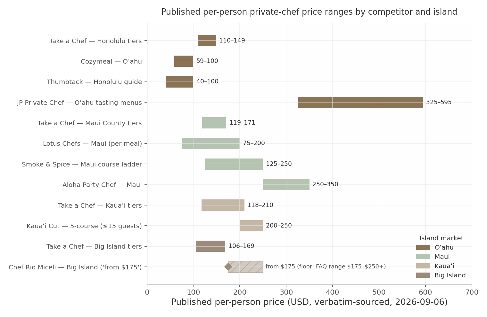

The chart and table support four evidence-based conclusions. **First, the marketplace band is the market's center of gravity:** Take a Chef's average booked menu lands at ~$175–$176/pp on Maui, Kauaʻi, and Big Island and $190.6/pp in Honolulu — noting that Honolulu's average exceeds every published tier because averages reflect booked menu choices and add-ons while tiers are base group-size rates; the two must never be conflated.[^07-2^][^07-3^][^07-4^][^07-5^] **Second, local chefs who publish cluster in two tiers:** transparent-value operators ($115–$150/hr or $125–$250/pp — Kristin, Dani Felix, Smoke & Spice, Kauaʻi Cut, Lotus) and ultra-premium tasting-menu operators ($250–$595/pp — JP, Chef Matt, Rio's floor). The $150–$250/pp villa-dinner band between the marketplace ceiling and the ultra-premium floor is exactly where published local supply is thinnest. **Third, the pricing *architecture* converges even where prices don't:** groceries billed separately at cost, support staff at $50–$75/hr or $225/server flat, published holiday premiums, zoned flat travel fees — these are Hawaii market norms any credible rate card must match, not inventions.[^07-12^][^07-13^][^07-14^] **Fourth, multi-day pricing barely exists:** only Lotus ($179–$300+/pp/day) and Yhangry's boilerplate "$300 to $3000" day range publish anything beyond single events — the "chef for the week" is essentially unpriced in public anywhere in the state, precisely the segment (7.05–7.94-day average island stays, Feb 2026 DBEDT) where visitor economics favor it most.[^07-15^][^07-9^][^07-55^]

#### 2.3.2 Catering and wedding catering pricing evidence — staffing, service charges, minimums

Wedding catering is the largest single ticket in the market — and its pricing evidence lives almost entirely with planners, directories, and venue rate cards, not caterers. Per the cross-verification reconciliation, the canonical statewide anchors are **17,370 weddings and $927M total spend in 2025, average cost $53,369 (mean, skewed by luxury weddings) and median $21,117 (the "typical" wedding), with 74–84 guests on average** — never average these against blog estimates like "$34,000" or "$40,000," which the verification report grades low-confidence.[^07-60^]

| Source | Island | Item | Exact published price (verbatim) | Citation |
|---|---|---|---|---|
| Maui Wedding Vendors (2026 directory) | Maui | Per-person by service style | "Heavy appetizers / cocktail $60–$90… Buffet dinner $80–$120… Plated dinner (2–3 courses) $120–$200… Open bar (5 hrs) $40–$80… Service staff + rentals $20–$40… For a 60-guest wedding with buffet dinner and open bar, budget roughly $10,000–$16,000 for food and beverage" | [^04-52^] |
| Jason Raffin (catering guide) | Maui | Per-person tiers + service charge | "Budget tier: $50-75 per person… Mid-tier: $75-125… Premium tier: $125-200+… Service charges (usually 18-22%)" | [^07-23^] |
| Aloha Bridal Connections (planner, 2026) | Oʻahu | Buffet basis + real-wedding case | "Catering: $13,000 – $18,000… Buffet Service for $75/head + staffing + taxes/fees"; real ~75-guest estate wedding: "Catering: $12,000 (Average $60/pp + staffing + rentals + service fees)" | [^07-22^] |
| Aloha Bridal Connections (planner, 2026) | Kauaʻi | Estate catering | "estate-wedding catering for 50 guests: $12,000+ (Average $75/pp + staffing + rentals + service fees)"; 75-guest Kauaʻi wedding $50,000–$75,000 | [^05-34^] |
| Kenekes | Oʻahu | Published wedding packages | "$67.88–$108.88 per guest" incl. delivery, staff, cake service | [^03-36^] |
| A Catered Experience | Oʻahu | Staffing tiers, minimums, fee stack | "$525.00 ($2,000 food minimum)" for 100–150 guests scaling to "$675.00 ($5,000 food minimum)" for 251–300; "$200.00/attendant"; "A 20% service fee and 4.712% tax added to total"; "$300.00 or 450.00 minimum purchase depending on the location" | [^07-21^] |
| Papa Kona | Big Island | Per-person, delivery, deposit, service charge | "packages begin at $44 per person for professional service, with food menus typically ranging from $45 to $85 per person"; "Delivery ranges from $100 to $500"; "deposit equal to $2,000 or 50% of the total event cost, whichever is less"; venue packages $4,000–$9,200; 23% service charge | [^07-20^][^06-15^] |
| Fairmont Orchid | Big Island (Kohala) | Venue F&B minimums + service charge | Packages "$5,000–15,000/event… food & beverage minimum of $8,500 (Monday–Thursday) and $15,000 (Friday–Sunday)… Meals (when priced separately) $120/person and up… Service Charge 25%"; elopement $3,500–$4,500 | [^06-36^][^06-35^] |
| Four Seasons Hualalai | Big Island (Kohala) | Venue packages | "Package Prices $13,500/event and up"; "Ke Aloha Package for up to 20 guests starts at $12,500"; Wai Maoli O Hualalai $21,500 | [^06-38^] |
| Olowalu Plantation House | Maui | Venue-included catering packages | "$15,000 \| up to 30 guests… $18,000 \| up to 40 guests" incl. plated service + beer/wine/champagne + coordination | [^04-82^] |
| The Knot (2025 national study) | National benchmark | Per person | "The average catering cost per person is $80… ranges from $62–$123" by region | [^07-25^] |
| Food trucks (Roaming Hunger) | Maui | Budget floor | "$10–$25/pp, $550–$2,500 per event" | [^04-40^] |

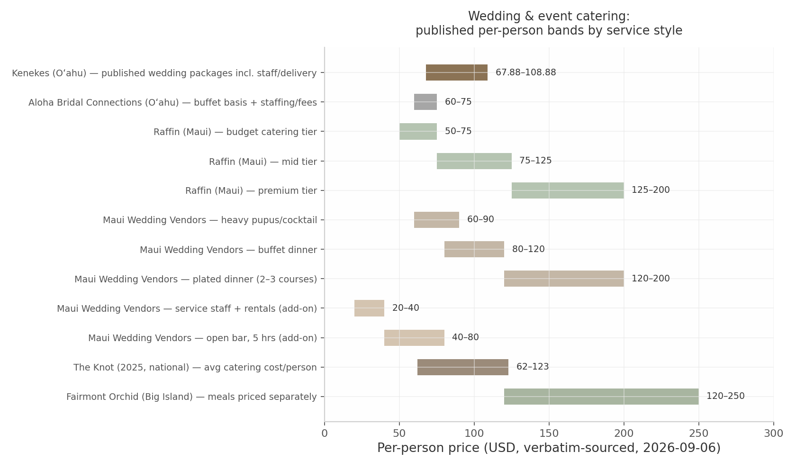

Four implications fall out of the wedding data. **First, the per-person ladder is consistent across independent sources:** budget buffet $40–$75, mid-tier $75–$125, plated premium $120–$200+, with staffing/rentals/bar adding $60–$120/pp on top — and service charges running 18–22% among independents against 23–25% at resorts (Papa Kona 23%, Fairmont Orchid 25%).[^07-23^][^06-15^][^06-36^] **Second, the fee stack is where incumbents are most vulnerable:** Tailor Made buries "Gratuity, Delivery, GE TAX 20% Service Charge & Labor & rentals" in fine print, Kauai Poke Co. adds "25% gratuity… to all food & drinks," and under HRS §481B-14 a service charge must be distributed to staff as tips or conspicuously disclosed otherwise — exact disclosure wording REQUIRES LEGAL VERIFICATION before myCHEF's own fee-stack copy is locked.[^03-37^][^05-17^][^07-32^] **Third, deposits and minimums are publishable mechanics, not secrets:** Papa Kona's "$2,000 or 50%," ACE's $2,000–$5,000 food minimums, and venue F&B minimums of $8,500–$15,000 prove the market tolerates published thresholds — operators simply choose not to publish them.[^07-20^][^07-21^][^06-36^] **Fourth, the wedding-week is the unpriced product:** caterers quote the reception; the welcome dinner, rehearsal, and recovery brunch are re-procured meal by meal, and the only documented bundles (CJ's, resort packages) wrap the venue's own catering. A single culinary contract across the week is structurally available to a private-chef network and structurally unavailable to a venue caterer.[^04-30^][^04-92^]

#### 2.3.3 What competitors hide vs publish — the transparency gap myCHEF can own

Aggregating the four island databases yields the starkest finding in this chapter: price opacity is the market's equilibrium, and it holds across every island and every competitor class.

| Island | Local operators profiled | Locals publishing ANY price | Who publishes (and what) | Wedding caterers publishing prices |
|---|---|---|---|---|
| Oʻahu | 23 | 2 of ~15 locals | JP Private Chef ($325–$595/pp tasting menus); Kenekes ($67.88–$108.88 wedding pkgs); Tailor Made publishes fee structure only | 0 (Kenekes excepted — value segment) |
| Maui | 15+ | 4 | Chef Kristin (hourly card + fee stack); Smoke & Spice (course ladder + staffing); Lotus Chefs (per-meal/per-day bands); Aloha Party Chef ($250–$350/pp FAQ) | 0 of 8+ profiled |
| Kauaʻi | 14 locals | 2 (3 incl. casual-tier Kauai Poke Co.) | Dani Felix (hourly + travel + holiday); Kauaʻi Cut ($200–$250/pp); Kauai Poke Co. (fees, casual tier) | 0 |
| Big Island | 12 locals | 1 | Rio Miceli ("from $175/pp" floor only) | 0 (Papa Kona publishes packages — venue-caterer hybrid) |
| Marketplaces | 7 platforms | All (tiers/averages) | Take a Chef per-island tiers; Cozymeal/MiumMium/Thumbtack anchors; Yhangry/MiumMium figures are cross-geography boilerplate | n/a |
| **myCHEF (reference, Ch.1)** | 4 island properties | **Full rate cards on all four** | Per-person bands, staffing hourlys, day rates, travel zones, deposits, 20% service + GET lines — the only complete published tariff in-market | Publishes wedding-week pricing |

Sources: island databases §2.2.1–2.2.4; transparency counts corroborated across all four island research dimensions and the statewide synthesis.[^03-36^][^04-2^][^04-18^][^04-5^][^04-15^][^05-1^][^05-5^][^06-3^]

The "so what" is a structural claim, not a marketing one. Local chefs *cannot* publish fixed rate cards without abandoning the per-event quoting flexibility their one-person capacity model depends on; marketplaces *cannot* publish confirmed totals because their revenue model is chef-bid variance. The gap is therefore durable — and it sits precisely on the highest-intent informational demand in the category. The cost-query SERP proves the vacuum: "private chef Hawaii cost" triggers an AI Overview that synthesizes pricing from Jason Raffin's blog, Chef Kristin, Take a Chef, and a vacation-rental estate's blog — a competitor, one transparent local, a marketplace, and a villa company are the only sources Google can find.[^08-14^] Meanwhile the marketplace location pages that fill the gap are demonstrably beatable on quality: Take a Chef's statewide Hawaii page reuses its Maui tier table number-for-number, and its Maui page's H1 erroneously reads "Private Chef in Kula" — template artifacts a curated island page with real prices, real logistics (Hanalei Bridge clauses, Kona–Hilo travel zones, Waikīkī COI handling), and a confirmed written total outclasses on every trust signal.[^07-1^][^07-2^][^08-4^] This is the wedge the rebuild preserves and amplifies; the mechanics of the rate card itself are Chapter 5's domain.

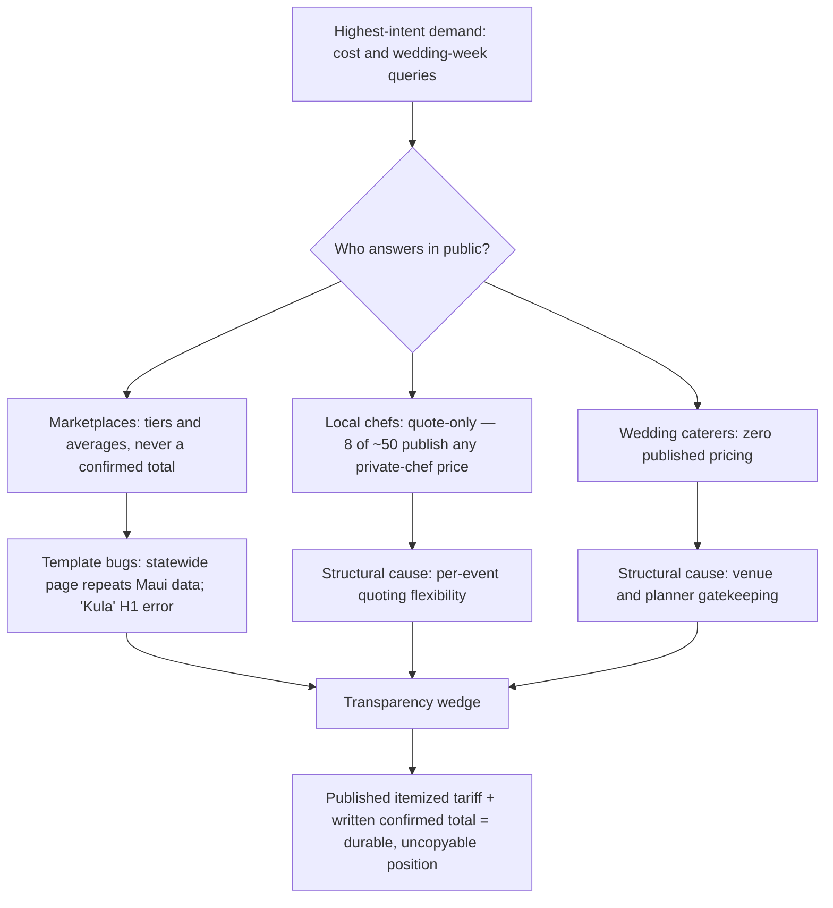

---

### 2.4 Sister-Site Patterns (mychef.ae / mychef.id)

The competitor analysis above describes the market myCHEF fights in; the sister sites describe the playbook the network has already proven in two other vacation-luxury markets. Both patterns matter to this chapter for one reason: they show that the transparency wedge documented in §2.3.3 is not a Hawaii experiment — it is the network's house style, executed at scale elsewhere.[^02-1^][^02-10^]

#### 2.4.1 Transferable architecture, packaging and conversion patterns

**Two-core product grammar.** Both sites organize everything around two cores — Dubai: "A chef for your house, or catering for your event… Two core services, and four more built on them"; Bali: "Private chef — a stay" vs "Catering — one meal," with add-ons explicitly "stacked on" the cores, "not equal heroes on this page." Every commercial page carries a product router ("You are on the right page").[^02-1^][^02-10^][^02-7^] Hawaii's homepage already runs this grammar (private chef / catering / Stay Chef); the rebuild extends the router to every commercial page.

**Package cards with worked math — the single most transferable pricing pattern.** Dubai packages the recurring chef as four named "jobs," each hours + one fixed price (Fresh Meal AED 750 / Kitchen on Autopilot AED 1,050 / Full-Day AED 1,500), plus occasion-named, guest-count-anchored cards (Date Night, 2 guests, from AED 1,200). Bali multiplies per-person prices across guest counts in the copy itself ("2 guests IDR 1.4M++ · 4 guests IDR 2.8M++ · 8 guests IDR 5.6M++ · 12 guests IDR 8.4M++") and works the month on the pricing page ("16 visits. You pay AED 16,800").[^02-4^][^02-5^][^02-13^][^02-17^] This is exactly the presentation layer §2.3's evidence calls for: the market quotes ranges; the sister sites teach the reader to compute their own total — then confirm it in writing ("The figure you see here is the figure your quote is built from — fixed, itemised, and confirmed before you pay anything").[^02-13^]

**Estimators and taught fee notation.** Both sites embed interactive estimate builders (service type → guests → duration → add-ons → live subtotal → "Get exact quote on WhatsApp") with the honest disclaimer that the written proposal is the confirmed total. Bali coined its own tax notation — "++" = 11% government tax + 10% service, ×1.21 all-in — with a dedicated FAQ entry; Dubai puts VAT on its own line. Hawaii's existing equivalent ("Service 20% and Hawaiʻi GET up to 4.7120% appear as separate lines") is the same pattern, already drafted — and §2.3.2 shows the local market actively fumbling fee disclosure, so formalizing the notation site-wide converts an industry-wide trust deficit into proof of honesty.[^02-13^][^02-14^][^02-4^][^02-20^]

**WhatsApp-first conversion with published promises.** WhatsApp is the primary conversion channel on both sites, with published response-time promises ("Typical reply within 15 min during business hours" Dubai; "reply in 2h" Bali), proposal-framed CTAs ("Request a proposal"), a minimal-information ask ("Date, guest count and area… That is enough to start"), and reassurance microcopy at every CTA (50% deposit, cancellation tiers, replacement guarantee "within 2 hours or refund 100%").[^02-1^][^02-14^][^02-10^][^02-18^]

**Trust and programme layers.** Repeating 3–4-item trust-badge strips; dedicated vetting pages; booking-protection and quality-guarantee programmes; "what we won't do" negative-space trust copy (Dubai declines chef-level upsells — "Recognising a chef is our cost, not yours"; Bali declines same-day dinners); ethical capacity honesty ("six places this September") instead of countdown timers; and comparison tables vs freelance chefs and marketplaces with evidence rows (backup guarantee, published prices, food-safety certification).[^02-4^][^02-10^][^02-16^][^02-18^]

**Architecture and AI-crawler posture.** Both sites put pricing at sitemap priority 0.8–0.9 — pricing as a first-class landing page — inside commented, governed sitemaps and hub-and-spoke silos. Bali's robots.txt explicitly welcomes AI crawlers (GPTBot, ClaudeBot, PerplexityBot, Google-Extended, et al.) "for citations" and references an llms.txt — the network's AI-search template, worth copying verbatim as a file structure. Bali's 60+ programmatic location pages demonstrate the non-thin template (unique local copy, pricing block, comparison table, local-knowledge section) Hawaii's corridor pages must match to avoid doorway-page risk.[^02-2^][^02-11^][^02-12^][^02-15^]

#### 2.4.2 Explicit do-not-copy list (market-specific claims, pricing, policies)

The sister sites are a mechanics library, not a content source. The following must never cross over to the Hawaii properties — every item is market-specific, and several would be actively false or legally risky in Hawaii:[^02-13^]

1. **All prices and currencies.** Every AED and IDR figure, per-person rate, deposit amount, and discount tier. Hawaii sets its own USD pricing — which already exists on the live site (Chapter 1) and must be re-derived from the Hawaii evidence base in §2.3, never anchored to Dubai's AED 750 visit or Bali's IDR 2.7M day rate.[^02-20^]
2. **Halal-first positioning.** "Halal-First Kitchen Standards," halal menu pages, Ramadan/Iftar/Eid catering — UAE-market-specific.[^02-1^][^02-2^]
3. **Bali-specific claims and logistics.** HACCP-certification claims (unless Hawaii chefs hold equivalent US credentials — verify before claiming); the "++" tax notation itself (11% + 10% Indonesian structure ≠ Hawaii's 4.5% GET + 20% service — Hawaii needs its own notation); villa-density claims, babi guling, floating breakfast, named local suppliers, WITA hours, NPWP paperwork.[^02-13^][^02-14^][^02-16^]
4. **Track-record numbers.** "560+ events served / 12,000+ guests / 98% Repeat or Referred / 4.9/5 Rating / Since 2019 / 50+ staff" (Bali) and "2 to 500+ guests per booking" (Dubai) are those markets' operating histories; Hawaii publishes only its own verifiable figures.[^02-18^][^02-1^]
5. **Named people.** Bali's eight chef profiles and four named coordinators; Dubai's chef personas. Hawaii needs its own real team as assets genuinely exist — importing profiles would violate the no-fabrication policy the market gap makes valuable.[^02-19^][^02-11^]
6. **Dubai employment/legal model language.** Visa references, Numini FZC entity disclosure, Dubai Municipality standards, "a licensed supplier employs the chef" — Hawaii requires its own legal/entity framing (DOH permits, county liquor rules, GET registration per §2.3.2's regulatory context).[^02-6^][^02-8^]
7. **Market-specific occasions and venues.** Yachts-as-default, desert dining, iftar; Bali's retreats/yoga/surf framing — replaced by Hawaii occasions, with luau-adjacent celebrations handled carefully for cultural sensitivity.[^02-2^][^02-11^]
8. **Testimonials.** All quoted reviews reference Bali/Dubai places and dates; never reuse.[^02-18^][^02-17^]
9. **Verbatim phrasing generally.** The shared house style ("the price is the price") is fine; identical paragraphs ("kitchen left exactly as we found it") must be rewritten to avoid duplicate-content signals across the network.[^02-13^]

The forward-looking implication: Hawaii is the network's third market, and the evidence in this chapter says it is the one where the house style matters most. Dubai and Bali prove the mechanics — worked math, taught fee notation, WhatsApp-first conversion, AI-crawler posture — at commercial scale; §2.3 proves the Hawaii market is *more* opaque than either sister market's competitive set, not less. A rebuild that ports the mechanics while respecting the do-not-copy list does not merely match the local competition's information quality; it operates a category above it, with no in-market actor structurally able to follow.

---

### Sources

[^02-1^] https://mychef.ae — myCHEF Dubai homepage (accessed 2026-09-06)
[^02-2^] https://www.mychef.ae/sitemap.xml — full URL inventory with silo comments (accessed 2026-09-06)
[^02-4^] https://www.mychef.ae/private-chef-dubai/pricing — four-job price table, calculator, cost drivers, policies, FAQ (accessed 2026-09-06)
[^02-5^] https://www.mychef.ae/menus — starter packages, per-person format rates, dietary matrix (accessed 2026-09-06)
[^02-6^] https://www.mychef.ae/catering-packages-dubai — package hub, occasion router, silo-map blocks, global footer (accessed 2026-09-06)
[^02-7^] https://www.mychef.ae/private-chef-dubai — household-chef hub, product router, level system (accessed 2026-09-06)
[^02-8^] https://www.mychef.ae/contact — enquiry routing, minimal quote brief (accessed 2026-09-06)
[^02-10^] https://mychef.id/ — myCHEF Bali homepage (stay vs one-meal split, guarantees, add-ons framing) (accessed 2026-09-06)
[^02-11^] https://mychef.id/sitemap.xml — ~200 URLs across service/location/editorial silos (accessed 2026-09-06)
[^02-12^] https://mychef.id/robots.txt — explicit AI-crawler allows + llms.txt reference (accessed 2026-09-06)
[^02-13^] https://mychef.id/pricing — at-a-glance rate table, embedded estimator, guest-count math table (accessed 2026-09-06)
[^02-14^] https://mychef.id/faq — categorised FAQ, "++" explanation, deposit/cancellation tiers (accessed 2026-09-06)
[^02-15^] https://mychef.id/private-chef/seminyak — programmatic location-page template (accessed 2026-09-06)
[^02-16^] https://mychef.id/fine-dining/menus — 24 set menus, course breakdowns, dietary flags, priced add-ons (accessed 2026-09-06)
[^02-17^] https://mychef.id/catering/villa-catering — chapter-structured commercial page, packages, testimonials (accessed 2026-09-06)
[^02-18^] https://mychef.id/why-mychef — evidence pillars, freelance/marketplace comparison table, guarantees (accessed 2026-09-06)
[^02-19^] https://mychef.id/contact — named project coordinators, WhatsApp-prefill form, office address (accessed 2026-09-06)
[^02-20^] https://mychef-hawaii.com — current Hawaii homepage (spot-check for comparative notes) (accessed 2026-09-06)
[^03-1^] https://www.airbnb.com/services/6284002 — Airbnb Services, "Private Chef Experience in Oahu Hawaii," prices in BRL (accessed 2026-09-06)
[^03-4^] https://www.takeachef.com/en-us/private-chef/waikiki — Waikiki pricing tiers, chef counts, review stats (accessed 2026-09-06)
[^03-5^] https://www.takeachef.com/en-us/private-chef/honolulu-county — Honolulu County tiers, guests served, avg menu price (accessed 2026-09-06)
[^03-7^] https://www.cozymeal.com/oahu/personal-chefs — Oʻahu per-person pricing and FAQ (accessed 2026-09-06)
[^03-9^] https://www.cozymeal.com/chefs/2632/chef-analea — Oahu chef profile, 5.0/1 review (accessed 2026-09-06)
[^03-10^] https://yhangry.com/f/private-chefs/us-hawaii-honolulu--county-oahu/ — Oʻahu average spend and hourly range (accessed 2026-09-06)
[^03-11^] https://yhangry.com/f/private-chefs/us-hawaii/ — Hawaii-level page, same $817 average (accessed 2026-09-06)
[^03-12^] https://yhangry.com/s/private-chef-jobs/us-hawaii-honolulu--county-oahu/ — Oʻahu chef-count stats (accessed 2026-09-06)
[^03-13^] https://www.miummium.com/en-us/personal-chef-honolulu — all-in per-person average (accessed 2026-09-06)
[^03-14^] https://www.thumbtack.com/hi/honolulu/private-chefs — Honolulu personal-chef cost guide (accessed 2026-09-06)
[^03-16^] https://personalchefoahu.com/menu-privatechefoahu — JP Private Chef tasting-menu pricing (accessed 2026-09-06)
[^03-17^] https://www.takeachef.com/en-us/chef/jeffrey-pearson5 — Jeffrey Pearson platform profile (accessed 2026-09-06)
[^03-18^] https://www.jpfinefoodsllc.com/ — JP Fine Foods LLC, BBB/insurance claims (accessed 2026-09-06)
[^03-19^] https://www.chefcocohawaii.com/ — Chef Coco Hawaii (accessed 2026-09-06)
[^03-21^] https://privatedininghawaii.com/ — Private Dining Hawaii / Chef John Seymour (accessed 2026-09-06)
[^03-23^] https://www.coherentmarketinsights.com/industry-reports/hawaii-and-california-private-chef-service-market — market size, segmentation, key players (accessed 2026-09-06)
[^03-24^] https://chefdavidpaul.com/services/personal-chef-honolulu — Chef David Paul personal chef page (accessed 2026-09-06)
[^03-25^] https://chefdavidpaul.com/services/personal-chef-honolulu/anniversary-dinner — occasion subpage, James Beard claim (accessed 2026-09-06)
[^03-27^] https://builtin.com/company/a-catered-experience-inc — A Catered Experience company history (accessed 2026-09-06)
[^03-30^] https://www.theknot.com/marketplace/catering-oahu-hi — The Knot Oʻahu catering directory (accessed 2026-09-06)
[^03-31^] https://memoirshawaii.com/ — Memoirs Hawaii (accessed 2026-09-06)
[^03-32^] https://www.alohaculinarygroup.com/ — Aloha Culinary Group (accessed 2026-09-06)
[^03-33^] https://morepleaze.com/ — More Pleaze chef network (accessed 2026-09-06)
[^03-36^] https://www.kenekes.net/catering.html — Kenekes published wedding packages (accessed 2026-09-06)
[^03-37^] https://www.tmcustomcatering.com/services — Tailor Made fee structure (accessed 2026-09-06)
[^03-38^] https://www.foodfireknives.com/honolulu-private-chefs — Food Fire + Knives Honolulu page (accessed 2026-09-06)
[^03-40^] https://www.localmealprep.com/all-states — Hawaiʻi meal-prep companies (accessed 2026-09-06)
[^03-41^] https://365taskers.com/cost-guide/chef-meal-prep/honolulu — meal-prep hourly cost guide (ESTIMATED-grade) (accessed 2026-09-06)
[^03-47^] https://roadgenius.com/statistics/tourism/usa/hawaii/oahu/ — Oʻahu 2024 source markets (aggregator) (accessed 2026-09-06)
[^03-48^] https://www.espaciowaikiki.com/experiences/private-chef-experience/ — ESPACIO in-suite kaiseki (accessed 2026-09-06)
[^03-49^] https://dbedt.hawaii.gov/blog/26-04/ — DBEDT Oʻahu CY2025 visitor statistics (accessed 2026-09-06)
[^03-53^] https://rmoceanfrontrentals.com/luxury-vacation-rentals/oahu/ — Kahala villa area, chef/ concierge services (accessed 2026-09-06)
[^03-55^] https://gathervacations.com/vrp/unit/490/ — Ko Olina Beach Villas chef kitchens (accessed 2026-09-06)
[^03-59^] https://pipelineshores.com/pages/ultimate-activity-guide-to-oahu — North Shore villa concierge private chef (accessed 2026-09-06)
[^03-60^] https://www.exoticestates.com/property/hawaii-vacation-rentals/oahu-villas/aloha-nalu — Hawaiʻi Kai villa chef/ concierge (accessed 2026-09-06)
[^03-64^] https://www.happylaulea.com/blogs/articles/hawaii-wedding-statistics — 2021 Hawaiʻi wedding counts, destination share, peak months (accessed 2026-09-06)
[^03-66^] https://emilychoyphotography.com/oahu-wedding-venues/ — Waimea Valley exclusive caterer (accessed 2026-09-06)
[^04-2^] https://www.chefkristin.com/services/ — Chef Kristin verbatim pricing structure, gratuity, tax, deposit (accessed 2026-09-06)
[^04-3^] https://lotuschefs.com/ — Lotus Chefs team, services, positioning (accessed 2026-09-06)
[^04-4^] https://lotuschefs.com/private-chef-fine-dining-maui/ — fine-dining $165/pp start, 80% local sourcing (accessed 2026-09-06)
[^04-5^] https://lotuschefs.com/family-friendly-private-chef-services-maui/ — per-meal and per-day price bands (accessed 2026-09-06)
[^04-6^] https://www.mauioceanfrontdining.com/blog/how-to-find-exclusive-chef-events-in-maui/ — Lotus tasting-menu price range (accessed 2026-09-06)
[^04-8^] https://www.jasonraffin.com/post/private-chef-maui-the-luxury-dining-experience-that-brings-the-restaurant-to-you — Raffin story and services (accessed 2026-09-06)
[^04-9^] https://www.jasonraffin.com/post/maui-private-chef-hire-elevate-your-event-with-a-personal-culinary-experience — "$100 to $250 per person" (accessed 2026-09-06)
[^04-10^] https://www.jasonraffin.com/post/breaking-down-the-cost-of-a-private-chef-in-maui-private-chef-pricing-maui — price breakdown, family-of-six example (accessed 2026-09-06)
[^04-11^] https://www.jasonraffin.com/privatechef — "500+ five-star Google reviews" claim (accessed 2026-09-06)
[^04-12^] https://www.takeachef.com/en-us/chef/jason-raffin2 — Raffin platform profile (accessed 2026-09-06)
[^04-13^] https://www.jasonraffin.com/post/maui-catering-services — catering tiers and service charges (accessed 2026-09-06)
[^04-14^] https://alohapartychef.com/ — Aloha Party Chef positioning (accessed 2026-09-06)
[^04-15^] https://alohapartychef.com/faqs-private-chef-maui — "$250-$350 per person" (accessed 2026-09-06)
[^04-16^] https://www.aliiresorts.com/maui-vacation-private-chef/ — Ali'i Resorts × Chef Matt partnership, Mama's Fish House background (accessed 2026-09-06)
[^04-17^] https://www.valandjohnprivatechefs.com/ — Val & John Private Chefs (accessed 2026-09-06)
[^04-18^] https://www.smokeandspicemaui.com/mauiprivatechefpricing — course ladder, staffing rates (accessed 2026-09-06)
[^04-19^] https://www.smokeandspicemaui.com/bbq-and-menus-1 — BBQ drop-off pricing, smoker fee, deposit (accessed 2026-09-06)
[^04-20^] https://www.cozymeal.com/maui/personal-chefs — Maui per-person pricing (accessed 2026-09-06)
[^04-21^] https://talents.vaia.com/companies/cozymeal/private-chef-maui-hi-134471260/ — Cozymeal recruiting Maui chefs (accessed 2026-09-06)
[^04-22^] https://www.takeachef.com/en-us/private-chef/maui — Maui tiers, guests served, average menu (accessed 2026-09-06)
[^04-24^] https://www.theknot.com/marketplace/catering-maui-hi — The Knot Maui catering directory (accessed 2026-09-06)
[^04-26^] https://caratsandcake.com/vendor/cutting-edge-catering — Cutting Edge profile (accessed 2026-09-06)
[^04-28^] https://www.stylemepretty.com/hawaii-weddings/maui/ — Cutting Edge editorial features (accessed 2026-09-06)
[^04-29^] https://www.alignable.com/kihei-hi/tarragon-maui-catering — Tarragon Maui Catering (accessed 2026-09-06)
[^04-30^] https://cjsmaui.com/an-all-inclusive-maui-wedding-package-details-and-bbq-rehearsal-dinner/ — welcome BBQ + reception + brunch bundle (accessed 2026-09-06)
[^04-31^] https://cjsmaui.com/5-maui-catering-services-for-events-and-catered-wedding-receptions/ — CJ's full-service wedding catering (accessed 2026-09-06)
[^04-32^] https://www.theknot.com/marketplace/catering-hilo-hi — Celebrations by Bev Gannon listing (accessed 2026-09-06)
[^04-34^] https://aperfectparadisewedding.com/Blog/love-at-the-kukahiko-estate-makena-maui-2/ — Food for the Soul at Kukahiko (accessed 2026-09-06)
[^04-37^] https://www.weddingwire.com/c/hi-hawaii/wedding-caterers/3-sca.html — WeddingWire Hawaiʻi caterer reviews (accessed 2026-09-06)
[^04-40^] https://roaminghunger.com/maui-hi/food-truck-catering/ — food-truck catering costs (accessed 2026-09-06)
[^04-49^] https://www.happylaulea.com/blogs/articles/hawaii-wedding-statistics — 2021 Maui wedding count (accessed 2026-09-06)
[^04-52^] https://mauiweddingvendors.com/maui-wedding-cost/ — Maui catering/bar per-person table (accessed 2026-09-06)
[^04-53^] https://mauidestinationweddings.com/maui-beach-wedding-permits-complete-guide-2026/ — DLNR beach-permit caps (accessed 2026-09-06)
[^04-58^] https://hawaii.com/blog/visiting-lahaina-maui-2026 — post-fire West Maui demand shift (accessed 2026-09-06)
[^04-60^] https://mauinow.com/2025/08/29/visitor-spending-and-visitor-arrivals-declined-in-july-2025/ — Maui recovery vs pre-fire levels (accessed 2026-09-06)
[^04-79^] https://radicalstorage.com/travel/destination-wedding-statistics/ — Maui top-25 destination-wedding ranking (accessed 2026-09-06)
[^04-82^] https://www.olowaluplantationhouse.com/rates/ — Olowalu Signature Wedding Experience packages (accessed 2026-09-06)
[^04-84^] https://www.wedaways.com/properties/grand-wailea-a-waldorf-astoria-resort/ — Grand Wailea packages (accessed 2026-09-06)
[^04-85^] https://www.herecomestheguide.com/wedding-venues/hawaii/grand-wailea-resort-and-spa — Grand Wailea package price (accessed 2026-09-06)
[^04-86^] https://www.amauiweddingday.com/maui-wedding-venues/haiku-mill — Haiku Mill rate card (accessed 2026-09-06)
[^04-87^] http://haikumill.com/events/ — Haiku Mill preferred-vendor requirement, outside-vendor fee (accessed 2026-09-06)
[^04-92^] https://matiasezcurraphotography.com/ritz-carlton-kapalua-a-luxury-maui-wedding-venue/ — Ritz-Carlton Kapalua wedding-weekend pattern (accessed 2026-09-06)
[^04-93^] https://amyjaynephotography.com/legal-requirements-for-maui-weddings-your-essential-guide/ — Wiki permit rules (accessed 2026-09-06)
[^04-95^] https://www.jasonraffin.com/privatediningmaui — Raffin wedding/rehearsal/brunch services (accessed 2026-09-06)
[^05-1^] http://www.privatechefkauai.com/pricing — Private Chef Kauai (Dani Felix) rate card, travel fees (accessed 2026-09-06)
[^05-2^] https://www.kauaiprivatechef.com/Services.html — Kauai Private Chef services, kitchen stocking (accessed 2026-09-06)
[^05-3^] https://farmcookkauai.com/ — Farm Cook Kauai (accessed 2026-09-06)
[^05-4^] https://koloalandingresort.com/kauai-wedding-planning-guide?blog=true — Koloa Landing wedding guide (accessed 2026-09-06)
[^05-5^] https://kauaicutcatering.com/ — Kauaʻi Cut five-course per-person pricing (accessed 2026-09-06)
[^05-6^] https://www.aniastable.com/kauai-private-chef — Ania's Table Kauaʻi services (accessed 2026-09-06)
[^05-7^] https://www.aniastable.com/private-chef-and-catering — Ania's Table retreat & wellness catering (accessed 2026-09-06)
[^05-8^] http://www.goodfoodhanalei.com/ — Good Food Hanalei (accessed 2026-09-06)
[^05-9^] https://www.fincamakalehakauai.com/ — Finca Makaleha (accessed 2026-09-06)
[^05-11^] http://chef-leo-kauai.com/events/weddings — Chef Leo wedding catering, dietary list (accessed 2026-09-06)
[^05-13^] https://www.kauaimusicscene.com/i/-contemporary-flavors — Contemporary Flavors profile (accessed 2026-09-06)
[^05-14^] https://www.weddingwire.com/reviews/contemporary-flavors-catering-lihue/407b1461992f111b.html — Contemporary Flavors WeddingWire reviews (accessed 2026-09-06)
[^05-16^] https://kauai.mychef-hawaii.com/weddings — myCHEF Kauaʻi pages (pricing, bridge clause, inquiry-stage stance) (accessed 2026-09-06)
[^05-17^] https://kauaipokeco.com/cater — Kauai Poke Co. catering/site fees, 25% gratuity (accessed 2026-09-06)
[^05-19^] https://www.honupointvacationrental.com/tahiti-nui-restaurant-hanalei-hawaii/ — Tahiti Nui luau pricing (2020-dated) (accessed 2026-09-06)
[^05-20^] https://www.takeachef.com/en-us/private-chef/kauai — Take a Chef Kauaʻi stats and tiers (accessed 2026-09-06)
[^05-23^] https://yhangry.com/s/private-chef-jobs/us-hawaii-kauai--county/ — yhangry Kauaʻi County stats (boilerplate) (accessed 2026-09-06)
[^05-24^] https://yhangry.com/f/private-chefs/us-hawaii-kauai--county-princeville/ — yhangry Princeville page (accessed 2026-09-06)
[^05-29^] https://www.exceptionalvillas.com/secret-cove/l52002 — Secret Cove Kīlauea rate card (accessed 2026-09-06)
[^05-32^] https://dbedt.hawaii.gov/blog/26-04/ — DBEDT Kauaʻi CY2025 visitor statistics (same DBEDT release as [^03-49^]; not independent corroboration) (accessed 2026-09-06)
[^05-33^] https://wedding.report/action/wedding_statistics/view/market/id/15007/idtype/c/location/Kauai_HI/ — 2025 Kauaʻi wedding market (accessed 2026-09-06)
[^05-34^] https://alohabridalconnections.com/what-does-it-cost-to-get-married-on-kauai/ — Kauaʻi wedding cost breakdown (accessed 2026-09-06)
[^05-35^] https://bookretreats.com/s/yoga-retreats/kauai — Kauaʻi retreat listings and prices (accessed 2026-09-06)
[^05-36^] https://www.cometogetherwellness.com/ — Come Together Wellness (private-chef culinary experience) (accessed 2026-09-06)
[^05-40^] https://hidot.hawaii.gov/highways/2025/05/page/2/ — HDOT Hanalei Bridge closures (accessed 2026-09-06)
[^05-41^] https://hidot.hawaii.gov/blog/2025/03/28/full-closures-of-kuhio-highway-at-hanalei-hillside-every-half-hour-april-1-2/ — HDOT Hanalei Hill closures (accessed 2026-09-06)
[^05-66^] https://roadgenius.com/statistics/tourism/usa/hawaii/kauai/ — Kauaʻi visitor source markets (accessed 2026-09-06)
[^06-2^] https://epicurate.vip/experiences/hawaii/culinary/family-style-meals/family-style-dinner-with-chef-rio/cmkyfkw8i00a00os662mlyuiv — Epicurate listing, Kohala Coast communities (accessed 2026-09-06)
[^06-3^] https://www.riochef.com/menus — "Starting prices begin at $175 per person" (accessed 2026-09-06)
[^06-4^] https://www.riochef.com/post/private-chef-on-hawaii-s-big-island-your-questions-answered — Rio Chef FAQ pricing (accessed 2026-09-06)
[^06-5^] Epicurate (as [^06-2^]) — server staffing fee, capacity (accessed 2026-09-06)
[^06-6^] https://www.thekaniniestate.com/the-best-private-chefs-for-an-elite-luxury-villa-experience/ — Kanini Estate chef guide (accessed 2026-09-06)
[^06-7^] https://www.takeachef.com/en-us/private-chef/big-island — Big Island tiers, chefs, guests, reviews (accessed 2026-09-06)
[^06-8^] https://www.kaimana.co/ — Chef Kaimana (accessed 2026-09-06)
[^06-9^] https://www.chefjusgambing.com/ — Chef Jus Gambing (accessed 2026-09-06)
[^06-10^] https://www.maxokamura.com/ — Chef Max Okamura (accessed 2026-09-06)
[^06-11^] https://www.mahiainachefs.com/ — Mahi'aina Personal Chefs (accessed 2026-09-06)
[^06-12^] https://cheftimothyjames.com/ — Chef Timothy James (accessed 2026-09-06)
[^06-13^] https://outrageousgourmet.com/ — Outrageous Gourmet (accessed 2026-09-06)
[^06-14^] https://www.theknot.com/marketplace/catering-big-island-hi — The Knot Big Island catering directory (accessed 2026-09-06)
[^06-15^] https://papakonaevents.com/ — Papa Kona venue packages, service charge (accessed 2026-09-06)
[^06-16^] https://www.theknot.com/marketplace/papa-kona — Papa Kona starting price (accessed 2026-09-06)
[^06-17^] https://www.zola.com/wedding-vendors/wedding-catering/papa-kona — Papa Kona per-person floor (accessed 2026-09-06)
[^06-18^] https://pacificmixcatering.com/ — Pacific Mix Catering (accessed 2026-09-06)
[^06-19^] https://kimosakamaicatering.com/ — Kimo's Akamai per-serving pupus (accessed 2026-09-06)
[^06-20^] https://www.zola.com/wedding-vendors/wedding-catering/kimos-akamai-catering-llc — Kimo's Akamai price floor (accessed 2026-09-06)
[^06-21^] https://www.weddingwire.com/biz/heartbeet-catering-hilo/40d6a32502374b92.html — HeartBeet Catering (accessed 2026-09-06)
[^06-23^] https://miummium.com/ (Kailua-Kona personal chef cost page) — per-person average (accessed 2026-09-06)
[^06-24^] https://bigisland.mychef-hawaii.com/ — myCHEF Big Island rate card, travel zones (accessed 2026-09-06)
[^06-27^] https://www.keteamhawaii.com/2024-big-island-real-estate-review-kailua-kona-and-resorts/ — 2024 resort-area real-estate medians (accessed 2026-09-06)
[^06-35^] https://www.fairmontorchid.com/gather/weddings/wedding-packages/ — Fairmont Orchid package tiers, F&B minimums (accessed 2026-09-06)
[^06-36^] https://www.herecomestheguide.com/wedding-venues/hawaii/fairmont-orchid — Fairmont Orchid packages, meals $120/pp+, 25% service (accessed 2026-09-06)
[^06-38^] https://www.herecomestheguide.com/wedding-venues/hawaii/four-seasons-resort-hualalai — FS Hualalai packages (accessed 2026-09-06)
[^07-1^] Take a Chef — Hire a Private Chef in Hawaii. https://www.takeachef.com/en-us/private-chef/hawaii (accessed 2026-09-06)
[^07-2^] Take a Chef — Private Chef in Maui (Kula). https://www.takeachef.com/en-us/private-chef/maui (accessed 2026-09-06)
[^07-3^] Take a Chef — Private Chef in Kauai. https://www.takeachef.com/en-us/private-chef/kauai (accessed 2026-09-06)
[^07-4^] Take a Chef — Hire a Private Chef in Big Island. https://www.takeachef.com/en-us/private-chef/big-island (accessed 2026-09-06)
[^07-5^] Take a Chef — Private Chef in Honolulu. https://www.takeachef.com/en-us/private-chef/honolulu (accessed 2026-09-06)
[^07-6^] Cozymeal — Private Chefs Oahu FAQ. https://www.cozymeal.com/oahu/personal-chefs (accessed 2026-09-06)
[^07-7^] Cozymeal — How Much Is a Personal Chef? https://www.cozymeal.com/private-chefs/how-much-is-a-personal-chef (accessed 2026-09-06)
[^07-8^] Thumbtack — Personal chefs near Honolulu, HI. https://www.thumbtack.com/hi/honolulu/personal-chefs (accessed 2026-09-06)
[^07-9^] Yhangry — Find a Private Chef in Hawaii. https://yhangry.com/f/private-chefs/us-hawaii/ (accessed 2026-09-06)
[^07-10^] MiumMium — Personal Chef Honolulu / Kailua-Kona. https://www.miummium.com/en-us/personal-chef-honolulu (accessed 2026-09-06)
[^07-11^] Chef Maison — Private Chef in Hawaii. https://chefmaison.com/en-us/services/private-chef/hawaii/ (accessed 2026-09-06)
[^07-12^] Chef Kristin — What We Do / Pricing Structure. https://www.chefkristin.com/services/ (accessed 2026-09-06)
[^07-13^] Private Chef Kauai (Chef Dani Felix) — Pricing. http://www.privatechefkauai.com/pricing (accessed 2026-09-06)
[^07-14^] Smoke & Spice Maui — Private Chef Options. https://www.smokeandspicemaui.com/mauiprivatechefpricing (accessed 2026-09-06)
[^07-15^] Lotus Chefs — Family Vacation Private Chef Services on Maui. https://lotuschefs.com/family-friendly-private-chef-services-maui/ (accessed 2026-09-06)
[^07-16^] The Kanini Estate — Best Private Chefs on the Big Island. https://www.thekaniniestate.com/the-best-private-chefs-for-an-elite-luxury-villa-experience/ (accessed 2026-09-06)
[^07-17^] Epicurate — Family Style Dinner with Chef Rio (Big Island). https://epicurate.vip/experiences/hawaii/culinary/family-style-meals/family-style-dinner-with-chef-rio/cmkyfkw8i00a00os662mlyuiv (accessed 2026-09-06)
[^07-18^] Kauai Private Chef — Services. https://www.kauaiprivatechef.com/Services.html (accessed 2026-09-06)
[^07-19^] Chef David Paul — Personal Chef Cost Honolulu. https://chefdavidpaul.com/services/personal-chef-honolulu/cost (accessed 2026-09-06)
[^07-20^] Papa Kona Events & Catering — Big Island Catering. https://www.papakonaevents.com/catering (accessed 2026-09-06)
[^07-21^] A Catered Experience — Off-Site Catering (Oahu). https://www.acateredexperience.com/off-site-catering/ (accessed 2026-09-06)
[^07-22^] Aloha Bridal Connections — What does it Cost to get Married in Hawaii (Oahu Edition). https://alohabridalconnections.com/what-does-it-cost-to-get-married-in-hawaii/ (accessed 2026-09-06)
[^07-23^] Jason Raffin — Maui Catering Services for Weddings & Events. https://www.jasonraffin.com/post/maui-catering-services (accessed 2026-09-06)
[^07-24^] Jason Raffin — Private Chef Pricing Maui. https://www.jasonraffin.com/post/breaking-down-the-cost-of-a-private-chef-in-maui-private-chef-pricing-maui (accessed 2026-09-06)
[^07-25^] The Knot — Average Wedding Catering Cost (2025 Real Weddings Study). https://www.theknot.com/content/average-cost-wedding-catering (accessed 2026-09-06)
[^07-28^] Hawaii Department of Taxation — County Surcharge on General Excise and Use Tax. https://tax.hawaii.gov/geninfo/countysurcharge/ (accessed 2026-09-06)
[^07-32^] ILWU Local 142 — Hawaii law requires service charge disclosure (HRS §481B-14). https://www.ilwulocal142.org/hawaii-law-requires-service-charge-disclosure (accessed 2026-09-06)
[^07-38^] County of Maui, Dept. of Liquor Control — Rules, Title MC-08 Chapter 101 (Class 13 caterer license). https://www.mauicounty.gov/DocumentCenter/View/106007/Rules---Chapter-101-PDF (accessed 2026-09-06)
[^07-41^] GetVendorLoop — How to Start a Food Truck in Hawaii (DOH per-island permits, Young Brothers barge). https://getvendorloop.com/guides/how-to-start-a-food-truck-in-hawaii (accessed 2026-09-06)
[^07-55^] DBEDT — Visitor Spending and Visitor Arrivals Increased in February 2026. https://dbedt.hawaii.gov/blog/26-12/ (accessed 2026-09-06)
[^07-60^] The Wedding Report — 2025 Hawaii Wedding Market Statistics. https://wedding.report/action/wedding_statistics/view/market/id/15/idtype/s/location/Hawaii/ (accessed 2026-09-06)
[^08-4^] Take a Chef — Maui (H1 template error observed via direct HTML fetch). https://www.takeachef.com/en-us/private-chef/maui (accessed 2026-09-06)
[^08-6^] Google SERP "private chef maui" (map pack; Raffin 534 GBP reviews). https://www.google.com/search?q=private+chef+maui (accessed 2026-09-06)
[^08-7^] Google SERP "private chef kauai" (map pack; Finca Makaleha 100 GBP reviews). https://www.google.com/search?q=private+chef+kauai (accessed 2026-09-06)
[^08-14^] Google SERP "private chef hawaii cost" (AI Overview sourcing). https://www.google.com/search?q=private+chef+hawaii+cost (accessed 2026-09-06)
[^08-40^] Take a Chef — Ko Olina. https://www.takeachef.com/en-us/private-chef/ko-olina (accessed 2026-09-06)
[^08-41^] Take a Chef — Lahaina. https://www.takeachef.com/en-us/private-chef/lahaina (accessed 2026-09-06)
[^08-42^] Take a Chef — Kapalua. https://www.takeachef.com/en-us/private-chef/kapalua (accessed 2026-09-06)
[^08-43^] Take a Chef — Princeville. https://www.takeachef.com/en-us/private-chef/princeville (accessed 2026-09-06)

---

## 3. Keyword Universe and Demand Analysis

The keyword research delivers one governing conclusion: demand for private-chef services in Hawaiʻi is real, geographically segmented, and already mapped by competitors into exactly the three-tier structure this rebuild adopts — statewide hub, four island properties, selective resort-area pages. Google's "People also search for" confirms independent demand at island level (Honolulu, Oʻahu, Big Island, Kona, Hilo) and resort-area level (Wailea, Lahaina, Kāʻanapali) [^08-1^][^08-6^]; Take a Chef's twelve Hawaiʻi location pages and yhangry's state/county/city pages are third-party capital validating the tier model [^08-2^][^08-25^][^08-44^]. This chapter defines the keyword universe by island, classifies intent and seasonality, assembles the real-question bank behind the FAQ system, and codifies the ownership-and-cannibalization controls every Chapter 4 sitemap row must trace back to.

### 3.1 Statewide Keyword Universe

#### 3.1.1 Statewide head terms and decision queries with intent classification

Three findings shape the statewide tier. First, "private chef Hawaii" is a HIGH-demand term with confirmed independent demand beneath it — related searches on the statewide SERP surface *Private chef Honolulu, Personal chef Oahu, Private chef Big Island, Kona private chef, Private chef hilo*, and the Maui SERP surfaces *Wailea, Lahaina, Kaanapali* and even *Private sushi chef Maui* [^08-1^][^08-6^]. Second, cost intent is the strongest informational thread in the state: the cost SERP carries an AI Overview, map pack, and PAA box simultaneously, and three competitors target it with dedicated blog content [^08-14^][^08-15^][^08-16^][^08-17^]. Third, vacation-rental intent ("chef for vacation rental Hawaii") is the fastest-growing commercial cluster and is ceded to rental-company concierge pages — no chef company ranks for it with a dedicated page [^08-18^][^08-20^].

| Keyword family | Representative variants observed | Intent class | Demand (ESTIMATED) | Key evidence |
|---|---|---|---|---|
| **private chef Hawaii** | + Honolulu, Oahu, Maui, Kauai, Big Island, Kona, Hilo + resort areas (Wailea, Lahaina, Kaanapali, Waikiki, Ko Olina, Princeville, Poipu…) | Commercial / decision | **HIGH** (statewide + every island) | Map pack + PAA + AI Overview; PASF surfaces island and resort-area variants; Take a Chef runs 12 HI location pages [^08-1^][^08-2^][^08-3^] |
| **personal chef Hawaii** | personal chef Oahu / Honolulu / Maui / Kailua-Kona | Commercial | **MEDIUM-HIGH** | PASF presence; Yelp county listicles rank; PAA asks the private-vs-personal difference — distinct intent, same owner page [^08-1^][^08-6^][^08-7^] |
| **Hawaii private chef cost / prices / how much** | per-island cost variants | Commercial-investigation | **HIGH** | AI Overview + map pack + PAA; recurring PAA cost questions; three competitor cost blogs rank [^08-14^][^08-15^][^08-16^][^08-17^] |
| **wedding catering Hawaii** | per-island variants; Kauaʻi estate-wedding queries | Commercial | **HIGH** | AI Overview + PAA on wedding-cost SERP; WeddingWire lists 49 HI caterers [^08-12^][^08-11^] |
| **catering Hawaii** | + county variants (e.g., "Kauai County catering") | Commercial, diffuse | **HIGH but diffuse** | Mixed SERP (caterers, venues, food trucks); yhangry county pages; The Knot/WeddingWire marketplaces [^08-8^][^08-9^][^08-10^] |
| **chef for vacation rental Hawaii** | private chef for vacation rental, Airbnb chef Hawaii/Oahu, villa chef Hawaii | Commercial, fast-growing | **MEDIUM-HIGH** | AI Overview on the exact query ($110–171/person synthesis); Airbnb "Chefs" category with Honolulu inventory; concierge pages rank [^08-18^][^08-19^][^08-20^] |
| **villa / estate / stay chef Hawaii** | estate chef, vacation chef, stay chef | Commercial, niche high-value | **LOW-EMERGING** | myCHEF already targets "villa chef Hawaii"; luxury-rental blogs use the framing; weaker direct evidence [^08-21^][^08-22^] |
| **private chef vs restaurant / is it cheaper** | private chef vs restaurant Hawaii | Decision / comparison | **MEDIUM** | Competitor content argues the comparison directly; marketplace FAQs answer it [^08-3^][^08-23^] |
| **is a private chef worth it / how does it work** | what to expect | Decision / evaluation | **MEDIUM** | Marketplace "worthwhile investment" sections; recurring Reddit threads; PAA-style FAQs [^08-25^][^08-27^] |
| **private chef tipping Hawaii** | how much to tip, gratuity included? | Post-decision logistics | **LOW-MEDIUM** | Dedicated etiquette guides rank; tipping recurs in PAA [^08-29^][^08-32^] |
| **how far in advance to book** | booking lead time per island | Pre-booking logistics | **MEDIUM** | myCHEF journal page exists on exactly this; competitor FAQs answer 2–4 weeks standard [^08-33^][^08-34^][^08-37^] |
| **private chef meal prep / weekly Hawaii** | weekly meal prep chef | Commercial, resident | **LOW-MEDIUM** | Weekly-prep operators exist on Oʻahu; Reddit request threads [^08-38^][^08-39^] |
| **private sushi chef Maui / Hawaii** | omakase at home | Specialty-cuisine modifier | **LOW-EMERGING** | Appears verbatim in Maui PASF — a specialty-modifier opening [^08-6^] |

Every HIGH-demand statewide term already has a crowded SERP, but the *page types* that win are remarkably consistent — marketplace location pages and cost-answering blog posts, with cost content dominated by a single competitor blog operation [^08-15^][^08-16^]. The hub's job is therefore not to out-shout marketplaces on head terms but to own the cost-and-logistics question layer with published prices, the one asset a chef-bid marketplace cannot replicate. Note also the two intent outliers: "catering Hawaii" is HIGH but diffuse (its SERP mixes caterers, venues, and food trucks, so the hub catering page must define its staffed-villa format precisely to avoid competing for the wrong query), and the decision-query rows (vs-restaurant, worth-it, tipping) convert best as sections within money pages rather than standalone posts. The MEDIUM and LOW-EMERGING rows (vacation-rental chef, villa/stay chef, sushi modifier) are where new pages rank fastest, because incumbent coverage is thin concierge copy or forum threads [^08-18^][^08-20^][^08-8^].

#### 3.1.2 Demand-estimation method and confidence labeling (no fabricated volumes)

No keyword-volume tool was available for this engagement, so this chapter — and the entire report — publishes **no search-volume numbers**. Every demand label is an **ESTIMATED** tier (HIGH / MEDIUM-HIGH / MEDIUM / LOW-EMERGING) triangulated from four observable signals:

1. **SERP-feature presence.** A query triggering a map pack, People-also-ask box, AI Overview, or "Discussions and forums" unit demonstrates enough volume for Google to invest features. Live SERP inspections (2026-09-06) found map packs on every "private chef + geo" query and PAA boxes on every query inspected [^08-1^][^08-14^].
2. **Marketplace category-page investment.** Take a Chef's twelve Hawaiʻi location pages and yhangry's state/county/city stack are paid-for evidence of where booking demand exists; companies do not build programmatic pages for zero-demand geographies [^08-2^][^08-25^][^08-43^].
3. **Competitor targeting.** A dedicated ranking page (e.g., Chef David Paul's anniversary-dinner subpage on Oʻahu, Jason Raffin's pricing posts on Maui) is proof a term converts [^03-25^][^08-15^].
4. **Visitor-volume triangulation.** Island demand ceilings anchor to verified DBEDT CY2025 arrivals — Oʻahu 5,679,047 [^03-49^]; Maui 2,516,163 [^07-51^][^04-48^]; Kauaʻi 1,419,943 [^05-32^]; Hawaiʻi Island 1,752,589 [^07-51^] — and to platform activity stats (Take a Chef's 10,447 Big Island guests since 2018) as booking proxies [^06-7^]. Island arrival counts must never be summed — DBEDT counts inter-island travelers on each island.

Two contamination rules apply throughout. Any volume figure traceable to the current site's leaked SEO annotations ("(90)", "(720)", "(210)", "(260)") is self-referential and **never used as demand data** [^01-13^][^01-15^]. Marketplace-published statistics are platform claims, not market data: yhangry's "$817 average / 17 chefs" and MiumMium's "$50.65" are boilerplate reused across geographies, and Take a Chef's statewide page reuses its Maui numbers — only its four island pages are citable as island-level data [^08-25^][^08-61^][^08-3^].

---

### 3.2 Island Keyword Universes

Each island universe is organized into the six cluster types Chapter 4's sitemaps must map one-to-one onto: service, location, cuisine, occasion, pricing, informational. The universes are not symmetrical — Oʻahu is the metropolitan year-round market, Maui the destination-wedding engine, Kauaʻi the retreat-and-estate market, the Big Island a dual-hub island with a term duality. Demand tiers remain ESTIMATED per §3.1.2.

#### 3.2.1 Oʻahu clusters (service, location, cuisine, occasion, pricing, informational)

Oʻahu's universe is the broadest in the state and the only one with a real corporate/B2B layer and a non-English opportunity. With 5.68M CY2025 visitors and a low 37% lodging seasonality index, demand is effectively year-round — copy should never imply an "off-season" [^03-49^][^03-51^].

| Cluster | Representative keywords | Demand (ESTIMATED) | Evidence / whitespace note |
|---|---|---|---|
| Core service | private chef Oahu · private chef Honolulu · personal chef Honolulu/Oahu · private chef Waikiki · hire a chef Oahu · in-home chef Honolulu | **HIGH** | All five marketplaces maintain Oʻahu/Honolulu pages; dense local pack [^03-5^][^03-13^] |
| Vacation-rental / villa | chef for vacation rental Oahu · Airbnb private chef Oahu · villa chef Oahu | **MEDIUM** | Airbnb Services "Chefs in Honolulu" category live; concierge guides target the intent [^03-2^][^08-19^] |
| Pricing / intent | private chef Oahu cost · how much does a private chef cost in Honolulu · wedding catering cost Oahu | **MEDIUM-HIGH** | Only marketplaces and Thumbtack answer these; zero local-operator cost content — myCHEF's published card is the wedge [^03-14^] |
| Occasion / service-type | anniversary dinner chef Honolulu · birthday/bachelorette chef · private hibachi · omakase at home · yacht chef · weekly meal prep | **MEDIUM** | Chef David Paul ranks with a dedicated anniversary-dinner subpage — proof occasion subpages work [^03-25^] |
| Event / corporate (B2B) | catering Honolulu · corporate catering Honolulu · office catering · event catering Oahu · wedding catering Oahu | **MEDIUM-HIGH** | Directory-saturated (20+ vendors); Convention Center renovation displaces citywides into private venues through 2027 [^03-30^][^03-67^] |
| Location-modified | Kahala · Waikīkī · Ko Olina/Kapolei · Kailua/Lanikai · North Shore/Haleiwa/Turtle Bay · Hawaiʻi Kai | **MEDIUM per area, HIGH combined** | Take a Chef covers Honolulu/Waikiki/Kailua with localized pricing; **nobody covers Kahala, Ko Olina, North Shore, Hawaiʻi Kai** — myCHEF already owns two of these [^03-20^][^03-44^][^03-45^] |
| Japanese-language | ハワイ プライベートシェフ · オアフ 出張シェフ | **MEDIUM, underserved** | ≈693k Japanese visitors to Oʻahu (2024, aggregator); ESPACIO sells in-suite kaiseki via concierge; **zero JA-language competitors** [^03-47^][^03-48^] |

The outlier is the location cluster: Oʻahu's short-term-rental ordinance (22-7) confines legal transient rentals largely to Waikīkī and Ko Olina, concentrating *visitor* chef demand in those zones while Kahala/Kailua/North Shore demand skews to 30-day luxury renters and residents — two intents requiring two page messages (vacation dinner vs. weekly household service) [^03-51^][^03-45^]. The Japanese-language cluster is an open goal but rests on single-dimension evidence, so it stays Oʻahu-scoped and sequenced after the English core. For the sitemap, Oʻahu supports six dedicated location pages (Waikīkī, Kahala, Ko Olina, Kailua/Lanikai, North Shore/Turtle Bay, Hawaiʻi Kai) plus an occasion-subpage program; Kāneʻohe folds into the windward page, Kakaʻako/Downtown into Honolulu [^03-57^][^03-62^].

#### 3.2.2 Maui clusters with destination-wedding depth

Maui's universe is defined by one asymmetry: it hosts the state's #2 wedding market (4,659 weddings in 2021, DOH-derived; statewide 17,370 weddings / $927M in 2025) and nobody — caterer, chef, or marketplace — sells the wedding *week* as one product [^04-49^][^03-63^]. The keyword universe reflects that gap.

| Cluster | Representative keywords | Demand (ESTIMATED) | Evidence / whitespace note |
|---|---|---|---|
| Core service | private chef Maui · personal chef Maui | **HIGH / MEDIUM-HIGH** | Most contested term in the state; Raffin, Lotus, Kristin, Cozymeal, Take a Chef, Yelp all rank [^04-20^][^04-22^] |
| Pricing / informational | private chef Maui cost · how much is a private chef in Maui | **MEDIUM, winnable** | Answered almost exclusively by Raffin's blog + platforms — a published-rate cost hub can take the research-stage funnel [^04-9^][^04-10^] |
| Stay / week chef | chef for a week Maui · vacation chef · villa chef · stay chef | **LOW-MEDIUM, high ticket** | Near-zero dedicated pages; only Lotus ($179–$300+/pp/day) and myCHEF (from $1,050/day) price multi-day service [^04-5^][^04-45^] |
| Location-modified | Wailea · Kāʻanapali · Kapalua · Makena · Kīhei · Nāpili–Honokōwai · Lahaina (sensitive) · Pāʻia/Haʻikū/Upcountry | **MEDIUM (Wailea), LOW each / MEDIUM combined (rest)** | Only Take a Chef's thin pages compete; PASF confirms Wailea, Lahaina, Kāʻanapali demand [^04-23^][^08-6^] |
| Wedding catering | wedding catering Maui · Maui wedding caterers · Maui wedding cost/packages | **HIGH** | Knot/WeddingWire dominate; caterers' own sites under-optimized [^04-24^][^04-51^] |
| **Wedding-week formats** | rehearsal dinner Maui · welcome dinner Maui · recovery brunch / day-after brunch Maui | **LOW-MEDIUM each, near-zero competition** | The whitespace core: CJ's bundles welcome BBQ + reception + brunch; Ritz-Carlton Kapalua markets wedding weekends; **no competitor contracts the week** [^04-30^][^04-92^][^04-44^] |
| Elopement / micro-wedding | Maui elopement · intimate wedding · micro wedding | **MEDIUM-HIGH** | Package ecosystem $3,100–$15,000; DLNR beach permits cap ceremonies at ~20 people, no structures — receptions migrate to estates/villas [^04-54^][^04-53^] |
| Venue-modified | Olowalu Plantation House · Haiku Mill · Kukahiko Estate · Makena Cove wedding | **LOW-MEDIUM each, HIGH combined** | Photographer blogs dominate; estate venues gate access via approved planners [^04-82^][^04-86^] |
| Cuisine / format | Maui catering · BBQ catering · private sushi chef / omakase · luau catering · grazing/high tea · retreat catering · meal prep | **MEDIUM-HIGH (general) to LOW (niches)** | "Private sushi chef Maui" surfaces in PASF; retreat niche owned solely by Lotus with no multi-day pricing [^08-6^][^04-3^] |

Two Maui-specific cautions govern page construction. Lahaina remains a high-volume legacy search term, but the town is largely closed to tourism and demand has shifted north to Kāʻanapali–Kapalua; its page must be a sensitive informational/legacy page routing demand to the West Maui corridors, never marketing Lahaina town as a dining destination [^04-58^][^04-44^]. And the wedding-week cluster is not one page but a page family — welcome dinner, rehearsal, reception, recovery brunch as per-format child pages, each facing near-zero dedicated competition and collectively expressing the multi-meal pattern documented at CJ's, Ritz-Carlton Kapalua, Lotus, and Raffin [^04-30^][^04-92^][^04-95^]. Sourced catering economics ($80–$200/pp bands; $200–$300/pp private reception dinners) give these pages concrete cost content competitors won't publish [^04-52^][^04-81^].

#### 3.2.3 Kauaʻi clusters with retreat/estate emphasis

Kauaʻi is the smallest visitor market (1.42M arrivals CY2025) but pairs the second-highest daily spend ($281.30) with the longest stays (7.33 days) — economics favoring multi-day chef engagements over single dinners [^05-32^]. Its universe holds the state's clearest zero-competition whitespace.

| Cluster | Representative keywords | Demand (ESTIMATED) | Evidence / whitespace note |
|---|---|---|---|
| Core service | private chef Kauai · personal chef Kauai | **HIGH / MEDIUM** | Marketplaces + 6+ locals compete; Take a Chef ~6,890 guests served since 2018 at ~$176/pp avg [^05-20^] |
| Pricing / informational | private chef Kauai cost / prices / how much | **MEDIUM, unserved** | Only one local (Dani Felix hourly $125–$150) plus marketplaces publish anything — content gap [^05-1^][^05-20^] |
| Vacation / multi-day | chef for vacation rental Kauai · in-villa chef · vacation chef · weekly chef · stay chef | **LOW-MEDIUM, high ticket** | Zero Kauaʻi operators publish multi-day pricing; myCHEF's "Stay Chef from $1,100/day" is the only published daily rate in-market [^05-16^] |
| Location — North Shore | private chef Princeville · Hanalei · Kīlauea · Hāʻena | **MEDIUM** | yhangry + Take a Chef hold Princeville/Hanalei pages; estate stock (Secret Cove $3,750–$8,250/night) anchors value [^05-24^][^05-29^] |
| Location — South / East | private chef Poipu · Koloa · Kapaa · Lihue | **MEDIUM (Poʻipū), LOW (rest)** | Take a Chef's Poipu page is its busiest Kauaʻi sub-page; one combined East Side page suffices [^05-21^] |
| Catering & weddings | catering Kauai · wedding catering Kauai · Kauai estate wedding · elopement / rehearsal dinner Kauai | **MEDIUM-HIGH** | 2,072 Kauaʻi weddings in 2025 ($107.2M; avg $51,719 — Wedding Report); estate-catering benchmark $75/pp [^05-33^][^05-34^] |
| **Retreat & group** | retreat catering Kauai · wellness/yoga retreat catering · corporate retreat Kauai · retreat chef | **LOW volume, zero competition** | "Retreat catering Kauai" returned **zero dedicated SERP results**; retreat supply is real ($2,000–$4,499 tickets; hosts already hire private chefs) [^05-35^][^05-36^] |
| Adjacent / experience | Kauai cooking class private · grocery stocking / villa pre-stocking · luau catering / private luau | **LOW-MEDIUM** | Stocking offered by Kauai Private Chef + Poipu Kapili concierge; private luau appears inside retreat packages [^05-2^][^05-27^] |

The retreat cluster inverts the usual demand logic: volume is low, competition is literally absent, and the buyer is a B2B host who re-books repeatedly. Adjacent retreat queries ("yoga retreat Kauai", bookretreats-dominated) carry far higher volume, which a "catering for retreats" page intercepts at the planning stage [^05-35^][^05-47^]. The North Shore logistics layer — recurring Hanalei bridge and Kūhiō Highway closures no competitor addresses — is trust content myCHEF's 72-hour-notice weather clause already owns [^05-40^][^05-41^][^05-16^]. Sitemap discipline: Princeville, Hanalei, Poʻipū, a combined Kapaʻa/Līhuʻe East Side page, and a retreat-catering page are justified; **west-side standalone pages (Waimea, Hanapēpē, Kalāheo, ʻEleʻele) are not** — Chapter 4 should fold them [^05-16^][^01-2^].

#### 3.2.4 Big Island clusters with dual-hub (Kona-Kohala/Hilo) structure

The Big Island requires a structural decision before any keyword list: it is two markets — the Kona–Kohala resort/villa west side and the resident Hilo east side, 2.5–3 hours apart by road — and PASF confirms both hubs surface independently ("Kona private chef", "Private chef hilo") [^08-1^]. Layered over this is the term duality: visitors search **"Big Island"** while "Hawaiʻi Island" is the official/DBEDT usage, and competitors split inconsistently [^06-7^][^06-18^]. The rule: "Big Island" primary in titles/H1s, "Hawaiʻi Island" in body copy, alt text, and FAQs — capturing both without stuffing.

| Cluster | Representative keywords | Demand (ESTIMATED) | Evidence / whitespace note |
|---|---|---|---|
| Core service — west | private chef Kona · Kailua-Kona · Big Island · personal chef Kona | **HIGH (Kona head term)** | Kailua-Kona is the visitor/STR hub; densest competitor set; Take a Chef 10,447 guests, ~$176/pp avg [^06-7^][^06-26^] |
| Core service — luxury coast | private chef Kohala Coast · Waikoloa · Mauna Lani · Mauna Kea · Hapuna · Puako | **HIGH (Kohala), MEDIUM (resorts)** | Rio Chef titles pages "Kohala Coast" and names Hualālai/Kukio/Mauna Kea/Kohanaiki; highest-value villa zone in the state [^06-3^][^06-2^] |
| Gated communities | private chef Hualālai · Kukio · Kohanaiki | **LOW volume, extreme value** | Access-gated; demand flows via estate managers/concierge, not search — a section within the Kohala page [^06-27^] |
| Core service — east | private chef Hilo · catering Hilo · private chef Volcano · retreat catering east side | **MEDIUM catering / LOW chef** | Exactly one premium chef-caterer (HeartBeet) east-side; west-side chefs won't quote it — SERP can be owned outright [^06-21^][^06-28^] |
| Catering & weddings | catering Kona · Kona wedding catering · luau catering Big Island · imu catering Kona | **HIGH (catering Kona), MEDIUM (luau)** | Two wedding economies: captive resort F&B (minimums $7,500–$15,000, 25% service) vs the independent circuit [^06-35^][^06-36^] |
| Pricing / informational | private chef Big Island cost · how far in advance to book · private chef vs restaurant Kona | **MEDIUM** | Rio's FAQ post ranks; myCHEF's journal already owns the lead-time answer [^06-4^][^08-33^] |
| Vacation-rental / concierge | Kona vacation rental chef · Airbnb private chef Kona · VRBO chef Big Island | **MEDIUM** | Concierge channel: rental managers bundle "Personal Chef Package" (Kona Sunsets); Epicurate lists chefs [^06-29^][^06-5^] |
| Adjacent | meal prep chef Kona · grocery stocking · cooking class Kona · farm-to-table catering · Kona coffee farm dinner | **LOW-MEDIUM** | Provenance vocabulary (Parker Ranch beef, Hamakua chocolate, Kona Cold lobster) is Rio's storytelling lane — matchable [^06-3^][^06-23^] |

The dual-hub structure is also the pricing story: no competitor publishes island-wide travel fees, while myCHEF publishes a "from $75" travel-zone line and quotes the east side separately — turning a geographic liability into trust content and capturing "private chef Hilo/Volcano" queries west-side chefs abandon [^06-24^]. The Kohala Coast page is the flagship: it absorbs the gated-community queries (Hualālai, Kukio, Kohanaiki) as a section, since that demand arrives via estate managers and concierge referrals, not public search [^06-27^]. The east-side cluster is the inverse bet — low volume, one premium competitor, an ownable SERP, and cheap authority that also proves the dual-hub architecture to Google. The event calendar (Ironman October, whale season Dec–Apr, Merrie Monarch in Hilo) feeds the CTA rotation in §3.3.2 [^06-49^][^08-52^].

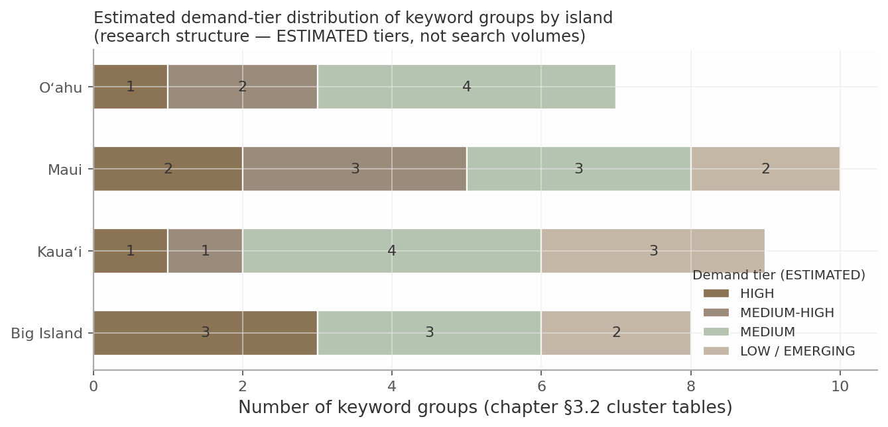

The chart counts the keyword groups tabulated in §3.2.1–3.2.4 by their ESTIMATED demand tier — it visualizes this chapter's research structure, not market volumes. Three patterns matter. HIGH-tier groups concentrate where competition is most entrenched (Oʻahu core service, Maui weddings, Big Island west side), so those battles are won on pricing transparency and reviews, not content novelty. The LOW/EMERGING bar is largest where whitespace lives — Maui wedding-week formats, Kauaʻi retreat catering, Big Island east side — the cheap, fast rankings that build early authority. And every island has at least one HIGH-tier anchor cluster, validating all four subdomains as full properties rather than folds into the hub.

---

### 3.3 Intent, Seasonality and FAQ Demand

#### 3.3.1 Commercial-intent tiers and user-stage mapping

The SERP evidence sorts the universe into four intent tiers, each mapping to a user stage and a canonical page type. The practical rule: a page's job is set by its tier — money pages convert, cost pages persuade, logistics pages reassure — and a page that tries to do all three does none.

| Intent tier | User stage | Example queries (from §3.1–3.2) | Winning page type observed | myCHEF owner page type |
|---|---|---|---|---|
| **Transactional** | Ready to inquire | private chef Maui · private chef Kona · wedding catering Kauai · private chef Wailea | Marketplace location pages; local homepages with map-pack presence [^08-1^][^08-6^] | Island homepages + corridor location pages with price-in-title |
| **Commercial-investigation** | Comparing options / budgeting | Hawaii private chef cost · private chef vs restaurant · is a private chef worth it | Cost blog posts (Raffin ×2 on Maui); marketplace FAQ blocks; AI Overview synthesizes $100–250/person [^08-14^][^08-15^][^08-16^] | One canonical cost page per level (hub + per island) with published rates; blog posts link up |
| **Logistics / reassurance** | Shortlisted, checking fit | kitchen requirements · groceries included · tipping · how far in advance · dietary | FAQ accordions (Take a Chef template), etiquette guides, journal answers [^08-27^][^08-29^][^08-34^] | FAQ system fed by the §3.3.3 question bank + journal long-form answers |
| **Inspiration / adjacent** | Planning the trip | yoga retreat Kauai · beach wedding permit Maui · Airbnb vs hotel Hawaii | Planner blogs, retreat marketplaces, permit guides [^05-35^][^04-53^] | Editorial/journal content that intercepts planners before vendor selection |

The tier map exposes where the market is weakest: transactional SERPs are contested, but the investigation and logistics tiers are served mostly by marketplaces (impersonal, range-only pricing) and one competitor blog. That is why §3.4 assigns cost queries a canonical page per level rather than scattering them across blogs — the investigation tier is where published rate cards convert research-stage traffic marketplaces structurally cannot close [^08-14^][^08-25^]. It also frames the map-pack reality: on transactional queries Google Business Profile review count is the dominant visible lever (Jason Raffin 534 reviews at 5.0; Finca Makaleha 100; Chef Coco 22), so organic page quality alone will not win tier-1 queries without a review-acquisition program [^08-1^][^08-6^][^08-7^].

#### 3.3.2 Seasonal booking patterns per island (sourced)

Seasonality is island-asymmetric; a single statewide calendar would mistime every campaign. Statewide travel peaks in June–July and December, but chef-booking demand has its own, more specific rhythm [^08-51^].

| Island | Peak booking windows | Event / demand anchors | Documented lead times | Editorial implication |
|---|---|---|---|---|
| **Statewide** | Dec–Mar (holidays + whale season Dec–May, peak Jan–Mar) | Christmas/NY villa-chef evidence (Wailea stay 12/22–1/1 requesting chef + meal prep); holiday surcharges are market practice; whale season lifts villa occupancy [^08-39^][^08-54^][^08-52^] | Luxury winter-holiday bookings recommended 9–12 months ahead [^08-37^] | Front-load Dec–Mar villa content by Sep–Oct |
| **Oʻahu** | Effectively year-round (37% seasonality index; Jul + Mar strongest, Sep/Nov softest) | Wedding peaks May/Jul/Oct; Valentine's/Mother's Day spikes noted by Take a Chef [^03-51^][^03-64^][^08-3^] | Standard 2–4 weeks | No seasonal copy; rotate occasion content (graduation May–Jun, holidays) |
| **Maui** | Chef peak season Dec–Apr; wedding vendor peaks Jun–Aug + Dec holidays | Wedding shoulders Apr–Jun and Sep–Nov favored by planners; leeward Wailea/Kāʻanapali stay dry in winter [^08-56^][^04-97^] | 2–4 weeks peak, 1–2 off-peak; resort Saturdays book 12–18 months out [^04-10b^][^08-57^] | Wedding-week content published 12+ months ahead of peak dates |
| **Kauaʻi** | North Shore peaks Jun–Sep + holidays; South Shore carries Nov–Mar (two-shore inversion) | Winter North Shore rain/surf and closures — but whale season and full waterfalls; Dec is peak ADR (~$490 vs ~$384–392 fall) [^05-44^][^05-68^] | Boutique venues book 18–24 months; Hāʻena requires 72-hour notice + weather clause [^08-57^][^05-16^] | Two-shore coverage smooths revenue; bridge-clause content surfaces Nov–Mar |
| **Big Island** | Dec–Mar first-fill window; wedding peaks Sep/Oct/May move first | Ironman Kona (Oct) compresses access; Merrie Monarch lifts Hilo in spring; whale season Dec–Apr [^08-33^][^08-52^][^06-49^] | 3–6 months ahead for winter/holidays per estate-concierge guidance [^06-6^] | Ironman-week and Merrie Monarch landing/CTA rotation |

The asymmetry is the point: Kauaʻi's two-shore inversion and the Big Island's dual-hub split mean demand never stops — it moves. The lead-time column is the actionable half of the table: a 9–12-month luxury-holiday window and 12–18-month resort-Saturday window mean the *content* must exist long before the booking conversation starts, which inverts the usual publish-and-promote sequence [^08-37^][^08-57^]. The rebuild therefore needs a per-island editorial/CTA calendar in the CMS, not a statewide one: holiday and Christmas/NY villa content ships by early Q4; wedding-week content runs 12+ months ahead of May/Sep/Oct peaks; Kauaʻi messaging flips by shore and season; Big Island pages rotate Ironman and Merrie Monarch hooks [^08-33^]. myCHEF's journal already documents the first-fill logic ("December–March and wedding peaks (September, October, May) move first") — promote it from stub to visible booking-urgency asset [^08-33^].

#### 3.3.3 Real-question bank (PAA/Reddit/forums) driving the FAQ system

The FAQ system is mined, not invented: 61 verbatim questions collected from Google People-also-ask boxes, Reddit (r/MauiVisitors, r/kauai, r/BigIsland, r/Hawaii, r/VisitingHawaii, r/Honolulu), Facebook groups, and competitor FAQ pages. Two PAA anchors recur on nearly every SERP — cost ("How much is a private chef in Hawaii?") and the private-vs-personal distinction — making them mandatory FAQ entries at every site level [^08-1^][^08-14^][^08-6^]. The full bank lives in the research appendix; the themed structure below is the FAQ information architecture.

| # | Theme | Questions | Representative verbatim question | Dominant source |
|---|---|---|---|---|
| 1 | Cost & pricing | 11 | "How much is a private chef in Hawaii?" | SERP/PAA + Facebook [^08-1^][^08-12^] |
| 2 | Booking process & lead time | 7 | "How far in advance should I book a private chef on Maui?" | Competitor FAQs + Reddit [^08-34^][^08-46^] |
| 3 | Kitchen requirements & logistics | 6 | "What if my rental kitchen is small?" | Competitor FAQs [^08-35^][^08-47^] |
| 4 | Groceries & what's included | 7 | "Do private chefs in Maui handle grocery shopping and cleanup?" | Competitor FAQs [^08-36^][^08-27^] |
| 5 | Staffing & group size | 5 | "Is there a maximum number of guests for a private chef service?" (parties typically ≤15) | Marketplace FAQ + Reddit [^08-27^][^08-46^] |
| 6 | Alcohol & bar | 3 | "Can you provide alcohol or wine pairings?" | Competitor FAQs [^08-34^][^08-35^] |
| 7 | Tipping & service charges | 5 | "How much do you tip a private chef?" (15–20%, up to 25% exceptional) | Etiquette guides + marketplace blog [^08-29^][^08-32^] |
| 8 | Dietary & allergies | 3 | "Can a private chef accommodate severe allergies or strict dietary protocols (keto, vegan)?" | Competitor FAQs [^08-34^][^08-45^] |
| 9 | Weddings & events | 3 | "…getting married in Maui in September and we are considering a private chef for our wedding night." | Reddit + PAA [^08-26^][^08-12^] |
| 10 | Vacation rentals & multi-day | 6 | "My family (10 people) are coming to Kauai and looking for a private chef to cook dinner at a house we are renting." | Reddit/Facebook + concierge FAQs [^08-7^][^08-39^][^08-46^] |
| 11 | Trust & comparison | 5 | "Is there a difference between a private chef and a personal chef?" | Recurring PAA [^08-1^][^08-18^] |

Three usage rules follow. First, themes 1–2 and 7 (cost, booking, tipping — 23 of 61 questions) are the conversion-critical layer and belong on money pages as FAQ accordions with FAQPage schema, matching the Take a Chef page anatomy that wins these SERPs (demand stats, price tables, AggregateRating + FoodService schema, FAQ accordions) [^08-2^][^08-27^]. Second, themes 3–5 and 10 (kitchens, groceries, staffing, multi-day logistics) are exactly what myCHEF's operational truth-telling answers best — kitchen qualification, groceries at cost with receipts, written staffing minimums — so they get long-form journal answers linked from the accordions, not one-liners [^08-45^]. Third, theme 11 resolves on-page: one definitional section per owner page captures the PAA instead of mirrored page sets (risk R3 below). One supply-side question ("How much should I charge as a private chef?") is excluded from the B2C FAQ system [^08-14^].

---

### 3.4 Keyword Ownership and Cannibalization Control

#### 3.4.1 Ownership map: every major keyword has ONE primary owner page

The ownership map is the law the Chapter 4 sitemaps obey. Its rule is absolute: **every major keyword has exactly one primary owner page across the five-property ecosystem, and every other page that touches the term links to the owner rather than competing with it.** The scheme is three-tiered, and it is not theoretical — it matches how Google segments these SERPs today (distinct map packs per island, PASF divergence by geography), how Take a Chef structures its own page stack, and how the live myCHEF estate already allocates ownership in copy ("Hub `/` owns private chef Hawaii… This home still owns private chef Oahu") [^08-1^][^08-6^][^08-2^][^01-8^][^01-15^].

| Tier | Owned keyword families | Owner page(s) | SERP rationale | Enforcement requirement |
|---|---|---|---|---|
| **Statewide hub** (mychef-hawaii.com) | private chef Hawaii · personal chef Hawaii · Hawaii private chef cost/prices · catering Hawaii · wedding catering Hawaii (hub) · tipping · private-vs-personal · how a private chef works · Hawaii vacation/villa chef | Hub homepage, hub /catering, hub /weddings, hub cost page, hub FAQ/journal | Statewide SERPs return mixed-island results and statewide marketplace pages [^08-1^][^08-14^] | Hub pages link *down* to island pages; hub never repeats island-specific pricing or copy |
| **Island** (4 subdomains) | private chef {Oahu/Maui/Kauai/Big Island} · Kona + Hilo variants · {island} cost · wedding catering {island} · {island} vacation chef · {island} retreat catering | Island homepages, island /weddings, island cost pages, island service pages | Distinct map packs per island; PASF confirms island-level terms surface independently (incl. Kona and Hilo) [^08-1^][^08-6^][^08-7^] | Unique price cards, unique FAQs, unique schema per island; no statewide copy reuse |
| **Resort-area / corridor** (selective) | Maui: Wailea · Kāʻanapali · Kapalua · Lahaina (sensitive) · Makena · Kīhei — Oʻahu: Waikīkī · Ko Olina · Kahala · Kailua/Lanikai · North Shore · Hawaiʻi Kai — Kauaʻi: Princeville · Hanalei · Poʻipū — Big Island: Kailua-Kona · Kohala Coast | One corridor page per justified area, on the island host only | PASF + marketplace pages confirm these resort-area demands [^08-6^][^08-40^][^08-41^][^08-42^][^08-43^] | Build only where service terms genuinely differ (travel fees, minimums, venue rules); otherwise "areas served" sections on the island page (Chef Kristin model) [^08-64^] |

The extract is deliberately short — these are the *decided* assignments. Hilo is PASF-visible but stays lower-priority (east side inquiry-stage) [^08-1^][^08-13^]; Kauaʻi west-side corridors and Maui's /haleakala-class pages fail the corridor test and are fold/prune candidates, because the live estate over-builds location pages relative to demand evidence [^01-2^][^05-16^]. The current site also enforces the rule the wrong way: its pages state ownership to users ("Private chef Oahu (90) stays on this host's home"), leaking annotations and unverified volume numbers into visible copy — the rebuild keeps the rule as an internal IA document and strips every annotation from rendered pages [^01-15^][^01-22^].

#### 3.4.2 Cannibalization risk register and pre-publication test protocol

Seven cannibalization risks are flagged for the rebuild. Each has a named failure mode and a standing mitigation; the register is a living document — every new page proposal is checked against it before entering the sitemap.

| # | Risk | Failure mode | Standing mitigation |
|---|---|---|---|
| R1 | **"private chef Hawaii" hub vs four island pages** | Island pages drift into statewide copy; hub and islands compete on the same SERP | Replicate Take a Chef's split: hub owns state intent and links down; island pages never repeat statewide copy; unique price cards/FAQs/schema per island. Enforce in QA, not in visible copy [^08-67^] |
| R2 | **"private chef Maui" vs Wailea/Kāʻanapali/Kapalua/Lahaina sub-pages** | Thin near-duplicate location pages (doorway risk) | Corridor pages only where service terms genuinely differ (e.g., North Shore Oʻahu surcharge, Kauaʻi far-north 72-hour clause); otherwise "areas served" sections on the island page [^08-21^][^08-13^][^08-64^] |
| R3 | **"private chef" vs "personal chef" mirrored page sets** | Two near-identical page families split authority | One URL set owning both terms, with a definitional section/FAQ capturing the recurring PAA [^08-1^] |
| R4 | **"catering" vs "wedding catering" vs "private chef" page-type collision** | Three different SERP compositions (caterers/marketplaces vs wedding marketplaces vs map-pack chefs) answered by one blurred page | Keep three distinct page types — staffed-event catering, wedding-week, private dinner — as the Kauaʻi host already does; extend statewide [^08-8^][^08-12^][^08-13^] |
| R5 | **Cost content duplication: hub pricing page vs island price cards vs cost blogs** | Multiple internal cost pages compete (Raffin ranks twice for Maui cost via two posts — an asset for him, a hazard if internal) | One canonical cost page per level; blog posts canonicalize/link up to the owner [^08-15^][^08-16^] |
| R6 | **Marketplace overlap on corridor pages** | myCHEF corridor pages out-templated by marketplace pages carrying AggregateRating + FoodService schema and thousands of reviews | Differentiate on what marketplaces cannot publish: fixed prices (not ranges), written-quote policy, GET/service-line transparency, island operational detail [^08-33^][^08-13^] |
| R7 | **Vacation-rental intent ceded to concierges** | "Private chef for vacation rental Hawaii" answered by concierge pages and AI Overviews; myCHEF absent | Dedicated statewide "vacation rental / villa chef" page + per-island equivalents; moderate competition, highest-LTV intent [^08-18^][^08-20^] |

The register's pattern is clear: risks R1–R5 are self-inflicted (internal duplication) and fully controllable; R6–R7 are competitive and answered by page-type differentiation, not volume. Two register entries deserve priority because the current estate already violates them. R2 is the live offender — the subdomains carry corridor pages (Kauaʻi's west side, Maui's /haleakala class) that fail the service-terms-differ test, so the rebuild's first cannibalization fix is subtraction, not addition [^01-2^][^05-16^]. R5 is the quiet one: with cost content planned at hub, island, and journal levels, the canonical-cost-page rule must be decided before any cost copy is written, or the rebuild reproduces Raffin's two-post overlap inside its own domain [^08-15^][^08-16^]. The control mechanism for all five self-inflicted risks is a pre-publication test every proposed page must pass before it enters any sitemap or CMS.

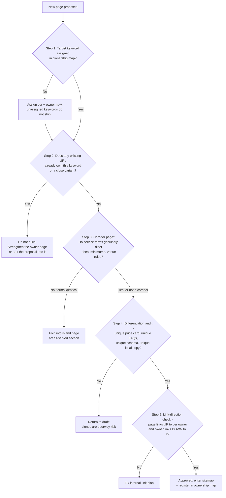

The five steps encode the register. Step 1 makes ownership a prerequisite — a page without a map assignment is an orphan by design. Step 2 is the literal cannibalization test: a keyword-and-variant lookup against the live ownership map, maintained as the internal successor to the annotations the current site leaks into copy [^01-15^]. Step 3 applies the R2 corridor rule with §3.2's evidence standard — marketplace page presence, PASF confirmation, or a genuine service-term difference. Step 4 enforces the R1/R5 uniqueness requirements (price card, FAQs, schema, local copy). Step 5 enforces link direction, because the hub-down / island-up structure tells Google which page owns which intent — the same signal Take a Chef's page stack sends [^08-2^]. A page that passes all five steps is registered in the map, making it self-maintaining: it grows only through the test, never around it.

Chapter 4 compiles this specification into sitemaps: every URL proposed there must cite its cluster from §3.2 and its owner tier from §3.4.1, and every corridor page must carry its Step-3 justification.

---

#### Sources

All sources accessed 2026-09-06. Indices are prefixed by research dimension file (`08` = dim08 statewide keyword/demand intelligence; `03`–`06` = island deep-dives; `07` = dim07 market/regulatory verification; `01` = existing-site audit); definitions are copied from those files' source lists.

[^08-1^] Google SERP "private chef hawaii" (map pack, PAA, PASF: Honolulu/Oahu/Hilo/Big Island/Kona; organic: Take a Chef, Yelp, Airbnb, privatedininghawaii.com, bigiprivatechef.com, theprivatechefhawaii.com, hawaiihideaways.com) — https://www.google.com/search?q=private+chef+hawaii (accessed 2026-09-06)
[^08-2^] Take a Chef — Honolulu County — https://www.takeachef.com/en-us/private-chef/honolulu-county (accessed 2026-09-06)
[^08-3^] Take a Chef — Kailua-Kona (+ /en-en variant with price table) — https://www.takeachef.com/en-us/private-chef/kailua-kona (accessed 2026-09-06)
[^08-6^] Google SERP "private chef maui" (map pack; PASF: Maui cost, Wailea, Lahaina, Kaanapali, sushi chef; organic: privatemauichef.com, Yelp, alohapartychef.com, jasonraffin.com, lotuschefs.com, aprivatechefmaui.com, Take a Chef, Reddit r/MauiVisitors) — https://www.google.com/search?q=private+chef+maui (accessed 2026-09-06)
[^08-7^] Google SERP "private chef kauai" (map pack; Facebook "Everything Kauai" thread; Take a Chef Kauai pricing; Yelp; privatechefkauai.com) — https://www.google.com/search?q=private+chef+kauai (accessed 2026-09-06)
[^08-8^] Web search "catering Hawaii" — hawaiivendors.com blog, roaminghunger.com/hawaii/food-truck-catering, himalayankitchenhawaii.com/catering, myhighwayinn.com/catering (SERP inspection)
[^08-9^] yhangry — Kauai County catering — https://yhangry.com/f/catering/us-hawaii-kauai--county/ (accessed 2026-09-06)
[^08-10^] The Knot — Catering in Oahu, HI — https://www.theknot.com/marketplace/catering-oahu-hi (accessed 2026-09-06)
[^08-11^] WeddingWire — Best Wedding Caterers in Hawaii — https://www.weddingwire.com/c/hi-hawaii/wedding-caterers/3-sca.html (accessed 2026-09-06)
[^08-12^] Google SERP "wedding catering hawaii cost" (AI Overview pricing tiers; PAA; Facebook 175-guest budget thread; The Knot; 1979hawaii.com; acateredexperience.com) — https://www.google.com/search?q=wedding+catering+hawaii+cost (accessed 2026-09-06)
[^08-13^] myCHEF Kauai — Weddings — https://kauai.mychef-hawaii.com/weddings (accessed 2026-09-06)
[^08-14^] Google SERP "private chef hawaii cost" (AI Overview; map pack; PAA; related searches; Facebook under-$60 thread; organic: Chef Kristin, Take a Chef, Jason Raffin, yhangry, Lotus Chefs, Yelp) — https://www.google.com/search?q=private+chef+hawaii+cost (accessed 2026-09-06)
[^08-15^] Jason Raffin — Private Chef Pricing Maui — https://www.jasonraffin.com/post/breaking-down-the-cost-of-a-private-chef-in-maui-private-chef-pricing-maui (accessed 2026-09-06)
[^08-16^] Jason Raffin — How Much Does a Private Chef Cost? (via SERP) — https://www.jasonraffin.com/post/how-much-does-a-private-chef-cost (accessed 2026-09-06)
[^08-17^] Lotus Chefs — Family Vacation Private Chef Services on Maui (via SERP) — https://lotuschefs.com/family-friendly-private-chef-maui (accessed 2026-09-06)
[^08-18^] Google SERP "private chef for vacation rental hawaii" (AI Overview $110–171; organic: parrishkauai.com, exceptionalvillas.com, evrhi.com, aliiresorts.com) — https://www.google.com/search?q=private+chef+for+vacation+rental+hawaii (accessed 2026-09-06)
[^08-19^] Airbnb — Chefs in Honolulu and https://www.airbnb.com/services/6284002 — https://www.airbnb.ca/honolulu-hi/services/chefs (accessed 2026-09-06)
[^08-20^] Parrish Collection Kauai — Private Chefs ; Ali'i Resorts — https://www.aliiresorts.com/maui-vacation-private-chef/ — https://www.parrishkauai.com/private-chefs/ (accessed 2026-09-06)
[^08-21^] myCHEF Hawaii — homepage — https://mychef-hawaii.com/ (accessed 2026-09-06)
[^08-22^] The Kanini Estate — villa chef guides and /the-best-private-chefs-for-an-elite-luxury-villa-experience/ — https://www.thekaniniestate.com/top-big-island-luxury-rentals-with-private-chef-services/ (accessed 2026-09-06)
[^08-23^] CookinGenie — Private Chef Cost blog — https://cookingenie.com/content/blog/hiring-a-personal-chef-what-to-expect-in-terms-of-cost/ (accessed 2026-09-06)
[^08-25^] yhangry — Find a Private Chef in Hawaii — https://yhangry.com/f/private-chefs/us-hawaii/ (accessed 2026-09-06)
[^08-26^] Google SERP '"Personal Chef + Housekeeper for a week vacation in Maui" reddit' (r/MauiVisitors threads; AI Overview synthesis; r/WouldYouRather; Facebook Maui Travelers Guide) — https://www.google.com/search?q=%22Personal+Chef+%2B+Housekeeper+for+a+week+vacation+in+Maui%22+reddit (accessed 2026-09-06)
[^08-27^] Take a Chef — Poipu (FAQ "What does a private chef service include") ; Waikiki — https://www.takeachef.com/en-us/private-chef/waikiki — https://www.takeachef.com/en-us/private-chef/poipu (accessed 2026-09-06)
[^08-29^] Take a Chef blog — How much do you tip a private chef? — https://www.takeachef.com/blog/en/how-much-do-you-tip-private-chef (accessed 2026-09-06)
[^08-32^] Privatechef.pt — Tipping etiquette 2026 — https://privatechef.pt/blog/tipping-etiquette-private-chef.html (accessed 2026-09-06)
[^08-33^] myCHEF Big Island journal — How far ahead to book — https://bigisland.mychef-hawaii.com/journal/how-far-ahead-to-book (accessed 2026-09-06)
[^08-34^] Aloha Party Chef — Maui Private Chef FAQ — https://alohapartychef.com/faqs-private-chef-maui (accessed 2026-09-06)
[^08-35^] Marrow Private Chefs — 30A guide (booking lead-time FAQ) — https://marrowprivatechefs.com/private-chef-30a-guide (accessed 2026-09-06)
[^08-36^] Jason Raffin — Private Chef Maui: A Vacation Game-Changer (FAQ) — https://www.jasonraffin.com/post/private-chef-maui (accessed 2026-09-06)
[^08-37^] Mauna Kea Residences — How far in advance to book a Hawaii vacation — https://maunakearesidences.com/insights/useful-info/how-far-in-advance-should-you-book-a-hawaii-vacation/ (accessed 2026-09-06)
[^08-38^] Eat Plants Elevate — Oahu plant-based personal chef — https://www.eatplantselevate.com/ (accessed 2026-09-06)
[^08-39^] Reddit r/MauiVisitors — "Private chef and meal prep service" (Wailea 12/22–1/1) — via Google SERP, see [^08-26^]
[^08-40^] Take a Chef — Ko Olina — https://www.takeachef.com/en-us/private-chef/ko-olina (accessed 2026-09-06)
[^08-41^] Take a Chef — Lahaina — https://www.takeachef.com/en-us/private-chef/lahaina (accessed 2026-09-06)
[^08-42^] Take a Chef — Kapalua — https://www.takeachef.com/en-us/private-chef/kapalua (accessed 2026-09-06)
[^08-43^] Take a Chef — Princeville — https://www.takeachef.com/en-us/private-chef/princeville (accessed 2026-09-06)
[^08-44^] yhangry — Princeville private chef — https://yhangry.com/f/private-chefs/us-hawaii-kauai--county-princeville/ (accessed 2026-09-06)
[^08-45^] Luxury Vacation Stays — Cost of a private chef for a vacation rental (FAQ) and /how-to-hire-a-private-chef-for-a-vacation-week-the-2026-connoisseurs-guide/ — https://luxuryvacationstays.com/the-cost-of-a-private-chef-for-a-vacation-rental-a-2026-guide-to-bespoke-dining/ (accessed 2026-09-06)
[^08-46^] Google SERP "private chef oahu OR kauai OR big island reddit" (r/kauai, r/BigIsland, r/Hawaii, r/VisitingHawaii, r/Honolulu, r/MovingtoHawaii threads) — https://www.google.com/search?q=private+chef+oahu+OR+kauai+OR+%22big+island%22+reddit (accessed 2026-09-06)
[^08-47^] myCHEF Dubai — private chef FAQ (question patterns) — https://www.mychef.ae/private-chef-dubai (accessed 2026-09-06)
[^08-51^] Travel+Leisure — Best times to visit Hawaii — https://www.travelandleisure.com/travel-tips/best-time-to-visit-hawaii (accessed 2026-09-06)
[^08-52^] Hawaii-Guide — Best time to visit Hawaii (Maui/Big Island events: whale season, Merrie Monarch, Ironman) — https://www.hawaii-guide.com/best-time-to-visit-hawaii (accessed 2026-09-06)
[^08-54^] Chef Kristin — Services/pricing — https://www.chefkristin.com/services/ (accessed 2026-09-06)
[^08-56^] Maui Wedding Vendors — FAQ — https://mauiweddingvendors.com/ (accessed 2026-09-06)
[^08-57^] Pix.Wedding — Hawaii wedding venues/season — https://www.pix.wedding/wedding-venues/hawaii (accessed 2026-09-06)
[^08-61^] MiumMium — Personal Chef Kailua-Kona — https://www.miummium.com/en-us/personal-chef-kailua-kona (accessed 2026-09-06)
[^08-64^] Chef Kristin — FAQ (Maui towns served) — https://www.chefkristin.com/faq/ (accessed 2026-09-06)
[^08-67^] myCHEF Hawaii — Journal hub — https://mychef-hawaii.com/journal (accessed 2026-09-06)
[^03-2^] Airbnb "Chefs in Honolulu" listing page — https://www.airbnb.com/honolulu-hi/services/chefs (accessed 2026-09-06)
[^03-5^] "more than 72 Private Chefs… 7,941 guests… menus around 190.6 USD per person"; tier pricing 110–149 USD — https://www.takeachef.com/en-us/private-chef/honolulu-county (accessed 2026-09-06)
[^03-13^] "average sum paid… was $50.65 + tip per person… low thirties… over $150 per guest" — https://www.miummium.com/en-us/personal-chef-honolulu (accessed 2026-09-06)
[^03-14^] "$40-$100 or more per person" — https://www.thumbtack.com/hi/honolulu/private-chefs (accessed 2026-09-06)
[^03-20^] Kailua tiers: "132 USD to 169 USD… 13+: 132; 7–12: 106; 3–6: 126; 2: 169" — https://www.takeachef.com/en-us/private-chef/kailua (accessed 2026-09-06)
[^03-25^] occasion subpage; "James Beard Foundation-recognized chef with 50 years of experience" — https://chefdavidpaul.com/services/personal-chef-honolulu/anniversary-dinner (accessed 2026-09-06)
[^03-30^] Memoirs 5.0 (20), "$$"; The Catering Connection 4.9 (12), "$$$"; Events.Aulelei; 808 Meal Prep; Fusion Cafe + Wine — https://www.theknot.com/marketplace/catering-oahu-hi (accessed 2026-09-06)
[^03-44^] myCHEF internal: "from $125/pp… CORE $125–$190/pp. Weekly from…" — https://oahu.mychef-hawaii.com/kahala (accessed 2026-09-06)
[^03-45^] myCHEF internal: "starts from $300 a week plus… groceries"; North Shore/Turtle Bay published drive surcharge; COI/building logistics — https://oahu.mychef-hawaii.com/locations/hawaii-kai (accessed 2026-09-06)
[^03-47^] 2024: 5.8M visitors, $8.9B spend, $342/day; source markets (Japan 693,066; Canada 247,138; Australia 162,089; Korea 147,628); monthly 2025 arrivals — https://roadgenius.com/statistics/tourism/usa/hawaii/oahu/ (accessed 2026-09-06)
[^03-48^] ESPACIO in-suite kaiseki by Chef Mamoru Tatemori; book 10 days ahead — https://www.espaciowaikiki.com/experiences/private-chef-experience/ (accessed 2026-09-06)
[^03-49^] DBEDT: Oʻahu CY2025 visitors 5,679,047 (-2.0%); spending $9.42B (+5.3%); PPD $238.0 (+8.7%); per-trip $1,658.2 — https://dbedt.hawaii.gov/blog/26-04/ (accessed 2026-09-06)
[^03-51^] Honolulu Airbnb 74% occupancy, ADR €250, 37% seasonality; Ordinance 22-7 STR limits (Waikiki/Ko Olina resort zones) — https://www.listingok.com/en/airbnb-occupancy/united-states/honolulu/ (accessed 2026-09-06)
[^03-57^] Lanikai 4BR luxury monthly rental, chef's kitchen — https://evrhi.com/vrp/unit/Lanikai_Ola_Nani/ (accessed 2026-09-06)
[^03-62^] Park Lane Ala Moana; "bring in a private chef for customized meals in your own rental home" — https://vacations.hawaiilife.com/blog/oahu/5-luxury-beachfront-vacation-rentals-oahu-you%E2%80%99ll-love (accessed 2026-09-06)
[^03-63^] 2025: 17,370 HI weddings; $927M spend; avg $53,369; median $21,117; 74–84 guests — https://wedding.report/action/wedding_statistics/view/market/id/15/idtype/s/location/Hawaii/ (accessed 2026-09-06)
[^03-64^] 2021: 18,498 weddings; 60% destination; Honolulu 9,943 (>50%); peak months May/July/Oct — https://www.happylaulea.com/blogs/articles/hawaii-wedding-statistics (accessed 2026-09-06)
[^03-67^] HCC 2026–2027 rooftop project; modified schedule; reopening early 2028 — https://www.meethawaii.com/convention-center/hawaii-convention-center-renovation-update/construction-faq/ (accessed 2026-09-06)
[^04-3^] team, services, positioning — https://lotuschefs.com/ (accessed 2026-09-06)
[^04-5^] "$75-$200+ per person per meal, or $179-$300+ per person per full day service" — https://lotuschefs.com/family-friendly-private-chef-services-maui/ (accessed 2026-09-06)
[^04-9^] "$100 to $250 per person" — https://www.jasonraffin.com/post/maui-private-chef-hire-elevate-your-event-with-a-personal-culinary-experience (accessed 2026-09-06)
[^04-10^] price breakdown, $1,200–$1,500 family of six — https://www.jasonraffin.com/post/breaking-down-the-cost-of-a-private-chef-in-maui-private-chef-pricing-maui (accessed 2026-09-06)
[^04-10b^] FAQ: "$150-400 per meal… 2-3 meal minimum"; booking windows — https://www.jasonraffin.com/post/private-chef-maui (accessed 2026-09-06)
[^04-20^] "Starting at $119 per person"; FAQ $59–$100+ — https://www.cozymeal.com/maui/personal-chefs (accessed 2026-09-06)
[^04-22^] $119–$171 bands; 3,459 guests; 4.95/5; ~$175 avg — https://www.takeachef.com/en-us/private-chef/maui (accessed 2026-09-06)
[^04-23^] Take a Chef — Wailea (and Lahaina) location pages — https://www.takeachef.com/en-en/private-chef/wailea (accessed 2026-09-06)
[^04-24^] Cafe O'Lei 4.9(42) $$; Tarragon 5.0(4); Cutting Edge 5.0; Aloha Bars 5.0(11) — https://www.theknot.com/marketplace/catering-maui-hi (accessed 2026-09-06)
[^04-30^] welcome BBQ + reception + brunch pattern — https://cjsmaui.com/an-all-inclusive-maui-wedding-package-details-and-bbq-rehearsal-dinner/ (accessed 2026-09-06)
[^04-44^] client wedding-week product + pricing — https://maui.mychef-hawaii.com/wedding-catering (accessed 2026-09-06)
[^04-45^] Stay Chef from $1,050/day — https://maui.mychef-hawaii.com/vacation-chef (accessed 2026-09-06)
[^04-48^] MauiNow — Maui arrivals and visitor spending increase in November 2025 (2,272,476 Jan–Nov 2025; $5.31B) — https://mauinow.com/2025/12/31/maui-arrivals-and-visitor-spending-increase-in-november-2025/ (accessed 2026-09-06)
[^04-49^] 4,659 Maui weddings 2021; peak months — https://www.happylaulea.com/blogs/articles/hawaii-wedding-statistics (accessed 2026-09-06)
[^04-51^] avg wedding $25–35k; booking windows — https://mauiweddingvendors.com/ (accessed 2026-09-06)
[^04-52^] catering/bar per-person table — https://mauiweddingvendors.com/maui-wedding-cost/ (accessed 2026-09-06)
[^04-53^] DLNR permit, 20-person cap, $40+GET — https://mauidestinationweddings.com/maui-beach-wedding-permits-complete-guide-2026/ (accessed 2026-09-06)
[^04-54^] $3,100–$15,000 packages; venue costs — https://simplemauiwedding.net/get-married-in-maui-in-2026/ (accessed 2026-09-06)
[^04-58^] 2026 visitor guide; activity shifted north; 100 homes rebuilt; surviving restaurants — https://hawaii.com/blog/visiting-lahaina-maui-2026 (accessed 2026-09-06)
[^04-81^] $12–17k integrated budget; $200–300/pp reception dinner — https://alohamauidreamweddings.com/maui-wedding-cost-breakdown/ (accessed 2026-09-06)
[^04-82^] $15,000/30-guest & $18,000/40-guest packages incl. catering; planner list — https://www.olowaluplantationhouse.com/rates/ (accessed 2026-09-06)
[^04-86^] Haiku Mill rate card $2,500–$10,500 + fees — https://www.amauiweddingday.com/maui-wedding-venues/haiku-mill (accessed 2026-09-06)
[^04-92^] Ritz wedding-weekend pattern — https://matiasezcurraphotography.com/ritz-carlton-kapalua-a-luxury-maui-wedding-venue/ (accessed 2026-09-06)
[^04-95^] weddings/rehearsal/brunch services — https://www.jasonraffin.com/privatediningmaui (accessed 2026-09-06)
[^04-97^] "September, March, or May" — https://mauiloveweddings.com/best-time-of-year-to-plan-a-destination-wedding-in-maui/ (accessed 2026-09-06)
[^05-1^] Private Chef Kauai (Chef Dani Felix) — rate card, travel fees, sample menu — http://www.privatechefkauai.com/pricing (accessed 2026-09-06)
[^05-2^] Kauai Private Chef rates/services, kitchen stocking — https://www.kauaiprivatechef.com/Services.html (accessed 2026-09-06)
[^05-16^] myCHEF Kauaʻi — Weddings + journal (client pages: pricing, bridge clause, live locations) — https://kauai.mychef-hawaii.com/weddings (accessed 2026-09-06)
[^05-20^] Take a Chef Kauai stats & per-person tiers — https://www.takeachef.com/en-us/private-chef/kauai (accessed 2026-09-06)
[^05-21^] Take a Chef Poipu stats — https://www.takeachef.com/en-us/private-chef/poipu (accessed 2026-09-06)
[^05-24^] yhangry — Princeville & Hanalei private chef pages — https://yhangry.com/f/private-chefs/us-hawaii-kauai--county-princeville/ (accessed 2026-09-06)
[^05-27^] Poipu Kapili private gourmet chef & grocery stocking — https://poipukapili.com/concierge/kauai-pampering-other-indulgences/ (accessed 2026-09-06)
[^05-29^] Secret Cove Kīlauea rate card $3,750–$8,250/night — https://www.exceptionalvillas.com/secret-cove/l52002 (accessed 2026-09-06)
[^05-32^] DBEDT Dec 2025/CY2025 visitor statistics (Kauaʻi 1,419,943 visitors; $2.93B spend; $281.30 pp/day) — https://dbedt.hawaii.gov/blog/26-04/ (accessed 2026-09-06)
[^05-33^] 2025 Kauaʻi wedding market (2,072 weddings; $51,719 avg; $20,911 median; $107M) — https://wedding.report/action/wedding_statistics/view/market/id/15007/idtype/c/location/Kauai_HI/ (accessed 2026-09-06)
[^05-34^] Kauaʻi wedding cost breakdown (Jul 2026; $75/pp catering avg; $50–75k for 75 guests) — https://alohabridalconnections.com/what-does-it-cost-to-get-married-on-kauai/ (accessed 2026-09-06)
[^05-35^] Kauaʻi yoga retreat listings & prices — https://bookretreats.com/s/yoga-retreats/kauai (accessed 2026-09-06)
[^05-36^] Come Together Wellness (private-chef culinary experience included) — https://www.cometogetherwellness.com/ (accessed 2026-09-06)
[^05-40^] HDOT: Hanalei Bridge full nightly closures May 12–16, 2025 — https://hidot.hawaii.gov/highways/2025/05/page/2/ (accessed 2026-09-06)
[^05-41^] HDOT: Hanalei Hill slope stabilization closures — https://hidot.hawaii.gov/blog/2025/03/28/full-closures-of-kuhio-highway-at-hanalei-hillside-every-half-hour-april-1-2/ (accessed 2026-09-06)
[^05-44^] Kauaʻi seasonality, ADR ~$384–392 fall vs ~$490 Dec, N/S shore weather split — https://www.lovebigisland.com/hawaii-blog/the-best-time-to-visit-kauai/ (accessed 2026-09-06)
[^05-47^] 27 retreats near Kauaʻi — https://bookretreats.com/s/yoga-retreats/beach-retreats/kauai (accessed 2026-09-06)
[^05-68^] wet/dry seasons; N vs S shore timing — https://www.kauaiexclusive.com/blog/best-time-to-visit-kauai/ (accessed 2026-09-06)
[^06-2^] Epicurate — Family-Style Dinner with Chef Rio (server pricing; capacity 2–24) — https://epicurate.vip/experiences/hawaii/culinary/family-style-meals/family-style-dinner-with-chef-rio/cmkyfkw8i00a00os662mlyuiv (accessed 2026-09-06)
[^06-3^] "Starting prices begin at $175 per person." — https://www.riochef.com/menus (accessed 2026-09-06)
[^06-4^] Rio Chef — Private Chef on Hawaii's Big Island: Your Questions Answered ("$150 to $250+ per person", 2026-03-25) — https://www.riochef.com/post/private-chef-on-hawaii-s-big-island-your-questions-answered (accessed 2026-09-06)
[^06-5^] Epicurate — Chef Rio listing (server "$350 for every 8 thereafter"; capacity 2–24) — https://epicurate.vip/experiences/hawaii/culinary/family-style-meals/family-style-dinner-with-chef-rio/cmkyfkw8i00a00os662mlyuiv (accessed 2026-09-06)
[^06-6^] The Kanini Estate — The Best Private Chefs for an Elite Luxury Villa Experience (2026-06-07) — https://www.thekaniniestate.com/the-best-private-chefs-for-an-elite-luxury-villa-experience/ (accessed 2026-09-06)
[^06-7^] price tiers, 73+ chefs, 10,447 guests, avg 176 USD/pp, 4.78/5 from 1,382 reviews — https://www.takeachef.com/en-us/private-chef/big-island (accessed 2026-09-06)
[^06-18^] Pacific Mix Catering — full-service catering, Hawaiʻi Island — https://pacificmixcatering.com/ (accessed 2026-09-06)
[^06-21^] WeddingWire — HeartBeet Catering, Hilo (5.0) — https://www.weddingwire.com/biz/heartbeet-catering-hilo/40d6a32502374b92.html (accessed 2026-09-06)
[^06-23^] MiumMium — Kailua-Kona personal chef cost page ("50.65 USD plus tips" average) — https://miummium.com/ (accessed 2026-09-06)
[^06-24^] client Big Island rate card (verbatim figures as quoted) — https://bigisland.mychef-hawaii.com/ (accessed 2026-09-06)
[^06-26^] Hawaiʻi DBEDT / HTA visitor data (Hawaiʻi Island county reports) — west-heavy visitor distribution — https://dbedt.hawaii.gov/ (accessed 2026-09-06)
[^06-27^] KE Team Hawaii — 2024 Big Island Real Estate Review (resort-area medians) — https://www.keteamhawaii.com/2024-big-island-real-estate-review-kailua-kona-and-resorts/ (accessed 2026-09-06)
[^06-28^] Don's Grill Hilo — catering services; Kawamoto Store — catering (Hilo plate-lunch caterers) — https://www.donsgrillhilo.com/catering-services (accessed 2026-09-06)
[^06-29^] Kona Sunsets vacation rentals — "Personal Chef Package" concierge offering (no URL in source file)
[^06-35^] Fairmont Orchid — Wedding Packages (tiers $5,000–$14,000 + tax; F&B minimums) — https://www.fairmontorchid.com/gather/weddings/wedding-packages/ (accessed 2026-09-06)
[^06-36^] "$5,000–15,000/event… $120/person and up… 25%" service; elopement $4,500 — https://www.herecomestheguide.com/wedding-venues/hawaii/fairmont-orchid (accessed 2026-09-06)
[^06-49^] Ironman World Championship Kona (annual October) — GoHawaii/Ironman event references (no URL in source file)
[^07-51^] Hawaii Tribune-Herald — Hawaii visitor arrivals end 2025 well below pre-pandemic peak (CY2025 statewide and per-island arrivals/spending, incl. Maui 2,516,163 and Hawaiʻi Island 1,752,589 per DBEDT CY2025 tables) — https://www.hawaiitribune-herald.com/2026/02/01/hawaii-news/hawaii-visitor-arrivals-end-2025-well-below-pre-pandemic-peak/ (accessed 2026-09-06)
[^01-2^] network-wide sitemap (637 URLs; per-host sitemaps at each subdomain /sitemap.xml) — https://mychef-hawaii.com/sitemap.xml (accessed 2026-09-06)
[^01-8^] statewide tariff — https://mychef-hawaii.com/pricing (accessed 2026-09-06)
[^01-13^] hub journal stub — https://mychef-hawaii.com/journal/how-much-does-a-private-chef-cost (accessed 2026-09-06)
[^01-15^] island journal stub w/ leaked SEO note — https://oahu.mychef-hawaii.com/journal/how-much-does-a-private-chef-cost (accessed 2026-09-06)
[^01-22^] blog stub sample — https://oahu.mychef-hawaii.com/blog/cleanup-standard (accessed 2026-09-06)

---

## 4. Site Architecture and Sitemaps

**The rebuild keeps the five-host architecture — one statewide hub plus four island properties — and makes it earn its keep.** The audit shows the structure was right and the execution inverted it: 637 URLs across five hosts, yet the money pages (`/pricing`, `/quote`, `/trust`, `/legal`) sat outside every XML sitemap while roughly 150 two-to-four-sentence journal and blog stubs were fully indexed.[^01-2^][^01-13^][^01-25^] This chapter specifies the corrected architecture: what each host is for, how many pages each island should carry and of what kind, the complete proposed sitemaps (123 pages for Oʻahu, 126 for Maui, 113 for Kauaʻi, 121 for Hawaiʻi Island, 48 for the statewide hub), and the internal-linking rules that keep 531 pages from cannibalizing each other.

Three decisions govern everything below. First, **the hub is an authority and routing layer, not a fifth island site** — it owns statewide terms and comparison content and pushes commercial intent down to the islands. Second, **page count is earned, not padded**: every proposed URL answers a query cluster with independent SERP evidence or a genuinely distinct service term, and every location page passes the dim08 test — build only where service terms genuinely differ (travel fees, minimums, venue rules).[^08-21^][^08-13^] Third, **the islands are deliberately asymmetric**: Oʻahu carries corporate, convention, occasion, and Japanese-language depth; Maui carries the deepest wedding cluster in the network; Kauaʻi carries retreat and estate-week depth; Hawaiʻi Island carries a dual-hub geography (Kona–Kohala west, Hilo–Volcano east) with a resort-corridor structure. Cloning one 100-page template across four islands is exactly how the current estate produced thin near-duplicates; this architecture is designed against that failure mode.

All page sets are **proposed architectures**: each row specifies URL path, page category, primary keyword, parent page, and build wave. Title tags, meta descriptions, and page copy belong to Chapter 5's templates. Keyword demand labels are ESTIMATED throughout, per the cross-verification register — no keyword-tool volumes exist anywhere in the research, and the numeric annotations leaked into the current site's copy ("(90)", "(720)", "(210)") are unverified and must not be reused as demand data.[^01-15^][^01-22^]

### 4.1 Architecture Principles

#### 4.1.1 Statewide domain = authority/router; island sites = local commercial engines

**The subdomain-per-island structure is not a stylistic choice; it is the legally correct operating map of Hawaiʻi, and Google already segments these SERPs the same way.** Food-safety permits are issued per island with no reciprocity, liquor licensing runs through four separate county commissions, GET is filed multi-county with the rate following where service is performed, and there is no consumer inter-island vehicle ferry — equipment moves by barge at $1,000–$2,500 and Kona to Hilo is a 2.5–3-hour drive (cross-verification H13; [^06-24^]). On the demand side, every "private chef + geo" query produces a distinct island-level map pack, Google's own "People also search for" surfaces island and resort-area variants independently, and the strongest marketplace competitor maintains separate `/hawaii`, `/maui`, `/kauai`, `/big-island`, `/honolulu-county`, and resort-area pages.[^08-1^][^08-6^][^08-2^][^08-4^] The architecture below simply matches the market's existing shape.

The division of labor is strict:

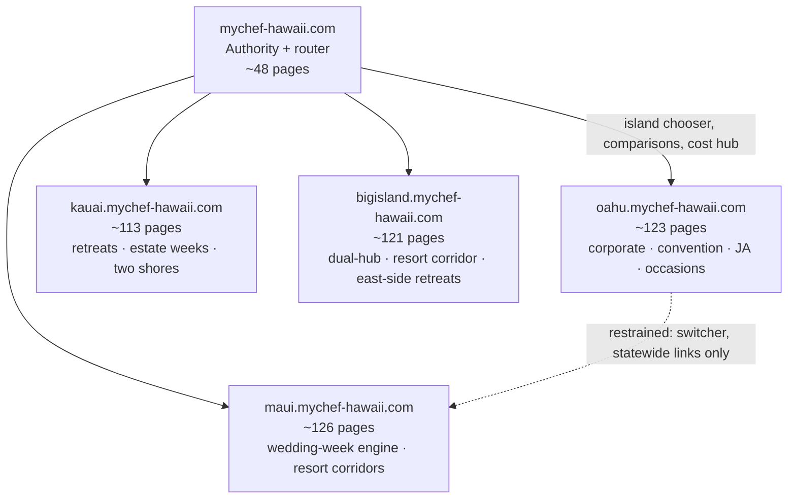

- **The hub owns statewide terms and the trust/decision layer.** "Private chef Hawaii," "Hawaii private chef cost," "catering Hawaii," tipping, private-vs-personal definitional queries, and the island chooser live here, because those SERPs return mixed-island results.[^08-1^][^08-14^] The hub carries the statewide tariff, the fee-stack explainer, policies, and statewide guides — then routes. It publishes **zero location pages**, a discipline the current hub already states in copy ("Neighborhood corridors live on the island hosts… They are not hub paths").[^01-1^]
- **Each island host owns its island phrase and acts as a local commercial engine.** "Private chef {island}," "{island} cost," "wedding catering {island}" are island-owned, each backed by a full rate card, location pages, occasion pages, and island-specific operational truth (Hanalei bridge clauses, Kona–Hilo logistics, Waikīkī building COIs) that no competitor publishes.[^08-6^][^01-4^][^01-6^][^01-7^]
- **Resort-area pages own "private chef {area}" only where tier-3 demand is confirmed** — PASF visibility, marketplace area pages, or localized marketplace pricing (e.g., Take a Chef's Kailua page with its own 132–169 USD tiers).[^08-43^][^03-20^] Everything else is a section within the parent location page, not a URL.
- **One owner per keyword, tested before publication.** Every proposed URL below names a single primary keyword; Chapter 3's ownership map is the governing register, and no page ships without a cannibalization check against it. The current site already enforces this law in copy ("Hub `/` owns private chef Hawaii… This page is the tariff") — the rebuild keeps the law and moves the annotations out of visible text into the internal IA document, following the sister network's commented-sitemap governance pattern.[^01-8^][^02-2^]

Two sister-site patterns are encoded at the foundation. The **two-core product grammar** — "a chef for the house / catering for the event," with router copy on every commercial page — structures each island's service silo, exactly as Dubai and Bali run it.[^02-1^][^02-10^] And the **AI-search posture** (robots.txt explicitly welcoming GPTBot, PerplexityBot, ClaudeBot, plus an `llms.txt`) is copied from Bali, the network's AI-search template.[^02-12^]

#### 4.1.2 Page-count targets per island (100+ legitimate indexable pages) with category mix

**Each island targets 110–130 indexable pages; the hub targets 48. The mix matters more than the count.** The current estate already hit 134–138 URLs per island — scale was never the problem. The problem was composition: 29 mirrored sub-directory slugs cloned identically across all five hosts (145 URLs) and ~150 editorial stubs, while the pages buyers actually need (rate cards, travel zones, wedding-week budgets) were missing from the sitemap.[^01-2^][^01-25^] The targets below rebuild the same page volume as *legitimate* inventory: every URL either owns a keyword cluster with SERP evidence or carries unique commercial substance (a rate card, a worked budget, a logistics guide). "Legitimate" is defined operationally: no page ships under 800 words of unique copy, every location page carries unique pricing/logistics content in the Bali template (the network's quality bar: 60+ programmatic area pages that are explicitly *not* thin), and every page passes the ownership test.[^02-15^]

| Page category | Oʻahu | Maui | Kauaʻi | Big Island | Hub | What earns a page here |
|---|---|---|---|---|---|---|
| Core commercial | 8 | 8 | 8 | 8 | 8 | Island phrase, two cores (private chef / catering), weddings, Stay Chef, pricing, quote, plus one island-specific hero (corporate Oʻahu, estate-events Maui, retreats Kauaʻi/BI) |
| Service pages | 20 | 20 | 18 | 19 | 7 | Distinct sellable products with their own intent (date night, meal prep, omakase-at-home, staffing roles, mobile bar) |
| Location pages | 10 | 10 | 7 | 12 | 0 | Only research-justified areas; combined pages where demand is thin; zero on hub by design[^01-1^] |
| Service × location | 14 | 14 | 10 | 12 | 0 | Only where service terms genuinely differ by area (travel fees, venue rules, minimums)[^08-13^] |
| Cuisine / menu pages | 12 | 12 | 10 | 12 | 0 | Menu catalogue + island-provenance menus (canoe crops Maui, Kona coffee BI, farm-to-table Kauaʻi, Pacific-rim Oʻahu) |
| Occasion pages | 10 | 10 | 9 | 9 | 0 | Birthday, anniversary, proposal, reunion, graduation (Oʻahu), Ironman week (BI) |
| Wedding / event cluster | 9 | 18 | 9 | 9 | 0 | Maui is the wedding engine; per-format pages (welcome dinner, rehearsal, recovery brunch) have near-zero dedicated competition[^04-30^][^04-44^] |
| Retreat / estate cluster | — | — | 7 | 6 | — | Kauaʻi-first whitespace: "retreat catering Kauai" returns zero dedicated SERP results[^05-35^]; BI east side has one premium competitor[^06-21^] |
| Pricing / decision pages | 10 | 10 | 10 | 10 | 8 | One canonical cost page per level; fee stack, travel zones, worked budgets, comparison pages[^08-15^] |
| Guides (editorial) | 13 | 12 | 13 | 12 | 13 | Full-prose replacements for the pruned stubs; PAA-bank coverage |
| Trust / process / partners | 12 | 12 | 12 | 12 | 12 | Honesty register, legal, FAQ, coverage maps, vetting, partner silos (villa managers, concierges, planners)[^02-11^] |
| Japanese-language cluster | 5 | — | — | — | — | Oʻahu-only play: Japan = Oʻahu's #1 international market; zero JA-language competitors[^03-47^][^03-48^] |
| **Total** | **123** | **126** | **113** | **121** | **48** | **531 indexable pages network-wide** |

**Interpretation.** Three asymmetries in this table are the strategy. First, Maui's wedding cluster (18 pages) is double any other island's because Maui is the state's destination-wedding engine — 4,659 Maui weddings in 2021 (2021 DOH-derived data; #2 island after Honolulu) against a backdrop of 17,370 statewide weddings and $927M spend in 2025 — and because the wedding-week product (welcome → rehearsal → reception → recovery brunch as one contract) is documented demand that no competitor sells as a single product.[^04-49^][^03-63^][^04-44^] Second, Kauaʻi's retreat cluster (7 pages plus the retreat-catering core page) is built on the cleanest whitespace in the research: "retreat catering Kauai" returns zero dedicated results while Kauaʻi's retreat supply is real and priced ($2,000–$4,499 tickets) and hosts already hire chefs ad hoc.[^05-35^][^05-36^] Third, the Big Island's 12 location pages reflect a genuinely dual-hub island — Kona–Kohala resort corridors on the west, Hilo–Volcano resident-and-retreat markets on the east, separated by 2.5–3 hours of driving that myCHEF already monetizes as a published travel-zone line.[^06-24^][^06-21^] Note what the table refuses: no Kauaʻi west-side pages (minimal luxury rental stock), no Maui Haleakalā/Waikapu pages, no Hana page, and no mirrored "personal chef" page sets — private-vs-personal is handled as a definitional section on the same URLs, not as duplicate inventory.[^05-44^][^08-1^] The hub's 48 pages are capped deliberately: every page added to the hub is a page that could dilute island ownership, so the hub grows only in comparisons, statewide guides, and trust content.

### 4.2 Island Sitemaps

**Preserve-and-migrate: what survives from the 637-URL estate.** The new architecture absorbs three classes of existing equity before adding anything new. The migration mechanics (301 mapping, crawl inventory) belong to Chapter 7; the disposition decisions belong here.

| Existing URL pattern (dim01 inventory) | Disposition | Destination in new architecture |
|---|---|---|
| 5 homepages; `/pricing`, `/catering`, `/weddings`, `/private-chef-cost` on all hosts; `/trust`, `/legal`, `/quote` | **Survive and elevate** — put in XML sitemap at priority 0.8–0.9 (sister-site pattern); pricing corpus preserved verbatim[^01-8^][^02-2^] | Same paths, same hosts (URLs unchanged) |
| Corridor location pages with confirmed indexation (`/wailea`, `/honolulu`, `/kahala`, `/princeville`, `/kona`, `/waikoloa`, ~60 total)[^01-24^] | **Survive, rewritten** — keep paths that match the new `/locations/{area}` set; 301 the rest; every page rebuilt to the Bali non-thin template[^02-15^] | `/locations/{area}` on island hosts |
| ~150 thin journal/blog stubs (2–4 sentences, leaked SEO annotations)[^01-13^][^01-15^] | **Prune-and-expand** — ~40 mapped to the PAA/question bank become full guides; the remainder 301 to the parent guide hub | `/guides/*` (full prose, 800+ words) |
| 29 cloned sub-directory pages × 5 hosts = 145 URLs (`/events/*`, `/catering/*`, `/fine-dining/*`, `/staffing/*`, `/menus/*`, `/help/*`) identical on every host[^01-2^] | **Restructure and de-clone** — structure retained, copy rewritten per island with unique price cards, FAQs, schema | Island-specific service/occasion/menu pages |
| 54 `blog/dining-in-*` neighborhood posts[^01-2^] | **Fold** — content merges into the matching `/locations/{area}` page; 301 | `/locations/{area}` |
| Over-built corridors vs. demand evidence: Kauaʻi `/waimea`, `/hanapepe`, `/eleele`, `/kalaheo`; Maui `/haleakala`, `/waikapu`, standalone `/honokowai`; Big Island `/honokaa`, `/kau`, `/puako`; Oʻahu `/ewa`, `/kakaako`, `/downtown`, `/diamond-head` (cross-verification §4.6.1) | **Prune** — 301 to parent location page; demand covered in "areas served" sections | Parent location page |
| Indexed artifacts: `/bigisland/catering`, `/kauai/events`, parameterized `/quote?island=…`, legacy 301s (`/locations/waikiki`, `/wedding-catering`)[^01-24^][^01-25^] | **Canonical cleanup** — 301 to canonical equivalent; parameter handling via canonical tags | Canonical service/location pages |
| Copy defects (Big Island "$125" hero vs $150 CORE; Table/ENTRY drift; duplicated locations block; leaked annotations)[^01-7^][^01-4^] | **Fix, don't migrate** — Chapter 5 copy QA register | Corrected copy on surviving pages |

**Interpretation.** The disposition logic follows one rule: equity travels with the 301, quality debt does not. The pricing corpus is the estate's highest-value asset — verified consistent across dim01 and the island dims, and unique in every island market — so its URLs are untouched and its sitemap priority rises to the sister-network standard of 0.8–0.9.[^01-8^][^01-21^][^02-2^] The stub cull is the single largest quality action in the rebuild: roughly 150 URLs collapse into ~40 real guides, which concentrates crawl budget on money pages and removes the doorway-page exposure the cross-verification file flags as the estate's principal risk. The over-built corridor prune (16 URLs) is the direct application of the build-only-where-terms-differ law — Kauaʻi's west side, for example, has minimal luxury rental stock and is covered by the island page's service-area section instead.[^05-44^] Finally, note what is *not* migrated: the leaked keyword-volume annotations, the duplicated locations block rendered twice on the Oʻahu home, and the Big Island hero price inconsistency — defects to fix in copy QA, never to carry forward.[^01-4^][^01-7^]

**Reading the sitemaps.** Each island sitemap follows in two tables (commercial core & services; locations, occasions, wedding, pricing, guides & trust). Columns: **URL path** (ASCII slugs; diacritics in copy, never in URLs — the network's existing convention[^01-2^]); **Category**; **Primary keyword** (single owner per Chapter 3's map; demand labels ESTIMATED where research supports them); **Parent** (hub-and-spoke parent for §4.4 linking); **Wave** — P1 = launch money pages (weeks 1–4), P2 = location/occasion/pricing depth (weeks 5–10), P3 = guides, long-tail, JA cluster (weeks 8–16) — wave ranges indicative; final sequencing in §7.5; **Notes**. Location names use ʻokina in copy; URL slugs stay ASCII (`/locations/poipu`, not `/locations/poʻipū`).

#### 4.2.1 Oʻahu sitemap: hubs, services, locations, pricing, occasions, guides (full URL list)

**123 pages on `oahu.mychef-hawaii.com`.** Oʻahu is the network's volume and diversity engine: the only island with a real corporate/convention market, a resident weekly-service market (the kamaʻāina line), a proven occasion-subpage model (a 50-year local chef ranks with dedicated anniversary-dinner pages[^03-25^]), and the state's only Japanese-language opportunity — ≈693k Japanese visitors to Oʻahu in 2024 (aggregator; statewide Japan 731,922 in 2025) with zero competitors targeting Japanese-language private-chef queries.[^03-47^][^03-48^] Ordinance 22-7's STR rules concentrate transient visitor demand in Waikīkī and Ko Olina while Kahala/Kailua/North Shore demand skews to 30-day renters and residents — the location pages below carry that messaging split explicitly.[^03-51^]

**Table 4.2.1a — Oʻahu commercial core, services, locations (52 pages)**

| URL path | Category | Primary keyword | Parent | Wave | Notes |
|---|---|---|---|---|---|
| `/` | Core | private chef Oahu (EST. HIGH) | — | P1 | Island-owned head term; distinct map pack[^08-1^] |
| `/private-chef` | Core | hire a private chef Oahu | `/` | P1 | "Chef for the house" core silo hub[^02-10^] |
| `/catering` | Core | catering Oahu (EST. HIGH) | `/` | P1 | "Catering for the event" core silo hub |
| `/weddings` | Core | wedding catering Oahu | `/` | P1 | Wedding silo hub; 9,943 Honolulu weddings (2021, DOH-derived)[^03-64^] |
| `/stay-chef` | Core | vacation chef Oahu | `/` | P1 | Multi-day product; from $850/day[^01-21^] |
| `/pricing` | Core | private chef Oahu cost | `/` | P1 | Rate card preserved verbatim; sitemap priority 0.9[^01-21^][^02-2^] |
| `/quote` | Core | book a private chef Oahu | `/` | P1 | Conversion door; canonical, no indexed parameters |
| `/corporate` | Core | corporate catering Honolulu | `/` | P1 | Oʻahu-only core page; HCC displacement demand through 2027[^03-67^] |
| `/services/personal-chef-weekly` | Service | personal chef Oahu weekly | `/private-chef` | P1 | Kamaʻāina line from $300/week + groceries; Oʻahu-exclusive[^01-4^] |
| `/services/vacation-chef` | Service | chef for vacation rental Oahu | `/private-chef` | P1 | Concierge-ceded intent; dedicated page type is whitespace[^08-18^] |
| `/services/date-night` | Service | private chef for two Oahu | `/private-chef` | P2 | Fixed-price evening; from $450/event[^01-21^] |
| `/services/meal-prep` | Service | weekly meal prep chef Honolulu | `/private-chef` | P2 | Positioned above delivery players; largest market segment[^03-23^] |
| `/services/cooking-classes` | Service | private cooking class Oahu | `/private-chef` | P3 | Experience add-on |
| `/services/omakase-at-home` | Service | omakase at home Honolulu | `/private-chef` | P2 | Demand proven at luxury end: JP 27-course kaiseki; ESPACIO in-suite[^03-16^][^03-48^] |
| `/services/fine-dining` | Service | fine dining at home Oahu | `/private-chef` | P2 | Premium tier hub ($190–$275/pp)[^01-21^] |
| `/services/chefs-table` | Service | chef's table Oahu | `/services/fine-dining` | P2 | $275–$400+/pp, quoted manually[^01-21^] |
| `/services/honeymoon-dinners` | Service | honeymoon private chef Oahu | `/private-chef` | P3 | Couples segment |
| `/services/retreat-catering` | Service | retreat catering Oahu | `/catering` | P3 | Corporate/wellness offsites |
| `/services/mobile-bar` | Service | mobile bar Oahu | `/catering` | P2 | Packaged cart from $650/4 hr; REQUIRES LEGAL VERIFICATION (county liquor rules)[^01-21^] |
| `/services/staffing` | Service | event staffing Oahu | `/catering` | P2 | Staffing SKU hub; servers from $55/hr[^01-21^] |
| `/services/staffing/servers` | Service | event servers for hire Oahu | `/services/staffing` | P3 | $55/hr, 4-hr floor[^01-21^] |
| `/services/staffing/bartenders` | Service | bartender hire Oahu | `/services/staffing` | P3 | REQUIRES LEGAL VERIFICATION (alcohol service) |
| `/services/staffing/butlers` | Service | butler service Oahu | `/services/staffing` | P3 | Estate-service upsell |
| `/services/kids-menus` | Service | kid-friendly private chef Oahu | `/private-chef` | P3 | Large family groups with children |
| `/services/dietary` | Service | vegan gluten-free private chef Oahu | `/private-chef` | P2 | Dietary capability matrix (Dubai pattern)[^02-5^] |
| `/services/convention-dining` | Service | convention catering Honolulu | `/corporate` | P2 | HCC modified schedule 2026–2027; displaced citywides favor off-site[^03-67^][^03-69^] |
| `/services/yacht-chef` | Service | yacht chef Honolulu | `/private-chef` | P3 | Ala Wai / Ko Olina marinas; weak competitor content[^03-32^] |
| `/services/grocery-provisioning` | Service | villa grocery stocking Oahu | `/services/vacation-chef` | P3 | Attach-on; groceries at cost with receipts[^01-8^] |
| `/locations` | Location index | private chef Oahu areas served | `/` | P1 | Areas index with service-area map |
| `/locations/waikiki` | Location | private chef Waikiki (EST. HIGH) | `/locations` | P1 | Highest visitor density; Take a Chef Waikiki page; STR-legal zone[^08-27^][^03-51^] |
| `/locations/honolulu` | Location | private chef Honolulu (EST. HIGH) | `/locations` | P1 | Metro hub; PASF-confirmed independent demand[^08-1^] |
| `/locations/kahala-gold-coast` | Location | private chef Kahala | `/locations` | P1 | Wealthiest estate zone (~1,200 homes, land from $1.5M+); zero competitor pages; existing equity[^03-52^][^01-24^] |
| `/locations/ko-olina` | Location | private chef Ko Olina (EST. MED) | `/locations` | P1 | Resort residences with purpose-built chef kitchens; Take a Chef Ko Olina page[^03-55^][^08-40^] |
| `/locations/kapolei` | Location | private chef Kapolei | `/locations` | P2 | Second-city resident/corporate market; marketplace page signal |
| `/locations/kailua-lanikai` | Location | private chef Kailua | `/locations` | P1 | Take a Chef Kailua page with localized 132–169 USD tiers; covers Lanikai + Kāneʻohe/windward as sections[^03-20^] |
| `/locations/north-shore` | Location | private chef North Shore Oahu | `/locations` | P1 | Estate market, surf-season peaks, published drive surcharge; low competition[^03-59^][^01-21^] |
| `/locations/turtle-bay` | Location | private chef Turtle Bay | `/locations/north-shore` | P2 | Resort anchor; travel fee from $75[^01-21^] |
| `/locations/hawaii-kai` | Location | private chef Hawaii Kai | `/locations` | P2 | Marina suburb; resident weekly-service market[^03-60^] |
| `/locations/waikiki/catering` | Service × location | catering Waikiki | `/locations/waikiki` | P2 | Terms differ: hotel-adjacent load-in, COI requirements |
| `/locations/waikiki/in-suite-dining` | Service × location | in-suite private chef Waikiki | `/locations/waikiki` | P2 | Ritz-Carlton Residences chef's-kitchen suites; ESPACIO segment[^03-50^][^03-48^] |
| `/locations/waikiki/omakase` | Service × location | omakase at home Waikiki | `/services/omakase-at-home` | P3 | In-suite kaiseki crossover[^03-48^] |
| `/locations/honolulu/corporate-catering` | Service × location | corporate catering Honolulu downtown | `/corporate` | P1 | Kakaʻako/Downtown office density |
| `/locations/honolulu/wedding-catering` | Service × location | wedding catering Honolulu | `/weddings` | P2 | Venue-driven demand; directory-saturated SERP[^03-35^] |
| `/locations/ko-olina/wedding-catering` | Service × location | wedding catering Ko Olina | `/weddings` | P2 | Resort chapel/lagoon wedding corridor |
| `/locations/ko-olina/stay-chef` | Service × location | vacation chef Ko Olina | `/stay-chef` | P2 | Yamaguchi-kitchen villas; 30-day legal rentals[^03-55^][^03-56^] |
| `/locations/kailua-lanikai/stay-chef` | Service × location | vacation chef Kailua | `/stay-chef` | P2 | Beachfront estates; villa agencies list chef add-ons[^03-58^] |
| `/locations/north-shore/stay-chef` | Service × location | chef for a week North Shore Oahu | `/stay-chef` | P2 | Surf-season estate weeks; 60–90+ min drive policy[^01-4^][^03-59^] |
| `/locations/north-shore/catering` | Service × location | catering North Shore Oahu | `/catering` | P3 | Estate events; supply gap[^03-59^] |
| `/locations/kahala-gold-coast/personal-chef` | Service × location | personal chef Kahala weekly | `/services/personal-chef-weekly` | P2 | Estate household service |
| `/locations/hawaii-kai/personal-chef` | Service × location | personal chef Hawaii Kai | `/services/personal-chef-weekly` | P3 | Resident weekly market[^03-60^] |
| `/locations/turtle-bay/vacation-chef` | Service × location | private chef Turtle Bay villas | `/services/vacation-chef` | P3 | Resort-adjacent rental segment |
| `/locations/kapolei/catering` | Service × location | catering Kapolei | `/catering` | P3 | Second-city events |

**Interpretation (Table 4.2.1a).** The Oʻahu core does something no other island's does: it carries two parallel demand economies on one host. The visitor economy (Waikīkī, Ko Olina, North Shore estates) buys Signature dinners, Stay Chef weeks, and in-suite omakase — and is heavily concentrated by law, since legal short-term rentals sit almost entirely in the Waikīkī and Ko Olina resort zones.[^03-51^] The resident economy (Kahala, Hawaiʻi Kai, Kapolei, Kailua) buys the kamaʻāina weekly line, meal prep, and occasion catering. The location set is deliberately smaller than the current estate's 14 corridors: Ewa, Kakaʻako, Downtown, and Diamond Head lose standalone pages because no research evidence shows independent chef-service demand there — they become sections of the Honolulu and area pages, with `/kakaako` and `/downtown` corporate intent absorbed by `/locations/honolulu/corporate-catering`. The corporate/convention pair (`/corporate` + `/services/convention-dining` + `/locations/honolulu/corporate-catering`) is timed to a real demand shock: the Hawaiʻi Convention Center's modified schedule through 2026–2027 is pushing group business into hotels and private venues, and no private-chef operator is positioned for it.[^03-67^][^03-69^] The Waikīkī in-suite cluster is the clearest "service terms genuinely differ" case in the state — COI certificates, freight-elevator bookings, and compact-galley logistics are real service differences, not keyword variants.[^03-45^][^03-50^]

**Table 4.2.1b — Oʻahu occasions, wedding, menus, pricing/decision, guides, trust, JA cluster (71 pages)**

| URL path | Category | Primary keyword | Parent | Wave | Notes |
|---|---|---|---|---|---|
| `/occasions` | Occasion index | private chef for events Oahu | `/` | P2 | Occasion silo hub |
| `/occasions/birthday` | Occasion | birthday private chef Honolulu | `/occasions` | P2 | Occasion-subpage model proven locally[^03-25^] |
| `/occasions/anniversary` | Occasion | anniversary dinner private chef Honolulu | `/occasions` | P2 | Dedicated competitor page ranks[^03-25^] |
| `/occasions/proposal` | Occasion | proposal dinner private chef Oahu | `/occasions` | P3 | Sunset-dinner segment |
| `/occasions/graduation` | Occasion | graduation party catering Honolulu | `/occasions` | P2 | May–June local graduation season |
| `/occasions/bachelorette` | Occasion | bachelorette private chef Oahu | `/occasions` | P3 | Villa-group format |
| `/occasions/holiday-dinner` | Occasion | Thanksgiving private chef Oahu | `/occasions` | P2 | December peak; holiday-surcharge calendar published Q3 |
| `/occasions/family-reunion` | Occasion | family reunion catering Oahu | `/occasions` | P2 | Multi-generational villa groups |
| `/occasions/villa-party` | Occasion | villa party catering Oahu | `/occasions` | P3 | Staffed 10–75 guest range[^01-18^] |
| `/occasions/celebration-of-life` | Occasion | celebration of life catering Oahu | `/occasions` | P3 | Resident-market sensitivity page |
| `/weddings/wedding-week` | Wedding | wedding week chef Oahu | `/weddings` | P1 | One-contract week; from $125/pp + staffing[^01-21^] |
| `/weddings/rehearsal-dinner` | Wedding | rehearsal dinner catering Oahu | `/weddings/wedding-week` | P1 | Per-format terms have near-zero dedicated pages[^04-30^] |
| `/weddings/welcome-dinner` | Wedding | welcome dinner catering Oahu | `/weddings/wedding-week` | P2 | Wedding-week line item |
| `/weddings/reception-catering` | Wedding | wedding reception catering Oahu | `/weddings` | P1 | Estate/villa receptions, not ballrooms |
| `/weddings/recovery-brunch` | Wedding | day after wedding brunch Oahu | `/weddings/wedding-week` | P2 | Recovery-brunch format |
| `/weddings/elopement` | Wedding | elopement private chef Oahu | `/weddings` | P2 | Dinner-for-two from $450; unbundled micro-wedding wedge[^01-21^] |
| `/weddings/estate-wedding` | Wedding | estate wedding catering Oahu | `/weddings` | P2 | Routes around exclusive-caterer venues (Waimea Valley locks Ke Nui Kitchen)[^03-66^] |
| `/weddings/wedding-cost` | Wedding | wedding catering cost Oahu | `/weddings` | P2 | Informational anchor; planner benchmarks $60–$75/pp buffet[^03-65^] |
| `/weddings/venues` | Wedding | Oahu estate wedding venues | `/weddings` | P3 | Venue-with-kitchen guide; planner-channel bridge |
| `/menus` | Menu index | private chef menus Oahu | `/` | P1 | Menu catalogue hub (Bali card pattern)[^02-16^] |
| `/menus/signature-three-course` | Menu | Oahu signature dinner menu | `/menus` | P1 | Existing sample menu preserved[^01-4^] |
| `/menus/family-style` | Menu | family style dinner menu Oahu | `/menus` | P2 | Group format |
| `/menus/tasting-menu` | Menu | tasting menu private chef Oahu | `/menus` | P2 | Premium tier |
| `/menus/pupu-and-grazing` | Menu | grazing table Honolulu | `/menus` | P2 | Grazing niche has dedicated local operators[^03-42^] |
| `/menus/bbq-and-grill` | Menu | bbq catering menu Oahu | `/menus` | P3 | Villa grill format |
| `/menus/breakfast-and-brunch` | Menu | brunch chef Honolulu | `/menus` | P3 | Villa breakfast service |
| `/menus/vegetarian-vegan` | Menu | vegan private chef menu Oahu | `/menus` | P3 | Dietary depth |
| `/menus/gluten-free` | Menu | gluten free private chef Oahu | `/menus` | P3 | Dietary depth |
| `/menus/kids` | Menu | kids menu private chef Oahu | `/menus` | P3 | Family groups |
| `/menus/pacific-rim-omakase` | Menu | omakase menu Oahu | `/services/omakase-at-home` | P2 | JA-market crossover menu |
| `/menus/holiday` | Menu | holiday catering menu Oahu | `/menus` | P3 | Seasonal rotation; refresh Q3 |
| `/private-chef-cost` | Pricing | how much does a private chef cost in Honolulu | `/pricing` | P1 | "The stack" — island cost guide; one canonical cost page per level[^01-16^][^08-15^] |
| `/pricing/stay-chef-cost` | Pricing | stay chef Oahu cost per day | `/pricing` | P2 | From $850/day + worked week math[^01-21^][^02-13^] |
| `/pricing/kamaaina-weekly-cost` | Pricing | personal chef cost per week Honolulu | `/pricing` | P3 | $300–$1,200/week line[^01-21^] |
| `/pricing/wedding-week-budget` | Pricing | Oahu wedding catering budget | `/weddings/wedding-cost` | P2 | Worked meals × days × guests grid[^02-13^] |
| `/pricing/fee-stack` | Pricing | Oahu service charge and GET explained | `/pricing` | P1 | 20% service + GET up to 4.7120% + 50% deposit; §481B-14 posture REQUIRES LEGAL VERIFICATION[^01-19^] Canonical to hub fee-stack per §4.4.2. |
| `/pricing/travel-zones` | Pricing | Oahu private chef travel fee | `/pricing` | P1 | North Shore/Turtle Bay from $75; no competitor publishes travel fees[^01-21^] |
| `/pricing/estimate` | Pricing | private chef Oahu price estimate | `/pricing` | P2 | Interactive estimator (Bali/Dubai pattern)[^02-13^][^02-4^] |
| `/compare/private-chef-vs-restaurant` | Decision | private chef vs restaurant Honolulu | `/private-chef-cost` | P3 | Group-of-six math argument competitors already make[^08-3^] |
| `/compare/private-vs-personal-chef` | Decision | difference between private and personal chef Oahu | `/private-chef-cost` | P2 | Recurring PAA definitional query[^08-1^] Hub is statewide owner; page links up per rule 5. |
| `/compare/freelance-vs-mychef` | Decision | hire a chef directly vs myCHEF Oahu | `/trust` | P3 | Bali comparison-table pattern[^02-18^] |
| `/guides` | Guide index | Oahu private chef guides | `/` | P2 | Editorial hub; replaces stub journal/blog |
| `/guides/how-it-works` | Guide | how does a private chef work in Oahu | `/` | P1 | 4-step process; "what to expect" PAA[^08-27^] |
| `/guides/how-to-hire` | Guide | how to hire a private chef Oahu | `/guides` | P2 | Expands existing stub to full prose[^01-13^] |
| `/guides/villa-kitchen` | Guide | what kitchen does a private chef need in Oahu | `/guides` | P2 | Kitchen-requirement PAA cluster[^08-47^] |
| `/guides/condo-load-in-coi` | Guide | Waikiki condo private chef COI logistics | `/guides/villa-kitchen` | P2 | Signature content: building COIs, freight elevators[^03-45^] |
| `/guides/groceries-at-cost` | Guide | are groceries included private chef Oahu | `/guides` | P2 | Groceries-at-cost-with-receipts policy[^01-8^] |
| `/guides/booking-lead-times` | Guide | how far in advance to book a private chef Oahu | `/guides` | P2 | Expands stub; Oʻahu effectively year-round |
| `/guides/weather-backup` | Guide | outdoor dinner weather backup Oahu | `/guides` | P3 | Lanai/rain contingency |
| `/guides/seasonality` | Guide | best time to book Oahu private chef | `/guides` | P3 | 37% seasonality index — year-round messaging[^03-51^] |
| `/guides/dietary` | Guide | dietary restrictions private chef Oahu | `/guides` | P3 | Allergy/protocol handling |
| `/guides/cleanup-standard` | Guide | private chef cleanup what to expect Oahu | `/guides` | P3 | Expands existing stub[^01-22^] |
| `/guides/alcohol-and-bar` | Guide | can a private chef serve alcohol in Hawaii | `/guides` | P2 | REQUIRES LEGAL VERIFICATION; county liquor commissions |
| `/guides/north-shore-drive` | Guide | North Shore private chef drive times | `/guides` | P3 | 60–90+ min policy; surf/whale season Oct–Apr[^03-59^] |
| `/about` | Trust | about myCHEF Oahu | `/` | P1 | Team/entity as assets verify |
| `/trust` | Trust | myCHEF honesty register Oahu | `/` | P1 | No-fake-reviews policy preserved as brand asset[^01-10^] |
| `/legal` | Trust | myCHEF booking terms Oahu | `/` | P1 | 7-section fine-print model; cancellation tiers pending counsel[^01-19^] |
| `/faq` | Trust | private chef Oahu FAQ | `/` | P1 | Full-prose FAQ system with internal links[^02-9^] |
| `/contact` | Trust | contact myCHEF Oahu | `/` | P1 | Quote form + WhatsApp; response-time promise[^02-14^] |
| `/what-we-dont-do` | Trust | what myCHEF will not do Oahu | `/trust` | P2 | Negative-space trust page[^01-1^] Canonical to hub per §4.4.2. |
| `/coverage` | Trust | Oahu service area map | `/locations` | P1 | Base zones vs published zone lines vs quote-only[^01-19^] |
| `/how-we-vet-chefs` | Trust | how myCHEF vets chefs Oahu | `/trust` | P2 | Sister-site vetting-page pattern[^02-1^] Canonical to hub per §4.4.2. |
| `/partners` | Partner index | partner with myCHEF Oahu | `/` | P2 | B2B silo hub[^02-11^] |
| `/partners/villa-managers` | Partner | private chef partner for villa managers Oahu | `/partners` | P2 | EVRHI service-area channel[^03-61^] |
| `/partners/concierges` | Partner | concierge chef referral program Oahu | `/partners` | P2 | Hotel/villa concierge referral rails |
| `/partners/wedding-planners` | Partner | Oahu wedding planner catering partner | `/partners` | P2 | Planner-gated venue access (ABC, 1979Hawaii!)[^03-65^] |
| `/ja/` | JA core | ハワイ オアフ プライベートシェフ | `/` | P3 | hreflang `ja`; zero JA-language competitors[^03-47^] |
| `/ja/waikiki-private-chef` | JA location | ワイキキ 出張シェフ | `/ja/` | P3 | Suite/condo segment |
| `/ja/omakase-at-home` | JA service | ハワイ 出張おまかせ | `/ja/` | P3 | In-suite kaiseki demand proven[^03-48^] |
| `/ja/stay-chef` | JA service | ハワイ 滞在シェフ | `/ja/` | P3 | Multi-day product in JA |
| `/ja/weddings` | JA wedding | ハワイ ウェディング ケータリング | `/ja/` | P3 | Japanese-wedding planner channel |

**Interpretation (Table 4.2.1b).** This layer converts Oʻahu's breadth into owned intent rather than scattered pages. The wedding cluster is deliberately thinner than Maui's (9 vs 18 pages) because Oʻahu weddings skew local-resident and venue-locked — several marquee venues hold exclusive caterers, so the cluster aims at estate, villa, and elopement segments where an outside chef can actually win.[^03-66^] The pricing/decision block implements the one-canonical-cost-page rule: `/pricing` and `/private-chef-cost` own the cost queries; every blog or guide that touches price links up to them rather than competing — the exact discipline dim08 prescribes against the Raffin pattern of ranking twice with two posts.[^08-15^] The guides section is where the pruned stubs go to be reborn: 13 full-prose guides absorb the PAA question bank (kitchen requirements, groceries, lead times, tipping routes to the hub page), each 800+ words with internal links down to money pages.[^08-47^] The JA cluster is the boldest line in the table and the cheapest: five hreflang'd pages on a market where ≈693k annual Japanese visitors face zero language-matched private-chef competition, scoped strictly to Oʻahu — Kauaʻi, at ~7k Japanese visitors a year, proves the play is not statewide.[^03-47^][^05-66^] Keep it at five pages until conversion data justifies more.

#### 4.2.2 Maui sitemap (full URL list)

**126 pages on `maui.mychef-hawaii.com`.** Maui is the network's wedding engine and its highest-spend visitor market ($305.0 per person per day in CY2025, the state's top figure; DBEDT-verified per cross-verification H5). The architecture reflects three research findings: the wedding-week multi-meal pattern is documented demand that no competitor sells as one contract[^04-30^][^04-44^]; DLNR beach permits cap ceremonies at roughly 20 people with no structures, structurally pushing receptions into estates and villas with kitchens[^04-53^]; and post-fire West Maui demand has shifted north to Kāʻanapali–Kapalua while Lahaina town requires sensitive, informational-only handling.[^04-58^] Location pages exist only where the research justifies them — no Haleakalā, Waikapu, or Hana pages.

**Table 4.2.2a — Maui commercial core, services, locations (52 pages)**

| URL path | Category | Primary keyword | Parent | Wave | Notes |
|---|---|---|---|---|---|
| `/` | Core | private chef Maui (EST. HIGH) | — | P1 | Most contested island term; distinct map pack[^08-6^] |
| `/private-chef` | Core | hire a private chef Maui | `/` | P1 | Chef-for-the-house silo hub |
| `/catering` | Core | catering Maui | `/` | P1 | Event-catering silo hub |
| `/weddings` | Core | wedding catering Maui (EST. HIGH) | `/` | P1 | The network's deepest wedding silo |
| `/stay-chef` | Core | chef for a week Maui / vacation chef Maui | `/` | P1 | From $1,050/day; only multi-day rates in market besides one competitor[^01-5^][^04-45^] |
| `/pricing` | Core | private chef Maui cost | `/` | P1 | Rate card preserved; only full published card on Maui[^01-5^] |
| `/quote` | Core | book a private chef Maui | `/` | P1 | Conversion door |
| `/estate-events` | Core | estate reception catering Maui | `/` | P1 | Maui-only core: receptions migrate to estates under DLNR caps[^04-53^] |
| `/services/personal-chef` | Service | personal chef Maui | `/private-chef` | P1 | Vacation meal-prep overlap intent |
| `/services/vacation-chef` | Service | chef for vacation rental Maui | `/private-chef` | P1 | Villa-stay rhythm service; concierge-ceded intent[^08-18^] |
| `/services/date-night` | Service | private chef for two Maui | `/private-chef` | P2 | From $500+[^01-5^] |
| `/services/meal-prep` | Service | meal prep chef Maui | `/private-chef` | P2 | Visitor + resident mix; Christmas-week villa prep demand |
| `/services/cooking-classes` | Service | cooking class Maui private | `/private-chef` | P3 | Experience add-on |
| `/services/omakase-at-home` | Service | private sushi chef Maui | `/private-chef` | P2 | Term appears verbatim in Maui PASF[^08-6^] |
| `/services/fine-dining` | Service | fine dining at home Maui | `/private-chef` | P2 | Premium tier hub |
| `/services/chefs-table` | Service | chef's table Maui | `/services/fine-dining` | P2 | Quoted tier |
| `/services/honeymoon-dinners` | Service | honeymoon private chef Maui | `/private-chef` | P2 | Top honeymoon island; couples segment |
| `/services/retreat-catering` | Service | retreat catering Maui / wellness chef Maui | `/catering` | P2 | Niche currently owned by one operator with no multi-day pricing[^04-3^] |
| `/services/wellness-menus` | Service | wellness retreat menus Maui | `/services/retreat-catering` | P3 | Dietary-protocol depth |
| `/services/mobile-bar` | Service | mobile bar Maui | `/catering` | P2 | Packaged cart from $800/4 hr; REQUIRES LEGAL VERIFICATION[^01-5^] |
| `/services/staffing` | Service | event staffing Maui | `/catering` | P2 | Staffing SKU hub |
| `/services/staffing/servers` | Service | event servers Maui | `/services/staffing` | P3 | $55/hr class |
| `/services/staffing/bartenders` | Service | bartender hire Maui | `/services/staffing` | P3 | REQUIRES LEGAL VERIFICATION |
| `/services/staffing/butlers` | Service | butler service Maui | `/services/staffing` | P3 | Estate-service upsell |
| `/services/kids-menus` | Service | kid-friendly private chef Maui | `/private-chef` | P3 | Large family groups in big houses |
| `/services/dietary` | Service | vegan gluten-free private chef Maui | `/private-chef` | P2 | Table-stakes depth on Maui |
| `/services/grocery-provisioning` | Service | villa grocery stocking Maui | `/services/vacation-chef` | P3 | Ko Olina-style provisioning runs analog |
| `/services/brunch-service` | Service | brunch chef Maui | `/private-chef` | P3 | Villa brunch + bridal brunch |
| `/locations` | Location index | private chef Maui areas served | `/` | P1 | Areas index + service-area map |
| `/locations/wailea` | Location | private chef Wailea (EST. MED, high value) | `/locations` | P1 | Flagship: highest-end corridor in state; Take a Chef Wailea page proves demand[^04-23^] |
| `/locations/makena` | Location | private chef Makena | `/locations` | P1 | Trophy estates $6–32M; Kukahiko/Makena Cove venues[^04-67^][^04-69^] |
| `/locations/kihei` | Location | private chef Kihei | `/locations` | P1 | Volume/value counterweight; largest condo stock in South Maui[^04-76^] |
| `/locations/kaanapali` | Location | private chef Kaanapali | `/locations` | P1 | Post-fire West Maui demand center; PASF-confirmed[^04-58^][^08-6^] |
| `/locations/kapalua` | Location | private chef Kapalua | `/locations` | P1 | Ritz-Carlton/Montage corridor; Take a Chef Kapalua page[^04-73^][^08-42^] |
| `/locations/napili-honokowai-kahana` | Location | private chef Napili | `/locations/kaanapali` | P2 | ONE combined page for the condo belt; dense VR stock[^04-77^] |
| `/locations/lahaina` | Location | private chef Lahaina Maui | `/locations` | P2 | SENSITIVE informational page: legacy term, routes demand to West Maui corridors; no dining-destination marketing[^04-58^][^08-41^] |
| `/locations/paia` | Location | private chef Paia | `/locations` | P3 | North Shore Maui; Haiku Mill corridor; ~45–60 min from Wailea |
| `/locations/kula-upcountry` | Location | private chef Upcountry Maui / Kula | `/locations` | P3 | ONE combined page; elevation surcharge zone, quote posture[^01-5^] |
| `/locations/wailea/stay-chef` | Service × location | stay chef Wailea / chef for a week Wailea | `/stay-chef` | P1 | Wailea Beach Villas / Hoʻolei / Andaz residences[^04-64^] |
| `/locations/wailea/wedding-catering` | Service × location | wedding catering Wailea | `/weddings` | P1 | FS/Grand Wailea/Andaz/Fairmont venue cluster[^04-91^] |
| `/locations/wailea/honeymoon-dinner` | Service × location | honeymoon dinner Wailea | `/services/honeymoon-dinners` | P3 | Couples segment |
| `/locations/makena/estate-wedding` | Service × location | Makena estate wedding catering | `/weddings/estate-wedding` | P1 | Kukahiko Estate venue kitchen built for caterers[^04-69^] |
| `/locations/makena/date-night` | Service × location | private dinner chef Makena | `/services/date-night` | P3 | Estate-dinner segment |
| `/locations/kaanapali/catering` | Service × location | catering Kaanapali | `/catering` | P2 | Resort-strip events; Honua Kai condo groups[^04-3^] |
| `/locations/kaanapali/vacation-chef` | Service × location | vacation chef Kaanapali | `/services/vacation-chef` | P2 | Condo-resort stay rhythm |
| `/locations/kaanapali/family-reunion` | Service × location | family reunion catering Kaanapali | `/occasions/family-reunion` | P3 | Multi-gen groups |
| `/locations/kapalua/wedding-catering` | Service × location | wedding catering Kapalua | `/weddings` | P1 | Ritz-Carlton destination-wedding positioning; Merriman's, Cliff House[^04-73^] |
| `/locations/kapalua/stay-chef` | Service × location | stay chef Kapalua | `/stay-chef` | P2 | Ridge/Bay/Golf villa stock[^04-74^] |
| `/locations/kihei/catering` | Service × location | catering Kihei | `/catering` | P2 | Value tier; Sugar Beach Events venue[^04-76^] |
| `/locations/napili-honokowai-kahana/vacation-chef` | Service × location | vacation chef Napili | `/services/vacation-chef` | P3 | Condo-belt stay service |
| `/locations/paia/retreat-catering` | Service × location | retreat catering North Shore Maui | `/services/retreat-catering` | P3 | Haʻikū wellness corridor |
| `/locations/kula-upcountry/wedding-catering` | Service × location | Upcountry Maui wedding catering | `/weddings` | P3 | Hui Noʻeau / estate weddings; surcharge applies |

**Interpretation (Table 4.2.2a).** Maui's location architecture maps the island's real post-fire geography rather than its legacy one. Wailea and Kapalua carry P1 weight because they concentrate the accommodation stock where a $150–$250/guest dinner is a marginal add-on — South Maui hotel ADRs run $623–$1,054, the highest in the state, and Wailea/Makena villa nightly rates reach $2,995.[^04-65^][^04-64^] Kāʻanapali's elevation to P1 with a combined Nāpili–Honokōwai–Kahana child page reflects where West Maui demand actually consolidated after 2023.[^04-58^] The Lahaina page is the architecture's conscience: the term still carries legacy search volume (Take a Chef maintains a Lahaina page[^08-41^]), but the page exists to route demand respectfully toward the open resort corridors and to state myCHEF's support-local posture — it is an informational page, not a landing page, and its copy rules carry into Chapter 5. The Makena estate-wedding page is the sharpest service×location play in the set: Kukahiko Estate's venue kitchen is purpose-built for outside caterers, DLNR beach caps push receptions off the sand, and Makena's $6–32M estates function as "micro-resorts" whose guests buy exactly the estate-week product.[^04-69^][^04-53^][^04-67^]

**Table 4.2.2b — Maui occasions, wedding cluster, menus, pricing/decision, guides, trust (74 pages)**

| URL path | Category | Primary keyword | Parent | Wave | Notes |
|---|---|---|---|---|---|
| `/occasions` | Occasion index | private chef for events Maui | `/` | P2 | Occasion silo hub |
| `/occasions/birthday` | Occasion | birthday private chef Maui | `/occasions` | P2 | |
| `/occasions/anniversary` | Occasion | anniversary dinner private chef Maui | `/occasions` | P2 | |
| `/occasions/proposal` | Occasion | proposal dinner private chef Maui | `/occasions` | P2 | Sunset-beach proposal segment |
| `/occasions/family-reunion` | Occasion | family reunion catering Maui | `/occasions` | P2 | Big-house groups (10–12+ guests) |
| `/occasions/bachelorette` | Occasion | bachelorette private chef Maui | `/occasions` | P3 | |
| `/occasions/holiday-dinner` | Occasion | Christmas private chef Maui | `/occasions` | P2 | 12/22–1/1 villa week demand documented[^08-39^] |
| `/occasions/villa-party` | Occasion | villa party catering Maui | `/occasions` | P3 | |
| `/occasions/celebration-of-life` | Occasion | celebration of life catering Maui | `/occasions` | P3 | Resident market |
| `/occasions/corporate-offsite` | Occasion | corporate retreat catering Maui | `/occasions` | P3 | Offsite dinners |
| `/weddings/wedding-week` | Wedding | Maui wedding week chef | `/weddings` | P1 | THE differentiated product: one culinary contract for the week[^04-44^] |
| `/weddings/rehearsal-dinner` | Wedding | rehearsal dinner Maui | `/weddings/wedding-week` | P1 | Near-zero dedicated pages market-wide[^04-30^] |
| `/weddings/welcome-dinner` | Wedding | welcome dinner Maui | `/weddings/wedding-week` | P1 | Week-pattern line item[^04-30^] |
| `/weddings/reception-catering` | Wedding | Maui wedding reception catering | `/weddings` | P1 | Plated $120–$200/pp market norm[^04-52^] |
| `/weddings/recovery-brunch` | Wedding | recovery brunch Maui / day-after brunch | `/weddings/wedding-week` | P2 | Documented week-pattern meal[^04-30^][^04-3^] |
| `/weddings/elopement` | Wedding | Maui elopement chef | `/weddings` | P1 | Elopement packages ecosystem $3,100–$4,500[^04-54^] |
| `/weddings/micro-wedding` | Wedding | micro wedding catering Maui | `/weddings` | P2 | ≤30-guest estate format |
| `/weddings/estate-wedding` | Wedding | Maui estate wedding catering | `/weddings` | P1 | Olowalu/Kukahiko/Haiku Mill class venues[^04-82^][^04-69^][^04-86^] |
| `/weddings/beach-ceremony-reception` | Wedding | Maui beach wedding reception catering | `/weddings` | P2 | DLNR permit reality: ~20-person cap, no structures → villa reception[^04-53^] |
| `/weddings/wedding-cost` | Wedding | Maui wedding catering cost | `/weddings` | P1 | Directory benchmarks: buffet $80–$120, plated $120–$200/pp[^04-52^] |
| `/weddings/wedding-week-budget` | Wedding | Maui wedding week food budget | `/weddings/wedding-cost` | P2 | Worked 5-meal week grid (meals × guests + staffing + 20% + GET)[^02-13^] |
| `/weddings/venues/wailea-makena` | Wedding | Wailea Makena wedding venue catering | `/weddings` | P2 | FS, Grand Wailea, Andaz, Fairmont, Hotel Wailea, Kukahiko[^04-91^] |
| `/weddings/venues/kapalua` | Wedding | Kapalua wedding venue catering | `/weddings` | P2 | Ritz-Carlton, Montage, Merriman's, Cliff House[^04-92^] |
| `/weddings/venues/west-maui` | Wedding | Kaanapali wedding venue catering | `/weddings` | P2 | Royal Lahaina, Sheraton, Hyatt, Steeple House |
| `/weddings/venues/upcountry-north-shore` | Wedding | Haiku Mill wedding catering | `/weddings` | P3 | Haiku Mill preferred-vendor rules + $650 outside-vendor fee[^04-86^][^04-87^] |
| `/weddings/planner-channel` | Wedding | Maui wedding planner catering program | `/weddings` | P2 | Estate venues require approved planners (Olowalu, Kukahiko)[^04-82^][^04-69^] |
| `/weddings/service-charge-comparison` | Wedding | Maui resort wedding catering fees compared | `/weddings/wedding-cost` | P2 | 20% service vs resort F&B minimums + higher charges; quantified wedge[^04-52^] |
| `/weddings/villa-reception-guide` | Wedding | how to host a villa wedding reception Maui | `/weddings/estate-wedding` | P3 | Logistics guide: kitchen, rentals, staffing |
| `/menus` | Menu index | private chef menus Maui | `/` | P1 | Catalogue hub |
| `/menus/signature-three-course` | Menu | Maui signature dinner menu | `/menus` | P1 | Existing sample menu preserved[^01-5^] |
| `/menus/family-style` | Menu | family style menu Maui | `/menus` | P2 | |
| `/menus/tasting-menu` | Menu | tasting menu private chef Maui | `/menus` | P2 | |
| `/menus/pupu-and-grazing` | Menu | pupu platters Maui | `/menus` | P2 | |
| `/menus/bbq-and-grill` | Menu | bbq catering menu Maui | `/menus` | P3 | Villa grill format |
| `/menus/breakfast-and-brunch` | Menu | brunch menu private chef Maui | `/menus` | P3 | |
| `/menus/vegetarian-vegan` | Menu | vegan private chef menu Maui | `/menus` | P3 | |
| `/menus/gluten-free` | Menu | gluten free private chef Maui | `/menus` | P3 | |
| `/menus/kids` | Menu | kids menu private chef Maui | `/menus` | P3 | |
| `/menus/canoe-crops-island` | Menu | Hawaiian farm to table menu Maui | `/menus` | P2 | Canoe-crop provenance vocabulary (taro, ʻulu, coconut)[^04-8^] |
| `/menus/holiday` | Menu | holiday catering menu Maui | `/menus` | P3 | Seasonal rotation |
| `/private-chef-cost` | Pricing | how much does a private chef cost in Maui | `/pricing` | P1 | Answered today almost only by a competitor's blog[^08-15^] |
| `/pricing/stay-chef-cost` | Pricing | stay chef Maui cost per day | `/pricing` | P2 | From $1,050/day + worked week[^01-5^] |
| `/pricing/fee-stack` | Pricing | Maui service charge and GET explained | `/pricing` | P1 | 20% + GET up to 4.7120%; §481B-14 REQUIRES LEGAL VERIFICATION[^01-19^] Canonical to hub fee-stack per §4.4.2. |
| `/pricing/travel-zones` | Pricing | Maui private chef travel fee | `/pricing` | P1 | Upcountry from $75; Pāʻia/Haʻikū quote-only posture[^01-5^] |
| `/pricing/holiday-peak-calendar` | Pricing | Maui holiday private chef rates | `/pricing` | P3 | Holiday-surcharge calendar published early Q4; Christmas-week villa demand documented[^08-39^] |
| `/pricing/estimate` | Pricing | private chef Maui price estimate | `/pricing` | P2 | Interactive estimator[^02-13^] |
| `/compare/private-chef-vs-restaurant` | Decision | private chef vs restaurant Maui | `/private-chef-cost` | P3 | |
| `/compare/private-vs-personal-chef` | Decision | difference between private and personal chef Maui | `/private-chef-cost` | P2 | PAA definitional[^08-1^] Hub is statewide owner; page links up per rule 5. |
| `/compare/freelance-vs-mychef` | Decision | hire a chef directly vs myCHEF Maui | `/trust` | P3 | Comparison-table pattern[^02-18^] |
| `/compare/resort-dining-vs-private-chef` | Decision | resort private dining vs private chef Maui | `/private-chef-cost` | P3 | Resort private-dining programs as price anchor[^04-42^] |
| `/guides` | Guide index | Maui private chef guides | `/` | P2 | Editorial hub |
| `/guides/how-it-works` | Guide | how does a private chef work in Maui | `/` | P1 | |
| `/guides/how-to-hire` | Guide | how to hire a private chef Maui | `/guides` | P2 | |
| `/guides/villa-kitchen` | Guide | what kitchen does a private chef need in Maui | `/guides` | P2 | Villa chef's-kitchen stock is Maui's stage[^04-72^] |
| `/guides/groceries-at-cost` | Guide | are groceries included private chef Maui | `/guides` | P2 | |
| `/guides/booking-lead-times` | Guide | how far in advance to book a private chef Maui | `/guides` | P2 | 2–4 weeks peak (Dec–Apr) per competitor FAQ[^08-36^] |
| `/guides/west-maui-visitor-note` | Guide | visiting West Maui respectfully 2026 | `/guides` | P2 | Sensitivity page: recovery status, support-local framing[^04-58^] |
| `/guides/seasonality-whale-season` | Guide | Maui whale season private chef | `/guides` | P3 | Dec–May; peak villa occupancy |
| `/guides/dietary` | Guide | dietary restrictions private chef Maui | `/guides` | P3 | |
| `/guides/weather-backup` | Guide | Maui outdoor dinner weather backup | `/guides` | P3 | Leeward dry vs windward wet |
| `/guides/cleanup-standard` | Guide | private chef cleanup what to expect Maui | `/guides` | P3 | |
| `/guides/alcohol-and-bar` | Guide | can a private chef serve alcohol in Maui County | `/guides` | P2 | REQUIRES LEGAL VERIFICATION — Maui County rules are the state's most specific |
| `/about` | Trust | about myCHEF Maui | `/` | P1 | |
| `/trust` | Trust | myCHEF honesty register Maui | `/` | P1 | |
| `/legal` | Trust | myCHEF booking terms Maui | `/` | P1 | |
| `/faq` | Trust | private chef Maui FAQ | `/` | P1 | Full-prose FAQ[^02-9^] |
| `/contact` | Trust | contact myCHEF Maui | `/` | P1 | |
| `/what-we-dont-do` | Trust | what myCHEF will not do Maui | `/trust` | P2 | Canonical to hub per §4.4.2. |
| `/coverage` | Trust | Maui service area map | `/locations` | P1 | Hana 2+ hr = mention only, quote-only |
| `/how-we-vet-chefs` | Trust | how myCHEF vets chefs Maui | `/trust` | P2 | Canonical to hub per §4.4.2. |
| `/partners` | Partner index | partner with myCHEF Maui | `/` | P2 | |
| `/partners/villa-managers` | Partner | private chef partner for Maui villa managers | `/partners` | P1 | Parrish/Ali'i Resorts concierge rails actively seek chef partners[^04-50^][^08-20^] |
| `/partners/concierges` | Partner | concierge chef referral program Maui | `/partners` | P2 | Ex-FS concierge villas segment[^04-101^] |
| `/partners/wedding-planners` | Partner | preferred-vendor wedding caterer Maui | `/partners` | P1 | Preferred-vendor list access is the wedding gate[^04-87^] |

**Interpretation (Table 4.2.2b).** The 18-page wedding cluster is the largest single bet in this chapter, and it is sized by evidence, not enthusiasm. Maui is the state's #2 wedding island, a top-25 global destination-wedding market, and the only island where every element of the wedding-week pattern is documented in competitor behavior (bundled welcome-BBQ-to-brunch packages, resort "pre-wedding festivities" programming, bridal-weekend services) without anyone contracting it as one product.[^04-49^][^04-79^][^04-30^] The cluster's economics are sourced, not asserted: Maui catering norms run $80–$120/pp buffet and $120–$200/pp plated with 18–22% service charges, against myCHEF's published from-$150/guest + 20% — so the cost pages can argue from published numbers on both sides.[^04-52^][^01-5^] Three rows carry strategic weight beyond SEO: `/weddings/planner-channel` and `/partners/wedding-planners` exist because estate venues gate access through approved planners and preferred-vendor lists (Haiku Mill charges a $650 outside-vendor fee) — these pages are B2B conversion assets as much as rankings plays.[^04-87^] `/guides/west-maui-visitor-note` encodes the recovery-sensitivity posture as permanent architecture, signaling to planners and concierges that the brand reads the community correctly.[^04-58^] The per-format pages (welcome dinner, rehearsal, recovery brunch) face near-zero dedicated competition anywhere in the state — they are cheap P1/P2 wins that compound the wedding-week product story.[^04-30^]

#### 4.2.3 Kauaʻi sitemap (full URL list)

**113 pages on `kauai.mychef-hawaii.com`.** Kauaʻi is the network's whitespace island: the clearest zero-competition cluster in the entire research corpus ("retreat catering Kauai" returns no dedicated results) sits on top of a real, priced retreat supply, and the island's two-shore seasonality makes it the only market where geography itself is a product argument.[^05-35^][^05-36^][^05-44^] The architecture is deliberately the smallest of the four islands — 113 pages, not 130 — because Kauaʻi's chef labor pool is thin and its current operating posture is inquiry-stage; the sitemap builds demand capture ahead of supply without promising coverage the roster cannot fulfill.[^05-20^][^05-16^] West-side pages (Waimea, Hanapēpē, Kalāheo) are excluded per the location-demand evidence: minimal luxury rental stock, covered by island-page service-area sections.[^05-44^]

**Table 4.2.3a — Kauaʻi commercial core, services, locations (43 pages)**

| URL path | Category | Primary keyword | Parent | Wave | Notes |
|---|---|---|---|---|---|
| `/` | Core | private chef Kauai (EST. HIGH) | — | P1 | Island-owned head term; both-shores positioning[^08-7^] |
| `/private-chef` | Core | hire a private chef Kauai | `/` | P1 | Chef-for-the-house silo hub |
| `/catering` | Core | catering Kauai | `/` | P1 | Event-catering silo hub |
| `/weddings` | Core | wedding catering Kauai | `/` | P1 | 2,072 Kauaʻi weddings in 2025, avg $51,719[^05-33^] |
| `/stay-chef` | Core | stay chef Kauai / chef for a week Kauai | `/` | P1 | From $1,100/day — the only published multi-day rate found on-island[^01-23^][^05-16^] |
| `/pricing` | Core | private chef Kauai cost | `/` | P1 | Full rate card; only 2 of 14 local operators publish any price[^01-23^] |
| `/quote` | Core | book a private chef Kauai | `/` | P1 | Inquiry-stage framing preserved (honest posture) |
| `/retreat-catering` | Core | retreat catering Kauai | `/` | P1 | KAUAI-ONLY CORE PAGE: zero dedicated SERP competition[^05-35^] |
| `/services/personal-chef` | Service | personal chef Kauai | `/private-chef` | P1 | Kitchen-stocking overlap intent[^05-2^] |
| `/services/vacation-chef` | Service | in-villa chef Kauai / chef for vacation rental Kauai | `/private-chef` | P1 | Villa-concierge phrasing in market[^05-6^] |
| `/services/date-night` | Service | private chef for two Kauai | `/private-chef` | P2 | Elopement/dinner-for-two from $650–$950[^01-23^] |
| `/services/meal-prep` | Service | meal prep chef Kauai | `/private-chef` | P2 | From $550–$1,200/week[^01-23^] |
| `/services/cooking-classes` | Service | cooking class Kauai private | `/private-chef` | P3 | Competitors offer it; low contest[^05-6^] |
| `/services/fine-dining` | Service | fine dining at home Kauai | `/private-chef` | P2 | Premium tier $250–$350/pp[^01-23^] |
| `/services/chefs-table` | Service | chef's table Kauai | `/services/fine-dining` | P2 | $350+/pp quoted[^01-23^] |
| `/services/honeymoon-dinners` | Service | honeymoon private chef Kauai | `/private-chef` | P3 | |
| `/services/estate-week-chef` | Service | estate chef Kauai / chef for estate buyout | `/stay-chef` | P1 | Bluff estates $3,750–$8,250/night sleep 8–16; nobody bundles chef + stay[^05-29^][^05-54^] |
| `/services/wellness-menus` | Service | wellness retreat menus Kauai | `/retreat-catering` | P2 | Plant-based/detox vocabulary venues use[^05-11^] |
| `/services/mobile-bar` | Service | mobile bar Kauai | `/catering` | P3 | From $850/4 hr; REQUIRES LEGAL VERIFICATION[^01-23^] |
| `/services/staffing` | Service | event staffing Kauai | `/catering` | P3 | Inquiry-stage until roster deepens[^05-20^] |
| `/services/staffing/servers` | Service | event servers Kauai | `/services/staffing` | P3 | |
| `/services/staffing/bartenders` | Service | bartender hire Kauai | `/services/staffing` | P3 | REQUIRES LEGAL VERIFICATION |
| `/services/staffing/butlers` | Service | butler service Kauai | `/services/staffing` | P3 | Estate-service upsell |
| `/services/kids-menus` | Service | kid-friendly private chef Kauai | `/private-chef` | P3 | |
| `/services/dietary` | Service | vegan gluten-free private chef Kauai | `/private-chef` | P2 | |
| `/services/grocery-stocking` | Service | villa pre-stocking Kauai | `/services/vacation-chef` | P2 | Existing local demand (rental agencies offer it)[^05-27^] |
| `/locations` | Location index | private chef Kauai areas served | `/` | P1 | Two-shore coverage map |
| `/locations/princeville` | Location | private chef Princeville (EST. MED) | `/locations` | P1 | yhangry + Take a Chef maintain Princeville pages; existing equity[^08-43^][^08-44^] |
| `/locations/hanalei` | Location | private chef Hanalei (EST. MED) | `/locations` | P1 | 1 Hotel Hanalei Bay anchor; yhangry Hanalei page; existing equity[^05-24^] |
| `/locations/kilauea` | Location | private chef Kilauea Kauai | `/locations` | P2 | Estate corridor (Secret Cove, Makanalani); near-zero coverage[^05-29^][^05-48^] |
| `/locations/poipu` | Location | private chef Poipu (EST. MED) | `/locations` | P1 | Take a Chef's busiest Kauaʻi sub-page (~$176/pp avg); year-round dry side[^05-21^][^05-44^] |
| `/locations/koloa` | Location | private chef Koloa | `/locations/poipu` | P2 | Kukuiʻula rentals (non-member guests are the play)[^05-43^] |
| `/locations/kapaa-lihue` | Location | private chef Kapaa / Lihue | `/locations` | P2 | ONE combined East Side page; largest-town residential + condo market[^05-45^] |
| `/locations/princeville/stay-chef` | Service × location | stay chef Princeville | `/stay-chef` | P1 | Estate portfolio from $450/night; concierge-arranged today[^05-25^] |
| `/locations/princeville/vacation-chef` | Service × location | vacation chef Princeville | `/services/vacation-chef` | P2 | |
| `/locations/hanalei/stay-chef` | Service × location | chef for a week Hanalei | `/stay-chef` | P1 | Summer-prime North Shore; bridge-clause content block[^05-40^] |
| `/locations/hanalei/estate-wedding` | Service × location | Hanalei estate wedding catering | `/weddings/estate-wedding` | P2 | Bluff-estate ceremonies[^05-31^] |
| `/locations/kilauea/retreat-catering` | Service × location | retreat catering Kilauea | `/retreat-catering` | P1 | Makanalani 100-acre retreat house; Kilauea Lakeside Estate[^05-48^][^05-38^] |
| `/locations/poipu/catering` | Service × location | catering Poipu | `/catering` | P2 | Grand Hyatt / Merriman's event ecosystem[^05-42^] |
| `/locations/poipu/wedding-catering` | Service × location | wedding catering Poipu | `/weddings` | P1 | South-shore venue corridor |
| `/locations/poipu/vacation-chef` | Service × location | vacation chef Poipu | `/services/vacation-chef` | P2 | Poipu Kapili concierge channel[^05-27^] |
| `/locations/koloa/wedding-catering` | Service × location | wedding catering Koloa | `/weddings` | P2 | Kukuiʻula-adjacent events |
| `/locations/kapaa-lihue/catering` | Service × location | catering Kapaa / Lihue | `/catering` | P2 | Resident events; Royal Sonesta weddings[^05-46^] |

**Interpretation (Table 4.2.3a).** Kauaʻi's sitemap is the clearest expression of the asymmetry mandate. The retreat-catering core page and its Kīlauea child exist because the demand evidence is unusually complete: retreat tickets on-island run $2,000–$4,499 for 4–8 days, at least one operator already hires a private chef for five-day culinary programming, and the query space has zero dedicated results — a condition no other island cluster can claim.[^05-35^][^05-36^] The estate-week service page monetizes what the accommodation data implies: North Shore bluff estates renting at $3,750–$8,250 per night with 7-night minimums are buying chef service today through concierges, one dinner at a time, with no bundled week product anywhere in the market.[^05-29^][^05-25^] The two-shore location split (Princeville/Hanalei/Kīlauea north; Poʻipū/Kōloa south; one combined east page) mirrors Kauaʻi's demand inversion — North Shore estate demand peaks June–September plus holidays while the South Shore carries November–March — so each shore's pages carry season-specific copy and CTAs rather than a generic island message.[^05-44^] Note the discipline in what is absent: no Waimea, Hanapēpē, Kalāheo, or Hāʻena standalone pages. Hāʻena becomes a section of the North Shore pages carrying the Hanalei-bridge logistics content (72-hour notice, closures reschedule rather than forfeit) — a genuine service difference no competitor addresses, which is exactly what the ownership law requires before a sub-location earns a URL.[^05-40^][^05-41^][^01-6^]

**Table 4.2.3b — Kauaʻi retreat cluster, occasions, wedding, menus, pricing/decision, guides, trust (70 pages)**

| URL path | Category | Primary keyword | Parent | Wave | Notes |
|---|---|---|---|---|---|
| `/retreat-catering/yoga-wellness` | Retreat | yoga retreat catering Kauai | `/retreat-catering` | P1 | Adjacent queries EST. HIGH volume, bookretreats-dominated[^05-35^] |
| `/retreat-catering/retreat-chef` | Retreat | retreat chef Kauai | `/retreat-catering` | P1 | Chef-for-the-retreat framing; zero competition |
| `/retreat-catering/meal-plans` | Retreat | retreat meal plan pricing Kauai | `/retreat-catering` | P1 | Published per-person/day + day rate — only multi-day pricing in market[^01-23^][^05-16^] |
| `/retreat-catering/for-hosts` | Retreat | cater my retreat Kauai (B2B) | `/retreat-catering` | P1 | Host-facing: re-booking B2B buyer, not one-off diner |
| `/retreat-catering/corporate-retreats` | Retreat | corporate retreat catering Kauai | `/retreat-catering` | P2 | Estates marketed for corporate retreats[^05-29^] |
| `/retreat-catering/surf-retreats` | Retreat | surf retreat catering Kauai | `/retreat-catering` | P3 | Surf camps feed via restaurants today — no chef[^05-51^] |
| `/retreat-catering/dietary-protocols` | Retreat | Ayurvedic detox retreat catering Kauai | `/retreat-catering` | P2 | Venue vocabulary: Ayurvedic, detox, plant-based[^05-11^] |
| `/occasions` | Occasion index | private chef for events Kauai | `/` | P2 | |
| `/occasions/birthday` | Occasion | birthday private chef Kauai | `/occasions` | P3 | |
| `/occasions/anniversary` | Occasion | anniversary dinner private chef Kauai | `/occasions` | P3 | |
| `/occasions/proposal` | Occasion | proposal dinner private chef Kauai | `/occasions` | P3 | |
| `/occasions/family-reunion` | Occasion | family reunion catering Kauai | `/occasions` | P2 | 10-person rental-house groups recur in forums[^08-7^] |
| `/occasions/holiday-dinner` | Occasion | Christmas private chef Kauai | `/occasions` | P2 | December peak ADR ~$490[^05-44^] |
| `/occasions/villa-party` | Occasion | villa party catering Kauai | `/occasions` | P3 | |
| `/occasions/corporate-offsite` | Occasion | corporate offsite catering Kauai | `/occasions` | P3 | |
| `/occasions/celebration-of-life` | Occasion | celebration of life catering Kauai | `/occasions` | P3 | Resident market |
| `/weddings/wedding-week` | Wedding | Kauai wedding week chef | `/weddings` | P1 | From $175/guest + staffing[^01-23^] |
| `/weddings/rehearsal-dinner` | Wedding | rehearsal dinner Kauai | `/weddings/wedding-week` | P1 | Competitor targets exactly this, ≤40 guests[^05-6^] |
| `/weddings/welcome-dinner` | Wedding | welcome dinner Kauai | `/weddings/wedding-week` | P2 | |
| `/weddings/reception-catering` | Wedding | Kauai wedding reception catering | `/weddings` | P1 | Estate format vs $75/pp local-caterer average[^05-34^] |
| `/weddings/recovery-brunch` | Wedding | day after wedding brunch Kauai | `/weddings/wedding-week` | P3 | |
| `/weddings/elopement` | Wedding | elopement catering Kauai | `/weddings` | P2 | $650–$950 fixed; Nā Pali backdrop segment[^01-23^] |
| `/weddings/estate-wedding` | Wedding | private estate wedding Kauai | `/weddings` | P1 | Kauaʻi's wedding identity: estates, botanical gardens[^05-55^][^05-56^] |
| `/weddings/wedding-cost` | Wedding | Kauai wedding catering cost | `/weddings` | P2 | Planner benchmark: 50-guest estate wedding $12k+ all-in[^05-34^] |
| `/weddings/venues` | Wedding | Kauai estate wedding venues | `/weddings` | P3 | Nā ʻĀina Kai and estate-venue guide[^05-56^] |
| `/menus` | Menu index | private chef menus Kauai | `/` | P1 | |
| `/menus/signature-three-course` | Menu | Kauai signature dinner menu | `/menus` | P1 | |
| `/menus/family-style` | Menu | family style menu Kauai | `/menus` | P2 | |
| `/menus/tasting-menu` | Menu | tasting menu private chef Kauai | `/menus` | P2 | |
| `/menus/pupu-and-grazing` | Menu | pupu platters Kauai | `/menus` | P3 | |
| `/menus/farm-to-table` | Menu | Kauai farm to table dinner menu | `/menus` | P2 | Hanalei Farmers' Market vocabulary (~25 organic farmers)[^05-70^] |
| `/menus/breakfast-and-brunch` | Menu | brunch menu private chef Kauai | `/menus` | P3 | |
| `/menus/vegetarian-vegan` | Menu | vegan private chef menu Kauai | `/menus` | P3 | |
| `/menus/gluten-free` | Menu | gluten free private chef Kauai | `/menus` | P3 | |
| `/menus/kids` | Menu | kids menu private chef Kauai | `/menus` | P3 | |
| `/private-chef-cost` | Pricing | how much does a private chef cost in Kauai | `/pricing` | P1 | Content gap: almost nobody answers it[^05-16^] |
| `/pricing/stay-chef-cost` | Pricing | stay chef Kauai cost per day | `/pricing` | P2 | From $1,100/day + worked estate week[^01-23^] |
| `/pricing/fee-stack` | Pricing | Kauai service charge and GET explained | `/pricing` | P1 | §481B-14 REQUIRES LEGAL VERIFICATION[^01-19^] Canonical to hub fee-stack per §4.4.2. |
| `/pricing/travel-zones` | Pricing | Kauai private chef travel fee | `/pricing` | P1 | From $50–$75 shore surcharges; far-North quote-only, 72-hr Hāʻena notice[^01-23^][^01-6^] |
| `/pricing/estimate` | Pricing | private chef Kauai price estimate | `/pricing` | P2 | Interactive estimator[^02-13^] |
| `/compare/private-chef-vs-restaurant` | Decision | private chef vs restaurant Kauai | `/private-chef-cost` | P3 | |
| `/compare/private-vs-personal-chef` | Decision | difference between private and personal chef Kauai | `/private-chef-cost` | P3 | Hub is statewide owner; page links up per rule 5. |
| `/compare/freelance-vs-mychef` | Decision | hire a chef directly vs myCHEF Kauai | `/trust` | P3 | |
| `/compare/marketplace-vs-mychef` | Decision | Take a Chef Kauai alternative | `/trust` | P3 | Fixed written quote vs marketplace bid variance[^05-20^] |
| `/pricing/two-shore-coverage` | Pricing | Kauai private chef both shores | `/coverage` | P2 | Two-shore smoothing argument as pricing/coverage content[^05-44^] |
| `/guides` | Guide index | Kauai private chef guides | `/` | P2 | |
| `/guides/how-it-works` | Guide | how does a private chef work in Kauai | `/` | P1 | |
| `/guides/how-to-hire` | Guide | how to hire a private chef Kauai | `/guides` | P2 | Expands existing journal stub[^01-13^] |
| `/guides/villa-kitchen` | Guide | what kitchen does a private chef need in Kauai | `/guides` | P2 | |
| `/guides/groceries-at-cost` | Guide | are groceries included private chef Kauai | `/guides` | P2 | |
| `/guides/grocery-stocking` | Guide | villa pre-arrival grocery stocking Kauai | `/guides/groceries-at-cost` | P3 | Rental-agency demand analog[^05-27^] |
| `/guides/booking-lead-times` | Guide | how far in advance to book a private chef Kauai | `/guides` | P2 | Estate-week lead times; holiday compression |
| `/guides/hanalei-bridge-clause` | Guide | Hanalei bridge closures and private chef bookings | `/guides` | P1 | SIGNATURE PAGE: HDOT-documented closures; no competitor addresses it[^05-40^][^05-41^] |
| `/guides/shore-seasonality` | Guide | Kauai north shore vs south shore when to visit | `/guides` | P2 | Two-shore inversion; winter north / summer south[^05-44^][^05-69^] |
| `/guides/dietary` | Guide | dietary restrictions private chef Kauai | `/guides` | P3 | |
| `/guides/weather-backup` | Guide | Kauai outdoor dinner weather backup | `/guides` | P3 | Waiʻaleʻale rainfall reality[^05-58^] |
| `/guides/cleanup-standard` | Guide | private chef cleanup what to expect Kauai | `/guides` | P3 | |
| `/guides/alcohol-and-bar` | Guide | can a private chef serve alcohol in Kauai County | `/guides` | P3 | REQUIRES LEGAL VERIFICATION |
| `/about` | Trust | about myCHEF Kauai | `/` | P1 | |
| `/trust` | Trust | myCHEF honesty register Kauai | `/` | P1 | |
| `/legal` | Trust | myCHEF booking terms Kauai | `/` | P1 | |
| `/faq` | Trust | private chef Kauai FAQ | `/` | P1 | |
| `/contact` | Trust | contact myCHEF Kauai | `/` | P1 | Inquiry-list framing (honest posture)[^01-6^] |
| `/what-we-dont-do` | Trust | what myCHEF will not do Kauai | `/trust` | P2 | Canonical to hub per §4.4.2. |
| `/coverage` | Trust | Kauai service area map | `/locations` | P1 | Both shores; west side quote-only |
| `/how-we-vet-chefs` | Trust | how myCHEF vets chefs Kauai | `/trust` | P2 | Canonical to hub per §4.4.2. |
| `/partners` | Partner index | partner with myCHEF Kauai | `/` | P2 | |
| `/partners/villa-managers` | Partner | private chef partner for Kauai villa managers | `/partners` | P1 | Pure Kauai concierge funnel — highest-ROI channel on-island[^05-25^][^05-26^] |
| `/partners/concierges` | Partner | concierge chef referral program Kauai | `/partners` | P1 | Poipu Kapili and estate-agency rails[^05-27^] |
| `/partners/wedding-planners` | Partner | Kauai wedding planner catering partner | `/partners` | P2 | Estate-venue planner gates |

**Interpretation (Table 4.2.3b).** The retreat cluster is the chapter's purest example of page-count earned by evidence: seven pages because the supply side is documented (retreat houses sleeping 8–30+, ticket prices published, chefs already hired ad hoc), the demand side is adjacent-proven (high-volume yoga-retreat queries dominated by booking platforms myCHEF can intercept with a "catering for retreats" angle), and the competitive side is empty.[^05-35^][^05-36^] The `/retreat-catering/for-hosts` page is the most valuable URL in the set commercially: retreat hosts are a re-booking B2B buyer, and the page speaks their language — per-day meal-plan pricing, dietary protocols, group logistics — rather than consumer dinner copy. The Hanalei-bridge guide is rated P1 despite being a "guide" because it is conversion content wearing editorial clothing: documented HDOT closures make far-North service genuinely risky, and myCHEF's reschedule-rather-than-forfeit clause is the only published answer in the market — it should be linked from every North Shore page.[^05-40^][^05-41^] Kauaʻi's pricing pages lean harder on inquiry-stage honesty than other islands': with a thin island chef pool, pages publish rates and posture ("inquiry-stage until the crew exists") rather than availability promises — the honest-capacity framing the sister network uses as a trust pattern, not a weakness.[^05-20^][^02-10^]

#### 4.2.4 Big Island sitemap (full URL list)

**121 pages on `bigisland.mychef-hawaii.com`.** Hawaiʻi Island is the network's geographic outlier: a dual-hub island where the Kona–Kohala resort corridor and the Hilo–Volcano east side are separate markets 2.5–3 hours apart, which the architecture encodes structurally rather than rhetorically.[^06-24^] Three asymmetries define this sitemap: the deepest location set in the network (12 pages, because the west-side resort corridor genuinely fragments into distinct luxury communities with their own search behavior); the only east-side retreat play (Hilo/Volcano has exactly one premium chef-caterer and no dedicated "retreat chef Big Island" content anywhere)[^06-21^]; and the term-duality rule — visitors search "Big Island" while "Hawaiʻi Island" is the official form, so titles/H1s lead with "Big Island" and body copy, alt text, and FAQs carry "Hawaiʻi Island," capturing both without stuffing.[^06-7^][^06-26^]

**Table 4.2.4a — Big Island commercial core, services, locations (51 pages)**

| URL path | Category | Primary keyword | Parent | Wave | Notes |
|---|---|---|---|---|---|
| `/` | Core | private chef Big Island (EST. HIGH) | — | P1 | Term duality: "Big Island" leads, "Hawaiʻi Island" in body[^06-7^] |
| `/private-chef` | Core | hire a private chef Big Island | `/` | P1 | Chef-for-the-house silo hub |
| `/catering` | Core | catering Big Island / Kona | `/` | P1 | Event-catering silo hub |
| `/weddings` | Core | wedding catering Big Island | `/` | P1 | Two wedding economies: resort circuit + independent venues[^06-15^] |
| `/stay-chef` | Core | stay chef Big Island / vacation chef Kona | `/` | P1 | From $950/day[^06-24^] |
| `/pricing` | Core | private chef Big Island cost | `/` | P1 | Only full published rate card in-market; ENTRY from $110[^06-24^] |
| `/quote` | Core | book a private chef Big Island | `/` | P1 | |
| `/retreat-catering` | Core | retreat catering Big Island | `/` | P1 | BI-ONLY CORE: east-side retreat whitespace[^06-21^] |
| `/services/personal-chef` | Service | personal chef Big Island | `/private-chef` | P1 | |
| `/services/vacation-chef` | Service | chef for vacation rental Kona | `/private-chef` | P1 | STR-hub intent; rental managers bundle chef packages[^06-29^] |
| `/services/date-night` | Service | private chef for two Big Island | `/private-chef` | P2 | From $550[^06-24^] |
| `/services/meal-prep` | Service | meal prep chef Kona | `/private-chef` | P2 | Resident + snowbird market |
| `/services/cooking-classes` | Service | cooking class Kona private | `/private-chef` | P3 | |
| `/services/fine-dining` | Service | fine dining at home Big Island | `/private-chef` | P2 | Premium tier above CORE |
| `/services/chefs-table` | Service | chef's table Big Island | `/services/fine-dining` | P2 | Quoted tier |
| `/services/honeymoon-dinners` | Service | honeymoon private chef Big Island | `/private-chef` | P3 | |
| `/services/estate-week-chef` | Service | estate chef Big Island / chef for a week Kohala | `/stay-chef` | P1 | Gated-community estates; referral-fed demand[^06-2^] |
| `/services/wellness-menus` | Service | wellness retreat menus Big Island | `/retreat-catering` | P2 | Puna/Volcano wellness corridor |
| `/services/mobile-bar` | Service | mobile bar Big Island | `/catering` | P3 | From $725/4 hr; REQUIRES LEGAL VERIFICATION[^06-24^] |
| `/services/staffing` | Service | event staffing Big Island | `/catering` | P3 | Server $55/hr, sous $75/hr[^06-24^] |
| `/services/staffing/servers` | Service | event servers Big Island | `/services/staffing` | P3 | |
| `/services/staffing/bartenders` | Service | bartender hire Kona | `/services/staffing` | P3 | REQUIRES LEGAL VERIFICATION |
| `/services/staffing/butlers` | Service | butler service Big Island | `/services/staffing` | P3 | |
| `/services/kids-menus` | Service | kid-friendly private chef Big Island | `/private-chef` | P3 | |
| `/services/dietary` | Service | vegan gluten-free private chef Big Island | `/private-chef` | P2 | East-side GF/whole-food tradition[^06-21^] |
| `/services/luau-style-catering` | Service | luau catering Big Island | `/catering` | P3 | Competitor-proven niche; culturally careful framing[^06-13^] |
| `/services/private-jet-catering` | Service | private jet catering Kona | `/catering` | P3 | FBO niche; competitor-proven[^06-13^] |
| `/locations` | Location index | private chef Big Island areas served | `/` | P1 | Dual-hub coverage map |
| `/locations/kona` | Location | private chef Kona (EST. HIGH) | `/locations` | P1 | Visitor + STR capital; Kona/Kailua-Kona one page; PASF-independent demand[^08-1^] |
| `/locations/kohala-coast` | Location | private chef Kohala Coast (EST. HIGH) | `/locations` | P1 | Flagship luxury strip; competitor already titles pages "Kohala Coast"[^06-3^] |
| `/locations/waikoloa` | Location | private chef Waikoloa | `/locations/kohala-coast` | P1 | Big STR condo/villa inventory; existing equity[^01-24^] |
| `/locations/mauna-lani` | Location | private chef Mauna Lani | `/locations/kohala-coast` | P2 | Resort-residence queries; 2024 median $5.5M[^06-27^] |
| `/locations/mauna-kea` | Location | private chef Mauna Kea | `/locations/kohala-coast` | P2 | Ultra-luxury resort-residence queries[^06-27^] |
| `/locations/hualalai` | Location | private chef Hualalai | `/locations/kohala-coast` | P2 | GATED: access via resident/guest referral; page frames concierge entry, not public search volume[^06-2^] |
| `/locations/keauhou` | Location | private chef Keauhou | `/locations/kona` | P2 | Villa/STR belt south of Kailua-Kona |
| `/locations/captain-cook` | Location | private chef Captain Cook / South Kona | `/locations/kona` | P3 | Coffee-belt STRs and farm venues |
| `/locations/hilo` | Location | private chef Hilo / catering Hilo | `/locations` | P2 | Resident market + retreat visitors; PASF-visible; quote-posture[^08-1^][^06-24^] |
| `/locations/volcano` | Location | private chef Volcano Hawaii | `/locations` | P2 | HVNP gateway; retreat/lodge segment; award-winning venue cluster[^06-31^] |
| `/locations/waimea-kamuela` | Location | private chef Waimea Big Island / Kamuela | `/locations` | P2 | Ranch-country residents + Anna Ranch weddings[^06-32^] |
| `/locations/kona/catering` | Service × location | catering Kona | `/catering` | P1 | Highest-volume west-side catering term |
| `/locations/kona/vacation-chef` | Service × location | vacation chef Kailua-Kona | `/services/vacation-chef` | P1 | Take a Chef maintains Kailua-Kona page with its own tiers[^08-3^] |
| `/locations/kohala-coast/stay-chef` | Service × location | stay chef Kohala Coast | `/stay-chef` | P1 | Resort-residence week service |
| `/locations/kohala-coast/wedding-catering` | Service × location | Kohala Coast wedding catering | `/weddings` | P1 | Estate/villa weddings beside the resort circuit[^06-15^] |
| `/locations/waikoloa/vacation-chef` | Service × location | vacation chef Waikoloa | `/services/vacation-chef` | P2 | Family-villa mid-luxury segment[^06-27^] |
| `/locations/mauna-lani/stay-chef` | Service × location | chef for a week Mauna Lani | `/stay-chef` | P2 | |
| `/locations/mauna-kea/estate-dinner` | Service × location | private dinner chef Mauna Kea | `/services/fine-dining` | P3 | |
| `/locations/hualalai/villa-dinner` | Service × location | private chef dinner Hualalai | `/services/fine-dining` | P3 | Concierge-referral framing[^06-2^] |
| `/locations/keauhou/catering` | Service × location | catering Keauhou | `/catering` | P3 | |
| `/locations/captain-cook/stay-chef` | Service × location | stay chef South Kona | `/stay-chef` | P3 | Coffee-belt farm stays |
| `/locations/hilo/catering` | Service × location | catering Hilo | `/catering` | P2 | Resident events (parties, graduations); plate-lunch incumbents leave premium gap[^06-28^] |
| `/locations/volcano/retreat-chef` | Service × location | retreat chef Volcano | `/retreat-catering` | P1 | Lodge/retreat market near HVNP[^06-31^] |

**Interpretation (Table 4.2.4a).** The 12-location set looks large but each page passes the service-terms-differ test with room to spare: the Kohala corridor communities differ in access rules (Hualālai is gated and referral-fed), in price segments (Waikoloa family villas vs Mauna Kea ultra-luxury), and in logistics (everything east of the Saddle carries the published "east side quoted" posture and the $75 travel-zone line).[^06-2^][^06-24^] The east-side trio (Hilo, Volcano, Waimea/Kamuela) is the strategic expansion: Hilo is a resident-events market where premium supply is nearly absent, Volcano is a retreat-and-lodge niche with a marketplace-listed chef but no dedicated operator pages, and Waimea anchors ranch-country weddings — three distinct personas that a single "east side" page could not serve honestly.[^06-28^][^06-31^][^06-32^] The retreat-catering core page with its Volcano child extends the Kauaʻi whitespace play to the island where Puna/Volcano wellness retreats have exactly one premium chef-caterer.[^06-21^] And the Kona-vs-Kohala structure resolves a real keyword problem: "Kona private chef" and "private chef Kohala Coast" both show independent demand, but they are different intents — town-and-STR versus resort-corridor luxury — so they get sibling pages under one West hub rather than one diluted page.[^08-1^][^06-3^]

**Table 4.2.4b — Big Island retreat cluster, occasions, wedding, menus, pricing/decision, guides, trust (70 pages)**

| URL path | Category | Primary keyword | Parent | Wave | Notes |
|---|---|---|---|---|---|
| `/retreat-catering/volcano-puna` | Retreat | Volcano retreat catering | `/retreat-catering` | P1 | Puna/Volcano wellness corridor; one premium incumbent[^06-21^] |
| `/retreat-catering/hilo` | Retreat | retreat catering Hilo | `/retreat-catering` | P2 | East-side retreat centers |
| `/retreat-catering/meal-plans` | Retreat | retreat meal plan pricing Big Island | `/retreat-catering` | P1 | Published per-person/day + Stay Chef day rate[^06-24^] |
| `/retreat-catering/for-hosts` | Retreat | cater my retreat Big Island (B2B) | `/retreat-catering` | P1 | Host-facing B2B buyer |
| `/retreat-catering/dietary-protocols` | Retreat | plant-based detox retreat catering Big Island | `/retreat-catering` | P2 | Raw/vegan/cleansing tradition on east side[^06-22^] |
| `/retreat-catering/corporate-retreats` | Retreat | corporate retreat catering Big Island | `/retreat-catering` | P3 | Estate buyouts |
| `/occasions` | Occasion index | private chef for events Big Island | `/` | P2 | |
| `/occasions/birthday` | Occasion | birthday private chef Kona | `/occasions` | P3 | |
| `/occasions/anniversary` | Occasion | anniversary dinner private chef Kona | `/occasions` | P3 | |
| `/occasions/proposal` | Occasion | proposal dinner private chef Big Island | `/occasions` | P3 | |
| `/occasions/family-reunion` | Occasion | family reunion catering Big Island | `/occasions` | P2 | 12-person Kona/Mauna Kea group queries recur[^08-46^] |
| `/occasions/holiday-dinner` | Occasion | Christmas private chef Big Island | `/occasions` | P2 | Dec–Apr first-fill window[^08-33^] |
| `/occasions/ironman-week` | Occasion | Ironman Kona private chef | `/occasions` | P1 | BI-ONLY: October race week compresses Kona supply; existing equity page[^06-49^][^01-7^] |
| `/occasions/whale-season-dinner` | Occasion | whale season private chef Big Island | `/occasions` | P3 | Dec–Apr peak |
| `/occasions/villa-party` | Occasion | villa party catering Kona | `/occasions` | P3 | |
| `/weddings/wedding-week` | Wedding | Big Island wedding week chef | `/weddings` | P1 | From $150/guest + staffing; no BI competitor publishes an equivalent[^06-24^] |
| `/weddings/rehearsal-dinner` | Wedding | rehearsal dinner Big Island | `/weddings/wedding-week` | P1 | Villa rehearsal dinners are the private-chef lane[^06-15^] |
| `/weddings/welcome-dinner` | Wedding | welcome dinner Big Island | `/weddings/wedding-week` | P2 | |
| `/weddings/reception-catering` | Wedding | Big Island wedding reception catering | `/weddings` | P1 | |
| `/weddings/recovery-brunch` | Wedding | day after wedding brunch Big Island | `/weddings/wedding-week` | P3 | |
| `/weddings/elopement` | Wedding | elopement private chef Big Island | `/weddings` | P2 | Volcano/Waterfall elopement segment[^06-31^] |
| `/weddings/estate-wedding` | Wedding | Big Island estate wedding catering | `/weddings` | P1 | Below resort F&B minimums ($7,500–$15,000)[^06-35^][^06-36^] |
| `/weddings/wedding-cost` | Wedding | Big Island wedding catering cost | `/weddings` | P2 | Venue-caterer anchors: $75/pp floor to $120–$250/pp resort[^06-17^][^06-36^] |
| `/weddings/venues` | Wedding | Big Island wedding venues with catering | `/weddings` | P3 | Anna Ranch, coffee farms, Volcano lodges[^06-32^][^06-31^] |
| `/menus` | Menu index | private chef menus Big Island | `/` | P1 | |
| `/menus/signature-three-course` | Menu | Big Island signature dinner menu | `/menus` | P1 | |
| `/menus/family-style` | Menu | family style menu Big Island | `/menus` | P2 | |
| `/menus/tasting-menu` | Menu | tasting menu private chef Kona | `/menus` | P2 | |
| `/menus/pupu-and-grazing` | Menu | pupu platters Kona | `/menus` | P3 | |
| `/menus/kona-provenance` | Menu | Kona farm to table dinner menu | `/menus` | P2 | Provenance vocabulary: Kona coffee, Hamakua, Parker Ranch, Kona Cold lobster[^06-3^] |
| `/menus/kona-coffee` | Menu | Kona coffee dinner experience | `/menus/kona-provenance` | P3 | Origin-labeling literacy (existing coffee-act-198 equity page)[^01-2^] |
| `/menus/breakfast-and-brunch` | Menu | brunch menu private chef Kona | `/menus` | P3 | |
| `/menus/vegetarian-vegan` | Menu | vegan private chef menu Big Island | `/menus` | P3 | |
| `/menus/gluten-free` | Menu | gluten free private chef Big Island | `/menus` | P3 | East-side GF tradition[^06-21^] |
| `/menus/kids` | Menu | kids menu private chef Big Island | `/menus` | P3 | |
| `/menus/holiday` | Menu | holiday catering menu Big Island | `/menus` | P3 | |
| `/private-chef-cost` | Pricing | how much does a private chef cost in Hawaii (Big Island) | `/pricing` | P1 | Marketplace anchors $106–$176/pp; myCHEF $110–$225 occupies the gap[^06-7^][^06-24^] |
| `/pricing/stay-chef-cost` | Pricing | stay chef Big Island cost per day | `/pricing` | P2 | From $950/day + worked week[^06-24^] |
| `/pricing/fee-stack` | Pricing | Big Island service charge and GET explained | `/pricing` | P1 | §481B-14 REQUIRES LEGAL VERIFICATION[^01-19^] Canonical to hub fee-stack per §4.4.2. |
| `/pricing/travel-zones` | Pricing | Big Island private chef travel fee | `/pricing` | P1 | From $75 zone line; east side quoted; no competitor publishes travel fees[^06-24^] |
| `/pricing/estimate` | Pricing | private chef Big Island price estimate | `/pricing` | P2 | Interactive estimator[^02-13^] |
| `/compare/private-chef-vs-restaurant` | Decision | private chef vs restaurant Kona | `/private-chef-cost` | P3 | |
| `/compare/private-vs-personal-chef` | Decision | difference between private and personal chef Big Island | `/private-chef-cost` | P3 | Hub is statewide owner; page links up per rule 5. |
| `/compare/freelance-vs-mychef` | Decision | hire a chef directly vs myCHEF Big Island | `/trust` | P3 | |
| `/compare/resort-wedding-vs-estate` | Decision | resort wedding catering vs estate catering Big Island | `/weddings/wedding-cost` | P2 | 20% service vs 23–25% resort norm; quantified undercut[^06-15^][^06-36^] |
| `/pricing/east-side-quote` | Pricing | Hilo private chef cost | `/pricing/travel-zones` | P2 | Honest quote-posture page for east-side inquiries |
| `/guides` | Guide index | Big Island private chef guides | `/` | P2 | |
| `/guides/how-it-works` | Guide | how does a private chef work in Big Island | `/` | P1 | |
| `/guides/how-to-hire` | Guide | how to hire a private chef Big Island | `/guides` | P2 | |
| `/guides/villa-kitchen` | Guide | what kitchen does a private chef need in Big Island | `/guides` | P2 | |
| `/guides/groceries-at-cost` | Guide | are groceries included private chef Big Island | `/guides` | P2 | |
| `/guides/booking-lead-times` | Guide | how far in advance to book a private chef Big Island | `/guides` | P1 | Existing equity post; Dec–Mar + wedding peaks move first[^08-33^] |
| `/guides/kona-hilo-logistics` | Guide | Kona to Hilo private chef logistics | `/guides` | P1 | SIGNATURE PAGE: 2.5–3 hr drive; same-day refusal honesty[^06-24^] |
| `/guides/seasonality` | Guide | Big Island seasonality Ironman Merrie Monarch | `/guides` | P2 | Oct Ironman, spring Merrie Monarch, Dec–Apr peak[^06-49^] |
| `/guides/dietary` | Guide | dietary restrictions private chef Big Island | `/guides` | P3 | |
| `/guides/weather-backup` | Guide | Big Island outdoor dinner weather backup | `/guides` | P3 | 9–12 in/yr Kona vs 100+ in/yr Hilo[^06-33^][^06-34^] |
| `/guides/cleanup-standard` | Guide | private chef cleanup what to expect Big Island | `/guides` | P3 | |
| `/guides/alcohol-and-bar` | Guide | can a private chef serve alcohol in Hawaii County | `/guides` | P3 | REQUIRES LEGAL VERIFICATION |
| `/about` | Trust | about myCHEF Big Island | `/` | P1 | |
| `/trust` | Trust | myCHEF honesty register Big Island | `/` | P1 | |
| `/legal` | Trust | myCHEF booking terms Big Island | `/` | P1 | Fix "$125" hero inconsistency in copy QA[^01-7^] |
| `/faq` | Trust | private chef Big Island FAQ | `/` | P1 | |
| `/contact` | Trust | contact myCHEF Big Island | `/` | P1 | |
| `/what-we-dont-do` | Trust | what myCHEF will not do Big Island | `/trust` | P2 | Canonical to hub per §4.4.2. |
| `/coverage` | Trust | Big Island service area map | `/locations` | P1 | Kona–Kohala first; east side quoted[^06-25^] |
| `/how-we-vet-chefs` | Trust | how myCHEF vets chefs Big Island | `/trust` | P2 | Canonical to hub per §4.4.2. |
| `/partners` | Partner index | partner with myCHEF Big Island | `/` | P2 | |
| `/partners/villa-managers` | Partner | private chef partner for Big Island villa managers | `/partners` | P1 | Kona Sunsets "Personal Chef Package" and Epicurate rails[^06-29^][^06-5^] |
| `/partners/concierges` | Partner | concierge chef referral program Big Island | `/partners` | P2 | Gated-community concierge entry[^06-2^] |
| `/partners/wedding-planners` | Partner | Big Island wedding planner catering partner | `/partners` | P2 | Independent-venue circuit |

**Interpretation (Table 4.2.4b).** Big Island's differentiation is operational honesty converted into architecture. Two signature guides — `/guides/kona-hilo-logistics` and `/guides/booking-lead-times` — are P1 because they answer the questions that actually lose bookings on this island: whether a Kona-based crew will serve Hilo (a 2.5–3-hour drive competitors quietly dodge) and when to book (December–March and Ironman weeks compress first).[^06-24^][^08-33^] The wedding cluster's price argument is uniquely quantified here: resort circuits run $7,500–$15,000 F&B minimums with 23–25% service charges while myCHEF publishes from-$150/guest with a 20% service line — the `/compare/resort-wedding-vs-estate` page turns that arithmetic into a decision asset no competitor can publish, because no competitor publishes both sides.[^06-35^][^06-36^] The Ironman-week occasion page preserves an existing equity URL and productizes the island's sharpest demand spike; the east-side quote page converts an operational limitation into trust content by explaining *why* east-side work is quoted (distance, roster depth) rather than hiding it.[^06-49^][^01-7^] The provenance menu pair (`/menus/kona-provenance`, `/menus/kona-coffee`) builds on the island's unique culinary vocabulary — Kona coffee origin-labeling law, Parker Ranch beef, Hamakua producers — content territory a competitor's FAQ blog has proven ranks, done here as permanent menu architecture rather than a one-off post.[^06-3^][^01-2^]

### 4.3 Statewide Sitemap

#### 4.3.1 mychef-hawaii.com page set: statewide terms, island chooser, trust, policies, guides

**48 pages — deliberately the smallest host in the network.** The hub's job is to own statewide intent, answer the questions that precede island choice, carry the policies and trust assets that apply network-wide, and route everything else down. It is not a fifth island site: it has no location pages (a discipline the current hub already enforces in copy[^01-1^]), no island-specific pricing (each island owns its rate card), and no service pages that duplicate island inventory. Where a statewide and an island page could both plausibly target a term, the ownership law decides — "private chef Hawaii" stays here, "private chef Maui" never appears here as a target.[^08-1^][^01-8^]

**Table 4.3.1 — Statewide hub sitemap (48 pages)**

| URL path | Category | Primary keyword | Parent | Wave | Notes |
|---|---|---|---|---|---|
| `/` | Core | private chef Hawaii (EST. HIGH) | — | P1 | STATEWIDE-OWNED head term; mixed-island SERP confirms hub ownership[^08-1^] |
| `/islands` | Core | which Hawaiian island | `/` | P1 | Island chooser/router; links down to four island homes |
| `/private-chef` | Core | hire a private chef in Hawaii | `/` | P1 | Statewide private-chef explainer + router |
| `/catering` | Core | catering Hawaii | `/` | P1 | STATEWIDE-OWNED catering term[^01-13^] |
| `/weddings` | Core | wedding catering Hawaii | `/` | P1 | Statewide wedding hub; routes to island wedding silos |
| `/stay-chef` | Core | Hawaii vacation chef / villa chef Hawaii | `/` | P1 | STATEWIDE-OWNED multi-day terms[^08-21^] |
| `/pricing` | Core | private chef Hawaii cost (EST. HIGH) | `/` | P1 | The statewide tariff; sitemap priority 0.9[^01-8^][^02-2^] |
| `/quote` | Core | book a private chef Hawaii | `/` | P1 | Single conversion door; island pre-select, no indexed parameters |
| `/retreat-catering` | Service (statewide) | retreat catering Hawaii | `/` | P2 | Statewide retreat hub; routes to Kauaʻi/BI engines |
| `/corporate-catering` | Service (statewide) | corporate catering Hawaii | `/` | P2 | Routes to Oʻahu corporate silo |
| `/villa-chef` | Service (statewide) | private chef for vacation rental Hawaii | `/` | P1 | WHITESPACE: exact query triggers AI Overview; no chef company ranks[^08-18^] |
| `/weddings/wedding-week` | Service (statewide) | Hawaii wedding week catering | `/weddings` | P2 | Network product story; routes to island wedding-week pages |
| `/mobile-bar` | Service (statewide) | mobile bar Hawaii | `/catering` | P3 | REQUIRES LEGAL VERIFICATION (four county liquor commissions) |
| `/staffing` | Service (statewide) | event staffing Hawaii | `/catering` | P3 | Routes to island staffing SKUs |
| `/dietary` | Service (statewide) | dietary-friendly private chef Hawaii | `/` | P3 | Network dietary capability matrix |
| `/private-chef-cost` | Pricing | how much does a private chef cost in Hawaii | `/pricing` | P1 | "The stack" — statewide cost anatomy; highest-intent informational cluster[^08-14^] |
| `/pricing/cost-by-island` | Pricing | private chef cost by island Hawaii | `/pricing` | P1 | Comparison table: $125–$190 Oʻahu / $150–$250 Maui & Kauaʻi / $150–$225 BI[^01-8^] |
| `/pricing/fee-stack` | Pricing | Hawaii service charge and GET explained | `/pricing` | P1 | Named notation taught network-wide; §481B-14 REQUIRES LEGAL VERIFICATION[^01-19^] |
| `/pricing/travel-zones` | Pricing | Hawaii private chef travel fees | `/pricing` | P2 | Statewide zone-line explainer; links to island travel pages |
| `/pricing/estimate` | Pricing | private chef Hawaii price estimate | `/pricing` | P2 | Estimator; written proposal is the confirmed total[^02-13^] |
| `/compare/private-chef-vs-restaurant` | Decision | private chef vs restaurant Hawaii | `/private-chef-cost` | P2 | Statewide comparison |
| `/compare/private-vs-personal-chef` | Decision | difference between private and personal chef | `/private-chef-cost` | P1 | STATEWIDE-OWNED definitional PAA[^08-1^] |
| `/compare/mychef-vs-marketplaces` | Decision | Take a Chef Hawaii alternative | `/trust` | P2 | Fixed written quote vs chef-bid variance; published totals vs ranges[^08-2^] |
| `/guides/tipping` | Guide | how much to tip a private chef | `/guides` | P2 | STATEWIDE-OWNED etiquette query; four dedicated guides rank today[^08-29^] |
| `/guides` | Guide index | Hawaii private chef guides | `/` | P1 | Statewide editorial hub |
| `/guides/how-it-works` | Guide | how does a private chef work | `/` | P1 | 4-step process network-wide |
| `/guides/how-to-hire` | Guide | how to hire a private chef in Hawaii | `/guides` | P1 | Expand existing equity stub[^01-13^] |
| `/guides/which-island` | Guide | which Hawaiian island for a villa vacation | `/islands` | P2 | Chooser guide; seasonality + accommodation stock per island |
| `/guides/villa-kitchens` | Guide | what kitchen does a private chef need | `/guides` | P1 | Expand equity stub /journal/villa-kitchens[^01-2^] |
| `/guides/groceries-at-cost` | Guide | are groceries included private chef | `/guides` | P2 | Network groceries-at-cost-with-receipts policy |
| `/guides/booking-lead-times` | Guide | how far in advance to book a private chef Hawaii | `/guides` | P2 | Per-island lead-time table; peaks move first[^08-33^] |
| `/guides/wedding-guide` | Guide | Hawaii wedding catering guide | `/guides` | P2 | Statewide wedding planner; routes to island clusters |
| `/guides/seasonal-calendar` | Guide | best time to visit Hawaii private chef | `/guides` | P2 | Per-island seasonality calendar; front-load Dec–Mar by Sep–Oct |
| `/guides/dietary-guide` | Guide | dietary restrictions private chef Hawaii | `/guides` | P3 | |
| `/guides/what-is-included` | Guide | what does a private chef service include | `/guides` | P2 | Expand equity stub; Take a Chef FAQ targets same PAA[^08-27^] |
| `/guides/alcohol-policy` | Guide | alcohol and bar service at Hawaii private events | `/guides` | P2 | REQUIRES LEGAL VERIFICATION — highest-priority legal item (Packaged cart already sold)[^01-18^] |
| `/about` | Trust | about myCHEF Hawaii | `/` | P1 | |
| `/trust` | Trust | myCHEF honesty register | `/` | P1 | Network trust asset; no-fake-reviews policy[^01-10^] |
| `/legal` | Trust | myCHEF booking terms | `/` | P1 | GET-through-2030 accuracy; cancellation tiers pending counsel[^01-19^] |
| `/faq` | Trust | private chef Hawaii FAQ | `/` | P1 | Network FAQ system[^02-9^] |
| `/contact` | Trust | contact myCHEF Hawaii | `/` | P1 | Enquiry routing (client/partner/press/careers paths)[^02-8^] |
| `/what-we-dont-do` | Trust | what myCHEF will not do | `/trust` | P1 | Negative-space trust; declines hotel-room bookings[^01-1^] |
| `/coverage` | Trust | Hawaii service area coverage | `/islands` | P1 | Per-island coverage summary + links down |
| `/reviews-policy` | Trust | myCHEF review policy | `/trust` | P2 | Reviews publish after verified events; acquisition program noted |
| `/how-we-vet-chefs` | Trust | how myCHEF vets chefs | `/trust` | P2 | Network vetting page[^02-1^] |
| `/partners` | Partner index | partner with myCHEF Hawaii | `/` | P2 | Statewide partner hub; routes to island partner silos |
| `/network` | Trust | myCHEF around the world | `/about` | P3 | Sister-network context (Dubai/Bali); UNVERIFIED claims excluded from copy |
| `/careers` | Trust | chef jobs Hawaii | `/about` | P3 | Recruiting path; Cozymeal recruits via jobs pages[^08-59^] |

**Interpretation.** The hub's 48 pages are weighted toward the two things only a statewide domain can do: comparison/decision content and trust infrastructure. The pricing block is the hub's commercial core — the statewide tariff answers the single highest-intent informational query in the market ("how much does a private chef cost in Hawaii," an AI-Overview query answered today by a competitor's blog and marketplaces), and `/pricing/cost-by-island` publishes the per-island comparison table that simultaneously serves researchers and reinforces why four island rate cards exist (per-island permits, county liquor rules, GET by place of performance, no vehicle ferry).[^08-14^][^01-8^] The `/villa-chef` page is the hub's one aggressive commercial play: "private chef for vacation rental Hawaii" is conceded today to rental-company concierge pages and marketplaces, despite 26–38% of visitors staying in kitchen-equipped lodging — a dedicated statewide page with island variants below it is the architecture's answer.[^08-18^][^08-20^] Everything else is governance: the honesty register, the legally literate fee-stack explainer, the review policy, and the enquiry-routing contact page copy the sister network's trust layer nearly verbatim as mechanics (never as market claims — Bali's "560+ events" and named-team assets stay in Bali until Hawaii has its own verifiable equivalents).[^02-18^][^02-19^]

### 4.4 Internal Linking Architecture

#### 4.4.1 Topic-cluster model and hub-spoke rules per island

**Every island host runs the same hub-and-spoke physics with different spokes.** A small set of hub pages (the island home, the two cores, weddings, Stay Chef, pricing, and the island-specific hero cluster) each own a primary keyword and link down to every page in their cluster; spokes link up to their hub with descriptive anchors and sideways to a maximum of three siblings. This is the Bali/Dubai silo model — deep directory silos, curated hub pages ("everything filed under this page, in one place"), breadcrumbs on every page, and end-of-page silo maps — applied to the keyword ownership map.[^02-11^][^02-6^][^02-4^]

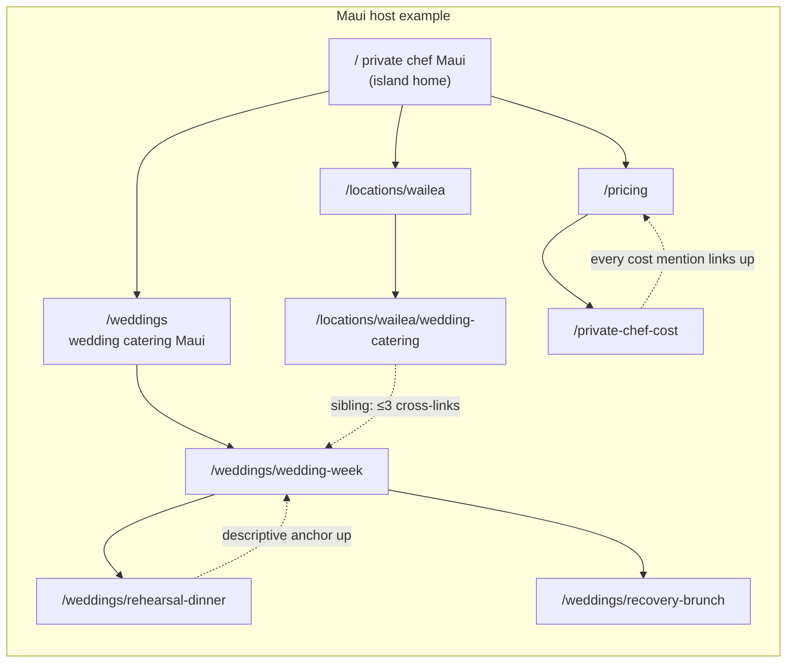

**Table 4.4.1 — Hub-spoke rules (network-wide)**

| # | Rule | Specification | Example |
|---|---|---|---|
| 1 | One owner per keyword | Each URL targets exactly one primary keyword from Chapter 3's map; pre-publish cannibalization test against the register | `/pricing` owns "private chef Maui cost"; no guide may target it |
| 2 | Hub completeness | Every hub page links to 100% of its direct spokes via a curated "Inside this section" block[^02-6^] | `/weddings` (Maui) lists all 18 wedding-cluster pages |
| 3 | Spoke upward link | Every spoke links to its parent hub within the first 25% of body copy, with a descriptive (not exact-match-stuffed) anchor | Rehearsal-dinner page → "part of the Maui wedding week" → `/weddings/wedding-week` |
| 4 | Sibling restraint | Spokes cross-link to ≤3 sibling pages, only where the user journey justifies it | Wailea wedding-catering ↔ wedding-week, Wailea location page |
| 5 | Cost link-up law | Any page mentioning price links to the canonical cost page for its level; guides never re-target cost keywords[^08-15^] | Guide mentions Stay Chef rate → links `/pricing/stay-chef-cost` |
| 6 | Location-to-service wiring | Every location page links its service×location children, the island `/pricing/travel-zones`, and `/coverage` | Princeville page → stay-chef child, travel fees, shore coverage |
| 7 | Guide downward wiring | Every guide ends with 2–4 contextual links to money pages (the PAA answer links the product)[^02-9^] | Kitchen guide → vacation-chef service + groceries policy + quote |
| 8 | Breadcrumbs everywhere | Full breadcrumb trail with BreadcrumbList schema on every page below home[^02-4^] | Home / Locations / Wailea / Wedding catering |
| 9 | Footer discipline | Footer carries trust/company/coverage links only — no keyword-optimized footer blocks, no replicated locations block (current defect)[^01-4^] | Footer: About, Trust, Legal, FAQ, Coverage, Contact |
| 10 | Sitemap governance | XML sitemap is a commented IA document; money pages at priority 0.8–0.9; no page ships unlisted[^02-2^] | `/pricing` at 0.9; guides at 0.5–0.6 |

**Interpretation.** Rules 1, 5, and 9 exist because the current estate broke all three: it enforced ownership via leaked annotations visible to users ("This article does not steal that title"), let blog stubs compete with money pages, and rendered an identical keyword-loaded locations block on every page — twice on the Oʻahu home.[^01-15^][^01-4^] The hub-spoke model makes enforcement structural rather than textual: if the links are right, the ownership is legible to crawlers without a word of annotation. Rule 4's three-sibling cap is the anti-doorway mechanism — it is what stops 14 service×location pages per island from becoming an interlinked mesh of near-duplicates, the exact pattern dim08 flags as the estate's cannibalization risk #2.[^08-13^] Rule 7 converts the rebuilt guides into conversion infrastructure: the sister sites' FAQ/guide pattern ends every answer with an internal link and a mid-page re-CTA, and the Hawaii guides inherit that rhythm.[^02-9^] The mermaid example shows the Maui wedding silo, the network's deepest cluster; Oʻahu's corporate silo, Kauaʻi's retreat silo, and Big Island's dual-hub location silo run identical physics on different spokes.

#### 4.4.2 Cross-subdomain linking rules (restrained, purposeful)

**Cross-host links are the architecture's most dangerous instrument: used freely they blur keyword ownership and split the local relevance signals each island host is built to accumulate; used correctly they transfer statewide authority into commercial pages.** The rule is restraint with named exceptions. The current estate's approach — identical network-wide footers repeating island price slogans on every page — is the cautionary example of what not to do.[^01-1^]

**Table 4.4.2 — Cross-subdomain linking rules**

| Link type | Allowed? | Specification | Rationale |
|---|---|---|---|
| Island switcher (utility nav) | YES | Persistent header switcher listing all four island hosts + hub; plain island names, no keyword anchors | User routing, not SEO; mirrors sister-network "myCHEF around the world" footer[^02-6^] |
| Hub → island money pages | YES | Hub island-chooser, cost-by-island table, and statewide service pages link to the corresponding island pages with descriptive anchors | Authority/router function; hub pushes link equity down to commercial pages[^08-1^] |
| Island → hub trust/pricing-policy | YES | Island pages link up to hub `/trust`, `/legal`, `/pricing/fee-stack`, `/reviews-policy` where policies are network-wide | One canonical policy page; avoids four near-duplicate legal copies competing |
| Island ↔ island comparison links | LIMITED | Only from designated comparison pages (`/compare/*`, statewide cost table); never from service or location page body copy | Prevents ownership blur; "private chef Maui" never appears as anchor on the Oʻahu host |
| Island → island same-service links | NO | No "see also: private chef Kauai" blocks on island service pages | Distinct map packs per island; cross-links add no user value and dilute local relevance[^08-6^][^08-7^] |
| Footer keyword links across hosts | NO | No footer blocks listing island + service keyword combinations across the network | Footer keyword spam pattern; replicates current estate's repeated-slogan defect[^01-1^] |
| Brand/network footer | YES | One plain-text network line: myCHEF Hawaii — Oʻahu · Maui · Kauaʻi · Big Island; plus sister-brand line in hub footer only | Brand context without anchor-text games[^02-6^] |
| Blog/guide cross-island references | LIMITED | Allowed when the comparison is the content (e.g., two-shore Kauaʻi guide referencing seasonal calendars); editorial judgment, max 1–2 per page | Keeps guides natural without opening a linking free-for-all |
| Canonicals | YES | Island variants of network-identical pages (e.g., fee-stack) canonicalize to the hub version unless the page carries island-specific substance | Prevents 5-way duplication of policy content[^01-2^] |
| hreflang | YES | JA cluster pairs with Oʻahu EN equivalents via hreflang `en`/`ja` + `x-default`; no cross-island hreflang | Language targeting only, never island cross-referencing[^03-47^] |

**Interpretation.** The asymmetry in this table is deliberate: authority flows down (hub → islands), trust flows up (islands → hub policies), and sideways flow is nearly closed. That matches how Google treats these SERPs — distinct map packs per island mean local relevance is a per-host asset, and every cross-island service link spends it.[^08-1^][^08-6^] The canonicalization row solves a real duplication trap the sitemaps create: four islands each need fee-stack and policy content for conversion, but five near-identical legal pages would compete with each other — so substantive island variants (travel zones, rate cards, coverage) stay self-canonical while pure policy copies defer to the hub.[^01-19^] The two LIMITED rows exist because restraint needs escape valves: comparison content is precisely where cross-island links belong (a user weighing Maui against Kauaʻi is the one visitor the switcher cannot route), and guides earn editorial latitude that commercial pages never get. The end state is a network where each island host reads as a self-sufficient local business to both users and crawlers — which, per the legal and operational evidence, is exactly what it is.[^06-24^]

**Forward implication.** This architecture is the input contract for Chapters 5 and 7. Chapter 5 inherits 531 URL slots with named parents, owners, and waves, and must fill them against the quality bar set here — 800+ unique words per page, Bali-template location pages, worked-math pricing surfaces. Chapter 7 inherits the disposition table: every one of the 637 legacy URLs maps to a row above as survive, rewrite, fold, or prune, with the 301 register generated from this chapter's URL list. The build sequence follows the waves — P1 money pages first (183 pages network-wide), because every week the current inverted sitemap stays live is another week the estate's strongest asset, its pricing, sits outside the crawl while its weakest pages sit inside it.[^01-25^]

### Sources

*From dim01 (existing-estate audit), dim02 (sister-site architecture), dim03 (Oʻahu), dim04 (Maui), dim05 (Kauaʻi), dim06 (Big Island), dim08 (statewide keyword/ownership intelligence). All accessed 2026-09-06. Prefix `NN-` identifies the source dim file.*

**dim01 — Existing myCHEF Hawaii properties audit**

[^01-1^] myCHEF Hawaii hub homepage — https://mychef-hawaii.com/ (accessed 2026-09-06)
[^01-2^] myCHEF Hawaii network-wide sitemap (637 URLs) — https://mychef-hawaii.com/sitemap.xml (accessed 2026-09-06)
[^01-4^] myCHEF Oʻahu homepage — https://oahu.mychef-hawaii.com/ (accessed 2026-09-06)
[^01-5^] myCHEF Maui homepage — https://maui.mychef-hawaii.com/ (accessed 2026-09-06)
[^01-6^] myCHEF Kauaʻi homepage — https://kauai.mychef-hawaii.com/ (accessed 2026-09-06)
[^01-7^] myCHEF Hawaiʻi Island homepage — https://bigisland.mychef-hawaii.com/ (accessed 2026-09-06)
[^01-8^] myCHEF statewide tariff — https://mychef-hawaii.com/pricing (accessed 2026-09-06)
[^01-10^] myCHEF trust / honesty register — https://mychef-hawaii.com/trust (accessed 2026-09-06)
[^01-13^] myCHEF hub journal stub — https://mychef-hawaii.com/journal/how-much-does-a-private-chef-cost (accessed 2026-09-06)
[^01-15^] myCHEF Oʻahu journal stub with leaked SEO note — https://oahu.mychef-hawaii.com/journal/how-much-does-a-private-chef-cost (accessed 2026-09-06)
[^01-16^] myCHEF Oʻahu fee stack — https://oahu.mychef-hawaii.com/private-chef-cost (accessed 2026-09-06)
[^01-18^] myCHEF catering service page — https://mychef-hawaii.com/catering (accessed 2026-09-06)
[^01-19^] myCHEF legal/booking notes (GET, HRS §481B-14, cancellation posture) — https://mychef-hawaii.com/legal (accessed 2026-09-06)
[^01-21^] myCHEF Oʻahu rate card — https://oahu.mychef-hawaii.com/pricing (accessed 2026-09-06)
[^01-22^] myCHEF Oʻahu blog stub sample — https://oahu.mychef-hawaii.com/blog/cleanup-standard (accessed 2026-09-06)
[^01-23^] myCHEF Kauaʻi rate card — https://kauai.mychef-hawaii.com/pricing (accessed 2026-09-06)
[^01-24^] Google site: queries (site:mychef-hawaii.com and per-subdomain), indexed titles/snippets — 2026-09-06
[^01-25^] Direct HTTP inspection (curl) of headers, HTML head, JSON-LD, and status codes for sitemap-vs-live URL comparison — 2026-09-06

**dim02 — Sister-site architecture (Dubai / Bali)**

[^02-1^] myCHEF Dubai homepage — https://mychef.ae (accessed 2026-09-06)
[^02-2^] myCHEF Dubai sitemap, full URL inventory with silo comments — https://www.mychef.ae/sitemap.xml (accessed 2026-09-06)
[^02-4^] myCHEF Dubai private-chef pricing (four-job table, calculator, cost drivers, FAQ) — https://www.mychef.ae/private-chef-dubai/pricing (accessed 2026-09-06)
[^02-5^] myCHEF Dubai menus (starter packages, dietary matrix) — https://www.mychef.ae/menus (accessed 2026-09-06)
[^02-6^] myCHEF Dubai catering packages hub (occasion router, silo-map blocks, global footer) — https://www.mychef.ae/catering-packages-dubai (accessed 2026-09-06)
[^02-8^] myCHEF Dubai contact (enquiry routing, minimal quote brief) — https://www.mychef.ae/contact (accessed 2026-09-06)
[^02-9^] myCHEF Dubai FAQ (categorised, full-prose answers) — https://www.mychef.ae/faq (accessed 2026-09-06)
[^02-10^] myCHEF Bali homepage (stay vs one-meal split, guarantees) — https://mychef.id/ (accessed 2026-09-06)
[^02-11^] myCHEF Bali sitemap (~200 URLs across silos) — https://mychef.id/sitemap.xml (accessed 2026-09-06)
[^02-12^] myCHEF Bali robots.txt (explicit AI-crawler allows + llms.txt reference) — https://mychef.id/robots.txt (accessed 2026-09-06)
[^02-13^] myCHEF Bali pricing (rate table, estimator, guest-count math) — https://mychef.id/pricing (accessed 2026-09-06)
[^02-14^] myCHEF Bali FAQ (categorised FAQ, deposit/cancellation tiers) — https://mychef.id/faq (accessed 2026-09-06)
[^02-15^] myCHEF Bali programmatic location-page template — https://mychef.id/private-chef/seminyak (accessed 2026-09-06)
[^02-16^] myCHEF Bali fine-dining menus (24 set menus, course breakdowns) — https://mychef.id/fine-dining/menus (accessed 2026-09-06)
[^02-18^] myCHEF Bali why-mychef (evidence pillars, comparison table, guarantees) — https://mychef.id/why-mychef (accessed 2026-09-06)
[^02-19^] myCHEF Bali contact (named coordinators, office address) — https://mychef.id/contact (accessed 2026-09-06)

**dim03 — Oʻahu market deep-dive**

[^03-16^] JP Private Chef menus ("$595/$325/$495 per person"; 27-course kaiseki) — https://personalchefoahu.com/menu-privatechefoahu (accessed 2026-09-06)
[^03-20^] Take a Chef Kailua (localized tiers 132–169 USD) — https://www.takeachef.com/en-us/private-chef/kailua (accessed 2026-09-06)
[^03-23^] Coherent Market Insights, Hawaii & California Private Chef Service Market — https://www.coherentmarketinsights.com/industry-reports/hawaii-and-california-private-chef-service-market (accessed 2026-09-06)
[^03-25^] Chef David Paul anniversary-dinner occasion subpage — https://chefdavidpaul.com/services/personal-chef-honolulu/anniversary-dinner (accessed 2026-09-06)
[^03-32^] Aloha Culinary Group (vacation-rental dining; yacht dining from Ala Wai) — https://www.alohaculinarygroup.com/ (accessed 2026-09-06)
[^03-35^] WeddingWire Honolulu wedding caterers — https://www.weddingwire.com/c/hi-hawaii/honolulu/wedding-caterers/744-3-rca.html (accessed 2026-09-06)
[^03-42^] Fig & Ginger private-party pricing — https://www.fghonolulu.com/corporate-events (accessed 2026-09-06)
[^03-45^] myCHEF Oʻahu Hawaiʻi Kai page (COI/building logistics; North Shore surcharge) — https://oahu.mychef-hawaii.com/locations/hawaii-kai (accessed 2026-09-06)
[^03-47^] Roadgenius Oʻahu tourism statistics (Japan 693,066 in 2024; source markets) — https://roadgenius.com/statistics/tourism/usa/hawaii/oahu/ (accessed 2026-09-06)
[^03-48^] ESPACIO Waikīkī in-suite private-chef kaiseki — https://www.espaciowaikiki.com/experiences/private-chef-experience/ (accessed 2026-09-06)
[^03-50^] Ritz-Carlton Residences Waikīkī Sky Penthouse (chef's kitchen for private dinners) — https://www.luxurytravelmagazine.com/news-articles/must-experience-suites-across-the-globe (accessed 2026-09-06)
[^03-51^] Honolulu Airbnb occupancy/seasonality; Ordinance 22-7 STR limits — https://www.listingok.com/en/airbnb-occupancy/united-states/honolulu/ (accessed 2026-09-06)
[^03-52^] Kahala area home listing ("Beverly Hills of Honolulu," ~1,200 homes) — https://www.hawaiiliving.com/4543-aukai-avenue-kahala-area-home-for-sale-202515828/ (accessed 2026-09-06)
[^03-55^] Ko Olina Beach Villas (Roy Yamaguchi gourmet kitchens) — https://gathervacations.com/vrp/unit/490/ (accessed 2026-09-06)
[^03-56^] Ko Olina real estate (30-day minimum rental period) — https://www.rainbowsandhomes.com/ko-olina-homes-for-sale/ (accessed 2026-09-06)
[^03-58^] Villas of Distinction Lanikai villa (private chef add-on) — https://www.villasofdistinction.com/villa/hawaii/oahu/lanikai-oceanside-5-bedroom (accessed 2026-09-06)
[^03-59^] North Shore Oʻahu activity guide (estate concierge incl. private chef; whales Oct–Apr) — https://pipelineshores.com/pages/ultimate-activity-guide-to-oahu (accessed 2026-09-06)
[^03-60^] Exotic Estates Hawaiʻi Kai villa ("private chef… can be arranged"; 30-day rental) — https://www.exoticestates.com/property/hawaii-vacation-rentals/oahu-villas/aloha-nalu (accessed 2026-09-06)
[^03-61^] EVRHI concierge private-chef service areas — https://evrhi.com/concierge-services/private-chef-services/ (accessed 2026-09-06)
[^03-63^] The Wedding Report, Hawaii market (2025: 17,370 weddings; $927M; avg $53,369; median $21,117) — https://wedding.report/action/wedding_statistics/view/market/id/15/idtype/s/location/Hawaii/ (accessed 2026-09-06)
[^03-64^] HappyLaulea Hawaii wedding statistics (2021: 18,498 weddings; Honolulu 9,943; peaks May/Jul/Oct) — https://www.happylaulea.com/blogs/articles/hawaii-wedding-statistics (accessed 2026-09-06)
[^03-65^] Aloha Bridal Connections Hawaiʻi wedding cost breakdown (catering $13,000–$18,000; $75/head buffet) — https://alohabridalconnections.com/what-does-it-cost-to-get-married-in-hawaii/ (accessed 2026-09-06)
[^03-66^] Oʻahu wedding venues overview (Waimea Valley exclusive caterer Ke Nui Kitchen) — https://emilychoyphotography.com/oahu-wedding-venues/ (accessed 2026-09-06)
[^03-67^] Hawaiʻi Convention Center renovation construction FAQ (modified schedule 2026–2027; reopening early 2028) — https://www.meethawaii.com/convention-center/hawaii-convention-center-renovation-update/construction-faq/ (accessed 2026-09-06)
[^03-69^] Hotel-online: HCC two-year repair schedule; displaced citywides — https://www.hotel-online.com/news/hawaii-convention-centers-2-year-repair-schedule-risks-millions-in-lost-group-trade (accessed 2026-09-06)

**dim04 — Maui market deep-dive**

[^04-3^] Lotus Chefs (team, services, retreat/bridal positioning) — https://lotuschefs.com/ (accessed 2026-09-06)
[^04-8^] Jason Raffin, "Private Chef Maui: The Luxury Dining Experience" (canoe-crop vocabulary) — https://www.jasonraffin.com/post/private-chef-maui-the-luxury-dining-experience-that-brings-the-restaurant-to-you (accessed 2026-09-06)
[^04-23^] Take a Chef Wailea (and Lahaina) location pages — https://www.takeachef.com/en-en/private-chef/wailea (accessed 2026-09-06)
[^04-30^] CJ's Maui all-inclusive wedding package (welcome BBQ + reception + day-after brunch pattern) — https://cjsmaui.com/an-all-inclusive-maui-wedding-package-details-and-bbq-rehearsal-dinner/ (accessed 2026-09-06)
[^04-42^] Wailea Beach Resort culinary team / enhanced private dining program — https://www.hotel-online.com/news/wailea-beach-resort-names-culinary-team (accessed 2026-09-06)
[^04-44^] myCHEF Maui wedding-catering page (wedding-week product + pricing) — https://maui.mychef-hawaii.com/wedding-catering (accessed 2026-09-06)
[^04-45^] myCHEF Maui vacation-chef page (Stay Chef from $1,050/day) — https://maui.mychef-hawaii.com/vacation-chef (accessed 2026-09-06)
[^04-49^] HappyLaulea Hawaii wedding statistics (4,659 Maui weddings 2021; peak months) — https://www.happylaulea.com/blogs/articles/hawaii-wedding-statistics (accessed 2026-09-06)
[^04-50^] Parrish Maui, "Personal Chef Service Is a Maui Must" (Kapalua villa chef referrals) — https://www.parrishmaui.com/blog/personal-chef-service-is-a-maui-must/ (accessed 2026-09-06)
[^04-52^] Maui Wedding Vendors, Maui wedding cost (catering/bar per-person table) — https://mauiweddingvendors.com/maui-wedding-cost/ (accessed 2026-09-06)
[^04-53^] Maui Destination Weddings, beach wedding permits guide (DLNR permit, ~20-person cap) — https://mauidestinationweddings.com/maui-beach-wedding-permits-complete-guide-2026/ (accessed 2026-09-06)
[^04-54^] Simple Maui Wedding ($3,100–$15,000 packages) — https://simplemauiwedding.net/get-married-in-maui-in-2026/ (accessed 2026-09-06)
[^04-58^] Hawaii.com, Visiting Lahaina Maui 2026 (activity shifted north; 100 homes rebuilt) — https://hawaii.com/blog/visiting-lahaina-maui-2026 (accessed 2026-09-06)
[^04-64^] Maui Accommodations, Wailea & Makena condo/villa rentals ($390–$2,995/night) — https://www.mauiaccommodations.com/accommodations/maui-condo-rentals/south-maui-condos-villas/wailea-and-makena-south-maui-condos-villas/ (accessed 2026-09-06)
[^04-65^] The Hawaii Vacation Guide, where to stay (South Maui hotel ADR $623–$1,054) — https://thehawaiivacationguide.com/where-to-stay-in-hawaii/ (accessed 2026-09-06)
[^04-67^] Tyler Coons Maui, Wailea/Makena communities (Makena estates $6–32M) — https://tylercoonsmaui.com/community/wailea-makena/ (accessed 2026-09-06)
[^04-69^] Kukahiko Estate venue page (venue kitchen built for caterers) — https://www.kukahikoestateweddings.com/venue.htm (accessed 2026-09-06)
[^04-72^] Exotic Estates, Kaanapali Shoreline Estate (11BR, 3 kitchens) — https://www.exoticestates.com/property/hawaii-vacation-rentals/maui-villas/kaanapali-shoreline-estate (accessed 2026-09-06)
[^04-73^] Ritz-Carlton Maui Kapalua (468 rooms, weddings) — https://www.marriott.com/hotels/maps/travel/jhmrz-the-ritz-carlton-maui-kapalua/ (accessed 2026-09-06)
[^04-74^] Hawaii Real Estate Search, Kapalua condo vacation rentals ($1.5–2M) — https://www.hawaiirealestatesearch.com/maui/kapalua-condos-vacation-rentals (accessed 2026-09-06)
[^04-76^] Wedding-spot Maui venues (Kīhei/Wailea accommodation hubs) — https://www.wedding-spot.com/wedding-venues/hawaii/maui/ (accessed 2026-09-06)
[^04-77^] Hawaii Real Estate Search, Honokōwai condo vacation rentals (Nāpili/Kahana VR belt) — https://www.hawaiirealestatesearch.com/maui/honokowai-condos-vacation-rentals (accessed 2026-09-06)
[^04-79^] Radical Storage destination-wedding statistics (Maui top-25 global) — https://radicalstorage.com/travel/destination-wedding-statistics/ (accessed 2026-09-06)
[^04-82^] Olowalu Plantation House rates (packages incl. catering; planner list) — https://www.olowaluplantationhouse.com/rates/ (accessed 2026-09-06)
[^04-86^] A Maui Wedding Day, Haiku Mill venue guide (rate card $2,500–$10,500 + fees) — https://www.amauiweddingday.com/maui-wedding-venues/haiku-mill (accessed 2026-09-06)
[^04-87^] Haiku Mill events (preferred-vendor requirement; $650 outside-vendor fee) — http://haikumill.com/events/ (accessed 2026-09-06)
[^04-91^] Four Seasons Maui wedding venues (capacities) — https://www.fourseasons.com/maui/weddings/venues/ (accessed 2026-09-06)
[^04-92^] Ritz-Carlton Kapalua wedding-weekend pattern (welcome party, rehearsal, farewell brunch) — https://matiasezcurraphotography.com/ritz-carlton-kapalua-a-luxury-maui-wedding-venue/ (accessed 2026-09-06)
[^04-101^] Private Paradise Villas (ex-Four Seasons concierge; in-villa chef service) — https://www.privateparadisevillas.com/kaanapali-maui-hawaiian-house.aspx (accessed 2026-09-06)

**dim05 — Kauaʻi market deep-dive**

[^05-2^] Kauai Private Chef services (kitchen stocking) — https://www.kauaiprivatechef.com/Services.html (accessed 2026-09-06)
[^05-6^] Ania's Table Kauaʻi private chef (≤40-guest events; rehearsal/elopement targeting) — https://www.aniastable.com/kauai-private-chef (accessed 2026-09-06)
[^05-11^] Chef Leo Kauaʻi wedding catering (Ayurvedic/detox dietary list) — http://chef-leo-kauai.com/events/weddings (accessed 2026-09-06)
[^05-16^] myCHEF Kauaʻi weddings/journal pages (pricing, bridge clause, live locations) — https://kauai.mychef-hawaii.com/weddings (accessed 2026-09-06)
[^05-20^] Take a Chef Kauai (stats & per-person tiers) — https://www.takeachef.com/en-us/private-chef/kauai (accessed 2026-09-06)
[^05-21^] Take a Chef Poipu (stats; ~$176/pp avg) — https://www.takeachef.com/en-us/private-chef/poipu (accessed 2026-09-06)
[^05-24^] yhangry Princeville & Hanalei pages — https://yhangry.com/f/private-chefs/us-hawaii-kauai--county-princeville/ (accessed 2026-09-06)
[^05-25^] Sunset travel directory, Pure Kauai (from $450/night; chef via concierge) — https://sunset.com/travel/travel-directory/pure-kauai-luxury-vacation-rentals (accessed 2026-09-06)
[^05-26^] Pure Kauai concierge (private chefs) — https://www.purekauai.com/concierge/ (accessed 2026-09-06)
[^05-27^] Poipu Kapili concierge (private gourmet chef & grocery stocking) — https://poipukapili.com/concierge/kauai-pampering-other-indulgences/ (accessed 2026-09-06)
[^05-29^] Exceptional Villas, Secret Cove Kīlauea ($3,750–$8,250/night) — https://www.exceptionalvillas.com/secret-cove/l52002 (accessed 2026-09-06)
[^05-31^] Kauai Style, Kalihiwailani estate (events; farm-to-fork chef) — https://kauaistyle.com/kauai-estate/ (accessed 2026-09-06)
[^05-33^] The Wedding Report, Kauai County market (2025: 2,072 weddings; $107.2M; avg $51,719) — https://wedding.report/action/wedding_statistics/view/market/id/15007/idtype/c/location/Kauai_HI/ (accessed 2026-09-06)
[^05-34^] Aloha Bridal Connections, Kauaʻi wedding cost (estate-wedding catering $12,000+/50 guests) — https://alohabridalconnections.com/what-does-it-cost-to-get-married-on-kauai/ (accessed 2026-09-06)
[^05-35^] BookRetreats, Kauaʻi yoga retreat listings & prices — https://bookretreats.com/s/yoga-retreats/kauai (accessed 2026-09-06)
[^05-36^] Come Together Wellness (5-day private-chef culinary experience included) — https://www.cometogetherwellness.com/ (accessed 2026-09-06)
[^05-38^] Kauai Honeymoon, Kilauea Lakeside Estate eco-luxury retreat — https://www.kauaihoneymoon.com/ (accessed 2026-09-06)
[^05-40^] HDOT: Hanalei Bridge full nightly closures, May 12–16, 2025 — https://hidot.hawaii.gov/highways/2025/05/page/2/ (accessed 2026-09-06)
[^05-41^] HDOT: Hanalei Hill slope-stabilization closures, April 1–2, 2025 — https://hidot.hawaii.gov/blog/2025/03/28/full-closures-of-kuhio-highway-at-hanalei-hillside-every-half-hour-april-1-2/ (accessed 2026-09-06)
[^05-42^] Merriman's Poipu private events (up to 100 guests) — https://www.merrimanshawaii.com/private-events-kauai/ (accessed 2026-09-06)
[^05-43^] Club at Kukuiʻula dining (Executive Chef; member in-house dining) — https://kukuiula.com/destination/dining/ (accessed 2026-09-06)
[^05-44^] Love Big Island, best time to visit Kauai (seasonality; N/S shore split; ADR) — https://www.lovebigisland.com/hawaii-blog/the-best-time-to-visit-kauai/ (accessed 2026-09-06)
[^05-45^] Gather Vacations Kauaʻi regions (Kapaʻa largest town) — https://gathervacations.com/vacation-rentals/hawaii/kauai-rentals/ (accessed 2026-09-06)
[^05-46^] Royal Sonesta Kauaʻi Resort weddings — https://kauairesort.sonesta.com/weddings/ (accessed 2026-09-06)
[^05-48^] LiveFree Events, Wild at Heart Kauaʻi (Makanalani retreat house, Kīlauea, 100 acres) — https://livefreeevents.org/events/wild-at-heart-basics-kauai/ (accessed 2026-09-06)
[^05-51^] Surf n Sol Kauaʻi surf/yoga camp — https://surfnsol.com/kauai/ (accessed 2026-09-06)
[^05-54^] Pure Kauai, Secret Beach House estate (8BR) — https://www.purekauai.com/island-guide/secret-beach-house-kauai/ (accessed 2026-09-06)
[^05-55^] Wedding-spot Hawaiʻi wedding regions (Kauaʻi intimate/nature positioning) — https://www.wedding-spot.com/wedding-venues/hawaii/ (accessed 2026-09-06)
[^05-56^] Aloha Bridal Connections, Nā ʻĀina Kai wedding portfolio — https://alohabridalconnections.com/portfolio/na-aina-kai-wedding-love-story/ (accessed 2026-09-06)
[^05-58^] Stormrider surf, Kauaʻi micro-climates (Waiʻaleʻale rainfall record) — https://www.stormrider.surf/region/kauai (accessed 2026-09-06)
[^05-66^] Roadgenius Kauaʻi tourism statistics (88% US domestic; ~7k Japanese visitors) — https://roadgenius.com/statistics/tourism/usa/hawaii/kauai/ (accessed 2026-09-06)
[^05-69^] Ocean Safety Hawaiʻi surf seasons (winter high-surf Nov–Apr north/west shores) — https://oceansafety.hawaii.gov/hawaiis-surf-seasons/ (accessed 2026-09-06)
[^05-70^] Hanalei–Princeville photo guide (Hanalei Farmers Market, ~25 organic farmers) — https://agpixart.com/destinations/north-america/kauai-hi/hanalei-princeville/ (accessed 2026-09-06)

**dim06 — Hawaiʻi Island / Big Island market deep-dive**

[^06-2^] Epicurate, family-style dinner with Chef Rio (Kohala Coast communities named) — https://epicurate.vip/experiences/hawaii/culinary/family-style-meals/family-style-dinner-with-chef-rio/cmkyfkw8i00a00os662mlyuiv (accessed 2026-09-06)
[^06-3^] Rio Chef menus ("Starting prices begin at $175 per person"; provenance vocabulary) — https://www.riochef.com/menus (accessed 2026-09-06)
[^06-5^] Epicurate marketplace listing (server pricing; capacity 2–24) — https://epicurate.vip/ (accessed 2026-09-06)
[^06-7^] Take a Chef Big Island (price tiers; 73+ chefs; ~$176/pp avg) — https://www.takeachef.com/en-us/private-chef/big-island (accessed 2026-09-06)
[^06-13^] Outrageous Gourmet (luau specialist; private-jet catering) — https://outrageousgourmet.com/ (accessed 2026-09-06)
[^06-15^] Papa Kona Events & Catering (packages; 23% service charge) — https://papakonaevents.com/ (accessed 2026-09-06)
[^06-17^] Zola, Papa Kona ("Food starts at $75 per person") — https://www.zola.com/wedding-vendors/wedding-catering/papa-kona (accessed 2026-09-06)
[^06-21^] HeartBeet Catering, Hilo (sole premium east-side chef-caterer) — https://www.weddingwire.com/biz/heartbeet-catering-hilo/40d6a32502374b92.html (accessed 2026-09-06)
[^06-22^] Big Island of Hawaiʻi Catering / Chef Laura Dawn, Puna (2019 profile — status unverified) — https://ilovehawaii.com/big-island/things-to-do/chef/ (accessed 2026-09-06)
[^06-24^] myCHEF Big Island rate card (travel zones; east side quoted; Kona→Hilo 2.5–3 hrs) — https://bigisland.mychef-hawaii.com/ (accessed 2026-09-06)
[^06-25^] myCHEF about page ("Kona–Kohala first; east side quoted") — https://mychef-hawaii.com/about (accessed 2026-09-06)
[^06-26^] Hawaiʻi DBEDT / HTA visitor data (Hawai'i Island county reports) — 2026-09-06
[^06-27^] KE Team Hawaii, 2024 Big Island real-estate review (resort medians: Mauna Lani $5.5M, Mauna Kea $6.75M, Kukio $19M, Hualālai $9.63M) — https://www.keteamhawaii.com/2024-big-island-real-estate-review-kailua-kona-and-resorts/ (accessed 2026-09-06)
[^06-28^] Don's Grill Hilo catering; Kawamoto Store catering — https://www.donsgrillhilo.com/catering-services (accessed 2026-09-06)
[^06-29^] Kona Sunsets vacation rentals ("Personal Chef Package" concierge offering) — 2026-09-06
[^06-31^] Hawaii Magazine 2025 Readers' Choice (Volcano House, best non-beach wedding venue) — 2026-09-06
[^06-32^] Wedding-spot Anna Ranch listing (older data — verify) — 2026-09-06
[^06-33^] Hawaii Life, Hualālai/Kukio/Kohanaiki differences (9–12 in/yr rain; lava-strewn design) — https://www.hawaiilife.com/blog/hualalai-resort-kukio-kohanaiki-differences/ (accessed 2026-09-06)
[^06-34^] Hilo climate normals (100+ in/yr rainfall), NOAA/GoHawaii references — 2026-09-06
[^06-35^] Fairmont Orchid wedding packages (F&B minimums $7,500–$15,000 by tier/day) — https://www.fairmontorchid.com/gather/weddings/wedding-packages/ (accessed 2026-09-06)
[^06-36^] Here Comes The Guide, Fairmont Orchid ("$5,000–15,000/event… 25%" service charge) — https://www.herecomestheguide.com/wedding-venues/hawaii/fairmont-orchid (accessed 2026-09-06)
[^06-49^] Ironman World Championship Kona (annual October), GoHawaii/Ironman references — 2026-09-06

**dim08 — Statewide keyword/demand intelligence & competitor SEO patterns**

[^08-1^] Google SERP "private chef hawaii" (map pack, PAA, PASF: Honolulu/Oahu/Hilo/Big Island/Kona) — https://www.google.com/search?q=private+chef+hawaii (accessed 2026-09-06)
[^08-2^] Take a Chef Honolulu County — https://www.takeachef.com/en-us/private-chef/honolulu-county (accessed 2026-09-06)
[^08-3^] Take a Chef Kailua-Kona (price table; "for 6 people… costs less than dinner out") — https://www.takeachef.com/en-us/private-chef/kailua-kona (accessed 2026-09-06)
[^08-4^] Take a Chef Maui — https://www.takeachef.com/en-us/private-chef/maui (accessed 2026-09-06)
[^08-6^] Google SERP "private chef maui" (map pack; PASF: cost, Wailea, Lahaina, Kaanapali, sushi chef) — https://www.google.com/search?q=private+chef+maui (accessed 2026-09-06)
[^08-7^] Google SERP "private chef kauai" (map pack; Facebook threads; marketplace pricing) — https://www.google.com/search?q=private+chef+kauai (accessed 2026-09-06)
[^08-13^] myCHEF Kauaʻi weddings page — https://kauai.mychef-hawaii.com/weddings (accessed 2026-09-06)
[^08-14^] Google SERP "private chef hawaii cost" (AI Overview; map pack; PAA) — https://www.google.com/search?q=private+chef+hawaii+cost (accessed 2026-09-06)
[^08-15^] Jason Raffin, "Private Chef Pricing Maui" — https://www.jasonraffin.com/post/breaking-down-the-cost-of-a-private-chef-in-maui-private-chef-pricing-maui (accessed 2026-09-06)
[^08-18^] Google SERP "private chef for vacation rental hawaii" (AI Overview; concierge pages rank) — https://www.google.com/search?q=private+chef+for+vacation+rental+hawaii (accessed 2026-09-06)
[^08-20^] Parrish Collection Kauai private chefs; Ali'i Resorts Maui vacation private chef — https://www.parrishkauai.com/private-chefs/ (accessed 2026-09-06)
[^08-21^] myCHEF Hawaii homepage — https://mychef-hawaii.com/ (accessed 2026-09-06)
[^08-27^] Take a Chef Poipu FAQ ("What does a private chef service include"); Waikiki page — https://www.takeachef.com/en-us/private-chef/poipu (accessed 2026-09-06)
[^08-29^] Take a Chef blog, "How much do you tip a private chef?" — https://www.takeachef.com/blog/en/how-much-do-you-tip-private-chef (accessed 2026-09-06)
[^08-33^] myCHEF Big Island journal, how far ahead to book — https://bigisland.mychef-hawaii.com/journal/how-far-ahead-to-book (accessed 2026-09-06)
[^08-36^] Jason Raffin, "Private Chef Maui: A Vacation Game-Changer" (FAQ; booking windows) — https://www.jasonraffin.com/post/private-chef-maui (accessed 2026-09-06)
[^08-39^] Reddit r/MauiVisitors, "Private chef and meal prep service" (Wailea 12/22–1/1) — via SERP (accessed 2026-09-06)
[^08-40^] Take a Chef Ko Olina — https://www.takeachef.com/en-us/private-chef/ko-olina (accessed 2026-09-06)
[^08-41^] Take a Chef Lahaina — https://www.takeachef.com/en-us/private-chef/lahaina (accessed 2026-09-06)
[^08-42^] Take a Chef Kapalua — https://www.takeachef.com/en-us/private-chef/kapalua (accessed 2026-09-06)
[^08-43^] Take a Chef Princeville — https://www.takeachef.com/en-us/private-chef/princeville (accessed 2026-09-06)
[^08-44^] yhangry Princeville private chef — https://yhangry.com/f/private-chefs/us-hawaii-kauai--county-princeville/ (accessed 2026-09-06)
[^08-46^] Google SERP "private chef oahu OR kauai OR big island reddit" (r/kauai, r/BigIsland, r/VisitingHawaii threads) — https://www.google.com/search?q=private+chef+oahu+OR+kauai+OR+%22big+island%22+reddit (accessed 2026-09-06)
[^08-47^] myCHEF Dubai private-chef FAQ (question patterns) — https://www.mychef.ae/private-chef-dubai (accessed 2026-09-06)
[^08-59^] Cozymeal, Private Chef Jobs Oahu — https://www.cozymeal.com/jobs/private-chef-oahu-hi (accessed 2026-09-06)

*Internal project documents referenced by section (no external URL): mychef_hi_cross_verification.md (tiers H1–H16; conflict register §4.1–4.6; MUST-CAVEAT register §6; REQUIRES LEGAL VERIFICATION register §7); mychef_hi_insight.md (Insights 1–12); dim01–dim08 dimension reports. Keyword demand labels throughout this chapter are ESTIMATED; numeric keyword volumes are never quoted per the cross-verification MUST-CAVEAT register.*

---

## 5. Commercial Architecture

The commercial system this chapter specifies is built on one structural fact: myCHEF Hawaii already owns the rarest asset in its market — a published, itemized, per-island tariff — while almost every competitor hides behind "call for quote." On Oʻahu, only JP Private Chef ($325–$595/person), Kenekes ($67.88–$108.88/guest wedding menus), and the marketplaces publish any numbers at all.[^03-16^][^03-36^] On Maui, the published set is Chef Kristin (hourly), Smoke & Spice (course ladder), Lotus Chefs (bands), and Aloha Party Chef ($250–$350/person).[^04-2^][^04-18^][^04-5^][^04-15^] Kauaʻi has two of fourteen local operators publishing.[^05-1^][^05-5^] Hawaiʻi Island has exactly one price floor — Chef Rio's "$175 per person" start.[^06-3^] The rebuild's commercial job is therefore not to invent a pricing strategy but to *systematize* the one that exists: anchor every number to the approved published cards, wrap them in the sister-network's worked-math and estimator mechanics, and mark every number that is not yet published as **PRICE REQUIRES APPROVAL**.

Three design principles govern everything below. First, the written quote is the confirmed total; every web price is a published tariff line, never a teaser.[^01-8^] Second, the fee stack (20% service charge, GET up to 4.7120%, 50% deposit, voluntary gratuity, travel zone lines) is displayed as separate lines everywhere — it is legally literate and competitors actively fumble it (resorts charge 23–25% service; one Kauaʻi venue adds "25% gratuity… to all food & drinks").[^01-19^][^06-36^][^06-15^][^05-17^] Third, no price appears on the site that is not already published myCHEF policy or traceable competitor evidence; anything else carries an approval flag.

### 5.1 Pricing Architecture

#### 5.1.1 Recommended pricing structure per island anchored to sourced competitor evidence

The recommendation is to hold the published cards as the architecture and fix their known defects — the Big Island "from $125" hero contradicting its own $150 CORE / $110 ENTRY card, and the Table/ENTRY naming drift between hub and island hosts.[^01-7^] The evidence says the published bands are correctly positioned: on every island the Signature/CORE band sits at or slightly above the marketplace band, and below the ultra-premium independents — the defensible middle-luxury slot.

| Island | myCHEF published band (VERIFIED, currently published) | Marketplace anchor (Take a Chef, published tiers) | Local operator anchors (published) | Positioning verdict |
|---|---|---|---|---|
| Oʻahu | Signature $125–$190/guest; Table $95–$125; Premium $190–$275; Chef's table $275–$400+; Stay Chef from $850/day; Date Night from $450 [^01-21^] | $110–$149/pp by group size; average booked menu $190.6/pp (reflects menu choices/add-ons, not a tier) [^07-5^] | JP Private Chef $325–$595/pp [^03-16^]; Kenekes wedding menus $67.88–$108.88/guest [^03-36^] | CORE overlaps Take a Chef's *booked average* while beating its tier opacity; Chef's table undercuts JP's $325 floor |
| Maui | Villa dinner $150–$250/guest; Stay Chef from $1,050/day; Date Night from $500+; Packaged cart from $800/4 hr [^01-5^] | $119–$171/pp; average booked ~$175/pp [^07-2^] | Smoke & Spice $125–$170 course ladder, $250 chef's table [^04-18^]; Lotus $75–$200+/pp/meal, $165+ fine dining [^04-5^]; Chef Matt $250–$350/pp [^04-15^] | Band brackets the market's entire credible range; premium headroom proven by Chef Matt's $250–$350 |
| Kauaʻi | Signature $150–$250/guest; Table $125–$150; Premium $250–$350; Chef's table $350+; Stay Chef from $1,100/day; Date Night $650–$950 [^01-23^] | $118–$210/pp; average booked ~$176/pp [^07-3^] | Kauaʻi Cut $200–$250/pp five-course [^05-5^]; Dani Felix $125/hr + assistant $50–$60/hr, food separate [^05-1^] | CORE undercuts the island's only published per-person independent while the day rate is the only published multi-day rate in-market |
| Hawaiʻi Island | CORE $150–$225/guest; ENTRY from $110; Stay Chef from $950/day; Date Night from $550; Packaged cart from $725/4 hr [^01-7^] | $106–$169/pp; average booked ~$176/pp [^07-4^] | Rio Miceli from $175/pp [^06-3^]; typical private dinner $150–$250+/pp for 4–8 guests [^06-4^] | $110–$225 occupies the gap between marketplace mid-market ($106–$176) and Rio's $175 floor; hero "$125" inconsistency must be fixed, not migrated |

The table shows the bands are not arbitrary. Where a marketplace publishes $106–$210/pp, myCHEF's $125–$250 reads as premium-but-rational; where independents publish $115–$150/hour for chef labor (Chef Kristin $115/hr Hawaiʻi rate; Dani Felix $125/hr regular, $150/hr holiday), myCHEF's per-guest packaging converts the same labor economics into a format a villa guest can actually compare.[^07-12^][^07-13^] Two structural advantages should be preserved verbatim. One, groceries-inside-the-band on the dinner card versus the market norm of "FOOD COST IS SEPARATE FROM HOURLY LABOR COSTS" — the all-in band removes the single largest quote-variance anxiety.[^01-21^][^07-13^] Two, per-island differentiation is validated by the market itself: Take a Chef's own per-island variation (Kauaʻi two-person $210 vs Big Island $169) proves island-specific rate cards match how the product is actually bought.[^07-3^][^07-4^] No new island price is proposed anywhere in this chapter; where packaging below implies a number not on the published cards, it is flagged **PRICE REQUIRES APPROVAL**.

The chart makes the strategic point visually: on Maui and Kauaʻi the myCHEF band deliberately extends above the marketplace ceiling — that is where the estate/villa buyer lives — while on Hawaiʻi Island the ENTRY-from-$110 line contests the marketplace's own floor ($106) from above. The diamonds (Take a Chef's *average booked* menu, ~$175–$176 on three islands and $190.6 on Oʻahu) sit inside or just above the myCHEF band on every island: the market's revealed willingness to pay already validates the published cards.[^07-2^][^07-3^][^07-4^][^07-5^]

#### 5.1.2 Price-page system: tables by guest count, included/excluded lines, service charge + GET treatment

Each island `/pricing` page (plus the hub "tariff" page) should follow one anatomy, adapted from the sister sites' proven blocks — the Bali guest-count multiplication table and the Dubai cost-driver section are the two highest-value imports.[^02-13^][^02-4^]

| # | Block | Spec | Source pattern |
|---|---|---|---|
| 1 | Hero rate card | Four tiers (Table / Signature / Premium / Chef's table) with per-guest bands, groceries-included flag, per-island | Existing published cards [^01-21^][^01-23^] |
| 2 | Worked-math table | Per-person price × guest count grid (2 / 4 / 8 / 12 guests) at band midpoint and band edges, labeled "illustrative math on published rates" | Bali multiplication table [^02-13^] |
| 3 | Included / separate twin lists | Included: menu design, same-day shopping, cooking, table service, cleanup, groceries inside the band. Separate: staffing hourlys (server $55/hr, sous $75/hr, 4-hr floor), bar cart, travel zone lines, rentals | Published cards + sister twin lists [^01-21^][^02-4^] |
| 4 | Fee-stack block (named, taught) | 20% service charge (distributed to staff or disclosed in writing — HRS §481B-14 posture); GET up to 4.7120% as its own line, valid through 12/31/2030, never the obsolete 4.166%; 50% deposit locks the date; gratuity always voluntary | Existing /legal posture, verified against DOTAX [^01-19^][^07-28^][^07-32^] |
| 5 | Travel-zone lines | Base zone free; published flat surcharges (e.g., North Shore/Turtle Bay from $75; Princeville/Poʻipū $50–$75; outside Kona–Kohala from $75; "east side is its own quote") | Published cards; competitor norm $50–$75 flat/day, $100–$500 delivery [^01-21^][^01-23^][^07-13^][^07-20^] |
| 6 | Cost-driver section | What moves the price: guest count, menu, ingredient market prices (Hawaiʻi groceries ~31–53% above mainland), date (holiday premiums are market standard — $150/hr holiday chef rate published by a Kauaʻi competitor), crew size | Dubai cost drivers; sourced cost context [^02-4^][^07-64^][^07-13^] |
| 7 | Comparison row | "Service charge: 20% vs 23–25% resort norm" on wedding/corporate price surfaces | Fairmont Orchid 25%; Papa Kona 23% [^06-36^][^06-15^] |
| 8 | Quote hand-off | "The written quote is the confirmed total — never a chat estimate"; CTA to quote form/WhatsApp with response-time promise (REQUIRES APPROVAL — no Hawaii response-time SLA is published) | Network mantra; sister response-time pattern [^01-8^][^02-1^] |

The worked-math table (block 2) deserves emphasis because it converts the published band into a booking decision without inventing a single new price. Example, using Maui's published $150–$250 band: two guests $300–$500, four guests $600–$1,000, eight guests $1,200–$2,000, twelve guests $1,800–$3,000 — pure arithmetic on approved rates, each cell individually defensible. This is exactly the Bali pattern ("2 guests IDR 1.4M++ · 4 guests IDR 2.8M++") that the network has already proven converts browsers.[^02-13^] The fee-stack block (block 4) is the legal centerpiece: HRS §481B-14 requires that a service charge either be distributed to staff as tip income or be conspicuously disclosed as covering other costs, and a mandatory charge may never be labeled a gratuity.[^07-32^][^07-33^] The exact disclosure wording is **REQUIRES LEGAL VERIFICATION** before copy lock, as is the status of SB1256-successor legislation (the 2025 bill died in committee, but 2026-session outcomes need confirmation).[^07-34^] The GET line is verified accurate as published — 4.5% owed in all four counties, 4.7120% maximum visible pass-on, county surcharges sunset 12/31/2030 — which means the pass-on line needs a scheduled review date in the CMS, not just a hard-coded sentence.[^07-28^] Competitor behavior makes this block a conversion asset, not compliance hygiene: Tailor Made buries "GE TAX 20% Service Charge & Labor & rentals" in fine print, and A Catered Experience's plain "20% service fee and 4.712% tax added to total" is the market's only comparable act of clarity.[^03-37^][^07-21^]

#### 5.1.3 Interactive estimator concept with "estimate only" framing; PRICE REQUIRES APPROVAL flags

Both sister sites run embedded estimators that hand off to a human-confirmed written quote: Bali's `/pricing` estimator (service type → guest range → duration → add-ons → live subtotal → "Get exact quote on WhatsApp") and Dubai's plan-builder ("Send this plan to myCHEF" — coordinator confirms the exact figure in writing).[^02-13^][^02-4^] Hawaii should adopt the mechanics with one structural difference: the estimator's price logic must be generated *from the published rate card as data* (tiers × guest count + staffing hourlys + travel zone + 20% + GET), so the tool can never output a number the tariff does not contain. Any derived convenience figure the card does not already imply — a per-person/day blended rate, a package bundle total, a volume-discount price — is **PRICE REQUIRES APPROVAL** until the business confirms it.

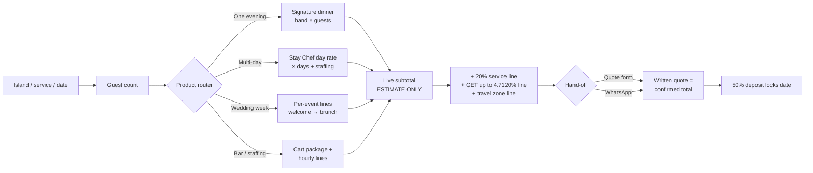

The "estimate only" framing is not hedging; it is the brand's existing promise made interactive — "the written quote is the confirmed total — never a chat estimate."[^01-8^] Two microcopy requirements follow. First, the estimator must show the fee stack as separate computed lines (never a single all-in number), teaching the notation the way Bali teaches "++" with a dedicated FAQ entry.[^02-14^] Second, it must degrade honestly: for quote-only geographies (Pāʻia/Haʻikū, far-North Hāʻena, Big Island east side) the estimator returns the published "quoted at inquiry" stance with the operational reason — per-island DOH permits, drive times, roster depth — rather than a fake number.[^01-5^][^01-23^][^07-41^] That honesty is itself a differentiator: no competitor explains *why* coverage is zoned, and the explanation (no inter-island vehicle ferry, $1,000–$2,500 barge moves, $80–$120 inter-island flights, 2.5–3 hr Kona–Hilo drive) converts a limitation into proof of operational literacy.[^07-41^][^07-72^][^06-24^]

### 5.2 Product and Menu Architecture

#### 5.2.1 Packaged products (Arrival Night Dinner, Chef for a Week, Sunset Dinner, etc.) with specs

The packaging grammar comes from the sister sites — occasion-named, guest-count-anchored cards with "From $X," a one-sentence scope, a "Best for:" line, and a per-card CTA — but every package name and price below maps onto an already-published myCHEF line, so the catalog adds merchandising clarity without inventing a single rate.[^02-1^][^02-5^] Packages are entry points into the tariff, not new prices: each card's "from" figure is a verbatim published number, and any bundle total is **PRICE REQUIRES APPROVAL**.

| Package (proposed card name) | Maps to published line | Guests / duration | Published "from" price | What's inside the band | Best for |
|---|---|---|---|---|---|
| **Arrival Night Dinner** | Signature/CORE dinner | 4–12, one evening | $125/guest Oʻahu · $150 Maui, Kauaʻi, Hawaiʻi Island [^01-8^] | Menu design, same-day shopping, cooking, table service, cleanup; groceries inside the band [^01-21^] | Villa groups' first night — the highest-frequency use case in the market |
| **Sunset Dinner (Date Night)** | Date Night / dinner for two / elopement | 2, one evening | $450 Oʻahu · $500+ Maui · $650–$950 Kauaʻi · $550 Hawaiʻi Island [^01-21^][^01-5^][^01-23^][^01-7^] | Fixed-price coursed evening for two; premium island bands reflect thin two-person economics (Take a Chef charges $210/pp for two on Kauaʻi vs $118 at 7–12) [^07-3^] | Honeymoons, proposals, anniversaries |
| **Chef for a Week (Stay Chef)** | Stay Chef day rate | Multi-day, villa kitchen | $850/day Oʻahu · $1,050 Maui · $1,100 Kauaʻi · $950 Hawaiʻi Island [^01-8^] | Full-day chef; groceries billed at cost with receipts; extra meals quoted same-day [^01-4^] | Week-long villa stays; the only published multi-day chef product in the state |
| **Family Feast** | Signature dinner, family-style format | 6–12, one evening | Same bands as Signature dinner [^01-8^] | Family-style/plated coursed dinner; kids-menus line exists network-wide [^01-2^] | Multi-generational groups |
| **Wedding Week** | Wedding week lines | 10–75 guests, 3–5 events | From $125/pp Oʻahu · $150 Maui & Hawaiʻi Island · $175 Kauaʻi, + staffing [^01-21^][^04-44^][^01-23^][^01-7^] | See §5.3.1 — welcome, rehearsal, ceremony-adjacent, reception, recovery brunch as separate lines | Destination-wedding couples at estates/villas |
| **Packaged Cart (bar)** | Mobile bar package | Add-on, 4 hr | $650/4 hr + $45/guest Oʻahu · $800/4 hr Maui · $725/4 hr Hawaiʻi Island · $850/4 hr + $60/guest Kauaʻi [^01-21^][^01-5^][^01-7^][^01-23^] | Cart + bartender service; **alcohol itself is BYO/referral — see legal flag below** | Receptions, villa parties |
| **Kamaʻāina Weekly** | Weekly meal-prep / resident line | Resident household, recurring | From $300/wk Oʻahu (to $1,200); from $550–$1,200/wk Kauaʻi [^01-21^][^01-23^] | Weekly household cook day + groceries at cost | Residents — the retention and shoulder-season revenue floor |
| **Recovery Brunch / Day-After** | Wedding-week brunch line | 10–40, morning | Priced within wedding-week lines (per-guest food + staffing) [^01-8^] | Brunch service, cleanup | Wedding parties; standalone whitespace term |
| **Retreat Full-Board** | Stay Chef + per-person/day | 8–16, 3–7 days | Stay Chef day rate + vacation-chef per-person/day ($179–$300+ Oʻahu; $250–$300+ Kauaʻi) [^01-21^][^01-23^] | Multi-day meal plans; dietary-protocol depth (§5.2.2) | Retreat hosts (B2B) — Kauaʻi and Big Island first |

Two catalog rules. First, every card carries a "what's separate" line — staffing hourlys, travel zone, 20% service, GET — because the twin-list pattern is what makes the published band trustworthy rather than teaser-like.[^02-4^] Second, the bar cart requires the alcohol posture to be printed on the card: Hawaiʻi's county-level liquor licensing (Class 13 caterer license, Maui rules requiring 30% food revenue, seven-working-day event notice, no charging patrons for drinks, $1M liquor liability) means myCHEF's alcohol model is client-BYO plus referral to licensed bartending companies — the same posture A Catered Experience publishes verbatim — and whether a private chef may pour client-supplied alcohol is **REQUIRES LEGAL VERIFICATION** per county Liquor Commission.[^07-38^][^07-21^] This flag is the highest-priority legal item in the commercial system precisely because the Packaged Cart is already a published, selling product.

The catalog deliberately holds at nine cards. The sister sites show the failure mode of over-cataloging: Bali runs 24 set menus and Dubai runs seven occasion packages, but both anchor everything to two core products with "add-ons… not equal heroes."[^02-16^][^02-10^] Hawaii's two cores are the Signature dinner (one evening, per-guest) and Stay Chef (multi-day, per-day); every other card routes back to one of them, which keeps the quote funnel's conditional logic simple and prevents the catalog from becoming a second, shadow price list that can drift out of sync with the tariff.

#### 5.2.2 Menu/cuisine architecture: real menu concepts, dietary system, per-island emphasis

Menu architecture should follow the Bali card anatomy — named menu, course-by-course listing, per-guest price, dietary-adaptability flags, priced add-ons — populated with the provenance vocabulary each island's market already rewards.[^02-16^] The existing site's sample menus (ahi poke, miso-glazed/macadamia-crusted catch, lilikoi cheesecake) are the seed; the rebuild turns them into a filterable catalog of named island menus.[^01-4^]

| Island | Menu emphasis (provenance-led) | Sourcing vocabulary the market uses | Reference menu concept (spec) |
|---|---|---|---|
| Oʻahu | Metropolitan Pacific + Japanese-language demand (in-suite kaiseki demand proven at ESPACIO; JP publishes tasting menus at $325–$595/pp and lists a 27-course kaiseki (price on inquiry)) [^03-48^][^03-16^] | Kahuku/seafood, Chinatown market, condo-galley logistics | "Gold Coast Signature" — 4-course Pacific; "Omakase at Home" tier for Chef's table band ($275–$400+/pp) [^01-21^] |
| Maui | Resort-corridor luxury; canoe-crop storytelling (taro, coconut, sweet potato, breadfruit) used by the island's most-reviewed chef [^04-8^] | Upcountry farms, 80%-local sourcing claim is the luxury marker (Lotus) [^04-4^] | "Wailea Sunset" — macadamia-crusted catch, lilikoi finish; plated $150–$250 band matches the $120–$200 plated wedding norm [^04-52^] |
| Kauaʻi | Organic estate / farm-to-table — the island's entire credible competitor set leads with farm names | Hanalei Farmers' Market (~25 mostly-organic farmers), Kunana Dairy goat cheese, Govinda's Farm, Kauaʻi grass-fed beef [^05-70^][^05-1^] | "Hanalei Table" — 5-course farm-to-table (Kauaʻi Cut sells this format at $200–$250/pp, validating the Premium band) [^05-5^] |
| Hawaiʻi Island | Provenance-as-itinerary: 8–11 climate zones on one island | Waimea strawberries, Parker Ranch beef, Hamakua mushrooms/chocolate, Kona Cold lobster, Kona coffee (origin-labeling law content already on site) [^06-3^][^01-7^] | "Kohala Coast" — Rio Chef's named-menu precedent (native-bird menu names) proves the format sells at $175+/pp [^06-3^] |

The dietary system is table stakes, not a differentiator — every serious competitor markets GF/vegan/keto competence — so the rebuild should implement it as infrastructure: a dietary-capability matrix (Dubai's 11-badge model: Vegetarian, Vegan, Gluten-Free, Halal, Kosher, Dairy-Free, Nut-Free, Keto, Pescatarian, Low-Sodium, Diabetic-Friendly) rendered as flags on every menu card, with separate-prep-zone handling described once, centrally.[^02-5^][^04-1^] Where dietary depth *is* a differentiator is the retreat segment: Kauaʻi operators and venues use protocol vocabulary (Chef Leo lists "Vegetarian, Raw, Vegan, Gluten Free, Ayurvedic, Detox, & Paleo"; Lotus owns Maui's wellness niche) and the retreat-catering SERP is empty — "retreat catering Kauai" returns zero dedicated results while retreats with $2,000–$4,499 tickets already hire private chefs (Come Together Wellness includes a 5-day private-chef culinary experience).[^05-11^][^05-35^][^05-36^] A dedicated retreat menu family (plant-based forward, protocol-labeled, multi-day meal-plan structured) is therefore a named product line, not a checkbox — and it feeds the B2B architecture in §5.4.

### 5.3 Wedding Architecture

#### 5.3.1 Wedding-week product system (welcome, rehearsal, reception, recovery brunch)

The whitespace is verified and unusual: the multi-meal destination-wedding pattern (welcome dinner → rehearsal → ceremony-adjacent service → reception → recovery brunch) is documented across independent Maui sources — CJ's bundles welcome BBQ + reception + day-after brunch, Ritz-Carlton Kapalua markets welcome party/rehearsal/farewell brunch, Lotus runs a "bridal weekend," Raffin sells rehearsal dinners and post-wedding brunches — yet no competitor sells the week as one culinary contract.[^04-30^][^04-92^][^04-3^][^04-95^] myCHEF already productizes exactly this and publishes the only wedding-week rate lines in the state.[^01-8^] The rebuild should formalize the week as a five-line product system with per-format child pages (welcome-dinner, rehearsal-dinner, recovery-brunch), each of which has near-zero dedicated SERP competition.[^04-30^][^04-44^]

| Wedding-week line | Format spec | Price basis (published) | Competitive anchor |
|---|---|---|---|
| Welcome dinner | Family-style or buffet, 20–75 guests, arrival-evening timing | Per-guest wedding line: from $125 Oʻahu / $150 Maui & Hawaiʻi Island / $175 Kauaʻi + staffing [^01-21^][^04-44^][^01-23^] | CJ's "welcome BBQ" is the only bundled analogue; sold piecemeal elsewhere [^04-30^] |
| Rehearsal dinner | Plated or family-style, 12–40 guests, villa/estate kitchen | Same per-guest line; staffing $55/hr server, $75/hr sous, 4-hr floor [^01-21^] | Planner per-format pages near-absent statewide; Ania's Table targets ≤40-guest rehearsal events on Kauaʻi with no pricing [^05-6^] |
| Ceremony-adjacent service | Pūpū/cocktail-hour service between ceremony and reception | Per-guest + staffing hourlys | Documented in the myCHEF week product; no competitor page [^04-44^] |
| Reception | Plated (2–3 courses) or premium buffet, 30–75 guests; >75 is a written exception, never implied standard [^01-18^] | From $150–$175/guest island-dependent + staffing; Maui plated market norm $120–$200/pp [^04-52^] | Oʻahu buffet basis $60–$75/head + staffing/fees [^07-22^]; Kauaʻi estate average ~$75/pp + staffing/rentals/fees [^05-34^]; resorts $120–$250+/pp with F&B minimums $7,500–$15,000 [^06-36^][^06-35^] |
| Recovery brunch | Day-after brunch, 10–40 guests, late-morning | Per-guest + staffing within the week lines | CJ's "day after wedding brunch" and Ritz "farewell brunch" prove the meal; nobody prices it [^04-30^][^04-92^] |

The economic argument for contracting the week is quantifiable and should be published as a worked budget (illustrative math on published rates). Take a Maui week for 60 guests: welcome dinner (60 × $150 = $9,000), rehearsal (30 × $150 = $4,500), reception (60 × $200 mid-band = $12,000), recovery brunch (40 × $150 = $6,000) — $31,500 in food lines before staffing, service, and GET, all inside published bands. Against the alternative — resort F&B minimums of $7,500–$15,000 *per event* plus 23–25% service charges — the myCHEF week undercuts structurally: 20% service versus the Fairmont Orchid's 25% and Papa Kona's 23% is a five-point saving on every food dollar, worth $1,575 on that $31,500 example.[^06-35^][^06-36^][^06-15^] One governance flag: the site's cancellation tiers (28+ days partial refund; 14–28 deposit retained; under 7 days full balance; force-majeure reschedules rather than forfeits) are explicitly "proposed, pending attorney review" — they must render as *proposed* terms in wedding-week copy until counsel finalizes the booking terms, which matters more here than anywhere because a wedding week is the largest single contract the site sells.[^01-19^]

#### 5.3.2 Per-island wedding depth decision driven by demand evidence (Maui deepest)

Wedding content depth should be allocated by evidence, not symmetrically across four islands. The safest cross-year reading of the two wedding data series is ≈17,000–18,500 weddings per year statewide, with Honolulu hosting more than half and Maui a clear second; the 2025 market estimate is 17,370 weddings / $927M / average $53,369 / median $21,117 / 74–84 guests.[^07-60^][^07-61^] Depth below means page count, per-format children, and planner-channel investment.

| Island | Demand evidence | Structural drivers | Depth decision |
|---|---|---|---|
| Maui | #2 island by wedding count (4,659 in 2021, DOH-based series); top-25 global destination-wedding location; vendor-directory estimate $25–35k per wedding [^04-49^][^07-62^][^04-51^] | DLNR beach permits cap ceremonies at ~20–25 people with no structures → receptions migrate to estates/villas with kitchens; estate venues gate via approved planners; published Maui catering norms $80–$120 buffet / $120–$200 plated [^04-53^][^04-52^] | **Deepest**: full wedding-week system + all per-format child pages + corridor wedding pages (Wailea, Kāʻanapali, Kapalua, Makena) + planner partnership program |
| Oʻahu | Largest volume: 9,943 of 18,498 (2021) — >50% of the state [^07-61^] | Volume is resident-weighted; buffet catering norms lower ($60–$75/head); venue exclusivity locks resort/valley catering (Ke Nui Kitchen at Waimea Valley) [^07-22^][^03-66^] | **Deep but different skew**: estate/villa/elopement chef dinners + Ko Olina/North Shore corridors; avoid head-on ballroom catering |
| Kauaʻi | 2,072 weddings in 2025, $107.2M, avg $51,719, 85–95 guests — growing while the state series fell (different methodologies; cite with years) [^05-33^] | Estate-wedding identity ("secluded beaches, private estates"); estate catering ~$75/pp average leaves headroom under the $175 published line [^05-34^] | **Medium**: wedding-week page + elopement (published per-event $650–$950) + rehearsal/recovery children; North/South shore split pages |
| Hawaiʻi Island | 2,209 weddings (2021); resort circuit captive (FS Hualalai packages $12,500–$21,500; Fairmont $5,000–$15,000 + $8,500–$15,000 F&B minimums) [^07-61^][^06-38^][^06-36^] | Outside chefs enter via villa weddings, rehearsal dinners, and wedding-week meals — exactly the published product; no island competitor publishes any equivalent [^06-24^] | **Focused**: wedding-week page + Kona–Kohala corridor emphasis; east side stays quote-only |

The asymmetry is the point. Maui gets the deepest architecture because three independent forces converge there: the highest destination-wedding brand equity, the DLNR permit cap that structurally pushes receptions into catered villas, and published catering norms ($120–$200 plated) that sit exactly inside myCHEF's band.[^04-53^][^04-52^] Oʻahu's volume is real but channel-locked — exclusive-caterer venues and resort ballrooms absorb the top of the market, so the winnable wedge is the estate/elopement dinner, not the 200-guest reception.[^03-66^] Kauaʻi's wedding economics favor the estate week but the island's thin chef labor pool (yhangry claims 17 chefs county-wide — a platform-boilerplate figure used here only as a supply-side signal; Take a Chef lists 23–24 including Oʻahu fly-ins) means wedding promises must stay within published inquiry-stage honesty until a crew exists.[^05-23^][^05-20^] Hawaiʻi Island's resort circuit is captive, but that is precisely why the villa wedding week is open — the published "from $150/guest + staffing" line has no local published competitor at all.[^06-24^]

### 5.4 Vacation-Chef and Long-Stay Architecture

#### 5.4.1 Vacation-rental/villa-chef product logic, kitchen-requirement honesty, multi-day pricing models

The vacation-rental guest is the highest-lifetime-value segment in the market, and the SERP for "private chef for vacation rental Hawaii" is owned by rental-company concierge pages (Parrish, Ali'i Resorts, EVRHI, Exceptional Villas) — no chef company ranks with a dedicated page.[^08-18^][^08-20^] The demand base is structural: roughly 26–38% of visitors stay in kitchen-equipped lodging (condominiums 13.8%, timeshares 12.4%, rental homes 11.7% among U.S. West visitors, June 2026), and December 2025 vacation-rental ADRs ran $408–$632/night by island — guests already spending $3,000–$4,500 per week on lodging, for whom a $150–$250/pp chef dinner is a marginal add-on.[^07-52^][^07-57^] The product logic has three layers, all built on published lines.

**Layer 1 — the dinner entry.** Arrival Night Dinner (§5.2.1) is the conversion product; every villa-corridor page leads with it, priced in-title where the current site already proves the pattern (corridor titles like "Private chef Wailea Maui — from $150/pp").[^01-14^]

**Layer 2 — the stay rhythm.** Stay Chef is the only published multi-day chef product in the state: from $850/day Oʻahu, $1,050 Maui, $1,100 Kauaʻi, $950 Hawaiʻi Island, with groceries billed at cost with receipts.[^01-8^] The sister-network precedent for volume pricing (Bali: weekly −10%, monthly −20%) is a proven mechanic, but Hawaii has no published stay-chef discount, so any weekly/monthly discount tier is **PRICE REQUIRES APPROVAL**.[^02-13^] The vacation-chef per-person/day bands ($179–$300+ Oʻahu; $250–$300+ Kauaʻi) cover the full-board variant, matching the only comparable published market rate (Lotus Maui, $179–$300+/person/full day).[^01-21^][^01-23^][^04-5^]

**Layer 3 — the kitchen gate.** Kitchen-requirement honesty is a published brand asset and must stay: "We will not pretend a coffee maker and a minibar are a pass" — hotel rooms without kitchens are declined, and Waikīkī condo load-ins (COI, freight elevators) and Ko Olina provisioning runs are published logistics content no competitor matches.[^01-1^][^01-4^] This is the trust block that converts the concierge channel: villa managers (Pure Kauai, Poipu Kapili, Kona Sunsets' "Personal Chef Package," Epicurate) control the estate-guest funnel on every island, and a B2B partner silo modeled on the sisters' `/partners/villa-rentals` and `/staffing/for-villa-managers` pages is the distribution play that outlives any single keyword ranking.[^05-25^][^05-27^][^06-29^][^02-11^]

| Multi-day model | Price basis | Billing spec | Status |
|---|---|---|---|
| Stay Chef day rate | From $850–$1,100/day by island [^01-8^] | Day rate + groceries at cost with receipts; extra meals quoted same-day | Published — VERIFIED |
| Vacation-chef per-person/day | $179–$300+ Oʻahu; $250–$300+ Kauaʻi [^01-21^][^01-23^] | Per-person/day program for full-board stays | Published — VERIFIED |
| Weekly/monthly volume discount | Bali precedent −10%/−20% [^02-13^] | Would apply to 5+ day and 20+ day engagements | **PRICE REQUIRES APPROVAL** — no Hawaii discount is published |
| Retreat full-board | Stay Chef day rate + per-person/day bands | Host-contracted, 3–7 days, protocol-labeled menus; host = repeat B2B buyer | Architecture only; bundle total **PRICE REQUIRES APPROVAL** |
| Kamaʻāina weekly (resident) | From $300/wk Oʻahu; $550–$1,200/wk Kauaʻi [^01-21^][^01-23^] | Weekly cook day + groceries at cost | Published — VERIFIED |

The table's mixed status column is deliberate: it shows that the multi-day architecture is 80% already-approved pricing and 20% packaging decisions. The only genuinely new commercial moves — the volume-discount tier and the retreat bundle total — are isolated, flagged, and small. The scale of the un-approved piece is easy to bound before sign-off: applying Bali's −10% weekly precedent to the published Kauaʻi Stay Chef rate would price a seven-day engagement at $6,930 instead of $7,700 (illustrative math on the published $1,100/day rate; **PRICE REQUIRES APPROVAL**), so the approval decision is a margin question worth roughly one day's revenue per booking week — not a pricing-model redesign.[^02-13^][^01-8^] The concierge channel adds a second decision: villa-manager referrals (Pure Kauai, Kona Sunsets) imply commission or net-rate billing to the partner rather than the guest, and no commission structure is published anywhere in the myCHEF system — that, too, sits behind the approval gate rather than in this architecture. Everything else is merchandising of the existing tariff, which is why this architecture can ship with the rebuild rather than waiting on a pricing committee.

#### 5.4.2 Customer-journey segmentation (couples, families, wedding parties, retreats, B2B/concierge)

The quote funnel's governing rule is conditional logic: a romantic-dinner inquiry must not face a 40-field wedding questionnaire. Each segment gets one primary and one secondary CTA per page type, with the form asking the minimum the network already proves is enough — date, island/area, guest count ("that is enough to start" is the Dubai pattern; the current Hawaii form is already five fields).[^02-1^][^01-9^]

| Segment | Entry pages | Primary CTA | Secondary CTA | Quote-funnel branch |
|---|---|---|---|---|
| Couples (honeymoon/anniversary/proposal) | Sunset Dinner / Date Night cards; honeymoon-dinners pages | "Price my dinner for two" (estimator, fixed-price bands) | WhatsApp with date + island | 4 fields: date, island, dietary, occasion note |
| Families / multi-gen groups | Arrival Night Dinner; Family Feast; kids-menus | "Get my dinner quote" (worked-math table above fold) | Chef for a Week cross-sell | Guest count drives band math; kitchen-check question included |
| Villa / vacation-rental guests | Corridor pages; vacation-rental chef page type | "Chef for my stay" (Stay Chef estimator) | Single Arrival Night Dinner | Stay-length branch: 1 evening vs multi-day vs full week |
| Wedding couples | /weddings; wedding-week page + per-format children | "Build my wedding week" (multi-event brief) | Planner hand-off / WhatsApp | Multi-line brief: events × guests × dates; >75 guests flags written-exception copy |
| Wedding planners (B2B) | Planner/partner silo page | Partner inquiry (named-coordinator model as real team exists) | Rate-card PDF request | Separate B2B path — no consumer estimator; estate-venue logistics questions |
| Retreat organizers (B2B) | Retreat-catering page per island (Kauaʻi, Big Island first) | "Quote my retreat" (dates × headcount × protocol) | Menu-family download | Multi-day branch; dietary-protocol selector; kitchen/venue capability questions |
| Concierge / property managers (B2B) | Partner silo (villa managers, concierges) | Partnership application | WhatsApp direct line | B2B brief: portfolio, service areas, referral mechanics — modeled on sister partner silos [^02-11^] |
| Corporate | /corporate-catering; Oʻahu convention-displacement content | Event quote brief | Staffing-only line (servers/bartenders hourly) | Headcount × format; staffing-hourly math exposed |
| Kamaʻāina residents | Weekly-line pages (Oʻahu deepest) | "Start my weekly plan" | One-off dinner trial | Recurring branch: frequency × household size; groceries-at-cost explainer |

Three implementation notes. First, the two-field occasion router (occasion × guest count → "Point us at the table. We will name the package.") should sit on every island homepage and pricing page — it is the cheapest proven routing mechanic in the network and it directly feeds the conditional funnel.[^02-6^] Second, B2B segments (planners, concierges, retreat hosts) must not be squeezed through the consumer estimator; they get their own path-cards, because "one inbox for everything is how messages get lost."[^02-8^] Third, every CTA carries the reassurance microcopy the sisters prove at the point of click — no obligation, 50% deposit only, full cleanup, the written quote is the confirmed total — plus a response-time promise, which is the one element requiring business sign-off (**REQUIRES APPROVAL**: no Hawaii response-time SLA is currently published; the sisters publish 15-minute and 2-hour promises).[^02-1^][^02-14^]

The commercial architecture this chapter specifies is deliberately conservative in its numbers and aggressive in its packaging: every rate is already published and approved, while the merchandising layer — worked math, estimators, the wedding week, the stay rhythm, the B2B silos — is imported from sister properties where it already converts. Chapter 4's sitemaps already hang from this spine; Chapters 6 and 7 should treat these product systems as fixed inputs to design and build sequencing.

---

### Sources

[^01-1^] myCHEF Hawaii — hub homepage — https://mychef-hawaii.com/ (accessed 2026-09-06)
[^01-2^] myCHEF Hawaii — network-wide sitemap (service inventory incl. kids-menus URLs) — https://mychef-hawaii.com/sitemap.xml (accessed 2026-09-06)
[^01-4^] myCHEF Hawaii — Oʻahu homepage — https://oahu.mychef-hawaii.com/ (accessed 2026-09-06)
[^01-5^] myCHEF Hawaii — Maui homepage — https://maui.mychef-hawaii.com/ (accessed 2026-09-06)
[^01-7^] myCHEF Hawaii — Hawaiʻi Island homepage — https://bigisland.mychef-hawaii.com/ (accessed 2026-09-06)
[^01-8^] myCHEF Hawaii — statewide tariff — https://mychef-hawaii.com/pricing (accessed 2026-09-06)
[^01-9^] myCHEF Hawaii — quote mechanism — https://mychef-hawaii.com/quote (accessed 2026-09-06)
[^01-14^] myCHEF Hawaii — Wailea corridor page sample — https://maui.mychef-hawaii.com/wailea (accessed 2026-09-06)
[^01-18^] myCHEF Hawaii — catering service page — https://mychef-hawaii.com/catering (accessed 2026-09-06)
[^01-19^] myCHEF Hawaii — legal/booking notes (GET, HRS §481B-14, cancellation posture) — https://mychef-hawaii.com/legal (accessed 2026-09-06)
[^01-21^] myCHEF Hawaii — Oʻahu rate card — https://oahu.mychef-hawaii.com/pricing (accessed 2026-09-06)
[^01-23^] myCHEF Hawaii — Kauaʻi rate card — https://kauai.mychef-hawaii.com/pricing (accessed 2026-09-06)
[^02-1^] myCHEF Dubai — homepage — https://mychef.ae (accessed 2026-09-06)
[^02-4^] myCHEF Dubai — private chef pricing (four-job table, calculator, cost drivers, policies) — https://www.mychef.ae/private-chef-dubai/pricing (accessed 2026-09-06)
[^02-5^] myCHEF Dubai — menus (starter packages, per-person format rates, dietary matrix) — https://www.mychef.ae/menus (accessed 2026-09-06)
[^02-6^] myCHEF Dubai — catering packages hub, occasion router — https://www.mychef.ae/catering-packages-dubai (accessed 2026-09-06)
[^02-8^] myCHEF Dubai — contact (enquiry routing, minimal quote brief) — https://www.mychef.ae/contact (accessed 2026-09-06)
[^02-10^] myCHEF Bali — homepage (stay vs one-meal split, guarantees, add-ons framing) — https://mychef.id/ (accessed 2026-09-06)
[^02-11^] myCHEF Bali — sitemap (~200 URLs; /staffing /partners silos) — https://mychef.id/sitemap.xml (accessed 2026-09-06)
[^02-13^] myCHEF Bali — pricing (rate table, embedded estimator, guest-count math) — https://mychef.id/pricing (accessed 2026-09-06)
[^02-14^] myCHEF Bali — FAQ ("++" explanation, deposit/cancellation tiers) — https://mychef.id/faq (accessed 2026-09-06)
[^02-16^] myCHEF Bali — fine-dining menus (24 set menus, course breakdowns, dietary flags) — https://mychef.id/fine-dining/menus (accessed 2026-09-06)
[^03-16^] JP Private Chef Services — menu pricing ($325–$595/pp; 27-course kaiseki) — https://personalchefoahu.com/menu-privatechefoahu (accessed 2026-09-06)
[^03-36^] Kenekes — wedding packages ($67.88–$108.88/guest) — https://www.kenekes.net/catering.html (accessed 2026-09-06)
[^03-37^] Tailor Made Custom Catering — services/fee structure — https://www.tmcustomcatering.com/services (accessed 2026-09-06)
[^03-48^] ESPACIO Waikīkī — in-suite kaiseki private chef experience — https://www.espaciowaikiki.com/experiences/private-chef-experience/ (accessed 2026-09-06)
[^03-66^] Oʻahu wedding venues (Waimea Valley exclusive catering by Ke Nui Kitchen) — https://emilychoyphotography.com/oahu-wedding-venues/ (accessed 2026-09-06)
[^04-1^] Chef Kristin — FAQ (service areas, dietary breadth) — https://www.chefkristin.com/faq/ (accessed 2026-09-06)
[^04-2^] Chef Kristin — services/pricing structure — https://www.chefkristin.com/services/ (accessed 2026-09-06)
[^04-3^] Lotus Chefs — homepage (bridal weekend, retreat services) — https://lotuschefs.com/ (accessed 2026-09-06)
[^04-4^] Lotus Chefs — fine dining ($165/pp start, 80% local sourcing) — https://lotuschefs.com/private-chef-fine-dining-maui/ (accessed 2026-09-06)
[^04-5^] Lotus Chefs — family vacation private chef services ($75–$200+/pp/meal; $179–$300+/pp/day) — https://lotuschefs.com/family-friendly-private-chef-services-maui/ (accessed 2026-09-06)
[^04-8^] Jason Raffin — private chef Maui (story, canoe crops) — https://www.jasonraffin.com/post/private-chef-maui-the-luxury-dining-experience-that-brings-the-restaurant-to-you (accessed 2026-09-06)
[^04-15^] Aloha Party Chef (Chef Matt) — FAQ ($250–$350/pp) — https://alohapartychef.com/faqs-private-chef-maui (accessed 2026-09-06)
[^04-18^] Smoke & Spice Maui — private chef options (course ladder $125–$250) — https://www.smokeandspicemaui.com/mauiprivatechefpricing (accessed 2026-09-06)
[^04-30^] CJ's Maui — all-inclusive wedding package (welcome BBQ + reception + brunch) — https://cjsmaui.com/an-all-inclusive-maui-wedding-package-details-and-bbq-rehearsal-dinner/ (accessed 2026-09-06)
[^04-44^] myCHEF Maui — wedding catering page (wedding-week product + pricing) — https://maui.mychef-hawaii.com/wedding-catering (accessed 2026-09-06)
[^04-49^] HappyLaulea — Hawaii wedding statistics (2021 DOH marriage data) — https://www.happylaulea.com/blogs/articles/hawaii-wedding-statistics (accessed 2026-09-06)
[^04-51^] Maui Wedding Vendors — average wedding $25–35k (vendor-directory estimate) — https://mauiweddingvendors.com/ (accessed 2026-09-06)
[^04-52^] Maui Wedding Vendors — Maui wedding cost (catering/bar per-person table) — https://mauiweddingvendors.com/maui-wedding-cost/ (accessed 2026-09-06)
[^04-53^] Maui Destination Weddings — beach wedding permit guide (DLNR ~20-person cap) — https://mauidestinationweddings.com/maui-beach-wedding-permits-complete-guide-2026/ (accessed 2026-09-06)
[^04-92^] Ritz-Carlton Kapalua wedding-weekend pattern — https://matiasezcurraphotography.com/ritz-carlton-kapalua-a-luxury-maui-wedding-venue/ (accessed 2026-09-06)
[^04-95^] Jason Raffin — private dining Maui (weddings/rehearsal/brunch services) — https://www.jasonraffin.com/privatediningmaui (accessed 2026-09-06)
[^05-1^] Private Chef Kauai (Chef Dani Felix) — rate card, travel fees — http://www.privatechefkauai.com/pricing (accessed 2026-09-06)
[^05-5^] Kauaʻi Cut Catering — $200–$250/pp five-course offering — https://kauaicutcatering.com/ (accessed 2026-09-06)
[^05-6^] Ania's Table — Kauaʻi private chef (≤40-guest events, retreat catering) — https://www.aniastable.com/kauai-private-chef (accessed 2026-09-06)
[^05-11^] Chef Leo Kauaʻi — wedding catering, dietary list — http://chef-leo-kauai.com/events/weddings (accessed 2026-09-06)
[^05-17^] Kauai Poke Co. — catering/site fees (25% gratuity) — https://kauaipokeco.com/cater (accessed 2026-09-06)
[^05-20^] Take a Chef — Kauaʻi (tiers, stats) — https://www.takeachef.com/en-us/private-chef/kauai (accessed 2026-09-06)
[^05-23^] yhangry — Kauaʻi County (chef-count platform claim; boilerplate-flagged) — https://yhangry.com/s/private-chef-jobs/us-hawaii-kauai--county/ (accessed 2026-09-06)
[^05-25^] Pure Kauai — luxury vacation rentals (chef via concierge) — https://sunset.com/travel/travel-directory/pure-kauai-luxury-vacation-rentals (accessed 2026-09-06)
[^05-27^] Poipu Kapili — concierge (private gourmet chef, grocery stocking) — https://poipukapili.com/concierge/kauai-pampering-other-indulgences/ (accessed 2026-09-06)
[^05-33^] The Wedding Report — 2025 Kauaʻi wedding market (2,072 weddings; $51,719 avg) — https://wedding.report/action/wedding_statistics/view/market/id/15007/idtype/c/location/Kauai_HI/ (accessed 2026-09-06)
[^05-34^] Aloha Bridal Connections — Kauaʻi wedding cost breakdown (~$75/pp estate catering) — https://alohabridalconnections.com/what-does-it-cost-to-get-married-on-kauai/ (accessed 2026-09-06)
[^05-35^] BookRetreats — Kauaʻi yoga retreat listings & prices — https://bookretreats.com/s/yoga-retreats/kauai (accessed 2026-09-06)
[^05-36^] Come Together Wellness — Kauaʻi retreats (private-chef culinary experience included) — https://www.cometogetherwellness.com/ (accessed 2026-09-06)
[^05-70^] Hanalei Farmers' Market (~25 organic farmers) — https://agpixart.com/destinations/north-america/kauai-hi/hanalei-princeville/ (accessed 2026-09-06)
[^06-3^] Rio Chef — menus ("Starting prices begin at $175 per person") — https://www.riochef.com/menus (accessed 2026-09-06)
[^06-4^] Rio Chef — Big Island FAQ blog ($150–$250+/pp for 4–8 guests) — https://www.riochef.com/post/private-chef-on-hawaii-s-big-island-your-questions-answered (accessed 2026-09-06)
[^06-15^] Papa Kona Events & Catering — packages, 23% service charge — https://papakonaevents.com/ (accessed 2026-09-06)
[^06-24^] myCHEF Hawaiʻi Island — Big Island rate card — https://bigisland.mychef-hawaii.com/ (accessed 2026-09-06)
[^06-29^] Kona Sunsets vacation rentals — "Personal Chef Package" concierge offering — no public URL captured; directory observation via dim06 [^29^] (accessed 2026-09-06)
[^06-35^] Fairmont Orchid — wedding packages (F&B minimums $7,500–$15,000) — https://www.fairmontorchid.com/gather/weddings/wedding-packages/ (accessed 2026-09-06)
[^06-36^] Here Comes The Guide — Fairmont Orchid ($120/person and up; 25% service charge) — https://www.herecomestheguide.com/wedding-venues/hawaii/fairmont-orchid (accessed 2026-09-06)
[^06-38^] Here Comes The Guide — Four Seasons Resort Hualalai packages ($12,500–$21,500) — https://www.herecomestheguide.com/wedding-venues/hawaii/four-seasons-resort-hualalai (accessed 2026-09-06)
[^07-2^] Take a Chef — Maui (tiers $119–$171; avg ~$175) — https://www.takeachef.com/en-us/private-chef/maui (accessed 2026-09-06)
[^07-3^] Take a Chef — Kauaʻi (tiers $118–$210; avg ~$176) — https://www.takeachef.com/en-us/private-chef/kauai (accessed 2026-09-06)
[^07-4^] Take a Chef — Big Island (tiers $106–$169; avg ~$176) — https://www.takeachef.com/en-us/private-chef/big-island (accessed 2026-09-06)
[^07-5^] Take a Chef — Honolulu (tiers $110–$149; avg booked $190.6; tips 14.72%) — https://www.takeachef.com/en-us/private-chef/honolulu (accessed 2026-09-06)
[^07-12^] Chef Kristin — pricing structure (chef $115/hr HI; sous $75/hr; shopping $55/hr) — https://www.chefkristin.com/services/ (accessed 2026-09-06)
[^07-13^] Private Chef Kauai — pricing ($125/hr; holiday $150/hr; travel fees) — http://www.privatechefkauai.com/pricing (accessed 2026-09-06)
[^07-20^] Papa Kona Events & Catering — Big Island catering (delivery $100–$500; deposit $2,000 or 50%) — https://www.papakonaevents.com/catering (accessed 2026-09-06)
[^07-21^] A Catered Experience — off-site catering (20% service fee + 4.712% tax; no alcohol service) — https://www.acateredexperience.com/off-site-catering/ (accessed 2026-09-06)
[^07-22^] Aloha Bridal Connections — Oʻahu wedding cost ($60–$75/head buffet basis) — https://alohabridalconnections.com/what-does-it-cost-to-get-married-in-hawaii/ (accessed 2026-09-06)
[^07-28^] Hawaii Department of Taxation — county surcharge on GET (4.5% owed; 4.7120% max pass-on; sunset 12/31/2030) — https://tax.hawaii.gov/geninfo/countysurcharge/ (accessed 2026-09-06)
[^07-32^] ILWU Local 142 — HRS §481B-14 service-charge disclosure — https://www.ilwulocal142.org/hawaii-law-requires-service-charge-disclosure (accessed 2026-09-06)
[^07-33^] 7shifts — Hawaii tip laws for employers (2025) — https://www.7shifts.com/blog/hawaii-tip-laws/ (accessed 2026-09-06)
[^07-34^] BillTrack50 — HI SB1256 (2025) mandatory gratuity bill (dead in committee) — https://www.billtrack50.com/billdetail/1796100 (accessed 2026-09-06)
[^07-38^] County of Maui, Dept. of Liquor Control — Rules, Title MC-08 Chapter 101 (Class 13 caterer license) — https://www.mauicounty.gov/DocumentCenter/View/106007/Rules---Chapter-101-PDF (accessed 2026-09-06)
[^07-41^] GetVendorLoop — How to start a food truck in Hawaii (per-island DOH permits; Young Brothers $1,000–$2,500) — https://getvendorloop.com/guides/how-to-start-a-food-truck-in-hawaii (accessed 2026-09-06)
[^07-52^] DBEDT — June 2026 visitor release (U.S. West accommodation mix) — https://dbedt.hawaii.gov/blog/26-50/ (accessed 2026-09-06)
[^07-57^] DBEDT — Hawaii Vacation Rental Performance Report, December 2025 (island ADRs $408–$632) — https://files.hawaii.gov/dbedt/economic/tourism/vacation-rental/hawaii-vacation-rental-performance-2025-12.pdf (accessed 2026-09-06)
[^07-60^] The Wedding Report — 2025 Hawaii wedding market statistics (17,370 weddings; $53,369 avg / $21,117 median) — https://wedding.report/action/wedding_statistics/view/market/id/15/idtype/s/location/Hawaii/ (accessed 2026-09-06)
[^07-61^] HappyLaulea — Hawaii destination wedding facts (2021 DOH: 18,498; Honolulu 9,943; ~60% destination) — https://www.happylaulea.com/blogs/articles/hawaii-wedding-statistics (accessed 2026-09-06)
[^07-62^] Radical Storage — destination wedding statistics (Hitched top-25: Maui) — https://radicalstorage.com/travel/destination-wedding-statistics/ (accessed 2026-09-06)
[^07-64^] Dwell Hawaii — true cost of living in Hawaii 2026 (groceries ~53% above U.S. average) — https://www.dwellhawaii.com/blog/cost-of-living-in-hawaii/ (accessed 2026-09-06)
[^07-72^] Blue Hawaiian Concierge — Hawaii trip costs 2026 (inter-island fares $80–$120) — https://bluehawaiianconcierge.com/blog/what-a-hawaii-trip-actually-costs-in-2026-a-full-price-breakdown-by-island/ (accessed 2026-09-06)
[^08-18^] Google SERP "private chef for vacation rental hawaii" (AI Overview; organic: parrishkauai.com, exceptionalvillas.com, evrhi.com, aliiresorts.com) — https://www.google.com/search?q=private+chef+for+vacation+rental+hawaii (accessed 2026-09-06)
[^08-20^] Parrish Collection Kauai — Private Chefs — https://www.parrishkauai.com/private-chefs/ ; Ali'i Resorts — https://www.aliiresorts.com/maui-vacation-private-chef/ (accessed 2026-09-06)

---

## 6. Design System: Four Island Worlds

The four island properties must fail a naive similarity test. If a visitor can open oahu.mychef-hawaii.com and maui.mychef-hawaii.com side by side and conclude "same site, different photo," the rebuild has failed its defining design requirement — because the evidence says these are four different buyers standing in four different landscapes, and the brand that looks native to each landscape wins the first five seconds of trust.[^03-49^][^04-62^][^05-57^][^06-45^]

This chapter specifies four genuinely different design worlds — Oʻahu's modern Pacific metropolitan luxury, Maui's cinematic resort-villa hospitality, Kauaʻi's organic estate luxury, and Hawaiʻi Island's volcanic minimalism — on one engineering platform, one brand, one quote infrastructure, and one design-token *schema* whose *values* diverge per island. Every choice is grounded in the per-island research: palettes from documented landscapes and architecture, typography from documented positioning, homepage composition from documented buyer behavior, image direction from documented accommodation stock. Two constraints govern everything. First, the proven trust assets are preserved, not redesigned away: the published rate cards, the fee stack (20% service, GET up to 4.7120% on its own line, 50% deposit), the honesty register, and the terse anti-hype voice appear inside all four worlds.[^01-8^][^01-19^][^01-10^] Second, performance is a design feature: every world must hit LCP < 2.5s, INP < 200ms, CLS < 0.1 on a mid-tier phone over hotel Wi-Fi, which caps hero video, webfont payload, and animation ambition before aesthetics begin.

### 6.1 Design Strategy Method

#### 6.1.1 Evidence-based thesis per island; shared engine, differentiated presentation

Each island thesis is a conclusion drawn from its dimension research, not a mood board. The reasoning chain is identical in all four cases: who is the buyer, where are they standing when they book, what does that exact place's luxury vernacular look like, and what does the competitive screen show.

- **Oʻahu** is the island where "metropolitan" is honest: 5,679,047 visitors in CY2025 spending $9.42B at $238.0 per person per day, luxury-hotel RevPAR up 13% year-to-date, and a stock that splits between vertical luxury (Waikīkī penthouse chef's kitchens, in-suite kaiseki at ESPACIO) and estate zones (Kahala, Ko Olina).[^03-49^][^03-71^][^03-50^][^03-48^] Thesis: editorial, architectural, city-to-ocean, concierge-grade.
- **Maui** is the state's cinematic luxury stage: South Maui resort ADRs of $623–$1,054 — Hawaiʻi's highest — Wailea/Makena estates at $6–32M, White Lotus imagery equity, ceremonies timed to sunset.[^04-65^][^04-67^][^04-62^][^04-96^] Thesis: dusk, atmosphere, landscape scale, wedding-week storytelling.
- **Kauaʻi** is the Garden Isle in the specific, sourced sense — oldest, "arguably the most unspoiled," plantation rather than resort vernacular, 88% US-domestic visitors, a 7.33-day average stay that is the state's long-stay outlier.[^05-57^][^05-60^][^05-66^][^05-32^] Thesis: botanical depth, tactile materiality, intimacy, two-shore storytelling.
- **Hawaiʻi Island** is elemental contrast: a Kona–Kohala coast built on black lava, its definitive reference Kona Village Rosewood — "buildings nestled right into cooled lava flows," Three MICHELIN Keys (2024) — and an ultra-luxury corridor priced in the tens of millions.[^06-45^][^06-27^] Thesis: basalt, bone, one ember accent, vast negative space, an inverted dark/light rhythm no sibling uses.

What the four worlds share is deliberately boring and deliberately strong: the myCHEF logo and wordmark, the engineering platform, the quote form and WhatsApp conversion door, the fee-stack notation, the honesty-register components, the UI primitive APIs, and the token schema described next. What they must never share is a hero concept, a type pairing, a section sequence, a spacing rhythm, a card language, a CTA treatment, a motion signature, or an image library. The sister sites prove the commercial logic: mychef.ae and mychef.id run identical conversion machinery (worked math, package cards, trust strips, WhatsApp-first CTAs) inside different presentation — presentation is what stops the four islands from cannibalizing each other's identity.[^02-13^][^02-16^][^02-18^]

#### 6.1.2 Design-token model (type, spacing, radius, shadow, motion) beyond color swaps

A color-swap theme is what the client has ruled out. The engineering answer is a two-layer token model: a **shared schema** (same token names, component APIs, and accessibility contracts everywhere) and **island-specific values** — including the tokens most theming systems never touch: typeface pairing, scale ratio, spacing rhythm, radius, shadow philosophy, motion duration/easing, and dark-band behavior.

| Token layer | Schema (shared across all five properties) | Value authority (set per island) |
|---|---|---|
| Type | `font-display`, `font-text`, `font-accent`, scale steps `t0–t9`, line-height tiers, measure caps | Typeface pairing, scale ratio, tracking, case rules, which steps get italic/display cuts |
| Space | `space-1…space-12` scale, section-pad tokens, gutter tokens, container widths | Base rhythm, section padding values, grid density, asymmetric offsets |
| Shape | `radius-s/m/l`, `border-hairline`, card anatomy (media/meta/title/price/CTA slots) | Radius values, border weight/color, card proportions, media aspect ratios |
| Depth | `elevation-0/1/2`, `scrim`, overlay opacity steps | Shadow presence/absence, blur, spread, texture treatments |
| Color | `bg`, `surface`, `card`, `ink`, `ink-2`, `line`, `accent`, `cta-bg`, `cta-ink`, `band-bg`, `band-ink`, focus ring, semantic states | Full hex value sets incl. surface philosophy (light-editorial / warm-atmospheric / botanical-tactile / inverted basalt) |
| Motion | `duration-fast/med/slow`, `ease-standard/emphasis`, reveal primitives, reduced-motion contract | Durations, easings, reveal type, hover behavior, parallax permission |
| Content | Price-line component, fee-stack footnote component, trust-chip component, quote-form API, WhatsApp deep link | Island rate-card values, travel-zone lines, inquiry-stage vs quote-open status |

*Table 6.1 — The shared token schema. Every island implements the same names; no two islands may share a value set.*

The practical consequence: `<PriceBand island="maui">` renders Maui's ember CTA on warm sand with Canela numerals, 10px radius, and a 640ms dusk-dissolve entrance — while the identical call on Oʻahu renders a black CTA on paper white with Söhne numerals, 2px radius, and a 150ms snap. The accessibility contract is shared and non-negotiable: WCAG 2.2 AA contrast on every text/background pair, visible focus rings, keyboard-complete navigation, `prefers-reduced-motion` collapsing every signature to a static cross-fade. The current site claims AA compliance, unverified; the rebuild makes it a build-time test, not a copy line.[^01-19^] Three schema rules prevent drift toward sameness: (1) island token files may not import from each other; (2) the shared primitive library contains zero color, radius, or motion literals — everything arrives via tokens; (3) the §6.6 gates run in CI, so a pull request that converges two islands' values fails the build like a broken test.

### 6.2 Oʻahu: Modern Pacific Metropolitan Luxury

#### 6.2.1 Thesis, typography direction, visual system, motion language

**Thesis.** Oʻahu is sold as a city with an ocean in front of it, because that is what the buyer occupies: a Waikīkī penthouse with a chef's kitchen 40 floors up, a Kahala estate behind a gate, a Ko Olina villa with a Sub-Zero/Wolf kitchen designed by Roy Yamaguchi.[^03-50^][^03-52^][^03-55^] The design language is editorial and architectural — a newspaper-of-record grid, glass-and-steel crispness warmed by paper tones, photography of in-residence service rather than beach sunsets. The audience split reinforces it: luxury travelers expecting concierge-grade polish (Japan sends roughly 693,000 visitors to Oʻahu a year; in-suite kaiseki is a proven product), alongside kamaʻāina households buying the published weekly cook-day line.[^03-47^][^03-48^][^03-45^] Oʻahu is effectively seasonless (37% seasonality index), so the design must not imply "season" — no seasonal hero swaps, no holiday decoration.[^03-51^]

**Typography direction.** The hypothesis — sharp grotesk plus crisp serif — is confirmed, resolved as **Söhne** (Klim Type Foundry) for display, UI, and data, paired with **Tiempos Headline** (Klim) for editorial statements and long-form. Söhne beats Neue Haas Grotesk or Inter for three reasons: its slightly condensed vertical stress reads as metropolitan architecture rather than tech-startup; its tabular figures are exceptional for the rate-card tables that are this island's conversion centerpiece; and Klim's hinting survives 375px rendering without the gray mush of older grotesks. Tiempos Headline supplies the editorial counterweight — enough snap to headline "Private Chef Oʻahu" above a skyline without tipping into wedding-invitation softness. Usage contract:

- Display/H1: Söhne Kräftig, 44px/48px mobile → 84px/88px desktop, tracking −0.02em, sentence case.
- H2/H3: Söhne Halbfett, scale steps t5–t7; eyebrow labels in Söhne Mono-adjacent small caps (Söhne, 11px, tracking +0.14em, uppercase).
- Editorial pull-lines and menu course names: Tiempos Headline Light, t6–t8; italic only for provenance lines.
- Body/data: Söhne Buch 17px/28px, measure capped at 66ch; rate tables in tabular figures.
- Scale ratio 1.333 (perfect fourth) — the tightest of the four islands, producing the dense editorial rhythm.
- JA-language pages (the Oʻahu-only Japanese cluster): pair with a system Japanese gothic (Hiragino Sans / Noto Sans JP) at +4% size compensation; never fake Japanese texture with Latin display type.

**Visual system.** Surface philosophy: crisp light editorial — paper, ink, hairlines, one steel accent. Shadows are banned in favor of 1px rules; the page should feel printed, not floating.

| Token | Value | Role |
|---|---|---|
| `bg` | `#FAF9F6` | Paper white — warm enough to avoid clinical, cool enough to read metropolitan |
| `surface` | `#FFFFFF` | Editorial panels, quote form |
| `card` | `#FFFFFF` + 1px `#E3E1DA` | Hairline-bordered, `radius-s` 2px, media aspect 4:3 |
| `ink` | `#191C20` | Headlines, body (contrast on bg ≈ 16.2:1) |
| `ink-2` | `#5A616B` | Captions, meta, fee-stack lines (contrast ≈ 5.9:1) |
| `line` | `#E3E1DA` | Hairlines, table rules |
| `accent` | `#3D5A68` | Desaturated steel-ocean — links, corridor map pins, JA-language toggle; never fills large areas |
| `cta-bg` / `cta-ink` | `#191C20` / `#FAF9F6` | Solid ink button, square-shouldered (2px radius), uppercase Söhne 12px tracking +0.08em |
| `band-bg` / `band-ink` | `#191C20` / `#EDEBE4` | Single dark band per page (pricing or footer), never more |
| Focus ring | `2px #3D5A68` offset 2px | Keyboard contract |

*Table 6.2 — Oʻahu token summary.*

Three decisions carry the interpretation. Oʻahu is the only island where the CTA is the darkest element on the page, because its buyer is comparison-shopping against concierge desks and marketplace tables — the button must read as infrastructure, not invitation. The steel accent, the coldest hue in the system, is restricted to functional elements (links, pins, toggles) so the palette never drifts into "beach blue." And the 2px radius plus hairline borders produce a print-like flatness that distinguishes this world at thumbnail distance from Maui's 10px softness — one of the measurable §6.6 checks. Spacing runs on an 8px base with dense section padding (64px mobile / 96px desktop) and a 12-column editorial grid collapsing to one column on mobile; cards never span full-bleed here. Rate cards render as ruled tables, not cards, because the tariff is this island's hero content: the live Kahala page's "$125–$190/pp CORE" presentation is carried over.[^03-44^]

**Motion language.** "Utility snap": the city's elevator, not the ocean. Durations 120–180ms, `ease-out cubic-bezier(0.2, 0.6, 0.2, 1)`; hovers lift 2px with a hairline color change, never a shadow grow; elements fade-and-rise 8px once on first scroll into view, then never move again; no parallax anywhere; the corridor map animates only pin states. Reduced-motion collapses everything to instant opacity.

#### 6.2.2 Homepage wireframe description and image art direction

**Homepage composition (mobile-first, top to bottom).** The sequencing answers the buyer's questions in the order a Waikīkī suite guest or Kahala householder asks them: what is this, what does it cost, does it cover my building, how does it work, can it handle my event, what do I do next.

1. **Header:** wordmark left; right-side utility cluster (EN/日本語 toggle, "Pricing," "Quote"). Sticky, hairline-ruled.
2. **Hero — split editorial composition (not a full-bleed photo).** Left column: eyebrow "PRIVATE CHEF OʻAHU — HONOLULU · KAHALA · KO OLINA · NORTH SHORE", H1 "A chef in your kitchen, from Waikīkī to the North Shore," price line "Signature dinner $125–$190 a guest, groceries included. Stay Chef from $850 a day. The written quote is the confirmed total."[^01-8^][^01-21^] Right column: a single 4:3 architectural photograph (suite kitchen, city grid beyond glass). Mobile stacks the image below the price line — commercial information never falls below the fold on a 375px screen.
3. **Trust strip (hairline-ruled band):** "Published prices · Written quote is the confirmed total · 20% service + GET up to 4.7120% on their own lines · No fake reviews — ever."[^01-8^][^01-10^]
4. **Two-door router:** "A chef for the stay" vs "Catering for the event" — the network two-core grammar as hairline cards with one-sentence scope.[^02-1^]
5. **Corridor directory:** the Oʻahu corridor set defined in §4.2.1 (Waikīkī, Honolulu, Kahala–Gold Coast, Ko Olina, Kapolei, Kailua–Lanikai, North Shore–Turtle Bay, Hawaiʻi Kai) as a text-led index with drive-time and surcharge annotations — an editorial table of contents, not a photo grid — where Waikīkī COI/freight-elevator and North Shore drive-fee logistics surface as trust copy.[^03-45^]
6. **Pricing band (the page's single dark band):** the full rate card as a ruled table — Table $95–$125, Signature $125–$190, Premium $190–$275, Chef's table $275–$400+, staffing hourlys, travel from $75 — with the fee-stack footnote component.[^01-21^]
7. **How it works:** four numbered steps (quote form → written quote → 50% deposit locks the date → we cook, we clean), Tiempos numerals on the paper ground.
8. **Kamaʻāina band:** the weekly household line ("from $300 a week plus groceries") in its own editorial panel — resident service is Oʻahu-specific and placed accordingly.[^03-45^]
9. **Group capability:** "10–75 guests, staffed; over 75 is a written exception," plus a corporate/convention-displacement line.[^01-18^]
10. **Quote block:** 5-field form (island pre-selected, dates, party size, service, contact) + WhatsApp; microcopy "The button is not 'Book now.' You get a written quote."[^01-9^]
11. **Footer:** dark ink band; full directory; fee-stack line repeated once.

**Image art direction.** Hero concept: *the service inside the architecture* — a cook's hands plating at a stone island, the city grid or Diamond Head line through floor-to-ceiling glass behind, shot at 35–50mm equivalent, eye level, the upper third held as quiet negative space for the H1 on desktop. Subjects: in-residence kitchens (penthouse galley, Kahala estate, Ko Olina villa), table detail against window light, the corridor map as designed graphic. Light: hard directional daylight or tungsten-practical evening; overcast flatness is the enemy; golden-hour beach silhouettes are banned here — they belong to Maui. Time of day: late afternoon into blue hour; the city-lights transition is Oʻahu's signature and no sibling may use urban blue hour. Mobile crops: 4:5, kitchen work plane in the lower two-thirds. Avoid: beach-and-palm clichés, lūʻau/torch imagery, generic chef-at-counter stock poses, AI-generated plating with physically impossible garnish, fake text on menus or screens. The current site's hero PNGs are documented as polished-but-synthetic and its About page disclaims crew photos as illustrative; the rebuild replaces both with commissioned photography — one unique hero per page, zero cross-island reuse.[^01-25^][^01-11^]

### 6.3 Maui: Cinematic Resort-Villa Hospitality

#### 6.3.1 Thesis, typography direction, visual system, motion language

**Thesis.** Maui's buyer is standing on a lānai in Wailea at 5:40 p.m., watching the light go horizontal, deciding whether the week — not the dinner — is handled. The evidence supports a cinematic thesis at every level: South Maui posts the state's highest resort ADRs ($623–$1,054), Wailea/Makena estates run $6–32M "micro-resorts," the Four Seasons Wailea carries White Lotus imagery equity, ceremonies are timed to sunset, and the documented demand structure is a multi-meal wedding week (welcome dinner → rehearsal → reception → recovery brunch) that no competitor sells as one contract.[^04-65^][^04-67^][^04-62^][^04-96^][^04-44^] DLNR beach-permit caps (~20 people, no structures) push receptions into estates and villas with kitchens — exactly myCHEF's stage.[^04-53^] Design translates this as atmosphere: warm dusk tones, deep space, slow type, the wedding week in hero-adjacent placement. One sensitivity is non-negotiable: nothing may aestheticize Lahaina town or the fire zone; West Maui imagery centers Kāʻanapali–Kapalua's operating present, and copy honors the community's stated welcome of respectful visitors.[^04-58^]

**Typography direction.** The hypothesis — high-contrast display serif plus warm humanist sans — is confirmed, resolved as **Canela** (Commercial Type) for display, paired with **Whitney** (Hoefler&Co.) for text and UI. Canela wins over Freight Big or Tiempos Headline because its contrast is warm rather than brittle: the thin strokes carry dusk light well at large sizes, and its oldstyle-feeling numerals make "$150–$250 a guest" read as hospitality rather than tariff. It is also unclaimed by any sibling (Oʻahu's Tiempos is crisper, more journalistic). Whitney supplies the humanist counterweight — open apertures, unhurried rhythm, exceptional small-size legibility for fee-stack footnotes and form fields; it reads as a concierge speaking, where a geometric sans would read as an app. Usage contract:

- Display/H1: Canela Light, 40px/44px mobile → 88px/96px desktop, tracking −0.01em, sentence case; italic permitted for one-line scene-setters.
- H2: Canela Deck t6–t7; section eyebrows in Whitney 11px uppercase, tracking +0.16em, muted terracotta.
- Body/UI/forms: Whitney Book 17px/29px, measure 62ch; rate tables in Whitney tabular figures inside Canela-numeral feature rows.
- Scale ratio 1.5 — the most dramatic of the four islands; the gap between body and display is itself the "cinema."
- Quote-form labels and legal lines always Whitney, never Canela: contracts are spoken in the sans.

**Visual system.** Surface philosophy: warm dusk atmospheric — layered warm grounds, soft depth, one ember accent, and a signature dusk-dark band that can appear twice per page (the only island allowed two).

| Token | Value | Role |
|---|---|---|
| `bg` | `#F4EDE2` | Warm sand — the page's ambient light |
| `surface` | `#FBF6EC` | Lifted warm panel |
| `card` | `#FBF6EC` + 1px `#E5D9C6`, `radius-m` 10px, soft diffuse shadow `0 18px 40px −24px rgba(44,34,26,0.35)` | Media aspect 3:2, image-first card anatomy |
| `ink` | `#2C221A` | Headlines/body (contrast on bg ≈ 13.4:1) |
| `ink-2` | `#6E5F52` | Meta, fee-stack lines (contrast ≈ 5.3:1) |
| `line` | `#E5D9C6` | Hairlines (used sparingly — Maui prefers space over rules) |
| `accent` | `#A65B38` | Muted ember/terracotta — active states, wedding-week motif, CTA fill; at 4.33:1 on sand it does **not** render as body-size text links |
| `accent-2` | `#7A5C60` | Dusk mauve — text links and secondary tags (5.12:1 on sand, verified AA) |
| `cta-bg` / `cta-ink` | `#A65B38` / `#FBF3E8` | Solid ember pill-adjacent (10px radius), Whitney 13px, sentence case; hover deepens to `#8F4C2E` |
| `band-bg` / `band-ink` | `#241C17` / `#F0E4D3` | Dusk band — hero-adjacent wedding-week feature and footer |
| Focus ring | `2px #A65B38` offset 2px | Keyboard contract |

*Table 6.3 — Maui token summary.*

Three decisions carry the differentiation load. Maui is the only island whose CTA is colored rather than neutral: the ember button is the warmest interactive element in the system and must survive a §6.6 check proving it cannot be confused with Kauaʻi's botanical CTA or Big Island's inverse bone button. The 10px radius plus long, low-opacity shadow gives cards a "printed on warm stock, lifted off the table" tactility — deliberately opposite to Oʻahu's flat hairlines. And the dusk band (`#241C17`) is a compositional instrument, not a footer default: it frames the wedding-week story in the homepage's upper half, letting the page enact a day-into-evening descent. Spacing is the system's most generous: 8px base, 96px mobile / 160px desktop section padding, single-column-dominant with occasional 2-up 3:2 image pairs; Maui's atmosphere comes from what is not on the page. Rates present as Canela-numeral feature rows ("Villa dinner $150–$250 · Stay Chef from $1,050/day · Wedding week from $150/guest + staffing") above the ruled detail table, because here the price is reassurance inside a story, not the story itself.[^01-8^]

**Motion language.** "Dusk dissolve": slow, cross-faded, horizontal. Durations 500–800ms, `ease cubic-bezier(0.4, 0, 0.2, 1)`; hero imagery settles with a 1.03→1.0 scale over 900ms on load; section transitions are opacity-and-4px-rise dissolves with 120ms stagger between image and caption; galleries cross-fade rather than slide. Parallax is permitted on exactly one element — the hero, ≤2% scroll ratio, desktop only — because a single slow parallax is the cinematic signature and anything more is a theme-park ride. Hover states warm (border and image saturation +6%) rather than lift. Reduced-motion: dissolves become instant cuts; parallax disabled on mobile regardless.

#### 6.3.2 Homepage wireframe description and image art direction

**Homepage composition (mobile-first, top to bottom).** The sequencing follows the destination-wedding buyer's decision path: confirm the dream, confirm the week is handled, then confirm the numbers.

1. **Header:** wordmark left; right links minimal ("Pricing," "Weddings," "Quote"); transparent over the hero, gaining a `#F4EDE2` ground after 40px of scroll.
2. **Hero — full-bleed cinematic image (the only full-bleed hero in the network).** A lānai table set for eight, low sun, ocean mid-ground. H1 in Canela Light: "Maui, set for dinner." Sub-line in Whitney: "A private chef for your Wailea villa, your Kapalua estate, your whole wedding week. Villa dinners $150–$250 a guest; the written quote is the confirmed total."[^01-8^] Mobile: image 4:5, H1 over the held sky; price line always visible without scroll.
3. **Trust strip** (the four network claims, Whitney, hairline-free — separated by space alone).
4. **Wedding-week feature (dusk band):** "Maui is a week, not a plated hour" — the five-meal arc (welcome dinner, rehearsal, ceremony-adjacent, reception, recovery brunch) as a horizontal day-by-day timeline scrolling sideways on mobile; Canela day labels, Whitney scope lines, ember CTA "Plan the week."[^04-44^]
5. **Experience cards (3:2, image-first):** Villa Dinner / Stay Chef / Date Night / Estate Catering — snap-scroll on mobile, each with "from $X" and a "Best for:" line per the sister-site card grammar.[^02-17^]
6. **Zone strip:** Wailea–Makena / Kāʻanapali–Kapalua / Upcountry (quoted) as three atmospheric text panels with one-line logistics notes — Upcountry and Pāʻia/Haʻikū honesty lines preserved.[^01-14^]
7. **Pricing scene (sand ground):** Canela-numeral feature rows + ruled detail table + fee-stack component + a wedding-week worked-math example (guests × meals × days) in the Bali pattern.[^02-13^]
8. **How it works:** four network steps, paced as full-width calm sections.
9. **Group capability:** estate receptions to 75, staffing hourlys, the 20%-vs-23–25% service-charge comparison against resort norms — a quantified wedge.[^06-15^][^06-36^]
10. **Quote block + WhatsApp**, microcopy unchanged in substance, warmed in tone: "Tell us the dates and the villa. We reply with a written quote — the confirmed total."
11. **Footer (dusk band):** full directory, fee-stack line, the support-local note.

**Image art direction.** Hero concept: *golden-hour lānai service* — the table as subject, the landscape as theater. Subjects: long tables in low sun, plated courses against ocean bokeh, estate kitchens with outdoor pavilions (documented in the villa stock), Makena lava-rock meeting sand, whale-season tableside moments (December–May) as seasonal swaps.[^04-100^][^04-98^] Composition: wide 3:2 and 16:9 frames, horizons level on the upper third so the sky holds copy; figures small in frame, mid-action, never posing; light is the last 90 minutes of day plus candle/practical warm sources after dark. Time-of-day discipline is absolute: no midday blue-sky imagery anywhere on this property. Mobile crops: 4:5 re-composed on the table, never a center-crop of the wide frame. Avoid: White Lotus mimicry or cast-adjacent compositions (borrow the light, not the IP); Lahaina fire-zone or ruin imagery; resort-pool drone clichés; food flat-lays; AI sunset composites with impossible suns; the "generic chef garnishing at counter" stock trope. Photography is commissioned per page, unique heroes, no cross-island reuse — Maui's library must never appear on Kauaʻi, whose greens read as a different island to anyone who has stood in both.

### 6.4 Kauaʻi: Organic Estate Luxury

#### 6.4.1 Thesis, typography direction, visual system, motion language

**Thesis.** Kauaʻi sells intimacy inside overwhelming landscape. The vernacular is documented: the Garden Isle — oldest, "arguably the most unspoiled," taro fields backed by waterfall-striped mountains — and its luxury architecture is plantation, not resort: Kukuiʻula's "sprawling plantation-style" clubhouse, Old Kōloa Town's plantation heritage, a 1930s plantation house restaurant.[^05-57^][^05-59^][^05-60^][^05-62^][^05-61^] The buyer is English-first (88% US domestic), stays 7.33 days — the state's long-stay outlier — and spends $281.30 per person per day, second only to Maui.[^05-66^][^05-32^] Long stays plus estate stock (Secret Cove at $3,750–$8,250/night, Pure Kauai's concierge funnel, retreat tickets at $2,000–$4,499) make Kauaʻi the natural home of Stay Chef and retreat catering — the market's clearest whitespace, with zero dedicated "retreat catering Kauai" SERP results.[^05-29^][^05-25^][^05-35^] Kauaʻi also owns a structural device no sibling can copy: two shores with inverted seasons (North Shore peaks June–September, South Shore carries November–March), which the design turns into a literal compositional element.[^05-44^][^05-68^] The island is inquiry-stage with published pricing (weddings from $175/guest, CORE $150–$250, Stay Chef from $1,100/day), and the design carries that honesty as texture, not apology.[^05-16^]

**Typography direction.** The hypothesis — organic serif plus understated sans — is confirmed, resolved as **GT Sectra** (Grilli Type) for display and editorial, paired with **Messina Sans** (Luzi Type) for text and UI. GT Sectra is the decisive choice: drawn with broad-nib, calligraphic logic, its strokes flare like stems — botanical character without a single decorative element; the Fine cut handles display sizes on canopy bands, the Book weight keeps long-form retreat and wedding copy warm. Rejected for cause: Canela is Maui's and too dusk-warm; a slab or "rustic" face would tip into farm-stand costume — exactly the cliché this chapter exists to prevent. Messina Sans is the right understudy: quiet, slightly narrow, even color that lets named-farm vocabulary (Kunana Dairy, Govinda's Farm, Hanalei Farmers' Market — the sourcing language competitors already use and myCHEF can match) read as provenance rather than marketing.[^05-1^][^05-3^][^05-70^] Usage contract:

- Display/H1: GT Sectra Fine, 38px/42px mobile → 76px/84px desktop, tracking 0, sentence case; italic for provenance and season lines.
- H2/H3: GT Sectra Book t5–t7; eyebrows in Messina Sans 11px uppercase, tracking +0.14em, fern.
- Body/UI: Messina Sans 17px/29px, measure 64ch; rate tables in Messina tabular figures.
- Scale ratio 1.414 (augmented fourth) — a gentle, irregular-feeling rhythm between Oʻahu's tightness and Maui's drama.
- The two-shore device gets a typographic tell: North Shore and South Shore section labels set in GT Sectra italic — the only place italics appear at label size.

**Visual system.** Surface philosophy: deep botanical tactility — mist grounds, canopy-dark bands, organic radius, and texture where the other islands have polish.

| Token | Value | Role |
|---|---|---|
| `bg` | `#EFEEE3` | Mist — a green-leaning off-white, never resort turquoise |
| `surface` | `#F7F6EC` | Lifted panel, paper-warm |
| `card` | `#F7F6EC` + 1px `#D8D6C4`, `radius-l` 14px, deep soft shadow `0 24px 48px −28px rgba(32,41,29,0.4)` | Media aspect 1:1 or 4:5 — intimate, portrait-biased |
| `ink` | `#24301F` | Deep green-ink headlines/body (contrast on bg ≈ 11.9:1) |
| `ink-2` | `#57624C` | Moss secondary text (contrast ≈ 5.5:1) |
| `line` | `#D8D6C4` | Hairlines, sparingly |
| `accent` | `#4E6B44` | Fern — links, tags, shore-selector active state |
| `cta-bg` / `cta-ink` | `#2E4028` / `#F2F1E6` | Deep botanical button, 14px radius, Messina 13px sentence case |
| `band-bg` / `band-ink` | `#20291D` / `#E9E8DA` | Canopy band — retreat feature and footer; photography may sit inside at 92% opacity |
| Focus ring | `2px #4E6B44` offset 2px | Keyboard contract |

*Table 6.4 — Kauaʻi token summary.*

The differentiators here are tactile. Kauaʻi is the only island with a 14px radius and portrait-biased card imagery (1:1/4:5): where Maui's 3:2 frames present landscape theater, Kauaʻi's tighter frames put the reader *inside* the garden — a table seen through foliage, rain on a veranda rail. The botanical CTA (`#2E4028`) reads as "estate gate" rather than Maui's "sunset"; §6.6's ΔE check guarantees the distinction. And the canopy band works differently from Maui's dusk band: photography may sit *inside* it at reduced opacity (mist-in-trees treatments), so band transitions feel like passing under tree cover, not a scene change. Spacing runs 96px mobile / 128px desktop with deliberate asymmetry — desktop content offsets one column, echoing plantation-veranda geometry; mobile collapses to one column with 1:1 image breaks. Rates use the ruled-table component like Oʻahu but framed by provenance copy, with the travel lines ("from $50–$75 Princeville/Poʻipū surcharge; far-North quote-only; Hāʻena needs 72-hour notice") surfaced as estate-logistics story — because on Kauaʻi logistics honesty *is* the luxury signal: the Hanalei-bridge weather clause (documented HDOT closures; "closures reschedule rather than forfeit") is a differentiator no competitor addresses, and it earns a permanent styled callout.[^05-16^][^05-40^][^05-41^]

**Motion language.** "Canopy stagger": gentle, organic, slightly irregular. Durations 300–500ms, `ease-in-out cubic-bezier(0.45, 0, 0.3, 1)`; lists and card groups reveal with 60ms staggers and a 12px rise, timed to feel like settling rather than snapping; the shore selector cross-fades imagery over 400ms with a 6px drift; hovers deepen image saturation (+5%) and border color rather than lifting. Nothing bounces; nothing slides horizontally except the retreat timeline. Reduced-motion: instant opacity, no staggers.

#### 6.4.2 Homepage wireframe description and image art direction

**Homepage composition (mobile-first, top to bottom).** The sequencing follows the estate guest's path: confirm the island feel, choose your shore, see the stay and retreat products, check the numbers, understand the logistics honesty, inquire.

1. **Header:** wordmark left; links "Stays," "Retreats," "Weddings," "Quote"; mist ground from first paint.
2. **Hero — framed landscape, not full-bleed.** A 4:5 (mobile) / 3:2 (desktop) photograph set inside the mist ground with asymmetric margins: a table on a plantation veranda, green depth beyond the rail. H1 in GT Sectra: "Kauaʻi, cooked in." Sub-line: "A private chef for your estate, your retreat, your whole stay — both shores. Signature dinners $150–$250 a guest; Stay Chef from $1,100 a day."[^05-16^] Inquiry-stage honesty chip beside the CTA: "Kauaʻi runs inquiry-first — written quote before any date is held."
3. **Two-shore selector (the island's signature module):** North Shore (Princeville · Hanalei · Kīlauea · Hāʻena) / South Shore (Poʻipū · Kōloa) as a two-panel toggle — one image, one season line ("Summer is the North Shore's prime; the South Shore carries winter"), estate/villa notes per panel; selecting a shore re-colors accent states and re-orders the corridor list below.[^05-44^][^05-68^]
4. **Stay & retreat band (canopy):** Stay Chef and retreat catering in the feature position — multi-day meal-plan framing, dietary-protocol vocabulary (plant-based, Ayurvedic-fluent, detox — the language retreat venues use), a host-facing B2B line.[^05-11^][^05-35^]
5. **Experience cards (1:1):** Estate Dinner / Stay Chef / Retreat Catering / Wedding Week — snap-scroll on mobile.
6. **Pricing on mist:** ruled table (Table $125–$150, CORE $150–$250, Premium $250–$350, Chef's table $350+, elopements $650–$950 fixed) + fee-stack + travel-zone lines as prose.[^01-23^]
7. **Logistics-honesty callout:** the Hanalei-bridge clause as a designed panel — "One bridge. One road. We plan around it: 72-hour notice for far-North service; closures reschedule rather than forfeit."[^05-40^][^05-16^]
8. **How it works:** four network steps, asymmetric layout.
9. **Weddings:** estate-wedding framing, from $175/guest + staffing, positioned against the local $75/pp caterer average with the estate-week justification explicit — the current /weddings page already does this; the rebuild keeps it.[^05-34^][^05-16^]
10. **Inquiry block:** 5-field form + WhatsApp; microcopy names the posture as a promise: "Inquiry-first means we never hold a date we can't crew."
11. **Footer (canopy band):** directory, fee-stack, shore-by-shore corridor list.

**Image art direction.** Hero concept: *the table inside the garden* — service framed by landscape, never in front of a postcard. Subjects: plantation verandas and deep lānai overhangs; taro-field and mountain-backdrop geometry; rain texture on leaves and rails; farmers' market provenance (Saturday Hanalei stalls); estate kitchens with worn wood and open windows; retreat communal tables.[^05-59^][^05-70^] Composition: portrait-biased frames (4:5, 1:1), foliage as natural vignette at the edges, subjects mid-ground so the garden stays present; light filtered, humid, green-bounced — overcast is an asset here, the inverse of Oʻahu's hard directional light. Time of day: morning mist and the soft post-rain hours; Kauaʻi owns overcast the way Maui owns golden hour, and neither may borrow the other's light. Mobile crops: native 4:5, no re-composition. Avoid: resort-brochure turquoise water; helicopter Nā Pali clichés; "tropical" props (tiki, torch, hibiscus-behind-ear styling); plastic AI greenery with impossible leaf geometry; staged farm-to-table tables in fields no one would actually dine in. Heroes unique per page, commissioned, never shared with Maui — the two islands' greens are different species and the libraries must be too.

### 6.5 Big Island: Volcanic Minimalism

#### 6.5.1 Thesis, typography direction, visual system, motion language

**Thesis.** Hawaiʻi Island is the only property in the network that leads with darkness. The research gives the thesis its spine: the Kona–Kohala coast is built on black lava; Kona Village Rosewood — the island's definitive luxury reference, holder of Three MICHELIN Keys (2024) — is "buildings nestled right into cooled lava flows" with a "simple luxury" ethos and basalt furnishings; and the ultra-luxury corridor is priced in the tens of millions (Kukio estates averaging $19M, Hualālai median $9.63M, Kohanaiki $8.5M in 2024).[^06-45^][^06-46^][^06-27^] The buyer is a West Coast second-home owner, a Hualālai or Mauna Kea resort guest, a Puako villa group — people for whom a plated dish on black basalt is the aesthetic, not a backdrop. Two operational truths become design content: the island is vast (Kona→Hilo is 2.5–3 hours; "east side is its own quote"), and the term duality is real — visitors search "Big Island" while "Hawaiʻi Island" is official usage, so H1s and titles say Big Island and body/alt text carries Hawaiʻi Island.[^06-24^][^06-7^] The thesis: basalt dark ground, bone neutrals, one ember accent drawn from ʻōhiʻa lehua, enormous negative space, and an inverted light-section rhythm — dark outside, light inside — that no sibling uses.

**Typography direction.** The hypothesis — neo-grotesk plus mono accents — is confirmed, resolved as **GT America** (Grilli Type) for display, text, and UI, with **GT America Mono** as the technical accent layer. GT America wins over Söhne (claimed by Oʻahu) and colder options like Neue Haas Grotesk because its slightly squared, engineered drawing sits naturally beside basalt and architecture photography, and its weight range allows a single-family system — itself the minimalist statement: one grotesk doing everything, discipline as luxury. The mono earns its place functionally: rate-card figures, travel-zone lines, coordinates-style location tags ("19.64° N — KUKIO"), distances ("KONA → HILO · 2 HR 50 MIN"), and fee-stack footnotes at 12–13px give the page a field-manual precision matching the island's geographic-honesty content.[^06-24^] Usage contract:

- Display/H1: GT America Light, 42px/46px mobile → 92px/100px desktop, tracking −0.015em, sentence case; the largest, emptiest headlines in the network.
- H2/H3: GT America Medium t5–t7; eyebrows in GT America Mono 11px uppercase, tracking +0.18em.
- Body: GT America Regular 17px/28px, measure 60ch (narrowest measure — minimalism enforced at the line level).
- Data/mono layer: GT America Mono for all price figures, zone lines, distances; rate tables set entirely in mono — the tariff as ledger.
- Scale ratio 1.25 (major third) — the flattest hierarchy, because contrast comes from darkness and space, not size jumps.

**Visual system.** Surface philosophy: volcanic inversion — the default ground is basalt dark, and *light sections are the interruption* (sand/bone bands for pricing, forms, and long-form). This inverts all three siblings and is the strongest single differentiator in the system.

| Token | Value | Role |
|---|---|---|
| `bg` | `#151412` | Basalt — default page ground |
| `surface` | `#1E1C1A` | Lifted basalt panel |
| `card` | `#1E1C1A` + 1px `#34302B`, `radius` 0, no shadow ever | Media aspect 16:10, brutal, edge-to-edge |
| `ink` (on dark) | `#ECE6DA` | Bone — headlines/body on dark (contrast ≈ 14.8:1) |
| `ink-2` (on dark) | `#9C9488` | Ash secondary (contrast ≈ 6.1:1) |
| `line` | `#34302B` | Hairlines on dark |
| `accent` | `#A24A2E` | Muted lehua ember — **non-text elements only** on basalt (map pins, focus ring, a single price figure set large); 3.12:1 on `#151412` fails AA for body-size links, so it never renders as text on dark ground; restraint is the rule — one accent element per viewport |
| `accent-text` | `#C8603F` on `#151412` (4.56:1) / `#A24A2E` on `#E8E2D4` (4.57:1) | Text-state lehua for links: the brighter cut on dark ground, the deeper cut on the light band — both verified AA |
| `cta-bg` / `cta-ink` (dark sections) | `#ECE6DA` / `#151412` | Inverse bone button, 0 radius, GT America Mono 12px uppercase tracking +0.1em |
| `band-bg` / `band-ink` (light sections) | `#E8E2D4` / `#181614` | Sand/bone band — pricing, quote form, long-form; CTA inverts to `#181412` on `#ECE6DA` |
| Focus ring | `2px #A24A2E` offset 2px | Keyboard contract on both grounds |

*Table 6.5 — Hawaiʻi Island token summary.*

Every value is engineered to be un-confusable with the siblings. The 0px radius and total shadow ban produce a hard-edged physicality that reads as cut stone — measurably different from Oʻahu's 2px hairlines, Maui's 10px softness, Kauaʻi's 14px roundness (a §6.6 gate enforces it). The inverse CTA logic — bone button on basalt, basalt button on bone — makes this the network's only achromatic button; color is rationed to the lehua ember, once per viewport, so a single ember element on black carries more charge than Maui's ember everywhere — and the two-state `accent`/`accent-text` rule keeps even that one element inside the AA contract the other islands meet by default. The light band is compositional, not structural: pricing and the quote form sit on `#E8E2D4` because forms demand light grounds for trust, then the page returns to basalt — dark → light → dark, an elemental alternation. Spacing is the system's emptiest: 112px mobile / 176px desktop, single-column-dominant, images edge-to-edge at 16:10 with no card chrome. The rate card — "Villa dinner $150–$225/guest; ENTRY from $110; Stay Chef from $950/day; travel outside Kona–Kohala from $75; east side quoted" — sets entirely in mono on the light band, a ledger aesthetic that makes the market's only published full rate card the page's visual centerpiece.[^06-24^] One copy QA fix rides along: the current hero says "from $125" against its own card's CORE $150–$225 / ENTRY from $110 — the rebuild locks the hero to the card.[^01-7^]

**Motion language.** "Hard cut": elemental, nearly absent. Durations 0–120ms, effectively instant; state changes swap (opacity cut, no transform); the single sanctioned animation is a 400ms cross-fade when dark and light bands alternate on scroll-linked imagery — the visual equivalent of stepping from sun into shade. No staggers, no parallax, no hover lifts; hovers are hairline changes to `#A24A2E` or inverse fills. Reduced-motion: identical — the system is already at floor.

#### 6.5.2 Homepage wireframe description and image art direction

**Homepage composition (mobile-first, top to bottom).** The sequencing follows the corridor guest's path: elemental arrest, corridor confirmation, the ledger, the geography honesty, the inquiry.

1. **Header:** wordmark left in bone; links "Pricing," "Corridor," "Quote" in mono uppercase; transparent over basalt, hairline appears after scroll.
2. **Hero — basalt dark, one image, one sentence.** A single 16:10 photograph: a plated course on black lava, ocean line behind, golden-hour Kona light. H1 in GT America Light: "Private chef, Big Island." Sub-line: "Kona–Kohala first. Villa dinners $150–$225 a guest, ENTRY from $110. Stay Chef from $950 a day. The written quote is the confirmed total."[^06-24^] The lehua ember appears here exactly once — on the "Kona–Kohala" link, rendered in the brighter `#C8603F` text state.
3. **Trust strip** (network four claims, mono, hairline-ruled on basalt).
4. **Corridor band:** Kailua-Kona · Keauhou · Kohala Coast (Mauna Kea / Hapuna / Mauna Lani / Waikoloa / Puako) as a mono-tagged index with drive times from Kona — the corridor as field data, including the gated-community note (Hualālai / Kukio / Kohanaiki via referral and chef travel).[^06-27^]
5. **Pricing (light band):** the full ledger in mono — ENTRY/CORE/PREMIUM rows, Date Night from $550, Packaged cart from $725/4 hr, staffing $55/$75 hourlys, 4-hr floor, travel from $75, fee-stack component.[^06-24^]
6. **Geography honesty panel (back to basalt):** "The island is 4,028 square miles. Kona to Hilo is 2.5–3 hours. East side is its own quote — written, never implied." Plus seasonal hooks (whale season December–April, Ironman October) as mono date-lines.[^06-24^][^06-49^]
7. **Wedding & event band:** wedding week from $150/guest + staffing, positioned under resort F&B minimums ($7,500–$15,000) with the 20%-vs-23–25% service-charge comparison — the quantified wedge, in ledger numbers.[^06-35^][^06-36^][^06-15^]
8. **Experience index (16:10, edge-to-edge):** Villa Dinner / Stay Chef / Date Night / Wedding Week — stacked full-width panels, not cards.
9. **How it works:** four network steps, mono numerals.
10. **Quote block (light band):** 5-field form + WhatsApp; inquiry-stage honesty stated as operational fact (permits, roster depth), never apology.
11. **Footer (basalt):** directory, fee-stack, the "Big Island / Hawaiʻi Island" naming note that doubles as the term-duality SEO device.

**Image art direction.** Hero concept: *plated dish as the only saturated object in a volcanic world* — the food carries the color; the island carries the monochrome. Subjects: single courses on basalt or dark stone; black-lava foregrounds with ocean lines; low horizontal resort architecture against cooled flows (the Kona Village reference); coffee-belt and ranch provenance (Kona coffee, Parker Ranch beef, Hāmākua mushrooms — Rio Chef's documented menu vocabulary) shot as still-life; golden-hour Kona light raking across lava texture.[^06-45^][^06-3^] Composition: extreme negative space — subject under a third of the frame, horizons low, shadows long; 16:10 masters with 4:5 mobile re-crops keeping the dish in the lower third, black texture above for the H1. Light: hard low sun or single-source practical; never overcast (that is Kauaʻi's light); night service shots with candle/practicals encouraged — darkness is this island's medium. Avoid: saturated tropical grading; jungle-waterfall heroes (east-side pages may use lush photography but never as heroes); eruption spectacle and lava-flow stock; AI "black sand + food" composites with impossible reflections; generic chef-at-counter poses. Unique commissioned heroes per page, zero cross-island reuse — a basalt hero on the wrong island reads as fraud to anyone who has been to either.

### 6.6 Differentiation Gates

#### 6.6.1 Side-by-side comparison protocol and fail/return-to-design criteria

Differentiation that is not measured will erode. The four worlds share an engineering platform, a component library, a quote API, and a content operations team — every one of those forces pulls toward convergence, and the only counterweight is a gate that runs at design review and again in CI at every release. The gate has two parts: a **differentiation matrix** defining the intended distance (the spec) and a **comparison protocol** measuring the actual distance (the test).

**The cross-island differentiation matrix (the spec).** Any two islands must differ on at least seven of the ten rows, and may never match on rows 1, 2, or 6.

| # | Differentiation axis | Oʻahu | Maui | Kauaʻi | Big Island |
|---|---|---|---|---|---|
| 1 | Type pairing | Söhne + Tiempos Headline (Klim) | Canela (Commercial) + Whitney (H&Co.) | GT Sectra (Grilli) + Messina Sans (Luzi) | GT America + GT America Mono (Grilli) |
| 2 | Surface philosophy | Crisp light editorial; dark band ×1 max | Warm sand; dusk band ×2 allowed | Mist ground; canopy band with embedded photo | Inverted: basalt default, light bands interrupt |
| 3 | Scale ratio / rhythm | 1.333 / dense (64/96px) | 1.5 / atmospheric (96/160px) | 1.414 / asymmetric (96/128px) | 1.25 / emptiest (112/176px) |
| 4 | Radius / shadow | 2px / none (hairlines) | 10px / long diffuse | 14px / deep soft | 0px / banned |
| 5 | Card media aspect | 4:3 | 3:2 | 1:1 / 4:5 | 16:10 edge-to-edge |
| 6 | CTA treatment | Solid ink, 2px, caps | Ember, 10px, sentence case | Deep botanical, 14px | Inverse bone↔basalt, 0px, mono caps |
| 7 | Hero concept | Split editorial grid, architecture + service | Full-bleed cinematic lānai dusk | Framed veranda-in-garden | Single dish on basalt, dark ground |
| 8 | Signature module | Corridor index + dark pricing band | Wedding-week timeline (dusk band) | Two-shore selector | Mono ledger + geography honesty panel |
| 9 | Motion signature | Utility snap 120–180ms | Dusk dissolve 500–800ms, hero parallax ≤2% | Canopy stagger 300–500ms | Hard cut 0–120ms |
| 10 | Section sequence | Price early (§6) after corridors | Dream → week → price | Shore → stay/retreat → price | Corridor → ledger → geography |

*Table 6.6 — Cross-island differentiation matrix. Rows 1, 2, 6 are hard constraints; seven-of-ten is the pass threshold.*

Reading the matrix vertically shows the engineering intent: no column shares more than three rows with any other, and the three hard-constraint rows guarantee that even a color-blind, font-blind reviewer sees four different sites — surface philosophy alone (light-default vs light-with-dusk vs mist-with-canopy vs dark-default) splits the four at the first pixel. Reading horizontally exposes the risk rows: rows 3 and 9 (spacing and motion) are where lazy implementation converges first, because they live in shared primitives — which is why §6.1.2 bans literal values in the primitive library and why the protocol below measures them rather than trusting the token files. The matrix also doubles as a briefing instrument: hand a photographer, copywriter, or motion designer one column and they can produce on-world work without a brand book, because the column *is* the brand book.

**The comparison protocol (the test).** At each design milestone and on every release candidate, these screenshot sets are captured and compared pairwise across all six island pairs:

| Artifact | Pages captured | Breakpoints | What is compared |
|---|---|---|---|
| Homepage set | All four island homepages, fold-by-fold to footer | 375×812, 768×1024, 1440×900 | Section order, hero composition, grayscale structural similarity (SSIM), palette distance |
| Money set | `/pricing`, `/quote` on all four hosts | 375, 1440 | Rate-card presentation, CTA treatment, form anatomy |
| Product set | `/weddings` (or `/wedding-week`), one corridor page per island (`/waikiki`, `/wailea`, `/princeville`, `/kona`) | 375, 1440 | Signature modules, card language, image art direction compliance |
| Token diff | Computed from token files in CI | n/a | Exact-match detection on radius, spacing, motion, CTA, type tokens |

*Table 6.7 — Screenshot comparison protocol.*

The protocol's teeth are its fail criteria, deliberately concrete so a review cannot be talked out of them. **Fail and return-to-design if any of the following holds for any island pair:**

1. **Hero convergence:** same composition class at the same breakpoint. Maui alone is permitted full-bleed; the split grid is Oʻahu's; the framed image is Kauaʻi's; the dark single-image is Big Island's.
2. **Structural similarity:** grayscale, text-masked SSIM > 0.85 on any matching page type at any breakpoint — catches "same layout, different paint" even when palettes differ.
3. **Palette convergence:** CIEDE2000 ΔE < 10 between two islands' `bg`, `cta-bg`, or `band-bg` token pairs; or both defaulting to the same dark/light philosophy (matrix row 2).
4. **Type convergence:** same display family, same foundry pairing, or scale ratios within 0.05.
5. **CTA convergence:** same fill strategy (colored vs neutral vs inverse) *and* radius within 4px.
6. **Sequence convergence:** same order of the first five homepage sections (price position is the tell — early on Oʻahu, mid on Maui/Kauaʻi, post-corridor on Big Island).
7. **Image crossover:** any photograph on two properties, any hero reused across pages, or any art-direction ban violated (beach sunset on Oʻahu, midday blue-sky on Maui, turquoise postcard on Kauaʻi, saturated tropical grade on Big Island).
8. **Performance regression:** any island failing LCP < 2.5s, INP < 200ms, or CLS < 0.1 on the throttled 375px run — motion signatures are the first suspect, then webfont payload.

**Contrast watch register.** All ratios printed in this chapter's token tables are computed with the WCAG relative-luminance formula and re-verified in CI on every token change. Two pairs run with thin margin and are named here so a "harmless" tweak cannot silently break them: Maui's CTA pair (`#FBF3E8` on `#A65B38` = 4.57:1 against the 4.50:1 AA threshold for body-size text — a 0.07 margin; any lightening of the cream or darkening of the ember fails it, and the hover state `#8F4C2E` at 5.89:1 is the required resting place for long labels) and Big Island's lehua pair, which is why the `accent`/`accent-text` split exists at all. Token diffs touching these four hex values require a design-lead sign-off, not just a passing build.

**Return-to-design loop.** A failed gate produces not a patch but a re-brief against the failing island's matrix column and research thesis:

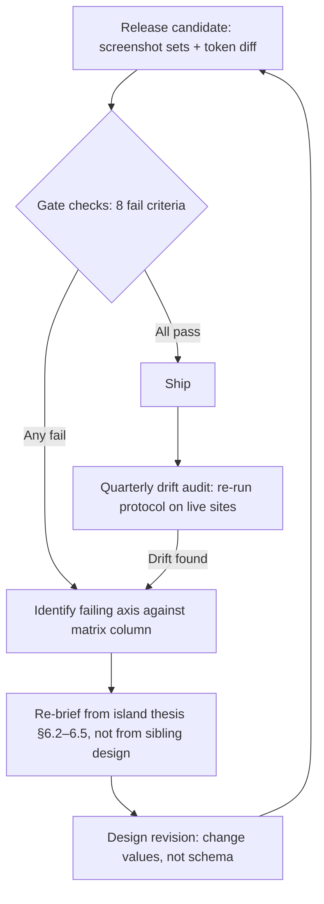

Two governance notes close the loop. First, the quarterly drift audit exists because convergence pressure is continuous — a new component shipped to all four islands (a reviews module, a seasonal banner) is the classic vector, so shared components must pass the gate in all four skins before release. Second, the audit doubles as the evidence base for iteration: if analytics ever argues for converging an element (one CTA treatment outperforms everywhere), the matrix is amended deliberately, row by row — never by drift. The system may evolve; it may not dissolve.

The forward-looking implication: these gates make the rest of this report durable. The keyword-ownership architecture gives each island its SERP territory; the published rate cards give each its commercial voice; this design system gives each its face. Held apart by the matrix, the four properties compound as a network — shared authority, shared engineering, shared trust — while presenting to the market as what they are: four chefs' kitchens, in four different Hawaiʻis.

### Sources

[^01-7^] https://bigisland.mychef-hawaii.com/ — Hawaiʻi Island homepage (accessed 2026-09-06)
[^01-8^] https://mychef-hawaii.com/pricing — statewide tariff (accessed 2026-09-06)
[^01-9^] https://mychef-hawaii.com/quote — quote mechanism (accessed 2026-09-06)
[^01-10^] https://mychef-hawaii.com/trust — honesty register (accessed 2026-09-06)
[^01-11^] https://mychef-hawaii.com/about — brigade/about, photo disclaimer (accessed 2026-09-06)
[^01-14^] https://maui.mychef-hawaii.com/wailea — corridor page sample (accessed 2026-09-06)
[^01-18^] https://mychef-hawaii.com/catering — catering service page (accessed 2026-09-06)
[^01-19^] https://mychef-hawaii.com/legal — legal/booking notes: GET, HRS §481B-14, cancellation posture (accessed 2026-09-06)
[^01-21^] https://oahu.mychef-hawaii.com/pricing — Oʻahu rate card (accessed 2026-09-06)
[^01-23^] https://kauai.mychef-hawaii.com/pricing — Kauaʻi rate card (accessed 2026-09-06)
[^01-25^] Direct HTTP inspection (curl) of headers, HTML head, JSON-LD, and status codes for sitemap-vs-live URL comparison — internal inspection record, dim01 (accessed 2026-09-06)
[^02-1^] https://mychef.ae — myCHEF Dubai homepage (accessed 2026-09-06)
[^02-13^] https://mychef.id/pricing — at-a-glance rate table, embedded estimator, guest-count math table (accessed 2026-09-06)
[^02-16^] https://mychef.id/fine-dining/menus — 24 set menus, course breakdowns, dietary flags, priced add-ons (accessed 2026-09-06)
[^02-17^] https://mychef.id/catering/villa-catering — chapter-structured commercial page, packages, testimonials (accessed 2026-09-06)
[^02-18^] https://mychef.id/why-mychef — evidence pillars, freelance/marketplace comparison table, guarantees (accessed 2026-09-06)
[^03-44^] https://oahu.mychef-hawaii.com/kahala — myCHEF internal: "from $125/pp… CORE $125–$190/pp" (accessed 2026-09-06)
[^03-45^] https://oahu.mychef-hawaii.com/locations/hawaii-kai — myCHEF internal: kamaʻāina weekly line, North Shore surcharge, COI/building logistics (accessed 2026-09-06)
[^03-47^] https://roadgenius.com/statistics/tourism/usa/hawaii/oahu/ — 2024 Oʻahu visitors and source markets, Japan 693,066 (accessed 2026-09-06)
[^03-48^] https://www.espaciowaikiki.com/experiences/private-chef-experience/ — ESPACIO in-suite kaiseki by Chef Mamoru Tatemori (accessed 2026-09-06)
[^03-49^] https://dbedt.hawaii.gov/blog/26-04/ — DBEDT: Oʻahu CY2025 visitors 5,679,047; spending $9.42B; PPD $238.0 (accessed 2026-09-06)
[^03-50^] https://www.luxurytravelmagazine.com/news-articles/must-experience-suites-across-the-globe — Ritz-Carlton Residences Waikiki Sky Penthouse gourmet kitchen (accessed 2026-09-06)
[^03-51^] https://www.listingok.com/en/airbnb-occupancy/united-states/honolulu/ — Honolulu Airbnb 37% seasonality; Ordinance 22-7 STR limits (accessed 2026-09-06)
[^03-52^] https://www.hawaiiliving.com/4543-aukai-avenue-kahala-area-home-for-sale-202515828/ — "Kahala… Beverly Hills of Honolulu… approximately 1,200 homes" (accessed 2026-09-06)
[^03-55^] https://gathervacations.com/vrp/unit/490/ — Ko Olina Beach Villas, "Gourmet kitchen by Master Chef Roy Yamaguchi… Sub-Zero and Wolf" (accessed 2026-09-06)
[^03-71^] https://myemail.constantcontact.com/subject.html?soid=1134492189974&aid=rc7Xavn9iko — Hawaii Hotel Investment Update Oct 2025: luxury segment RevPAR +13% YTD (accessed 2026-09-06)
[^04-44^] https://maui.mychef-hawaii.com/wedding-catering — client wedding-week product + pricing (accessed 2026-09-06)
[^04-53^] https://mauidestinationweddings.com/maui-beach-wedding-permits-complete-guide-2026/ — DLNR permit, 20-person cap (accessed 2026-09-06)
[^04-58^] https://hawaii.com/blog/visiting-lahaina-maui-2026 — 2026 visitor guide; fire recovery; respectful-visitor guidance (accessed 2026-09-06)
[^04-62^] https://thepointsguy.com/hotel/reviews/andaz-maui-at-wailea/ — Wailea resort rates; Four Seasons Wailea White Lotus S1 location (accessed 2026-09-06)
[^04-65^] https://thehawaiivacationguide.com/where-to-stay-in-hawaii/ — hotel ADR by area, South Maui $623–$1,054 (accessed 2026-09-06)
[^04-67^] https://tylercoonsmaui.com/community/wailea-makena/ — Makena estates $6–32M, "micro-resorts" (accessed 2026-09-06)
[^04-70^] https://taraleephotography.net/kukahiko-estate-a-complete-guide/ — Kukahiko Estate, "cinematic", 2–40 guests (accessed 2026-09-06)
[^04-96^] https://mauiweddingvendors.com/maui-wedding-planning-guide/ — seasonal guide; ceremonies timed to sunset (accessed 2026-09-06)
[^04-98^] https://climocast.com/destinations/usa/hawaii/maui.html — 30-yr climate; whale season Dec–Apr; leeward drier (accessed 2026-09-06)
[^04-100^] https://www.blueplanetproductions.com/post/explore-maui-s-hidden-gems-the-best-unlisted-luxury-villas-with-private-chefs — villas with chef's kitchens and outdoor dining pavilions (accessed 2026-09-06)
[^05-1^] http://www.privatechefkauai.com/pricing and /menu — Private Chef Kauai (Chef Dani Felix) rate card, named North Shore farms (accessed 2026-09-06)
[^05-3^] https://farmcookkauai.com/ — Farm Cook Kauai about/farm story (accessed 2026-09-06)
[^05-11^] http://chef-leo-kauai.com/events/weddings — Chef Leo wedding catering; Ayurvedic/Detox dietary list (accessed 2026-09-06)
[^05-16^] https://kauai.mychef-hawaii.com/weddings and /journal/how-to-hire-a-private-chef — myCHEF Kauaʻi pages: pricing, bridge clause, inquiry-stage posture (accessed 2026-09-06)
[^05-25^] https://sunset.com/travel/travel-directory/pure-kauai-luxury-vacation-rentals — Pure Kauai, from $450/night, chef via concierge (accessed 2026-09-06)
[^05-29^] https://www.exceptionalvillas.com/secret-cove/l52002 — Secret Cove Kīlauea rate card $3,750–$8,250/night (accessed 2026-09-06)
[^05-32^] https://dbedt.hawaii.gov/blog/26-04/ — DBEDT CY2025 visitor statistics: Kauaʻi 1,419,943 visitors; $2.93B; $281.30 pp/day; 7.33-day stay (accessed 2026-09-06)
[^05-34^] https://alohabridalconnections.com/what-does-it-cost-to-get-married-on-kauai/ — Kauaʻi wedding cost breakdown, $75/pp catering average (accessed 2026-09-06)
[^05-35^] https://bookretreats.com/s/yoga-retreats/kauai — Kauaʻi yoga retreat listings and prices, $2,000–$4,499 (accessed 2026-09-06)
[^05-40^] https://hidot.hawaii.gov/highways/2025/05/page/2/ — HDOT: Hanalei Bridge full nightly closures May 12–16, 2025 (accessed 2026-09-06)
[^05-41^] https://hidot.hawaii.gov/blog/2025/03/28/full-closures-of-kuhio-highway-at-hanalei-hillside-every-half-hour-april-1-2/ — HDOT: Hanalei Hill slope stabilization closures (accessed 2026-09-06)
[^05-44^] https://www.lovebigisland.com/hawaii-blog/the-best-time-to-visit-kauai/ — Kauaʻi seasonality, N/S shore weather split (accessed 2026-09-06)
[^05-57^] https://www.rentalescapes.com/rentals/luxury-vacation-rentals-usa/hawaii/kauai — "Garden Isle… oldest and arguably most unspoiled" (accessed 2026-09-06)
[^05-59^] https://www.expedia.com/stories/beach-bliss-in-hanalei/ — Hanalei taro fields and waterfall-striped mountains (accessed 2026-09-06)
[^05-60^] https://kukuiula.com/club-villa-2-at-kukuiula/ — Kukuiʻula "plantation-style architecture" (accessed 2026-09-06)
[^05-61^] https://www.hawaiianbeachrentals.com/Hawaii/Kauai/Poipu/restaurants/ThePlantationGardens.htm — Plantation Gardens 1930s plantation house (accessed 2026-09-06)
[^05-62^] https://koloathai.com/about — Old Kōloa Town plantation heritage (accessed 2026-09-06)
[^05-66^] https://roadgenius.com/statistics/tourism/usa/hawaii/kauai/ — Kauaʻi tourism stats: 88% US domestic; ~7k Japan; 7.45-day stay — aggregator figure; DBEDT CY2025 value of 7.33 days governs in body text (accessed 2026-09-06)
[^05-68^] https://www.kauaiexclusive.com/blog/best-time-to-visit-kauai/ — wet/dry seasons; N vs S shore timing (accessed 2026-09-06)
[^05-70^] https://agpixart.com/destinations/north-america/kauai-hi/hanalei-princeville/ — Hanalei Farmers Market (~25 mostly-organic farmers) (accessed 2026-09-06)
[^06-3^] https://www.riochef.com/menus — Rio Chef: "Starting prices begin at $175 per person"; local-ingredient menu vocabulary (accessed 2026-09-06)
[^06-7^] https://www.takeachef.com/en-us/private-chef/big-island — Take a Chef Big Island price tiers and platform stats; "Big Island" term usage (accessed 2026-09-06)
[^06-15^] https://papakonaevents.com/ + venue-directory package data (2026) — Papa Kona packages; 23% service charge (accessed 2026-09-06)
[^06-24^] https://bigisland.mychef-hawaii.com/ — client Big Island rate card: CORE $150–$225, ENTRY from $110, Stay Chef from $950/day, travel from $75, east side quoted (accessed 2026-09-06)
[^06-27^] https://www.keteamhawaii.com/2024-big-island-real-estate-review-kailua-kona-and-resorts/ — 2024 medians: Mauna Lani $5.5M, Mauna Kea $6.75M, Kukio $19M, Hualālai $9.63M, Kohanaiki $8.5M (accessed 2026-09-06)
[^06-35^] https://www.fairmontorchid.com/gather/weddings/wedding-packages/ — Fairmont Orchid package tiers; F&B minimums $7,500–$15,000 (accessed 2026-09-06)
[^06-36^] https://www.herecomestheguide.com/wedding-venues/hawaii/fairmont-orchid — "$5,000–15,000/event… $120/person and up… 25%" service (accessed 2026-09-06)
[^06-45^] Kona Village Rosewood design coverage — LEO A DALY project page (leoadaly.com) and MICHELIN Guide Three Keys 2024 (guide.michelin.com) — internal inspection record, dim06 (accessed 2026-09-06)
[^06-46^] Forbes coverage of Kona Village Rosewood reopening (forbes.com) — basalt furnishings; 8,432-panel solar array — internal inspection record, dim06 (accessed 2026-09-06)
[^06-49^] Ironman World Championship Kona (annual October) — GoHawaii (gohawaii.com) / Ironman (ironman.com) event references — internal inspection record, dim06 (accessed 2026-09-06)

---

## 7. Technical, Analytics, Migration and Roadmap

The strategy in Chapters 1–6 succeeds or fails on execution discipline, and the audit evidence says execution — not strategy — is where the current estate bleeds. The site already runs a modern Next.js stack with rich JSON-LD and a sound keyword-ownership scheme, yet its highest-value pages (/pricing, /quote, /trust, /legal) sit outside every XML sitemap while ~150 thin editorial stubs are fully crawlable, edge caching is disabled, and internal SEO annotations leak into visible copy.[^01-2^][^01-25^][^01-13^][^01-15^] This chapter converts the rebuild into an engineering and operating specification: stack, content system, analytics, migration of 637 URLs, and the 30-day / 90-day execution sequence — closing with the decisions that still need a human signature and the risks that need an owner.

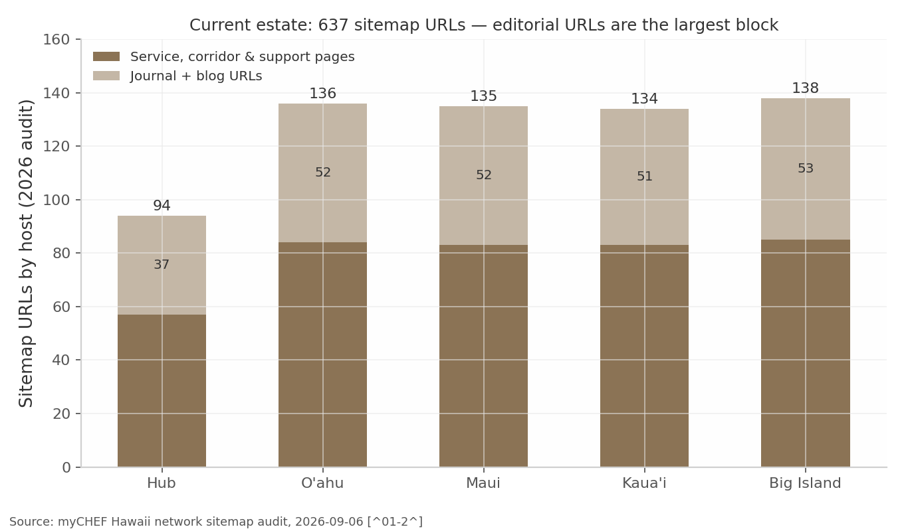

The chart frames the engineering problem: of 637 URLs across five hosts, 245 are journal and blog URLs — the largest single block — of which the audit identifies ~150 as 2–4-sentence doorway stubs, while the commercial pages that actually convert were never submitted to crawlers.[^01-2^][^01-13^][^01-22^][^01-25^] The rebuild inverts this: fewer URLs, deeper pages, and a governance layer that makes the current failure modes structurally impossible rather than merely discouraged.

### 7.1 Technical Architecture

#### 7.1.1 Stack decision (Next.js/TypeScript/Tailwind shared platform, island theming layer)

**Decision: keep Next.js on Vercel as a single shared platform; differentiate islands through a design-token theming layer, not code forks.** Three factors drive this. First, the stack is not the problem — the site already ships server-rendered HTML, canonicals, meta descriptions, and multiple JSON-LD blocks on Next.js/Vercel; the failures are configuration and governance (caching off, sitemap logic inverted), which any stack would allow.[^01-25^] Second, five properties demand one codebase: the network already clones 29 sub-directory slugs across all five hosts (145 URLs), and any fix to pricing copy, fee-stack wording, or schema must propagate from one edit, not five.[^01-2^] Third, the four island design territories are a theming problem, not a platform problem — the sister sites prove one platform can carry multiple market expressions.[^02-1^][^02-10^]

The concrete technical commitments:

- **App Router with React Server Components (RSC)** as the rendering baseline. Content pages are overwhelmingly read-only; RSC keeps client JavaScript near zero on commercial pages — the cheapest path to the §7.1.2 performance targets. Interactive islands (quote form, estimate builder, WhatsApp prefill) are client components scoped to the leaf, never the page.
- **Rendering strategy per page type** (table below): static generation (SSG) for stable commercial and corridor pages, Incremental Static Regeneration (ISR) for pages whose business facts can change (pricing, seasonal landings), server rendering only for genuinely dynamic routes (the quote flow).
- **Edge caching re-enabled as a launch-blocking defect.** The current homepage serves `cache-control: private, no-cache, no-store` with `x-vercel-cache: MISS` — every request hits the origin.[^01-25^] The rebuild sets explicit `s-maxage`/stale-while-revalidate headers per page type and treats a production cache MISS on a static commercial page as a bug.
- **Island theming via design tokens.** One Tailwind configuration; four island token sets (color, typography accent, imagery treatment) implementing the Oʻahu "modern Pacific metropolitan", Maui "cinematic resort-villa", Kauaʻi "organic estate", and Big Island "volcanic minimalism" territories specified in Chapter 6. Tokens switch at host level; components never hard-code island identity, and the design-uniqueness gate (§7.2.2) verifies four visibly distinct properties rather than recolored clones.
- **Shared component primitives with island-specific composition.** Rate-card, fee-stack, worked-math, FAQ, trust-strip, and corridor-map components are built once against the §7.2.1 content models and composed per island — making the per-island uniqueness requirements (unique price cards, FAQs, schema per ownership tier) enforceable in code rather than copy discipline alone.[^08-6^]
- **Image pipeline.** All photography through `next/image`, with illustrative/AI-looking heroes replaced by commissioned per-island photography as a planned asset deliverable — the audit flags current imagery as a documented conversion weakness.[^01-11^][^01-25^]

No materially better alternative to this stack exists for the requirement set: five hosts, one team, 531 governed pages, heavy structured data, and a content-operations model that assumes non-engineers publish weekly.

#### 7.1.2 Performance, accessibility (WCAG 2.2 AA), structured-data and SEO-metadata layer

Performance and structured data are conversion infrastructure here, not hygiene. The strongest SEO competitor (Take a Chef) ships template pages with FoodService, Product, and AggregateRating schema backed by thousands of reviews;[^08-2^][^08-3^] myCHEF cannot match review schema — its no-fake-reviews policy forbids it[^01-1^][^01-10^] — and must win on page experience, truthful markup depth, and metadata precision.

**Performance and accessibility budgets (launch gates, not aspirations):**

- Core Web Vitals: LCP < 2.5s, INP < 200ms, CLS < 0.1 at the 75th percentile on mobile, per template per island.
- Lighthouse: 95+ Performance / 95+ Accessibility / 95+ Best Practices / 100 SEO on every commercial template.
- WCAG 2.2 AA as a tested requirement: contrast ratios, keyboard-navigable quote funnel and menus, visible focus states, reduced-motion support, touch-target sizing. The current site claims WCAG 2.2 AA but the audit could not verify it;[^01-19^] in the rebuild the claim is either verified by automated plus manual audit or removed from /legal — the truth-flag system (§7.2.2) does not permit unverified self-claims to persist.
- QA automation on every deploy and weekly against production: broken internal links, missing/duplicate titles and metas, canonical correctness, stray noindex, orphan pages, missing alt text, JSON-LD validation, CWV regression against the budgets above.

**Rendering and caching strategy by page type:**

| Page type | Rendering | Cache policy | Revalidation trigger | Rationale |
|---|---|---|---|---|
| Island homepages, service pages (weddings, catering, private chef) | SSG | `s-maxage=86400`, SWR | Deploy or CMS publish | Stable commercial copy; highest organic entry volume |
| Pricing / rate-card pages | ISR | `s-maxage=3600`, SWR | BUSINESS FACTS file change | Prices must propagate network-wide within one hour of an approved change |
| Corridor/location pages | SSG | `s-maxage=86400`, SWR | CMS publish | Demand-driven set, rebuilt only when copy or zones change [^08-6^] |
| Seasonal landing pages (Ironman, whale season, holiday) | ISR | `s-maxage=3600` | Editorial calendar rotation | CTA and availability messaging rotate per island calendar [^08-52^] |
| Journal/guide content | SSG | `s-maxage=604800` | CMS publish | Long-lived informational assets |
| Quote flow, estimate builder | SSR (dynamic) | No cache | n/a | User-specific state; excluded from sitemaps, noindexed thank-you paths |

The interpretation that matters: the only dynamic surface in the estate is the conversion funnel itself. Everything a crawler or AI assistant reads is static, cacheable, and cheap to serve — the opposite of the current configuration, where the origin renders every request and the crawlable inventory is dominated by stubs.[^01-25^][^01-2^] The ISR trigger column is the operational heart of the table: pricing pages revalidate off the BUSINESS FACTS file (§7.2.1), so an approved rate change reaches all five hosts in one governed action — eliminating the class of inconsistency between the Big Island hero ("from $125") and its own rate card (CORE from $150).[^01-7^] Note also what is absent: no page type requires client-side rendering to be crawlable, which keeps the entire commercial estate eligible for the static edge cache and makes the Lighthouse budgets in this section achievable by construction rather than by tuning.

**Central metadata and schema layer.** Title, meta description, canonical, Open Graph, and robots directives are generated from page database fields (§7.2.1), never hand-edited in templates — this enforces the keyword-ownership scheme mechanically, replacing the current practice of stating ownership rules in visible body copy where users and competitors read them.[^01-8^][^01-15^][^08-67^] The schema plan:

| Schema type | Applied to | Key properties | Notes / guardrails |
|---|---|---|---|
| Organization | All pages, network-wide | name, url, logo, sameAs, contactPoint | Single canonical entity; subdomains reference, not redefine [^01-25^] |
| WebSite + SearchAction (if site search ships) | Hub root | name, url, potentialAction | SearchAction only if a real search endpoint exists |
| WebPage / CollectionPage | Every page | name, description, isPartOf, breadcrumb | Generated from page database; never hand-authored |
| BreadcrumbList | All non-home pages | itemListElement | Mirrors the hub-and-spoke silo structure [^02-6^][^02-11^] |
| Service / FoodService | Service pages, island homepages | serviceType, areaServed, provider, priceRange | areaServed scoped per island; priceRange from BUSINESS FACTS only [^01-25^] |
| Offer / OfferCatalog | Pricing and package pages | priceSpecification (min/max USD), availability | Prices injected from BUSINESS FACTS; re-implements the rich OfferCatalog the audit found, or rich-result eligibility is lost [^01-25^] |
| ItemList | Menu catalogues, package grids | itemListElement → Offer/MenuItem | Supports Bali-pattern menu catalogue cards [^02-16^] |
| FAQPage | Pages with visible FAQ sections | mainEntity | Only where FAQs are visibly rendered and compliant; never stuffed |
| Review / AggregateRating | **Prohibited until real** | — | No invented or self-authored ratings, ever. Ship the markup only when verified post-event reviews exist; the no-fake-reviews policy is a brand asset, not a gap to paper over [^01-1^][^01-10^] |

Two implications follow. First, schema is a data problem: every price, area, and offer in JSON-LD reads from the same BUSINESS FACTS source as the visible page, so markup can never drift from copy. Second, the AggregateRating prohibition is deliberate posture, not a gap; Take a Chef's review-rich snippets are its structural advantage,[^08-1^] and myCHEF's counter is published-fixed-price plus written-quote markup — but the moment verified reviews exist (§7.5.2), review schema ships, because map-pack competition runs on review counts and the current count is zero by policy.[^08-1^][^08-6^]

**Crawler and AI-search posture.** Sitemaps are generated from the page database, segmented by page type, with priorities reflecting commercial weight — the sister sites run pricing at priority 0.8–0.9, and the current Hawaii sitemap's inversion (money pages absent, stubs included, the rest flattened to 0.55–0.6) is corrected as a launch-blocking fix.[^02-2^][^02-11^][^01-2^] Each host serves its own robots.txt disallowing utility paths (quote internals, thank-you pages) and declaring its own sitemap. Following the Bali template, robots.txt explicitly welcomes AI crawlers (GPTBot, ChatGPT-User, PerplexityBot, ClaudeBot, Google-Extended, CCBot, Applebot) and each host serves an `llms.txt` summarizing services, pricing posture, and key URLs — AI Overviews already answer the cost and vacation-rental queries this ecosystem targets, so citation eligibility is free distribution.[^02-12^][^08-14^][^08-18^]

### 7.2 Content and CMS Architecture

#### 7.2.1 Structured content models, page database schema, business-facts single source of truth

The rebuild's most consequential architectural decision is not the framework — it is treating the five-property estate as a database that renders websites, rather than five websites that share code. The audit shows why: 637 hand-maintained pages produced leaked annotations, cloned blocks, contradictory prices, and money pages absent from every sitemap.[^01-15^][^01-4^][^01-7^][^01-25^] Governed fields make each of those failure modes a validation error instead of a published page.

Every URL in the ecosystem is a row in the page database with this schema:

| Field group | Fields | Purpose / gate enforced |
|---|---|---|
| Identity & placement | page ID, island (hub/oahu/maui/kauai/bigisland), URL slug, parent page, category, status (draft/in-review/approved/published/retired) | Orphan prevention (parent required); lifecycle control |
| SEO targeting | primary keyword, secondary keywords, search intent, cannibalization-risk flag, publish priority (P1–P3) | One owner per keyword — the ownership scheme becomes a uniqueness constraint, not copy conventions [^08-67^] |
| Metadata | title, H1, meta description, canonical, schema type(s) | Auto-generated drafts with editorial override; duplication gate blocks near-identical titles across hosts |
| Link architecture | internal links in (planned), internal links out, silo membership | Every commercial page must link up to its hub and across to siblings, per the sister-site silo-map pattern [^02-6^] |
| Content requirements | word-count target, CTA configuration, pricing block required (Y/N), FAQ required (Y/N), image requirements, truth-flag state | A page cannot publish with a required pricing block missing |
| Measurement | publish date, last substantive update, decay watch | Feeds the content-decay module of the SEO dashboard (§7.3.2) |

The analytical point is that this schema encodes the report's strategy as constraints. The cannibalization-risk field operationalizes dim08's pre-work — hub versus island versus corridor uniqueness, one canonical cost page per level, and sub-location pages only where service terms genuinely differ (travel fees, minimums, venue rules).[^08-6^][^08-13^] The publish-priority field makes the 90-day roadmap (§7.5.2) executable as waves. And the status field prevents the current estate's quietest defect — indexed parameter URLs and odd nested paths like `/bigisland/catering` and `/quote?island=maui&service=wedding` — because a URL that is not a governed row does not render.[^01-24^][^01-25^]

**BUSINESS FACTS: the single source of truth.** One version-controlled file holds every fact appearing on more than one page: per-island rate cards (Oʻahu Signature $125–$190, Stay Chef from $850; Maui $150–$250 / from $1,050; Kauaʻi $150–$250 / from $1,100; Big Island CORE $150–$225, ENTRY from $110 / from $950), the fee stack (20% service, GET up to 4.7120% valid through 12/31/2030, 50% deposit), staffing hourlys ($55 server / $75 sous-chef), travel-zone lines, and the approved terminology set.[^01-8^][^01-21^][^01-23^][^01-19^] Pages, schema, the estimate builder, and llms.txt all render from this file. Three rules govern it: (1) a fact enters only with a truth flag and an approver; (2) pricing changes are atomic — one edit revalidates every pricing surface network-wide via ISR; (3) the file carries the GET surcharge sunset (12/31/2030) as a scheduled review task, since the pass-on line must be revisited when the surcharges expire.[^07-28^]

#### 7.2.2 Content truth flags and quality gates (90/100 publication score, duplication gate)

The current site's honesty register — a public commitment not to invent reviews, chefs, licenses, or track records — is its most differentiated asset.[^01-10^] The rebuild generalizes that posture into a publish-time gate: every factual claim on every page carries one of five truth flags, and the CMS refuses to publish pages containing claims in blocked states.

| Truth flag | Meaning | Publication rule | Examples from this project's research |
|---|---|---|---|
| VERIFIED | Independently confirmed against a primary source | Publish freely | GET 4.7120% max pass-on through 12/31/2030 (DOTAX-verified) [^07-28^]; published myCHEF rate cards [^01-21^][^01-23^] |
| APPROVED BUSINESS POLICY | A stance the business has formally adopted | Publish in approved wording only | Written-quote-is-the-confirmed-total policy; no-fake-reviews stance; 50% deposit [^01-8^][^01-10^] |
| RESEARCH SUPPORTED | Evidence-backed, not independently verified | Publish with the framing the research specifies (years labeled, ESTIMATED kept where flagged) | Marketplace per-person bands; seasonality patterns [^07-49^][^08-33^] |
| REQUIRES APPROVAL | Awaiting owner/counsel sign-off | **Never publishes** — the CMS hard-block | Final pricing numbers not on the current approved cards; all REQUIRES LEGAL VERIFICATION items (§7.6.1) [^07-34^][^07-38^] |
| DO NOT PUBLISH | Confirmed unusable or prohibited | Stripped at build time | Sister-site track-record numbers ("560+ events, since 2019"); leaked keyword-volume annotations; unverified Bali/Dubai "Verified" claims [^02-18^][^01-15^][^01-24^] |

This table is the report's truth discipline made executable. Two rows deserve emphasis. REQUIRES APPROVAL is a hard block, not a warning — the current legal page already admits its cancellation tiers are "proposed, pending attorney review," and that posture is correct; what changes is that the platform, not editorial vigilance, prevents premature publication.[^01-19^] DO NOT PUBLISH exists because the sister sites' trust assets (named chefs, 560+ events, ratings since 2019) are tempting copy for a launch-stage property, and the do-not-copy rule is explicit that none of it may cross over.[^02-18^][^02-19^]

**Quality gates.** Before any page reaches `published` it clears three gates:

1. **Publication score ≥ 90/100** across 13 weighted criteria: intent match, title/H1/meta quality and uniqueness, keyword-ownership compliance, word count vs. target, pricing-block presence and BUSINESS FACTS consistency, required FAQs, internal-link minimums (up to parent, across to siblings), schema validity, image/alt compliance, CTA configuration, CWV-safe asset weight, truth-flag clearance, and ʻokina correctness in body copy (Oʻahu, Kauaʻi, Kāʻanapali, Poʻipū) with ASCII slugs and titles — the network's existing convention.[^01-2^][^01-4^]
2. **Duplication gate.** Near-duplicate detection across all five hosts at title, H1, and paragraph level — targeting the identical footer/locations block repeated on every page (rendered twice consecutively on the Oʻahu home) and the 29 cloned sub-directory pages across hosts.[^01-4^][^01-2^] Corridor pages must pass the Bali standard: genuinely unique local copy or no page at all.[^02-15^]
3. **Design-uniqueness gate.** A human checkpoint confirming each island property is visually and verbally distinct under its design territory — four properties, not one site in four colorways.

The "so what": the 90-day roadmap publishes hundreds of pages; without machine-enforced gates, volume guarantees the same thin-duplicate debt the migration is paying to remove.

### 7.3 Analytics Architecture

#### 7.3.1 GA4/Search Console event taxonomy: CTA, quote funnel, per-island segmentation

The current conversion system is a single door — a five-field quote form plus WhatsApp — and the audit notes Kauaʻi and Big Island CTAs route to a weaker "inquiry list" rather than a quote.[^01-9^][^01-6^] A single-door funnel is acceptable; an unmeasured one is not. Analytics here must answer three questions the business currently cannot: which island and page type produces quote intent, where the funnel leaks, and which published pages earn zero commercial engagement. One GA4 property serves all five hosts with cross-domain tracking (a §7.4.2 checklist item), and every event carries a consistent parameter set so per-island and per-page-type segmentation is a reporting default.

| Event name | Trigger | Required parameters | Business question answered |
|---|---|---|---|
| `page_view` (enhanced) | Every page | `island`, `page_category`, `page_id`, `organic_landing` (Y/N) | Which island/category combinations earn organic entries |
| `cta_click` | Any primary CTA | `island`, `page_category`, `cta_label`, `cta_position` | Which pages and positions start the funnel |
| `whatsapp_click` | WhatsApp button/prefill | `island`, `page_category`, `cta_position` | Size of the off-form channel (primary on sister sites) [^02-1^][^02-14^] |
| `quote_start` | First form-field interaction | `island` (page), `service_interest` | Funnel entry volume by island |
| `quote_step_progression` | Each completed form step | `island_selected`, `service_selected`, `step_number` | Leak localization (dates vs. party size vs. contact step) |
| `quote_complete` | Successful submission | `island_selected`, `service_selected`, `guest_count_band`, `lead_time_days` | Demand per island/service; validates roadmap priorities |
| `inquiry_list_join` | Kauaʻi/Big Island inquiry CTA completion | `island_selected`, `service_selected` | Measures the second-class funnel honestly [^01-6^] |
| `email_action` | mailto / email copy | `island`, `page_category` | The third contact path |
| `menu_interaction` | Menu card expand/download | `island`, `menu_id` | Which menus sell [^02-16^] |
| `pricing_interaction` | Rate-card/worked-math expansion, estimator use | `island`, `price_block_id` | Confirms pricing transparency is the conversion asset |
| `location_interaction` | Corridor map / travel-zone interaction | `island`, `corridor_id` | Which corridors deserve page investment vs. fold [^08-6^] |

Two design rules make this taxonomy durable. First, **naming is snake_case, verb-first, and frozen in a tracking-plan document** — the same discipline gap that let SEO annotations leak into copy produces `Quote Submit`, `quote_submit`, and `form_complete` as three competing events six months in. Second, **island is always a parameter, never an event variant**; `quote_complete` with `island_selected=maui` vs. `kauai` in one report is what lets the roadmap reallocate publish effort by measured demand. Search Console is verified per property with sitemaps submitted per host and the URL Inspection API wired into the dashboard — the audit's unverified ~40-result indexation estimate is replaced by daily measured truth.[^01-24^]

#### 7.3.2 Internal SEO dashboard specification

A five-property, 531-page ecosystem cannot be managed from Search Console's native interface; the dashboard is an operating tool, not a reporting artifact:

| Module | Data source | Contents | Decision it feeds |
|---|---|---|---|
| Inventory | Page database + GSC Inspection API | Pages by status (published/draft/retired), indexed vs. submitted, indexation lag per wave | Indexation management at scale (§7.6.2); wave pacing in §7.5.2 |
| Performance | GSC API | Clicks, impressions, CTR, average position per page and per query; ranking buckets (1–3, 4–10, 11–20, 21–50) | Page-2 attack targeting (positions 8–30); title/meta rewrites for low-CTR page-1 listings |
| Conversions | GA4 | quote_complete, inquiry_list_join, whatsapp_click per island/category; funnel step drop-off | Commercial prioritization; Kauaʻi/Big Island funnel-upgrade timing |
| Attention | GA4 + GSC | Zero-traffic pages (90-day window), zero-CTA pages, content decay (position/click decline vs. 90-day baseline) | Quarterly zero-traffic review (improve/merge/redirect/remove) [^01-2^] |
| Health | QA automation | Broken links, metadata errors, schema validation failures, orphan pages, cannibalization warnings (two pages ranking 11–50 for the same query), CWV vs. budget | Weekly fix queue; duplication-gate backstop |
| Local | GBP per island | Review count, review velocity, calls/directions, map-pack presence for tracked terms | Review-acquisition program KPI — the documented gap against the map-pack leader's 534 reviews [^08-6^] |

The module that pays for the whole build is Attention. The migration deletes or consolidates ~150 thin URLs; the dashboard's job is ensuring the estate never regrows that debt invisibly — every page earns traffic, earns assists, or enters quarterly review with a disposition deadline. Cannibalization warnings automate dim08's central risk: if hub and island host both surface in positions 11–50 for "private chef Maui", the ownership constraint failed in practice and the fix (merge, differentiate, canonicalize) is assigned, not debated.[^08-67^] The Health module is the backstop for the quality gates in §7.2.2: gates stop bad pages from publishing, but only continuous health monitoring catches the drift that appears afterward — template regressions, schema changes by Google, links broken by retired pages. Together the six modules convert the roadmap in §7.5 from a publishing schedule into a feedback system.

### 7.4 Migration Plan

#### 7.4.1 URL crawl → migration map (old → new, 301 one-to-one/closest-relevant)

Migration is a redirect-accounting exercise with one non-negotiable rule: **every one of the 637 known URLs — plus whatever the pre-migration crawl finds beyond the sitemap — gets an explicit, recorded disposition; nothing falls through to a wildcard.** The audit proves the sitemap understates the live estate: money pages return 200 outside it, and indexed artifacts (`/bigisland/catering`, `/kauai/events`, parameterized `/quote` URLs, legacy 301s like `/locations/waikiki` and `/wedding-catering`) show historical variants exist beyond any single inventory.[^01-24^][^01-25^] The crawl pulls from four sources — sitemap extraction, a full spider of all five hosts, Search Console export, and server/CDN logs — recording per URL: HTTP status, title/canonical, word count, inbound links, 12-month clicks/impressions, and rankings for tracked terms.

The migration map is the master document, one row per old URL:

| Column | Content | Example |
|---|---|---|
| OLD URL | Full URL incl. host and parameters | `bigisland.mychef-hawaii.com/bigisland/catering` |
| OLD status/type | Live/redirect/artifact; page type | Artifact duplicate, 200 |
| NEW URL | Target URL on new architecture | `bigisland.mychef-hawaii.com/catering` |
| ACTION | KEEP / IMPROVE / MERGE / REDIRECT / REMOVE | REDIRECT |
| 301 TARGET | Final one-hop destination | NEW URL or closest-relevant parent |
| REASON | Evidence basis | "Duplicate artifact; 0 clicks 12 mo; canonical page exists" [^01-24^] |
| OWNER + STATUS | Accountable editor; mapped/tested/live | — |

Disposition framework by estate segment:

- **Keep (one-to-one 301 or straight carryover):** the five homepages, all five `/pricing` pages, `/catering`, `/weddings`, `/private-chef-cost`, `/trust`, `/legal`, `/quote`, and corridor pages with confirmed indexation or equity (`/wailea`, `/honolulu`, `/kahala`, `/princeville`, `/kona`, `/waikoloa` class).[^01-24^][^01-25^] Renamed slugs get single-hop, one-to-one 301s.
- **Improve:** journal URLs mapped to real informational demand (dim08's FAQ/PAA bank) survive as full-prose pages — `/journal/how-much-does-a-private-chef-cost` becomes a governed guide linking up to the canonical cost page rather than competing with it.[^08-15^][^08-67^]
- **Merge:** the ~54 `blog/dining-in-*` posts fold into their parent corridor pages as unique local copy, strengthening exactly the pages the ownership scheme wants ranking; their URLs 301 to the corridor.[^01-2^]
- **Redirect (closest-relevant):** pruned stubs 301 to the closest-relevant surviving page — never a mass redirect to the homepage, which Google processes as soft-404s.
- **Remove (410/404):** URLs with zero traffic, zero links, and no relevant target — primarily the over-built corridors the demand evidence does not support (Kauaʻi west-side /waimea-/hanapepe-/eleele class; Maui /haleakala-/waikapu class).[^01-2^] Removal is confirmed only after the zero-traffic review: 12-month GSC clicks = 0, no backlinks, no assisted conversions.

Two preservation orders close this section. First, the rich JSON-LD now live (Organization, LocalBusiness with priceRange, OfferCatalog with USD price specifications, FoodService, FAQPage) must be re-implemented through the central schema layer before cutover — losing it voluntarily surrenders rich-result eligibility the site already holds.[^01-25^] Second, known copy defects are fixed at the source during content migration, not moved: the Big Island "from $125" hero, the ENTRY/Table terminology drift, the duplicated locations block, and every leaked SEO annotation.[^01-7^][^01-15^] Migrating defects is how rebuilds inherit the old site's reputation.

#### 7.4.2 Staging-first cutover, SEO launch checklist, redirect testing

Cutover happens on staging first, host by host, hub last — the hub is the network's canonicalization anchor and sitemap index, so it flips only after all four island properties pass checklist. The migration flow:

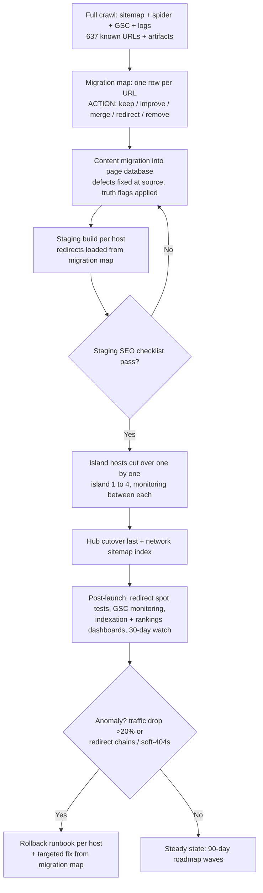

The SEO launch checklist — executed in full on staging, re-verified within 24 hours of each production cutover:

| # | Check | Pass standard |
|---|---|---|
| 1 | robots.txt per host | Content paths allowed; quote internals and thank-you disallowed; sitemap declared [^02-12^] |
| 2 | XML sitemaps | Auto-generated, segmented by page type; **all money pages present** (pricing, quote, trust, legal — the current inversion is a launch blocker); priorities reflect commercial weight [^01-25^][^02-2^] |
| 3 | Redirects | 100% of migration-map REDIRECT/MERGE rows return single-hop 301s to mapped targets; zero chains, loops, or wildcard-to-homepage rules |
| 4 | Canonicals | Self-referencing everywhere; parameter variants (`?island=`, `?service=`) canonicalized or blocked [^01-24^] |
| 5 | noindex audit | Only intentional exclusions; production sweep proves staging protections removed |
| 6 | Schema validation | Rich Results test passes per template; no AggregateRating/Review markup present [^01-10^] |
| 7 | Titles/metas | Cross-host uniqueness verified by crawl; ownership rules hold (hub statewide, hosts island phrases) [^08-67^] |
| 8 | Analytics | GA4 cross-domain tracking live; taxonomy firing; conversions marked; GSC verified per property; sitemaps submitted |
| 9 | www/non-www + protocol | One canonical host variant per property; single-hop redirects for all others; HSTS on |
| 10 | Subdomain behavior | Each host serves only its own content; cross-host URL guesses 301 to the correct host (kills the `/bigisland/catering` artifact class) [^01-24^] |
| 11 | Error handling | Custom 404 with recovery links and quote CTA; 500 alerting |
| 12 | Open Graph / social | OG title/description/image per template; cards validated on all five hosts |
| 13 | Forms & WhatsApp | Quote form end-to-end per island (incl. inquiry variants); WhatsApp prefill correct [^02-19^] |
| 14 | Performance | CWV budgets met on production infrastructure; edge-cache HIT confirmed on static pages [^01-25^] |
| 15 | llms.txt + AI crawlers | llms.txt served per host; AI-crawler allows in robots [^02-12^] |

Redirect testing deserves its own discipline because it is where migrations actually fail: the redirect map is loaded as data (not hand-written rules), an automated test asserts every row's status code, hop count, and final destination on staging, and the same test re-runs against production in the first hour after each cutover. High-equity URLs (indexed corridor pages, `/pricing` on all hosts) are additionally verified in GSC's URL Inspection after recrawl. The rollback runbook is per host and DNS-level, so a failed island cutover never contaminates the other four properties.

### 7.5 Execution Roadmaps

#### 7.5.1 30-day build order by commercial priority

One principle governs the sequence: revenue-adjacent surfaces ship first, and nothing ships without its gate. The order front-loads platform primitives, then the five homepages (the highest-value ranking assets), then P1 commercial clusters, then the pricing cluster that turns the transparency wedge into a conversion system. Migration preparation (§7.4.1) runs in parallel from day one so cutover never waits on inventory work. The target estate is deliberately smaller and deeper than the current one:

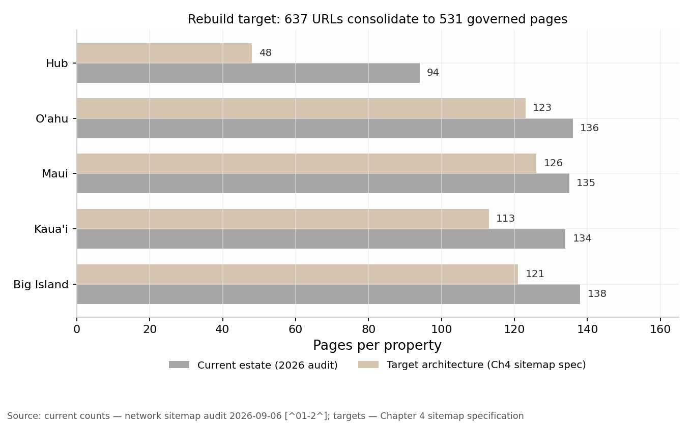

The consolidation is the point: 531 governed pages (123 Oʻahu / 126 Maui / 113 Kauaʻi / 121 Big Island / 48 hub) replace 637 loosely maintained URLs, with the reduction concentrated entirely in the stub and duplicate blocks — commercial coverage per island grows even as total URL count shrinks.

| Week | Build focus | Deliverables | Exit gate |
|---|---|---|---|
| 1 — Foundation | Platform + governance spine | Design-token theming (4 island token sets); component primitives (rate card, fee stack, worked-math, FAQ, trust strip); page database + CMS models; BUSINESS FACTS seeded with approved rate cards and fee stack [^01-8^][^01-21^][^01-23^]; metadata + schema layers; QA harness; GA4 tracking plan | Components render from BUSINESS FACTS only; a deliberate wrong price in a template fails build |
| 2 — Homepages | Hub + 4 island homepages | Five homepages with island-territory theming, owned-keyword titles, full schema, real photography where delivered; staging checklist items 1–7 passing | Design-uniqueness gate + 90/100 publication score on all five; QA gate green |
| 3 — P1 commercial clusters | Highest-intent service pages per island | Per island: private-chef (island-phrase owner), weddings + wedding-week, catering, vacation-chef/villa-chef; retreat-catering first on Kauaʻi and Big Island where SERP whitespace is documented [^08-7^][^08-13^]; vacation-rental chef page type statewide + per island [^08-18^] | Every page clears publication score, duplication gate, ownership constraints; zero leaked annotations (automated lint) |
| 4 — Pricing cluster + launch prep | The tariff, everywhere | /pricing per host (rate cards, fee-stack block, worked-math tables, estimator v1); canonical cost page per level with guides linking up [^08-67^]; GBP profiles per island with review pipeline armed [^08-6^]; migration map finalized, redirect suite green on staging | Full staging checklist pass; pricing pages in sitemaps at 0.8–0.9 [^02-2^]; cutover scheduled |

Two sequencing notes. First, GBP and the review pipeline land in week 4 deliberately — review acquisition must start the day real events occur, and the map-pack evidence (a 534-review leader on Maui) means every month of delay compounds.[^08-6^] Second, the corridor rebuild is intentionally *not* in the 30-day plan: corridor pages ship in the 90-day waves, only after each candidate passes the "service terms genuinely differ" test — shipping earlier would recreate the doorway-stub pattern under deadline pressure.[^08-6^][^02-15^]

#### 7.5.2 90-day SEO roadmap: publish waves, measurement, page-2 attack system

Days 31–90 convert the launch into an operating rhythm: three governed publish waves, weekly measurement, and two standing systems — page-2 attack and zero-traffic review — that turn the dashboard from observation into allocation.

| Phase | Publish waves | Measurement & iteration systems |
|---|---|---|
| Days 31–50 — Wave P1 completion | Remaining P1 service pages; corridor pages passing the uniqueness test (Wailea, Kāʻanapali, Lahaina, Kapalua; Waikīkī, Ko Olina; Princeville, Poʻipū; Kailua-Kona, Kohala Coast) [^08-6^]; /trust and /legal rebuilt with approved wording only [^01-10^][^01-19^] | Indexation monitoring per wave (submitted vs. indexed, lag days); weekly ranking-bucket report; GSC per-property baselines |
| Days 51–70 — Wave P2 | Guide layer answering the PAA/FAQ bank (cost, tipping, groceries, kitchen requirements, lead time) [^08-14^][^08-29^]; seasonal landing pages per island calendar (Ironman Kona, whale season, holiday peak) [^08-52^]; holiday-surcharge calendar by early Q4 (market-standard) [^07-13^]; B2B partner silo if approved (§7.6.1) [^02-11^] | Page-2 attack system live: positions 8–30 get targeted refreshes (title/CTR rewrite, PAA-mined FAQ enrichment, internal-link reinforcement, schema upgrade); per-island conversions reviewed against the funnel taxonomy |
| Days 71–90 — Wave P3 | Long-tail whitespace formats (welcome-dinner, rehearsal-dinner, recovery-brunch pages; omakase-at-home; retreat dietary depth); Oʻahu Japanese-language cluster only if approved (§7.6.1); Dec–Mar villa content front-loaded by Sep–Oct per booking-lead evidence [^08-33^][^08-37^] | First quarterly zero-traffic review (improve/merge/redirect/remove dispositions); content-decay watch armed; GBP review velocity vs. plan; roadmap re-planned from measured island-level demand (`quote_complete` + `inquiry_list_join`) |

The load-bearing system is the weekly iteration loop: dashboard review (Monday) → fix queue and page-2 targets (Tuesday) → publish and revalidate (Wednesday–Thursday) → indexation and redirect health check (Friday). Seasonality makes the calendar non-negotiable — statewide arrivals peak in March, June–July, and the mid-December holidays, with September the trough, but island demand inverts by shore and event, so CTA rotation and editorial front-loading are configured per island in the CMS, not managed as one statewide calendar.[^07-49^][^07-51^] The 90-day mark is also the first honest trust checkpoint: if verified-event reviews are accumulating on GBP, review schema ships in the next release; if not, the honesty register stays as-is — never fabricating social proof is itself the differentiating asset.[^01-10^]

### 7.6 Risks and Unresolved Business Decisions

#### 7.6.1 Decision register: pricing approvals, legal verification, coverage, staffing claims

Everything in this section is blocked on a human, not on engineering. Each item carries its evidence state and its publication consequence; until resolved, the truth-flag system keeps the related content in REQUIRES APPROVAL and off the site.

| # | Decision | Evidence state | Publication consequence until resolved |
|---|---|---|---|
| D1 | Final pricing numbers beyond the current approved cards (new packages, surcharges, discount tiers) | Current per-island cards are consistent and verified as published [^01-8^][^01-21^][^01-23^]; anything new is **PRICE REQUIRES APPROVAL** | Only approved cards render; estimator outputs labeled "from" pricing |
| D2 | Alcohol service posture — pouring client-supplied alcohol; whether the Packaged cart bar line triggers a county Class 13 caterer license | Gray area across four county Liquor Commissions; **REQUIRES LEGAL VERIFICATION**; top legal priority because a bar product is already on the rate card [^07-35^][^07-38^][^01-21^] | Bar line publishes with no alcohol-service claims beyond approved wording; wine-pairing add-on blocked |
| D3 | HRS §481B-14 disclosure wording for the 20% service line | Statute verified; exact wording/placement **REQUIRES LEGAL VERIFICATION** [^07-32^][^07-33^] | Fee stack keeps the verified posture ("distributed or disclosed"); no final-terms language |
| D4 | SB1256 (2025) and 2026 successors on mandatory gratuities/junk fees | BillTrack shows SB1256 dead in committee; outcomes **REQUIRES LEGAL VERIFICATION** [^07-34^] | Regulatory watch only; no legislative-status copy |
| D5 | DOH permit posture for in-home private-chef service, per island district | Act 195 exemption confirmed *not* to cover the service; district posture **REQUIRES LEGAL VERIFICATION** with DOH Food Safety Branch (808-586-4400) [^07-44^][^07-45^][^07-41^] | /legal keeps "licenses publish when issued and verifiable" [^01-19^] |
| D6 | Cancellation/deposit final terms | Current tiers "proposed, pending attorney review" [^01-19^] | 50% deposit (APPROVED BUSINESS POLICY) publishes; cancellation schedule labeled proposed |
| D7 | Coverage expansion — Kauaʻi west side, Maui Upcountry, Big Island east side | Demand evidence argues against west-side Kauaʻi pages; corridor rule is "service terms genuinely differ" [^08-6^]; permits and logistics constrain real coverage [^07-41^] | Coverage map publishes only zones the operation can serve; inquiry-stage framing retained |
| D8 | Named-chef / coordinator / photo policy vs. launch posture | Sister sites run named chefs and coordinators; Hawaii publishes no names, by policy [^02-19^][^01-1^] [^01-11^] | Team pages and coordinator names blocked until real people exist and consent |
| D9 | Phone number / NAP publication | No 808 number or address published today; GBP effectiveness and local trust depend on NAP [^01-1^][^08-6^] | GBP operates within approved contact policy; NAP schema fields stay empty |
| D10 | Review acquisition policy (post-event verified pipeline, platform mix) | Fake/purchased reviews prohibited; map-pack leader holds 534 reviews [^01-10^][^08-6^] | Review schema blocked; GBP collects only verified-event reviews |
| D11 | B2B partner program (villa managers, concierges, planners) and landing silo | Sister-site partner-silo pattern documented; vacation-rental chef intent currently ceded to concierge pages [^02-11^][^08-18^] | Partner silo ships in Wave P2 only with approved program terms |

The register resolves to three dependencies: D2–D6 wait on counsel, D8–D11 on operational maturity, D1/D7 on commercial judgment. Resolving in that order — counsel first, operations second, judgment last — unblocks the most publishable content per decision made. Two items carry outsized leverage. D2 (alcohol) is the only legal item blocking a product already sold on the approved rate card, so it should reach counsel first.[^07-38^][^01-21^] And D9/D10 (NAP and review acquisition) gate the entire local-search thesis: the map pack is the highest-converting SERP feature in every inspected market, the incumbent leader holds 534 Google reviews, and myCHEF's count is zero by policy — every week these two items remain undecided, the local funnel operates without its primary ranking lever.[^08-6^][^01-10^]

#### 7.6.2 Risk register with mitigations (indexation scale, content quality at 400+ pages, seasonality)

| Risk | Likelihood / impact | Mitigation | Early-warning indicator |
|---|---|---|---|
| Indexation lag or failure at 531 pages (current indexation unverified and plausibly shallow) [^01-24^] | Medium / High | Segmented sitemaps with money pages at 0.8–0.9; wave-based publishing, not big-bang; internal-link minimums in the page database; Inspection API monitoring per wave [^02-2^] | Wave indexation <70% within 14 days; crawl-stats decline |
| Content quality decays at scale — the stub pattern regrows | High / High | 90/100 score + duplication gate as hard blocks; corridor uniqueness test; quarterly zero-traffic review with disposition deadlines [^01-13^][^02-15^] | Sub-score pages published via override; near-duplicate alerts across hosts |
| Doorway-page classification if location pages thin out | Medium / High | Sub-location pages only where service terms genuinely differ; the rest fold into island "areas served" sections; Bali non-thin template as the floor [^08-6^][^02-15^] | Corridors stuck below position 50; "crawled, not indexed" clustering |
| Seasonality mis-timing — content lands after its booking window | Medium / Medium | Per-island editorial calendar in the CMS; Dec–Mar villa content front-loaded by Sep–Oct; wedding content 12+ months ahead; surcharge calendar by early Q4 [^08-33^][^08-37^][^07-13^] | Seasonal-term impression growth arriving post-peak |
| Marketplace SERP incumbency (Take a Chef per-city pages, AggregateRating, review depth) | High / Medium | Differentiate on what marketplaces cannot copy: fixed published prices, written-quote totals, fee transparency, island-operational depth; page-2 attack targets winnable 8–30 positions first [^08-2^][^01-8^] | Marketplace pages holding positions 1–5 with rating snippets on tracked terms |
| GBP review gap vs. incumbents (map-pack leader at 534) [^08-6^] | High / High (local funnel) | Verified-event review pipeline from day one; review velocity as a launch KPI; complete GBP profiles within the approved NAP policy (D9/D10) | Review velocity below plan two months running |
| Single-point conversion dependency on quote form + WhatsApp | Medium / High | Step-level funnel instrumentation (§7.3.1); email_action as third path now; phone/NAP decision (D9) as the structural fix [^01-9^][^02-19^] | quote_start→quote_complete drop-off >60% |
| Subdomain equity split — five hosts accumulate authority separately | Medium / Medium | Accepted as deliberate architecture mirroring legal/operational reality (per-island permits, county liquor rules, GET by place of performance) [^07-41^]; cross-host silo linking with the hub as anchor; no mid-roadmap consolidation | Island properties not ranking for their own owned phrases by day 90 |

The risk register resolves to one forward-looking implication: the rebuild's binding constraint over the next 90 days is not engineering capacity — the platform, gates, and maps specified here are buildable in 30 days — but the speed at which the decision register is signed. Every week D2–D6 sit with counsel, fee-stack and legal content publishes in provisional wording; every week D8–D11 wait on operational maturity, the map-pack gap against a 534-review incumbent widens by the reviews myCHEF did not collect.[^08-6^] The architecture absorbs late decisions gracefully — truth flags hold content back without blocking unrelated pages — but the strategy's compounding assets (reviews, local entity, partner channels) only start compounding once a human decides. That is the roadmap's real critical path.

---

### Sources

[^01-1^] myCHEF Hawaii — hub homepage — https://mychef-hawaii.com/ (accessed 2026-09-06)
[^01-2^] myCHEF Hawaii — network-wide sitemap (637 URLs) — https://mychef-hawaii.com/sitemap.xml (accessed 2026-09-06)
[^01-4^] myCHEF Oʻahu — homepage — https://oahu.mychef-hawaii.com/ (accessed 2026-09-06)
[^01-6^] myCHEF Kauaʻi — homepage — https://kauai.mychef-hawaii.com/ (accessed 2026-09-06)
[^01-7^] myCHEF Hawaiʻi Island — homepage — https://bigisland.mychef-hawaii.com/ (accessed 2026-09-06)
[^01-8^] myCHEF Hawaii — statewide tariff — https://mychef-hawaii.com/pricing (accessed 2026-09-06)
[^01-9^] myCHEF Hawaii — quote mechanism — https://mychef-hawaii.com/quote (accessed 2026-09-06)
[^01-10^] myCHEF Hawaii — honesty register — https://mychef-hawaii.com/trust (accessed 2026-09-06)
[^01-11^] myCHEF Hawaii — about/brigade, photo disclaimer — https://mychef-hawaii.com/about (accessed 2026-09-06)
[^01-13^] myCHEF Hawaii — hub journal stub — https://mychef-hawaii.com/journal/how-much-does-a-private-chef-cost (accessed 2026-09-06)
[^01-15^] myCHEF Oʻahu — island journal stub with leaked SEO note — https://oahu.mychef-hawaii.com/journal/how-much-does-a-private-chef-cost (accessed 2026-09-06)
[^01-19^] myCHEF Hawaii — legal/booking notes — https://mychef-hawaii.com/legal (accessed 2026-09-06)
[^01-21^] myCHEF Oʻahu — rate card — https://oahu.mychef-hawaii.com/pricing (accessed 2026-09-06)
[^01-22^] myCHEF Oʻahu — blog stub sample — https://oahu.mychef-hawaii.com/blog/cleanup-standard (accessed 2026-09-06)
[^01-23^] myCHEF Kauaʻi — rate card — https://kauai.mychef-hawaii.com/pricing (accessed 2026-09-06)
[^01-24^] Google site: queries (per-host index checks, 2026-09-06) — https://www.google.com/search?q=site:mychef-hawaii.com (accessed 2026-09-06)
[^01-25^] Direct HTTP inspection of headers, HTML head, JSON-LD, and status codes — curl, mychef-hawaii.com hosts (accessed 2026-09-06)
[^02-1^] myCHEF Dubai — homepage — https://mychef.ae (accessed 2026-09-06)
[^02-2^] myCHEF Dubai — sitemap with silo comments — https://www.mychef.ae/sitemap.xml (accessed 2026-09-06)
[^02-6^] myCHEF Dubai — catering packages hub — https://www.mychef.ae/catering-packages-dubai (accessed 2026-09-06)
[^02-10^] myCHEF Bali — homepage — https://mychef.id/ (accessed 2026-09-06)
[^02-11^] myCHEF Bali — sitemap — https://mychef.id/sitemap.xml (accessed 2026-09-06)
[^02-12^] myCHEF Bali — robots.txt (AI-crawler allows + llms.txt) — https://mychef.id/robots.txt (accessed 2026-09-06)
[^02-14^] myCHEF Bali — FAQ — https://mychef.id/faq (accessed 2026-09-06)
[^02-15^] myCHEF Bali — programmatic location-page template — https://mychef.id/private-chef/seminyak (accessed 2026-09-06)
[^02-16^] myCHEF Bali — fine-dining menu catalogue — https://mychef.id/fine-dining/menus (accessed 2026-09-06)
[^02-18^] myCHEF Bali — why-myCHEF evidence page — https://mychef.id/why-mychef (accessed 2026-09-06)
[^02-19^] myCHEF Bali — contact (named coordinators, office address) — https://mychef.id/contact (accessed 2026-09-06)
[^07-13^] Private Chef Kauai — pricing (holiday rates, travel fees) — http://www.privatechefkauai.com/pricing (accessed 2026-09-06)
[^07-28^] Hawaii Department of Taxation — County Surcharge on GET — https://tax.hawaii.gov/geninfo/countysurcharge/ (accessed 2026-09-06)
[^07-32^] ILWU Local 142 — HRS §481B-14 service-charge disclosure — https://www.ilwulocal142.org/hawaii-law-requires-service-charge-disclosure (accessed 2026-09-06)
[^07-33^] 7shifts — Hawaii tip laws for employers — https://www.7shifts.com/blog/hawaii-tip-laws/ (accessed 2026-09-06)
[^07-34^] BillTrack50 — HI SB1256 (2025) — https://www.billtrack50.com/billdetail/1796100 (accessed 2026-09-06)
[^07-35^] LiquorLicenseCost — Hawaii liquor license overview — https://liquorlicensecost.com/states/hi (accessed 2026-09-06)
[^07-38^] County of Maui Dept. of Liquor Control — Rules, MC-08 Chapter 101 (Class 13) — https://www.mauicounty.gov/DocumentCenter/View/106007/Rules---Chapter-101-PDF (accessed 2026-09-06)
[^07-41^] GetVendorLoop — Hawaii food-business permits, per-island DOH, Young Brothers — https://getvendorloop.com/guides/how-to-start-a-food-truck-in-hawaii (accessed 2026-09-06)
[^07-44^] CottageFoodLicense — Hawaii HAR 11-50 homemade-food exemption (Act 195) — https://www.cottagefoodlicense.com/blog/food-permit-hawaii-licenses-permits-cottage-food-options-explained (accessed 2026-09-06)
[^07-45^] Hawaii DOH Food Safety Branch — Food Establishment Permit Applications — https://health.hawaii.gov/san/permit-applications/food-establishment-permit-applications/ (accessed 2026-09-06)
[^07-49^] RoadGenius — Hawaii tourism statistics (monthly arrivals, seasonality) — https://roadgenius.com/statistics/tourism/usa/hawaii/ (accessed 2026-09-06)
[^07-51^] Hawaii Tribune-Herald — Hawaii visitor arrivals end 2025 below pre-pandemic peak — https://www.hawaiitribune-herald.com/2026/02/01/hawaii-news/hawaii-visitor-arrivals-end-2025-well-below-pre-pandemic-peak/ (accessed 2026-09-06)
[^08-1^] Google SERP "private chef hawaii" (map pack, PAA, PASF) — https://www.google.com/search?q=private+chef+hawaii (accessed 2026-09-06)
[^08-2^] Take a Chef — Honolulu County — https://www.takeachef.com/en-us/private-chef/honolulu-county (accessed 2026-09-06)
[^08-3^] Take a Chef — Kailua-Kona — https://www.takeachef.com/en-us/private-chef/kailua-kona (accessed 2026-09-06)
[^08-6^] Google SERP "private chef maui" (map pack; Raffin 534 reviews; PASF) — https://www.google.com/search?q=private+chef+maui (accessed 2026-09-06)
[^08-7^] Google SERP "private chef kauai" — https://www.google.com/search?q=private+chef+kauai (accessed 2026-09-06)
[^08-13^] myCHEF Kauaʻi — weddings page — https://kauai.mychef-hawaii.com/weddings (accessed 2026-09-06)
[^08-14^] Google SERP "private chef hawaii cost" (AI Overview, PAA) — https://www.google.com/search?q=private+chef+hawaii+cost (accessed 2026-09-06)
[^08-15^] Jason Raffin — Private Chef Pricing Maui — https://www.jasonraffin.com/post/breaking-down-the-cost-of-a-private-chef-in-maui-private-chef-pricing-maui (accessed 2026-09-06)
[^08-18^] Google SERP "private chef for vacation rental hawaii" (AI Overview; concierge pages) — https://www.google.com/search?q=private+chef+for+vacation+rental+hawaii (accessed 2026-09-06)
[^08-29^] Take a Chef blog — How much do you tip a private chef? — https://www.takeachef.com/blog/en/how-much-do-you-tip-private-chef (accessed 2026-09-06)
[^08-33^] myCHEF Big Island journal — How far ahead to book — https://bigisland.mychef-hawaii.com/journal/how-far-ahead-to-book (accessed 2026-09-06)
[^08-37^] Mauna Kea Residences — Hawaii vacation booking lead times — https://maunakearesidences.com/insights/useful-info/how-far-in-advance-should-you-book-a-hawaii-vacation/ (accessed 2026-09-06)
[^08-52^] Hawaii-Guide — Best time to visit Hawaii (whale season, Merrie Monarch, Ironman) — https://www.hawaii-guide.com/best-time-to-visit-hawaii (accessed 2026-09-06)
[^08-67^] myCHEF Hawaii — journal hub — https://mychef-hawaii.com/journal (accessed 2026-09-06)
