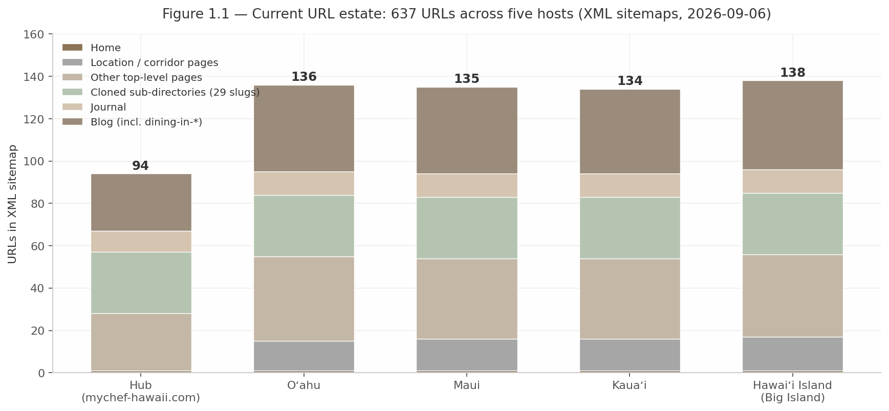

## 1. Existing Website Audit

The myCHEF Hawaii web ecosystem is not a blank slate, and it is not the site the original client brief described. The audit behind this chapter — a full XML sitemap extraction, direct fetches of more than twenty pages, HTTP header and markup inspection, and Google `site:` index queries across all five hosts, all performed 2026-09-06 — found a 637-URL estate that already solved two of the hardest strategic problems (published pricing and keyword ownership) while undermining both with thin content, inverted crawl priorities, and internal working notes leaking into public copy.[^01-2^][^01-25^] The rebuild is therefore a **prune-and-elevate** exercise: preserve a small corpus of genuinely differentiated assets verbatim, repair a defined register of quality debt, and make 637 redirect decisions deliberately rather than by accident.

One correction frames everything that follows. The client brief assumed the old strategy avoided location URLs and neighborhood pages; the research shows this holds **only for the hub** — the four island subdomains already carry roughly 60 corridor location pages plus approximately 54 neighborhood `blog/dining-in-*` posts.[^01-1^][^01-2^] The question for the rebuild is not whether to add location coverage, but whether the location coverage that already exists deserves to survive.

### 1.1 Property Inventory and Subdomain Architecture

#### 1.1.1 Full URL inventory per property with page-type classification

The network runs on Next.js served from Vercel, server-rendered, with canonical tags, meta descriptions, and multiple JSON-LD blocks on every sampled page; robots.txt is fully open and declares the sitemap.[^01-3^][^01-25^] The apex sitemap at `mychef-hawaii.com/sitemap.xml` is a network-wide mega-sitemap listing all five hosts; each subdomain also serves its own.[^01-2^] The inventory below is the definitive census of what exists today.

| Host | Total URLs | Home | Top-level (excl. locations) | Location / corridor pages | Cloned sub-directories (29 slugs) | Journal | Blog (incl. `dining-in-*`) |
|---|---|---|---|---|---|---|---|
| mychef-hawaii.com (hub) | 94 [^01-2^] | 1 | 27 | 0 — by design [^01-1^] | 29 | 10 | 27 |
| oahu.mychef-hawaii.com | 136 [^01-2^] | 1 | 40 | 14 (`/honolulu`, `/waikiki`, `/kahala`, `/ko-olina`, `/north-shore` …) | 29 | 11 | 41 |
| maui.mychef-hawaii.com | 135 [^01-2^] | 1 | 38 | 15 (`/wailea`, `/kaanapali`, `/lahaina`, `/kapalua` …) | 29 | 11 | 41 |
| kauai.mychef-hawaii.com | 134 [^01-2^] | 1 | 38 | 15 (`/princeville`, `/poipu`, `/hanalei`, `/kapaa` …) | 29 | 11 | 40 |
| bigisland.mychef-hawaii.com | 138 [^01-2^] | 1 | 39 | 16 (`/kona`, `/kailua-kona`, `/kohala`, `/waikoloa`, `/hilo` …) | 29 | 11 | 42 |
| **Network total** | **637** | 5 | 182 | **60** | 145 | 54 | 191 |

*Source: network-wide XML sitemap and per-host sitemaps, extracted 2026-09-06.[^01-2^] "Cloned sub-directories" = the identical 7 `events/*` + 6 `catering/*` + 4 `fine-dining/*` + 3 `staffing/*` + 4 `menus/*` + 5 `help/*` slugs replicated on every host (hub 29 + home = 30 top-level structural URLs).*

The complete enumerated inventory behind this census — every URL on all five hosts, grouped by host and page type — lives in research dimension 01 (`/mnt/agents/output/research/mychef_hi_dim01.md`, §1.2–1.6); the census above is its decision-grade summary.

**Interpretation.** Three structural facts matter more than the raw count. First, the estate is remarkably symmetrical — each island host is the hub's template plus one location layer and one island-specific layer (Oʻahu adds `/kamaaina`, `/conventions`, `/short-stay`; Maui and Kauaʻi add `/wedding-week`; Hawaiʻi Island adds `/ironman-weeks` and `/coffee-act-198`) — a strength for maintenance but a weakness for differentiation: 145 of the 637 URLs (23%) are the same 29 sub-directory slugs cloned five times, and 191 more are blog URLs built from one 27-topic set mirrored across hosts plus `dining-in-*` variants.[^01-2^] Second, the location strategy the brief believed was missing is already deployed — 60 corridor pages — and in places **over-built** relative to demand evidence: Kauaʻi carries standalone `/waimea`, `/hanapepe`, `/eleele`, and `/kalaheo` pages that later demand research recommends folding; Maui carries `/haleakala`, `/waikapu`, and `/honokowai`.[^01-2^] Third, the census has a blind spot that will matter at migration: the sitemap is not the site. The hub's `/pricing`, `/quote`, `/trust`, `/legal`, and `/corporate`, and the subdomains' `/pricing`, `/quote`, `/private-chef`, and `/bar` all return HTTP 200 yet are absent from every XML sitemap — and several, including Kauaʻi's `/pricing`, are confirmed indexed by Google.[^01-2^][^01-24^][^01-25^] Any inventory that trusts the sitemap alone will silently drop the site's most important conversion pages.

#### 1.1.2 Current subdomain roles, shared footer/service-area pattern, journal/blog usage

The five-host architecture implements an explicit three-tier keyword-ownership scheme, stated on the pages themselves: the hub owns statewide phrases ("Hub `/` owns private chef Hawaii. This page is the tariff"), each subdomain owns its island phrase ("This home still owns private chef Oahu"), and corridor pages own neighborhood queries ("They are not hub paths").[^01-1^][^01-8^][^01-15^] Independent SERP pre-work confirms the scheme matches how Google segments these result sets — distinct map packs per island, people-also-search-for divergence, and the dominant marketplace (Take a Chef) running the identical hub-vs-island split.[^08-1^][^08-6^][^08-7^] **The architecture is sound and should be retained as the rebuild's information-architecture specification; the risk is execution, not strategy.**

Two shared patterns bind the hosts, one deliberate and one pathological. The deliberate pattern is the service-area taxonomy: every island defines base zones, published travel surcharges ("from $75" North Shore Oʻahu; "from $50–$75" Princeville/Poʻipū), and quote-only areas, with operational justifications (the Hanalei bridge closure clause, Hāʻena's 72-hour notice, the Kona–Hilo same-day refusal).[^01-4^][^01-6^][^01-7^] The pathological pattern is duplication: every page ends with an identical "Where we cook" locations block and an identical footer slogan reciting the Oʻahu and Maui price bands — on the Oʻahu homepage the block renders **twice consecutively** — so hundreds of pages share long runs of byte-identical copy, including price claims for other islands.[^01-1^][^01-4^]

Journal and blog usage is where the architecture most clearly failed in execution. The 54 journal and 191 blog URLs were conceived as a "picker" layer routing users to island documents, but the published articles are two-to-four-sentence stubs — a sampled hub journal article is three sentences plus "Open the island document below."[^01-13^][^01-22^] Worse, the stubs expose internal keyword-ownership annotations to users and to Google: *"Private chef Oahu (90) stays on this host's home"* and *"Oahu catering (720) stays on /catering."*[^01-15^][^01-22^] (The parenthetical numbers are the team's own search-volume guesses; they are unverified and **must not be reused as demand evidence anywhere in this report or the rebuild**.) The editorial layer, roughly 245 URLs strong, is currently the network's largest liability rather than an asset.

### 1.2 Products, Pricing and Terminology as Published Today

#### 1.2.1 Current product set (Signature dinner, Stay Chef, catering, wedding week) with exact published prices

The published product set spans ten lines, each with dedicated URLs: the **Signature dinner** (the coursed in-villa "CORE" product, groceries included), **Stay Chef** (a proprietary multi-day chef day rate, groceries billed at cost with receipts), **Date Night / dinner for two**, **wedding week** (welcome dinner, rehearsal, reception, and recovery brunch as separate lines), **catering** for staffed events of 10–75 guests ("Over seventy-five is a written exception, never implied as standard"), the **Packaged cart** mobile bar, a **kamaʻāina weekly** resident line on Oʻahu, **vacation chef** multi-day programs, a long tail of occasion services (meal prep, cooking classes, omakase-at-home, chef's table, kids menus, honeymoon and rehearsal dinners, retreat and corporate catering, event staffing), and an explicit decline list (hotel rooms without kitchens, ballrooms, named-chef marketplace bookings).[^01-1^][^01-18^][^01-4^] The pricing corpus below is recorded verbatim because it is the highest-value content asset on the network — and the numbers feed every later chapter.

| Line | Oʻahu [^01-21^] | Maui [^01-5^] | Kauaʻi [^01-23^] | Hawaiʻi Island [^01-7^] |
|---|---|---|---|---|
| Entry tier ("Table" / "ENTRY") | $95–$125/guest | — | $125–$150/guest | from $110/guest |
| **Signature dinner (CORE)** | **$125–$190/guest** | **$150–$250/guest** | **$150–$250/guest** | **$150–$225/guest** |
| Premium | $190–$275/guest | — | $250–$350/guest | above CORE |
| Chef's table | $275–$400+/guest, quoted manually | — | $350+/guest | — |
| Stay Chef day rate | from $850/day | from $1,050/day | from $1,100/day | from $950/day |
| Packaged cart (bar, 4 hr) | from $650 + $45/guest | from $800 | from $850 + $60/guest | from $725 |
| Date Night / dinner for two | from $450/event | from $500+ | from $650–$950/event | from $550 |
| Wedding week / reception | from $125/person + staffing | from $150/guest + staffing | from $175/person + staffing | from $150/guest + staffing |
| Vacation chef / multi-day | from $179–$300+/person/day | — | from $250–$300+/person/day | — |
| Weekly meal prep (kamaʻāina) | from $300–$1,200/week | — | from $550–$1,200/week | — |
| Event staffing | server $55/hr; sous-chef $75/hr; 4–5 hr minimums | — | server $55/hr; sous $75/hr; 4-hr floor | server $55/hr; sous $75/hr; 4-hr floor |
| Travel surcharge | from $75 (North Shore/Turtle Bay) | from $75 (Upcountry; Pāʻia/Haʻikū quote-only) | from $50–$75 (Princeville/Poʻipū; far-North quote-only; Hāʻena 72-hr notice) [^01-6^] | from $75 zone line ("east side is its own quote") |

*Fee stack, identical on all islands: 20% service charge ("distributed to staff or disclosed in writing," HRS §481B-14 posture), Hawaiʻi GET up to 4.7120% as its own line "valid through Dec 31, 2030," a 50% deposit to lock the date, and gratuity always voluntary — with the explicit commitment "We will never display the obsolete 4.166% figure."[^01-8^][^01-19^]*

**Interpretation.** This corpus does three things almost no competitor in the state attempts: it publishes *totals-shaped* information — bands, floors, day rates, hourlys, surcharges — rather than "call for quote"; it differentiates honestly by island, encoding real cost geography (Kauaʻi's logistics premium prices Stay Chef $250/day above Oʻahu); and it externalizes the fee stack so a buyer can compute an all-in number before contact.[^01-8^] Cross-verification confirms the rate cards are internally consistent across the audit and the island research dimensions, with **one exception**: the Hawaiʻi Island homepage hero states "Signature dinner from $125 a guest" while its own card sets CORE at $150–$225 with ENTRY from $110 — a copy inconsistency to fix, not to migrate.[^01-7^] The GET copy is **VERIFIED** accurate against the Department of Taxation posture (4.5% owed, 4.7120% maximum visible pass-on, county surcharges sunset 12/31/2030); the cancellation tiers, self-described as "proposed … pending attorney review," carry a **REQUIRES LEGAL VERIFICATION** flag before republication.[^01-19^] Note also the terminology drift inside an otherwise disciplined system — hub and Oʻahu label tiers Table/Signature/Premium while Hawaiʻi Island uses ENTRY/CORE/PREMIUM; the rebuild should lock one vocabulary.[^01-7^][^01-8^][^01-21^]

#### 1.2.2 Brand voice and trust posture (no fake reviews, no invented local signals, written-quote policy)

The network's trust posture is its most unusual asset: a launch-stage business that refuses to simulate maturity. The `/trust` page is styled as an **"Honesty register"** with status chips — reviews "NOT AVAILABLE — YET," local awards and press "PROHIBITED — LAUNCH GATE," farm claims "PENDING — WRITTEN VERIFICATION," itemised fees "VERIFIED — POLICY" — and the no-fake-reviews policy is plain: *"We do not yet have Hawaiʻi guest reviews. We will not invent them, buy them, or write them in-house."*[^01-1^][^01-10^] The same discipline extends to photography disclaimers (crew photos "illustrate how a booking is crewed," not a claim of twenty-five W-2 employees per island), sourcing claims (farm names print only with written verification; Hawaiʻi Island carries a Kona coffee origin-labeling page), and a legal page that declines to display licenses or certificates the business does not hold.[^01-11^][^01-2^][^01-19^]

The counterweight is radical identity minimalism: *"We do not publish an 808 number, a street office, a founding year, or chef names. Contact is the quote form and WhatsApp."*[^01-1^] Conversion runs through a single door — a five-field quote form plus WhatsApp — with the explicit stance that "the button is not 'Book now'" and the repeated mantra that "the written quote is the confirmed total — never a chat estimate."[^01-9^][^01-8^] On Kauaʻi and Hawaiʻi Island the CTA degrades to an "inquiry list" rather than a quote — an operationally honest signal of roster depth, but a second-class funnel.[^01-6^][^01-9^]

Two cautions belong on the record. Indexed snippets claim parent-brand operating history — "Part of the myCHEF family. Bali Verified — International; Dubai Verified — International" — while the Hawaiʻi entity describes itself as launching; those claims are **UNVERIFIED** and must not be laundered into factual rebuild copy.[^01-24^] And the trust posture is a policy choice, not a permanent identity: the honesty register is designed to evolve as reviews, named chefs, and entity details become real, so the rebuild should treat "launch posture" as version one of the trust architecture. The voice itself — terse, anti-hype ("Honesty is the inventory"; "A dinner for six is not a reception for sixty") — is ownable and consistent across 600+ pages; preserve it selectively, undiluted.[^01-1^][^01-7^]

### 1.3 Content and Design Weaknesses

#### 1.3.1 Content gaps: thin commercial coverage, limited location strategy, missing price depth

The network's content problem is an inversion: its strongest asset is hidden from crawlers while its weakest is fully exposed. The money pages — `/pricing`, `/quote`, `/trust`, `/legal` on the hub and `/pricing`, `/quote`, `/private-chef`, `/bar` on the subdomains — return 200 and earn indexation, yet are absent from every XML sitemap, while roughly 150 thin journal and blog stubs are included and fully crawlable.[^01-2^][^01-24^][^01-25^] Sitemap priorities compound the signal: homepage 1.0/0.9, catering and weddings 0.8, everything else a flat 0.55–0.6 — the pages that differentiate the business carry no priority signal at all.[^01-2^]

Three specific gaps follow. **Thin commercial coverage:** the ~245 journal/blog URLs that should answer high-intent cost and logistics questions are doorway stubs whose substance is a cross-link; the cost query a competitor's blog currently wins statewide ("private chef Hawaii cost," where Jason Raffin ranks with substantive posts) is exactly the question myCHEF's own corpus could answer better than anyone.[^01-13^][^08-14^][^08-15^] **Mis-sized location strategy:** against the brief's assumption of missing location pages, the real defect is the opposite of absence — coverage exists but is indiscriminate, with corridor pages built beyond demand evidence (Kauaʻi's west-side towns, Maui's `/haleakala` class) while the corridors that deserve pages share cloned copy and cloned price blocks, exposing the network to thin near-duplicate risk precisely where marketplace competitors hold only thin templates.[^01-2^][^08-6^] **Missing price depth:** the rate cards publish bands and floors, but there is no worked math anywhere — no per-person × guest-count grid, no worked wedding-week budget, no Stay Chef week example — so the transparency asset stops one step short of the confirmed-total logic the brand itself preaches.[^01-8^]

#### 1.3.2 Design/UX/SEO weaknesses observed across the five properties

The register below consolidates every weakness the audit documented, with evidence and the rebuild disposition for each. It is the working defect list for Chapters 4 and 7.

| # | Weakness | Evidence (verbatim where available) | Scope | Rebuild disposition |
|---|---|---|---|---|
| W1 | ~150 thin journal/blog doorway stubs (2–4 sentences) [^01-13^][^01-22^] | "Open the island document below. Kauaʻi and Hawaiʻi Island stay inquiry." | All 5 hosts | 301-or-expand; keep only slugs mapped to real FAQ/PAA demand, rewritten as full-prose answers |
| W2 | Internal SEO annotations leak into visible copy [^01-15^][^01-22^] | "Private chef Oahu (90) stays on this host's home. This article does not steal that title."; "Oahu catering (720) stays on /catering." | Journal/blog, hub + islands | Strip all annotations; keep keyword ownership as an internal IA document (Chapter 4) |
| W3 | Money pages missing from XML sitemaps while indexed [^01-2^][^01-24^][^01-25^] | `/pricing`, `/quote`, `/trust`, `/legal`, `/private-chef`, `/bar` return 200; Kauaʻi `/pricing` indexed | All 5 hosts | Include money pages in sitemaps at priority 0.8–0.9; full URL census before migration |
| W4 | Massive cross-page duplication [^01-1^][^01-4^] | Identical "Where we cook" block + identical footer slogan sitewide; block renders twice consecutively on the Oʻahu home; 29 sub-directory slugs cloned × 5 hosts | All 5 hosts | Deduplicate shared blocks; differentiate cloned sub-pages or consolidate |
| W5 | Zero social proof [^01-10^][^01-11^] | No reviews, testimonials, chef bios, or real event photos; imagery is illustrative/AI-appearing and self-disclaimed | All 5 hosts | Verified-event review pipeline + real per-island photography at relaunch (Chapter 7) |
| W6 | No business identity / NAP void [^01-1^] | "We do not publish an 808 number, a street office, a founding year, or chef names." | All 5 hosts | Publish real entity/trust assets as they mature; do not fabricate (policy preserved) |
| W7 | Keyword-stuffed meta descriptions [^01-24^] | Maui home meta repeats "Best private chef Maui from $150/pp" twice | Island hosts | Rewrite meta descriptions to one value proposition each |
| W8 | Price/copy inconsistencies [^01-7^] | Big Island hero "from $125" vs its own CORE $150–$225 / ENTRY from $110; Table-vs-ENTRY tier naming drift | Big Island; hub vs islands | Fix in copy QA; lock one tier vocabulary |
| W9 | Odd indexed URL artifacts [^01-24^][^01-25^] | `/bigisland/catering` on the bigisland host; `/kauai/events` on the kauai host; parameterized `/quote?island=maui&service=wedding` indexed; legacy 301s (`/locations/waikiki`, `/wedding-catering`) | Kauaʻi, Big Island, Maui, Oʻahu | Canonical cleanup; fold artifacts into the 301 map |
| W10 | Second-class funnels on two islands [^01-6^][^01-9^] | Kauaʻi/Big Island CTAs lead to an "inquiry list," not a quote | Kauaʻi, Big Island | Unify the funnel; frame inquiry-stage with the operational "why" |
| W11 | Edge caching disabled [^01-25^] | `cache-control: private, no-cache, no-store`; `x-vercel-cache: MISS` on homepage | All 5 hosts (platform-level) | Enable edge caching; TTFB/performance budget in rebuild spec |
| W12 | Launch-posture hedging reads as not-open [^01-6^][^01-19^] | "Inquiry-stage," "proposed tiers pending attorney review," "launch gate" copy throughout | Kauaʻi, Big Island most exposed | Reword to operational confidence as assets verify; legal items flagged **REQUIRES LEGAL VERIFICATION** |

**Interpretation.** These twelve defects share a single root cause: the site was shipped as a strategy document rather than finished as a product. The ownership scheme, the tariff, the fee stack, and the trust register are all genuinely sophisticated — and execution undermines each at the point of publication: annotations left in copy (W2), the tariff left out of the sitemap (W3), the honesty register paired with zero proof assets (W5, W6), polished design served with caching switched off (W11). None requires new strategy to fix; all are mechanical. The structural implication runs the other way: because W1–W4 and W9 are URL-level problems, they cannot be repaired without touching the redirect map — the migration plan (Chapter 7) and the content remediation are the same project, and sequencing content fixes before the URL census would double the work.

### 1.4 Preservation and Migration Risk

#### 1.4.1 Content and URLs worth preserving (search equity candidates)

The preservation list is short by design. Of 637 URLs, the assets with durable value — search equity, conversion value, or differentiation no competitor can quickly copy — concentrate in a few dozen pages and one corpus of copy. Everything else is a candidate for expansion, consolidation, or a disciplined 301.

| Asset | What to preserve | Why (evidence) | Disposition |
|---|---|---|---|
| Pricing corpus | All per-island rate cards, fee stack (20% service / GET 4.7120% through 2030 / 50% deposit), travel-zone lines [^01-8^][^01-19^][^01-21^][^01-23^] | Highest-value content on the network; near-zero competitor publication statewide; GET copy **VERIFIED** against DOTAX posture | Migrate **verbatim**; fix only the Big Island "$125" hero and tier-naming drift |
| Trust framework | `/trust` honesty register, no-fake-reviews policy, photo disclaimers, `/what-we-dont-do`, `/legal` structure (7-section fine-print-in-large-type model) [^01-10^][^01-11^][^01-19^] | Unique trust architecture; converts the industry's fee-opacity pain point into proof of honesty | Preserve and evolve (status chips update as assets verify); cancellation tiers hold **REQUIRES LEGAL VERIFICATION** flag |
| Terminology system | Signature dinner / CORE band, Stay Chef, Date Night, Family Feast, Packaged cart, kamaʻāina line, "the tariff" / "the stack," corridor/base-zone language [^01-1^][^01-8^] | Ownable, consistent vocabulary across 600+ pages; differentiates from generic luxury-chef copy | Preserve; lock one tier vocabulary network-wide |
| Operational-truth content | Hanalei bridge clause, Ironman-week compression, Kona–Hilo same-day refusal, Waikīkī COI/freight-elevator logistics, Ko Olina provisioning, Upcountry surcharge [^01-4^][^01-5^][^01-6^][^01-7^] | Demonstrates real island operations knowledge no template competitor shows; marketplace-differentiation lever [^08-13^][^08-33^] | Preserve; promote into corridor pages and trust blocks |
| Sample menus | Per-island three-course menus + estate catering menu [^01-4^][^01-5^][^01-18^] | Concrete product imagery (ahi poke, macadamia-crusted catch, lilikoi cheesecake) that the stub editorial layer lacks | Preserve; expand |
| Indexed URLs | 5 homepages; `/pricing` (all hosts — Kauaʻi's confirmed indexed); `/catering`, `/weddings`, `/private-chef-cost`, corridor pages (`/wailea`, `/honolulu`, `/kahala`, `/princeville`, `/kona`, `/waikoloa` — several confirmed indexed); `/journal/how-much-does-a-private-chef-cost`; `/trust`, `/legal`, `/quote` [^01-24^][^01-25^] | Confirmed Google indexation = existing search equity; corridor ownership matches verified SERP demand [^08-6^][^08-43^][^08-3^] | Keep URLs stable where possible; 301 every restructured slug (Chapter 7 map) |
| Structured data | Organization, LocalBusiness (`priceRange "$125–$250"`), OfferCatalog with min/max USD price specifications, FoodService, FAQPage JSON-LD [^01-25^] | Rich-result eligibility that a naive rebuild would silently lose | Re-implement equivalent JSON-LD on the new stack |
| Keyword-ownership scheme | Hub = statewide, island hosts = island phrases, corridors = neighborhoods [^01-1^][^01-15^] | Independently prescribed by SERP research; matches marketplace structure and distinct per-island map packs [^08-1^][^08-6^][^08-7^] | Retain as the rebuild IA specification — enforced in an internal document, never again in visible copy |

**Interpretation.** Notice what is *not* on this list: the ~150 editorial stubs, the 145 cloned sub-directory URLs as written, and the over-built corridor pages carry no equity worth defending beyond whatever indexation they hold — and that indexation is thin (Google `site:` queries surfaced only roughly 40 results across all five hosts, a figure the audit marks **UNVERIFIED** but directionally consistent with a young, partially indexed estate).[^01-24^] The consequence is liberating: a young estate with concentrated equity gives the rebuild a one-time window to prune aggressively at low cost. Every pruning decision deferred past migration becomes permanently more expensive, because it then means maintaining redirects for URLs never worth keeping. The preservation table is therefore also the pruning boundary: anything not listed needs an affirmative argument to survive.

#### 1.4.2 Migration risks and equity-protection requirements

The migration is a five-host, 637-URL problem with a documented blind spot: the sitemap understates the site. The risk register below is sequenced by severity and feeds directly into the Chapter 7 migration plan.

| # | Risk | Mechanism | Severity | Equity-protection requirement |
|---|---|---|---|---|
| R1 | Incomplete URL census | Money pages (`/pricing`, `/quote`, `/trust`, `/legal`, `/private-chef`, `/bar`) live outside all sitemaps yet several are indexed; crawl-based inventories would drop the highest-value pages [^01-2^][^01-24^][^01-25^] | Critical | Build the census from sitemap **+** server/CMS route table **+** Google Search Console export + log analysis before any redirect decision |
| R2 | 637-URL redirect mapping | Any consolidation (subdomain → path routing, or pruning) requires a deliberate 301 decision per URL; the 145 cloned sub-pages and ~150 stubs are prune candidates, not automatic keeps [^01-2^] | Critical | Full redirect map with destination-type rules (keep / fold / expand-then-keep); no wildcard catch-all redirects to homepages |
| R3 | Five-host equity split | Each subdomain accumulates authority separately; consolidation changes the link-equity equation in ways that cannot be fully predicted (inbound-link profile **UNVERIFIED** by the audit) [^01-25^] | High | Backlink profile audit before architecture decision; if subdomains are retained (recommended — the architecture mirrors verified SERP segmentation [^08-1^][^08-6^]), equity risk converts to a hosting decision only |
| R4 | Keyword-ownership collapse | The hub/island/corridor allocation is enforced in copy ("This article does not steal that title"); naive consolidation would create cannibalization between hub and island pages competing for the same queries [^01-15^][^08-1^] | High | Migrate the ownership map as an IA specification; enforce uniqueness via differentiated price cards, FAQs, and schema per tier rather than copy annotations [^08-13^][^08-67^] |
| R5 | Sitemap-invisible indexed pages | Indexed artifacts (`/bigisland/catering`, `/kauai/events`, `/quote?island=maui&service=wedding`, legacy 301s `/locations/waikiki`, `/wedding-catering`) prove historical URL variants exist beyond any current inventory [^01-24^][^01-25^] | Medium | Pre-migration log/GSC export to catch legacy variants; each gets an explicit redirect or 410 decision |
| R6 | Structured-data loss | OfferCatalog (with min/max USD prices), FAQPage, LocalBusiness JSON-LD must be re-implemented or rich-result eligibility is lost at cutover [^01-25^] | Medium | JSON-LD parity checklist in the rebuild acceptance criteria; validate per template before launch |
| R7 | Migrating the defects | Big Island "$125" hero, Table/ENTRY drift, duplicated locations block, leaked annotations, keyword-stuffed metas are content bugs, not content [^01-4^][^01-7^][^01-15^][^01-24^] | Medium | Copy-QA gate in the migration plan: known defects are fixed, never ported; the weaknesses register (§1.3.2) is the checklist |
| R8 | Anchoring perpetual launch posture | Migrating "no reviews, no names, inquiry-stage" copy verbatim anchors the brand as permanently new as the business matures [^01-10^][^01-19^] | Medium | Trust-asset roadmap (reviews pipeline, named team, entity details) built into Chapter 7; honesty-register chips designed to change state |
| R9 | Legal posture drift | Cancellation/deposit tiers are "proposed … pending attorney review"; HRS §481B-14 service-charge wording and the alcohol-service status of the Packaged cart line carry open legal questions [^01-19^] | High (gating) | All items on the **REQUIRES LEGAL VERIFICATION** register must resolve before final copy lock; GET pass-on line needs a review date against the 12/31/2030 surcharge sunset |

**Interpretation.** Two risks are genuinely strategic; the rest are discipline. R1 and R2 are the project-killers if mishandled: the sitemap cannot be trusted as the inventory (R1), and 637 decisions made by default are 637 opportunities for silent equity loss (R2). R3 deserves an explicit verdict: the evidence assembled across this report — distinct map packs per island, per-island legal and logistical reality, the marketplace leader's own hub-and-island structure — supports **retaining the subdomain architecture**, which converts the five-host equity split from a migration risk into a hosting decision and removes the largest single class of redirect risk.[^08-1^][^08-6^] The remaining risks define the migration plan's non-negotiables — a real census, a real redirect map, JSON-LD parity, a copy-QA gate, legal sign-off on flagged items — and Chapter 7 builds on exactly this register.

The audit's net conclusion favors the rebuild. The estate contains a small, identifiable core — the pricing corpus, trust framework, terminology, operational-truth content, and a verified keyword-ownership architecture — that competitors cannot quickly replicate, wrapped in a large layer of quality debt that is cheap to remove now and expensive later. The correct posture is neither reverence nor demolition: preserve the core verbatim, fix the defects at the copy-QA gate, prune the debt at the redirect map. Chapter 2 shows why that core is the right foundation: the competitive landscape confirms almost nobody else in this market publishes what myCHEF already publishes.

---

### Sources

[^01-1^] myCHEF Hawaii — hub homepage — https://mychef-hawaii.com/ (accessed 2026-09-06)
[^01-2^] myCHEF Hawaii — network-wide XML sitemap (637 URLs; per-host sitemaps at each subdomain /sitemap.xml) — https://mychef-hawaii.com/sitemap.xml (accessed 2026-09-06)
[^01-3^] myCHEF Hawaii — robots.txt — https://mychef-hawaii.com/robots.txt (accessed 2026-09-06)
[^01-4^] myCHEF Oʻahu — homepage — https://oahu.mychef-hawaii.com/ (accessed 2026-09-06)
[^01-5^] myCHEF Maui — homepage — https://maui.mychef-hawaii.com/ (accessed 2026-09-06)
[^01-6^] myCHEF Kauaʻi — homepage — https://kauai.mychef-hawaii.com/ (accessed 2026-09-06)
[^01-7^] myCHEF Hawaiʻi Island — homepage — https://bigisland.mychef-hawaii.com/ (accessed 2026-09-06)
[^01-8^] myCHEF Hawaii — statewide tariff (/pricing) — https://mychef-hawaii.com/pricing (accessed 2026-09-06)
[^01-9^] myCHEF Hawaii — quote mechanism — https://mychef-hawaii.com/quote (accessed 2026-09-06)
[^01-10^] myCHEF Hawaii — honesty register (/trust) — https://mychef-hawaii.com/trust (accessed 2026-09-06)
[^01-11^] myCHEF Hawaii — about/brigade, photo disclaimer — https://mychef-hawaii.com/about (accessed 2026-09-06)
[^01-13^] myCHEF Hawaii — hub journal stub, "How much does a private chef cost" — https://mychef-hawaii.com/journal/how-much-does-a-private-chef-cost (accessed 2026-09-06)
[^01-15^] myCHEF Oʻahu — island journal stub with leaked SEO annotation — https://oahu.mychef-hawaii.com/journal/how-much-does-a-private-chef-cost (accessed 2026-09-06)
[^01-18^] myCHEF Hawaii — catering service page — https://mychef-hawaii.com/catering (accessed 2026-09-06)
[^01-19^] myCHEF Hawaii — legal/booking notes (GET, HRS §481B-14, cancellation posture) — https://mychef-hawaii.com/legal (accessed 2026-09-06)
[^01-21^] myCHEF Oʻahu — rate card (/pricing) — https://oahu.mychef-hawaii.com/pricing (accessed 2026-09-06)
[^01-22^] myCHEF Oʻahu — blog stub sample ("cleanup standard") — https://oahu.mychef-hawaii.com/blog/cleanup-standard (accessed 2026-09-06)
[^01-23^] myCHEF Kauaʻi — rate card (/pricing) — https://kauai.mychef-hawaii.com/pricing (accessed 2026-09-06)
[^01-24^] Google `site:` queries (site:mychef-hawaii.com and per-subdomain) — indexed titles/snippets (accessed 2026-09-06)
[^01-25^] Direct HTTP inspection (curl) of headers, HTML head, JSON-LD, and status codes for sitemap-vs-live URL comparison (accessed 2026-09-06)
[^08-1^] Google SERP "private chef hawaii" — https://www.google.com/search?q=private+chef+hawaii (accessed 2026-09-06)
[^08-3^] Take a Chef — Kailua-Kona — https://www.takeachef.com/en-us/private-chef/kailua-kona (accessed 2026-09-06)
[^08-6^] Google SERP "private chef maui" — https://www.google.com/search?q=private+chef+maui (accessed 2026-09-06)
[^08-7^] Google SERP "private chef kauai" — https://www.google.com/search?q=private+chef+kauai (accessed 2026-09-06)
[^08-13^] myCHEF Kauaʻi — Weddings page — https://kauai.mychef-hawaii.com/weddings (accessed 2026-09-06)
[^08-14^] Google SERP "private chef hawaii cost" — https://www.google.com/search?q=private+chef+hawaii+cost (accessed 2026-09-06)
[^08-15^] Jason Raffin — "Private Chef Pricing Maui" — https://www.jasonraffin.com/post/breaking-down-the-cost-of-a-private-chef-in-maui-private-chef-pricing-maui (accessed 2026-09-06)
[^08-33^] myCHEF Hawaiʻi Island — journal, "How far ahead to book" — https://bigisland.mychef-hawaii.com/journal/how-far-ahead-to-book (accessed 2026-09-06)
[^08-43^] Take a Chef — Princeville — https://www.takeachef.com/en-us/private-chef/princeville (accessed 2026-09-06)
[^08-67^] myCHEF Hawaii — journal hub — https://mychef-hawaii.com/journal (accessed 2026-09-06)
