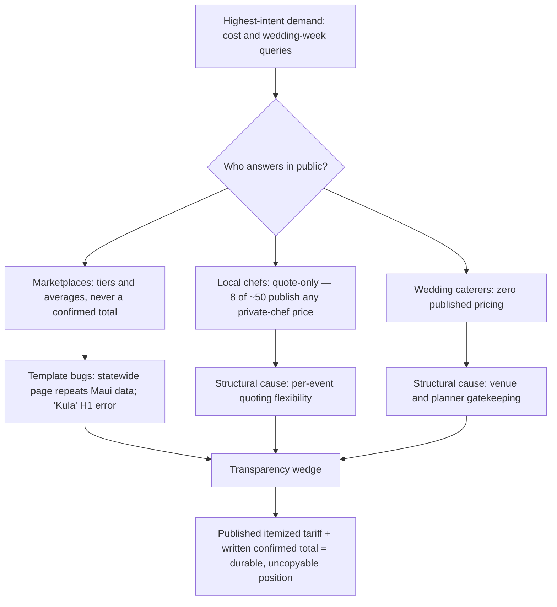

## 2. Hawaii Competitor Landscape and Pricing Research

**Bottom line:** myCHEF Hawaii competes in a fragmented, three-layer market — global marketplaces that publish tiered prices but cannot confirm a total, local chef-operators who can cook superbly but publish almost nothing, and full-service caterers who hide behind "request a quote." Across all four islands, the research surfaced exactly **eight of ~50 local operators who publish any private-chef price at all** (nine counting Kenekes, which publishes wedding packages but no private-chef price) — and zero wedding caterers who publish a full rate card. This is the structural opening: a published, itemized tariff — which myCHEF already operates (Chapter 1) — is a wedge that no competitor in-market can copy without abandoning their quoting model. This chapter documents who the competitors are, island by island; what they charge, verbatim and sourced; and where the transparency gap, the wedding-week vacuum, and the marketplaces' own template failures create beatable positions. Pricing *recommendations* are deliberately out of scope — Chapter 5 builds the pricing architecture on this evidence base.

---

### 2.1 Market Structure

#### 2.1.1 Fragmented market: marketplaces vs local operators vs full-service caterers

The Hawaii private-chef and catering market splits into three distinct competitive layers, each with a different business model, a different pricing posture, and a different vulnerability. Understanding the layers matters because myCHEF's rebuild must position *against all three simultaneously* — and the evidence shows each layer leaves a different door open.

**Layer 1 — Global marketplaces (Take a Chef, Cozymeal, Yhangry, MiumMium, Thumbtack, Airbnb Services, Food Fire + Knives).** These platforms own the informational high ground: programmatic location pages for every island and town, published group-size price tiers, platform-level review counts, and FAQ schema answering "how much does a private chef cost in {island}." Take a Chef is the category's SEO incumbent, with live pricing pages for Honolulu County, Waikīkī, Kailua, Maui, Wailea, Lahaina, Kauaʻi, Poʻipū, and Big Island.[^03-4^][^03-5^][^04-22^][^05-20^][^06-7^] Their structural weaknesses are equally clear: they sell single dinners, not stay-rhythm service; the chef is a bid, not a brand (the strongest local chefs — JP on Oʻahu, Raffin on Maui, Rio on Big Island — are simultaneously platform-listed, commoditizing their own identities[^03-17^][^04-12^][^06-7^]); and their location pages are template products with documented quality failures (§2.3.3).

**Layer 2 — Local independent chef-operators.** One-to-three-person, chef-owned businesses, often with genuine pedigree: ex-Mama's Fish House (Aloha Party Chef, Maui[^04-14^][^04-16^]), Peter Merriman-trained (Private Dining Hawaii, Oʻahu[^03-21^]), James Beard Foundation-recognized (Chef David Paul, Oʻahu[^03-25^]), Michelin-trained (Jason Raffin, Maui[^04-8^]). They win referrals through concierges, villa managers, and planners. Their near-universal weakness: no published pricing, thin websites, no location-page architecture, single-chef capacity ceilings. Of the ~50 local operators profiled across the four island research dimensions, only eight publish any private-chef price at all (nine counting Kenekes' wedding-package menus — counting rule: private-chef or catering per-person/hourly rates; fee-structure-only disclosures like Tailor Made's do not count).

**Layer 3 — Full-service caterers and venue-caterer hybrids.** Scale incumbents such as Contemporary Flavors (Kauaʻi, 50+ staff, "the largest and finest full-service licensed catering company on the island"[^05-13^]), A Catered Experience (Oʻahu, FCH Enterprises/Zippy's family, "serving Oahu since 1978"[^03-27^]), Celebrations by Bev Gannon (Maui, 30+ years[^04-32^]), and Papa Kona (Big Island, oceanfront venue plus off-site catering[^06-15^]). They dominate "catering {island}" and The Knot/WeddingWire directories and lock up venue exclusivity in places (Waimea Valley's exclusive caterer Ke Nui Kitchen on Oʻahu[^03-66^]). Almost none publish pricing, and their product is the buffet line, not the in-villa chef experience.

**Why the fragmentation persists — and why it matters for the rebuild.** Hawaii's operating environment enforces fragmentation by law and logistics: DOH food permits are per-island with no reciprocity, liquor licensing runs through four separate county commissions, GET is filed multi-county with the rate following where service is performed, and there is no consumer inter-island vehicle ferry (equipment moves by barge at $1,000–$2,500 one-way).[^07-41^][^07-38^][^07-28^] No competitor can cheaply become a statewide operator — which means a network that presents *as* statewide (hub plus four island properties), with per-island rate cards reflecting real per-island cost structures, occupies a position the fragmentation itself protects. One industry estimate sizes the Hawaii-plus-California private-chef service market at USD 130.2M in 2026 growing to 194.4M by 2033 (CAGR 5.9%), with meal prep the largest segment (26.5%) and B2B at 66.1% — single-source, paywalled research-firm data, so treat as directional, but its named market restraint matches everything the island research found: "fragmented supply — many independent chefs with variable quality & vetting."[^03-23^]

#### 2.1.2 Marketplace threat profile (Take a Chef, Cozymeal, Yhangry, Thumbtack, Bark)

Marketplaces are the only competitor class that currently answers the price question in public. They are therefore myCHEF's primary SERP competition for cost-intent queries — and the table below is the evidence that their answer is systematically incomplete: tiers and averages, never a confirmed total; platform review counts, never local accountability; and in two documented cases, boilerplate statistics recycled across geographies.

| Marketplace | Hawaii footprint | Published pricing (verbatim) | Scale claims | Structural weaknesses for myCHEF to exploit |
|---|---|---|---|---|
| **Take a Chef** | Per-island + per-town pages: Honolulu County, Waikīkī, Kailua, Ko Olina; Maui, Wailea, Lahaina, Kapalua, "Kula"; Kauaʻi, Poʻipū, Princeville; Big Island, Kailua-Kona[^03-4^][^08-40^][^08-41^][^08-42^][^08-43^] | Group-size tiers per island: Maui $119–$171/pp (avg menu ~$175); Kauaʻi $118–$210/pp (avg ~$176); Big Island $106–$169/pp (avg ~$176); Honolulu $110–$149/pp (avg menu $190.6)[^07-2^][^07-3^][^07-4^][^07-5^] | 72+ chefs Honolulu County, 7,941 guests served since Feb 2018; 50+ chefs Maui, 3,459 guests; 23–24 chefs Kauaʻi, 6,890 guests; 73+ chefs Big Island, 10,447 guests; ratings 4.78–4.95/5[^03-5^][^04-22^][^05-20^][^06-7^] | Template reuse documented: statewide page repeats Maui numbers verbatim; Maui page H1 erroneously reads "Private Chef in Kula" (direct HTML inspection)[^07-1^][^07-2^][^08-4^] — ranges, never a confirmed total; chef-bid variance; no stay-rhythm or multi-day product |
| **Cozymeal** | Oʻahu and Maui pages; named-locale FAQ (Waikīkī, Kailua, North Shore)[^03-7^][^04-20^] | "Starting at $59 per person"; FAQ "$59 to over $100 per person" (Oʻahu); Maui "Starting at $119 per person"[^03-7^][^04-20^] | "45,000+ 5-Star Reviews" platform-wide; Oʻahu chef roster thin (new profiles with 1 review)[^03-9^] | Experience-platform genericness; no Maui/Oʻahu storytelling; price anchors sit below local indie rates, attracting budget buyers; actively recruiting island chefs (roster not yet built)[^04-21^] |
| **Yhangry** | Hawaii state page + Oʻahu, Kauaʻi County, Princeville, Hanalei pages[^03-10^][^05-24^] | "customers booking a private chef in Oahu spend around $817"; hourly "$40 and $60 per hour"[^03-10^] | "17 private chefs currently in Oahu, ~3 new registrations/month"[^03-12^] | **Boilerplate contamination:** the identical "$817" and "17 chefs" figures appear on its Oʻahu, Kauaʻi County, and statewide pages — platform-wide text, not island data; cite only with that caveat[^03-11^][^05-23^] |
| **MiumMium** | Honolulu, Kapolei, Aiea, Laie; Kailua-Kona[^03-13^][^06-23^] | "average sum paid… was $50.65 + tip per person, the lowest priced meals… in the low thirties and the highest… over $150 per guest" (all-in incl. taxes)[^03-13^] | Reservation fee "less than 18% of the total"[^03-13^] | **Boilerplate contamination:** identical $50.65 average on Honolulu and Kailua-Kona pages — a platform-wide figure reused per city; price-leader positioning serves the budget/meal-prep segment myCHEF should not chase |
| **Thumbtack** | Honolulu cost-guide page[^03-14^] | "Hiring a personal chef usually costs anywhere from $40–$100 or more per person"[^03-14^] | Per-pro quotes | Lead-gen, no curation, no vetting narrative; cost guide is generic national content localized |
| **Airbnb Services / Food Fire + Knives / Bark** | Airbnb "Chef in Oahu" listings (6+ visible); FFK Honolulu page; Bark directory listings[^03-1^][^03-38^] | Airbnb sample host displayed in BRL only ("R$894 per guest, Minimum R$3,317 to book" — no USD conversion published); FFK prices à la carte at booking[^03-1^] | Airbnb vetting claim "Chefs on Airbnb are vetted for quality"[^03-1^] | New channel (Airbnb Services, 2025) with currency-localization bugs; no published ranges; FFK/Bark have no Hawaii-specific content depth |

The strategic read is threefold. First, **Take a Chef is the real competitor** — the only marketplace with genuine per-island pricing data, real booking volumes, and a location-page architecture that mirrors (and validates) myCHEF's own hub-island-corridor scheme; its per-island price variation (Kauaʻi 2-person $210 vs Big Island $169) is market proof that island-differentiated rate cards match how this market actually prices.[^07-3^][^07-4^] Second, **every marketplace sells ranges and bids, never a written confirmed total** — the gap between "tier table" and "the price is the price" is exactly where myCHEF's published tariff wins the comparison. Third, **marketplace location pages are beatable on quality**: when the incumbent's statewide page reuses another island's numbers and its Maui page is titled for the wrong town, a curated, locally literate island page with real prices and real logistics outclasses the template on every quality signal that matters. And the marketplaces' remaining weakness is structural, not fixable: they monetize single-dinner bookings and show no multi-day, wedding-week, or retreat product anywhere in their Hawaii inventory.

---

### 2.2 Island-by-Island Competitor Databases

The tables below consolidate the operators that matter on each island: direct private-chef competitors, the caterers who contest adjacent queries, and the demand channels (concierges, villa managers) that function as gatekeepers rather than competitors. Prices are verbatim from competitor sites, all accessed 2026-09-06. "None published" is itself the finding — it is the norm, not the exception.

#### 2.2.1 Oʻahu competitor table

Oʻahu is the deepest and most layered market: 23 operators profiled, every marketplace present, a year-round demand base (5,679,047 visitors in 2025, −2.0% vs 2024, but spending up 5.3% to $9.42B — fewer visitors, richer spend), and the state's only Japanese-language opportunity.[^03-49^]

| Competitor | URL | Offer | Published pricing (verbatim) | Reviews visible | Strengths | Weaknesses |
|---|---|---|---|---|---|---|
| JP Private Chef Services (Jeffrey Pearson) | personalchefoahu.com | Ultra-premium staffed in-home fine dining, Oʻahu + Maui; 27-course omakase/kaiseki | "9 Course Tasting Menu with Signature Cocktail Pairing — $595 per person (6 person minimum)"; "Hawaiian 4 Course Menu — $325 per person 6 guest minimum"; "5 Course… $495 per person includes cocktail pairing"[^03-16^] | Not shown; also on Take a Chef[^03-17^] | Only Oʻahu local with full per-person menu pricing; NYC sister LLC "BBB A+ Rated, Fully Insured"; published address; staffing model ("one server per 10 guests")[^03-18^] | Dated site, no review widgets, no location pages |
| Kenekes (Waimānalo) | kenekes.net | Filipino/seafood/BBQ value caterer with full wedding menus | "Wedding Special #1 – $78.88 per guest… #3 – $67.88… Hawaiian Wedding Special #2 – $88.48… #5 – $89.88 (1 carving station) / $98.88 (2) / $108.88 (3)" incl. delivery, staff, cake service[^03-36^] | Not shown | Rare full price transparency in wedding catering | Value segment; not a villa private-chef competitor |
| Chef Coco Hawaii (Coco Gallagher) | chefcocohawaii.com | Boutique private chef + catering, Kailua | None — custom quote[^03-19^] | Not shown | Strong visual/tablescape brand; named in industry report as key HI player[^03-23^] | No pricing, no reviews, no location pages; Wix site |
| Private Dining Hawaii (John Seymour) | privatedininghawaii.com | North Shore private chef, island-wide + yachts | None published[^03-21^] | Testimonials (no count) | Merriman/Hula Grill pedigree; high-profile guest positioning | No prices, no review counts, thin content |
| Chef David Paul | chefdavidpaul.com | Legacy fine-dining personal chef, Honolulu | "one elegant, all-inclusive price" (no number)[^03-24^] | "James Beard Foundation-recognized chef with 50 years of experience" (site copy)[^03-25^] | SEO-forward occasion subpages (anniversary dinner etc.) — an architecture worth noting | No explicit prices |
| Tailor Made Custom Catering | tmcustomcatering.com | Wedding/event catering; "LUXE BOUTIQUE EVENTS… Yachts & private engagements"; elopement chef | Base menu prices + "Gratuity, Delivery, GE TAX 20% Service Charge & Labor & rentals"[^03-37^] | Not shown | Publishes its fee-stack structure (rare) | Base numbers buried on menu pages; fee stack disclosed but additive, not all-in |
| A Catered Experience | acateredexperience.com | Mass-market island-style catering (FCH/Zippy's group), Waipahu | Buffet staffing tiers "starting at $525.00 ($2,000 food minimum)" scaling to $675 ($5,000 minimum); "A 20% service fee and 4.712% tax added to total"; staff "not authorized to pour or serve alcoholic beverages"[^07-21^] | "serving Oahu since 1978"[^03-27^] | Scale, corporate banquets, published fee mechanics | Not a luxury/villa product |
| Aloha Culinary Group | alohaculinarygroup.com | Caterer + private chef; yacht dining from Ala Wai Boat Harbor | None published | "catering for happy couples since 2010"[^03-32^] | Weddings, vacation-rental dining, dockside yacht delivery niche | No rate card |
| Memoirs Hawaii | memoirshawaii.com | Large-scale corporate + wedding caterer, Honolulu | None; The Knot tier "$$ – affordable"[^03-30^] | The Knot 5.0 (20 reviews); "17+ years"[^03-30^][^03-31^] | Corporate scale; sister rentals company (1311 Events) | No pricing; directory-dependent |
| More Pleaze | morepleaze.com | Hawaiʻi-owned chef network (30+ chefs statewide; 4 Oʻahu), wellness niche | None published | "100% Hawaiʻi-Based & Locally Owned"[^03-33^] | Retreat/wellness positioning; pre/post-natal chef line (unique) | No prices; marketplace model without marketplace data |
| Meal-prep cluster (Good Clean Food Hawaii, 808 Meal Prep, Aina Meals, et al.) | various | Weekly resident meal-prep delivery | 365Taskers cites "$35–$105 per hour… average $70/hour" (ESTIMATED-grade source)[^03-41^] | Good Clean Food claims "Oahu's #1 Meal Prep Company"[^03-40^] | Serve the largest market segment (meal prep 26.5%)[^03-23^] | Price-driven delivery players, not in-villa experience — do not compete on delivered-meal price |

Three Oʻahu findings drive the rebuild. First, the **price-transparency gap is near-total among locals**: only JP ($325–$595/pp) and Kenekes ($67.88–$108.88 wedding packages) publish numbers; everyone else is quote-only — and JP's card sits at the ultra-premium tasting-menu end, leaving the entire $100–$250/pp villa-dinner band served only by marketplaces.[^03-16^][^03-36^] Second, **location-page whitespace is concrete**: Take a Chef covers Honolulu/Waikīkī/Kailua and MiumMium covers Kapolei, but no competitor or marketplace runs dedicated chef pages for Kahala, Ko Olina, North Shore/Turtle Bay, or Hawaiʻi Kai, all zones with documented luxury-rental stock and concierge chef demand.[^03-53^][^03-55^][^03-59^][^03-60^] Third, **Oʻahu is the only island with a Japanese-language opening**: Japan was Oʻahu's #1 international market (≈693k visitors to Oʻahu in 2024, aggregator-sourced[^03-47^]; statewide Japan 731,922 in 2025 per DBEDT[^03-49^]), in-suite kaiseki demand is proven at the luxury end (ESPACIO Waikīkī sells chef kaiseki via concierge; JP offers a 27-course kaiseki), and zero competitors target Japanese-language private-chef queries.[^03-48^][^03-16^] Note also the wedding economics: Honolulu hosts more than half of Hawaii's weddings (9,943 of 18,498 in 2021, DOH-derived), ~60% of them destination weddings, peaking in May, July, and October.[^03-64^]

#### 2.2.2 Maui competitor table — with wedding-depth notes

Maui is the highest-spend island market (CY2025 per-person-per-day visitor spend $305.0 vs Oʻahu's $238.0, DBEDT) and the state's destination-wedding engine — 4,659 weddings in 2021, #2 island after Honolulu, and a top-25 global destination-wedding location.[^03-49^][^05-32^][^04-49^][^04-79^] It is also the island where the most locals publish pricing — a relative statement; the absolute number is four.

| Competitor | URL | Offer | Published pricing (verbatim) | Reviews visible | Strengths | Weaknesses |
|---|---|---|---|---|---|---|
| Chef Kristin (Kristin Michaels) | chefkristin.com | Private chef + gourmet catering, 2–20 guests; multi-market (Maui/Palm Springs/Denver) | "Chef: Hawaii @ $115/hour… Sous-Chef/Server: All Locations @ $75/hour… Shopping: All Locations @ $55/hour. All grocery costs are billed separately." 18% gratuity auto-included for 8+ guests or 3+ day service; "Hawaii General Excise Tax at a rate of 4.712% will be added to all invoices"; $500 deposit; 7-day cancellation[^04-2^] | Not shown | The market's model hourly rate card — proof a Maui chef can publish; 20+ years, Le Cordon Bleu | Three-state split focus; no per-person packaging; no wedding-week product |
| Smoke & Spice Maui | smokeandspicemaui.com | BBQ specialist + private chef dual product | "Three Courses $125 · Four Courses $140 · Five Courses $155 · Six Courses $170 · Chef's Table 10 Course Tasting Dinner $250 per person… Exclusive Dinner for two… $500 plus cost of food. Wine Pairings… $10 per course, per person." Labor: "$225 per server (1 per 12 guests); Bartender $50/hour; Dishwasher $50/hour." BBQ drop-off $40/$50/$65/pp; smoker on-site $500; 30% deposit[^04-18^][^04-19^] | Not shown | Clearest published course-by-course price ladder on Maui; staffing rates published; smoker spectacle | Dated UX; limited luxury polish |
| Lotus Chefs (Kyra Bramble) | lotuschefs.com | All-women chef team; fine dining, retreat/wellness catering, grazing, bridal services | "Prices per adult range from $75-$200+ per person per meal, or $179-$300+ per person per full day service"; fine dining "generally begin at $165 per person"; third-party: tastings "$200 and $500"[^04-5^][^04-4^][^04-6^] | Deep five-star testimonial bench on site[^04-3^] | Owns Maui's retreat/wellness niche; "80% local fresh ingredients" claim; distinctive brand; only local with a per-day service rate | Pricing scattered across pages; no multi-day retreat pricing; no wedding-week structure |
| Jason Raffin Maui Private Chef | jasonraffin.com | Michelin-trained solo chef; dinners, omakase, wedding chef, rehearsal/brunch | Blog guidance only: "$100 to $250 per person"; flat fees "$500 to $1500 or more per event"; FAQ "$150-400 per meal… 2-3 meal minimum"; catering tiers "$50-75… $75-125… $125-200+ per person… Service charges (usually 18-22%)"[^04-9^][^04-10^][^04-13^] | "500+ FIVE-STAR GOOGLE REVIEWS… Maui's most-reviewed private chef"[^04-11^] | The review moat — 5.0 with 534 Google reviews makes him the map-pack incumbent[^08-6^]; the island's only sustained SEO blog operation; fire-survivor narrative | No own rate card (ranges only); single-chef capacity ceiling; also platform-listed on Take a Chef[^04-12^] |
| Aloha Party Chef (Matt Yakabouski) | alohapartychef.com | In-villa private dining, events, cooking classes | "Most private chef experiences range from $250-$350 per person… includes menu planning, grocery sourcing, on-site cooking, service, and full cleanup"[^04-15^] | TV credibility (Cooking Hawaiian Style) | Ex-Mama's Fish House sous chef; distribution via Ali'i Resorts content partnership[^04-16^] | Highest published per-person band among Maui indies; single-chef scale |
| Val & John Private Chefs | valandjohnprivatechefs.com | Italian chef couple, Lahaina; family/wedding value | None published ("very affordable" per testimonial)[^04-17^] | Testimonials | Approachable family/wedding niche since 2012 | Thin site, no rate card, minimal SEO |
| Cafe O'Lei Catering | via The Knot listing[^04-24^] | Island-wide wedding/event caterer + venue (Mill House) | None published | The Knot 4.9 (42 reviews), "$$ – affordable"; "one of the most popular catering companies on the island"[^04-24^] | Volume wedding machine; venue synergy | No pricing; directory-reliant |
| Cutting Edge Catering (Brian Etheredge) | caratsandcake.com/vendor/cutting-edge-catering | Top-tier wedding caterer (ex-Capische) | None published | The Knot 5.0; Style Me Pretty / Carats+Cake features[^04-26^][^04-28^] | Editorial credibility; fisherman-chef story | Zero pricing or content SEO |
| CJ's Maui Catering (Christian Jorgensen) | cjsmaui.com | Full-service wedding caterer, Kāʻanapali | None published | 30+ yrs chef experience[^04-30^] | **Comes closest to the wedding week**: packages bundle welcome BBQ + reception + day-after brunch[^04-30^][^04-31^] | Sells meals bundled, not the week as one contract; no pricing |
| Celebrations Catering (Bev Gannon) | via The Knot listing[^04-32^] | Premiere full-service caterer, Haliʻimaile | None published | The Knot 5.0 (6 reviews); "over 30 years"[^04-32^] | Legacy brand; events to 1,500 | No pricing; wedding-caterer opacity incarnate |
| Food for the Soul / Tarragon / Maui Catering Services / Comfort Zone | various | Boutique-upscale wedding caterers | None published | Tarragon The Knot 5.0 (4); Comfort Zone 4.8 (31 WeddingWire)[^04-29^][^04-37^] | Planner-network entrenchment (Kukahiko, Olowalu preferred lists)[^04-34^] | All quote-only; all planner-gated |

**Wedding-depth notes.** Maui's wedding-catering economics are the best-documented in the state, and the pattern is unambiguous: per-person bands are published by *guides and planners*, never by the caterers themselves. Maui Wedding Vendors' 2026 breakdown — heavy pupus $60–$90/pp, buffet $80–$120/pp, plated $120–$200/pp, open bar $40–$80/pp, staff + rentals $20–$40/pp, $10,000–$16,000 food-and-beverage for a 60-guest wedding — is the market's de facto price list, and it lives on a vendor directory, not a caterer's site.[^04-52^] Venue-included catering anchors the top end: Olowalu Plantation House's Signature Wedding Experience runs $15,000–$18,000 for 30–40 guests including full plated service; Grand Wailea packages run $8,000–$19,800; Haiku Mill charges $2,500–$10,500 venue-only plus a $650 outside-vendor fee that gates caterer access.[^04-82^][^04-84^][^04-85^][^04-86^][^04-87^] The multi-meal wedding-week pattern (welcome dinner → rehearsal → reception → recovery brunch) is documented across four independent sources — CJ's bundle, Ritz-Carlton Kapalua's wedding-weekend coverage, Lotus's bridal weekend, Raffin's rehearsal/brunch services — yet **no competitor sells the week as one culinary contract**; each meal is re-procured separately.[^04-30^][^04-92^][^04-3^][^04-95^] Structurally, DLNR beach permits cap ceremonies at ~20 people with no structures, pushing receptions to estates and villas with kitchens — exactly the segment where a private-chef company, not a ballroom caterer, holds the advantage.[^04-53^][^04-93^] Two cautions: Raffin's 534-review Google profile sets a social-proof bar myCHEF cannot match at launch, and Lahaina post-fire sensitivity must shape all West Maui copy — demand has shifted north to Kāʻanapali–Kapalua and the market remains ~16–21% below pre-fire arrival levels.[^04-58^][^04-60^]

#### 2.2.3 Kauaʻi competitor table — with retreat-market notes

Kauaʻi is the smallest chef market (Take a Chef lists 23–24 chefs island-wide including Oʻahu fly-ins; yhangry claims 17 — boilerplate caveat) but the highest-leverage one: 7.33-day average stays, $281.30 per-person-per-day spend (CY2025), 88% US-domestic visitors, and the state's clearest product whitespace.[^05-20^][^05-23^][^05-32^][^05-66^]

| Competitor | URL | Offer | Published pricing (verbatim) | Reviews visible | Strengths | Weaknesses |
|---|---|---|---|---|---|---|
| Private Chef Kauai (Dani Felix) | privatechefkauai.com | North Shore farm-to-table personal chef | "Chef Rate: $125.00 PER HOUR; Chef Assistant Rate: $50.00-$60.00 PER HOUR… FOOD COST IS SEPARATE"; holiday $150/$75; travel "$50.00 FLAT DRIVING per day/per driver" (North Shore→Kapaʻa/Hāʻena), "$75.00 flat… minimum of 5 persons" (Poʻipū/Kōloa)[^05-1^] | Not shown | Only Kauaʻi chef with a fully published rate card *including travel fees* — proof the model works on-island; named-farm sourcing (Govinda's, Kunana Dairy) | Dated site; hourly model hard to compare per-event; single chef |
| Kauaʻi Cut Catering (Chef Jordan) | kauaicutcatering.com | Private dinners, micro-weddings, retreats; micro-rental inventory | "signature five-course rustic, farm-to-table, island-inspired menu… Up to 15 guests \| $200–$250 per person"[^05-5^] | Not shown | Best content/design among locals; Kauaʻi-born; the only per-person price point published by a Kauaʻi local | Single price point only; single-chef capacity |
| Contemporary Flavors (Mark Oyama) | via kauaimusicscene.com profile[^05-13^] | Scale incumbent, Līhuʻe — "largest and finest full-service licensed catering company on the island" | None published | WeddingWire ~4.8–4.9; SBA Small Business Persons of the Year 2000[^05-13^][^05-14^] | 50+ staff; 26–35+ years; weddings to luaus to corporate; the institutional default | Volume caterer, not an intimate villa chef; quote-only |
| Ania's Table (Chef Ania + sommelier) | aniastable.com | Luxury chef+sommelier duo (Napa/Telluride/Kauaʻi); elopements ≤40 guests; retreat & wellness catering | None published[^05-6^][^05-7^] | Not shown | **Strongest retreat-catering language of any Kauaʻi operator**; sommelier pairing unique on-island | Not Kauaʻi-exclusive; no pricing; no local sourcing proof |
| Kauai Private Chef | kauaiprivatechef.com | Personal chef + kitchen/vacation-rental stocking | None — "Please inquire for a personalized quote. Travel fees and food costs are additional."[^05-2^] | Not shown | Grocery-stocking differentiator | No pricing, thin content |
| Farm Cook Kauai | farmcookkauai.com | Princeville personal chef + catering, farm-background | None published[^05-3^] | Recommended by Koloa Landing wedding guide[^05-4^] | Farm-to-table purist story | No pricing, sparse site |
| Good Food Hanalei (Chef Lala) | goodfoodhanalei.com | Intimate plated dinners, weddings, retreats; dietary depth | None published[^05-8^] | Not shown | Hanalei niche; vegan/GF/Ayurvedic-adjacent breadth | Minimal site |
| Finca Makaleha (Danny Balogh) | fincamakalehakauai.com | Grower-chef, own-farm ingredients below Makaleha range | None published[^05-9^] | 5.0 with 100 Google reviews (map-pack presence)[^08-7^] | The farm-story analogue to "organic estate luxury"; 15+ years | No menus or prices |
| Chef Leo Kauai | chef-leo-kauai.com | "All-inclusive wedding catering"; Ayurvedic/Detox/Paleo menus | None published[^05-11^] | Not surfaced | Retreat-relevant dietary vocabulary | Thin site |
| Kauai Poke Co. | kauaipokeco.com | Casual South Shore venue + buffet catering | "+$15 per person prime rib; +$5 chinaware… **25% gratuity will be added to all food & drinks**; site fee $3k (<50 guests) / $5k (50–100) / $7k (101–226); buyout $10k"[^05-17^] | Not shown | Transparent fee publishing (rare) | Casual tier; its "25% gratuity" labeling is precisely what HRS §481B-14 scrutiny targets — a contrast case, not a model |
| Tahiti Nui (Hanalei) | thenui.com | Restaurant + 20+ yrs wedding catering; weekly luau | Luau (2020-dated): $80 adult / $67 senior / $47 teen / $37 child[^05-19^] | Not shown | North Shore heritage venue | Dated pricing; not a villa competitor |

**Retreat-market notes.** Kauaʻi's retreat supply is real, priced, and entirely uncatered at the product level. Bookable retreats cluster in Princeville, Anahola, and Kīlauea at $2,000–$4,499 per ticket for 4–8 days; Come Together Wellness already hires a private chef for a "5 day/nights… Hawaiian culinary experience" — proof retreat hosts buy chef services directly.[^05-35^][^05-36^] Yet the SERP for "retreat catering Kauai" returns **zero dedicated results**, and no Kauaʻi operator — not even Ania's Table, whose retreat language is the market's strongest — publishes a dedicated retreat page, multi-day meal-plan pricing, or per-day retreat rates.[^05-7^] Estate-buyout economics reinforce the opportunity: Secret Cove on the North Shore rents at $3,750–$8,250/night (7-night minimum) with chef service always priced separately and custom — nobody bundles.[^05-29^] The wedding tier is equally instructive: 2,072 Kauaʻi weddings in 2025 ($107.2M; average $51,719; median $20,911; 85–95 guests — same source family as the statewide Wedding Report figures), while planner-quoted estate catering runs ~$75/pp average, $12,000+ all-in for 50 guests.[^05-33^][^05-34^] Two operational truths belong in every Kauaʻi page decision: the island's chef labor pool is thin (staffing promises must stay inquiry-stage until a crew exists — the current site's stance is correct), and the Hanalei Bridge/slope closures are documented, recurring logistics risks no competitor addresses in copy — myCHEF's published weather-and-road clause is a genuine differentiator.[^05-20^][^05-40^][^05-41^][^05-16^]

#### 2.2.4 Big Island competitor table — with Kona/Kohala notes

The Big Island is a dual-hub market split by a 2.5–3 hour drive: the Kona–Kohala west side (resorts, villas, luxury leisure) and the Hilo/Puna/Volcano east side (residents, retreats, ecotourism).[^06-24^] Visitors search "Big Island"; official sources say "Hawaiʻi Island" — competitors split their usage inconsistently, and both terms must be served.[^06-7^][^06-18^]

| Competitor | URL | Offer | Published pricing (verbatim) | Reviews visible | Strengths | Weaknesses |
|---|---|---|---|---|---|---|
| Chef Rio Miceli (Rio Chef) | riochef.com | Waimea-based; Kona–Kohala corridor private dinners, weddings, weekly/retreat chef | "Starting prices begin at $175 per person. Prices vary seasonally." FAQ: "A typical private dinner for 4–8 guests runs from $150 to $250+ per person"; Epicurate: server "No charge for first 6 adults. $350 for every 8 thereafter"[^06-3^][^06-4^][^06-5^] | Epicurate listing; Take a Chef profile; villa-blog features[^06-6^][^06-7^] | The west-side incumbent: names the gated communities (Hualālai, Kukio, Mauna Kea, Kohanaiki, Kona Village Rosewood) explicitly; strong provenance storytelling (Parker Ranch beef, Hamakua chocolate, Kona Cold lobster); runs the island's only chef FAQ/SEO blog | Single-chef ceiling; "starting at" floor, quote-dependent beyond it |
| Chef Kaimana | kaimana.co | Waimea; weddings, retreats, corporate, high-production events | None published[^06-8^] | Client list: NFL, US Olympic Team, NBA, Mauna Lani, Kohanaiki, Hawaiian Airlines | Corporate/celebrity credibility at event scale | No rates; more event-caterer than villa chef |
| Jus Gambing (Chef Jus) | chefjusgambing.com | Kailua-Kona; private dinners, weddings 20–200 guests, bar service | None published[^06-9^] | Thin third-party footprint | One-stop chef + bar for mid-size villa weddings | No published rates |
| Chef Max Okamura | maxokamura.com | Kona/Kohala tasting menus, Japanese-influenced | None published[^06-10^] | Instagram-forward portfolio | Visual plating strength | No rates, no review schema, minimal local SEO |
| Mahi'aina Personal Chefs (Chef Paul) | mahiainachefs.com | Kona; three published service tiers (family-style / plated / custom), weekly vacation chef, retreats | None published[^06-11^] | "Featured on Yelp/Tripadvisor/Chefpreneur" badges | Clearest product ladder among locals — mirrors the service-line structure myCHEF uses | Tier names without prices; no location pages |
| Chef Timothy James | cheftimothyjames.com | Kailua-Kona/Waikoloa; 3–5 course villa dinners, weekly stays | None published[^06-12^] | Limited visible volume | VRBO/Airbnb guest targeting | No rates |
| Outrageous Gourmet (Katherine Louie) | outrageousgourmet.com | Kailua-Kona full-service catering, luau specialist, wedding planning + catering bundle | None published[^06-13^] | The Knot 5.0 (4 reviews); WeddingWire Couples' Choice; billed as Iron Chef winner[^06-14^] | Luau differentiation; one-stop planning+catering | Dated site, no rate card |
| Papa Kona Events & Catering | papakonaevents.com | Kailua-Kona oceanfront venue + off-site catering | "full-service catering packages begin at $44 per person for professional service, with food menus typically ranging from $45 to $85 per person"; delivery "$100 to $500"; deposit "$2,000 or 50%… whichever is less"; venue packages $4,000–$9,200; F&B minimums $1,500–$2,000; 23% service charge; The Knot "$6,000 starting price"; Zola "Food starts at $75 per person"[^07-20^][^06-15^][^06-16^][^06-17^] | The Knot/Zola listed | Only major Kona venue-caterer hybrid; the most transparent wedding operator on the island | Venue-centric; not a villa private chef |
| Kimo's Akamai Catering | kimosakamaicatering.com | Statewide budget/mid caterer | Zola: "Prices start at $800. Food starts at $40 per person"; pupus "$10.00–$12.00 per serving"[^06-20^][^06-19^] | Directory-listed | The price-floor benchmark | Budget tier, not the villa segment |
| Pacific Mix Catering | pacificmixcatering.com | Island-wide full-service catering | None published[^06-18^] | Not shown | Local menu breadth | No rates, no review schema |
| HeartBeet Catering (Jasmine Silverstein) | via WeddingWire | Hilo/east-side premium chef-caterer; weddings + multi-day retreats; naturally GF farm menus | None published[^06-21^] | WeddingWire 5.0 — east-side leader | **The sole premium chef-caterer on the entire east side**; retreat-capable | Quote-only; east-side only |

**Kona/Kohala notes.** The west side concentrates the highest-value villa and resort-residence zone in the state — 2024 median resort-home prices of $5.5M (Mauna Lani), $6.75M (Mauna Kea), $8.5M (Kohanaiki), $9.63M (Hualālai), and $19M+ (Kukio), per single-source real-estate data, so treat as directional — and Rio Chef is the only competitor who speaks that market's language, naming the gated communities outright.[^06-27^][^06-2^] The resort wedding economy is captive by design: Fairmont Orchid packages run $5,000–$15,000/event plus food-and-beverage minimums of $8,500–$15,000, meals $120/person and up, and a **25% service charge**; Four Seasons Hualalai packages start at $12,500–$21,500.[^06-36^][^06-35^][^06-38^] Outside chefs enter that economy only through estate/villa weddings, rehearsal dinners, and wedding-week meals — and no Big Island competitor publishes any wedding-week equivalent. The east side is the inverse: exactly one premium chef-caterer (HeartBeet) serves Hilo/Hāmākua/Volcano, Puna/Volcano retreat supply has no dedicated "retreat chef Big Island" page anywhere, and the current myCHEF stance ("east side quoted; Hilo/Volcano 2.5–3 hrs from Kona") is the honest operational frame.[^06-21^][^06-24^] The service-charge comparison writes itself: resorts charge 23–25%, Papa Kona 23%, and the published market norm is 18–22%.[^06-15^][^06-36^][^07-23^]

---

### 2.3 Competitor Pricing Research

This section is the chapter's evidence spine: every published price found across the four-island research program, quoted verbatim, with boilerplate and template contamination flagged. Three conclusions emerge: the market's per-person center of gravity sits at $106–$210;[^07-3^][^07-4^] hourly and staffing architecture is published by a small minority and converges tightly ($115–$150 chef, $50–$75 support);[^07-12^][^07-13^][^07-14^] and wedding catering — the largest ticket category — is the least transparent segment of all.

#### 2.3.1 Private chef pricing evidence: per-person, hourly, day rates, weekly rates

The statewide database below consolidates every verifiable published private-chef price. Take a Chef's four island pages are the only true per-island datasets; its statewide page is excluded from any "statewide average" argument because it reuses the Maui page's numbers verbatim (cross-verification contamination flag).[^07-1^][^07-2^]

| Provider | Island | Basis | Exact published price (verbatim) | Source |
|---|---|---|---|---|
| Take a Chef | Oʻahu (Honolulu) | Per person by group size | "2 guests 149 USD/guest… 3–6: 120… 7–12: 110… 13+: 140 USD/guest"; avg menu booked "190.6 USD per person"; observed tipping "14.72% of the total bill" | [^07-5^] |
| Take a Chef | Maui | Per person by group size | "13 people or more… 123 USD… 7 to 12… 119 USD… 3 to 6… 151 USD… 2 people… 171 USD"; avg "around 175 USD per person, including ~4 courses" | [^07-2^] |
| Take a Chef | Kauaʻi | Per person by group size | "13 people or more: 140 USD; 7 to 12 people: 118 USD; 3 to 6 people: 142 USD; 2 people: 210 USD"; avg "around 176 USD per person" | [^07-3^] |
| Take a Chef | Big Island | Per person by group size | "13 people or more… 132 USD… 7 to 12… 106 USD… 3 to 6… 126 USD… 2 people… 169 USD"; avg "around 176 USD per person, including 3.8 courses" | [^07-4^] |
| Cozymeal | Oʻahu / Maui | Per person | "Starting at $59 per person" (Oʻahu, FAQ "$59 to over $100"); "Starting at $119 per person" (Maui); national "$59 to $129 per guest" | [^07-6^][^07-7^][^04-20^] |
| Yhangry | Statewide (boilerplate) | Booking average / hourly / day | "customers booking a private chef in Hawaii spend around $817"; "Hourly rate… between $40 and $60 per hour"; "Daily rate… can range from $300 to $3000" — identical text on Oʻahu, Kauaʻi County, and state pages | [^07-9^] |
| MiumMium | Honolulu & Kailua-Kona (boilerplate) | All-in per person | "average sum paid… was $50.65 + tip per person, the lowest priced meals… in the low thirties and the highest… over $150 per guest… includes everything; grocery shopping, food, cooking, service, cleaning and taxes" — identical on both city pages | [^07-10^] |
| Chef Maison | Statewide | Per person, 4-course | "Prices for 4-course menus typically range from $59 to $194 per person" | [^07-11^] |
| Thumbtack | Honolulu | Per person (cost guide) | "Hiring a personal chef usually costs anywhere from $40-$100 or more per person" | [^07-8^] |
| JP Private Chef | Oʻahu | Per person, tasting menus | "$595 per person (6 person minimum)" 9-course w/ cocktail pairing; "$325 per person 6 guest minimum" 4-course; "$495 per person includes cocktail pairing" 5-course | [^03-16^] |
| Chef Kristin | Maui | Hourly + groceries separate | "Chef: Hawaii @ $115/hour… Sous-Chef/Server: All Locations @ $75/hour… Shopping: All Locations @ $55/hour. All grocery costs are billed separately"; 18% gratuity auto-included 8+ guests/3+ days; GET 4.712% added; $500 deposit | [^07-12^] |
| Private Chef Kauai (Dani Felix) | Kauaʻi | Hourly + travel + holiday | "Chef Rate: $125.00 PER HOUR; Chef Assistant Rate: $50.00-$60.00 PER HOUR… FOOD COST IS SEPARATE"; holiday "$150.00 PER HOUR"; travel "$50.00 FLAT DRIVING per day/per driver" (to Kapaʻa/Hāʻena), "$75.00 flat… minimum of 5 persons" (Poʻipū/Kōloa) | [^07-13^] |
| Smoke & Spice | Maui | Per person by course count | "Three Courses $125; Four Courses $140; Five Courses $155; Six Courses $170; Chef's Table 10 Course Tasting Dinner $250 per person"; dinner for two "$500 plus cost of food"; wine "$10 per course, per person"; staffing "$225 per server… Bartender… $50/hour"; day rates "negotiated on an individual basis" | [^07-14^] |
| Lotus Chefs | Maui | Per person per meal / per day | "$75-$200+ per person per meal, or $179-$300+ per person per full day service"; fine dining "begin at $165 per person"; tastings "$200 and $500" | [^07-15^][^04-4^][^04-6^] |
| Aloha Party Chef | Maui | Per person, all-in | "Most private chef experiences range from $250-$350 per person… includes menu planning, grocery sourcing, on-site cooking, service, and full cleanup" | [^04-15^] |
| Jason Raffin (guidance) | Maui | Per person / flat fee (blog, not a rate card) | "$100 to $250 per person"; flat "$500 to $1500 or more per event"; "a family of six… around $1200 to $1500 total"; "tipping 15-20% is customary" | [^07-24^] |
| Kauaʻi Cut | Kauaʻi | Per person, 5-course | "Up to 15 guests \| $200–$250 per person. Pricing varies based on menu selection & customization" | [^05-5^] |
| Chef Rio Miceli | Big Island | Per person floor + staffing | "Starting prices begin at $175 per person. Prices vary seasonally."; FAQ "$150 to $250+ per person"; server "No charge for first 6 adults. $350 for every 8 thereafter… Gratuity is not included" | [^06-3^][^06-4^][^07-17^] |
| Kanini Estate (2026 market guide) | Big Island | Large-group service + grocery policy | "rates for large groups often start around $132 per person for the service itself… Groceries are usually billed at cost as a separate line item" | [^07-16^] |
| Chef David Paul | Oʻahu | Quote-only (contrast case) | "Every evening is different, so every price is built for the night you have in mind" — no published rate | [^07-19^] |
| Kauai Private Chef | Kauaʻi | Quote-only (contrast case) | "Travel fees and food costs are additional. Please inquire for a personalized quote. Holiday bookings are subject to additional fees." | [^07-18^] |

The chart and table support four evidence-based conclusions. **First, the marketplace band is the market's center of gravity:** Take a Chef's average booked menu lands at ~$175–$176/pp on Maui, Kauaʻi, and Big Island and $190.6/pp in Honolulu — noting that Honolulu's average exceeds every published tier because averages reflect booked menu choices and add-ons while tiers are base group-size rates; the two must never be conflated.[^07-2^][^07-3^][^07-4^][^07-5^] **Second, local chefs who publish cluster in two tiers:** transparent-value operators ($115–$150/hr or $125–$250/pp — Kristin, Dani Felix, Smoke & Spice, Kauaʻi Cut, Lotus) and ultra-premium tasting-menu operators ($250–$595/pp — JP, Chef Matt, Rio's floor). The $150–$250/pp villa-dinner band between the marketplace ceiling and the ultra-premium floor is exactly where published local supply is thinnest. **Third, the pricing *architecture* converges even where prices don't:** groceries billed separately at cost, support staff at $50–$75/hr or $225/server flat, published holiday premiums, zoned flat travel fees — these are Hawaii market norms any credible rate card must match, not inventions.[^07-12^][^07-13^][^07-14^] **Fourth, multi-day pricing barely exists:** only Lotus ($179–$300+/pp/day) and Yhangry's boilerplate "$300 to $3000" day range publish anything beyond single events — the "chef for the week" is essentially unpriced in public anywhere in the state, precisely the segment (7.05–7.94-day average island stays, Feb 2026 DBEDT) where visitor economics favor it most.[^07-15^][^07-9^][^07-55^]

#### 2.3.2 Catering and wedding catering pricing evidence — staffing, service charges, minimums

Wedding catering is the largest single ticket in the market — and its pricing evidence lives almost entirely with planners, directories, and venue rate cards, not caterers. Per the cross-verification reconciliation, the canonical statewide anchors are **17,370 weddings and $927M total spend in 2025, average cost $53,369 (mean, skewed by luxury weddings) and median $21,117 (the "typical" wedding), with 74–84 guests on average** — never average these against blog estimates like "$34,000" or "$40,000," which the verification report grades low-confidence.[^07-60^]

| Source | Island | Item | Exact published price (verbatim) | Citation |
|---|---|---|---|---|
| Maui Wedding Vendors (2026 directory) | Maui | Per-person by service style | "Heavy appetizers / cocktail $60–$90… Buffet dinner $80–$120… Plated dinner (2–3 courses) $120–$200… Open bar (5 hrs) $40–$80… Service staff + rentals $20–$40… For a 60-guest wedding with buffet dinner and open bar, budget roughly $10,000–$16,000 for food and beverage" | [^04-52^] |
| Jason Raffin (catering guide) | Maui | Per-person tiers + service charge | "Budget tier: $50-75 per person… Mid-tier: $75-125… Premium tier: $125-200+… Service charges (usually 18-22%)" | [^07-23^] |
| Aloha Bridal Connections (planner, 2026) | Oʻahu | Buffet basis + real-wedding case | "Catering: $13,000 – $18,000… Buffet Service for $75/head + staffing + taxes/fees"; real ~75-guest estate wedding: "Catering: $12,000 (Average $60/pp + staffing + rentals + service fees)" | [^07-22^] |
| Aloha Bridal Connections (planner, 2026) | Kauaʻi | Estate catering | "estate-wedding catering for 50 guests: $12,000+ (Average $75/pp + staffing + rentals + service fees)"; 75-guest Kauaʻi wedding $50,000–$75,000 | [^05-34^] |
| Kenekes | Oʻahu | Published wedding packages | "$67.88–$108.88 per guest" incl. delivery, staff, cake service | [^03-36^] |
| A Catered Experience | Oʻahu | Staffing tiers, minimums, fee stack | "$525.00 ($2,000 food minimum)" for 100–150 guests scaling to "$675.00 ($5,000 food minimum)" for 251–300; "$200.00/attendant"; "A 20% service fee and 4.712% tax added to total"; "$300.00 or 450.00 minimum purchase depending on the location" | [^07-21^] |
| Papa Kona | Big Island | Per-person, delivery, deposit, service charge | "packages begin at $44 per person for professional service, with food menus typically ranging from $45 to $85 per person"; "Delivery ranges from $100 to $500"; "deposit equal to $2,000 or 50% of the total event cost, whichever is less"; venue packages $4,000–$9,200; 23% service charge | [^07-20^][^06-15^] |
| Fairmont Orchid | Big Island (Kohala) | Venue F&B minimums + service charge | Packages "$5,000–15,000/event… food & beverage minimum of $8,500 (Monday–Thursday) and $15,000 (Friday–Sunday)… Meals (when priced separately) $120/person and up… Service Charge 25%"; elopement $3,500–$4,500 | [^06-36^][^06-35^] |
| Four Seasons Hualalai | Big Island (Kohala) | Venue packages | "Package Prices $13,500/event and up"; "Ke Aloha Package for up to 20 guests starts at $12,500"; Wai Maoli O Hualalai $21,500 | [^06-38^] |
| Olowalu Plantation House | Maui | Venue-included catering packages | "$15,000 \| up to 30 guests… $18,000 \| up to 40 guests" incl. plated service + beer/wine/champagne + coordination | [^04-82^] |
| The Knot (2025 national study) | National benchmark | Per person | "The average catering cost per person is $80… ranges from $62–$123" by region | [^07-25^] |
| Food trucks (Roaming Hunger) | Maui | Budget floor | "$10–$25/pp, $550–$2,500 per event" | [^04-40^] |

Four implications fall out of the wedding data. **First, the per-person ladder is consistent across independent sources:** budget buffet $40–$75, mid-tier $75–$125, plated premium $120–$200+, with staffing/rentals/bar adding $60–$120/pp on top — and service charges running 18–22% among independents against 23–25% at resorts (Papa Kona 23%, Fairmont Orchid 25%).[^07-23^][^06-15^][^06-36^] **Second, the fee stack is where incumbents are most vulnerable:** Tailor Made buries "Gratuity, Delivery, GE TAX 20% Service Charge & Labor & rentals" in fine print, Kauai Poke Co. adds "25% gratuity… to all food & drinks," and under HRS §481B-14 a service charge must be distributed to staff as tips or conspicuously disclosed otherwise — exact disclosure wording REQUIRES LEGAL VERIFICATION before myCHEF's own fee-stack copy is locked.[^03-37^][^05-17^][^07-32^] **Third, deposits and minimums are publishable mechanics, not secrets:** Papa Kona's "$2,000 or 50%," ACE's $2,000–$5,000 food minimums, and venue F&B minimums of $8,500–$15,000 prove the market tolerates published thresholds — operators simply choose not to publish them.[^07-20^][^07-21^][^06-36^] **Fourth, the wedding-week is the unpriced product:** caterers quote the reception; the welcome dinner, rehearsal, and recovery brunch are re-procured meal by meal, and the only documented bundles (CJ's, resort packages) wrap the venue's own catering. A single culinary contract across the week is structurally available to a private-chef network and structurally unavailable to a venue caterer.[^04-30^][^04-92^]

#### 2.3.3 What competitors hide vs publish — the transparency gap myCHEF can own

Aggregating the four island databases yields the starkest finding in this chapter: price opacity is the market's equilibrium, and it holds across every island and every competitor class.

| Island | Local operators profiled | Locals publishing ANY price | Who publishes (and what) | Wedding caterers publishing prices |
|---|---|---|---|---|
| Oʻahu | 23 | 2 of ~15 locals | JP Private Chef ($325–$595/pp tasting menus); Kenekes ($67.88–$108.88 wedding pkgs); Tailor Made publishes fee structure only | 0 (Kenekes excepted — value segment) |
| Maui | 15+ | 4 | Chef Kristin (hourly card + fee stack); Smoke & Spice (course ladder + staffing); Lotus Chefs (per-meal/per-day bands); Aloha Party Chef ($250–$350/pp FAQ) | 0 of 8+ profiled |
| Kauaʻi | 14 locals | 2 (3 incl. casual-tier Kauai Poke Co.) | Dani Felix (hourly + travel + holiday); Kauaʻi Cut ($200–$250/pp); Kauai Poke Co. (fees, casual tier) | 0 |
| Big Island | 12 locals | 1 | Rio Miceli ("from $175/pp" floor only) | 0 (Papa Kona publishes packages — venue-caterer hybrid) |
| Marketplaces | 7 platforms | All (tiers/averages) | Take a Chef per-island tiers; Cozymeal/MiumMium/Thumbtack anchors; Yhangry/MiumMium figures are cross-geography boilerplate | n/a |
| **myCHEF (reference, Ch.1)** | 4 island properties | **Full rate cards on all four** | Per-person bands, staffing hourlys, day rates, travel zones, deposits, 20% service + GET lines — the only complete published tariff in-market | Publishes wedding-week pricing |

Sources: island databases §2.2.1–2.2.4; transparency counts corroborated across all four island research dimensions and the statewide synthesis.[^03-36^][^04-2^][^04-18^][^04-5^][^04-15^][^05-1^][^05-5^][^06-3^]

The "so what" is a structural claim, not a marketing one. Local chefs *cannot* publish fixed rate cards without abandoning the per-event quoting flexibility their one-person capacity model depends on; marketplaces *cannot* publish confirmed totals because their revenue model is chef-bid variance. The gap is therefore durable — and it sits precisely on the highest-intent informational demand in the category. The cost-query SERP proves the vacuum: "private chef Hawaii cost" triggers an AI Overview that synthesizes pricing from Jason Raffin's blog, Chef Kristin, Take a Chef, and a vacation-rental estate's blog — a competitor, one transparent local, a marketplace, and a villa company are the only sources Google can find.[^08-14^] Meanwhile the marketplace location pages that fill the gap are demonstrably beatable on quality: Take a Chef's statewide Hawaii page reuses its Maui tier table number-for-number, and its Maui page's H1 erroneously reads "Private Chef in Kula" — template artifacts a curated island page with real prices, real logistics (Hanalei Bridge clauses, Kona–Hilo travel zones, Waikīkī COI handling), and a confirmed written total outclasses on every trust signal.[^07-1^][^07-2^][^08-4^] This is the wedge the rebuild preserves and amplifies; the mechanics of the rate card itself are Chapter 5's domain.

---

### 2.4 Sister-Site Patterns (mychef.ae / mychef.id)

The competitor analysis above describes the market myCHEF fights in; the sister sites describe the playbook the network has already proven in two other vacation-luxury markets. Both patterns matter to this chapter for one reason: they show that the transparency wedge documented in §2.3.3 is not a Hawaii experiment — it is the network's house style, executed at scale elsewhere.[^02-1^][^02-10^]

#### 2.4.1 Transferable architecture, packaging and conversion patterns

**Two-core product grammar.** Both sites organize everything around two cores — Dubai: "A chef for your house, or catering for your event… Two core services, and four more built on them"; Bali: "Private chef — a stay" vs "Catering — one meal," with add-ons explicitly "stacked on" the cores, "not equal heroes on this page." Every commercial page carries a product router ("You are on the right page").[^02-1^][^02-10^][^02-7^] Hawaii's homepage already runs this grammar (private chef / catering / Stay Chef); the rebuild extends the router to every commercial page.

**Package cards with worked math — the single most transferable pricing pattern.** Dubai packages the recurring chef as four named "jobs," each hours + one fixed price (Fresh Meal AED 750 / Kitchen on Autopilot AED 1,050 / Full-Day AED 1,500), plus occasion-named, guest-count-anchored cards (Date Night, 2 guests, from AED 1,200). Bali multiplies per-person prices across guest counts in the copy itself ("2 guests IDR 1.4M++ · 4 guests IDR 2.8M++ · 8 guests IDR 5.6M++ · 12 guests IDR 8.4M++") and works the month on the pricing page ("16 visits. You pay AED 16,800").[^02-4^][^02-5^][^02-13^][^02-17^] This is exactly the presentation layer §2.3's evidence calls for: the market quotes ranges; the sister sites teach the reader to compute their own total — then confirm it in writing ("The figure you see here is the figure your quote is built from — fixed, itemised, and confirmed before you pay anything").[^02-13^]

**Estimators and taught fee notation.** Both sites embed interactive estimate builders (service type → guests → duration → add-ons → live subtotal → "Get exact quote on WhatsApp") with the honest disclaimer that the written proposal is the confirmed total. Bali coined its own tax notation — "++" = 11% government tax + 10% service, ×1.21 all-in — with a dedicated FAQ entry; Dubai puts VAT on its own line. Hawaii's existing equivalent ("Service 20% and Hawaiʻi GET up to 4.7120% appear as separate lines") is the same pattern, already drafted — and §2.3.2 shows the local market actively fumbling fee disclosure, so formalizing the notation site-wide converts an industry-wide trust deficit into proof of honesty.[^02-13^][^02-14^][^02-4^][^02-20^]

**WhatsApp-first conversion with published promises.** WhatsApp is the primary conversion channel on both sites, with published response-time promises ("Typical reply within 15 min during business hours" Dubai; "reply in 2h" Bali), proposal-framed CTAs ("Request a proposal"), a minimal-information ask ("Date, guest count and area… That is enough to start"), and reassurance microcopy at every CTA (50% deposit, cancellation tiers, replacement guarantee "within 2 hours or refund 100%").[^02-1^][^02-14^][^02-10^][^02-18^]

**Trust and programme layers.** Repeating 3–4-item trust-badge strips; dedicated vetting pages; booking-protection and quality-guarantee programmes; "what we won't do" negative-space trust copy (Dubai declines chef-level upsells — "Recognising a chef is our cost, not yours"; Bali declines same-day dinners); ethical capacity honesty ("six places this September") instead of countdown timers; and comparison tables vs freelance chefs and marketplaces with evidence rows (backup guarantee, published prices, food-safety certification).[^02-4^][^02-10^][^02-16^][^02-18^]

**Architecture and AI-crawler posture.** Both sites put pricing at sitemap priority 0.8–0.9 — pricing as a first-class landing page — inside commented, governed sitemaps and hub-and-spoke silos. Bali's robots.txt explicitly welcomes AI crawlers (GPTBot, ClaudeBot, PerplexityBot, Google-Extended, et al.) "for citations" and references an llms.txt — the network's AI-search template, worth copying verbatim as a file structure. Bali's 60+ programmatic location pages demonstrate the non-thin template (unique local copy, pricing block, comparison table, local-knowledge section) Hawaii's corridor pages must match to avoid doorway-page risk.[^02-2^][^02-11^][^02-12^][^02-15^]

#### 2.4.2 Explicit do-not-copy list (market-specific claims, pricing, policies)

The sister sites are a mechanics library, not a content source. The following must never cross over to the Hawaii properties — every item is market-specific, and several would be actively false or legally risky in Hawaii:[^02-13^]

1. **All prices and currencies.** Every AED and IDR figure, per-person rate, deposit amount, and discount tier. Hawaii sets its own USD pricing — which already exists on the live site (Chapter 1) and must be re-derived from the Hawaii evidence base in §2.3, never anchored to Dubai's AED 750 visit or Bali's IDR 2.7M day rate.[^02-20^]
2. **Halal-first positioning.** "Halal-First Kitchen Standards," halal menu pages, Ramadan/Iftar/Eid catering — UAE-market-specific.[^02-1^][^02-2^]
3. **Bali-specific claims and logistics.** HACCP-certification claims (unless Hawaii chefs hold equivalent US credentials — verify before claiming); the "++" tax notation itself (11% + 10% Indonesian structure ≠ Hawaii's 4.5% GET + 20% service — Hawaii needs its own notation); villa-density claims, babi guling, floating breakfast, named local suppliers, WITA hours, NPWP paperwork.[^02-13^][^02-14^][^02-16^]
4. **Track-record numbers.** "560+ events served / 12,000+ guests / 98% Repeat or Referred / 4.9/5 Rating / Since 2019 / 50+ staff" (Bali) and "2 to 500+ guests per booking" (Dubai) are those markets' operating histories; Hawaii publishes only its own verifiable figures.[^02-18^][^02-1^]
5. **Named people.** Bali's eight chef profiles and four named coordinators; Dubai's chef personas. Hawaii needs its own real team as assets genuinely exist — importing profiles would violate the no-fabrication policy the market gap makes valuable.[^02-19^][^02-11^]
6. **Dubai employment/legal model language.** Visa references, Numini FZC entity disclosure, Dubai Municipality standards, "a licensed supplier employs the chef" — Hawaii requires its own legal/entity framing (DOH permits, county liquor rules, GET registration per §2.3.2's regulatory context).[^02-6^][^02-8^]
7. **Market-specific occasions and venues.** Yachts-as-default, desert dining, iftar; Bali's retreats/yoga/surf framing — replaced by Hawaii occasions, with luau-adjacent celebrations handled carefully for cultural sensitivity.[^02-2^][^02-11^]
8. **Testimonials.** All quoted reviews reference Bali/Dubai places and dates; never reuse.[^02-18^][^02-17^]
9. **Verbatim phrasing generally.** The shared house style ("the price is the price") is fine; identical paragraphs ("kitchen left exactly as we found it") must be rewritten to avoid duplicate-content signals across the network.[^02-13^]

The forward-looking implication: Hawaii is the network's third market, and the evidence in this chapter says it is the one where the house style matters most. Dubai and Bali prove the mechanics — worked math, taught fee notation, WhatsApp-first conversion, AI-crawler posture — at commercial scale; §2.3 proves the Hawaii market is *more* opaque than either sister market's competitive set, not less. A rebuild that ports the mechanics while respecting the do-not-copy list does not merely match the local competition's information quality; it operates a category above it, with no in-market actor structurally able to follow.

---

### Sources

[^02-1^] https://mychef.ae — myCHEF Dubai homepage (accessed 2026-09-06)
[^02-2^] https://www.mychef.ae/sitemap.xml — full URL inventory with silo comments (accessed 2026-09-06)
[^02-4^] https://www.mychef.ae/private-chef-dubai/pricing — four-job price table, calculator, cost drivers, policies, FAQ (accessed 2026-09-06)
[^02-5^] https://www.mychef.ae/menus — starter packages, per-person format rates, dietary matrix (accessed 2026-09-06)
[^02-6^] https://www.mychef.ae/catering-packages-dubai — package hub, occasion router, silo-map blocks, global footer (accessed 2026-09-06)
[^02-7^] https://www.mychef.ae/private-chef-dubai — household-chef hub, product router, level system (accessed 2026-09-06)
[^02-8^] https://www.mychef.ae/contact — enquiry routing, minimal quote brief (accessed 2026-09-06)
[^02-10^] https://mychef.id/ — myCHEF Bali homepage (stay vs one-meal split, guarantees, add-ons framing) (accessed 2026-09-06)
[^02-11^] https://mychef.id/sitemap.xml — ~200 URLs across service/location/editorial silos (accessed 2026-09-06)
[^02-12^] https://mychef.id/robots.txt — explicit AI-crawler allows + llms.txt reference (accessed 2026-09-06)
[^02-13^] https://mychef.id/pricing — at-a-glance rate table, embedded estimator, guest-count math table (accessed 2026-09-06)
[^02-14^] https://mychef.id/faq — categorised FAQ, "++" explanation, deposit/cancellation tiers (accessed 2026-09-06)
[^02-15^] https://mychef.id/private-chef/seminyak — programmatic location-page template (accessed 2026-09-06)
[^02-16^] https://mychef.id/fine-dining/menus — 24 set menus, course breakdowns, dietary flags, priced add-ons (accessed 2026-09-06)
[^02-17^] https://mychef.id/catering/villa-catering — chapter-structured commercial page, packages, testimonials (accessed 2026-09-06)
[^02-18^] https://mychef.id/why-mychef — evidence pillars, freelance/marketplace comparison table, guarantees (accessed 2026-09-06)
[^02-19^] https://mychef.id/contact — named project coordinators, WhatsApp-prefill form, office address (accessed 2026-09-06)
[^02-20^] https://mychef-hawaii.com — current Hawaii homepage (spot-check for comparative notes) (accessed 2026-09-06)
[^03-1^] https://www.airbnb.com/services/6284002 — Airbnb Services, "Private Chef Experience in Oahu Hawaii," prices in BRL (accessed 2026-09-06)
[^03-4^] https://www.takeachef.com/en-us/private-chef/waikiki — Waikiki pricing tiers, chef counts, review stats (accessed 2026-09-06)
[^03-5^] https://www.takeachef.com/en-us/private-chef/honolulu-county — Honolulu County tiers, guests served, avg menu price (accessed 2026-09-06)
[^03-7^] https://www.cozymeal.com/oahu/personal-chefs — Oʻahu per-person pricing and FAQ (accessed 2026-09-06)
[^03-9^] https://www.cozymeal.com/chefs/2632/chef-analea — Oahu chef profile, 5.0/1 review (accessed 2026-09-06)
[^03-10^] https://yhangry.com/f/private-chefs/us-hawaii-honolulu--county-oahu/ — Oʻahu average spend and hourly range (accessed 2026-09-06)
[^03-11^] https://yhangry.com/f/private-chefs/us-hawaii/ — Hawaii-level page, same $817 average (accessed 2026-09-06)
[^03-12^] https://yhangry.com/s/private-chef-jobs/us-hawaii-honolulu--county-oahu/ — Oʻahu chef-count stats (accessed 2026-09-06)
[^03-13^] https://www.miummium.com/en-us/personal-chef-honolulu — all-in per-person average (accessed 2026-09-06)
[^03-14^] https://www.thumbtack.com/hi/honolulu/private-chefs — Honolulu personal-chef cost guide (accessed 2026-09-06)
[^03-16^] https://personalchefoahu.com/menu-privatechefoahu — JP Private Chef tasting-menu pricing (accessed 2026-09-06)
[^03-17^] https://www.takeachef.com/en-us/chef/jeffrey-pearson5 — Jeffrey Pearson platform profile (accessed 2026-09-06)
[^03-18^] https://www.jpfinefoodsllc.com/ — JP Fine Foods LLC, BBB/insurance claims (accessed 2026-09-06)
[^03-19^] https://www.chefcocohawaii.com/ — Chef Coco Hawaii (accessed 2026-09-06)
[^03-21^] https://privatedininghawaii.com/ — Private Dining Hawaii / Chef John Seymour (accessed 2026-09-06)
[^03-23^] https://www.coherentmarketinsights.com/industry-reports/hawaii-and-california-private-chef-service-market — market size, segmentation, key players (accessed 2026-09-06)
[^03-24^] https://chefdavidpaul.com/services/personal-chef-honolulu — Chef David Paul personal chef page (accessed 2026-09-06)
[^03-25^] https://chefdavidpaul.com/services/personal-chef-honolulu/anniversary-dinner — occasion subpage, James Beard claim (accessed 2026-09-06)
[^03-27^] https://builtin.com/company/a-catered-experience-inc — A Catered Experience company history (accessed 2026-09-06)
[^03-30^] https://www.theknot.com/marketplace/catering-oahu-hi — The Knot Oʻahu catering directory (accessed 2026-09-06)
[^03-31^] https://memoirshawaii.com/ — Memoirs Hawaii (accessed 2026-09-06)
[^03-32^] https://www.alohaculinarygroup.com/ — Aloha Culinary Group (accessed 2026-09-06)
[^03-33^] https://morepleaze.com/ — More Pleaze chef network (accessed 2026-09-06)
[^03-36^] https://www.kenekes.net/catering.html — Kenekes published wedding packages (accessed 2026-09-06)
[^03-37^] https://www.tmcustomcatering.com/services — Tailor Made fee structure (accessed 2026-09-06)
[^03-38^] https://www.foodfireknives.com/honolulu-private-chefs — Food Fire + Knives Honolulu page (accessed 2026-09-06)
[^03-40^] https://www.localmealprep.com/all-states — Hawaiʻi meal-prep companies (accessed 2026-09-06)
[^03-41^] https://365taskers.com/cost-guide/chef-meal-prep/honolulu — meal-prep hourly cost guide (ESTIMATED-grade) (accessed 2026-09-06)
[^03-47^] https://roadgenius.com/statistics/tourism/usa/hawaii/oahu/ — Oʻahu 2024 source markets (aggregator) (accessed 2026-09-06)
[^03-48^] https://www.espaciowaikiki.com/experiences/private-chef-experience/ — ESPACIO in-suite kaiseki (accessed 2026-09-06)
[^03-49^] https://dbedt.hawaii.gov/blog/26-04/ — DBEDT Oʻahu CY2025 visitor statistics (accessed 2026-09-06)
[^03-53^] https://rmoceanfrontrentals.com/luxury-vacation-rentals/oahu/ — Kahala villa area, chef/ concierge services (accessed 2026-09-06)
[^03-55^] https://gathervacations.com/vrp/unit/490/ — Ko Olina Beach Villas chef kitchens (accessed 2026-09-06)
[^03-59^] https://pipelineshores.com/pages/ultimate-activity-guide-to-oahu — North Shore villa concierge private chef (accessed 2026-09-06)
[^03-60^] https://www.exoticestates.com/property/hawaii-vacation-rentals/oahu-villas/aloha-nalu — Hawaiʻi Kai villa chef/ concierge (accessed 2026-09-06)
[^03-64^] https://www.happylaulea.com/blogs/articles/hawaii-wedding-statistics — 2021 Hawaiʻi wedding counts, destination share, peak months (accessed 2026-09-06)
[^03-66^] https://emilychoyphotography.com/oahu-wedding-venues/ — Waimea Valley exclusive caterer (accessed 2026-09-06)
[^04-2^] https://www.chefkristin.com/services/ — Chef Kristin verbatim pricing structure, gratuity, tax, deposit (accessed 2026-09-06)
[^04-3^] https://lotuschefs.com/ — Lotus Chefs team, services, positioning (accessed 2026-09-06)
[^04-4^] https://lotuschefs.com/private-chef-fine-dining-maui/ — fine-dining $165/pp start, 80% local sourcing (accessed 2026-09-06)
[^04-5^] https://lotuschefs.com/family-friendly-private-chef-services-maui/ — per-meal and per-day price bands (accessed 2026-09-06)
[^04-6^] https://www.mauioceanfrontdining.com/blog/how-to-find-exclusive-chef-events-in-maui/ — Lotus tasting-menu price range (accessed 2026-09-06)
[^04-8^] https://www.jasonraffin.com/post/private-chef-maui-the-luxury-dining-experience-that-brings-the-restaurant-to-you — Raffin story and services (accessed 2026-09-06)
[^04-9^] https://www.jasonraffin.com/post/maui-private-chef-hire-elevate-your-event-with-a-personal-culinary-experience — "$100 to $250 per person" (accessed 2026-09-06)
[^04-10^] https://www.jasonraffin.com/post/breaking-down-the-cost-of-a-private-chef-in-maui-private-chef-pricing-maui — price breakdown, family-of-six example (accessed 2026-09-06)
[^04-11^] https://www.jasonraffin.com/privatechef — "500+ five-star Google reviews" claim (accessed 2026-09-06)
[^04-12^] https://www.takeachef.com/en-us/chef/jason-raffin2 — Raffin platform profile (accessed 2026-09-06)
[^04-13^] https://www.jasonraffin.com/post/maui-catering-services — catering tiers and service charges (accessed 2026-09-06)
[^04-14^] https://alohapartychef.com/ — Aloha Party Chef positioning (accessed 2026-09-06)
[^04-15^] https://alohapartychef.com/faqs-private-chef-maui — "$250-$350 per person" (accessed 2026-09-06)
[^04-16^] https://www.aliiresorts.com/maui-vacation-private-chef/ — Ali'i Resorts × Chef Matt partnership, Mama's Fish House background (accessed 2026-09-06)
[^04-17^] https://www.valandjohnprivatechefs.com/ — Val & John Private Chefs (accessed 2026-09-06)
[^04-18^] https://www.smokeandspicemaui.com/mauiprivatechefpricing — course ladder, staffing rates (accessed 2026-09-06)
[^04-19^] https://www.smokeandspicemaui.com/bbq-and-menus-1 — BBQ drop-off pricing, smoker fee, deposit (accessed 2026-09-06)
[^04-20^] https://www.cozymeal.com/maui/personal-chefs — Maui per-person pricing (accessed 2026-09-06)
[^04-21^] https://talents.vaia.com/companies/cozymeal/private-chef-maui-hi-134471260/ — Cozymeal recruiting Maui chefs (accessed 2026-09-06)
[^04-22^] https://www.takeachef.com/en-us/private-chef/maui — Maui tiers, guests served, average menu (accessed 2026-09-06)
[^04-24^] https://www.theknot.com/marketplace/catering-maui-hi — The Knot Maui catering directory (accessed 2026-09-06)
[^04-26^] https://caratsandcake.com/vendor/cutting-edge-catering — Cutting Edge profile (accessed 2026-09-06)
[^04-28^] https://www.stylemepretty.com/hawaii-weddings/maui/ — Cutting Edge editorial features (accessed 2026-09-06)
[^04-29^] https://www.alignable.com/kihei-hi/tarragon-maui-catering — Tarragon Maui Catering (accessed 2026-09-06)
[^04-30^] https://cjsmaui.com/an-all-inclusive-maui-wedding-package-details-and-bbq-rehearsal-dinner/ — welcome BBQ + reception + brunch bundle (accessed 2026-09-06)
[^04-31^] https://cjsmaui.com/5-maui-catering-services-for-events-and-catered-wedding-receptions/ — CJ's full-service wedding catering (accessed 2026-09-06)
[^04-32^] https://www.theknot.com/marketplace/catering-hilo-hi — Celebrations by Bev Gannon listing (accessed 2026-09-06)
[^04-34^] https://aperfectparadisewedding.com/Blog/love-at-the-kukahiko-estate-makena-maui-2/ — Food for the Soul at Kukahiko (accessed 2026-09-06)
[^04-37^] https://www.weddingwire.com/c/hi-hawaii/wedding-caterers/3-sca.html — WeddingWire Hawaiʻi caterer reviews (accessed 2026-09-06)
[^04-40^] https://roaminghunger.com/maui-hi/food-truck-catering/ — food-truck catering costs (accessed 2026-09-06)
[^04-49^] https://www.happylaulea.com/blogs/articles/hawaii-wedding-statistics — 2021 Maui wedding count (accessed 2026-09-06)
[^04-52^] https://mauiweddingvendors.com/maui-wedding-cost/ — Maui catering/bar per-person table (accessed 2026-09-06)
[^04-53^] https://mauidestinationweddings.com/maui-beach-wedding-permits-complete-guide-2026/ — DLNR beach-permit caps (accessed 2026-09-06)
[^04-58^] https://hawaii.com/blog/visiting-lahaina-maui-2026 — post-fire West Maui demand shift (accessed 2026-09-06)
[^04-60^] https://mauinow.com/2025/08/29/visitor-spending-and-visitor-arrivals-declined-in-july-2025/ — Maui recovery vs pre-fire levels (accessed 2026-09-06)
[^04-79^] https://radicalstorage.com/travel/destination-wedding-statistics/ — Maui top-25 destination-wedding ranking (accessed 2026-09-06)
[^04-82^] https://www.olowaluplantationhouse.com/rates/ — Olowalu Signature Wedding Experience packages (accessed 2026-09-06)
[^04-84^] https://www.wedaways.com/properties/grand-wailea-a-waldorf-astoria-resort/ — Grand Wailea packages (accessed 2026-09-06)
[^04-85^] https://www.herecomestheguide.com/wedding-venues/hawaii/grand-wailea-resort-and-spa — Grand Wailea package price (accessed 2026-09-06)
[^04-86^] https://www.amauiweddingday.com/maui-wedding-venues/haiku-mill — Haiku Mill rate card (accessed 2026-09-06)
[^04-87^] http://haikumill.com/events/ — Haiku Mill preferred-vendor requirement, outside-vendor fee (accessed 2026-09-06)
[^04-92^] https://matiasezcurraphotography.com/ritz-carlton-kapalua-a-luxury-maui-wedding-venue/ — Ritz-Carlton Kapalua wedding-weekend pattern (accessed 2026-09-06)
[^04-93^] https://amyjaynephotography.com/legal-requirements-for-maui-weddings-your-essential-guide/ — Wiki permit rules (accessed 2026-09-06)
[^04-95^] https://www.jasonraffin.com/privatediningmaui — Raffin wedding/rehearsal/brunch services (accessed 2026-09-06)
[^05-1^] http://www.privatechefkauai.com/pricing — Private Chef Kauai (Dani Felix) rate card, travel fees (accessed 2026-09-06)
[^05-2^] https://www.kauaiprivatechef.com/Services.html — Kauai Private Chef services, kitchen stocking (accessed 2026-09-06)
[^05-3^] https://farmcookkauai.com/ — Farm Cook Kauai (accessed 2026-09-06)
[^05-4^] https://koloalandingresort.com/kauai-wedding-planning-guide?blog=true — Koloa Landing wedding guide (accessed 2026-09-06)
[^05-5^] https://kauaicutcatering.com/ — Kauaʻi Cut five-course per-person pricing (accessed 2026-09-06)
[^05-6^] https://www.aniastable.com/kauai-private-chef — Ania's Table Kauaʻi services (accessed 2026-09-06)
[^05-7^] https://www.aniastable.com/private-chef-and-catering — Ania's Table retreat & wellness catering (accessed 2026-09-06)
[^05-8^] http://www.goodfoodhanalei.com/ — Good Food Hanalei (accessed 2026-09-06)
[^05-9^] https://www.fincamakalehakauai.com/ — Finca Makaleha (accessed 2026-09-06)
[^05-11^] http://chef-leo-kauai.com/events/weddings — Chef Leo wedding catering, dietary list (accessed 2026-09-06)
[^05-13^] https://www.kauaimusicscene.com/i/-contemporary-flavors — Contemporary Flavors profile (accessed 2026-09-06)
[^05-14^] https://www.weddingwire.com/reviews/contemporary-flavors-catering-lihue/407b1461992f111b.html — Contemporary Flavors WeddingWire reviews (accessed 2026-09-06)
[^05-16^] https://kauai.mychef-hawaii.com/weddings — myCHEF Kauaʻi pages (pricing, bridge clause, inquiry-stage stance) (accessed 2026-09-06)
[^05-17^] https://kauaipokeco.com/cater — Kauai Poke Co. catering/site fees, 25% gratuity (accessed 2026-09-06)
[^05-19^] https://www.honupointvacationrental.com/tahiti-nui-restaurant-hanalei-hawaii/ — Tahiti Nui luau pricing (2020-dated) (accessed 2026-09-06)
[^05-20^] https://www.takeachef.com/en-us/private-chef/kauai — Take a Chef Kauaʻi stats and tiers (accessed 2026-09-06)
[^05-23^] https://yhangry.com/s/private-chef-jobs/us-hawaii-kauai--county/ — yhangry Kauaʻi County stats (boilerplate) (accessed 2026-09-06)
[^05-24^] https://yhangry.com/f/private-chefs/us-hawaii-kauai--county-princeville/ — yhangry Princeville page (accessed 2026-09-06)
[^05-29^] https://www.exceptionalvillas.com/secret-cove/l52002 — Secret Cove Kīlauea rate card (accessed 2026-09-06)
[^05-32^] https://dbedt.hawaii.gov/blog/26-04/ — DBEDT Kauaʻi CY2025 visitor statistics (same DBEDT release as [^03-49^]; not independent corroboration) (accessed 2026-09-06)
[^05-33^] https://wedding.report/action/wedding_statistics/view/market/id/15007/idtype/c/location/Kauai_HI/ — 2025 Kauaʻi wedding market (accessed 2026-09-06)
[^05-34^] https://alohabridalconnections.com/what-does-it-cost-to-get-married-on-kauai/ — Kauaʻi wedding cost breakdown (accessed 2026-09-06)
[^05-35^] https://bookretreats.com/s/yoga-retreats/kauai — Kauaʻi retreat listings and prices (accessed 2026-09-06)
[^05-36^] https://www.cometogetherwellness.com/ — Come Together Wellness (private-chef culinary experience) (accessed 2026-09-06)
[^05-40^] https://hidot.hawaii.gov/highways/2025/05/page/2/ — HDOT Hanalei Bridge closures (accessed 2026-09-06)
[^05-41^] https://hidot.hawaii.gov/blog/2025/03/28/full-closures-of-kuhio-highway-at-hanalei-hillside-every-half-hour-april-1-2/ — HDOT Hanalei Hill closures (accessed 2026-09-06)
[^05-66^] https://roadgenius.com/statistics/tourism/usa/hawaii/kauai/ — Kauaʻi visitor source markets (accessed 2026-09-06)
[^06-2^] https://epicurate.vip/experiences/hawaii/culinary/family-style-meals/family-style-dinner-with-chef-rio/cmkyfkw8i00a00os662mlyuiv — Epicurate listing, Kohala Coast communities (accessed 2026-09-06)
[^06-3^] https://www.riochef.com/menus — "Starting prices begin at $175 per person" (accessed 2026-09-06)
[^06-4^] https://www.riochef.com/post/private-chef-on-hawaii-s-big-island-your-questions-answered — Rio Chef FAQ pricing (accessed 2026-09-06)
[^06-5^] Epicurate (as [^06-2^]) — server staffing fee, capacity (accessed 2026-09-06)
[^06-6^] https://www.thekaniniestate.com/the-best-private-chefs-for-an-elite-luxury-villa-experience/ — Kanini Estate chef guide (accessed 2026-09-06)
[^06-7^] https://www.takeachef.com/en-us/private-chef/big-island — Big Island tiers, chefs, guests, reviews (accessed 2026-09-06)
[^06-8^] https://www.kaimana.co/ — Chef Kaimana (accessed 2026-09-06)
[^06-9^] https://www.chefjusgambing.com/ — Chef Jus Gambing (accessed 2026-09-06)
[^06-10^] https://www.maxokamura.com/ — Chef Max Okamura (accessed 2026-09-06)
[^06-11^] https://www.mahiainachefs.com/ — Mahi'aina Personal Chefs (accessed 2026-09-06)
[^06-12^] https://cheftimothyjames.com/ — Chef Timothy James (accessed 2026-09-06)
[^06-13^] https://outrageousgourmet.com/ — Outrageous Gourmet (accessed 2026-09-06)
[^06-14^] https://www.theknot.com/marketplace/catering-big-island-hi — The Knot Big Island catering directory (accessed 2026-09-06)
[^06-15^] https://papakonaevents.com/ — Papa Kona venue packages, service charge (accessed 2026-09-06)
[^06-16^] https://www.theknot.com/marketplace/papa-kona — Papa Kona starting price (accessed 2026-09-06)
[^06-17^] https://www.zola.com/wedding-vendors/wedding-catering/papa-kona — Papa Kona per-person floor (accessed 2026-09-06)
[^06-18^] https://pacificmixcatering.com/ — Pacific Mix Catering (accessed 2026-09-06)
[^06-19^] https://kimosakamaicatering.com/ — Kimo's Akamai per-serving pupus (accessed 2026-09-06)
[^06-20^] https://www.zola.com/wedding-vendors/wedding-catering/kimos-akamai-catering-llc — Kimo's Akamai price floor (accessed 2026-09-06)
[^06-21^] https://www.weddingwire.com/biz/heartbeet-catering-hilo/40d6a32502374b92.html — HeartBeet Catering (accessed 2026-09-06)
[^06-23^] https://miummium.com/ (Kailua-Kona personal chef cost page) — per-person average (accessed 2026-09-06)
[^06-24^] https://bigisland.mychef-hawaii.com/ — myCHEF Big Island rate card, travel zones (accessed 2026-09-06)
[^06-27^] https://www.keteamhawaii.com/2024-big-island-real-estate-review-kailua-kona-and-resorts/ — 2024 resort-area real-estate medians (accessed 2026-09-06)
[^06-35^] https://www.fairmontorchid.com/gather/weddings/wedding-packages/ — Fairmont Orchid package tiers, F&B minimums (accessed 2026-09-06)
[^06-36^] https://www.herecomestheguide.com/wedding-venues/hawaii/fairmont-orchid — Fairmont Orchid packages, meals $120/pp+, 25% service (accessed 2026-09-06)
[^06-38^] https://www.herecomestheguide.com/wedding-venues/hawaii/four-seasons-resort-hualalai — FS Hualalai packages (accessed 2026-09-06)
[^07-1^] Take a Chef — Hire a Private Chef in Hawaii. https://www.takeachef.com/en-us/private-chef/hawaii (accessed 2026-09-06)
[^07-2^] Take a Chef — Private Chef in Maui (Kula). https://www.takeachef.com/en-us/private-chef/maui (accessed 2026-09-06)
[^07-3^] Take a Chef — Private Chef in Kauai. https://www.takeachef.com/en-us/private-chef/kauai (accessed 2026-09-06)
[^07-4^] Take a Chef — Hire a Private Chef in Big Island. https://www.takeachef.com/en-us/private-chef/big-island (accessed 2026-09-06)
[^07-5^] Take a Chef — Private Chef in Honolulu. https://www.takeachef.com/en-us/private-chef/honolulu (accessed 2026-09-06)
[^07-6^] Cozymeal — Private Chefs Oahu FAQ. https://www.cozymeal.com/oahu/personal-chefs (accessed 2026-09-06)
[^07-7^] Cozymeal — How Much Is a Personal Chef? https://www.cozymeal.com/private-chefs/how-much-is-a-personal-chef (accessed 2026-09-06)
[^07-8^] Thumbtack — Personal chefs near Honolulu, HI. https://www.thumbtack.com/hi/honolulu/personal-chefs (accessed 2026-09-06)
[^07-9^] Yhangry — Find a Private Chef in Hawaii. https://yhangry.com/f/private-chefs/us-hawaii/ (accessed 2026-09-06)
[^07-10^] MiumMium — Personal Chef Honolulu / Kailua-Kona. https://www.miummium.com/en-us/personal-chef-honolulu (accessed 2026-09-06)
[^07-11^] Chef Maison — Private Chef in Hawaii. https://chefmaison.com/en-us/services/private-chef/hawaii/ (accessed 2026-09-06)
[^07-12^] Chef Kristin — What We Do / Pricing Structure. https://www.chefkristin.com/services/ (accessed 2026-09-06)
[^07-13^] Private Chef Kauai (Chef Dani Felix) — Pricing. http://www.privatechefkauai.com/pricing (accessed 2026-09-06)
[^07-14^] Smoke & Spice Maui — Private Chef Options. https://www.smokeandspicemaui.com/mauiprivatechefpricing (accessed 2026-09-06)
[^07-15^] Lotus Chefs — Family Vacation Private Chef Services on Maui. https://lotuschefs.com/family-friendly-private-chef-services-maui/ (accessed 2026-09-06)
[^07-16^] The Kanini Estate — Best Private Chefs on the Big Island. https://www.thekaniniestate.com/the-best-private-chefs-for-an-elite-luxury-villa-experience/ (accessed 2026-09-06)
[^07-17^] Epicurate — Family Style Dinner with Chef Rio (Big Island). https://epicurate.vip/experiences/hawaii/culinary/family-style-meals/family-style-dinner-with-chef-rio/cmkyfkw8i00a00os662mlyuiv (accessed 2026-09-06)
[^07-18^] Kauai Private Chef — Services. https://www.kauaiprivatechef.com/Services.html (accessed 2026-09-06)
[^07-19^] Chef David Paul — Personal Chef Cost Honolulu. https://chefdavidpaul.com/services/personal-chef-honolulu/cost (accessed 2026-09-06)
[^07-20^] Papa Kona Events & Catering — Big Island Catering. https://www.papakonaevents.com/catering (accessed 2026-09-06)
[^07-21^] A Catered Experience — Off-Site Catering (Oahu). https://www.acateredexperience.com/off-site-catering/ (accessed 2026-09-06)
[^07-22^] Aloha Bridal Connections — What does it Cost to get Married in Hawaii (Oahu Edition). https://alohabridalconnections.com/what-does-it-cost-to-get-married-in-hawaii/ (accessed 2026-09-06)
[^07-23^] Jason Raffin — Maui Catering Services for Weddings & Events. https://www.jasonraffin.com/post/maui-catering-services (accessed 2026-09-06)
[^07-24^] Jason Raffin — Private Chef Pricing Maui. https://www.jasonraffin.com/post/breaking-down-the-cost-of-a-private-chef-in-maui-private-chef-pricing-maui (accessed 2026-09-06)
[^07-25^] The Knot — Average Wedding Catering Cost (2025 Real Weddings Study). https://www.theknot.com/content/average-cost-wedding-catering (accessed 2026-09-06)
[^07-28^] Hawaii Department of Taxation — County Surcharge on General Excise and Use Tax. https://tax.hawaii.gov/geninfo/countysurcharge/ (accessed 2026-09-06)
[^07-32^] ILWU Local 142 — Hawaii law requires service charge disclosure (HRS §481B-14). https://www.ilwulocal142.org/hawaii-law-requires-service-charge-disclosure (accessed 2026-09-06)
[^07-38^] County of Maui, Dept. of Liquor Control — Rules, Title MC-08 Chapter 101 (Class 13 caterer license). https://www.mauicounty.gov/DocumentCenter/View/106007/Rules---Chapter-101-PDF (accessed 2026-09-06)
[^07-41^] GetVendorLoop — How to Start a Food Truck in Hawaii (DOH per-island permits, Young Brothers barge). https://getvendorloop.com/guides/how-to-start-a-food-truck-in-hawaii (accessed 2026-09-06)
[^07-55^] DBEDT — Visitor Spending and Visitor Arrivals Increased in February 2026. https://dbedt.hawaii.gov/blog/26-12/ (accessed 2026-09-06)
[^07-60^] The Wedding Report — 2025 Hawaii Wedding Market Statistics. https://wedding.report/action/wedding_statistics/view/market/id/15/idtype/s/location/Hawaii/ (accessed 2026-09-06)
[^08-4^] Take a Chef — Maui (H1 template error observed via direct HTML fetch). https://www.takeachef.com/en-us/private-chef/maui (accessed 2026-09-06)
[^08-6^] Google SERP "private chef maui" (map pack; Raffin 534 GBP reviews). https://www.google.com/search?q=private+chef+maui (accessed 2026-09-06)
[^08-7^] Google SERP "private chef kauai" (map pack; Finca Makaleha 100 GBP reviews). https://www.google.com/search?q=private+chef+kauai (accessed 2026-09-06)
[^08-14^] Google SERP "private chef hawaii cost" (AI Overview sourcing). https://www.google.com/search?q=private+chef+hawaii+cost (accessed 2026-09-06)
[^08-40^] Take a Chef — Ko Olina. https://www.takeachef.com/en-us/private-chef/ko-olina (accessed 2026-09-06)
[^08-41^] Take a Chef — Lahaina. https://www.takeachef.com/en-us/private-chef/lahaina (accessed 2026-09-06)
[^08-42^] Take a Chef — Kapalua. https://www.takeachef.com/en-us/private-chef/kapalua (accessed 2026-09-06)
[^08-43^] Take a Chef — Princeville. https://www.takeachef.com/en-us/private-chef/princeville (accessed 2026-09-06)
