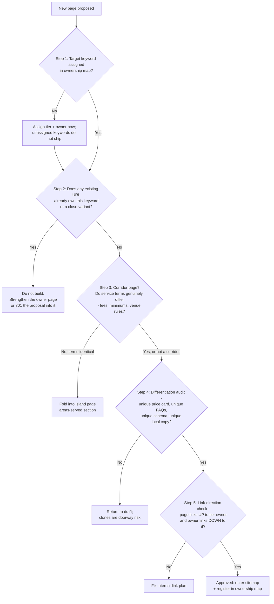

## 3. Keyword Universe and Demand Analysis

The keyword research delivers one governing conclusion: demand for private-chef services in Hawaiʻi is real, geographically segmented, and already mapped by competitors into exactly the three-tier structure this rebuild adopts — statewide hub, four island properties, selective resort-area pages. Google's "People also search for" confirms independent demand at island level (Honolulu, Oʻahu, Big Island, Kona, Hilo) and resort-area level (Wailea, Lahaina, Kāʻanapali) [^08-1^][^08-6^]; Take a Chef's twelve Hawaiʻi location pages and yhangry's state/county/city pages are third-party capital validating the tier model [^08-2^][^08-25^][^08-44^]. This chapter defines the keyword universe by island, classifies intent and seasonality, assembles the real-question bank behind the FAQ system, and codifies the ownership-and-cannibalization controls every Chapter 4 sitemap row must trace back to.

### 3.1 Statewide Keyword Universe

#### 3.1.1 Statewide head terms and decision queries with intent classification

Three findings shape the statewide tier. First, "private chef Hawaii" is a HIGH-demand term with confirmed independent demand beneath it — related searches on the statewide SERP surface *Private chef Honolulu, Personal chef Oahu, Private chef Big Island, Kona private chef, Private chef hilo*, and the Maui SERP surfaces *Wailea, Lahaina, Kaanapali* and even *Private sushi chef Maui* [^08-1^][^08-6^]. Second, cost intent is the strongest informational thread in the state: the cost SERP carries an AI Overview, map pack, and PAA box simultaneously, and three competitors target it with dedicated blog content [^08-14^][^08-15^][^08-16^][^08-17^]. Third, vacation-rental intent ("chef for vacation rental Hawaii") is the fastest-growing commercial cluster and is ceded to rental-company concierge pages — no chef company ranks for it with a dedicated page [^08-18^][^08-20^].

| Keyword family | Representative variants observed | Intent class | Demand (ESTIMATED) | Key evidence |
|---|---|---|---|---|
| **private chef Hawaii** | + Honolulu, Oahu, Maui, Kauai, Big Island, Kona, Hilo + resort areas (Wailea, Lahaina, Kaanapali, Waikiki, Ko Olina, Princeville, Poipu…) | Commercial / decision | **HIGH** (statewide + every island) | Map pack + PAA + AI Overview; PASF surfaces island and resort-area variants; Take a Chef runs 12 HI location pages [^08-1^][^08-2^][^08-3^] |
| **personal chef Hawaii** | personal chef Oahu / Honolulu / Maui / Kailua-Kona | Commercial | **MEDIUM-HIGH** | PASF presence; Yelp county listicles rank; PAA asks the private-vs-personal difference — distinct intent, same owner page [^08-1^][^08-6^][^08-7^] |
| **Hawaii private chef cost / prices / how much** | per-island cost variants | Commercial-investigation | **HIGH** | AI Overview + map pack + PAA; recurring PAA cost questions; three competitor cost blogs rank [^08-14^][^08-15^][^08-16^][^08-17^] |
| **wedding catering Hawaii** | per-island variants; Kauaʻi estate-wedding queries | Commercial | **HIGH** | AI Overview + PAA on wedding-cost SERP; WeddingWire lists 49 HI caterers [^08-12^][^08-11^] |
| **catering Hawaii** | + county variants (e.g., "Kauai County catering") | Commercial, diffuse | **HIGH but diffuse** | Mixed SERP (caterers, venues, food trucks); yhangry county pages; The Knot/WeddingWire marketplaces [^08-8^][^08-9^][^08-10^] |
| **chef for vacation rental Hawaii** | private chef for vacation rental, Airbnb chef Hawaii/Oahu, villa chef Hawaii | Commercial, fast-growing | **MEDIUM-HIGH** | AI Overview on the exact query ($110–171/person synthesis); Airbnb "Chefs" category with Honolulu inventory; concierge pages rank [^08-18^][^08-19^][^08-20^] |
| **villa / estate / stay chef Hawaii** | estate chef, vacation chef, stay chef | Commercial, niche high-value | **LOW-EMERGING** | myCHEF already targets "villa chef Hawaii"; luxury-rental blogs use the framing; weaker direct evidence [^08-21^][^08-22^] |
| **private chef vs restaurant / is it cheaper** | private chef vs restaurant Hawaii | Decision / comparison | **MEDIUM** | Competitor content argues the comparison directly; marketplace FAQs answer it [^08-3^][^08-23^] |
| **is a private chef worth it / how does it work** | what to expect | Decision / evaluation | **MEDIUM** | Marketplace "worthwhile investment" sections; recurring Reddit threads; PAA-style FAQs [^08-25^][^08-27^] |
| **private chef tipping Hawaii** | how much to tip, gratuity included? | Post-decision logistics | **LOW-MEDIUM** | Dedicated etiquette guides rank; tipping recurs in PAA [^08-29^][^08-32^] |
| **how far in advance to book** | booking lead time per island | Pre-booking logistics | **MEDIUM** | myCHEF journal page exists on exactly this; competitor FAQs answer 2–4 weeks standard [^08-33^][^08-34^][^08-37^] |
| **private chef meal prep / weekly Hawaii** | weekly meal prep chef | Commercial, resident | **LOW-MEDIUM** | Weekly-prep operators exist on Oʻahu; Reddit request threads [^08-38^][^08-39^] |
| **private sushi chef Maui / Hawaii** | omakase at home | Specialty-cuisine modifier | **LOW-EMERGING** | Appears verbatim in Maui PASF — a specialty-modifier opening [^08-6^] |

Every HIGH-demand statewide term already has a crowded SERP, but the *page types* that win are remarkably consistent — marketplace location pages and cost-answering blog posts, with cost content dominated by a single competitor blog operation [^08-15^][^08-16^]. The hub's job is therefore not to out-shout marketplaces on head terms but to own the cost-and-logistics question layer with published prices, the one asset a chef-bid marketplace cannot replicate. Note also the two intent outliers: "catering Hawaii" is HIGH but diffuse (its SERP mixes caterers, venues, and food trucks, so the hub catering page must define its staffed-villa format precisely to avoid competing for the wrong query), and the decision-query rows (vs-restaurant, worth-it, tipping) convert best as sections within money pages rather than standalone posts. The MEDIUM and LOW-EMERGING rows (vacation-rental chef, villa/stay chef, sushi modifier) are where new pages rank fastest, because incumbent coverage is thin concierge copy or forum threads [^08-18^][^08-20^][^08-8^].

#### 3.1.2 Demand-estimation method and confidence labeling (no fabricated volumes)

No keyword-volume tool was available for this engagement, so this chapter — and the entire report — publishes **no search-volume numbers**. Every demand label is an **ESTIMATED** tier (HIGH / MEDIUM-HIGH / MEDIUM / LOW-EMERGING) triangulated from four observable signals:

1. **SERP-feature presence.** A query triggering a map pack, People-also-ask box, AI Overview, or "Discussions and forums" unit demonstrates enough volume for Google to invest features. Live SERP inspections (2026-09-06) found map packs on every "private chef + geo" query and PAA boxes on every query inspected [^08-1^][^08-14^].
2. **Marketplace category-page investment.** Take a Chef's twelve Hawaiʻi location pages and yhangry's state/county/city stack are paid-for evidence of where booking demand exists; companies do not build programmatic pages for zero-demand geographies [^08-2^][^08-25^][^08-43^].
3. **Competitor targeting.** A dedicated ranking page (e.g., Chef David Paul's anniversary-dinner subpage on Oʻahu, Jason Raffin's pricing posts on Maui) is proof a term converts [^03-25^][^08-15^].
4. **Visitor-volume triangulation.** Island demand ceilings anchor to verified DBEDT CY2025 arrivals — Oʻahu 5,679,047 [^03-49^]; Maui 2,516,163 [^07-51^][^04-48^]; Kauaʻi 1,419,943 [^05-32^]; Hawaiʻi Island 1,752,589 [^07-51^] — and to platform activity stats (Take a Chef's 10,447 Big Island guests since 2018) as booking proxies [^06-7^]. Island arrival counts must never be summed — DBEDT counts inter-island travelers on each island.

Two contamination rules apply throughout. Any volume figure traceable to the current site's leaked SEO annotations ("(90)", "(720)", "(210)", "(260)") is self-referential and **never used as demand data** [^01-13^][^01-15^]. Marketplace-published statistics are platform claims, not market data: yhangry's "$817 average / 17 chefs" and MiumMium's "$50.65" are boilerplate reused across geographies, and Take a Chef's statewide page reuses its Maui numbers — only its four island pages are citable as island-level data [^08-25^][^08-61^][^08-3^].

---

### 3.2 Island Keyword Universes

Each island universe is organized into the six cluster types Chapter 4's sitemaps must map one-to-one onto: service, location, cuisine, occasion, pricing, informational. The universes are not symmetrical — Oʻahu is the metropolitan year-round market, Maui the destination-wedding engine, Kauaʻi the retreat-and-estate market, the Big Island a dual-hub island with a term duality. Demand tiers remain ESTIMATED per §3.1.2.

#### 3.2.1 Oʻahu clusters (service, location, cuisine, occasion, pricing, informational)

Oʻahu's universe is the broadest in the state and the only one with a real corporate/B2B layer and a non-English opportunity. With 5.68M CY2025 visitors and a low 37% lodging seasonality index, demand is effectively year-round — copy should never imply an "off-season" [^03-49^][^03-51^].

| Cluster | Representative keywords | Demand (ESTIMATED) | Evidence / whitespace note |
|---|---|---|---|
| Core service | private chef Oahu · private chef Honolulu · personal chef Honolulu/Oahu · private chef Waikiki · hire a chef Oahu · in-home chef Honolulu | **HIGH** | All five marketplaces maintain Oʻahu/Honolulu pages; dense local pack [^03-5^][^03-13^] |
| Vacation-rental / villa | chef for vacation rental Oahu · Airbnb private chef Oahu · villa chef Oahu | **MEDIUM** | Airbnb Services "Chefs in Honolulu" category live; concierge guides target the intent [^03-2^][^08-19^] |
| Pricing / intent | private chef Oahu cost · how much does a private chef cost in Honolulu · wedding catering cost Oahu | **MEDIUM-HIGH** | Only marketplaces and Thumbtack answer these; zero local-operator cost content — myCHEF's published card is the wedge [^03-14^] |
| Occasion / service-type | anniversary dinner chef Honolulu · birthday/bachelorette chef · private hibachi · omakase at home · yacht chef · weekly meal prep | **MEDIUM** | Chef David Paul ranks with a dedicated anniversary-dinner subpage — proof occasion subpages work [^03-25^] |
| Event / corporate (B2B) | catering Honolulu · corporate catering Honolulu · office catering · event catering Oahu · wedding catering Oahu | **MEDIUM-HIGH** | Directory-saturated (20+ vendors); Convention Center renovation displaces citywides into private venues through 2027 [^03-30^][^03-67^] |
| Location-modified | Kahala · Waikīkī · Ko Olina/Kapolei · Kailua/Lanikai · North Shore/Haleiwa/Turtle Bay · Hawaiʻi Kai | **MEDIUM per area, HIGH combined** | Take a Chef covers Honolulu/Waikiki/Kailua with localized pricing; **nobody covers Kahala, Ko Olina, North Shore, Hawaiʻi Kai** — myCHEF already owns two of these [^03-20^][^03-44^][^03-45^] |
| Japanese-language | ハワイ プライベートシェフ · オアフ 出張シェフ | **MEDIUM, underserved** | ≈693k Japanese visitors to Oʻahu (2024, aggregator); ESPACIO sells in-suite kaiseki via concierge; **zero JA-language competitors** [^03-47^][^03-48^] |

The outlier is the location cluster: Oʻahu's short-term-rental ordinance (22-7) confines legal transient rentals largely to Waikīkī and Ko Olina, concentrating *visitor* chef demand in those zones while Kahala/Kailua/North Shore demand skews to 30-day luxury renters and residents — two intents requiring two page messages (vacation dinner vs. weekly household service) [^03-51^][^03-45^]. The Japanese-language cluster is an open goal but rests on single-dimension evidence, so it stays Oʻahu-scoped and sequenced after the English core. For the sitemap, Oʻahu supports six dedicated location pages (Waikīkī, Kahala, Ko Olina, Kailua/Lanikai, North Shore/Turtle Bay, Hawaiʻi Kai) plus an occasion-subpage program; Kāneʻohe folds into the windward page, Kakaʻako/Downtown into Honolulu [^03-57^][^03-62^].

#### 3.2.2 Maui clusters with destination-wedding depth

Maui's universe is defined by one asymmetry: it hosts the state's #2 wedding market (4,659 weddings in 2021, DOH-derived; statewide 17,370 weddings / $927M in 2025) and nobody — caterer, chef, or marketplace — sells the wedding *week* as one product [^04-49^][^03-63^]. The keyword universe reflects that gap.

| Cluster | Representative keywords | Demand (ESTIMATED) | Evidence / whitespace note |
|---|---|---|---|
| Core service | private chef Maui · personal chef Maui | **HIGH / MEDIUM-HIGH** | Most contested term in the state; Raffin, Lotus, Kristin, Cozymeal, Take a Chef, Yelp all rank [^04-20^][^04-22^] |
| Pricing / informational | private chef Maui cost · how much is a private chef in Maui | **MEDIUM, winnable** | Answered almost exclusively by Raffin's blog + platforms — a published-rate cost hub can take the research-stage funnel [^04-9^][^04-10^] |
| Stay / week chef | chef for a week Maui · vacation chef · villa chef · stay chef | **LOW-MEDIUM, high ticket** | Near-zero dedicated pages; only Lotus ($179–$300+/pp/day) and myCHEF (from $1,050/day) price multi-day service [^04-5^][^04-45^] |
| Location-modified | Wailea · Kāʻanapali · Kapalua · Makena · Kīhei · Nāpili–Honokōwai · Lahaina (sensitive) · Pāʻia/Haʻikū/Upcountry | **MEDIUM (Wailea), LOW each / MEDIUM combined (rest)** | Only Take a Chef's thin pages compete; PASF confirms Wailea, Lahaina, Kāʻanapali demand [^04-23^][^08-6^] |
| Wedding catering | wedding catering Maui · Maui wedding caterers · Maui wedding cost/packages | **HIGH** | Knot/WeddingWire dominate; caterers' own sites under-optimized [^04-24^][^04-51^] |
| **Wedding-week formats** | rehearsal dinner Maui · welcome dinner Maui · recovery brunch / day-after brunch Maui | **LOW-MEDIUM each, near-zero competition** | The whitespace core: CJ's bundles welcome BBQ + reception + brunch; Ritz-Carlton Kapalua markets wedding weekends; **no competitor contracts the week** [^04-30^][^04-92^][^04-44^] |
| Elopement / micro-wedding | Maui elopement · intimate wedding · micro wedding | **MEDIUM-HIGH** | Package ecosystem $3,100–$15,000; DLNR beach permits cap ceremonies at ~20 people, no structures — receptions migrate to estates/villas [^04-54^][^04-53^] |
| Venue-modified | Olowalu Plantation House · Haiku Mill · Kukahiko Estate · Makena Cove wedding | **LOW-MEDIUM each, HIGH combined** | Photographer blogs dominate; estate venues gate access via approved planners [^04-82^][^04-86^] |
| Cuisine / format | Maui catering · BBQ catering · private sushi chef / omakase · luau catering · grazing/high tea · retreat catering · meal prep | **MEDIUM-HIGH (general) to LOW (niches)** | "Private sushi chef Maui" surfaces in PASF; retreat niche owned solely by Lotus with no multi-day pricing [^08-6^][^04-3^] |

Two Maui-specific cautions govern page construction. Lahaina remains a high-volume legacy search term, but the town is largely closed to tourism and demand has shifted north to Kāʻanapali–Kapalua; its page must be a sensitive informational/legacy page routing demand to the West Maui corridors, never marketing Lahaina town as a dining destination [^04-58^][^04-44^]. And the wedding-week cluster is not one page but a page family — welcome dinner, rehearsal, reception, recovery brunch as per-format child pages, each facing near-zero dedicated competition and collectively expressing the multi-meal pattern documented at CJ's, Ritz-Carlton Kapalua, Lotus, and Raffin [^04-30^][^04-92^][^04-95^]. Sourced catering economics ($80–$200/pp bands; $200–$300/pp private reception dinners) give these pages concrete cost content competitors won't publish [^04-52^][^04-81^].

#### 3.2.3 Kauaʻi clusters with retreat/estate emphasis

Kauaʻi is the smallest visitor market (1.42M arrivals CY2025) but pairs the second-highest daily spend ($281.30) with the longest stays (7.33 days) — economics favoring multi-day chef engagements over single dinners [^05-32^]. Its universe holds the state's clearest zero-competition whitespace.

| Cluster | Representative keywords | Demand (ESTIMATED) | Evidence / whitespace note |
|---|---|---|---|
| Core service | private chef Kauai · personal chef Kauai | **HIGH / MEDIUM** | Marketplaces + 6+ locals compete; Take a Chef ~6,890 guests served since 2018 at ~$176/pp avg [^05-20^] |
| Pricing / informational | private chef Kauai cost / prices / how much | **MEDIUM, unserved** | Only one local (Dani Felix hourly $125–$150) plus marketplaces publish anything — content gap [^05-1^][^05-20^] |
| Vacation / multi-day | chef for vacation rental Kauai · in-villa chef · vacation chef · weekly chef · stay chef | **LOW-MEDIUM, high ticket** | Zero Kauaʻi operators publish multi-day pricing; myCHEF's "Stay Chef from $1,100/day" is the only published daily rate in-market [^05-16^] |
| Location — North Shore | private chef Princeville · Hanalei · Kīlauea · Hāʻena | **MEDIUM** | yhangry + Take a Chef hold Princeville/Hanalei pages; estate stock (Secret Cove $3,750–$8,250/night) anchors value [^05-24^][^05-29^] |
| Location — South / East | private chef Poipu · Koloa · Kapaa · Lihue | **MEDIUM (Poʻipū), LOW (rest)** | Take a Chef's Poipu page is its busiest Kauaʻi sub-page; one combined East Side page suffices [^05-21^] |
| Catering & weddings | catering Kauai · wedding catering Kauai · Kauai estate wedding · elopement / rehearsal dinner Kauai | **MEDIUM-HIGH** | 2,072 Kauaʻi weddings in 2025 ($107.2M; avg $51,719 — Wedding Report); estate-catering benchmark $75/pp [^05-33^][^05-34^] |
| **Retreat & group** | retreat catering Kauai · wellness/yoga retreat catering · corporate retreat Kauai · retreat chef | **LOW volume, zero competition** | "Retreat catering Kauai" returned **zero dedicated SERP results**; retreat supply is real ($2,000–$4,499 tickets; hosts already hire private chefs) [^05-35^][^05-36^] |
| Adjacent / experience | Kauai cooking class private · grocery stocking / villa pre-stocking · luau catering / private luau | **LOW-MEDIUM** | Stocking offered by Kauai Private Chef + Poipu Kapili concierge; private luau appears inside retreat packages [^05-2^][^05-27^] |

The retreat cluster inverts the usual demand logic: volume is low, competition is literally absent, and the buyer is a B2B host who re-books repeatedly. Adjacent retreat queries ("yoga retreat Kauai", bookretreats-dominated) carry far higher volume, which a "catering for retreats" page intercepts at the planning stage [^05-35^][^05-47^]. The North Shore logistics layer — recurring Hanalei bridge and Kūhiō Highway closures no competitor addresses — is trust content myCHEF's 72-hour-notice weather clause already owns [^05-40^][^05-41^][^05-16^]. Sitemap discipline: Princeville, Hanalei, Poʻipū, a combined Kapaʻa/Līhuʻe East Side page, and a retreat-catering page are justified; **west-side standalone pages (Waimea, Hanapēpē, Kalāheo, ʻEleʻele) are not** — Chapter 4 should fold them [^05-16^][^01-2^].

#### 3.2.4 Big Island clusters with dual-hub (Kona-Kohala/Hilo) structure

The Big Island requires a structural decision before any keyword list: it is two markets — the Kona–Kohala resort/villa west side and the resident Hilo east side, 2.5–3 hours apart by road — and PASF confirms both hubs surface independently ("Kona private chef", "Private chef hilo") [^08-1^]. Layered over this is the term duality: visitors search **"Big Island"** while "Hawaiʻi Island" is the official/DBEDT usage, and competitors split inconsistently [^06-7^][^06-18^]. The rule: "Big Island" primary in titles/H1s, "Hawaiʻi Island" in body copy, alt text, and FAQs — capturing both without stuffing.

| Cluster | Representative keywords | Demand (ESTIMATED) | Evidence / whitespace note |
|---|---|---|---|
| Core service — west | private chef Kona · Kailua-Kona · Big Island · personal chef Kona | **HIGH (Kona head term)** | Kailua-Kona is the visitor/STR hub; densest competitor set; Take a Chef 10,447 guests, ~$176/pp avg [^06-7^][^06-26^] |
| Core service — luxury coast | private chef Kohala Coast · Waikoloa · Mauna Lani · Mauna Kea · Hapuna · Puako | **HIGH (Kohala), MEDIUM (resorts)** | Rio Chef titles pages "Kohala Coast" and names Hualālai/Kukio/Mauna Kea/Kohanaiki; highest-value villa zone in the state [^06-3^][^06-2^] |
| Gated communities | private chef Hualālai · Kukio · Kohanaiki | **LOW volume, extreme value** | Access-gated; demand flows via estate managers/concierge, not search — a section within the Kohala page [^06-27^] |
| Core service — east | private chef Hilo · catering Hilo · private chef Volcano · retreat catering east side | **MEDIUM catering / LOW chef** | Exactly one premium chef-caterer (HeartBeet) east-side; west-side chefs won't quote it — SERP can be owned outright [^06-21^][^06-28^] |
| Catering & weddings | catering Kona · Kona wedding catering · luau catering Big Island · imu catering Kona | **HIGH (catering Kona), MEDIUM (luau)** | Two wedding economies: captive resort F&B (minimums $7,500–$15,000, 25% service) vs the independent circuit [^06-35^][^06-36^] |
| Pricing / informational | private chef Big Island cost · how far in advance to book · private chef vs restaurant Kona | **MEDIUM** | Rio's FAQ post ranks; myCHEF's journal already owns the lead-time answer [^06-4^][^08-33^] |
| Vacation-rental / concierge | Kona vacation rental chef · Airbnb private chef Kona · VRBO chef Big Island | **MEDIUM** | Concierge channel: rental managers bundle "Personal Chef Package" (Kona Sunsets); Epicurate lists chefs [^06-29^][^06-5^] |
| Adjacent | meal prep chef Kona · grocery stocking · cooking class Kona · farm-to-table catering · Kona coffee farm dinner | **LOW-MEDIUM** | Provenance vocabulary (Parker Ranch beef, Hamakua chocolate, Kona Cold lobster) is Rio's storytelling lane — matchable [^06-3^][^06-23^] |

The dual-hub structure is also the pricing story: no competitor publishes island-wide travel fees, while myCHEF publishes a "from $75" travel-zone line and quotes the east side separately — turning a geographic liability into trust content and capturing "private chef Hilo/Volcano" queries west-side chefs abandon [^06-24^]. The Kohala Coast page is the flagship: it absorbs the gated-community queries (Hualālai, Kukio, Kohanaiki) as a section, since that demand arrives via estate managers and concierge referrals, not public search [^06-27^]. The east-side cluster is the inverse bet — low volume, one premium competitor, an ownable SERP, and cheap authority that also proves the dual-hub architecture to Google. The event calendar (Ironman October, whale season Dec–Apr, Merrie Monarch in Hilo) feeds the CTA rotation in §3.3.2 [^06-49^][^08-52^].

The chart counts the keyword groups tabulated in §3.2.1–3.2.4 by their ESTIMATED demand tier — it visualizes this chapter's research structure, not market volumes. Three patterns matter. HIGH-tier groups concentrate where competition is most entrenched (Oʻahu core service, Maui weddings, Big Island west side), so those battles are won on pricing transparency and reviews, not content novelty. The LOW/EMERGING bar is largest where whitespace lives — Maui wedding-week formats, Kauaʻi retreat catering, Big Island east side — the cheap, fast rankings that build early authority. And every island has at least one HIGH-tier anchor cluster, validating all four subdomains as full properties rather than folds into the hub.

---

### 3.3 Intent, Seasonality and FAQ Demand

#### 3.3.1 Commercial-intent tiers and user-stage mapping

The SERP evidence sorts the universe into four intent tiers, each mapping to a user stage and a canonical page type. The practical rule: a page's job is set by its tier — money pages convert, cost pages persuade, logistics pages reassure — and a page that tries to do all three does none.

| Intent tier | User stage | Example queries (from §3.1–3.2) | Winning page type observed | myCHEF owner page type |
|---|---|---|---|---|
| **Transactional** | Ready to inquire | private chef Maui · private chef Kona · wedding catering Kauai · private chef Wailea | Marketplace location pages; local homepages with map-pack presence [^08-1^][^08-6^] | Island homepages + corridor location pages with price-in-title |
| **Commercial-investigation** | Comparing options / budgeting | Hawaii private chef cost · private chef vs restaurant · is a private chef worth it | Cost blog posts (Raffin ×2 on Maui); marketplace FAQ blocks; AI Overview synthesizes $100–250/person [^08-14^][^08-15^][^08-16^] | One canonical cost page per level (hub + per island) with published rates; blog posts link up |
| **Logistics / reassurance** | Shortlisted, checking fit | kitchen requirements · groceries included · tipping · how far in advance · dietary | FAQ accordions (Take a Chef template), etiquette guides, journal answers [^08-27^][^08-29^][^08-34^] | FAQ system fed by the §3.3.3 question bank + journal long-form answers |
| **Inspiration / adjacent** | Planning the trip | yoga retreat Kauai · beach wedding permit Maui · Airbnb vs hotel Hawaii | Planner blogs, retreat marketplaces, permit guides [^05-35^][^04-53^] | Editorial/journal content that intercepts planners before vendor selection |

The tier map exposes where the market is weakest: transactional SERPs are contested, but the investigation and logistics tiers are served mostly by marketplaces (impersonal, range-only pricing) and one competitor blog. That is why §3.4 assigns cost queries a canonical page per level rather than scattering them across blogs — the investigation tier is where published rate cards convert research-stage traffic marketplaces structurally cannot close [^08-14^][^08-25^]. It also frames the map-pack reality: on transactional queries Google Business Profile review count is the dominant visible lever (Jason Raffin 534 reviews at 5.0; Finca Makaleha 100; Chef Coco 22), so organic page quality alone will not win tier-1 queries without a review-acquisition program [^08-1^][^08-6^][^08-7^].

#### 3.3.2 Seasonal booking patterns per island (sourced)

Seasonality is island-asymmetric; a single statewide calendar would mistime every campaign. Statewide travel peaks in June–July and December, but chef-booking demand has its own, more specific rhythm [^08-51^].

| Island | Peak booking windows | Event / demand anchors | Documented lead times | Editorial implication |
|---|---|---|---|---|
| **Statewide** | Dec–Mar (holidays + whale season Dec–May, peak Jan–Mar) | Christmas/NY villa-chef evidence (Wailea stay 12/22–1/1 requesting chef + meal prep); holiday surcharges are market practice; whale season lifts villa occupancy [^08-39^][^08-54^][^08-52^] | Luxury winter-holiday bookings recommended 9–12 months ahead [^08-37^] | Front-load Dec–Mar villa content by Sep–Oct |
| **Oʻahu** | Effectively year-round (37% seasonality index; Jul + Mar strongest, Sep/Nov softest) | Wedding peaks May/Jul/Oct; Valentine's/Mother's Day spikes noted by Take a Chef [^03-51^][^03-64^][^08-3^] | Standard 2–4 weeks | No seasonal copy; rotate occasion content (graduation May–Jun, holidays) |
| **Maui** | Chef peak season Dec–Apr; wedding vendor peaks Jun–Aug + Dec holidays | Wedding shoulders Apr–Jun and Sep–Nov favored by planners; leeward Wailea/Kāʻanapali stay dry in winter [^08-56^][^04-97^] | 2–4 weeks peak, 1–2 off-peak; resort Saturdays book 12–18 months out [^04-10b^][^08-57^] | Wedding-week content published 12+ months ahead of peak dates |
| **Kauaʻi** | North Shore peaks Jun–Sep + holidays; South Shore carries Nov–Mar (two-shore inversion) | Winter North Shore rain/surf and closures — but whale season and full waterfalls; Dec is peak ADR (~$490 vs ~$384–392 fall) [^05-44^][^05-68^] | Boutique venues book 18–24 months; Hāʻena requires 72-hour notice + weather clause [^08-57^][^05-16^] | Two-shore coverage smooths revenue; bridge-clause content surfaces Nov–Mar |
| **Big Island** | Dec–Mar first-fill window; wedding peaks Sep/Oct/May move first | Ironman Kona (Oct) compresses access; Merrie Monarch lifts Hilo in spring; whale season Dec–Apr [^08-33^][^08-52^][^06-49^] | 3–6 months ahead for winter/holidays per estate-concierge guidance [^06-6^] | Ironman-week and Merrie Monarch landing/CTA rotation |

The asymmetry is the point: Kauaʻi's two-shore inversion and the Big Island's dual-hub split mean demand never stops — it moves. The lead-time column is the actionable half of the table: a 9–12-month luxury-holiday window and 12–18-month resort-Saturday window mean the *content* must exist long before the booking conversation starts, which inverts the usual publish-and-promote sequence [^08-37^][^08-57^]. The rebuild therefore needs a per-island editorial/CTA calendar in the CMS, not a statewide one: holiday and Christmas/NY villa content ships by early Q4; wedding-week content runs 12+ months ahead of May/Sep/Oct peaks; Kauaʻi messaging flips by shore and season; Big Island pages rotate Ironman and Merrie Monarch hooks [^08-33^]. myCHEF's journal already documents the first-fill logic ("December–March and wedding peaks (September, October, May) move first") — promote it from stub to visible booking-urgency asset [^08-33^].

#### 3.3.3 Real-question bank (PAA/Reddit/forums) driving the FAQ system

The FAQ system is mined, not invented: 61 verbatim questions collected from Google People-also-ask boxes, Reddit (r/MauiVisitors, r/kauai, r/BigIsland, r/Hawaii, r/VisitingHawaii, r/Honolulu), Facebook groups, and competitor FAQ pages. Two PAA anchors recur on nearly every SERP — cost ("How much is a private chef in Hawaii?") and the private-vs-personal distinction — making them mandatory FAQ entries at every site level [^08-1^][^08-14^][^08-6^]. The full bank lives in the research appendix; the themed structure below is the FAQ information architecture.

| # | Theme | Questions | Representative verbatim question | Dominant source |
|---|---|---|---|---|
| 1 | Cost & pricing | 11 | "How much is a private chef in Hawaii?" | SERP/PAA + Facebook [^08-1^][^08-12^] |
| 2 | Booking process & lead time | 7 | "How far in advance should I book a private chef on Maui?" | Competitor FAQs + Reddit [^08-34^][^08-46^] |
| 3 | Kitchen requirements & logistics | 6 | "What if my rental kitchen is small?" | Competitor FAQs [^08-35^][^08-47^] |
| 4 | Groceries & what's included | 7 | "Do private chefs in Maui handle grocery shopping and cleanup?" | Competitor FAQs [^08-36^][^08-27^] |
| 5 | Staffing & group size | 5 | "Is there a maximum number of guests for a private chef service?" (parties typically ≤15) | Marketplace FAQ + Reddit [^08-27^][^08-46^] |
| 6 | Alcohol & bar | 3 | "Can you provide alcohol or wine pairings?" | Competitor FAQs [^08-34^][^08-35^] |
| 7 | Tipping & service charges | 5 | "How much do you tip a private chef?" (15–20%, up to 25% exceptional) | Etiquette guides + marketplace blog [^08-29^][^08-32^] |
| 8 | Dietary & allergies | 3 | "Can a private chef accommodate severe allergies or strict dietary protocols (keto, vegan)?" | Competitor FAQs [^08-34^][^08-45^] |
| 9 | Weddings & events | 3 | "…getting married in Maui in September and we are considering a private chef for our wedding night." | Reddit + PAA [^08-26^][^08-12^] |
| 10 | Vacation rentals & multi-day | 6 | "My family (10 people) are coming to Kauai and looking for a private chef to cook dinner at a house we are renting." | Reddit/Facebook + concierge FAQs [^08-7^][^08-39^][^08-46^] |
| 11 | Trust & comparison | 5 | "Is there a difference between a private chef and a personal chef?" | Recurring PAA [^08-1^][^08-18^] |

Three usage rules follow. First, themes 1–2 and 7 (cost, booking, tipping — 23 of 61 questions) are the conversion-critical layer and belong on money pages as FAQ accordions with FAQPage schema, matching the Take a Chef page anatomy that wins these SERPs (demand stats, price tables, AggregateRating + FoodService schema, FAQ accordions) [^08-2^][^08-27^]. Second, themes 3–5 and 10 (kitchens, groceries, staffing, multi-day logistics) are exactly what myCHEF's operational truth-telling answers best — kitchen qualification, groceries at cost with receipts, written staffing minimums — so they get long-form journal answers linked from the accordions, not one-liners [^08-45^]. Third, theme 11 resolves on-page: one definitional section per owner page captures the PAA instead of mirrored page sets (risk R3 below). One supply-side question ("How much should I charge as a private chef?") is excluded from the B2C FAQ system [^08-14^].

---

### 3.4 Keyword Ownership and Cannibalization Control

#### 3.4.1 Ownership map: every major keyword has ONE primary owner page

The ownership map is the law the Chapter 4 sitemaps obey. Its rule is absolute: **every major keyword has exactly one primary owner page across the five-property ecosystem, and every other page that touches the term links to the owner rather than competing with it.** The scheme is three-tiered, and it is not theoretical — it matches how Google segments these SERPs today (distinct map packs per island, PASF divergence by geography), how Take a Chef structures its own page stack, and how the live myCHEF estate already allocates ownership in copy ("Hub `/` owns private chef Hawaii… This home still owns private chef Oahu") [^08-1^][^08-6^][^08-2^][^01-8^][^01-15^].

| Tier | Owned keyword families | Owner page(s) | SERP rationale | Enforcement requirement |
|---|---|---|---|---|
| **Statewide hub** (mychef-hawaii.com) | private chef Hawaii · personal chef Hawaii · Hawaii private chef cost/prices · catering Hawaii · wedding catering Hawaii (hub) · tipping · private-vs-personal · how a private chef works · Hawaii vacation/villa chef | Hub homepage, hub /catering, hub /weddings, hub cost page, hub FAQ/journal | Statewide SERPs return mixed-island results and statewide marketplace pages [^08-1^][^08-14^] | Hub pages link *down* to island pages; hub never repeats island-specific pricing or copy |
| **Island** (4 subdomains) | private chef {Oahu/Maui/Kauai/Big Island} · Kona + Hilo variants · {island} cost · wedding catering {island} · {island} vacation chef · {island} retreat catering | Island homepages, island /weddings, island cost pages, island service pages | Distinct map packs per island; PASF confirms island-level terms surface independently (incl. Kona and Hilo) [^08-1^][^08-6^][^08-7^] | Unique price cards, unique FAQs, unique schema per island; no statewide copy reuse |
| **Resort-area / corridor** (selective) | Maui: Wailea · Kāʻanapali · Kapalua · Lahaina (sensitive) · Makena · Kīhei — Oʻahu: Waikīkī · Ko Olina · Kahala · Kailua/Lanikai · North Shore · Hawaiʻi Kai — Kauaʻi: Princeville · Hanalei · Poʻipū — Big Island: Kailua-Kona · Kohala Coast | One corridor page per justified area, on the island host only | PASF + marketplace pages confirm these resort-area demands [^08-6^][^08-40^][^08-41^][^08-42^][^08-43^] | Build only where service terms genuinely differ (travel fees, minimums, venue rules); otherwise "areas served" sections on the island page (Chef Kristin model) [^08-64^] |

The extract is deliberately short — these are the *decided* assignments. Hilo is PASF-visible but stays lower-priority (east side inquiry-stage) [^08-1^][^08-13^]; Kauaʻi west-side corridors and Maui's /haleakala-class pages fail the corridor test and are fold/prune candidates, because the live estate over-builds location pages relative to demand evidence [^01-2^][^05-16^]. The current site also enforces the rule the wrong way: its pages state ownership to users ("Private chef Oahu (90) stays on this host's home"), leaking annotations and unverified volume numbers into visible copy — the rebuild keeps the rule as an internal IA document and strips every annotation from rendered pages [^01-15^][^01-22^].

#### 3.4.2 Cannibalization risk register and pre-publication test protocol

Seven cannibalization risks are flagged for the rebuild. Each has a named failure mode and a standing mitigation; the register is a living document — every new page proposal is checked against it before entering the sitemap.

| # | Risk | Failure mode | Standing mitigation |
|---|---|---|---|
| R1 | **"private chef Hawaii" hub vs four island pages** | Island pages drift into statewide copy; hub and islands compete on the same SERP | Replicate Take a Chef's split: hub owns state intent and links down; island pages never repeat statewide copy; unique price cards/FAQs/schema per island. Enforce in QA, not in visible copy [^08-67^] |
| R2 | **"private chef Maui" vs Wailea/Kāʻanapali/Kapalua/Lahaina sub-pages** | Thin near-duplicate location pages (doorway risk) | Corridor pages only where service terms genuinely differ (e.g., North Shore Oʻahu surcharge, Kauaʻi far-north 72-hour clause); otherwise "areas served" sections on the island page [^08-21^][^08-13^][^08-64^] |
| R3 | **"private chef" vs "personal chef" mirrored page sets** | Two near-identical page families split authority | One URL set owning both terms, with a definitional section/FAQ capturing the recurring PAA [^08-1^] |
| R4 | **"catering" vs "wedding catering" vs "private chef" page-type collision** | Three different SERP compositions (caterers/marketplaces vs wedding marketplaces vs map-pack chefs) answered by one blurred page | Keep three distinct page types — staffed-event catering, wedding-week, private dinner — as the Kauaʻi host already does; extend statewide [^08-8^][^08-12^][^08-13^] |
| R5 | **Cost content duplication: hub pricing page vs island price cards vs cost blogs** | Multiple internal cost pages compete (Raffin ranks twice for Maui cost via two posts — an asset for him, a hazard if internal) | One canonical cost page per level; blog posts canonicalize/link up to the owner [^08-15^][^08-16^] |
| R6 | **Marketplace overlap on corridor pages** | myCHEF corridor pages out-templated by marketplace pages carrying AggregateRating + FoodService schema and thousands of reviews | Differentiate on what marketplaces cannot publish: fixed prices (not ranges), written-quote policy, GET/service-line transparency, island operational detail [^08-33^][^08-13^] |
| R7 | **Vacation-rental intent ceded to concierges** | "Private chef for vacation rental Hawaii" answered by concierge pages and AI Overviews; myCHEF absent | Dedicated statewide "vacation rental / villa chef" page + per-island equivalents; moderate competition, highest-LTV intent [^08-18^][^08-20^] |

The register's pattern is clear: risks R1–R5 are self-inflicted (internal duplication) and fully controllable; R6–R7 are competitive and answered by page-type differentiation, not volume. Two register entries deserve priority because the current estate already violates them. R2 is the live offender — the subdomains carry corridor pages (Kauaʻi's west side, Maui's /haleakala class) that fail the service-terms-differ test, so the rebuild's first cannibalization fix is subtraction, not addition [^01-2^][^05-16^]. R5 is the quiet one: with cost content planned at hub, island, and journal levels, the canonical-cost-page rule must be decided before any cost copy is written, or the rebuild reproduces Raffin's two-post overlap inside its own domain [^08-15^][^08-16^]. The control mechanism for all five self-inflicted risks is a pre-publication test every proposed page must pass before it enters any sitemap or CMS.

The five steps encode the register. Step 1 makes ownership a prerequisite — a page without a map assignment is an orphan by design. Step 2 is the literal cannibalization test: a keyword-and-variant lookup against the live ownership map, maintained as the internal successor to the annotations the current site leaks into copy [^01-15^]. Step 3 applies the R2 corridor rule with §3.2's evidence standard — marketplace page presence, PASF confirmation, or a genuine service-term difference. Step 4 enforces the R1/R5 uniqueness requirements (price card, FAQs, schema, local copy). Step 5 enforces link direction, because the hub-down / island-up structure tells Google which page owns which intent — the same signal Take a Chef's page stack sends [^08-2^]. A page that passes all five steps is registered in the map, making it self-maintaining: it grows only through the test, never around it.

Chapter 4 compiles this specification into sitemaps: every URL proposed there must cite its cluster from §3.2 and its owner tier from §3.4.1, and every corridor page must carry its Step-3 justification.

---

#### Sources

All sources accessed 2026-09-06. Indices are prefixed by research dimension file (`08` = dim08 statewide keyword/demand intelligence; `03`–`06` = island deep-dives; `07` = dim07 market/regulatory verification; `01` = existing-site audit); definitions are copied from those files' source lists.

[^08-1^] Google SERP "private chef hawaii" (map pack, PAA, PASF: Honolulu/Oahu/Hilo/Big Island/Kona; organic: Take a Chef, Yelp, Airbnb, privatedininghawaii.com, bigiprivatechef.com, theprivatechefhawaii.com, hawaiihideaways.com) — https://www.google.com/search?q=private+chef+hawaii (accessed 2026-09-06)
[^08-2^] Take a Chef — Honolulu County — https://www.takeachef.com/en-us/private-chef/honolulu-county (accessed 2026-09-06)
[^08-3^] Take a Chef — Kailua-Kona (+ /en-en variant with price table) — https://www.takeachef.com/en-us/private-chef/kailua-kona (accessed 2026-09-06)
[^08-6^] Google SERP "private chef maui" (map pack; PASF: Maui cost, Wailea, Lahaina, Kaanapali, sushi chef; organic: privatemauichef.com, Yelp, alohapartychef.com, jasonraffin.com, lotuschefs.com, aprivatechefmaui.com, Take a Chef, Reddit r/MauiVisitors) — https://www.google.com/search?q=private+chef+maui (accessed 2026-09-06)
[^08-7^] Google SERP "private chef kauai" (map pack; Facebook "Everything Kauai" thread; Take a Chef Kauai pricing; Yelp; privatechefkauai.com) — https://www.google.com/search?q=private+chef+kauai (accessed 2026-09-06)
[^08-8^] Web search "catering Hawaii" — hawaiivendors.com blog, roaminghunger.com/hawaii/food-truck-catering, himalayankitchenhawaii.com/catering, myhighwayinn.com/catering (SERP inspection)
[^08-9^] yhangry — Kauai County catering — https://yhangry.com/f/catering/us-hawaii-kauai--county/ (accessed 2026-09-06)
[^08-10^] The Knot — Catering in Oahu, HI — https://www.theknot.com/marketplace/catering-oahu-hi (accessed 2026-09-06)
[^08-11^] WeddingWire — Best Wedding Caterers in Hawaii — https://www.weddingwire.com/c/hi-hawaii/wedding-caterers/3-sca.html (accessed 2026-09-06)
[^08-12^] Google SERP "wedding catering hawaii cost" (AI Overview pricing tiers; PAA; Facebook 175-guest budget thread; The Knot; 1979hawaii.com; acateredexperience.com) — https://www.google.com/search?q=wedding+catering+hawaii+cost (accessed 2026-09-06)
[^08-13^] myCHEF Kauai — Weddings — https://kauai.mychef-hawaii.com/weddings (accessed 2026-09-06)
[^08-14^] Google SERP "private chef hawaii cost" (AI Overview; map pack; PAA; related searches; Facebook under-$60 thread; organic: Chef Kristin, Take a Chef, Jason Raffin, yhangry, Lotus Chefs, Yelp) — https://www.google.com/search?q=private+chef+hawaii+cost (accessed 2026-09-06)
[^08-15^] Jason Raffin — Private Chef Pricing Maui — https://www.jasonraffin.com/post/breaking-down-the-cost-of-a-private-chef-in-maui-private-chef-pricing-maui (accessed 2026-09-06)
[^08-16^] Jason Raffin — How Much Does a Private Chef Cost? (via SERP) — https://www.jasonraffin.com/post/how-much-does-a-private-chef-cost (accessed 2026-09-06)
[^08-17^] Lotus Chefs — Family Vacation Private Chef Services on Maui (via SERP) — https://lotuschefs.com/family-friendly-private-chef-maui (accessed 2026-09-06)
[^08-18^] Google SERP "private chef for vacation rental hawaii" (AI Overview $110–171; organic: parrishkauai.com, exceptionalvillas.com, evrhi.com, aliiresorts.com) — https://www.google.com/search?q=private+chef+for+vacation+rental+hawaii (accessed 2026-09-06)
[^08-19^] Airbnb — Chefs in Honolulu and https://www.airbnb.com/services/6284002 — https://www.airbnb.ca/honolulu-hi/services/chefs (accessed 2026-09-06)
[^08-20^] Parrish Collection Kauai — Private Chefs ; Ali'i Resorts — https://www.aliiresorts.com/maui-vacation-private-chef/ — https://www.parrishkauai.com/private-chefs/ (accessed 2026-09-06)
[^08-21^] myCHEF Hawaii — homepage — https://mychef-hawaii.com/ (accessed 2026-09-06)
[^08-22^] The Kanini Estate — villa chef guides and /the-best-private-chefs-for-an-elite-luxury-villa-experience/ — https://www.thekaniniestate.com/top-big-island-luxury-rentals-with-private-chef-services/ (accessed 2026-09-06)
[^08-23^] CookinGenie — Private Chef Cost blog — https://cookingenie.com/content/blog/hiring-a-personal-chef-what-to-expect-in-terms-of-cost/ (accessed 2026-09-06)
[^08-25^] yhangry — Find a Private Chef in Hawaii — https://yhangry.com/f/private-chefs/us-hawaii/ (accessed 2026-09-06)
[^08-26^] Google SERP '"Personal Chef + Housekeeper for a week vacation in Maui" reddit' (r/MauiVisitors threads; AI Overview synthesis; r/WouldYouRather; Facebook Maui Travelers Guide) — https://www.google.com/search?q=%22Personal+Chef+%2B+Housekeeper+for+a+week+vacation+in+Maui%22+reddit (accessed 2026-09-06)
[^08-27^] Take a Chef — Poipu (FAQ "What does a private chef service include") ; Waikiki — https://www.takeachef.com/en-us/private-chef/waikiki — https://www.takeachef.com/en-us/private-chef/poipu (accessed 2026-09-06)
[^08-29^] Take a Chef blog — How much do you tip a private chef? — https://www.takeachef.com/blog/en/how-much-do-you-tip-private-chef (accessed 2026-09-06)
[^08-32^] Privatechef.pt — Tipping etiquette 2026 — https://privatechef.pt/blog/tipping-etiquette-private-chef.html (accessed 2026-09-06)
[^08-33^] myCHEF Big Island journal — How far ahead to book — https://bigisland.mychef-hawaii.com/journal/how-far-ahead-to-book (accessed 2026-09-06)
[^08-34^] Aloha Party Chef — Maui Private Chef FAQ — https://alohapartychef.com/faqs-private-chef-maui (accessed 2026-09-06)
[^08-35^] Marrow Private Chefs — 30A guide (booking lead-time FAQ) — https://marrowprivatechefs.com/private-chef-30a-guide (accessed 2026-09-06)
[^08-36^] Jason Raffin — Private Chef Maui: A Vacation Game-Changer (FAQ) — https://www.jasonraffin.com/post/private-chef-maui (accessed 2026-09-06)
[^08-37^] Mauna Kea Residences — How far in advance to book a Hawaii vacation — https://maunakearesidences.com/insights/useful-info/how-far-in-advance-should-you-book-a-hawaii-vacation/ (accessed 2026-09-06)
[^08-38^] Eat Plants Elevate — Oahu plant-based personal chef — https://www.eatplantselevate.com/ (accessed 2026-09-06)
[^08-39^] Reddit r/MauiVisitors — "Private chef and meal prep service" (Wailea 12/22–1/1) — via Google SERP, see [^08-26^]
[^08-40^] Take a Chef — Ko Olina — https://www.takeachef.com/en-us/private-chef/ko-olina (accessed 2026-09-06)
[^08-41^] Take a Chef — Lahaina — https://www.takeachef.com/en-us/private-chef/lahaina (accessed 2026-09-06)
[^08-42^] Take a Chef — Kapalua — https://www.takeachef.com/en-us/private-chef/kapalua (accessed 2026-09-06)
[^08-43^] Take a Chef — Princeville — https://www.takeachef.com/en-us/private-chef/princeville (accessed 2026-09-06)
[^08-44^] yhangry — Princeville private chef — https://yhangry.com/f/private-chefs/us-hawaii-kauai--county-princeville/ (accessed 2026-09-06)
[^08-45^] Luxury Vacation Stays — Cost of a private chef for a vacation rental (FAQ) and /how-to-hire-a-private-chef-for-a-vacation-week-the-2026-connoisseurs-guide/ — https://luxuryvacationstays.com/the-cost-of-a-private-chef-for-a-vacation-rental-a-2026-guide-to-bespoke-dining/ (accessed 2026-09-06)
[^08-46^] Google SERP "private chef oahu OR kauai OR big island reddit" (r/kauai, r/BigIsland, r/Hawaii, r/VisitingHawaii, r/Honolulu, r/MovingtoHawaii threads) — https://www.google.com/search?q=private+chef+oahu+OR+kauai+OR+%22big+island%22+reddit (accessed 2026-09-06)
[^08-47^] myCHEF Dubai — private chef FAQ (question patterns) — https://www.mychef.ae/private-chef-dubai (accessed 2026-09-06)
[^08-51^] Travel+Leisure — Best times to visit Hawaii — https://www.travelandleisure.com/travel-tips/best-time-to-visit-hawaii (accessed 2026-09-06)
[^08-52^] Hawaii-Guide — Best time to visit Hawaii (Maui/Big Island events: whale season, Merrie Monarch, Ironman) — https://www.hawaii-guide.com/best-time-to-visit-hawaii (accessed 2026-09-06)
[^08-54^] Chef Kristin — Services/pricing — https://www.chefkristin.com/services/ (accessed 2026-09-06)
[^08-56^] Maui Wedding Vendors — FAQ — https://mauiweddingvendors.com/ (accessed 2026-09-06)
[^08-57^] Pix.Wedding — Hawaii wedding venues/season — https://www.pix.wedding/wedding-venues/hawaii (accessed 2026-09-06)
[^08-61^] MiumMium — Personal Chef Kailua-Kona — https://www.miummium.com/en-us/personal-chef-kailua-kona (accessed 2026-09-06)
[^08-64^] Chef Kristin — FAQ (Maui towns served) — https://www.chefkristin.com/faq/ (accessed 2026-09-06)
[^08-67^] myCHEF Hawaii — Journal hub — https://mychef-hawaii.com/journal (accessed 2026-09-06)
[^03-2^] Airbnb "Chefs in Honolulu" listing page — https://www.airbnb.com/honolulu-hi/services/chefs (accessed 2026-09-06)
[^03-5^] "more than 72 Private Chefs… 7,941 guests… menus around 190.6 USD per person"; tier pricing 110–149 USD — https://www.takeachef.com/en-us/private-chef/honolulu-county (accessed 2026-09-06)
[^03-13^] "average sum paid… was $50.65 + tip per person… low thirties… over $150 per guest" — https://www.miummium.com/en-us/personal-chef-honolulu (accessed 2026-09-06)
[^03-14^] "$40-$100 or more per person" — https://www.thumbtack.com/hi/honolulu/private-chefs (accessed 2026-09-06)
[^03-20^] Kailua tiers: "132 USD to 169 USD… 13+: 132; 7–12: 106; 3–6: 126; 2: 169" — https://www.takeachef.com/en-us/private-chef/kailua (accessed 2026-09-06)
[^03-25^] occasion subpage; "James Beard Foundation-recognized chef with 50 years of experience" — https://chefdavidpaul.com/services/personal-chef-honolulu/anniversary-dinner (accessed 2026-09-06)
[^03-30^] Memoirs 5.0 (20), "$$"; The Catering Connection 4.9 (12), "$$$"; Events.Aulelei; 808 Meal Prep; Fusion Cafe + Wine — https://www.theknot.com/marketplace/catering-oahu-hi (accessed 2026-09-06)
[^03-44^] myCHEF internal: "from $125/pp… CORE $125–$190/pp. Weekly from…" — https://oahu.mychef-hawaii.com/kahala (accessed 2026-09-06)
[^03-45^] myCHEF internal: "starts from $300 a week plus… groceries"; North Shore/Turtle Bay published drive surcharge; COI/building logistics — https://oahu.mychef-hawaii.com/locations/hawaii-kai (accessed 2026-09-06)
[^03-47^] 2024: 5.8M visitors, $8.9B spend, $342/day; source markets (Japan 693,066; Canada 247,138; Australia 162,089; Korea 147,628); monthly 2025 arrivals — https://roadgenius.com/statistics/tourism/usa/hawaii/oahu/ (accessed 2026-09-06)
[^03-48^] ESPACIO in-suite kaiseki by Chef Mamoru Tatemori; book 10 days ahead — https://www.espaciowaikiki.com/experiences/private-chef-experience/ (accessed 2026-09-06)
[^03-49^] DBEDT: Oʻahu CY2025 visitors 5,679,047 (-2.0%); spending $9.42B (+5.3%); PPD $238.0 (+8.7%); per-trip $1,658.2 — https://dbedt.hawaii.gov/blog/26-04/ (accessed 2026-09-06)
[^03-51^] Honolulu Airbnb 74% occupancy, ADR €250, 37% seasonality; Ordinance 22-7 STR limits (Waikiki/Ko Olina resort zones) — https://www.listingok.com/en/airbnb-occupancy/united-states/honolulu/ (accessed 2026-09-06)
[^03-57^] Lanikai 4BR luxury monthly rental, chef's kitchen — https://evrhi.com/vrp/unit/Lanikai_Ola_Nani/ (accessed 2026-09-06)
[^03-62^] Park Lane Ala Moana; "bring in a private chef for customized meals in your own rental home" — https://vacations.hawaiilife.com/blog/oahu/5-luxury-beachfront-vacation-rentals-oahu-you%E2%80%99ll-love (accessed 2026-09-06)
[^03-63^] 2025: 17,370 HI weddings; $927M spend; avg $53,369; median $21,117; 74–84 guests — https://wedding.report/action/wedding_statistics/view/market/id/15/idtype/s/location/Hawaii/ (accessed 2026-09-06)
[^03-64^] 2021: 18,498 weddings; 60% destination; Honolulu 9,943 (>50%); peak months May/July/Oct — https://www.happylaulea.com/blogs/articles/hawaii-wedding-statistics (accessed 2026-09-06)
[^03-67^] HCC 2026–2027 rooftop project; modified schedule; reopening early 2028 — https://www.meethawaii.com/convention-center/hawaii-convention-center-renovation-update/construction-faq/ (accessed 2026-09-06)
[^04-3^] team, services, positioning — https://lotuschefs.com/ (accessed 2026-09-06)
[^04-5^] "$75-$200+ per person per meal, or $179-$300+ per person per full day service" — https://lotuschefs.com/family-friendly-private-chef-services-maui/ (accessed 2026-09-06)
[^04-9^] "$100 to $250 per person" — https://www.jasonraffin.com/post/maui-private-chef-hire-elevate-your-event-with-a-personal-culinary-experience (accessed 2026-09-06)
[^04-10^] price breakdown, $1,200–$1,500 family of six — https://www.jasonraffin.com/post/breaking-down-the-cost-of-a-private-chef-in-maui-private-chef-pricing-maui (accessed 2026-09-06)
[^04-10b^] FAQ: "$150-400 per meal… 2-3 meal minimum"; booking windows — https://www.jasonraffin.com/post/private-chef-maui (accessed 2026-09-06)
[^04-20^] "Starting at $119 per person"; FAQ $59–$100+ — https://www.cozymeal.com/maui/personal-chefs (accessed 2026-09-06)
[^04-22^] $119–$171 bands; 3,459 guests; 4.95/5; ~$175 avg — https://www.takeachef.com/en-us/private-chef/maui (accessed 2026-09-06)
[^04-23^] Take a Chef — Wailea (and Lahaina) location pages — https://www.takeachef.com/en-en/private-chef/wailea (accessed 2026-09-06)
[^04-24^] Cafe O'Lei 4.9(42) $$; Tarragon 5.0(4); Cutting Edge 5.0; Aloha Bars 5.0(11) — https://www.theknot.com/marketplace/catering-maui-hi (accessed 2026-09-06)
[^04-30^] welcome BBQ + reception + brunch pattern — https://cjsmaui.com/an-all-inclusive-maui-wedding-package-details-and-bbq-rehearsal-dinner/ (accessed 2026-09-06)
[^04-44^] client wedding-week product + pricing — https://maui.mychef-hawaii.com/wedding-catering (accessed 2026-09-06)
[^04-45^] Stay Chef from $1,050/day — https://maui.mychef-hawaii.com/vacation-chef (accessed 2026-09-06)
[^04-48^] MauiNow — Maui arrivals and visitor spending increase in November 2025 (2,272,476 Jan–Nov 2025; $5.31B) — https://mauinow.com/2025/12/31/maui-arrivals-and-visitor-spending-increase-in-november-2025/ (accessed 2026-09-06)
[^04-49^] 4,659 Maui weddings 2021; peak months — https://www.happylaulea.com/blogs/articles/hawaii-wedding-statistics (accessed 2026-09-06)
[^04-51^] avg wedding $25–35k; booking windows — https://mauiweddingvendors.com/ (accessed 2026-09-06)
[^04-52^] catering/bar per-person table — https://mauiweddingvendors.com/maui-wedding-cost/ (accessed 2026-09-06)
[^04-53^] DLNR permit, 20-person cap, $40+GET — https://mauidestinationweddings.com/maui-beach-wedding-permits-complete-guide-2026/ (accessed 2026-09-06)
[^04-54^] $3,100–$15,000 packages; venue costs — https://simplemauiwedding.net/get-married-in-maui-in-2026/ (accessed 2026-09-06)
[^04-58^] 2026 visitor guide; activity shifted north; 100 homes rebuilt; surviving restaurants — https://hawaii.com/blog/visiting-lahaina-maui-2026 (accessed 2026-09-06)
[^04-81^] $12–17k integrated budget; $200–300/pp reception dinner — https://alohamauidreamweddings.com/maui-wedding-cost-breakdown/ (accessed 2026-09-06)
[^04-82^] $15,000/30-guest & $18,000/40-guest packages incl. catering; planner list — https://www.olowaluplantationhouse.com/rates/ (accessed 2026-09-06)
[^04-86^] Haiku Mill rate card $2,500–$10,500 + fees — https://www.amauiweddingday.com/maui-wedding-venues/haiku-mill (accessed 2026-09-06)
[^04-92^] Ritz wedding-weekend pattern — https://matiasezcurraphotography.com/ritz-carlton-kapalua-a-luxury-maui-wedding-venue/ (accessed 2026-09-06)
[^04-95^] weddings/rehearsal/brunch services — https://www.jasonraffin.com/privatediningmaui (accessed 2026-09-06)
[^04-97^] "September, March, or May" — https://mauiloveweddings.com/best-time-of-year-to-plan-a-destination-wedding-in-maui/ (accessed 2026-09-06)
[^05-1^] Private Chef Kauai (Chef Dani Felix) — rate card, travel fees, sample menu — http://www.privatechefkauai.com/pricing (accessed 2026-09-06)
[^05-2^] Kauai Private Chef rates/services, kitchen stocking — https://www.kauaiprivatechef.com/Services.html (accessed 2026-09-06)
[^05-16^] myCHEF Kauaʻi — Weddings + journal (client pages: pricing, bridge clause, live locations) — https://kauai.mychef-hawaii.com/weddings (accessed 2026-09-06)
[^05-20^] Take a Chef Kauai stats & per-person tiers — https://www.takeachef.com/en-us/private-chef/kauai (accessed 2026-09-06)
[^05-21^] Take a Chef Poipu stats — https://www.takeachef.com/en-us/private-chef/poipu (accessed 2026-09-06)
[^05-24^] yhangry — Princeville & Hanalei private chef pages — https://yhangry.com/f/private-chefs/us-hawaii-kauai--county-princeville/ (accessed 2026-09-06)
[^05-27^] Poipu Kapili private gourmet chef & grocery stocking — https://poipukapili.com/concierge/kauai-pampering-other-indulgences/ (accessed 2026-09-06)
[^05-29^] Secret Cove Kīlauea rate card $3,750–$8,250/night — https://www.exceptionalvillas.com/secret-cove/l52002 (accessed 2026-09-06)
[^05-32^] DBEDT Dec 2025/CY2025 visitor statistics (Kauaʻi 1,419,943 visitors; $2.93B spend; $281.30 pp/day) — https://dbedt.hawaii.gov/blog/26-04/ (accessed 2026-09-06)
[^05-33^] 2025 Kauaʻi wedding market (2,072 weddings; $51,719 avg; $20,911 median; $107M) — https://wedding.report/action/wedding_statistics/view/market/id/15007/idtype/c/location/Kauai_HI/ (accessed 2026-09-06)
[^05-34^] Kauaʻi wedding cost breakdown (Jul 2026; $75/pp catering avg; $50–75k for 75 guests) — https://alohabridalconnections.com/what-does-it-cost-to-get-married-on-kauai/ (accessed 2026-09-06)
[^05-35^] Kauaʻi yoga retreat listings & prices — https://bookretreats.com/s/yoga-retreats/kauai (accessed 2026-09-06)
[^05-36^] Come Together Wellness (private-chef culinary experience included) — https://www.cometogetherwellness.com/ (accessed 2026-09-06)
[^05-40^] HDOT: Hanalei Bridge full nightly closures May 12–16, 2025 — https://hidot.hawaii.gov/highways/2025/05/page/2/ (accessed 2026-09-06)
[^05-41^] HDOT: Hanalei Hill slope stabilization closures — https://hidot.hawaii.gov/blog/2025/03/28/full-closures-of-kuhio-highway-at-hanalei-hillside-every-half-hour-april-1-2/ (accessed 2026-09-06)
[^05-44^] Kauaʻi seasonality, ADR ~$384–392 fall vs ~$490 Dec, N/S shore weather split — https://www.lovebigisland.com/hawaii-blog/the-best-time-to-visit-kauai/ (accessed 2026-09-06)
[^05-47^] 27 retreats near Kauaʻi — https://bookretreats.com/s/yoga-retreats/beach-retreats/kauai (accessed 2026-09-06)
[^05-68^] wet/dry seasons; N vs S shore timing — https://www.kauaiexclusive.com/blog/best-time-to-visit-kauai/ (accessed 2026-09-06)
[^06-2^] Epicurate — Family-Style Dinner with Chef Rio (server pricing; capacity 2–24) — https://epicurate.vip/experiences/hawaii/culinary/family-style-meals/family-style-dinner-with-chef-rio/cmkyfkw8i00a00os662mlyuiv (accessed 2026-09-06)
[^06-3^] "Starting prices begin at $175 per person." — https://www.riochef.com/menus (accessed 2026-09-06)
[^06-4^] Rio Chef — Private Chef on Hawaii's Big Island: Your Questions Answered ("$150 to $250+ per person", 2026-03-25) — https://www.riochef.com/post/private-chef-on-hawaii-s-big-island-your-questions-answered (accessed 2026-09-06)
[^06-5^] Epicurate — Chef Rio listing (server "$350 for every 8 thereafter"; capacity 2–24) — https://epicurate.vip/experiences/hawaii/culinary/family-style-meals/family-style-dinner-with-chef-rio/cmkyfkw8i00a00os662mlyuiv (accessed 2026-09-06)
[^06-6^] The Kanini Estate — The Best Private Chefs for an Elite Luxury Villa Experience (2026-06-07) — https://www.thekaniniestate.com/the-best-private-chefs-for-an-elite-luxury-villa-experience/ (accessed 2026-09-06)
[^06-7^] price tiers, 73+ chefs, 10,447 guests, avg 176 USD/pp, 4.78/5 from 1,382 reviews — https://www.takeachef.com/en-us/private-chef/big-island (accessed 2026-09-06)
[^06-18^] Pacific Mix Catering — full-service catering, Hawaiʻi Island — https://pacificmixcatering.com/ (accessed 2026-09-06)
[^06-21^] WeddingWire — HeartBeet Catering, Hilo (5.0) — https://www.weddingwire.com/biz/heartbeet-catering-hilo/40d6a32502374b92.html (accessed 2026-09-06)
[^06-23^] MiumMium — Kailua-Kona personal chef cost page ("50.65 USD plus tips" average) — https://miummium.com/ (accessed 2026-09-06)
[^06-24^] client Big Island rate card (verbatim figures as quoted) — https://bigisland.mychef-hawaii.com/ (accessed 2026-09-06)
[^06-26^] Hawaiʻi DBEDT / HTA visitor data (Hawaiʻi Island county reports) — west-heavy visitor distribution — https://dbedt.hawaii.gov/ (accessed 2026-09-06)
[^06-27^] KE Team Hawaii — 2024 Big Island Real Estate Review (resort-area medians) — https://www.keteamhawaii.com/2024-big-island-real-estate-review-kailua-kona-and-resorts/ (accessed 2026-09-06)
[^06-28^] Don's Grill Hilo — catering services; Kawamoto Store — catering (Hilo plate-lunch caterers) — https://www.donsgrillhilo.com/catering-services (accessed 2026-09-06)
[^06-29^] Kona Sunsets vacation rentals — "Personal Chef Package" concierge offering (no URL in source file)
[^06-35^] Fairmont Orchid — Wedding Packages (tiers $5,000–$14,000 + tax; F&B minimums) — https://www.fairmontorchid.com/gather/weddings/wedding-packages/ (accessed 2026-09-06)
[^06-36^] "$5,000–15,000/event… $120/person and up… 25%" service; elopement $4,500 — https://www.herecomestheguide.com/wedding-venues/hawaii/fairmont-orchid (accessed 2026-09-06)
[^06-49^] Ironman World Championship Kona (annual October) — GoHawaii/Ironman event references (no URL in source file)
[^07-51^] Hawaii Tribune-Herald — Hawaii visitor arrivals end 2025 well below pre-pandemic peak (CY2025 statewide and per-island arrivals/spending, incl. Maui 2,516,163 and Hawaiʻi Island 1,752,589 per DBEDT CY2025 tables) — https://www.hawaiitribune-herald.com/2026/02/01/hawaii-news/hawaii-visitor-arrivals-end-2025-well-below-pre-pandemic-peak/ (accessed 2026-09-06)
[^01-2^] network-wide sitemap (637 URLs; per-host sitemaps at each subdomain /sitemap.xml) — https://mychef-hawaii.com/sitemap.xml (accessed 2026-09-06)
[^01-8^] statewide tariff — https://mychef-hawaii.com/pricing (accessed 2026-09-06)
[^01-13^] hub journal stub — https://mychef-hawaii.com/journal/how-much-does-a-private-chef-cost (accessed 2026-09-06)
[^01-15^] island journal stub w/ leaked SEO note — https://oahu.mychef-hawaii.com/journal/how-much-does-a-private-chef-cost (accessed 2026-09-06)
[^01-22^] blog stub sample — https://oahu.mychef-hawaii.com/blog/cleanup-standard (accessed 2026-09-06)
