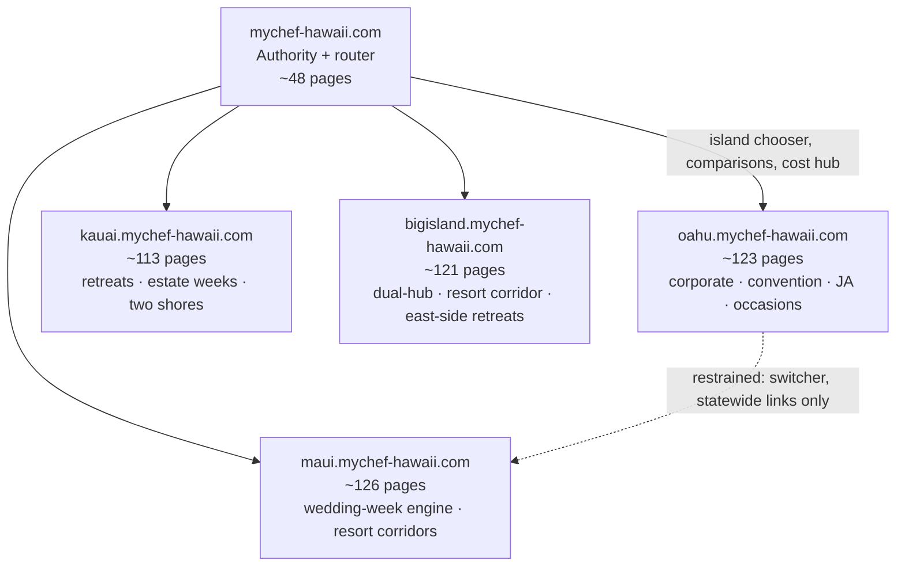
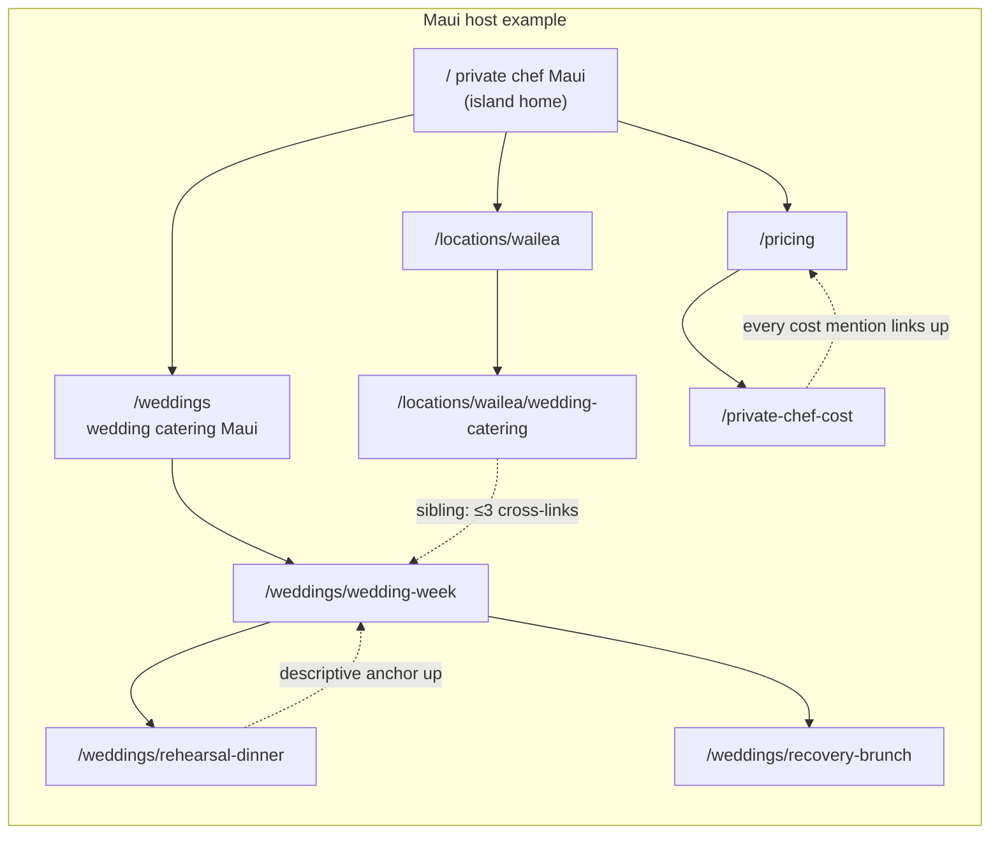

## 4. Site Architecture and Sitemaps

**The rebuild keeps the five-host architecture — one statewide hub plus four island properties — and makes it earn its keep.** The audit shows the structure was right and the execution inverted it: 637 URLs across five hosts, yet the money pages (`/pricing`, `/quote`, `/trust`, `/legal`) sat outside every XML sitemap while roughly 150 two-to-four-sentence journal and blog stubs were fully indexed.[^01-2^][^01-13^][^01-25^] This chapter specifies the corrected architecture: what each host is for, how many pages each island should carry and of what kind, the complete proposed sitemaps (123 pages for Oʻahu, 126 for Maui, 113 for Kauaʻi, 121 for Hawaiʻi Island, 48 for the statewide hub), and the internal-linking rules that keep 531 pages from cannibalizing each other.

Three decisions govern everything below. First, **the hub is an authority and routing layer, not a fifth island site** — it owns statewide terms and comparison content and pushes commercial intent down to the islands. Second, **page count is earned, not padded**: every proposed URL answers a query cluster with independent SERP evidence or a genuinely distinct service term, and every location page passes the dim08 test — build only where service terms genuinely differ (travel fees, minimums, venue rules).[^08-21^][^08-13^] Third, **the islands are deliberately asymmetric**: Oʻahu carries corporate, convention, occasion, and Japanese-language depth; Maui carries the deepest wedding cluster in the network; Kauaʻi carries retreat and estate-week depth; Hawaiʻi Island carries a dual-hub geography (Kona–Kohala west, Hilo–Volcano east) with a resort-corridor structure. Cloning one 100-page template across four islands is exactly how the current estate produced thin near-duplicates; this architecture is designed against that failure mode.

All page sets are **proposed architectures**: each row specifies URL path, page category, primary keyword, parent page, and build wave. Title tags, meta descriptions, and page copy belong to Chapter 5's templates. Keyword demand labels are ESTIMATED throughout, per the cross-verification register — no keyword-tool volumes exist anywhere in the research, and the numeric annotations leaked into the current site's copy ("(90)", "(720)", "(210)") are unverified and must not be reused as demand data.[^01-15^][^01-22^]

### 4.1 Architecture Principles

#### 4.1.1 Statewide domain = authority/router; island sites = local commercial engines

**The subdomain-per-island structure is not a stylistic choice; it is the legally correct operating map of Hawaiʻi, and Google already segments these SERPs the same way.** Food-safety permits are issued per island with no reciprocity, liquor licensing runs through four separate county commissions, GET is filed multi-county with the rate following where service is performed, and there is no consumer inter-island vehicle ferry — equipment moves by barge at $1,000–$2,500 and Kona to Hilo is a 2.5–3-hour drive (cross-verification H13; [^06-24^]). On the demand side, every "private chef + geo" query produces a distinct island-level map pack, Google's own "People also search for" surfaces island and resort-area variants independently, and the strongest marketplace competitor maintains separate `/hawaii`, `/maui`, `/kauai`, `/big-island`, `/honolulu-county`, and resort-area pages.[^08-1^][^08-6^][^08-2^][^08-4^] The architecture below simply matches the market's existing shape.

The division of labor is strict:

- **The hub owns statewide terms and the trust/decision layer.** "Private chef Hawaii," "Hawaii private chef cost," "catering Hawaii," tipping, private-vs-personal definitional queries, and the island chooser live here, because those SERPs return mixed-island results.[^08-1^][^08-14^] The hub carries the statewide tariff, the fee-stack explainer, policies, and statewide guides — then routes. It publishes **zero location pages**, a discipline the current hub already states in copy ("Neighborhood corridors live on the island hosts… They are not hub paths").[^01-1^]
- **Each island host owns its island phrase and acts as a local commercial engine.** "Private chef {island}," "{island} cost," "wedding catering {island}" are island-owned, each backed by a full rate card, location pages, occasion pages, and island-specific operational truth (Hanalei bridge clauses, Kona–Hilo logistics, Waikīkī building COIs) that no competitor publishes.[^08-6^][^01-4^][^01-6^][^01-7^]
- **Resort-area pages own "private chef {area}" only where tier-3 demand is confirmed** — PASF visibility, marketplace area pages, or localized marketplace pricing (e.g., Take a Chef's Kailua page with its own 132–169 USD tiers).[^08-43^][^03-20^] Everything else is a section within the parent location page, not a URL.
- **One owner per keyword, tested before publication.** Every proposed URL below names a single primary keyword; Chapter 3's ownership map is the governing register, and no page ships without a cannibalization check against it. The current site already enforces this law in copy ("Hub `/` owns private chef Hawaii… This page is the tariff") — the rebuild keeps the law and moves the annotations out of visible text into the internal IA document, following the sister network's commented-sitemap governance pattern.[^01-8^][^02-2^]

Two sister-site patterns are encoded at the foundation. The **two-core product grammar** — "a chef for the house / catering for the event," with router copy on every commercial page — structures each island's service silo, exactly as Dubai and Bali run it.[^02-1^][^02-10^] And the **AI-search posture** (robots.txt explicitly welcoming GPTBot, PerplexityBot, ClaudeBot, plus an `llms.txt`) is copied from Bali, the network's AI-search template.[^02-12^]

#### 4.1.2 Page-count targets per island (100+ legitimate indexable pages) with category mix

**Each island targets 110–130 indexable pages; the hub targets 48. The mix matters more than the count.** The current estate already hit 134–138 URLs per island — scale was never the problem. The problem was composition: 29 mirrored sub-directory slugs cloned identically across all five hosts (145 URLs) and ~150 editorial stubs, while the pages buyers actually need (rate cards, travel zones, wedding-week budgets) were missing from the sitemap.[^01-2^][^01-25^] The targets below rebuild the same page volume as *legitimate* inventory: every URL either owns a keyword cluster with SERP evidence or carries unique commercial substance (a rate card, a worked budget, a logistics guide). "Legitimate" is defined operationally: no page ships under 800 words of unique copy, every location page carries unique pricing/logistics content in the Bali template (the network's quality bar: 60+ programmatic area pages that are explicitly *not* thin), and every page passes the ownership test.[^02-15^]

| Page category | Oʻahu | Maui | Kauaʻi | Big Island | Hub | What earns a page here |
|---|---|---|---|---|---|---|
| Core commercial | 8 | 8 | 8 | 8 | 8 | Island phrase, two cores (private chef / catering), weddings, Stay Chef, pricing, quote, plus one island-specific hero (corporate Oʻahu, estate-events Maui, retreats Kauaʻi/BI) |
| Service pages | 20 | 20 | 18 | 19 | 7 | Distinct sellable products with their own intent (date night, meal prep, omakase-at-home, staffing roles, mobile bar) |
| Location pages | 10 | 10 | 7 | 12 | 0 | Only research-justified areas; combined pages where demand is thin; zero on hub by design[^01-1^] |
| Service × location | 14 | 14 | 10 | 12 | 0 | Only where service terms genuinely differ by area (travel fees, venue rules, minimums)[^08-13^] |
| Cuisine / menu pages | 12 | 12 | 10 | 12 | 0 | Menu catalogue + island-provenance menus (canoe crops Maui, Kona coffee BI, farm-to-table Kauaʻi, Pacific-rim Oʻahu) |
| Occasion pages | 10 | 10 | 9 | 9 | 0 | Birthday, anniversary, proposal, reunion, graduation (Oʻahu), Ironman week (BI) |
| Wedding / event cluster | 9 | 18 | 9 | 9 | 0 | Maui is the wedding engine; per-format pages (welcome dinner, rehearsal, recovery brunch) have near-zero dedicated competition[^04-30^][^04-44^] |
| Retreat / estate cluster | — | — | 7 | 6 | — | Kauaʻi-first whitespace: "retreat catering Kauai" returns zero dedicated SERP results[^05-35^]; BI east side has one premium competitor[^06-21^] |
| Pricing / decision pages | 10 | 10 | 10 | 10 | 8 | One canonical cost page per level; fee stack, travel zones, worked budgets, comparison pages[^08-15^] |
| Guides (editorial) | 13 | 12 | 13 | 12 | 13 | Full-prose replacements for the pruned stubs; PAA-bank coverage |
| Trust / process / partners | 12 | 12 | 12 | 12 | 12 | Honesty register, legal, FAQ, coverage maps, vetting, partner silos (villa managers, concierges, planners)[^02-11^] |
| Japanese-language cluster | 5 | — | — | — | — | Oʻahu-only play: Japan = Oʻahu's #1 international market; zero JA-language competitors[^03-47^][^03-48^] |
| **Total** | **123** | **126** | **113** | **121** | **48** | **531 indexable pages network-wide** |

**Interpretation.** Three asymmetries in this table are the strategy. First, Maui's wedding cluster (18 pages) is double any other island's because Maui is the state's destination-wedding engine — 4,659 Maui weddings in 2021 (2021 DOH-derived data; #2 island after Honolulu) against a backdrop of 17,370 statewide weddings and $927M spend in 2025 — and because the wedding-week product (welcome → rehearsal → reception → recovery brunch as one contract) is documented demand that no competitor sells as a single product.[^04-49^][^03-63^][^04-44^] Second, Kauaʻi's retreat cluster (7 pages plus the retreat-catering core page) is built on the cleanest whitespace in the research: "retreat catering Kauai" returns zero dedicated results while Kauaʻi's retreat supply is real and priced ($2,000–$4,499 tickets) and hosts already hire chefs ad hoc.[^05-35^][^05-36^] Third, the Big Island's 12 location pages reflect a genuinely dual-hub island — Kona–Kohala resort corridors on the west, Hilo–Volcano resident-and-retreat markets on the east, separated by 2.5–3 hours of driving that myCHEF already monetizes as a published travel-zone line.[^06-24^][^06-21^] Note what the table refuses: no Kauaʻi west-side pages (minimal luxury rental stock), no Maui Haleakalā/Waikapu pages, no Hana page, and no mirrored "personal chef" page sets — private-vs-personal is handled as a definitional section on the same URLs, not as duplicate inventory.[^05-44^][^08-1^] The hub's 48 pages are capped deliberately: every page added to the hub is a page that could dilute island ownership, so the hub grows only in comparisons, statewide guides, and trust content.

### 4.2 Island Sitemaps

**Preserve-and-migrate: what survives from the 637-URL estate.** The new architecture absorbs three classes of existing equity before adding anything new. The migration mechanics (301 mapping, crawl inventory) belong to Chapter 7; the disposition decisions belong here.

| Existing URL pattern (dim01 inventory) | Disposition | Destination in new architecture |
|---|---|---|
| 5 homepages; `/pricing`, `/catering`, `/weddings`, `/private-chef-cost` on all hosts; `/trust`, `/legal`, `/quote` | **Survive and elevate** — put in XML sitemap at priority 0.8–0.9 (sister-site pattern); pricing corpus preserved verbatim[^01-8^][^02-2^] | Same paths, same hosts (URLs unchanged) |
| Corridor location pages with confirmed indexation (`/wailea`, `/honolulu`, `/kahala`, `/princeville`, `/kona`, `/waikoloa`, ~60 total)[^01-24^] | **Survive, rewritten** — keep paths that match the new `/locations/{area}` set; 301 the rest; every page rebuilt to the Bali non-thin template[^02-15^] | `/locations/{area}` on island hosts |
| ~150 thin journal/blog stubs (2–4 sentences, leaked SEO annotations)[^01-13^][^01-15^] | **Prune-and-expand** — ~40 mapped to the PAA/question bank become full guides; the remainder 301 to the parent guide hub | `/guides/*` (full prose, 800+ words) |
| 29 cloned sub-directory pages × 5 hosts = 145 URLs (`/events/*`, `/catering/*`, `/fine-dining/*`, `/staffing/*`, `/menus/*`, `/help/*`) identical on every host[^01-2^] | **Restructure and de-clone** — structure retained, copy rewritten per island with unique price cards, FAQs, schema | Island-specific service/occasion/menu pages |
| 54 `blog/dining-in-*` neighborhood posts[^01-2^] | **Fold** — content merges into the matching `/locations/{area}` page; 301 | `/locations/{area}` |
| Over-built corridors vs. demand evidence: Kauaʻi `/waimea`, `/hanapepe`, `/eleele`, `/kalaheo`; Maui `/haleakala`, `/waikapu`, standalone `/honokowai`; Big Island `/honokaa`, `/kau`, `/puako`; Oʻahu `/ewa`, `/kakaako`, `/downtown`, `/diamond-head` (cross-verification §4.6.1) | **Prune** — 301 to parent location page; demand covered in "areas served" sections | Parent location page |
| Indexed artifacts: `/bigisland/catering`, `/kauai/events`, parameterized `/quote?island=…`, legacy 301s (`/locations/waikiki`, `/wedding-catering`)[^01-24^][^01-25^] | **Canonical cleanup** — 301 to canonical equivalent; parameter handling via canonical tags | Canonical service/location pages |
| Copy defects (Big Island "$125" hero vs $150 CORE; Table/ENTRY drift; duplicated locations block; leaked annotations)[^01-7^][^01-4^] | **Fix, don't migrate** — Chapter 5 copy QA register | Corrected copy on surviving pages |

**Interpretation.** The disposition logic follows one rule: equity travels with the 301, quality debt does not. The pricing corpus is the estate's highest-value asset — verified consistent across dim01 and the island dims, and unique in every island market — so its URLs are untouched and its sitemap priority rises to the sister-network standard of 0.8–0.9.[^01-8^][^01-21^][^02-2^] The stub cull is the single largest quality action in the rebuild: roughly 150 URLs collapse into ~40 real guides, which concentrates crawl budget on money pages and removes the doorway-page exposure the cross-verification file flags as the estate's principal risk. The over-built corridor prune (16 URLs) is the direct application of the build-only-where-terms-differ law — Kauaʻi's west side, for example, has minimal luxury rental stock and is covered by the island page's service-area section instead.[^05-44^] Finally, note what is *not* migrated: the leaked keyword-volume annotations, the duplicated locations block rendered twice on the Oʻahu home, and the Big Island hero price inconsistency — defects to fix in copy QA, never to carry forward.[^01-4^][^01-7^]

**Reading the sitemaps.** Each island sitemap follows in two tables (commercial core & services; locations, occasions, wedding, pricing, guides & trust). Columns: **URL path** (ASCII slugs; diacritics in copy, never in URLs — the network's existing convention[^01-2^]); **Category**; **Primary keyword** (single owner per Chapter 3's map; demand labels ESTIMATED where research supports them); **Parent** (hub-and-spoke parent for §4.4 linking); **Wave** — P1 = launch money pages (weeks 1–4), P2 = location/occasion/pricing depth (weeks 5–10), P3 = guides, long-tail, JA cluster (weeks 8–16) — wave ranges indicative; final sequencing in §7.5; **Notes**. Location names use ʻokina in copy; URL slugs stay ASCII (`/locations/poipu`, not `/locations/poʻipū`).

#### 4.2.1 Oʻahu sitemap: hubs, services, locations, pricing, occasions, guides (full URL list)

**123 pages on `oahu.mychef-hawaii.com`.** Oʻahu is the network's volume and diversity engine: the only island with a real corporate/convention market, a resident weekly-service market (the kamaʻāina line), a proven occasion-subpage model (a 50-year local chef ranks with dedicated anniversary-dinner pages[^03-25^]), and the state's only Japanese-language opportunity — ≈693k Japanese visitors to Oʻahu in 2024 (aggregator; statewide Japan 731,922 in 2025) with zero competitors targeting Japanese-language private-chef queries.[^03-47^][^03-48^] Ordinance 22-7's STR rules concentrate transient visitor demand in Waikīkī and Ko Olina while Kahala/Kailua/North Shore demand skews to 30-day renters and residents — the location pages below carry that messaging split explicitly.[^03-51^]

**Table 4.2.1a — Oʻahu commercial core, services, locations (52 pages)**

| URL path | Category | Primary keyword | Parent | Wave | Notes |
|---|---|---|---|---|---|
| `/` | Core | private chef Oahu (EST. HIGH) | — | P1 | Island-owned head term; distinct map pack[^08-1^] |
| `/private-chef` | Core | hire a private chef Oahu | `/` | P1 | "Chef for the house" core silo hub[^02-10^] |
| `/catering` | Core | catering Oahu (EST. HIGH) | `/` | P1 | "Catering for the event" core silo hub |
| `/weddings` | Core | wedding catering Oahu | `/` | P1 | Wedding silo hub; 9,943 Honolulu weddings (2021, DOH-derived)[^03-64^] |
| `/stay-chef` | Core | vacation chef Oahu | `/` | P1 | Multi-day product; from $850/day[^01-21^] |
| `/pricing` | Core | private chef Oahu cost | `/` | P1 | Rate card preserved verbatim; sitemap priority 0.9[^01-21^][^02-2^] |
| `/quote` | Core | book a private chef Oahu | `/` | P1 | Conversion door; canonical, no indexed parameters |
| `/corporate` | Core | corporate catering Honolulu | `/` | P1 | Oʻahu-only core page; HCC displacement demand through 2027[^03-67^] |
| `/services/personal-chef-weekly` | Service | personal chef Oahu weekly | `/private-chef` | P1 | Kamaʻāina line from $300/week + groceries; Oʻahu-exclusive[^01-4^] |
| `/services/vacation-chef` | Service | chef for vacation rental Oahu | `/private-chef` | P1 | Concierge-ceded intent; dedicated page type is whitespace[^08-18^] |
| `/services/date-night` | Service | private chef for two Oahu | `/private-chef` | P2 | Fixed-price evening; from $450/event[^01-21^] |
| `/services/meal-prep` | Service | weekly meal prep chef Honolulu | `/private-chef` | P2 | Positioned above delivery players; largest market segment[^03-23^] |
| `/services/cooking-classes` | Service | private cooking class Oahu | `/private-chef` | P3 | Experience add-on |
| `/services/omakase-at-home` | Service | omakase at home Honolulu | `/private-chef` | P2 | Demand proven at luxury end: JP 27-course kaiseki; ESPACIO in-suite[^03-16^][^03-48^] |
| `/services/fine-dining` | Service | fine dining at home Oahu | `/private-chef` | P2 | Premium tier hub ($190–$275/pp)[^01-21^] |
| `/services/chefs-table` | Service | chef's table Oahu | `/services/fine-dining` | P2 | $275–$400+/pp, quoted manually[^01-21^] |
| `/services/honeymoon-dinners` | Service | honeymoon private chef Oahu | `/private-chef` | P3 | Couples segment |
| `/services/retreat-catering` | Service | retreat catering Oahu | `/catering` | P3 | Corporate/wellness offsites |
| `/services/mobile-bar` | Service | mobile bar Oahu | `/catering` | P2 | Packaged cart from $650/4 hr; REQUIRES LEGAL VERIFICATION (county liquor rules)[^01-21^] |
| `/services/staffing` | Service | event staffing Oahu | `/catering` | P2 | Staffing SKU hub; servers from $55/hr[^01-21^] |
| `/services/staffing/servers` | Service | event servers for hire Oahu | `/services/staffing` | P3 | $55/hr, 4-hr floor[^01-21^] |
| `/services/staffing/bartenders` | Service | bartender hire Oahu | `/services/staffing` | P3 | REQUIRES LEGAL VERIFICATION (alcohol service) |
| `/services/staffing/butlers` | Service | butler service Oahu | `/services/staffing` | P3 | Estate-service upsell |
| `/services/kids-menus` | Service | kid-friendly private chef Oahu | `/private-chef` | P3 | Large family groups with children |
| `/services/dietary` | Service | vegan gluten-free private chef Oahu | `/private-chef` | P2 | Dietary capability matrix (Dubai pattern)[^02-5^] |
| `/services/convention-dining` | Service | convention catering Honolulu | `/corporate` | P2 | HCC modified schedule 2026–2027; displaced citywides favor off-site[^03-67^][^03-69^] |
| `/services/yacht-chef` | Service | yacht chef Honolulu | `/private-chef` | P3 | Ala Wai / Ko Olina marinas; weak competitor content[^03-32^] |
| `/services/grocery-provisioning` | Service | villa grocery stocking Oahu | `/services/vacation-chef` | P3 | Attach-on; groceries at cost with receipts[^01-8^] |
| `/locations` | Location index | private chef Oahu areas served | `/` | P1 | Areas index with service-area map |
| `/locations/waikiki` | Location | private chef Waikiki (EST. HIGH) | `/locations` | P1 | Highest visitor density; Take a Chef Waikiki page; STR-legal zone[^08-27^][^03-51^] |
| `/locations/honolulu` | Location | private chef Honolulu (EST. HIGH) | `/locations` | P1 | Metro hub; PASF-confirmed independent demand[^08-1^] |
| `/locations/kahala-gold-coast` | Location | private chef Kahala | `/locations` | P1 | Wealthiest estate zone (~1,200 homes, land from $1.5M+); zero competitor pages; existing equity[^03-52^][^01-24^] |
| `/locations/ko-olina` | Location | private chef Ko Olina (EST. MED) | `/locations` | P1 | Resort residences with purpose-built chef kitchens; Take a Chef Ko Olina page[^03-55^][^08-40^] |
| `/locations/kapolei` | Location | private chef Kapolei | `/locations` | P2 | Second-city resident/corporate market; marketplace page signal |
| `/locations/kailua-lanikai` | Location | private chef Kailua | `/locations` | P1 | Take a Chef Kailua page with localized 132–169 USD tiers; covers Lanikai + Kāneʻohe/windward as sections[^03-20^] |
| `/locations/north-shore` | Location | private chef North Shore Oahu | `/locations` | P1 | Estate market, surf-season peaks, published drive surcharge; low competition[^03-59^][^01-21^] |
| `/locations/turtle-bay` | Location | private chef Turtle Bay | `/locations/north-shore` | P2 | Resort anchor; travel fee from $75[^01-21^] |
| `/locations/hawaii-kai` | Location | private chef Hawaii Kai | `/locations` | P2 | Marina suburb; resident weekly-service market[^03-60^] |
| `/locations/waikiki/catering` | Service × location | catering Waikiki | `/locations/waikiki` | P2 | Terms differ: hotel-adjacent load-in, COI requirements |
| `/locations/waikiki/in-suite-dining` | Service × location | in-suite private chef Waikiki | `/locations/waikiki` | P2 | Ritz-Carlton Residences chef's-kitchen suites; ESPACIO segment[^03-50^][^03-48^] |
| `/locations/waikiki/omakase` | Service × location | omakase at home Waikiki | `/services/omakase-at-home` | P3 | In-suite kaiseki crossover[^03-48^] |
| `/locations/honolulu/corporate-catering` | Service × location | corporate catering Honolulu downtown | `/corporate` | P1 | Kakaʻako/Downtown office density |
| `/locations/honolulu/wedding-catering` | Service × location | wedding catering Honolulu | `/weddings` | P2 | Venue-driven demand; directory-saturated SERP[^03-35^] |
| `/locations/ko-olina/wedding-catering` | Service × location | wedding catering Ko Olina | `/weddings` | P2 | Resort chapel/lagoon wedding corridor |
| `/locations/ko-olina/stay-chef` | Service × location | vacation chef Ko Olina | `/stay-chef` | P2 | Yamaguchi-kitchen villas; 30-day legal rentals[^03-55^][^03-56^] |
| `/locations/kailua-lanikai/stay-chef` | Service × location | vacation chef Kailua | `/stay-chef` | P2 | Beachfront estates; villa agencies list chef add-ons[^03-58^] |
| `/locations/north-shore/stay-chef` | Service × location | chef for a week North Shore Oahu | `/stay-chef` | P2 | Surf-season estate weeks; 60–90+ min drive policy[^01-4^][^03-59^] |
| `/locations/north-shore/catering` | Service × location | catering North Shore Oahu | `/catering` | P3 | Estate events; supply gap[^03-59^] |
| `/locations/kahala-gold-coast/personal-chef` | Service × location | personal chef Kahala weekly | `/services/personal-chef-weekly` | P2 | Estate household service |
| `/locations/hawaii-kai/personal-chef` | Service × location | personal chef Hawaii Kai | `/services/personal-chef-weekly` | P3 | Resident weekly market[^03-60^] |
| `/locations/turtle-bay/vacation-chef` | Service × location | private chef Turtle Bay villas | `/services/vacation-chef` | P3 | Resort-adjacent rental segment |
| `/locations/kapolei/catering` | Service × location | catering Kapolei | `/catering` | P3 | Second-city events |

**Interpretation (Table 4.2.1a).** The Oʻahu core does something no other island's does: it carries two parallel demand economies on one host. The visitor economy (Waikīkī, Ko Olina, North Shore estates) buys Signature dinners, Stay Chef weeks, and in-suite omakase — and is heavily concentrated by law, since legal short-term rentals sit almost entirely in the Waikīkī and Ko Olina resort zones.[^03-51^] The resident economy (Kahala, Hawaiʻi Kai, Kapolei, Kailua) buys the kamaʻāina weekly line, meal prep, and occasion catering. The location set is deliberately smaller than the current estate's 14 corridors: Ewa, Kakaʻako, Downtown, and Diamond Head lose standalone pages because no research evidence shows independent chef-service demand there — they become sections of the Honolulu and area pages, with `/kakaako` and `/downtown` corporate intent absorbed by `/locations/honolulu/corporate-catering`. The corporate/convention pair (`/corporate` + `/services/convention-dining` + `/locations/honolulu/corporate-catering`) is timed to a real demand shock: the Hawaiʻi Convention Center's modified schedule through 2026–2027 is pushing group business into hotels and private venues, and no private-chef operator is positioned for it.[^03-67^][^03-69^] The Waikīkī in-suite cluster is the clearest "service terms genuinely differ" case in the state — COI certificates, freight-elevator bookings, and compact-galley logistics are real service differences, not keyword variants.[^03-45^][^03-50^]

**Table 4.2.1b — Oʻahu occasions, wedding, menus, pricing/decision, guides, trust, JA cluster (71 pages)**

| URL path | Category | Primary keyword | Parent | Wave | Notes |
|---|---|---|---|---|---|
| `/occasions` | Occasion index | private chef for events Oahu | `/` | P2 | Occasion silo hub |
| `/occasions/birthday` | Occasion | birthday private chef Honolulu | `/occasions` | P2 | Occasion-subpage model proven locally[^03-25^] |
| `/occasions/anniversary` | Occasion | anniversary dinner private chef Honolulu | `/occasions` | P2 | Dedicated competitor page ranks[^03-25^] |
| `/occasions/proposal` | Occasion | proposal dinner private chef Oahu | `/occasions` | P3 | Sunset-dinner segment |
| `/occasions/graduation` | Occasion | graduation party catering Honolulu | `/occasions` | P2 | May–June local graduation season |
| `/occasions/bachelorette` | Occasion | bachelorette private chef Oahu | `/occasions` | P3 | Villa-group format |
| `/occasions/holiday-dinner` | Occasion | Thanksgiving private chef Oahu | `/occasions` | P2 | December peak; holiday-surcharge calendar published Q3 |
| `/occasions/family-reunion` | Occasion | family reunion catering Oahu | `/occasions` | P2 | Multi-generational villa groups |
| `/occasions/villa-party` | Occasion | villa party catering Oahu | `/occasions` | P3 | Staffed 10–75 guest range[^01-18^] |
| `/occasions/celebration-of-life` | Occasion | celebration of life catering Oahu | `/occasions` | P3 | Resident-market sensitivity page |
| `/weddings/wedding-week` | Wedding | wedding week chef Oahu | `/weddings` | P1 | One-contract week; from $125/pp + staffing[^01-21^] |
| `/weddings/rehearsal-dinner` | Wedding | rehearsal dinner catering Oahu | `/weddings/wedding-week` | P1 | Per-format terms have near-zero dedicated pages[^04-30^] |
| `/weddings/welcome-dinner` | Wedding | welcome dinner catering Oahu | `/weddings/wedding-week` | P2 | Wedding-week line item |
| `/weddings/reception-catering` | Wedding | wedding reception catering Oahu | `/weddings` | P1 | Estate/villa receptions, not ballrooms |
| `/weddings/recovery-brunch` | Wedding | day after wedding brunch Oahu | `/weddings/wedding-week` | P2 | Recovery-brunch format |
| `/weddings/elopement` | Wedding | elopement private chef Oahu | `/weddings` | P2 | Dinner-for-two from $450; unbundled micro-wedding wedge[^01-21^] |
| `/weddings/estate-wedding` | Wedding | estate wedding catering Oahu | `/weddings` | P2 | Routes around exclusive-caterer venues (Waimea Valley locks Ke Nui Kitchen)[^03-66^] |
| `/weddings/wedding-cost` | Wedding | wedding catering cost Oahu | `/weddings` | P2 | Informational anchor; planner benchmarks $60–$75/pp buffet[^03-65^] |
| `/weddings/venues` | Wedding | Oahu estate wedding venues | `/weddings` | P3 | Venue-with-kitchen guide; planner-channel bridge |
| `/menus` | Menu index | private chef menus Oahu | `/` | P1 | Menu catalogue hub (Bali card pattern)[^02-16^] |
| `/menus/signature-three-course` | Menu | Oahu signature dinner menu | `/menus` | P1 | Existing sample menu preserved[^01-4^] |
| `/menus/family-style` | Menu | family style dinner menu Oahu | `/menus` | P2 | Group format |
| `/menus/tasting-menu` | Menu | tasting menu private chef Oahu | `/menus` | P2 | Premium tier |
| `/menus/pupu-and-grazing` | Menu | grazing table Honolulu | `/menus` | P2 | Grazing niche has dedicated local operators[^03-42^] |
| `/menus/bbq-and-grill` | Menu | bbq catering menu Oahu | `/menus` | P3 | Villa grill format |
| `/menus/breakfast-and-brunch` | Menu | brunch chef Honolulu | `/menus` | P3 | Villa breakfast service |
| `/menus/vegetarian-vegan` | Menu | vegan private chef menu Oahu | `/menus` | P3 | Dietary depth |
| `/menus/gluten-free` | Menu | gluten free private chef Oahu | `/menus` | P3 | Dietary depth |
| `/menus/kids` | Menu | kids menu private chef Oahu | `/menus` | P3 | Family groups |
| `/menus/pacific-rim-omakase` | Menu | omakase menu Oahu | `/services/omakase-at-home` | P2 | JA-market crossover menu |
| `/menus/holiday` | Menu | holiday catering menu Oahu | `/menus` | P3 | Seasonal rotation; refresh Q3 |
| `/private-chef-cost` | Pricing | how much does a private chef cost in Honolulu | `/pricing` | P1 | "The stack" — island cost guide; one canonical cost page per level[^01-16^][^08-15^] |
| `/pricing/stay-chef-cost` | Pricing | stay chef Oahu cost per day | `/pricing` | P2 | From $850/day + worked week math[^01-21^][^02-13^] |
| `/pricing/kamaaina-weekly-cost` | Pricing | personal chef cost per week Honolulu | `/pricing` | P3 | $300–$1,200/week line[^01-21^] |
| `/pricing/wedding-week-budget` | Pricing | Oahu wedding catering budget | `/weddings/wedding-cost` | P2 | Worked meals × days × guests grid[^02-13^] |
| `/pricing/fee-stack` | Pricing | Oahu service charge and GET explained | `/pricing` | P1 | 20% service + GET up to 4.7120% + 50% deposit; §481B-14 posture REQUIRES LEGAL VERIFICATION[^01-19^] Canonical to hub fee-stack per §4.4.2. |
| `/pricing/travel-zones` | Pricing | Oahu private chef travel fee | `/pricing` | P1 | North Shore/Turtle Bay from $75; no competitor publishes travel fees[^01-21^] |
| `/pricing/estimate` | Pricing | private chef Oahu price estimate | `/pricing` | P2 | Interactive estimator (Bali/Dubai pattern)[^02-13^][^02-4^] |
| `/compare/private-chef-vs-restaurant` | Decision | private chef vs restaurant Honolulu | `/private-chef-cost` | P3 | Group-of-six math argument competitors already make[^08-3^] |
| `/compare/private-vs-personal-chef` | Decision | difference between private and personal chef Oahu | `/private-chef-cost` | P2 | Recurring PAA definitional query[^08-1^] Hub is statewide owner; page links up per rule 5. |
| `/compare/freelance-vs-mychef` | Decision | hire a chef directly vs myCHEF Oahu | `/trust` | P3 | Bali comparison-table pattern[^02-18^] |
| `/guides` | Guide index | Oahu private chef guides | `/` | P2 | Editorial hub; replaces stub journal/blog |
| `/guides/how-it-works` | Guide | how does a private chef work in Oahu | `/` | P1 | 4-step process; "what to expect" PAA[^08-27^] |
| `/guides/how-to-hire` | Guide | how to hire a private chef Oahu | `/guides` | P2 | Expands existing stub to full prose[^01-13^] |
| `/guides/villa-kitchen` | Guide | what kitchen does a private chef need in Oahu | `/guides` | P2 | Kitchen-requirement PAA cluster[^08-47^] |
| `/guides/condo-load-in-coi` | Guide | Waikiki condo private chef COI logistics | `/guides/villa-kitchen` | P2 | Signature content: building COIs, freight elevators[^03-45^] |
| `/guides/groceries-at-cost` | Guide | are groceries included private chef Oahu | `/guides` | P2 | Groceries-at-cost-with-receipts policy[^01-8^] |
| `/guides/booking-lead-times` | Guide | how far in advance to book a private chef Oahu | `/guides` | P2 | Expands stub; Oʻahu effectively year-round |
| `/guides/weather-backup` | Guide | outdoor dinner weather backup Oahu | `/guides` | P3 | Lanai/rain contingency |
| `/guides/seasonality` | Guide | best time to book Oahu private chef | `/guides` | P3 | 37% seasonality index — year-round messaging[^03-51^] |
| `/guides/dietary` | Guide | dietary restrictions private chef Oahu | `/guides` | P3 | Allergy/protocol handling |
| `/guides/cleanup-standard` | Guide | private chef cleanup what to expect Oahu | `/guides` | P3 | Expands existing stub[^01-22^] |
| `/guides/alcohol-and-bar` | Guide | can a private chef serve alcohol in Hawaii | `/guides` | P2 | REQUIRES LEGAL VERIFICATION; county liquor commissions |
| `/guides/north-shore-drive` | Guide | North Shore private chef drive times | `/guides` | P3 | 60–90+ min policy; surf/whale season Oct–Apr[^03-59^] |
| `/about` | Trust | about myCHEF Oahu | `/` | P1 | Team/entity as assets verify |
| `/trust` | Trust | myCHEF honesty register Oahu | `/` | P1 | No-fake-reviews policy preserved as brand asset[^01-10^] |
| `/legal` | Trust | myCHEF booking terms Oahu | `/` | P1 | 7-section fine-print model; cancellation tiers pending counsel[^01-19^] |
| `/faq` | Trust | private chef Oahu FAQ | `/` | P1 | Full-prose FAQ system with internal links[^02-9^] |
| `/contact` | Trust | contact myCHEF Oahu | `/` | P1 | Quote form + WhatsApp; response-time promise[^02-14^] |
| `/what-we-dont-do` | Trust | what myCHEF will not do Oahu | `/trust` | P2 | Negative-space trust page[^01-1^] Canonical to hub per §4.4.2. |
| `/coverage` | Trust | Oahu service area map | `/locations` | P1 | Base zones vs published zone lines vs quote-only[^01-19^] |
| `/how-we-vet-chefs` | Trust | how myCHEF vets chefs Oahu | `/trust` | P2 | Sister-site vetting-page pattern[^02-1^] Canonical to hub per §4.4.2. |
| `/partners` | Partner index | partner with myCHEF Oahu | `/` | P2 | B2B silo hub[^02-11^] |
| `/partners/villa-managers` | Partner | private chef partner for villa managers Oahu | `/partners` | P2 | EVRHI service-area channel[^03-61^] |
| `/partners/concierges` | Partner | concierge chef referral program Oahu | `/partners` | P2 | Hotel/villa concierge referral rails |
| `/partners/wedding-planners` | Partner | Oahu wedding planner catering partner | `/partners` | P2 | Planner-gated venue access (ABC, 1979Hawaii!)[^03-65^] |
| `/ja/` | JA core | ハワイ オアフ プライベートシェフ | `/` | P3 | hreflang `ja`; zero JA-language competitors[^03-47^] |
| `/ja/waikiki-private-chef` | JA location | ワイキキ 出張シェフ | `/ja/` | P3 | Suite/condo segment |
| `/ja/omakase-at-home` | JA service | ハワイ 出張おまかせ | `/ja/` | P3 | In-suite kaiseki demand proven[^03-48^] |
| `/ja/stay-chef` | JA service | ハワイ 滞在シェフ | `/ja/` | P3 | Multi-day product in JA |
| `/ja/weddings` | JA wedding | ハワイ ウェディング ケータリング | `/ja/` | P3 | Japanese-wedding planner channel |

**Interpretation (Table 4.2.1b).** This layer converts Oʻahu's breadth into owned intent rather than scattered pages. The wedding cluster is deliberately thinner than Maui's (9 vs 18 pages) because Oʻahu weddings skew local-resident and venue-locked — several marquee venues hold exclusive caterers, so the cluster aims at estate, villa, and elopement segments where an outside chef can actually win.[^03-66^] The pricing/decision block implements the one-canonical-cost-page rule: `/pricing` and `/private-chef-cost` own the cost queries; every blog or guide that touches price links up to them rather than competing — the exact discipline dim08 prescribes against the Raffin pattern of ranking twice with two posts.[^08-15^] The guides section is where the pruned stubs go to be reborn: 13 full-prose guides absorb the PAA question bank (kitchen requirements, groceries, lead times, tipping routes to the hub page), each 800+ words with internal links down to money pages.[^08-47^] The JA cluster is the boldest line in the table and the cheapest: five hreflang'd pages on a market where ≈693k annual Japanese visitors face zero language-matched private-chef competition, scoped strictly to Oʻahu — Kauaʻi, at ~7k Japanese visitors a year, proves the play is not statewide.[^03-47^][^05-66^] Keep it at five pages until conversion data justifies more.

#### 4.2.2 Maui sitemap (full URL list)

**126 pages on `maui.mychef-hawaii.com`.** Maui is the network's wedding engine and its highest-spend visitor market ($305.0 per person per day in CY2025, the state's top figure; DBEDT-verified per cross-verification H5). The architecture reflects three research findings: the wedding-week multi-meal pattern is documented demand that no competitor sells as one contract[^04-30^][^04-44^]; DLNR beach permits cap ceremonies at roughly 20 people with no structures, structurally pushing receptions into estates and villas with kitchens[^04-53^]; and post-fire West Maui demand has shifted north to Kāʻanapali–Kapalua while Lahaina town requires sensitive, informational-only handling.[^04-58^] Location pages exist only where the research justifies them — no Haleakalā, Waikapu, or Hana pages.

**Table 4.2.2a — Maui commercial core, services, locations (52 pages)**

| URL path | Category | Primary keyword | Parent | Wave | Notes |
|---|---|---|---|---|---|
| `/` | Core | private chef Maui (EST. HIGH) | — | P1 | Most contested island term; distinct map pack[^08-6^] |
| `/private-chef` | Core | hire a private chef Maui | `/` | P1 | Chef-for-the-house silo hub |
| `/catering` | Core | catering Maui | `/` | P1 | Event-catering silo hub |
| `/weddings` | Core | wedding catering Maui (EST. HIGH) | `/` | P1 | The network's deepest wedding silo |
| `/stay-chef` | Core | chef for a week Maui / vacation chef Maui | `/` | P1 | From $1,050/day; only multi-day rates in market besides one competitor[^01-5^][^04-45^] |
| `/pricing` | Core | private chef Maui cost | `/` | P1 | Rate card preserved; only full published card on Maui[^01-5^] |
| `/quote` | Core | book a private chef Maui | `/` | P1 | Conversion door |
| `/estate-events` | Core | estate reception catering Maui | `/` | P1 | Maui-only core: receptions migrate to estates under DLNR caps[^04-53^] |
| `/services/personal-chef` | Service | personal chef Maui | `/private-chef` | P1 | Vacation meal-prep overlap intent |
| `/services/vacation-chef` | Service | chef for vacation rental Maui | `/private-chef` | P1 | Villa-stay rhythm service; concierge-ceded intent[^08-18^] |
| `/services/date-night` | Service | private chef for two Maui | `/private-chef` | P2 | From $500+[^01-5^] |
| `/services/meal-prep` | Service | meal prep chef Maui | `/private-chef` | P2 | Visitor + resident mix; Christmas-week villa prep demand |
| `/services/cooking-classes` | Service | cooking class Maui private | `/private-chef` | P3 | Experience add-on |
| `/services/omakase-at-home` | Service | private sushi chef Maui | `/private-chef` | P2 | Term appears verbatim in Maui PASF[^08-6^] |
| `/services/fine-dining` | Service | fine dining at home Maui | `/private-chef` | P2 | Premium tier hub |
| `/services/chefs-table` | Service | chef's table Maui | `/services/fine-dining` | P2 | Quoted tier |
| `/services/honeymoon-dinners` | Service | honeymoon private chef Maui | `/private-chef` | P2 | Top honeymoon island; couples segment |
| `/services/retreat-catering` | Service | retreat catering Maui / wellness chef Maui | `/catering` | P2 | Niche currently owned by one operator with no multi-day pricing[^04-3^] |
| `/services/wellness-menus` | Service | wellness retreat menus Maui | `/services/retreat-catering` | P3 | Dietary-protocol depth |
| `/services/mobile-bar` | Service | mobile bar Maui | `/catering` | P2 | Packaged cart from $800/4 hr; REQUIRES LEGAL VERIFICATION[^01-5^] |
| `/services/staffing` | Service | event staffing Maui | `/catering` | P2 | Staffing SKU hub |
| `/services/staffing/servers` | Service | event servers Maui | `/services/staffing` | P3 | $55/hr class |
| `/services/staffing/bartenders` | Service | bartender hire Maui | `/services/staffing` | P3 | REQUIRES LEGAL VERIFICATION |
| `/services/staffing/butlers` | Service | butler service Maui | `/services/staffing` | P3 | Estate-service upsell |
| `/services/kids-menus` | Service | kid-friendly private chef Maui | `/private-chef` | P3 | Large family groups in big houses |
| `/services/dietary` | Service | vegan gluten-free private chef Maui | `/private-chef` | P2 | Table-stakes depth on Maui |
| `/services/grocery-provisioning` | Service | villa grocery stocking Maui | `/services/vacation-chef` | P3 | Ko Olina-style provisioning runs analog |
| `/services/brunch-service` | Service | brunch chef Maui | `/private-chef` | P3 | Villa brunch + bridal brunch |
| `/locations` | Location index | private chef Maui areas served | `/` | P1 | Areas index + service-area map |
| `/locations/wailea` | Location | private chef Wailea (EST. MED, high value) | `/locations` | P1 | Flagship: highest-end corridor in state; Take a Chef Wailea page proves demand[^04-23^] |
| `/locations/makena` | Location | private chef Makena | `/locations` | P1 | Trophy estates $6–32M; Kukahiko/Makena Cove venues[^04-67^][^04-69^] |
| `/locations/kihei` | Location | private chef Kihei | `/locations` | P1 | Volume/value counterweight; largest condo stock in South Maui[^04-76^] |
| `/locations/kaanapali` | Location | private chef Kaanapali | `/locations` | P1 | Post-fire West Maui demand center; PASF-confirmed[^04-58^][^08-6^] |
| `/locations/kapalua` | Location | private chef Kapalua | `/locations` | P1 | Ritz-Carlton/Montage corridor; Take a Chef Kapalua page[^04-73^][^08-42^] |
| `/locations/napili-honokowai-kahana` | Location | private chef Napili | `/locations/kaanapali` | P2 | ONE combined page for the condo belt; dense VR stock[^04-77^] |
| `/locations/lahaina` | Location | private chef Lahaina Maui | `/locations` | P2 | SENSITIVE informational page: legacy term, routes demand to West Maui corridors; no dining-destination marketing[^04-58^][^08-41^] |
| `/locations/paia` | Location | private chef Paia | `/locations` | P3 | North Shore Maui; Haiku Mill corridor; ~45–60 min from Wailea |
| `/locations/kula-upcountry` | Location | private chef Upcountry Maui / Kula | `/locations` | P3 | ONE combined page; elevation surcharge zone, quote posture[^01-5^] |
| `/locations/wailea/stay-chef` | Service × location | stay chef Wailea / chef for a week Wailea | `/stay-chef` | P1 | Wailea Beach Villas / Hoʻolei / Andaz residences[^04-64^] |
| `/locations/wailea/wedding-catering` | Service × location | wedding catering Wailea | `/weddings` | P1 | FS/Grand Wailea/Andaz/Fairmont venue cluster[^04-91^] |
| `/locations/wailea/honeymoon-dinner` | Service × location | honeymoon dinner Wailea | `/services/honeymoon-dinners` | P3 | Couples segment |
| `/locations/makena/estate-wedding` | Service × location | Makena estate wedding catering | `/weddings/estate-wedding` | P1 | Kukahiko Estate venue kitchen built for caterers[^04-69^] |
| `/locations/makena/date-night` | Service × location | private dinner chef Makena | `/services/date-night` | P3 | Estate-dinner segment |
| `/locations/kaanapali/catering` | Service × location | catering Kaanapali | `/catering` | P2 | Resort-strip events; Honua Kai condo groups[^04-3^] |
| `/locations/kaanapali/vacation-chef` | Service × location | vacation chef Kaanapali | `/services/vacation-chef` | P2 | Condo-resort stay rhythm |
| `/locations/kaanapali/family-reunion` | Service × location | family reunion catering Kaanapali | `/occasions/family-reunion` | P3 | Multi-gen groups |
| `/locations/kapalua/wedding-catering` | Service × location | wedding catering Kapalua | `/weddings` | P1 | Ritz-Carlton destination-wedding positioning; Merriman's, Cliff House[^04-73^] |
| `/locations/kapalua/stay-chef` | Service × location | stay chef Kapalua | `/stay-chef` | P2 | Ridge/Bay/Golf villa stock[^04-74^] |
| `/locations/kihei/catering` | Service × location | catering Kihei | `/catering` | P2 | Value tier; Sugar Beach Events venue[^04-76^] |
| `/locations/napili-honokowai-kahana/vacation-chef` | Service × location | vacation chef Napili | `/services/vacation-chef` | P3 | Condo-belt stay service |
| `/locations/paia/retreat-catering` | Service × location | retreat catering North Shore Maui | `/services/retreat-catering` | P3 | Haʻikū wellness corridor |
| `/locations/kula-upcountry/wedding-catering` | Service × location | Upcountry Maui wedding catering | `/weddings` | P3 | Hui Noʻeau / estate weddings; surcharge applies |

**Interpretation (Table 4.2.2a).** Maui's location architecture maps the island's real post-fire geography rather than its legacy one. Wailea and Kapalua carry P1 weight because they concentrate the accommodation stock where a $150–$250/guest dinner is a marginal add-on — South Maui hotel ADRs run $623–$1,054, the highest in the state, and Wailea/Makena villa nightly rates reach $2,995.[^04-65^][^04-64^] Kāʻanapali's elevation to P1 with a combined Nāpili–Honokōwai–Kahana child page reflects where West Maui demand actually consolidated after 2023.[^04-58^] The Lahaina page is the architecture's conscience: the term still carries legacy search volume (Take a Chef maintains a Lahaina page[^08-41^]), but the page exists to route demand respectfully toward the open resort corridors and to state myCHEF's support-local posture — it is an informational page, not a landing page, and its copy rules carry into Chapter 5. The Makena estate-wedding page is the sharpest service×location play in the set: Kukahiko Estate's venue kitchen is purpose-built for outside caterers, DLNR beach caps push receptions off the sand, and Makena's $6–32M estates function as "micro-resorts" whose guests buy exactly the estate-week product.[^04-69^][^04-53^][^04-67^]

**Table 4.2.2b — Maui occasions, wedding cluster, menus, pricing/decision, guides, trust (74 pages)**

| URL path | Category | Primary keyword | Parent | Wave | Notes |
|---|---|---|---|---|---|
| `/occasions` | Occasion index | private chef for events Maui | `/` | P2 | Occasion silo hub |
| `/occasions/birthday` | Occasion | birthday private chef Maui | `/occasions` | P2 | |
| `/occasions/anniversary` | Occasion | anniversary dinner private chef Maui | `/occasions` | P2 | |
| `/occasions/proposal` | Occasion | proposal dinner private chef Maui | `/occasions` | P2 | Sunset-beach proposal segment |
| `/occasions/family-reunion` | Occasion | family reunion catering Maui | `/occasions` | P2 | Big-house groups (10–12+ guests) |
| `/occasions/bachelorette` | Occasion | bachelorette private chef Maui | `/occasions` | P3 | |
| `/occasions/holiday-dinner` | Occasion | Christmas private chef Maui | `/occasions` | P2 | 12/22–1/1 villa week demand documented[^08-39^] |
| `/occasions/villa-party` | Occasion | villa party catering Maui | `/occasions` | P3 | |
| `/occasions/celebration-of-life` | Occasion | celebration of life catering Maui | `/occasions` | P3 | Resident market |
| `/occasions/corporate-offsite` | Occasion | corporate retreat catering Maui | `/occasions` | P3 | Offsite dinners |
| `/weddings/wedding-week` | Wedding | Maui wedding week chef | `/weddings` | P1 | THE differentiated product: one culinary contract for the week[^04-44^] |
| `/weddings/rehearsal-dinner` | Wedding | rehearsal dinner Maui | `/weddings/wedding-week` | P1 | Near-zero dedicated pages market-wide[^04-30^] |
| `/weddings/welcome-dinner` | Wedding | welcome dinner Maui | `/weddings/wedding-week` | P1 | Week-pattern line item[^04-30^] |
| `/weddings/reception-catering` | Wedding | Maui wedding reception catering | `/weddings` | P1 | Plated $120–$200/pp market norm[^04-52^] |
| `/weddings/recovery-brunch` | Wedding | recovery brunch Maui / day-after brunch | `/weddings/wedding-week` | P2 | Documented week-pattern meal[^04-30^][^04-3^] |
| `/weddings/elopement` | Wedding | Maui elopement chef | `/weddings` | P1 | Elopement packages ecosystem $3,100–$4,500[^04-54^] |
| `/weddings/micro-wedding` | Wedding | micro wedding catering Maui | `/weddings` | P2 | ≤30-guest estate format |
| `/weddings/estate-wedding` | Wedding | Maui estate wedding catering | `/weddings` | P1 | Olowalu/Kukahiko/Haiku Mill class venues[^04-82^][^04-69^][^04-86^] |
| `/weddings/beach-ceremony-reception` | Wedding | Maui beach wedding reception catering | `/weddings` | P2 | DLNR permit reality: ~20-person cap, no structures → villa reception[^04-53^] |
| `/weddings/wedding-cost` | Wedding | Maui wedding catering cost | `/weddings` | P1 | Directory benchmarks: buffet $80–$120, plated $120–$200/pp[^04-52^] |
| `/weddings/wedding-week-budget` | Wedding | Maui wedding week food budget | `/weddings/wedding-cost` | P2 | Worked 5-meal week grid (meals × guests + staffing + 20% + GET)[^02-13^] |
| `/weddings/venues/wailea-makena` | Wedding | Wailea Makena wedding venue catering | `/weddings` | P2 | FS, Grand Wailea, Andaz, Fairmont, Hotel Wailea, Kukahiko[^04-91^] |
| `/weddings/venues/kapalua` | Wedding | Kapalua wedding venue catering | `/weddings` | P2 | Ritz-Carlton, Montage, Merriman's, Cliff House[^04-92^] |
| `/weddings/venues/west-maui` | Wedding | Kaanapali wedding venue catering | `/weddings` | P2 | Royal Lahaina, Sheraton, Hyatt, Steeple House |
| `/weddings/venues/upcountry-north-shore` | Wedding | Haiku Mill wedding catering | `/weddings` | P3 | Haiku Mill preferred-vendor rules + $650 outside-vendor fee[^04-86^][^04-87^] |
| `/weddings/planner-channel` | Wedding | Maui wedding planner catering program | `/weddings` | P2 | Estate venues require approved planners (Olowalu, Kukahiko)[^04-82^][^04-69^] |
| `/weddings/service-charge-comparison` | Wedding | Maui resort wedding catering fees compared | `/weddings/wedding-cost` | P2 | 20% service vs resort F&B minimums + higher charges; quantified wedge[^04-52^] |
| `/weddings/villa-reception-guide` | Wedding | how to host a villa wedding reception Maui | `/weddings/estate-wedding` | P3 | Logistics guide: kitchen, rentals, staffing |
| `/menus` | Menu index | private chef menus Maui | `/` | P1 | Catalogue hub |
| `/menus/signature-three-course` | Menu | Maui signature dinner menu | `/menus` | P1 | Existing sample menu preserved[^01-5^] |
| `/menus/family-style` | Menu | family style menu Maui | `/menus` | P2 | |
| `/menus/tasting-menu` | Menu | tasting menu private chef Maui | `/menus` | P2 | |
| `/menus/pupu-and-grazing` | Menu | pupu platters Maui | `/menus` | P2 | |
| `/menus/bbq-and-grill` | Menu | bbq catering menu Maui | `/menus` | P3 | Villa grill format |
| `/menus/breakfast-and-brunch` | Menu | brunch menu private chef Maui | `/menus` | P3 | |
| `/menus/vegetarian-vegan` | Menu | vegan private chef menu Maui | `/menus` | P3 | |
| `/menus/gluten-free` | Menu | gluten free private chef Maui | `/menus` | P3 | |
| `/menus/kids` | Menu | kids menu private chef Maui | `/menus` | P3 | |
| `/menus/canoe-crops-island` | Menu | Hawaiian farm to table menu Maui | `/menus` | P2 | Canoe-crop provenance vocabulary (taro, ʻulu, coconut)[^04-8^] |
| `/menus/holiday` | Menu | holiday catering menu Maui | `/menus` | P3 | Seasonal rotation |
| `/private-chef-cost` | Pricing | how much does a private chef cost in Maui | `/pricing` | P1 | Answered today almost only by a competitor's blog[^08-15^] |
| `/pricing/stay-chef-cost` | Pricing | stay chef Maui cost per day | `/pricing` | P2 | From $1,050/day + worked week[^01-5^] |
| `/pricing/fee-stack` | Pricing | Maui service charge and GET explained | `/pricing` | P1 | 20% + GET up to 4.7120%; §481B-14 REQUIRES LEGAL VERIFICATION[^01-19^] Canonical to hub fee-stack per §4.4.2. |
| `/pricing/travel-zones` | Pricing | Maui private chef travel fee | `/pricing` | P1 | Upcountry from $75; Pāʻia/Haʻikū quote-only posture[^01-5^] |
| `/pricing/holiday-peak-calendar` | Pricing | Maui holiday private chef rates | `/pricing` | P3 | Holiday-surcharge calendar published early Q4; Christmas-week villa demand documented[^08-39^] |
| `/pricing/estimate` | Pricing | private chef Maui price estimate | `/pricing` | P2 | Interactive estimator[^02-13^] |
| `/compare/private-chef-vs-restaurant` | Decision | private chef vs restaurant Maui | `/private-chef-cost` | P3 | |
| `/compare/private-vs-personal-chef` | Decision | difference between private and personal chef Maui | `/private-chef-cost` | P2 | PAA definitional[^08-1^] Hub is statewide owner; page links up per rule 5. |
| `/compare/freelance-vs-mychef` | Decision | hire a chef directly vs myCHEF Maui | `/trust` | P3 | Comparison-table pattern[^02-18^] |
| `/compare/resort-dining-vs-private-chef` | Decision | resort private dining vs private chef Maui | `/private-chef-cost` | P3 | Resort private-dining programs as price anchor[^04-42^] |
| `/guides` | Guide index | Maui private chef guides | `/` | P2 | Editorial hub |
| `/guides/how-it-works` | Guide | how does a private chef work in Maui | `/` | P1 | |
| `/guides/how-to-hire` | Guide | how to hire a private chef Maui | `/guides` | P2 | |
| `/guides/villa-kitchen` | Guide | what kitchen does a private chef need in Maui | `/guides` | P2 | Villa chef's-kitchen stock is Maui's stage[^04-72^] |
| `/guides/groceries-at-cost` | Guide | are groceries included private chef Maui | `/guides` | P2 | |
| `/guides/booking-lead-times` | Guide | how far in advance to book a private chef Maui | `/guides` | P2 | 2–4 weeks peak (Dec–Apr) per competitor FAQ[^08-36^] |
| `/guides/west-maui-visitor-note` | Guide | visiting West Maui respectfully 2026 | `/guides` | P2 | Sensitivity page: recovery status, support-local framing[^04-58^] |
| `/guides/seasonality-whale-season` | Guide | Maui whale season private chef | `/guides` | P3 | Dec–May; peak villa occupancy |
| `/guides/dietary` | Guide | dietary restrictions private chef Maui | `/guides` | P3 | |
| `/guides/weather-backup` | Guide | Maui outdoor dinner weather backup | `/guides` | P3 | Leeward dry vs windward wet |
| `/guides/cleanup-standard` | Guide | private chef cleanup what to expect Maui | `/guides` | P3 | |
| `/guides/alcohol-and-bar` | Guide | can a private chef serve alcohol in Maui County | `/guides` | P2 | REQUIRES LEGAL VERIFICATION — Maui County rules are the state's most specific |
| `/about` | Trust | about myCHEF Maui | `/` | P1 | |
| `/trust` | Trust | myCHEF honesty register Maui | `/` | P1 | |
| `/legal` | Trust | myCHEF booking terms Maui | `/` | P1 | |
| `/faq` | Trust | private chef Maui FAQ | `/` | P1 | Full-prose FAQ[^02-9^] |
| `/contact` | Trust | contact myCHEF Maui | `/` | P1 | |
| `/what-we-dont-do` | Trust | what myCHEF will not do Maui | `/trust` | P2 | Canonical to hub per §4.4.2. |
| `/coverage` | Trust | Maui service area map | `/locations` | P1 | Hana 2+ hr = mention only, quote-only |
| `/how-we-vet-chefs` | Trust | how myCHEF vets chefs Maui | `/trust` | P2 | Canonical to hub per §4.4.2. |
| `/partners` | Partner index | partner with myCHEF Maui | `/` | P2 | |
| `/partners/villa-managers` | Partner | private chef partner for Maui villa managers | `/partners` | P1 | Parrish/Ali'i Resorts concierge rails actively seek chef partners[^04-50^][^08-20^] |
| `/partners/concierges` | Partner | concierge chef referral program Maui | `/partners` | P2 | Ex-FS concierge villas segment[^04-101^] |
| `/partners/wedding-planners` | Partner | preferred-vendor wedding caterer Maui | `/partners` | P1 | Preferred-vendor list access is the wedding gate[^04-87^] |

**Interpretation (Table 4.2.2b).** The 18-page wedding cluster is the largest single bet in this chapter, and it is sized by evidence, not enthusiasm. Maui is the state's #2 wedding island, a top-25 global destination-wedding market, and the only island where every element of the wedding-week pattern is documented in competitor behavior (bundled welcome-BBQ-to-brunch packages, resort "pre-wedding festivities" programming, bridal-weekend services) without anyone contracting it as one product.[^04-49^][^04-79^][^04-30^] The cluster's economics are sourced, not asserted: Maui catering norms run $80–$120/pp buffet and $120–$200/pp plated with 18–22% service charges, against myCHEF's published from-$150/guest + 20% — so the cost pages can argue from published numbers on both sides.[^04-52^][^01-5^] Three rows carry strategic weight beyond SEO: `/weddings/planner-channel` and `/partners/wedding-planners` exist because estate venues gate access through approved planners and preferred-vendor lists (Haiku Mill charges a $650 outside-vendor fee) — these pages are B2B conversion assets as much as rankings plays.[^04-87^] `/guides/west-maui-visitor-note` encodes the recovery-sensitivity posture as permanent architecture, signaling to planners and concierges that the brand reads the community correctly.[^04-58^] The per-format pages (welcome dinner, rehearsal, recovery brunch) face near-zero dedicated competition anywhere in the state — they are cheap P1/P2 wins that compound the wedding-week product story.[^04-30^]

#### 4.2.3 Kauaʻi sitemap (full URL list)

**113 pages on `kauai.mychef-hawaii.com`.** Kauaʻi is the network's whitespace island: the clearest zero-competition cluster in the entire research corpus ("retreat catering Kauai" returns no dedicated results) sits on top of a real, priced retreat supply, and the island's two-shore seasonality makes it the only market where geography itself is a product argument.[^05-35^][^05-36^][^05-44^] The architecture is deliberately the smallest of the four islands — 113 pages, not 130 — because Kauaʻi's chef labor pool is thin and its current operating posture is inquiry-stage; the sitemap builds demand capture ahead of supply without promising coverage the roster cannot fulfill.[^05-20^][^05-16^] West-side pages (Waimea, Hanapēpē, Kalāheo) are excluded per the location-demand evidence: minimal luxury rental stock, covered by island-page service-area sections.[^05-44^]

**Table 4.2.3a — Kauaʻi commercial core, services, locations (43 pages)**

| URL path | Category | Primary keyword | Parent | Wave | Notes |
|---|---|---|---|---|---|
| `/` | Core | private chef Kauai (EST. HIGH) | — | P1 | Island-owned head term; both-shores positioning[^08-7^] |
| `/private-chef` | Core | hire a private chef Kauai | `/` | P1 | Chef-for-the-house silo hub |
| `/catering` | Core | catering Kauai | `/` | P1 | Event-catering silo hub |
| `/weddings` | Core | wedding catering Kauai | `/` | P1 | 2,072 Kauaʻi weddings in 2025, avg $51,719[^05-33^] |
| `/stay-chef` | Core | stay chef Kauai / chef for a week Kauai | `/` | P1 | From $1,100/day — the only published multi-day rate found on-island[^01-23^][^05-16^] |
| `/pricing` | Core | private chef Kauai cost | `/` | P1 | Full rate card; only 2 of 14 local operators publish any price[^01-23^] |
| `/quote` | Core | book a private chef Kauai | `/` | P1 | Inquiry-stage framing preserved (honest posture) |
| `/retreat-catering` | Core | retreat catering Kauai | `/` | P1 | KAUAI-ONLY CORE PAGE: zero dedicated SERP competition[^05-35^] |
| `/services/personal-chef` | Service | personal chef Kauai | `/private-chef` | P1 | Kitchen-stocking overlap intent[^05-2^] |
| `/services/vacation-chef` | Service | in-villa chef Kauai / chef for vacation rental Kauai | `/private-chef` | P1 | Villa-concierge phrasing in market[^05-6^] |
| `/services/date-night` | Service | private chef for two Kauai | `/private-chef` | P2 | Elopement/dinner-for-two from $650–$950[^01-23^] |
| `/services/meal-prep` | Service | meal prep chef Kauai | `/private-chef` | P2 | From $550–$1,200/week[^01-23^] |
| `/services/cooking-classes` | Service | cooking class Kauai private | `/private-chef` | P3 | Competitors offer it; low contest[^05-6^] |
| `/services/fine-dining` | Service | fine dining at home Kauai | `/private-chef` | P2 | Premium tier $250–$350/pp[^01-23^] |
| `/services/chefs-table` | Service | chef's table Kauai | `/services/fine-dining` | P2 | $350+/pp quoted[^01-23^] |
| `/services/honeymoon-dinners` | Service | honeymoon private chef Kauai | `/private-chef` | P3 | |
| `/services/estate-week-chef` | Service | estate chef Kauai / chef for estate buyout | `/stay-chef` | P1 | Bluff estates $3,750–$8,250/night sleep 8–16; nobody bundles chef + stay[^05-29^][^05-54^] |
| `/services/wellness-menus` | Service | wellness retreat menus Kauai | `/retreat-catering` | P2 | Plant-based/detox vocabulary venues use[^05-11^] |
| `/services/mobile-bar` | Service | mobile bar Kauai | `/catering` | P3 | From $850/4 hr; REQUIRES LEGAL VERIFICATION[^01-23^] |
| `/services/staffing` | Service | event staffing Kauai | `/catering` | P3 | Inquiry-stage until roster deepens[^05-20^] |
| `/services/staffing/servers` | Service | event servers Kauai | `/services/staffing` | P3 | |
| `/services/staffing/bartenders` | Service | bartender hire Kauai | `/services/staffing` | P3 | REQUIRES LEGAL VERIFICATION |
| `/services/staffing/butlers` | Service | butler service Kauai | `/services/staffing` | P3 | Estate-service upsell |
| `/services/kids-menus` | Service | kid-friendly private chef Kauai | `/private-chef` | P3 | |
| `/services/dietary` | Service | vegan gluten-free private chef Kauai | `/private-chef` | P2 | |
| `/services/grocery-stocking` | Service | villa pre-stocking Kauai | `/services/vacation-chef` | P2 | Existing local demand (rental agencies offer it)[^05-27^] |
| `/locations` | Location index | private chef Kauai areas served | `/` | P1 | Two-shore coverage map |
| `/locations/princeville` | Location | private chef Princeville (EST. MED) | `/locations` | P1 | yhangry + Take a Chef maintain Princeville pages; existing equity[^08-43^][^08-44^] |
| `/locations/hanalei` | Location | private chef Hanalei (EST. MED) | `/locations` | P1 | 1 Hotel Hanalei Bay anchor; yhangry Hanalei page; existing equity[^05-24^] |
| `/locations/kilauea` | Location | private chef Kilauea Kauai | `/locations` | P2 | Estate corridor (Secret Cove, Makanalani); near-zero coverage[^05-29^][^05-48^] |
| `/locations/poipu` | Location | private chef Poipu (EST. MED) | `/locations` | P1 | Take a Chef's busiest Kauaʻi sub-page (~$176/pp avg); year-round dry side[^05-21^][^05-44^] |
| `/locations/koloa` | Location | private chef Koloa | `/locations/poipu` | P2 | Kukuiʻula rentals (non-member guests are the play)[^05-43^] |
| `/locations/kapaa-lihue` | Location | private chef Kapaa / Lihue | `/locations` | P2 | ONE combined East Side page; largest-town residential + condo market[^05-45^] |
| `/locations/princeville/stay-chef` | Service × location | stay chef Princeville | `/stay-chef` | P1 | Estate portfolio from $450/night; concierge-arranged today[^05-25^] |
| `/locations/princeville/vacation-chef` | Service × location | vacation chef Princeville | `/services/vacation-chef` | P2 | |
| `/locations/hanalei/stay-chef` | Service × location | chef for a week Hanalei | `/stay-chef` | P1 | Summer-prime North Shore; bridge-clause content block[^05-40^] |
| `/locations/hanalei/estate-wedding` | Service × location | Hanalei estate wedding catering | `/weddings/estate-wedding` | P2 | Bluff-estate ceremonies[^05-31^] |
| `/locations/kilauea/retreat-catering` | Service × location | retreat catering Kilauea | `/retreat-catering` | P1 | Makanalani 100-acre retreat house; Kilauea Lakeside Estate[^05-48^][^05-38^] |
| `/locations/poipu/catering` | Service × location | catering Poipu | `/catering` | P2 | Grand Hyatt / Merriman's event ecosystem[^05-42^] |
| `/locations/poipu/wedding-catering` | Service × location | wedding catering Poipu | `/weddings` | P1 | South-shore venue corridor |
| `/locations/poipu/vacation-chef` | Service × location | vacation chef Poipu | `/services/vacation-chef` | P2 | Poipu Kapili concierge channel[^05-27^] |
| `/locations/koloa/wedding-catering` | Service × location | wedding catering Koloa | `/weddings` | P2 | Kukuiʻula-adjacent events |
| `/locations/kapaa-lihue/catering` | Service × location | catering Kapaa / Lihue | `/catering` | P2 | Resident events; Royal Sonesta weddings[^05-46^] |

**Interpretation (Table 4.2.3a).** Kauaʻi's sitemap is the clearest expression of the asymmetry mandate. The retreat-catering core page and its Kīlauea child exist because the demand evidence is unusually complete: retreat tickets on-island run $2,000–$4,499 for 4–8 days, at least one operator already hires a private chef for five-day culinary programming, and the query space has zero dedicated results — a condition no other island cluster can claim.[^05-35^][^05-36^] The estate-week service page monetizes what the accommodation data implies: North Shore bluff estates renting at $3,750–$8,250 per night with 7-night minimums are buying chef service today through concierges, one dinner at a time, with no bundled week product anywhere in the market.[^05-29^][^05-25^] The two-shore location split (Princeville/Hanalei/Kīlauea north; Poʻipū/Kōloa south; one combined east page) mirrors Kauaʻi's demand inversion — North Shore estate demand peaks June–September plus holidays while the South Shore carries November–March — so each shore's pages carry season-specific copy and CTAs rather than a generic island message.[^05-44^] Note the discipline in what is absent: no Waimea, Hanapēpē, Kalāheo, or Hāʻena standalone pages. Hāʻena becomes a section of the North Shore pages carrying the Hanalei-bridge logistics content (72-hour notice, closures reschedule rather than forfeit) — a genuine service difference no competitor addresses, which is exactly what the ownership law requires before a sub-location earns a URL.[^05-40^][^05-41^][^01-6^]

**Table 4.2.3b — Kauaʻi retreat cluster, occasions, wedding, menus, pricing/decision, guides, trust (70 pages)**

| URL path | Category | Primary keyword | Parent | Wave | Notes |
|---|---|---|---|---|---|
| `/retreat-catering/yoga-wellness` | Retreat | yoga retreat catering Kauai | `/retreat-catering` | P1 | Adjacent queries EST. HIGH volume, bookretreats-dominated[^05-35^] |
| `/retreat-catering/retreat-chef` | Retreat | retreat chef Kauai | `/retreat-catering` | P1 | Chef-for-the-retreat framing; zero competition |
| `/retreat-catering/meal-plans` | Retreat | retreat meal plan pricing Kauai | `/retreat-catering` | P1 | Published per-person/day + day rate — only multi-day pricing in market[^01-23^][^05-16^] |
| `/retreat-catering/for-hosts` | Retreat | cater my retreat Kauai (B2B) | `/retreat-catering` | P1 | Host-facing: re-booking B2B buyer, not one-off diner |
| `/retreat-catering/corporate-retreats` | Retreat | corporate retreat catering Kauai | `/retreat-catering` | P2 | Estates marketed for corporate retreats[^05-29^] |
| `/retreat-catering/surf-retreats` | Retreat | surf retreat catering Kauai | `/retreat-catering` | P3 | Surf camps feed via restaurants today — no chef[^05-51^] |
| `/retreat-catering/dietary-protocols` | Retreat | Ayurvedic detox retreat catering Kauai | `/retreat-catering` | P2 | Venue vocabulary: Ayurvedic, detox, plant-based[^05-11^] |
| `/occasions` | Occasion index | private chef for events Kauai | `/` | P2 | |
| `/occasions/birthday` | Occasion | birthday private chef Kauai | `/occasions` | P3 | |
| `/occasions/anniversary` | Occasion | anniversary dinner private chef Kauai | `/occasions` | P3 | |
| `/occasions/proposal` | Occasion | proposal dinner private chef Kauai | `/occasions` | P3 | |
| `/occasions/family-reunion` | Occasion | family reunion catering Kauai | `/occasions` | P2 | 10-person rental-house groups recur in forums[^08-7^] |
| `/occasions/holiday-dinner` | Occasion | Christmas private chef Kauai | `/occasions` | P2 | December peak ADR ~$490[^05-44^] |
| `/occasions/villa-party` | Occasion | villa party catering Kauai | `/occasions` | P3 | |
| `/occasions/corporate-offsite` | Occasion | corporate offsite catering Kauai | `/occasions` | P3 | |
| `/occasions/celebration-of-life` | Occasion | celebration of life catering Kauai | `/occasions` | P3 | Resident market |
| `/weddings/wedding-week` | Wedding | Kauai wedding week chef | `/weddings` | P1 | From $175/guest + staffing[^01-23^] |
| `/weddings/rehearsal-dinner` | Wedding | rehearsal dinner Kauai | `/weddings/wedding-week` | P1 | Competitor targets exactly this, ≤40 guests[^05-6^] |
| `/weddings/welcome-dinner` | Wedding | welcome dinner Kauai | `/weddings/wedding-week` | P2 | |
| `/weddings/reception-catering` | Wedding | Kauai wedding reception catering | `/weddings` | P1 | Estate format vs $75/pp local-caterer average[^05-34^] |
| `/weddings/recovery-brunch` | Wedding | day after wedding brunch Kauai | `/weddings/wedding-week` | P3 | |
| `/weddings/elopement` | Wedding | elopement catering Kauai | `/weddings` | P2 | $650–$950 fixed; Nā Pali backdrop segment[^01-23^] |
| `/weddings/estate-wedding` | Wedding | private estate wedding Kauai | `/weddings` | P1 | Kauaʻi's wedding identity: estates, botanical gardens[^05-55^][^05-56^] |
| `/weddings/wedding-cost` | Wedding | Kauai wedding catering cost | `/weddings` | P2 | Planner benchmark: 50-guest estate wedding $12k+ all-in[^05-34^] |
| `/weddings/venues` | Wedding | Kauai estate wedding venues | `/weddings` | P3 | Nā ʻĀina Kai and estate-venue guide[^05-56^] |
| `/menus` | Menu index | private chef menus Kauai | `/` | P1 | |
| `/menus/signature-three-course` | Menu | Kauai signature dinner menu | `/menus` | P1 | |
| `/menus/family-style` | Menu | family style menu Kauai | `/menus` | P2 | |
| `/menus/tasting-menu` | Menu | tasting menu private chef Kauai | `/menus` | P2 | |
| `/menus/pupu-and-grazing` | Menu | pupu platters Kauai | `/menus` | P3 | |
| `/menus/farm-to-table` | Menu | Kauai farm to table dinner menu | `/menus` | P2 | Hanalei Farmers' Market vocabulary (~25 organic farmers)[^05-70^] |
| `/menus/breakfast-and-brunch` | Menu | brunch menu private chef Kauai | `/menus` | P3 | |
| `/menus/vegetarian-vegan` | Menu | vegan private chef menu Kauai | `/menus` | P3 | |
| `/menus/gluten-free` | Menu | gluten free private chef Kauai | `/menus` | P3 | |
| `/menus/kids` | Menu | kids menu private chef Kauai | `/menus` | P3 | |
| `/private-chef-cost` | Pricing | how much does a private chef cost in Kauai | `/pricing` | P1 | Content gap: almost nobody answers it[^05-16^] |
| `/pricing/stay-chef-cost` | Pricing | stay chef Kauai cost per day | `/pricing` | P2 | From $1,100/day + worked estate week[^01-23^] |
| `/pricing/fee-stack` | Pricing | Kauai service charge and GET explained | `/pricing` | P1 | §481B-14 REQUIRES LEGAL VERIFICATION[^01-19^] Canonical to hub fee-stack per §4.4.2. |
| `/pricing/travel-zones` | Pricing | Kauai private chef travel fee | `/pricing` | P1 | From $50–$75 shore surcharges; far-North quote-only, 72-hr Hāʻena notice[^01-23^][^01-6^] |
| `/pricing/estimate` | Pricing | private chef Kauai price estimate | `/pricing` | P2 | Interactive estimator[^02-13^] |
| `/compare/private-chef-vs-restaurant` | Decision | private chef vs restaurant Kauai | `/private-chef-cost` | P3 | |
| `/compare/private-vs-personal-chef` | Decision | difference between private and personal chef Kauai | `/private-chef-cost` | P3 | Hub is statewide owner; page links up per rule 5. |
| `/compare/freelance-vs-mychef` | Decision | hire a chef directly vs myCHEF Kauai | `/trust` | P3 | |
| `/compare/marketplace-vs-mychef` | Decision | Take a Chef Kauai alternative | `/trust` | P3 | Fixed written quote vs marketplace bid variance[^05-20^] |
| `/pricing/two-shore-coverage` | Pricing | Kauai private chef both shores | `/coverage` | P2 | Two-shore smoothing argument as pricing/coverage content[^05-44^] |
| `/guides` | Guide index | Kauai private chef guides | `/` | P2 | |
| `/guides/how-it-works` | Guide | how does a private chef work in Kauai | `/` | P1 | |
| `/guides/how-to-hire` | Guide | how to hire a private chef Kauai | `/guides` | P2 | Expands existing journal stub[^01-13^] |
| `/guides/villa-kitchen` | Guide | what kitchen does a private chef need in Kauai | `/guides` | P2 | |
| `/guides/groceries-at-cost` | Guide | are groceries included private chef Kauai | `/guides` | P2 | |
| `/guides/grocery-stocking` | Guide | villa pre-arrival grocery stocking Kauai | `/guides/groceries-at-cost` | P3 | Rental-agency demand analog[^05-27^] |
| `/guides/booking-lead-times` | Guide | how far in advance to book a private chef Kauai | `/guides` | P2 | Estate-week lead times; holiday compression |
| `/guides/hanalei-bridge-clause` | Guide | Hanalei bridge closures and private chef bookings | `/guides` | P1 | SIGNATURE PAGE: HDOT-documented closures; no competitor addresses it[^05-40^][^05-41^] |
| `/guides/shore-seasonality` | Guide | Kauai north shore vs south shore when to visit | `/guides` | P2 | Two-shore inversion; winter north / summer south[^05-44^][^05-69^] |
| `/guides/dietary` | Guide | dietary restrictions private chef Kauai | `/guides` | P3 | |
| `/guides/weather-backup` | Guide | Kauai outdoor dinner weather backup | `/guides` | P3 | Waiʻaleʻale rainfall reality[^05-58^] |
| `/guides/cleanup-standard` | Guide | private chef cleanup what to expect Kauai | `/guides` | P3 | |
| `/guides/alcohol-and-bar` | Guide | can a private chef serve alcohol in Kauai County | `/guides` | P3 | REQUIRES LEGAL VERIFICATION |
| `/about` | Trust | about myCHEF Kauai | `/` | P1 | |
| `/trust` | Trust | myCHEF honesty register Kauai | `/` | P1 | |
| `/legal` | Trust | myCHEF booking terms Kauai | `/` | P1 | |
| `/faq` | Trust | private chef Kauai FAQ | `/` | P1 | |
| `/contact` | Trust | contact myCHEF Kauai | `/` | P1 | Inquiry-list framing (honest posture)[^01-6^] |
| `/what-we-dont-do` | Trust | what myCHEF will not do Kauai | `/trust` | P2 | Canonical to hub per §4.4.2. |
| `/coverage` | Trust | Kauai service area map | `/locations` | P1 | Both shores; west side quote-only |
| `/how-we-vet-chefs` | Trust | how myCHEF vets chefs Kauai | `/trust` | P2 | Canonical to hub per §4.4.2. |
| `/partners` | Partner index | partner with myCHEF Kauai | `/` | P2 | |
| `/partners/villa-managers` | Partner | private chef partner for Kauai villa managers | `/partners` | P1 | Pure Kauai concierge funnel — highest-ROI channel on-island[^05-25^][^05-26^] |
| `/partners/concierges` | Partner | concierge chef referral program Kauai | `/partners` | P1 | Poipu Kapili and estate-agency rails[^05-27^] |
| `/partners/wedding-planners` | Partner | Kauai wedding planner catering partner | `/partners` | P2 | Estate-venue planner gates |

**Interpretation (Table 4.2.3b).** The retreat cluster is the chapter's purest example of page-count earned by evidence: seven pages because the supply side is documented (retreat houses sleeping 8–30+, ticket prices published, chefs already hired ad hoc), the demand side is adjacent-proven (high-volume yoga-retreat queries dominated by booking platforms myCHEF can intercept with a "catering for retreats" angle), and the competitive side is empty.[^05-35^][^05-36^] The `/retreat-catering/for-hosts` page is the most valuable URL in the set commercially: retreat hosts are a re-booking B2B buyer, and the page speaks their language — per-day meal-plan pricing, dietary protocols, group logistics — rather than consumer dinner copy. The Hanalei-bridge guide is rated P1 despite being a "guide" because it is conversion content wearing editorial clothing: documented HDOT closures make far-North service genuinely risky, and myCHEF's reschedule-rather-than-forfeit clause is the only published answer in the market — it should be linked from every North Shore page.[^05-40^][^05-41^] Kauaʻi's pricing pages lean harder on inquiry-stage honesty than other islands': with a thin island chef pool, pages publish rates and posture ("inquiry-stage until the crew exists") rather than availability promises — the honest-capacity framing the sister network uses as a trust pattern, not a weakness.[^05-20^][^02-10^]

#### 4.2.4 Big Island sitemap (full URL list)

**121 pages on `bigisland.mychef-hawaii.com`.** Hawaiʻi Island is the network's geographic outlier: a dual-hub island where the Kona–Kohala resort corridor and the Hilo–Volcano east side are separate markets 2.5–3 hours apart, which the architecture encodes structurally rather than rhetorically.[^06-24^] Three asymmetries define this sitemap: the deepest location set in the network (12 pages, because the west-side resort corridor genuinely fragments into distinct luxury communities with their own search behavior); the only east-side retreat play (Hilo/Volcano has exactly one premium chef-caterer and no dedicated "retreat chef Big Island" content anywhere)[^06-21^]; and the term-duality rule — visitors search "Big Island" while "Hawaiʻi Island" is the official form, so titles/H1s lead with "Big Island" and body copy, alt text, and FAQs carry "Hawaiʻi Island," capturing both without stuffing.[^06-7^][^06-26^]

**Table 4.2.4a — Big Island commercial core, services, locations (51 pages)**

| URL path | Category | Primary keyword | Parent | Wave | Notes |
|---|---|---|---|---|---|
| `/` | Core | private chef Big Island (EST. HIGH) | — | P1 | Term duality: "Big Island" leads, "Hawaiʻi Island" in body[^06-7^] |
| `/private-chef` | Core | hire a private chef Big Island | `/` | P1 | Chef-for-the-house silo hub |
| `/catering` | Core | catering Big Island / Kona | `/` | P1 | Event-catering silo hub |
| `/weddings` | Core | wedding catering Big Island | `/` | P1 | Two wedding economies: resort circuit + independent venues[^06-15^] |
| `/stay-chef` | Core | stay chef Big Island / vacation chef Kona | `/` | P1 | From $950/day[^06-24^] |
| `/pricing` | Core | private chef Big Island cost | `/` | P1 | Only full published rate card in-market; ENTRY from $110[^06-24^] |
| `/quote` | Core | book a private chef Big Island | `/` | P1 | |
| `/retreat-catering` | Core | retreat catering Big Island | `/` | P1 | BI-ONLY CORE: east-side retreat whitespace[^06-21^] |
| `/services/personal-chef` | Service | personal chef Big Island | `/private-chef` | P1 | |
| `/services/vacation-chef` | Service | chef for vacation rental Kona | `/private-chef` | P1 | STR-hub intent; rental managers bundle chef packages[^06-29^] |
| `/services/date-night` | Service | private chef for two Big Island | `/private-chef` | P2 | From $550[^06-24^] |
| `/services/meal-prep` | Service | meal prep chef Kona | `/private-chef` | P2 | Resident + snowbird market |
| `/services/cooking-classes` | Service | cooking class Kona private | `/private-chef` | P3 | |
| `/services/fine-dining` | Service | fine dining at home Big Island | `/private-chef` | P2 | Premium tier above CORE |
| `/services/chefs-table` | Service | chef's table Big Island | `/services/fine-dining` | P2 | Quoted tier |
| `/services/honeymoon-dinners` | Service | honeymoon private chef Big Island | `/private-chef` | P3 | |
| `/services/estate-week-chef` | Service | estate chef Big Island / chef for a week Kohala | `/stay-chef` | P1 | Gated-community estates; referral-fed demand[^06-2^] |
| `/services/wellness-menus` | Service | wellness retreat menus Big Island | `/retreat-catering` | P2 | Puna/Volcano wellness corridor |
| `/services/mobile-bar` | Service | mobile bar Big Island | `/catering` | P3 | From $725/4 hr; REQUIRES LEGAL VERIFICATION[^06-24^] |
| `/services/staffing` | Service | event staffing Big Island | `/catering` | P3 | Server $55/hr, sous $75/hr[^06-24^] |
| `/services/staffing/servers` | Service | event servers Big Island | `/services/staffing` | P3 | |
| `/services/staffing/bartenders` | Service | bartender hire Kona | `/services/staffing` | P3 | REQUIRES LEGAL VERIFICATION |
| `/services/staffing/butlers` | Service | butler service Big Island | `/services/staffing` | P3 | |
| `/services/kids-menus` | Service | kid-friendly private chef Big Island | `/private-chef` | P3 | |
| `/services/dietary` | Service | vegan gluten-free private chef Big Island | `/private-chef` | P2 | East-side GF/whole-food tradition[^06-21^] |
| `/services/luau-style-catering` | Service | luau catering Big Island | `/catering` | P3 | Competitor-proven niche; culturally careful framing[^06-13^] |
| `/services/private-jet-catering` | Service | private jet catering Kona | `/catering` | P3 | FBO niche; competitor-proven[^06-13^] |
| `/locations` | Location index | private chef Big Island areas served | `/` | P1 | Dual-hub coverage map |
| `/locations/kona` | Location | private chef Kona (EST. HIGH) | `/locations` | P1 | Visitor + STR capital; Kona/Kailua-Kona one page; PASF-independent demand[^08-1^] |
| `/locations/kohala-coast` | Location | private chef Kohala Coast (EST. HIGH) | `/locations` | P1 | Flagship luxury strip; competitor already titles pages "Kohala Coast"[^06-3^] |
| `/locations/waikoloa` | Location | private chef Waikoloa | `/locations/kohala-coast` | P1 | Big STR condo/villa inventory; existing equity[^01-24^] |
| `/locations/mauna-lani` | Location | private chef Mauna Lani | `/locations/kohala-coast` | P2 | Resort-residence queries; 2024 median $5.5M[^06-27^] |
| `/locations/mauna-kea` | Location | private chef Mauna Kea | `/locations/kohala-coast` | P2 | Ultra-luxury resort-residence queries[^06-27^] |
| `/locations/hualalai` | Location | private chef Hualalai | `/locations/kohala-coast` | P2 | GATED: access via resident/guest referral; page frames concierge entry, not public search volume[^06-2^] |
| `/locations/keauhou` | Location | private chef Keauhou | `/locations/kona` | P2 | Villa/STR belt south of Kailua-Kona |
| `/locations/captain-cook` | Location | private chef Captain Cook / South Kona | `/locations/kona` | P3 | Coffee-belt STRs and farm venues |
| `/locations/hilo` | Location | private chef Hilo / catering Hilo | `/locations` | P2 | Resident market + retreat visitors; PASF-visible; quote-posture[^08-1^][^06-24^] |
| `/locations/volcano` | Location | private chef Volcano Hawaii | `/locations` | P2 | HVNP gateway; retreat/lodge segment; award-winning venue cluster[^06-31^] |
| `/locations/waimea-kamuela` | Location | private chef Waimea Big Island / Kamuela | `/locations` | P2 | Ranch-country residents + Anna Ranch weddings[^06-32^] |
| `/locations/kona/catering` | Service × location | catering Kona | `/catering` | P1 | Highest-volume west-side catering term |
| `/locations/kona/vacation-chef` | Service × location | vacation chef Kailua-Kona | `/services/vacation-chef` | P1 | Take a Chef maintains Kailua-Kona page with its own tiers[^08-3^] |
| `/locations/kohala-coast/stay-chef` | Service × location | stay chef Kohala Coast | `/stay-chef` | P1 | Resort-residence week service |
| `/locations/kohala-coast/wedding-catering` | Service × location | Kohala Coast wedding catering | `/weddings` | P1 | Estate/villa weddings beside the resort circuit[^06-15^] |
| `/locations/waikoloa/vacation-chef` | Service × location | vacation chef Waikoloa | `/services/vacation-chef` | P2 | Family-villa mid-luxury segment[^06-27^] |
| `/locations/mauna-lani/stay-chef` | Service × location | chef for a week Mauna Lani | `/stay-chef` | P2 | |
| `/locations/mauna-kea/estate-dinner` | Service × location | private dinner chef Mauna Kea | `/services/fine-dining` | P3 | |
| `/locations/hualalai/villa-dinner` | Service × location | private chef dinner Hualalai | `/services/fine-dining` | P3 | Concierge-referral framing[^06-2^] |
| `/locations/keauhou/catering` | Service × location | catering Keauhou | `/catering` | P3 | |
| `/locations/captain-cook/stay-chef` | Service × location | stay chef South Kona | `/stay-chef` | P3 | Coffee-belt farm stays |
| `/locations/hilo/catering` | Service × location | catering Hilo | `/catering` | P2 | Resident events (parties, graduations); plate-lunch incumbents leave premium gap[^06-28^] |
| `/locations/volcano/retreat-chef` | Service × location | retreat chef Volcano | `/retreat-catering` | P1 | Lodge/retreat market near HVNP[^06-31^] |

**Interpretation (Table 4.2.4a).** The 12-location set looks large but each page passes the service-terms-differ test with room to spare: the Kohala corridor communities differ in access rules (Hualālai is gated and referral-fed), in price segments (Waikoloa family villas vs Mauna Kea ultra-luxury), and in logistics (everything east of the Saddle carries the published "east side quoted" posture and the $75 travel-zone line).[^06-2^][^06-24^] The east-side trio (Hilo, Volcano, Waimea/Kamuela) is the strategic expansion: Hilo is a resident-events market where premium supply is nearly absent, Volcano is a retreat-and-lodge niche with a marketplace-listed chef but no dedicated operator pages, and Waimea anchors ranch-country weddings — three distinct personas that a single "east side" page could not serve honestly.[^06-28^][^06-31^][^06-32^] The retreat-catering core page with its Volcano child extends the Kauaʻi whitespace play to the island where Puna/Volcano wellness retreats have exactly one premium chef-caterer.[^06-21^] And the Kona-vs-Kohala structure resolves a real keyword problem: "Kona private chef" and "private chef Kohala Coast" both show independent demand, but they are different intents — town-and-STR versus resort-corridor luxury — so they get sibling pages under one West hub rather than one diluted page.[^08-1^][^06-3^]

**Table 4.2.4b — Big Island retreat cluster, occasions, wedding, menus, pricing/decision, guides, trust (70 pages)**

| URL path | Category | Primary keyword | Parent | Wave | Notes |
|---|---|---|---|---|---|
| `/retreat-catering/volcano-puna` | Retreat | Volcano retreat catering | `/retreat-catering` | P1 | Puna/Volcano wellness corridor; one premium incumbent[^06-21^] |
| `/retreat-catering/hilo` | Retreat | retreat catering Hilo | `/retreat-catering` | P2 | East-side retreat centers |
| `/retreat-catering/meal-plans` | Retreat | retreat meal plan pricing Big Island | `/retreat-catering` | P1 | Published per-person/day + Stay Chef day rate[^06-24^] |
| `/retreat-catering/for-hosts` | Retreat | cater my retreat Big Island (B2B) | `/retreat-catering` | P1 | Host-facing B2B buyer |
| `/retreat-catering/dietary-protocols` | Retreat | plant-based detox retreat catering Big Island | `/retreat-catering` | P2 | Raw/vegan/cleansing tradition on east side[^06-22^] |
| `/retreat-catering/corporate-retreats` | Retreat | corporate retreat catering Big Island | `/retreat-catering` | P3 | Estate buyouts |
| `/occasions` | Occasion index | private chef for events Big Island | `/` | P2 | |
| `/occasions/birthday` | Occasion | birthday private chef Kona | `/occasions` | P3 | |
| `/occasions/anniversary` | Occasion | anniversary dinner private chef Kona | `/occasions` | P3 | |
| `/occasions/proposal` | Occasion | proposal dinner private chef Big Island | `/occasions` | P3 | |
| `/occasions/family-reunion` | Occasion | family reunion catering Big Island | `/occasions` | P2 | 12-person Kona/Mauna Kea group queries recur[^08-46^] |
| `/occasions/holiday-dinner` | Occasion | Christmas private chef Big Island | `/occasions` | P2 | Dec–Apr first-fill window[^08-33^] |
| `/occasions/ironman-week` | Occasion | Ironman Kona private chef | `/occasions` | P1 | BI-ONLY: October race week compresses Kona supply; existing equity page[^06-49^][^01-7^] |
| `/occasions/whale-season-dinner` | Occasion | whale season private chef Big Island | `/occasions` | P3 | Dec–Apr peak |
| `/occasions/villa-party` | Occasion | villa party catering Kona | `/occasions` | P3 | |
| `/weddings/wedding-week` | Wedding | Big Island wedding week chef | `/weddings` | P1 | From $150/guest + staffing; no BI competitor publishes an equivalent[^06-24^] |
| `/weddings/rehearsal-dinner` | Wedding | rehearsal dinner Big Island | `/weddings/wedding-week` | P1 | Villa rehearsal dinners are the private-chef lane[^06-15^] |
| `/weddings/welcome-dinner` | Wedding | welcome dinner Big Island | `/weddings/wedding-week` | P2 | |
| `/weddings/reception-catering` | Wedding | Big Island wedding reception catering | `/weddings` | P1 | |
| `/weddings/recovery-brunch` | Wedding | day after wedding brunch Big Island | `/weddings/wedding-week` | P3 | |
| `/weddings/elopement` | Wedding | elopement private chef Big Island | `/weddings` | P2 | Volcano/Waterfall elopement segment[^06-31^] |
| `/weddings/estate-wedding` | Wedding | Big Island estate wedding catering | `/weddings` | P1 | Below resort F&B minimums ($7,500–$15,000)[^06-35^][^06-36^] |
| `/weddings/wedding-cost` | Wedding | Big Island wedding catering cost | `/weddings` | P2 | Venue-caterer anchors: $75/pp floor to $120–$250/pp resort[^06-17^][^06-36^] |
| `/weddings/venues` | Wedding | Big Island wedding venues with catering | `/weddings` | P3 | Anna Ranch, coffee farms, Volcano lodges[^06-32^][^06-31^] |
| `/menus` | Menu index | private chef menus Big Island | `/` | P1 | |
| `/menus/signature-three-course` | Menu | Big Island signature dinner menu | `/menus` | P1 | |
| `/menus/family-style` | Menu | family style menu Big Island | `/menus` | P2 | |
| `/menus/tasting-menu` | Menu | tasting menu private chef Kona | `/menus` | P2 | |
| `/menus/pupu-and-grazing` | Menu | pupu platters Kona | `/menus` | P3 | |
| `/menus/kona-provenance` | Menu | Kona farm to table dinner menu | `/menus` | P2 | Provenance vocabulary: Kona coffee, Hamakua, Parker Ranch, Kona Cold lobster[^06-3^] |
| `/menus/kona-coffee` | Menu | Kona coffee dinner experience | `/menus/kona-provenance` | P3 | Origin-labeling literacy (existing coffee-act-198 equity page)[^01-2^] |
| `/menus/breakfast-and-brunch` | Menu | brunch menu private chef Kona | `/menus` | P3 | |
| `/menus/vegetarian-vegan` | Menu | vegan private chef menu Big Island | `/menus` | P3 | |
| `/menus/gluten-free` | Menu | gluten free private chef Big Island | `/menus` | P3 | East-side GF tradition[^06-21^] |
| `/menus/kids` | Menu | kids menu private chef Big Island | `/menus` | P3 | |
| `/menus/holiday` | Menu | holiday catering menu Big Island | `/menus` | P3 | |
| `/private-chef-cost` | Pricing | how much does a private chef cost in Hawaii (Big Island) | `/pricing` | P1 | Marketplace anchors $106–$176/pp; myCHEF $110–$225 occupies the gap[^06-7^][^06-24^] |
| `/pricing/stay-chef-cost` | Pricing | stay chef Big Island cost per day | `/pricing` | P2 | From $950/day + worked week[^06-24^] |
| `/pricing/fee-stack` | Pricing | Big Island service charge and GET explained | `/pricing` | P1 | §481B-14 REQUIRES LEGAL VERIFICATION[^01-19^] Canonical to hub fee-stack per §4.4.2. |
| `/pricing/travel-zones` | Pricing | Big Island private chef travel fee | `/pricing` | P1 | From $75 zone line; east side quoted; no competitor publishes travel fees[^06-24^] |
| `/pricing/estimate` | Pricing | private chef Big Island price estimate | `/pricing` | P2 | Interactive estimator[^02-13^] |
| `/compare/private-chef-vs-restaurant` | Decision | private chef vs restaurant Kona | `/private-chef-cost` | P3 | |
| `/compare/private-vs-personal-chef` | Decision | difference between private and personal chef Big Island | `/private-chef-cost` | P3 | Hub is statewide owner; page links up per rule 5. |
| `/compare/freelance-vs-mychef` | Decision | hire a chef directly vs myCHEF Big Island | `/trust` | P3 | |
| `/compare/resort-wedding-vs-estate` | Decision | resort wedding catering vs estate catering Big Island | `/weddings/wedding-cost` | P2 | 20% service vs 23–25% resort norm; quantified undercut[^06-15^][^06-36^] |
| `/pricing/east-side-quote` | Pricing | Hilo private chef cost | `/pricing/travel-zones` | P2 | Honest quote-posture page for east-side inquiries |
| `/guides` | Guide index | Big Island private chef guides | `/` | P2 | |
| `/guides/how-it-works` | Guide | how does a private chef work in Big Island | `/` | P1 | |
| `/guides/how-to-hire` | Guide | how to hire a private chef Big Island | `/guides` | P2 | |
| `/guides/villa-kitchen` | Guide | what kitchen does a private chef need in Big Island | `/guides` | P2 | |
| `/guides/groceries-at-cost` | Guide | are groceries included private chef Big Island | `/guides` | P2 | |
| `/guides/booking-lead-times` | Guide | how far in advance to book a private chef Big Island | `/guides` | P1 | Existing equity post; Dec–Mar + wedding peaks move first[^08-33^] |
| `/guides/kona-hilo-logistics` | Guide | Kona to Hilo private chef logistics | `/guides` | P1 | SIGNATURE PAGE: 2.5–3 hr drive; same-day refusal honesty[^06-24^] |
| `/guides/seasonality` | Guide | Big Island seasonality Ironman Merrie Monarch | `/guides` | P2 | Oct Ironman, spring Merrie Monarch, Dec–Apr peak[^06-49^] |
| `/guides/dietary` | Guide | dietary restrictions private chef Big Island | `/guides` | P3 | |
| `/guides/weather-backup` | Guide | Big Island outdoor dinner weather backup | `/guides` | P3 | 9–12 in/yr Kona vs 100+ in/yr Hilo[^06-33^][^06-34^] |
| `/guides/cleanup-standard` | Guide | private chef cleanup what to expect Big Island | `/guides` | P3 | |
| `/guides/alcohol-and-bar` | Guide | can a private chef serve alcohol in Hawaii County | `/guides` | P3 | REQUIRES LEGAL VERIFICATION |
| `/about` | Trust | about myCHEF Big Island | `/` | P1 | |
| `/trust` | Trust | myCHEF honesty register Big Island | `/` | P1 | |
| `/legal` | Trust | myCHEF booking terms Big Island | `/` | P1 | Fix "$125" hero inconsistency in copy QA[^01-7^] |
| `/faq` | Trust | private chef Big Island FAQ | `/` | P1 | |
| `/contact` | Trust | contact myCHEF Big Island | `/` | P1 | |
| `/what-we-dont-do` | Trust | what myCHEF will not do Big Island | `/trust` | P2 | Canonical to hub per §4.4.2. |
| `/coverage` | Trust | Big Island service area map | `/locations` | P1 | Kona–Kohala first; east side quoted[^06-25^] |
| `/how-we-vet-chefs` | Trust | how myCHEF vets chefs Big Island | `/trust` | P2 | Canonical to hub per §4.4.2. |
| `/partners` | Partner index | partner with myCHEF Big Island | `/` | P2 | |
| `/partners/villa-managers` | Partner | private chef partner for Big Island villa managers | `/partners` | P1 | Kona Sunsets "Personal Chef Package" and Epicurate rails[^06-29^][^06-5^] |
| `/partners/concierges` | Partner | concierge chef referral program Big Island | `/partners` | P2 | Gated-community concierge entry[^06-2^] |
| `/partners/wedding-planners` | Partner | Big Island wedding planner catering partner | `/partners` | P2 | Independent-venue circuit |

**Interpretation (Table 4.2.4b).** Big Island's differentiation is operational honesty converted into architecture. Two signature guides — `/guides/kona-hilo-logistics` and `/guides/booking-lead-times` — are P1 because they answer the questions that actually lose bookings on this island: whether a Kona-based crew will serve Hilo (a 2.5–3-hour drive competitors quietly dodge) and when to book (December–March and Ironman weeks compress first).[^06-24^][^08-33^] The wedding cluster's price argument is uniquely quantified here: resort circuits run $7,500–$15,000 F&B minimums with 23–25% service charges while myCHEF publishes from-$150/guest with a 20% service line — the `/compare/resort-wedding-vs-estate` page turns that arithmetic into a decision asset no competitor can publish, because no competitor publishes both sides.[^06-35^][^06-36^] The Ironman-week occasion page preserves an existing equity URL and productizes the island's sharpest demand spike; the east-side quote page converts an operational limitation into trust content by explaining *why* east-side work is quoted (distance, roster depth) rather than hiding it.[^06-49^][^01-7^] The provenance menu pair (`/menus/kona-provenance`, `/menus/kona-coffee`) builds on the island's unique culinary vocabulary — Kona coffee origin-labeling law, Parker Ranch beef, Hamakua producers — content territory a competitor's FAQ blog has proven ranks, done here as permanent menu architecture rather than a one-off post.[^06-3^][^01-2^]

### 4.3 Statewide Sitemap

#### 4.3.1 mychef-hawaii.com page set: statewide terms, island chooser, trust, policies, guides

**48 pages — deliberately the smallest host in the network.** The hub's job is to own statewide intent, answer the questions that precede island choice, carry the policies and trust assets that apply network-wide, and route everything else down. It is not a fifth island site: it has no location pages (a discipline the current hub already enforces in copy[^01-1^]), no island-specific pricing (each island owns its rate card), and no service pages that duplicate island inventory. Where a statewide and an island page could both plausibly target a term, the ownership law decides — "private chef Hawaii" stays here, "private chef Maui" never appears here as a target.[^08-1^][^01-8^]

**Table 4.3.1 — Statewide hub sitemap (48 pages)**

| URL path | Category | Primary keyword | Parent | Wave | Notes |
|---|---|---|---|---|---|
| `/` | Core | private chef Hawaii (EST. HIGH) | — | P1 | STATEWIDE-OWNED head term; mixed-island SERP confirms hub ownership[^08-1^] |
| `/islands` | Core | which Hawaiian island | `/` | P1 | Island chooser/router; links down to four island homes |
| `/private-chef` | Core | hire a private chef in Hawaii | `/` | P1 | Statewide private-chef explainer + router |
| `/catering` | Core | catering Hawaii | `/` | P1 | STATEWIDE-OWNED catering term[^01-13^] |
| `/weddings` | Core | wedding catering Hawaii | `/` | P1 | Statewide wedding hub; routes to island wedding silos |
| `/stay-chef` | Core | Hawaii vacation chef / villa chef Hawaii | `/` | P1 | STATEWIDE-OWNED multi-day terms[^08-21^] |
| `/pricing` | Core | private chef Hawaii cost (EST. HIGH) | `/` | P1 | The statewide tariff; sitemap priority 0.9[^01-8^][^02-2^] |
| `/quote` | Core | book a private chef Hawaii | `/` | P1 | Single conversion door; island pre-select, no indexed parameters |
| `/retreat-catering` | Service (statewide) | retreat catering Hawaii | `/` | P2 | Statewide retreat hub; routes to Kauaʻi/BI engines |
| `/corporate-catering` | Service (statewide) | corporate catering Hawaii | `/` | P2 | Routes to Oʻahu corporate silo |
| `/villa-chef` | Service (statewide) | private chef for vacation rental Hawaii | `/` | P1 | WHITESPACE: exact query triggers AI Overview; no chef company ranks[^08-18^] |
| `/weddings/wedding-week` | Service (statewide) | Hawaii wedding week catering | `/weddings` | P2 | Network product story; routes to island wedding-week pages |
| `/mobile-bar` | Service (statewide) | mobile bar Hawaii | `/catering` | P3 | REQUIRES LEGAL VERIFICATION (four county liquor commissions) |
| `/staffing` | Service (statewide) | event staffing Hawaii | `/catering` | P3 | Routes to island staffing SKUs |
| `/dietary` | Service (statewide) | dietary-friendly private chef Hawaii | `/` | P3 | Network dietary capability matrix |
| `/private-chef-cost` | Pricing | how much does a private chef cost in Hawaii | `/pricing` | P1 | "The stack" — statewide cost anatomy; highest-intent informational cluster[^08-14^] |
| `/pricing/cost-by-island` | Pricing | private chef cost by island Hawaii | `/pricing` | P1 | Comparison table: $125–$190 Oʻahu / $150–$250 Maui & Kauaʻi / $150–$225 BI[^01-8^] |
| `/pricing/fee-stack` | Pricing | Hawaii service charge and GET explained | `/pricing` | P1 | Named notation taught network-wide; §481B-14 REQUIRES LEGAL VERIFICATION[^01-19^] |
| `/pricing/travel-zones` | Pricing | Hawaii private chef travel fees | `/pricing` | P2 | Statewide zone-line explainer; links to island travel pages |
| `/pricing/estimate` | Pricing | private chef Hawaii price estimate | `/pricing` | P2 | Estimator; written proposal is the confirmed total[^02-13^] |
| `/compare/private-chef-vs-restaurant` | Decision | private chef vs restaurant Hawaii | `/private-chef-cost` | P2 | Statewide comparison |
| `/compare/private-vs-personal-chef` | Decision | difference between private and personal chef | `/private-chef-cost` | P1 | STATEWIDE-OWNED definitional PAA[^08-1^] |
| `/compare/mychef-vs-marketplaces` | Decision | Take a Chef Hawaii alternative | `/trust` | P2 | Fixed written quote vs chef-bid variance; published totals vs ranges[^08-2^] |
| `/guides/tipping` | Guide | how much to tip a private chef | `/guides` | P2 | STATEWIDE-OWNED etiquette query; four dedicated guides rank today[^08-29^] |
| `/guides` | Guide index | Hawaii private chef guides | `/` | P1 | Statewide editorial hub |
| `/guides/how-it-works` | Guide | how does a private chef work | `/` | P1 | 4-step process network-wide |
| `/guides/how-to-hire` | Guide | how to hire a private chef in Hawaii | `/guides` | P1 | Expand existing equity stub[^01-13^] |
| `/guides/which-island` | Guide | which Hawaiian island for a villa vacation | `/islands` | P2 | Chooser guide; seasonality + accommodation stock per island |
| `/guides/villa-kitchens` | Guide | what kitchen does a private chef need | `/guides` | P1 | Expand equity stub /journal/villa-kitchens[^01-2^] |
| `/guides/groceries-at-cost` | Guide | are groceries included private chef | `/guides` | P2 | Network groceries-at-cost-with-receipts policy |
| `/guides/booking-lead-times` | Guide | how far in advance to book a private chef Hawaii | `/guides` | P2 | Per-island lead-time table; peaks move first[^08-33^] |
| `/guides/wedding-guide` | Guide | Hawaii wedding catering guide | `/guides` | P2 | Statewide wedding planner; routes to island clusters |
| `/guides/seasonal-calendar` | Guide | best time to visit Hawaii private chef | `/guides` | P2 | Per-island seasonality calendar; front-load Dec–Mar by Sep–Oct |
| `/guides/dietary-guide` | Guide | dietary restrictions private chef Hawaii | `/guides` | P3 | |
| `/guides/what-is-included` | Guide | what does a private chef service include | `/guides` | P2 | Expand equity stub; Take a Chef FAQ targets same PAA[^08-27^] |
| `/guides/alcohol-policy` | Guide | alcohol and bar service at Hawaii private events | `/guides` | P2 | REQUIRES LEGAL VERIFICATION — highest-priority legal item (Packaged cart already sold)[^01-18^] |
| `/about` | Trust | about myCHEF Hawaii | `/` | P1 | |
| `/trust` | Trust | myCHEF honesty register | `/` | P1 | Network trust asset; no-fake-reviews policy[^01-10^] |
| `/legal` | Trust | myCHEF booking terms | `/` | P1 | GET-through-2030 accuracy; cancellation tiers pending counsel[^01-19^] |
| `/faq` | Trust | private chef Hawaii FAQ | `/` | P1 | Network FAQ system[^02-9^] |
| `/contact` | Trust | contact myCHEF Hawaii | `/` | P1 | Enquiry routing (client/partner/press/careers paths)[^02-8^] |
| `/what-we-dont-do` | Trust | what myCHEF will not do | `/trust` | P1 | Negative-space trust; declines hotel-room bookings[^01-1^] |
| `/coverage` | Trust | Hawaii service area coverage | `/islands` | P1 | Per-island coverage summary + links down |
| `/reviews-policy` | Trust | myCHEF review policy | `/trust` | P2 | Reviews publish after verified events; acquisition program noted |
| `/how-we-vet-chefs` | Trust | how myCHEF vets chefs | `/trust` | P2 | Network vetting page[^02-1^] |
| `/partners` | Partner index | partner with myCHEF Hawaii | `/` | P2 | Statewide partner hub; routes to island partner silos |
| `/network` | Trust | myCHEF around the world | `/about` | P3 | Sister-network context (Dubai/Bali); UNVERIFIED claims excluded from copy |
| `/careers` | Trust | chef jobs Hawaii | `/about` | P3 | Recruiting path; Cozymeal recruits via jobs pages[^08-59^] |

**Interpretation.** The hub's 48 pages are weighted toward the two things only a statewide domain can do: comparison/decision content and trust infrastructure. The pricing block is the hub's commercial core — the statewide tariff answers the single highest-intent informational query in the market ("how much does a private chef cost in Hawaii," an AI-Overview query answered today by a competitor's blog and marketplaces), and `/pricing/cost-by-island` publishes the per-island comparison table that simultaneously serves researchers and reinforces why four island rate cards exist (per-island permits, county liquor rules, GET by place of performance, no vehicle ferry).[^08-14^][^01-8^] The `/villa-chef` page is the hub's one aggressive commercial play: "private chef for vacation rental Hawaii" is conceded today to rental-company concierge pages and marketplaces, despite 26–38% of visitors staying in kitchen-equipped lodging — a dedicated statewide page with island variants below it is the architecture's answer.[^08-18^][^08-20^] Everything else is governance: the honesty register, the legally literate fee-stack explainer, the review policy, and the enquiry-routing contact page copy the sister network's trust layer nearly verbatim as mechanics (never as market claims — Bali's "560+ events" and named-team assets stay in Bali until Hawaii has its own verifiable equivalents).[^02-18^][^02-19^]

### 4.4 Internal Linking Architecture

#### 4.4.1 Topic-cluster model and hub-spoke rules per island

**Every island host runs the same hub-and-spoke physics with different spokes.** A small set of hub pages (the island home, the two cores, weddings, Stay Chef, pricing, and the island-specific hero cluster) each own a primary keyword and link down to every page in their cluster; spokes link up to their hub with descriptive anchors and sideways to a maximum of three siblings. This is the Bali/Dubai silo model — deep directory silos, curated hub pages ("everything filed under this page, in one place"), breadcrumbs on every page, and end-of-page silo maps — applied to the keyword ownership map.[^02-11^][^02-6^][^02-4^]

**Table 4.4.1 — Hub-spoke rules (network-wide)**

| # | Rule | Specification | Example |
|---|---|---|---|
| 1 | One owner per keyword | Each URL targets exactly one primary keyword from Chapter 3's map; pre-publish cannibalization test against the register | `/pricing` owns "private chef Maui cost"; no guide may target it |
| 2 | Hub completeness | Every hub page links to 100% of its direct spokes via a curated "Inside this section" block[^02-6^] | `/weddings` (Maui) lists all 18 wedding-cluster pages |
| 3 | Spoke upward link | Every spoke links to its parent hub within the first 25% of body copy, with a descriptive (not exact-match-stuffed) anchor | Rehearsal-dinner page → "part of the Maui wedding week" → `/weddings/wedding-week` |
| 4 | Sibling restraint | Spokes cross-link to ≤3 sibling pages, only where the user journey justifies it | Wailea wedding-catering ↔ wedding-week, Wailea location page |
| 5 | Cost link-up law | Any page mentioning price links to the canonical cost page for its level; guides never re-target cost keywords[^08-15^] | Guide mentions Stay Chef rate → links `/pricing/stay-chef-cost` |
| 6 | Location-to-service wiring | Every location page links its service×location children, the island `/pricing/travel-zones`, and `/coverage` | Princeville page → stay-chef child, travel fees, shore coverage |
| 7 | Guide downward wiring | Every guide ends with 2–4 contextual links to money pages (the PAA answer links the product)[^02-9^] | Kitchen guide → vacation-chef service + groceries policy + quote |
| 8 | Breadcrumbs everywhere | Full breadcrumb trail with BreadcrumbList schema on every page below home[^02-4^] | Home / Locations / Wailea / Wedding catering |
| 9 | Footer discipline | Footer carries trust/company/coverage links only — no keyword-optimized footer blocks, no replicated locations block (current defect)[^01-4^] | Footer: About, Trust, Legal, FAQ, Coverage, Contact |
| 10 | Sitemap governance | XML sitemap is a commented IA document; money pages at priority 0.8–0.9; no page ships unlisted[^02-2^] | `/pricing` at 0.9; guides at 0.5–0.6 |

**Interpretation.** Rules 1, 5, and 9 exist because the current estate broke all three: it enforced ownership via leaked annotations visible to users ("This article does not steal that title"), let blog stubs compete with money pages, and rendered an identical keyword-loaded locations block on every page — twice on the Oʻahu home.[^01-15^][^01-4^] The hub-spoke model makes enforcement structural rather than textual: if the links are right, the ownership is legible to crawlers without a word of annotation. Rule 4's three-sibling cap is the anti-doorway mechanism — it is what stops 14 service×location pages per island from becoming an interlinked mesh of near-duplicates, the exact pattern dim08 flags as the estate's cannibalization risk #2.[^08-13^] Rule 7 converts the rebuilt guides into conversion infrastructure: the sister sites' FAQ/guide pattern ends every answer with an internal link and a mid-page re-CTA, and the Hawaii guides inherit that rhythm.[^02-9^] The mermaid example shows the Maui wedding silo, the network's deepest cluster; Oʻahu's corporate silo, Kauaʻi's retreat silo, and Big Island's dual-hub location silo run identical physics on different spokes.

#### 4.4.2 Cross-subdomain linking rules (restrained, purposeful)

**Cross-host links are the architecture's most dangerous instrument: used freely they blur keyword ownership and split the local relevance signals each island host is built to accumulate; used correctly they transfer statewide authority into commercial pages.** The rule is restraint with named exceptions. The current estate's approach — identical network-wide footers repeating island price slogans on every page — is the cautionary example of what not to do.[^01-1^]

**Table 4.4.2 — Cross-subdomain linking rules**

| Link type | Allowed? | Specification | Rationale |
|---|---|---|---|
| Island switcher (utility nav) | YES | Persistent header switcher listing all four island hosts + hub; plain island names, no keyword anchors | User routing, not SEO; mirrors sister-network "myCHEF around the world" footer[^02-6^] |
| Hub → island money pages | YES | Hub island-chooser, cost-by-island table, and statewide service pages link to the corresponding island pages with descriptive anchors | Authority/router function; hub pushes link equity down to commercial pages[^08-1^] |
| Island → hub trust/pricing-policy | YES | Island pages link up to hub `/trust`, `/legal`, `/pricing/fee-stack`, `/reviews-policy` where policies are network-wide | One canonical policy page; avoids four near-duplicate legal copies competing |
| Island ↔ island comparison links | LIMITED | Only from designated comparison pages (`/compare/*`, statewide cost table); never from service or location page body copy | Prevents ownership blur; "private chef Maui" never appears as anchor on the Oʻahu host |
| Island → island same-service links | NO | No "see also: private chef Kauai" blocks on island service pages | Distinct map packs per island; cross-links add no user value and dilute local relevance[^08-6^][^08-7^] |
| Footer keyword links across hosts | NO | No footer blocks listing island + service keyword combinations across the network | Footer keyword spam pattern; replicates current estate's repeated-slogan defect[^01-1^] |
| Brand/network footer | YES | One plain-text network line: myCHEF Hawaii — Oʻahu · Maui · Kauaʻi · Big Island; plus sister-brand line in hub footer only | Brand context without anchor-text games[^02-6^] |
| Blog/guide cross-island references | LIMITED | Allowed when the comparison is the content (e.g., two-shore Kauaʻi guide referencing seasonal calendars); editorial judgment, max 1–2 per page | Keeps guides natural without opening a linking free-for-all |
| Canonicals | YES | Island variants of network-identical pages (e.g., fee-stack) canonicalize to the hub version unless the page carries island-specific substance | Prevents 5-way duplication of policy content[^01-2^] |
| hreflang | YES | JA cluster pairs with Oʻahu EN equivalents via hreflang `en`/`ja` + `x-default`; no cross-island hreflang | Language targeting only, never island cross-referencing[^03-47^] |

**Interpretation.** The asymmetry in this table is deliberate: authority flows down (hub → islands), trust flows up (islands → hub policies), and sideways flow is nearly closed. That matches how Google treats these SERPs — distinct map packs per island mean local relevance is a per-host asset, and every cross-island service link spends it.[^08-1^][^08-6^] The canonicalization row solves a real duplication trap the sitemaps create: four islands each need fee-stack and policy content for conversion, but five near-identical legal pages would compete with each other — so substantive island variants (travel zones, rate cards, coverage) stay self-canonical while pure policy copies defer to the hub.[^01-19^] The two LIMITED rows exist because restraint needs escape valves: comparison content is precisely where cross-island links belong (a user weighing Maui against Kauaʻi is the one visitor the switcher cannot route), and guides earn editorial latitude that commercial pages never get. The end state is a network where each island host reads as a self-sufficient local business to both users and crawlers — which, per the legal and operational evidence, is exactly what it is.[^06-24^]

**Forward implication.** This architecture is the input contract for Chapters 5 and 7. Chapter 5 inherits 531 URL slots with named parents, owners, and waves, and must fill them against the quality bar set here — 800+ unique words per page, Bali-template location pages, worked-math pricing surfaces. Chapter 7 inherits the disposition table: every one of the 637 legacy URLs maps to a row above as survive, rewrite, fold, or prune, with the 301 register generated from this chapter's URL list. The build sequence follows the waves — P1 money pages first (183 pages network-wide), because every week the current inverted sitemap stays live is another week the estate's strongest asset, its pricing, sits outside the crawl while its weakest pages sit inside it.[^01-25^]

### Sources

*From dim01 (existing-estate audit), dim02 (sister-site architecture), dim03 (Oʻahu), dim04 (Maui), dim05 (Kauaʻi), dim06 (Big Island), dim08 (statewide keyword/ownership intelligence). All accessed 2026-09-06. Prefix `NN-` identifies the source dim file.*

**dim01 — Existing myCHEF Hawaii properties audit**

[^01-1^] myCHEF Hawaii hub homepage — https://mychef-hawaii.com/ (accessed 2026-09-06)
[^01-2^] myCHEF Hawaii network-wide sitemap (637 URLs) — https://mychef-hawaii.com/sitemap.xml (accessed 2026-09-06)
[^01-4^] myCHEF Oʻahu homepage — https://oahu.mychef-hawaii.com/ (accessed 2026-09-06)
[^01-5^] myCHEF Maui homepage — https://maui.mychef-hawaii.com/ (accessed 2026-09-06)
[^01-6^] myCHEF Kauaʻi homepage — https://kauai.mychef-hawaii.com/ (accessed 2026-09-06)
[^01-7^] myCHEF Hawaiʻi Island homepage — https://bigisland.mychef-hawaii.com/ (accessed 2026-09-06)
[^01-8^] myCHEF statewide tariff — https://mychef-hawaii.com/pricing (accessed 2026-09-06)
[^01-10^] myCHEF trust / honesty register — https://mychef-hawaii.com/trust (accessed 2026-09-06)
[^01-13^] myCHEF hub journal stub — https://mychef-hawaii.com/journal/how-much-does-a-private-chef-cost (accessed 2026-09-06)
[^01-15^] myCHEF Oʻahu journal stub with leaked SEO note — https://oahu.mychef-hawaii.com/journal/how-much-does-a-private-chef-cost (accessed 2026-09-06)
[^01-16^] myCHEF Oʻahu fee stack — https://oahu.mychef-hawaii.com/private-chef-cost (accessed 2026-09-06)
[^01-18^] myCHEF catering service page — https://mychef-hawaii.com/catering (accessed 2026-09-06)
[^01-19^] myCHEF legal/booking notes (GET, HRS §481B-14, cancellation posture) — https://mychef-hawaii.com/legal (accessed 2026-09-06)
[^01-21^] myCHEF Oʻahu rate card — https://oahu.mychef-hawaii.com/pricing (accessed 2026-09-06)
[^01-22^] myCHEF Oʻahu blog stub sample — https://oahu.mychef-hawaii.com/blog/cleanup-standard (accessed 2026-09-06)
[^01-23^] myCHEF Kauaʻi rate card — https://kauai.mychef-hawaii.com/pricing (accessed 2026-09-06)
[^01-24^] Google site: queries (site:mychef-hawaii.com and per-subdomain), indexed titles/snippets — 2026-09-06
[^01-25^] Direct HTTP inspection (curl) of headers, HTML head, JSON-LD, and status codes for sitemap-vs-live URL comparison — 2026-09-06

**dim02 — Sister-site architecture (Dubai / Bali)**

[^02-1^] myCHEF Dubai homepage — https://mychef.ae (accessed 2026-09-06)
[^02-2^] myCHEF Dubai sitemap, full URL inventory with silo comments — https://www.mychef.ae/sitemap.xml (accessed 2026-09-06)
[^02-4^] myCHEF Dubai private-chef pricing (four-job table, calculator, cost drivers, FAQ) — https://www.mychef.ae/private-chef-dubai/pricing (accessed 2026-09-06)
[^02-5^] myCHEF Dubai menus (starter packages, dietary matrix) — https://www.mychef.ae/menus (accessed 2026-09-06)
[^02-6^] myCHEF Dubai catering packages hub (occasion router, silo-map blocks, global footer) — https://www.mychef.ae/catering-packages-dubai (accessed 2026-09-06)
[^02-8^] myCHEF Dubai contact (enquiry routing, minimal quote brief) — https://www.mychef.ae/contact (accessed 2026-09-06)
[^02-9^] myCHEF Dubai FAQ (categorised, full-prose answers) — https://www.mychef.ae/faq (accessed 2026-09-06)
[^02-10^] myCHEF Bali homepage (stay vs one-meal split, guarantees) — https://mychef.id/ (accessed 2026-09-06)
[^02-11^] myCHEF Bali sitemap (~200 URLs across silos) — https://mychef.id/sitemap.xml (accessed 2026-09-06)
[^02-12^] myCHEF Bali robots.txt (explicit AI-crawler allows + llms.txt reference) — https://mychef.id/robots.txt (accessed 2026-09-06)
[^02-13^] myCHEF Bali pricing (rate table, estimator, guest-count math) — https://mychef.id/pricing (accessed 2026-09-06)
[^02-14^] myCHEF Bali FAQ (categorised FAQ, deposit/cancellation tiers) — https://mychef.id/faq (accessed 2026-09-06)
[^02-15^] myCHEF Bali programmatic location-page template — https://mychef.id/private-chef/seminyak (accessed 2026-09-06)
[^02-16^] myCHEF Bali fine-dining menus (24 set menus, course breakdowns) — https://mychef.id/fine-dining/menus (accessed 2026-09-06)
[^02-18^] myCHEF Bali why-mychef (evidence pillars, comparison table, guarantees) — https://mychef.id/why-mychef (accessed 2026-09-06)
[^02-19^] myCHEF Bali contact (named coordinators, office address) — https://mychef.id/contact (accessed 2026-09-06)

**dim03 — Oʻahu market deep-dive**

[^03-16^] JP Private Chef menus ("$595/$325/$495 per person"; 27-course kaiseki) — https://personalchefoahu.com/menu-privatechefoahu (accessed 2026-09-06)
[^03-20^] Take a Chef Kailua (localized tiers 132–169 USD) — https://www.takeachef.com/en-us/private-chef/kailua (accessed 2026-09-06)
[^03-23^] Coherent Market Insights, Hawaii & California Private Chef Service Market — https://www.coherentmarketinsights.com/industry-reports/hawaii-and-california-private-chef-service-market (accessed 2026-09-06)
[^03-25^] Chef David Paul anniversary-dinner occasion subpage — https://chefdavidpaul.com/services/personal-chef-honolulu/anniversary-dinner (accessed 2026-09-06)
[^03-32^] Aloha Culinary Group (vacation-rental dining; yacht dining from Ala Wai) — https://www.alohaculinarygroup.com/ (accessed 2026-09-06)
[^03-35^] WeddingWire Honolulu wedding caterers — https://www.weddingwire.com/c/hi-hawaii/honolulu/wedding-caterers/744-3-rca.html (accessed 2026-09-06)
[^03-42^] Fig & Ginger private-party pricing — https://www.fghonolulu.com/corporate-events (accessed 2026-09-06)
[^03-45^] myCHEF Oʻahu Hawaiʻi Kai page (COI/building logistics; North Shore surcharge) — https://oahu.mychef-hawaii.com/locations/hawaii-kai (accessed 2026-09-06)
[^03-47^] Roadgenius Oʻahu tourism statistics (Japan 693,066 in 2024; source markets) — https://roadgenius.com/statistics/tourism/usa/hawaii/oahu/ (accessed 2026-09-06)
[^03-48^] ESPACIO Waikīkī in-suite private-chef kaiseki — https://www.espaciowaikiki.com/experiences/private-chef-experience/ (accessed 2026-09-06)
[^03-50^] Ritz-Carlton Residences Waikīkī Sky Penthouse (chef's kitchen for private dinners) — https://www.luxurytravelmagazine.com/news-articles/must-experience-suites-across-the-globe (accessed 2026-09-06)
[^03-51^] Honolulu Airbnb occupancy/seasonality; Ordinance 22-7 STR limits — https://www.listingok.com/en/airbnb-occupancy/united-states/honolulu/ (accessed 2026-09-06)
[^03-52^] Kahala area home listing ("Beverly Hills of Honolulu," ~1,200 homes) — https://www.hawaiiliving.com/4543-aukai-avenue-kahala-area-home-for-sale-202515828/ (accessed 2026-09-06)
[^03-55^] Ko Olina Beach Villas (Roy Yamaguchi gourmet kitchens) — https://gathervacations.com/vrp/unit/490/ (accessed 2026-09-06)
[^03-56^] Ko Olina real estate (30-day minimum rental period) — https://www.rainbowsandhomes.com/ko-olina-homes-for-sale/ (accessed 2026-09-06)
[^03-58^] Villas of Distinction Lanikai villa (private chef add-on) — https://www.villasofdistinction.com/villa/hawaii/oahu/lanikai-oceanside-5-bedroom (accessed 2026-09-06)
[^03-59^] North Shore Oʻahu activity guide (estate concierge incl. private chef; whales Oct–Apr) — https://pipelineshores.com/pages/ultimate-activity-guide-to-oahu (accessed 2026-09-06)
[^03-60^] Exotic Estates Hawaiʻi Kai villa ("private chef… can be arranged"; 30-day rental) — https://www.exoticestates.com/property/hawaii-vacation-rentals/oahu-villas/aloha-nalu (accessed 2026-09-06)
[^03-61^] EVRHI concierge private-chef service areas — https://evrhi.com/concierge-services/private-chef-services/ (accessed 2026-09-06)
[^03-63^] The Wedding Report, Hawaii market (2025: 17,370 weddings; $927M; avg $53,369; median $21,117) — https://wedding.report/action/wedding_statistics/view/market/id/15/idtype/s/location/Hawaii/ (accessed 2026-09-06)
[^03-64^] HappyLaulea Hawaii wedding statistics (2021: 18,498 weddings; Honolulu 9,943; peaks May/Jul/Oct) — https://www.happylaulea.com/blogs/articles/hawaii-wedding-statistics (accessed 2026-09-06)
[^03-65^] Aloha Bridal Connections Hawaiʻi wedding cost breakdown (catering $13,000–$18,000; $75/head buffet) — https://alohabridalconnections.com/what-does-it-cost-to-get-married-in-hawaii/ (accessed 2026-09-06)
[^03-66^] Oʻahu wedding venues overview (Waimea Valley exclusive caterer Ke Nui Kitchen) — https://emilychoyphotography.com/oahu-wedding-venues/ (accessed 2026-09-06)
[^03-67^] Hawaiʻi Convention Center renovation construction FAQ (modified schedule 2026–2027; reopening early 2028) — https://www.meethawaii.com/convention-center/hawaii-convention-center-renovation-update/construction-faq/ (accessed 2026-09-06)
[^03-69^] Hotel-online: HCC two-year repair schedule; displaced citywides — https://www.hotel-online.com/news/hawaii-convention-centers-2-year-repair-schedule-risks-millions-in-lost-group-trade (accessed 2026-09-06)

**dim04 — Maui market deep-dive**

[^04-3^] Lotus Chefs (team, services, retreat/bridal positioning) — https://lotuschefs.com/ (accessed 2026-09-06)
[^04-8^] Jason Raffin, "Private Chef Maui: The Luxury Dining Experience" (canoe-crop vocabulary) — https://www.jasonraffin.com/post/private-chef-maui-the-luxury-dining-experience-that-brings-the-restaurant-to-you (accessed 2026-09-06)
[^04-23^] Take a Chef Wailea (and Lahaina) location pages — https://www.takeachef.com/en-en/private-chef/wailea (accessed 2026-09-06)
[^04-30^] CJ's Maui all-inclusive wedding package (welcome BBQ + reception + day-after brunch pattern) — https://cjsmaui.com/an-all-inclusive-maui-wedding-package-details-and-bbq-rehearsal-dinner/ (accessed 2026-09-06)
[^04-42^] Wailea Beach Resort culinary team / enhanced private dining program — https://www.hotel-online.com/news/wailea-beach-resort-names-culinary-team (accessed 2026-09-06)
[^04-44^] myCHEF Maui wedding-catering page (wedding-week product + pricing) — https://maui.mychef-hawaii.com/wedding-catering (accessed 2026-09-06)
[^04-45^] myCHEF Maui vacation-chef page (Stay Chef from $1,050/day) — https://maui.mychef-hawaii.com/vacation-chef (accessed 2026-09-06)
[^04-49^] HappyLaulea Hawaii wedding statistics (4,659 Maui weddings 2021; peak months) — https://www.happylaulea.com/blogs/articles/hawaii-wedding-statistics (accessed 2026-09-06)
[^04-50^] Parrish Maui, "Personal Chef Service Is a Maui Must" (Kapalua villa chef referrals) — https://www.parrishmaui.com/blog/personal-chef-service-is-a-maui-must/ (accessed 2026-09-06)
[^04-52^] Maui Wedding Vendors, Maui wedding cost (catering/bar per-person table) — https://mauiweddingvendors.com/maui-wedding-cost/ (accessed 2026-09-06)
[^04-53^] Maui Destination Weddings, beach wedding permits guide (DLNR permit, ~20-person cap) — https://mauidestinationweddings.com/maui-beach-wedding-permits-complete-guide-2026/ (accessed 2026-09-06)
[^04-54^] Simple Maui Wedding ($3,100–$15,000 packages) — https://simplemauiwedding.net/get-married-in-maui-in-2026/ (accessed 2026-09-06)
[^04-58^] Hawaii.com, Visiting Lahaina Maui 2026 (activity shifted north; 100 homes rebuilt) — https://hawaii.com/blog/visiting-lahaina-maui-2026 (accessed 2026-09-06)
[^04-64^] Maui Accommodations, Wailea & Makena condo/villa rentals ($390–$2,995/night) — https://www.mauiaccommodations.com/accommodations/maui-condo-rentals/south-maui-condos-villas/wailea-and-makena-south-maui-condos-villas/ (accessed 2026-09-06)
[^04-65^] The Hawaii Vacation Guide, where to stay (South Maui hotel ADR $623–$1,054) — https://thehawaiivacationguide.com/where-to-stay-in-hawaii/ (accessed 2026-09-06)
[^04-67^] Tyler Coons Maui, Wailea/Makena communities (Makena estates $6–32M) — https://tylercoonsmaui.com/community/wailea-makena/ (accessed 2026-09-06)
[^04-69^] Kukahiko Estate venue page (venue kitchen built for caterers) — https://www.kukahikoestateweddings.com/venue.htm (accessed 2026-09-06)
[^04-72^] Exotic Estates, Kaanapali Shoreline Estate (11BR, 3 kitchens) — https://www.exoticestates.com/property/hawaii-vacation-rentals/maui-villas/kaanapali-shoreline-estate (accessed 2026-09-06)
[^04-73^] Ritz-Carlton Maui Kapalua (468 rooms, weddings) — https://www.marriott.com/hotels/maps/travel/jhmrz-the-ritz-carlton-maui-kapalua/ (accessed 2026-09-06)
[^04-74^] Hawaii Real Estate Search, Kapalua condo vacation rentals ($1.5–2M) — https://www.hawaiirealestatesearch.com/maui/kapalua-condos-vacation-rentals (accessed 2026-09-06)
[^04-76^] Wedding-spot Maui venues (Kīhei/Wailea accommodation hubs) — https://www.wedding-spot.com/wedding-venues/hawaii/maui/ (accessed 2026-09-06)
[^04-77^] Hawaii Real Estate Search, Honokōwai condo vacation rentals (Nāpili/Kahana VR belt) — https://www.hawaiirealestatesearch.com/maui/honokowai-condos-vacation-rentals (accessed 2026-09-06)
[^04-79^] Radical Storage destination-wedding statistics (Maui top-25 global) — https://radicalstorage.com/travel/destination-wedding-statistics/ (accessed 2026-09-06)
[^04-82^] Olowalu Plantation House rates (packages incl. catering; planner list) — https://www.olowaluplantationhouse.com/rates/ (accessed 2026-09-06)
[^04-86^] A Maui Wedding Day, Haiku Mill venue guide (rate card $2,500–$10,500 + fees) — https://www.amauiweddingday.com/maui-wedding-venues/haiku-mill (accessed 2026-09-06)
[^04-87^] Haiku Mill events (preferred-vendor requirement; $650 outside-vendor fee) — http://haikumill.com/events/ (accessed 2026-09-06)
[^04-91^] Four Seasons Maui wedding venues (capacities) — https://www.fourseasons.com/maui/weddings/venues/ (accessed 2026-09-06)
[^04-92^] Ritz-Carlton Kapalua wedding-weekend pattern (welcome party, rehearsal, farewell brunch) — https://matiasezcurraphotography.com/ritz-carlton-kapalua-a-luxury-maui-wedding-venue/ (accessed 2026-09-06)
[^04-101^] Private Paradise Villas (ex-Four Seasons concierge; in-villa chef service) — https://www.privateparadisevillas.com/kaanapali-maui-hawaiian-house.aspx (accessed 2026-09-06)

**dim05 — Kauaʻi market deep-dive**

[^05-2^] Kauai Private Chef services (kitchen stocking) — https://www.kauaiprivatechef.com/Services.html (accessed 2026-09-06)
[^05-6^] Ania's Table Kauaʻi private chef (≤40-guest events; rehearsal/elopement targeting) — https://www.aniastable.com/kauai-private-chef (accessed 2026-09-06)
[^05-11^] Chef Leo Kauaʻi wedding catering (Ayurvedic/detox dietary list) — http://chef-leo-kauai.com/events/weddings (accessed 2026-09-06)
[^05-16^] myCHEF Kauaʻi weddings/journal pages (pricing, bridge clause, live locations) — https://kauai.mychef-hawaii.com/weddings (accessed 2026-09-06)
[^05-20^] Take a Chef Kauai (stats & per-person tiers) — https://www.takeachef.com/en-us/private-chef/kauai (accessed 2026-09-06)
[^05-21^] Take a Chef Poipu (stats; ~$176/pp avg) — https://www.takeachef.com/en-us/private-chef/poipu (accessed 2026-09-06)
[^05-24^] yhangry Princeville & Hanalei pages — https://yhangry.com/f/private-chefs/us-hawaii-kauai--county-princeville/ (accessed 2026-09-06)
[^05-25^] Sunset travel directory, Pure Kauai (from $450/night; chef via concierge) — https://sunset.com/travel/travel-directory/pure-kauai-luxury-vacation-rentals (accessed 2026-09-06)
[^05-26^] Pure Kauai concierge (private chefs) — https://www.purekauai.com/concierge/ (accessed 2026-09-06)
[^05-27^] Poipu Kapili concierge (private gourmet chef & grocery stocking) — https://poipukapili.com/concierge/kauai-pampering-other-indulgences/ (accessed 2026-09-06)
[^05-29^] Exceptional Villas, Secret Cove Kīlauea ($3,750–$8,250/night) — https://www.exceptionalvillas.com/secret-cove/l52002 (accessed 2026-09-06)
[^05-31^] Kauai Style, Kalihiwailani estate (events; farm-to-fork chef) — https://kauaistyle.com/kauai-estate/ (accessed 2026-09-06)
[^05-33^] The Wedding Report, Kauai County market (2025: 2,072 weddings; $107.2M; avg $51,719) — https://wedding.report/action/wedding_statistics/view/market/id/15007/idtype/c/location/Kauai_HI/ (accessed 2026-09-06)
[^05-34^] Aloha Bridal Connections, Kauaʻi wedding cost (estate-wedding catering $12,000+/50 guests) — https://alohabridalconnections.com/what-does-it-cost-to-get-married-on-kauai/ (accessed 2026-09-06)
[^05-35^] BookRetreats, Kauaʻi yoga retreat listings & prices — https://bookretreats.com/s/yoga-retreats/kauai (accessed 2026-09-06)
[^05-36^] Come Together Wellness (5-day private-chef culinary experience included) — https://www.cometogetherwellness.com/ (accessed 2026-09-06)
[^05-38^] Kauai Honeymoon, Kilauea Lakeside Estate eco-luxury retreat — https://www.kauaihoneymoon.com/ (accessed 2026-09-06)
[^05-40^] HDOT: Hanalei Bridge full nightly closures, May 12–16, 2025 — https://hidot.hawaii.gov/highways/2025/05/page/2/ (accessed 2026-09-06)
[^05-41^] HDOT: Hanalei Hill slope-stabilization closures, April 1–2, 2025 — https://hidot.hawaii.gov/blog/2025/03/28/full-closures-of-kuhio-highway-at-hanalei-hillside-every-half-hour-april-1-2/ (accessed 2026-09-06)
[^05-42^] Merriman's Poipu private events (up to 100 guests) — https://www.merrimanshawaii.com/private-events-kauai/ (accessed 2026-09-06)
[^05-43^] Club at Kukuiʻula dining (Executive Chef; member in-house dining) — https://kukuiula.com/destination/dining/ (accessed 2026-09-06)
[^05-44^] Love Big Island, best time to visit Kauai (seasonality; N/S shore split; ADR) — https://www.lovebigisland.com/hawaii-blog/the-best-time-to-visit-kauai/ (accessed 2026-09-06)
[^05-45^] Gather Vacations Kauaʻi regions (Kapaʻa largest town) — https://gathervacations.com/vacation-rentals/hawaii/kauai-rentals/ (accessed 2026-09-06)
[^05-46^] Royal Sonesta Kauaʻi Resort weddings — https://kauairesort.sonesta.com/weddings/ (accessed 2026-09-06)
[^05-48^] LiveFree Events, Wild at Heart Kauaʻi (Makanalani retreat house, Kīlauea, 100 acres) — https://livefreeevents.org/events/wild-at-heart-basics-kauai/ (accessed 2026-09-06)
[^05-51^] Surf n Sol Kauaʻi surf/yoga camp — https://surfnsol.com/kauai/ (accessed 2026-09-06)
[^05-54^] Pure Kauai, Secret Beach House estate (8BR) — https://www.purekauai.com/island-guide/secret-beach-house-kauai/ (accessed 2026-09-06)
[^05-55^] Wedding-spot Hawaiʻi wedding regions (Kauaʻi intimate/nature positioning) — https://www.wedding-spot.com/wedding-venues/hawaii/ (accessed 2026-09-06)
[^05-56^] Aloha Bridal Connections, Nā ʻĀina Kai wedding portfolio — https://alohabridalconnections.com/portfolio/na-aina-kai-wedding-love-story/ (accessed 2026-09-06)
[^05-58^] Stormrider surf, Kauaʻi micro-climates (Waiʻaleʻale rainfall record) — https://www.stormrider.surf/region/kauai (accessed 2026-09-06)
[^05-66^] Roadgenius Kauaʻi tourism statistics (88% US domestic; ~7k Japanese visitors) — https://roadgenius.com/statistics/tourism/usa/hawaii/kauai/ (accessed 2026-09-06)
[^05-69^] Ocean Safety Hawaiʻi surf seasons (winter high-surf Nov–Apr north/west shores) — https://oceansafety.hawaii.gov/hawaiis-surf-seasons/ (accessed 2026-09-06)
[^05-70^] Hanalei–Princeville photo guide (Hanalei Farmers Market, ~25 organic farmers) — https://agpixart.com/destinations/north-america/kauai-hi/hanalei-princeville/ (accessed 2026-09-06)

**dim06 — Hawaiʻi Island / Big Island market deep-dive**

[^06-2^] Epicurate, family-style dinner with Chef Rio (Kohala Coast communities named) — https://epicurate.vip/experiences/hawaii/culinary/family-style-meals/family-style-dinner-with-chef-rio/cmkyfkw8i00a00os662mlyuiv (accessed 2026-09-06)
[^06-3^] Rio Chef menus ("Starting prices begin at $175 per person"; provenance vocabulary) — https://www.riochef.com/menus (accessed 2026-09-06)
[^06-5^] Epicurate marketplace listing (server pricing; capacity 2–24) — https://epicurate.vip/ (accessed 2026-09-06)
[^06-7^] Take a Chef Big Island (price tiers; 73+ chefs; ~$176/pp avg) — https://www.takeachef.com/en-us/private-chef/big-island (accessed 2026-09-06)
[^06-13^] Outrageous Gourmet (luau specialist; private-jet catering) — https://outrageousgourmet.com/ (accessed 2026-09-06)
[^06-15^] Papa Kona Events & Catering (packages; 23% service charge) — https://papakonaevents.com/ (accessed 2026-09-06)
[^06-17^] Zola, Papa Kona ("Food starts at $75 per person") — https://www.zola.com/wedding-vendors/wedding-catering/papa-kona (accessed 2026-09-06)
[^06-21^] HeartBeet Catering, Hilo (sole premium east-side chef-caterer) — https://www.weddingwire.com/biz/heartbeet-catering-hilo/40d6a32502374b92.html (accessed 2026-09-06)
[^06-22^] Big Island of Hawaiʻi Catering / Chef Laura Dawn, Puna (2019 profile — status unverified) — https://ilovehawaii.com/big-island/things-to-do/chef/ (accessed 2026-09-06)
[^06-24^] myCHEF Big Island rate card (travel zones; east side quoted; Kona→Hilo 2.5–3 hrs) — https://bigisland.mychef-hawaii.com/ (accessed 2026-09-06)
[^06-25^] myCHEF about page ("Kona–Kohala first; east side quoted") — https://mychef-hawaii.com/about (accessed 2026-09-06)
[^06-26^] Hawaiʻi DBEDT / HTA visitor data (Hawai'i Island county reports) — 2026-09-06
[^06-27^] KE Team Hawaii, 2024 Big Island real-estate review (resort medians: Mauna Lani $5.5M, Mauna Kea $6.75M, Kukio $19M, Hualālai $9.63M) — https://www.keteamhawaii.com/2024-big-island-real-estate-review-kailua-kona-and-resorts/ (accessed 2026-09-06)
[^06-28^] Don's Grill Hilo catering; Kawamoto Store catering — https://www.donsgrillhilo.com/catering-services (accessed 2026-09-06)
[^06-29^] Kona Sunsets vacation rentals ("Personal Chef Package" concierge offering) — 2026-09-06
[^06-31^] Hawaii Magazine 2025 Readers' Choice (Volcano House, best non-beach wedding venue) — 2026-09-06
[^06-32^] Wedding-spot Anna Ranch listing (older data — verify) — 2026-09-06
[^06-33^] Hawaii Life, Hualālai/Kukio/Kohanaiki differences (9–12 in/yr rain; lava-strewn design) — https://www.hawaiilife.com/blog/hualalai-resort-kukio-kohanaiki-differences/ (accessed 2026-09-06)
[^06-34^] Hilo climate normals (100+ in/yr rainfall), NOAA/GoHawaii references — 2026-09-06
[^06-35^] Fairmont Orchid wedding packages (F&B minimums $7,500–$15,000 by tier/day) — https://www.fairmontorchid.com/gather/weddings/wedding-packages/ (accessed 2026-09-06)
[^06-36^] Here Comes The Guide, Fairmont Orchid ("$5,000–15,000/event… 25%" service charge) — https://www.herecomestheguide.com/wedding-venues/hawaii/fairmont-orchid (accessed 2026-09-06)
[^06-49^] Ironman World Championship Kona (annual October), GoHawaii/Ironman references — 2026-09-06

**dim08 — Statewide keyword/demand intelligence & competitor SEO patterns**

[^08-1^] Google SERP "private chef hawaii" (map pack, PAA, PASF: Honolulu/Oahu/Hilo/Big Island/Kona) — https://www.google.com/search?q=private+chef+hawaii (accessed 2026-09-06)
[^08-2^] Take a Chef Honolulu County — https://www.takeachef.com/en-us/private-chef/honolulu-county (accessed 2026-09-06)
[^08-3^] Take a Chef Kailua-Kona (price table; "for 6 people… costs less than dinner out") — https://www.takeachef.com/en-us/private-chef/kailua-kona (accessed 2026-09-06)
[^08-4^] Take a Chef Maui — https://www.takeachef.com/en-us/private-chef/maui (accessed 2026-09-06)
[^08-6^] Google SERP "private chef maui" (map pack; PASF: cost, Wailea, Lahaina, Kaanapali, sushi chef) — https://www.google.com/search?q=private+chef+maui (accessed 2026-09-06)
[^08-7^] Google SERP "private chef kauai" (map pack; Facebook threads; marketplace pricing) — https://www.google.com/search?q=private+chef+kauai (accessed 2026-09-06)
[^08-13^] myCHEF Kauaʻi weddings page — https://kauai.mychef-hawaii.com/weddings (accessed 2026-09-06)
[^08-14^] Google SERP "private chef hawaii cost" (AI Overview; map pack; PAA) — https://www.google.com/search?q=private+chef+hawaii+cost (accessed 2026-09-06)
[^08-15^] Jason Raffin, "Private Chef Pricing Maui" — https://www.jasonraffin.com/post/breaking-down-the-cost-of-a-private-chef-in-maui-private-chef-pricing-maui (accessed 2026-09-06)
[^08-18^] Google SERP "private chef for vacation rental hawaii" (AI Overview; concierge pages rank) — https://www.google.com/search?q=private+chef+for+vacation+rental+hawaii (accessed 2026-09-06)
[^08-20^] Parrish Collection Kauai private chefs; Ali'i Resorts Maui vacation private chef — https://www.parrishkauai.com/private-chefs/ (accessed 2026-09-06)
[^08-21^] myCHEF Hawaii homepage — https://mychef-hawaii.com/ (accessed 2026-09-06)
[^08-27^] Take a Chef Poipu FAQ ("What does a private chef service include"); Waikiki page — https://www.takeachef.com/en-us/private-chef/poipu (accessed 2026-09-06)
[^08-29^] Take a Chef blog, "How much do you tip a private chef?" — https://www.takeachef.com/blog/en/how-much-do-you-tip-private-chef (accessed 2026-09-06)
[^08-33^] myCHEF Big Island journal, how far ahead to book — https://bigisland.mychef-hawaii.com/journal/how-far-ahead-to-book (accessed 2026-09-06)
[^08-36^] Jason Raffin, "Private Chef Maui: A Vacation Game-Changer" (FAQ; booking windows) — https://www.jasonraffin.com/post/private-chef-maui (accessed 2026-09-06)
[^08-39^] Reddit r/MauiVisitors, "Private chef and meal prep service" (Wailea 12/22–1/1) — via SERP (accessed 2026-09-06)
[^08-40^] Take a Chef Ko Olina — https://www.takeachef.com/en-us/private-chef/ko-olina (accessed 2026-09-06)
[^08-41^] Take a Chef Lahaina — https://www.takeachef.com/en-us/private-chef/lahaina (accessed 2026-09-06)
[^08-42^] Take a Chef Kapalua — https://www.takeachef.com/en-us/private-chef/kapalua (accessed 2026-09-06)
[^08-43^] Take a Chef Princeville — https://www.takeachef.com/en-us/private-chef/princeville (accessed 2026-09-06)
[^08-44^] yhangry Princeville private chef — https://yhangry.com/f/private-chefs/us-hawaii-kauai--county-princeville/ (accessed 2026-09-06)
[^08-46^] Google SERP "private chef oahu OR kauai OR big island reddit" (r/kauai, r/BigIsland, r/VisitingHawaii threads) — https://www.google.com/search?q=private+chef+oahu+OR+kauai+OR+%22big+island%22+reddit (accessed 2026-09-06)
[^08-47^] myCHEF Dubai private-chef FAQ (question patterns) — https://www.mychef.ae/private-chef-dubai (accessed 2026-09-06)
[^08-59^] Cozymeal, Private Chef Jobs Oahu — https://www.cozymeal.com/jobs/private-chef-oahu-hi (accessed 2026-09-06)

*Internal project documents referenced by section (no external URL): mychef_hi_cross_verification.md (tiers H1–H16; conflict register §4.1–4.6; MUST-CAVEAT register §6; REQUIRES LEGAL VERIFICATION register §7); mychef_hi_insight.md (Insights 1–12); dim01–dim08 dimension reports. Keyword demand labels throughout this chapter are ESTIMATED; numeric keyword volumes are never quoted per the cross-verification MUST-CAVEAT register.*
