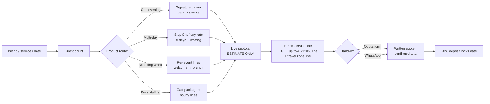

## 5. Commercial Architecture

The commercial system this chapter specifies is built on one structural fact: myCHEF Hawaii already owns the rarest asset in its market — a published, itemized, per-island tariff — while almost every competitor hides behind "call for quote." On Oʻahu, only JP Private Chef ($325–$595/person), Kenekes ($67.88–$108.88/guest wedding menus), and the marketplaces publish any numbers at all.[^03-16^][^03-36^] On Maui, the published set is Chef Kristin (hourly), Smoke & Spice (course ladder), Lotus Chefs (bands), and Aloha Party Chef ($250–$350/person).[^04-2^][^04-18^][^04-5^][^04-15^] Kauaʻi has two of fourteen local operators publishing.[^05-1^][^05-5^] Hawaiʻi Island has exactly one price floor — Chef Rio's "$175 per person" start.[^06-3^] The rebuild's commercial job is therefore not to invent a pricing strategy but to *systematize* the one that exists: anchor every number to the approved published cards, wrap them in the sister-network's worked-math and estimator mechanics, and mark every number that is not yet published as **PRICE REQUIRES APPROVAL**.

Three design principles govern everything below. First, the written quote is the confirmed total; every web price is a published tariff line, never a teaser.[^01-8^] Second, the fee stack (20% service charge, GET up to 4.7120%, 50% deposit, voluntary gratuity, travel zone lines) is displayed as separate lines everywhere — it is legally literate and competitors actively fumble it (resorts charge 23–25% service; one Kauaʻi venue adds "25% gratuity… to all food & drinks").[^01-19^][^06-36^][^06-15^][^05-17^] Third, no price appears on the site that is not already published myCHEF policy or traceable competitor evidence; anything else carries an approval flag.

### 5.1 Pricing Architecture

#### 5.1.1 Recommended pricing structure per island anchored to sourced competitor evidence

The recommendation is to hold the published cards as the architecture and fix their known defects — the Big Island "from $125" hero contradicting its own $150 CORE / $110 ENTRY card, and the Table/ENTRY naming drift between hub and island hosts.[^01-7^] The evidence says the published bands are correctly positioned: on every island the Signature/CORE band sits at or slightly above the marketplace band, and below the ultra-premium independents — the defensible middle-luxury slot.

| Island | myCHEF published band (VERIFIED, currently published) | Marketplace anchor (Take a Chef, published tiers) | Local operator anchors (published) | Positioning verdict |
|---|---|---|---|---|
| Oʻahu | Signature $125–$190/guest; Table $95–$125; Premium $190–$275; Chef's table $275–$400+; Stay Chef from $850/day; Date Night from $450 [^01-21^] | $110–$149/pp by group size; average booked menu $190.6/pp (reflects menu choices/add-ons, not a tier) [^07-5^] | JP Private Chef $325–$595/pp [^03-16^]; Kenekes wedding menus $67.88–$108.88/guest [^03-36^] | CORE overlaps Take a Chef's *booked average* while beating its tier opacity; Chef's table undercuts JP's $325 floor |
| Maui | Villa dinner $150–$250/guest; Stay Chef from $1,050/day; Date Night from $500+; Packaged cart from $800/4 hr [^01-5^] | $119–$171/pp; average booked ~$175/pp [^07-2^] | Smoke & Spice $125–$170 course ladder, $250 chef's table [^04-18^]; Lotus $75–$200+/pp/meal, $165+ fine dining [^04-5^]; Chef Matt $250–$350/pp [^04-15^] | Band brackets the market's entire credible range; premium headroom proven by Chef Matt's $250–$350 |
| Kauaʻi | Signature $150–$250/guest; Table $125–$150; Premium $250–$350; Chef's table $350+; Stay Chef from $1,100/day; Date Night $650–$950 [^01-23^] | $118–$210/pp; average booked ~$176/pp [^07-3^] | Kauaʻi Cut $200–$250/pp five-course [^05-5^]; Dani Felix $125/hr + assistant $50–$60/hr, food separate [^05-1^] | CORE undercuts the island's only published per-person independent while the day rate is the only published multi-day rate in-market |
| Hawaiʻi Island | CORE $150–$225/guest; ENTRY from $110; Stay Chef from $950/day; Date Night from $550; Packaged cart from $725/4 hr [^01-7^] | $106–$169/pp; average booked ~$176/pp [^07-4^] | Rio Miceli from $175/pp [^06-3^]; typical private dinner $150–$250+/pp for 4–8 guests [^06-4^] | $110–$225 occupies the gap between marketplace mid-market ($106–$176) and Rio's $175 floor; hero "$125" inconsistency must be fixed, not migrated |

The table shows the bands are not arbitrary. Where a marketplace publishes $106–$210/pp, myCHEF's $125–$250 reads as premium-but-rational; where independents publish $115–$150/hour for chef labor (Chef Kristin $115/hr Hawaiʻi rate; Dani Felix $125/hr regular, $150/hr holiday), myCHEF's per-guest packaging converts the same labor economics into a format a villa guest can actually compare.[^07-12^][^07-13^] Two structural advantages should be preserved verbatim. One, groceries-inside-the-band on the dinner card versus the market norm of "FOOD COST IS SEPARATE FROM HOURLY LABOR COSTS" — the all-in band removes the single largest quote-variance anxiety.[^01-21^][^07-13^] Two, per-island differentiation is validated by the market itself: Take a Chef's own per-island variation (Kauaʻi two-person $210 vs Big Island $169) proves island-specific rate cards match how the product is actually bought.[^07-3^][^07-4^] No new island price is proposed anywhere in this chapter; where packaging below implies a number not on the published cards, it is flagged **PRICE REQUIRES APPROVAL**.

The chart makes the strategic point visually: on Maui and Kauaʻi the myCHEF band deliberately extends above the marketplace ceiling — that is where the estate/villa buyer lives — while on Hawaiʻi Island the ENTRY-from-$110 line contests the marketplace's own floor ($106) from above. The diamonds (Take a Chef's *average booked* menu, ~$175–$176 on three islands and $190.6 on Oʻahu) sit inside or just above the myCHEF band on every island: the market's revealed willingness to pay already validates the published cards.[^07-2^][^07-3^][^07-4^][^07-5^]

#### 5.1.2 Price-page system: tables by guest count, included/excluded lines, service charge + GET treatment

Each island `/pricing` page (plus the hub "tariff" page) should follow one anatomy, adapted from the sister sites' proven blocks — the Bali guest-count multiplication table and the Dubai cost-driver section are the two highest-value imports.[^02-13^][^02-4^]

| # | Block | Spec | Source pattern |
|---|---|---|---|
| 1 | Hero rate card | Four tiers (Table / Signature / Premium / Chef's table) with per-guest bands, groceries-included flag, per-island | Existing published cards [^01-21^][^01-23^] |
| 2 | Worked-math table | Per-person price × guest count grid (2 / 4 / 8 / 12 guests) at band midpoint and band edges, labeled "illustrative math on published rates" | Bali multiplication table [^02-13^] |
| 3 | Included / separate twin lists | Included: menu design, same-day shopping, cooking, table service, cleanup, groceries inside the band. Separate: staffing hourlys (server $55/hr, sous $75/hr, 4-hr floor), bar cart, travel zone lines, rentals | Published cards + sister twin lists [^01-21^][^02-4^] |
| 4 | Fee-stack block (named, taught) | 20% service charge (distributed to staff or disclosed in writing — HRS §481B-14 posture); GET up to 4.7120% as its own line, valid through 12/31/2030, never the obsolete 4.166%; 50% deposit locks the date; gratuity always voluntary | Existing /legal posture, verified against DOTAX [^01-19^][^07-28^][^07-32^] |
| 5 | Travel-zone lines | Base zone free; published flat surcharges (e.g., North Shore/Turtle Bay from $75; Princeville/Poʻipū $50–$75; outside Kona–Kohala from $75; "east side is its own quote") | Published cards; competitor norm $50–$75 flat/day, $100–$500 delivery [^01-21^][^01-23^][^07-13^][^07-20^] |
| 6 | Cost-driver section | What moves the price: guest count, menu, ingredient market prices (Hawaiʻi groceries ~31–53% above mainland), date (holiday premiums are market standard — $150/hr holiday chef rate published by a Kauaʻi competitor), crew size | Dubai cost drivers; sourced cost context [^02-4^][^07-64^][^07-13^] |
| 7 | Comparison row | "Service charge: 20% vs 23–25% resort norm" on wedding/corporate price surfaces | Fairmont Orchid 25%; Papa Kona 23% [^06-36^][^06-15^] |
| 8 | Quote hand-off | "The written quote is the confirmed total — never a chat estimate"; CTA to quote form/WhatsApp with response-time promise (REQUIRES APPROVAL — no Hawaii response-time SLA is published) | Network mantra; sister response-time pattern [^01-8^][^02-1^] |

The worked-math table (block 2) deserves emphasis because it converts the published band into a booking decision without inventing a single new price. Example, using Maui's published $150–$250 band: two guests $300–$500, four guests $600–$1,000, eight guests $1,200–$2,000, twelve guests $1,800–$3,000 — pure arithmetic on approved rates, each cell individually defensible. This is exactly the Bali pattern ("2 guests IDR 1.4M++ · 4 guests IDR 2.8M++") that the network has already proven converts browsers.[^02-13^] The fee-stack block (block 4) is the legal centerpiece: HRS §481B-14 requires that a service charge either be distributed to staff as tip income or be conspicuously disclosed as covering other costs, and a mandatory charge may never be labeled a gratuity.[^07-32^][^07-33^] The exact disclosure wording is **REQUIRES LEGAL VERIFICATION** before copy lock, as is the status of SB1256-successor legislation (the 2025 bill died in committee, but 2026-session outcomes need confirmation).[^07-34^] The GET line is verified accurate as published — 4.5% owed in all four counties, 4.7120% maximum visible pass-on, county surcharges sunset 12/31/2030 — which means the pass-on line needs a scheduled review date in the CMS, not just a hard-coded sentence.[^07-28^] Competitor behavior makes this block a conversion asset, not compliance hygiene: Tailor Made buries "GE TAX 20% Service Charge & Labor & rentals" in fine print, and A Catered Experience's plain "20% service fee and 4.712% tax added to total" is the market's only comparable act of clarity.[^03-37^][^07-21^]

#### 5.1.3 Interactive estimator concept with "estimate only" framing; PRICE REQUIRES APPROVAL flags

Both sister sites run embedded estimators that hand off to a human-confirmed written quote: Bali's `/pricing` estimator (service type → guest range → duration → add-ons → live subtotal → "Get exact quote on WhatsApp") and Dubai's plan-builder ("Send this plan to myCHEF" — coordinator confirms the exact figure in writing).[^02-13^][^02-4^] Hawaii should adopt the mechanics with one structural difference: the estimator's price logic must be generated *from the published rate card as data* (tiers × guest count + staffing hourlys + travel zone + 20% + GET), so the tool can never output a number the tariff does not contain. Any derived convenience figure the card does not already imply — a per-person/day blended rate, a package bundle total, a volume-discount price — is **PRICE REQUIRES APPROVAL** until the business confirms it.

The "estimate only" framing is not hedging; it is the brand's existing promise made interactive — "the written quote is the confirmed total — never a chat estimate."[^01-8^] Two microcopy requirements follow. First, the estimator must show the fee stack as separate computed lines (never a single all-in number), teaching the notation the way Bali teaches "++" with a dedicated FAQ entry.[^02-14^] Second, it must degrade honestly: for quote-only geographies (Pāʻia/Haʻikū, far-North Hāʻena, Big Island east side) the estimator returns the published "quoted at inquiry" stance with the operational reason — per-island DOH permits, drive times, roster depth — rather than a fake number.[^01-5^][^01-23^][^07-41^] That honesty is itself a differentiator: no competitor explains *why* coverage is zoned, and the explanation (no inter-island vehicle ferry, $1,000–$2,500 barge moves, $80–$120 inter-island flights, 2.5–3 hr Kona–Hilo drive) converts a limitation into proof of operational literacy.[^07-41^][^07-72^][^06-24^]

### 5.2 Product and Menu Architecture

#### 5.2.1 Packaged products (Arrival Night Dinner, Chef for a Week, Sunset Dinner, etc.) with specs

The packaging grammar comes from the sister sites — occasion-named, guest-count-anchored cards with "From $X," a one-sentence scope, a "Best for:" line, and a per-card CTA — but every package name and price below maps onto an already-published myCHEF line, so the catalog adds merchandising clarity without inventing a single rate.[^02-1^][^02-5^] Packages are entry points into the tariff, not new prices: each card's "from" figure is a verbatim published number, and any bundle total is **PRICE REQUIRES APPROVAL**.

| Package (proposed card name) | Maps to published line | Guests / duration | Published "from" price | What's inside the band | Best for |
|---|---|---|---|---|---|
| **Arrival Night Dinner** | Signature/CORE dinner | 4–12, one evening | $125/guest Oʻahu · $150 Maui, Kauaʻi, Hawaiʻi Island [^01-8^] | Menu design, same-day shopping, cooking, table service, cleanup; groceries inside the band [^01-21^] | Villa groups' first night — the highest-frequency use case in the market |
| **Sunset Dinner (Date Night)** | Date Night / dinner for two / elopement | 2, one evening | $450 Oʻahu · $500+ Maui · $650–$950 Kauaʻi · $550 Hawaiʻi Island [^01-21^][^01-5^][^01-23^][^01-7^] | Fixed-price coursed evening for two; premium island bands reflect thin two-person economics (Take a Chef charges $210/pp for two on Kauaʻi vs $118 at 7–12) [^07-3^] | Honeymoons, proposals, anniversaries |
| **Chef for a Week (Stay Chef)** | Stay Chef day rate | Multi-day, villa kitchen | $850/day Oʻahu · $1,050 Maui · $1,100 Kauaʻi · $950 Hawaiʻi Island [^01-8^] | Full-day chef; groceries billed at cost with receipts; extra meals quoted same-day [^01-4^] | Week-long villa stays; the only published multi-day chef product in the state |
| **Family Feast** | Signature dinner, family-style format | 6–12, one evening | Same bands as Signature dinner [^01-8^] | Family-style/plated coursed dinner; kids-menus line exists network-wide [^01-2^] | Multi-generational groups |
| **Wedding Week** | Wedding week lines | 10–75 guests, 3–5 events | From $125/pp Oʻahu · $150 Maui & Hawaiʻi Island · $175 Kauaʻi, + staffing [^01-21^][^04-44^][^01-23^][^01-7^] | See §5.3.1 — welcome, rehearsal, ceremony-adjacent, reception, recovery brunch as separate lines | Destination-wedding couples at estates/villas |
| **Packaged Cart (bar)** | Mobile bar package | Add-on, 4 hr | $650/4 hr + $45/guest Oʻahu · $800/4 hr Maui · $725/4 hr Hawaiʻi Island · $850/4 hr + $60/guest Kauaʻi [^01-21^][^01-5^][^01-7^][^01-23^] | Cart + bartender service; **alcohol itself is BYO/referral — see legal flag below** | Receptions, villa parties |
| **Kamaʻāina Weekly** | Weekly meal-prep / resident line | Resident household, recurring | From $300/wk Oʻahu (to $1,200); from $550–$1,200/wk Kauaʻi [^01-21^][^01-23^] | Weekly household cook day + groceries at cost | Residents — the retention and shoulder-season revenue floor |
| **Recovery Brunch / Day-After** | Wedding-week brunch line | 10–40, morning | Priced within wedding-week lines (per-guest food + staffing) [^01-8^] | Brunch service, cleanup | Wedding parties; standalone whitespace term |
| **Retreat Full-Board** | Stay Chef + per-person/day | 8–16, 3–7 days | Stay Chef day rate + vacation-chef per-person/day ($179–$300+ Oʻahu; $250–$300+ Kauaʻi) [^01-21^][^01-23^] | Multi-day meal plans; dietary-protocol depth (§5.2.2) | Retreat hosts (B2B) — Kauaʻi and Big Island first |

Two catalog rules. First, every card carries a "what's separate" line — staffing hourlys, travel zone, 20% service, GET — because the twin-list pattern is what makes the published band trustworthy rather than teaser-like.[^02-4^] Second, the bar cart requires the alcohol posture to be printed on the card: Hawaiʻi's county-level liquor licensing (Class 13 caterer license, Maui rules requiring 30% food revenue, seven-working-day event notice, no charging patrons for drinks, $1M liquor liability) means myCHEF's alcohol model is client-BYO plus referral to licensed bartending companies — the same posture A Catered Experience publishes verbatim — and whether a private chef may pour client-supplied alcohol is **REQUIRES LEGAL VERIFICATION** per county Liquor Commission.[^07-38^][^07-21^] This flag is the highest-priority legal item in the commercial system precisely because the Packaged Cart is already a published, selling product.

The catalog deliberately holds at nine cards. The sister sites show the failure mode of over-cataloging: Bali runs 24 set menus and Dubai runs seven occasion packages, but both anchor everything to two core products with "add-ons… not equal heroes."[^02-16^][^02-10^] Hawaii's two cores are the Signature dinner (one evening, per-guest) and Stay Chef (multi-day, per-day); every other card routes back to one of them, which keeps the quote funnel's conditional logic simple and prevents the catalog from becoming a second, shadow price list that can drift out of sync with the tariff.

#### 5.2.2 Menu/cuisine architecture: real menu concepts, dietary system, per-island emphasis

Menu architecture should follow the Bali card anatomy — named menu, course-by-course listing, per-guest price, dietary-adaptability flags, priced add-ons — populated with the provenance vocabulary each island's market already rewards.[^02-16^] The existing site's sample menus (ahi poke, miso-glazed/macadamia-crusted catch, lilikoi cheesecake) are the seed; the rebuild turns them into a filterable catalog of named island menus.[^01-4^]

| Island | Menu emphasis (provenance-led) | Sourcing vocabulary the market uses | Reference menu concept (spec) |
|---|---|---|---|
| Oʻahu | Metropolitan Pacific + Japanese-language demand (in-suite kaiseki demand proven at ESPACIO; JP publishes tasting menus at $325–$595/pp and lists a 27-course kaiseki (price on inquiry)) [^03-48^][^03-16^] | Kahuku/seafood, Chinatown market, condo-galley logistics | "Gold Coast Signature" — 4-course Pacific; "Omakase at Home" tier for Chef's table band ($275–$400+/pp) [^01-21^] |
| Maui | Resort-corridor luxury; canoe-crop storytelling (taro, coconut, sweet potato, breadfruit) used by the island's most-reviewed chef [^04-8^] | Upcountry farms, 80%-local sourcing claim is the luxury marker (Lotus) [^04-4^] | "Wailea Sunset" — macadamia-crusted catch, lilikoi finish; plated $150–$250 band matches the $120–$200 plated wedding norm [^04-52^] |
| Kauaʻi | Organic estate / farm-to-table — the island's entire credible competitor set leads with farm names | Hanalei Farmers' Market (~25 mostly-organic farmers), Kunana Dairy goat cheese, Govinda's Farm, Kauaʻi grass-fed beef [^05-70^][^05-1^] | "Hanalei Table" — 5-course farm-to-table (Kauaʻi Cut sells this format at $200–$250/pp, validating the Premium band) [^05-5^] |
| Hawaiʻi Island | Provenance-as-itinerary: 8–11 climate zones on one island | Waimea strawberries, Parker Ranch beef, Hamakua mushrooms/chocolate, Kona Cold lobster, Kona coffee (origin-labeling law content already on site) [^06-3^][^01-7^] | "Kohala Coast" — Rio Chef's named-menu precedent (native-bird menu names) proves the format sells at $175+/pp [^06-3^] |

The dietary system is table stakes, not a differentiator — every serious competitor markets GF/vegan/keto competence — so the rebuild should implement it as infrastructure: a dietary-capability matrix (Dubai's 11-badge model: Vegetarian, Vegan, Gluten-Free, Halal, Kosher, Dairy-Free, Nut-Free, Keto, Pescatarian, Low-Sodium, Diabetic-Friendly) rendered as flags on every menu card, with separate-prep-zone handling described once, centrally.[^02-5^][^04-1^] Where dietary depth *is* a differentiator is the retreat segment: Kauaʻi operators and venues use protocol vocabulary (Chef Leo lists "Vegetarian, Raw, Vegan, Gluten Free, Ayurvedic, Detox, & Paleo"; Lotus owns Maui's wellness niche) and the retreat-catering SERP is empty — "retreat catering Kauai" returns zero dedicated results while retreats with $2,000–$4,499 tickets already hire private chefs (Come Together Wellness includes a 5-day private-chef culinary experience).[^05-11^][^05-35^][^05-36^] A dedicated retreat menu family (plant-based forward, protocol-labeled, multi-day meal-plan structured) is therefore a named product line, not a checkbox — and it feeds the B2B architecture in §5.4.

### 5.3 Wedding Architecture

#### 5.3.1 Wedding-week product system (welcome, rehearsal, reception, recovery brunch)

The whitespace is verified and unusual: the multi-meal destination-wedding pattern (welcome dinner → rehearsal → ceremony-adjacent service → reception → recovery brunch) is documented across independent Maui sources — CJ's bundles welcome BBQ + reception + day-after brunch, Ritz-Carlton Kapalua markets welcome party/rehearsal/farewell brunch, Lotus runs a "bridal weekend," Raffin sells rehearsal dinners and post-wedding brunches — yet no competitor sells the week as one culinary contract.[^04-30^][^04-92^][^04-3^][^04-95^] myCHEF already productizes exactly this and publishes the only wedding-week rate lines in the state.[^01-8^] The rebuild should formalize the week as a five-line product system with per-format child pages (welcome-dinner, rehearsal-dinner, recovery-brunch), each of which has near-zero dedicated SERP competition.[^04-30^][^04-44^]

| Wedding-week line | Format spec | Price basis (published) | Competitive anchor |
|---|---|---|---|
| Welcome dinner | Family-style or buffet, 20–75 guests, arrival-evening timing | Per-guest wedding line: from $125 Oʻahu / $150 Maui & Hawaiʻi Island / $175 Kauaʻi + staffing [^01-21^][^04-44^][^01-23^] | CJ's "welcome BBQ" is the only bundled analogue; sold piecemeal elsewhere [^04-30^] |
| Rehearsal dinner | Plated or family-style, 12–40 guests, villa/estate kitchen | Same per-guest line; staffing $55/hr server, $75/hr sous, 4-hr floor [^01-21^] | Planner per-format pages near-absent statewide; Ania's Table targets ≤40-guest rehearsal events on Kauaʻi with no pricing [^05-6^] |
| Ceremony-adjacent service | Pūpū/cocktail-hour service between ceremony and reception | Per-guest + staffing hourlys | Documented in the myCHEF week product; no competitor page [^04-44^] |
| Reception | Plated (2–3 courses) or premium buffet, 30–75 guests; >75 is a written exception, never implied standard [^01-18^] | From $150–$175/guest island-dependent + staffing; Maui plated market norm $120–$200/pp [^04-52^] | Oʻahu buffet basis $60–$75/head + staffing/fees [^07-22^]; Kauaʻi estate average ~$75/pp + staffing/rentals/fees [^05-34^]; resorts $120–$250+/pp with F&B minimums $7,500–$15,000 [^06-36^][^06-35^] |
| Recovery brunch | Day-after brunch, 10–40 guests, late-morning | Per-guest + staffing within the week lines | CJ's "day after wedding brunch" and Ritz "farewell brunch" prove the meal; nobody prices it [^04-30^][^04-92^] |

The economic argument for contracting the week is quantifiable and should be published as a worked budget (illustrative math on published rates). Take a Maui week for 60 guests: welcome dinner (60 × $150 = $9,000), rehearsal (30 × $150 = $4,500), reception (60 × $200 mid-band = $12,000), recovery brunch (40 × $150 = $6,000) — $31,500 in food lines before staffing, service, and GET, all inside published bands. Against the alternative — resort F&B minimums of $7,500–$15,000 *per event* plus 23–25% service charges — the myCHEF week undercuts structurally: 20% service versus the Fairmont Orchid's 25% and Papa Kona's 23% is a five-point saving on every food dollar, worth $1,575 on that $31,500 example.[^06-35^][^06-36^][^06-15^] One governance flag: the site's cancellation tiers (28+ days partial refund; 14–28 deposit retained; under 7 days full balance; force-majeure reschedules rather than forfeits) are explicitly "proposed, pending attorney review" — they must render as *proposed* terms in wedding-week copy until counsel finalizes the booking terms, which matters more here than anywhere because a wedding week is the largest single contract the site sells.[^01-19^]

#### 5.3.2 Per-island wedding depth decision driven by demand evidence (Maui deepest)

Wedding content depth should be allocated by evidence, not symmetrically across four islands. The safest cross-year reading of the two wedding data series is ≈17,000–18,500 weddings per year statewide, with Honolulu hosting more than half and Maui a clear second; the 2025 market estimate is 17,370 weddings / $927M / average $53,369 / median $21,117 / 74–84 guests.[^07-60^][^07-61^] Depth below means page count, per-format children, and planner-channel investment.

| Island | Demand evidence | Structural drivers | Depth decision |
|---|---|---|---|
| Maui | #2 island by wedding count (4,659 in 2021, DOH-based series); top-25 global destination-wedding location; vendor-directory estimate $25–35k per wedding [^04-49^][^07-62^][^04-51^] | DLNR beach permits cap ceremonies at ~20–25 people with no structures → receptions migrate to estates/villas with kitchens; estate venues gate via approved planners; published Maui catering norms $80–$120 buffet / $120–$200 plated [^04-53^][^04-52^] | **Deepest**: full wedding-week system + all per-format child pages + corridor wedding pages (Wailea, Kāʻanapali, Kapalua, Makena) + planner partnership program |
| Oʻahu | Largest volume: 9,943 of 18,498 (2021) — >50% of the state [^07-61^] | Volume is resident-weighted; buffet catering norms lower ($60–$75/head); venue exclusivity locks resort/valley catering (Ke Nui Kitchen at Waimea Valley) [^07-22^][^03-66^] | **Deep but different skew**: estate/villa/elopement chef dinners + Ko Olina/North Shore corridors; avoid head-on ballroom catering |
| Kauaʻi | 2,072 weddings in 2025, $107.2M, avg $51,719, 85–95 guests — growing while the state series fell (different methodologies; cite with years) [^05-33^] | Estate-wedding identity ("secluded beaches, private estates"); estate catering ~$75/pp average leaves headroom under the $175 published line [^05-34^] | **Medium**: wedding-week page + elopement (published per-event $650–$950) + rehearsal/recovery children; North/South shore split pages |
| Hawaiʻi Island | 2,209 weddings (2021); resort circuit captive (FS Hualalai packages $12,500–$21,500; Fairmont $5,000–$15,000 + $8,500–$15,000 F&B minimums) [^07-61^][^06-38^][^06-36^] | Outside chefs enter via villa weddings, rehearsal dinners, and wedding-week meals — exactly the published product; no island competitor publishes any equivalent [^06-24^] | **Focused**: wedding-week page + Kona–Kohala corridor emphasis; east side stays quote-only |

The asymmetry is the point. Maui gets the deepest architecture because three independent forces converge there: the highest destination-wedding brand equity, the DLNR permit cap that structurally pushes receptions into catered villas, and published catering norms ($120–$200 plated) that sit exactly inside myCHEF's band.[^04-53^][^04-52^] Oʻahu's volume is real but channel-locked — exclusive-caterer venues and resort ballrooms absorb the top of the market, so the winnable wedge is the estate/elopement dinner, not the 200-guest reception.[^03-66^] Kauaʻi's wedding economics favor the estate week but the island's thin chef labor pool (yhangry claims 17 chefs county-wide — a platform-boilerplate figure used here only as a supply-side signal; Take a Chef lists 23–24 including Oʻahu fly-ins) means wedding promises must stay within published inquiry-stage honesty until a crew exists.[^05-23^][^05-20^] Hawaiʻi Island's resort circuit is captive, but that is precisely why the villa wedding week is open — the published "from $150/guest + staffing" line has no local published competitor at all.[^06-24^]

### 5.4 Vacation-Chef and Long-Stay Architecture

#### 5.4.1 Vacation-rental/villa-chef product logic, kitchen-requirement honesty, multi-day pricing models

The vacation-rental guest is the highest-lifetime-value segment in the market, and the SERP for "private chef for vacation rental Hawaii" is owned by rental-company concierge pages (Parrish, Ali'i Resorts, EVRHI, Exceptional Villas) — no chef company ranks with a dedicated page.[^08-18^][^08-20^] The demand base is structural: roughly 26–38% of visitors stay in kitchen-equipped lodging (condominiums 13.8%, timeshares 12.4%, rental homes 11.7% among U.S. West visitors, June 2026), and December 2025 vacation-rental ADRs ran $408–$632/night by island — guests already spending $3,000–$4,500 per week on lodging, for whom a $150–$250/pp chef dinner is a marginal add-on.[^07-52^][^07-57^] The product logic has three layers, all built on published lines.

**Layer 1 — the dinner entry.** Arrival Night Dinner (§5.2.1) is the conversion product; every villa-corridor page leads with it, priced in-title where the current site already proves the pattern (corridor titles like "Private chef Wailea Maui — from $150/pp").[^01-14^]

**Layer 2 — the stay rhythm.** Stay Chef is the only published multi-day chef product in the state: from $850/day Oʻahu, $1,050 Maui, $1,100 Kauaʻi, $950 Hawaiʻi Island, with groceries billed at cost with receipts.[^01-8^] The sister-network precedent for volume pricing (Bali: weekly −10%, monthly −20%) is a proven mechanic, but Hawaii has no published stay-chef discount, so any weekly/monthly discount tier is **PRICE REQUIRES APPROVAL**.[^02-13^] The vacation-chef per-person/day bands ($179–$300+ Oʻahu; $250–$300+ Kauaʻi) cover the full-board variant, matching the only comparable published market rate (Lotus Maui, $179–$300+/person/full day).[^01-21^][^01-23^][^04-5^]

**Layer 3 — the kitchen gate.** Kitchen-requirement honesty is a published brand asset and must stay: "We will not pretend a coffee maker and a minibar are a pass" — hotel rooms without kitchens are declined, and Waikīkī condo load-ins (COI, freight elevators) and Ko Olina provisioning runs are published logistics content no competitor matches.[^01-1^][^01-4^] This is the trust block that converts the concierge channel: villa managers (Pure Kauai, Poipu Kapili, Kona Sunsets' "Personal Chef Package," Epicurate) control the estate-guest funnel on every island, and a B2B partner silo modeled on the sisters' `/partners/villa-rentals` and `/staffing/for-villa-managers` pages is the distribution play that outlives any single keyword ranking.[^05-25^][^05-27^][^06-29^][^02-11^]

| Multi-day model | Price basis | Billing spec | Status |
|---|---|---|---|
| Stay Chef day rate | From $850–$1,100/day by island [^01-8^] | Day rate + groceries at cost with receipts; extra meals quoted same-day | Published — VERIFIED |
| Vacation-chef per-person/day | $179–$300+ Oʻahu; $250–$300+ Kauaʻi [^01-21^][^01-23^] | Per-person/day program for full-board stays | Published — VERIFIED |
| Weekly/monthly volume discount | Bali precedent −10%/−20% [^02-13^] | Would apply to 5+ day and 20+ day engagements | **PRICE REQUIRES APPROVAL** — no Hawaii discount is published |
| Retreat full-board | Stay Chef day rate + per-person/day bands | Host-contracted, 3–7 days, protocol-labeled menus; host = repeat B2B buyer | Architecture only; bundle total **PRICE REQUIRES APPROVAL** |
| Kamaʻāina weekly (resident) | From $300/wk Oʻahu; $550–$1,200/wk Kauaʻi [^01-21^][^01-23^] | Weekly cook day + groceries at cost | Published — VERIFIED |

The table's mixed status column is deliberate: it shows that the multi-day architecture is 80% already-approved pricing and 20% packaging decisions. The only genuinely new commercial moves — the volume-discount tier and the retreat bundle total — are isolated, flagged, and small. The scale of the un-approved piece is easy to bound before sign-off: applying Bali's −10% weekly precedent to the published Kauaʻi Stay Chef rate would price a seven-day engagement at $6,930 instead of $7,700 (illustrative math on the published $1,100/day rate; **PRICE REQUIRES APPROVAL**), so the approval decision is a margin question worth roughly one day's revenue per booking week — not a pricing-model redesign.[^02-13^][^01-8^] The concierge channel adds a second decision: villa-manager referrals (Pure Kauai, Kona Sunsets) imply commission or net-rate billing to the partner rather than the guest, and no commission structure is published anywhere in the myCHEF system — that, too, sits behind the approval gate rather than in this architecture. Everything else is merchandising of the existing tariff, which is why this architecture can ship with the rebuild rather than waiting on a pricing committee.

#### 5.4.2 Customer-journey segmentation (couples, families, wedding parties, retreats, B2B/concierge)

The quote funnel's governing rule is conditional logic: a romantic-dinner inquiry must not face a 40-field wedding questionnaire. Each segment gets one primary and one secondary CTA per page type, with the form asking the minimum the network already proves is enough — date, island/area, guest count ("that is enough to start" is the Dubai pattern; the current Hawaii form is already five fields).[^02-1^][^01-9^]

| Segment | Entry pages | Primary CTA | Secondary CTA | Quote-funnel branch |
|---|---|---|---|---|
| Couples (honeymoon/anniversary/proposal) | Sunset Dinner / Date Night cards; honeymoon-dinners pages | "Price my dinner for two" (estimator, fixed-price bands) | WhatsApp with date + island | 4 fields: date, island, dietary, occasion note |
| Families / multi-gen groups | Arrival Night Dinner; Family Feast; kids-menus | "Get my dinner quote" (worked-math table above fold) | Chef for a Week cross-sell | Guest count drives band math; kitchen-check question included |
| Villa / vacation-rental guests | Corridor pages; vacation-rental chef page type | "Chef for my stay" (Stay Chef estimator) | Single Arrival Night Dinner | Stay-length branch: 1 evening vs multi-day vs full week |
| Wedding couples | /weddings; wedding-week page + per-format children | "Build my wedding week" (multi-event brief) | Planner hand-off / WhatsApp | Multi-line brief: events × guests × dates; >75 guests flags written-exception copy |
| Wedding planners (B2B) | Planner/partner silo page | Partner inquiry (named-coordinator model as real team exists) | Rate-card PDF request | Separate B2B path — no consumer estimator; estate-venue logistics questions |
| Retreat organizers (B2B) | Retreat-catering page per island (Kauaʻi, Big Island first) | "Quote my retreat" (dates × headcount × protocol) | Menu-family download | Multi-day branch; dietary-protocol selector; kitchen/venue capability questions |
| Concierge / property managers (B2B) | Partner silo (villa managers, concierges) | Partnership application | WhatsApp direct line | B2B brief: portfolio, service areas, referral mechanics — modeled on sister partner silos [^02-11^] |
| Corporate | /corporate-catering; Oʻahu convention-displacement content | Event quote brief | Staffing-only line (servers/bartenders hourly) | Headcount × format; staffing-hourly math exposed |
| Kamaʻāina residents | Weekly-line pages (Oʻahu deepest) | "Start my weekly plan" | One-off dinner trial | Recurring branch: frequency × household size; groceries-at-cost explainer |

Three implementation notes. First, the two-field occasion router (occasion × guest count → "Point us at the table. We will name the package.") should sit on every island homepage and pricing page — it is the cheapest proven routing mechanic in the network and it directly feeds the conditional funnel.[^02-6^] Second, B2B segments (planners, concierges, retreat hosts) must not be squeezed through the consumer estimator; they get their own path-cards, because "one inbox for everything is how messages get lost."[^02-8^] Third, every CTA carries the reassurance microcopy the sisters prove at the point of click — no obligation, 50% deposit only, full cleanup, the written quote is the confirmed total — plus a response-time promise, which is the one element requiring business sign-off (**REQUIRES APPROVAL**: no Hawaii response-time SLA is currently published; the sisters publish 15-minute and 2-hour promises).[^02-1^][^02-14^]

The commercial architecture this chapter specifies is deliberately conservative in its numbers and aggressive in its packaging: every rate is already published and approved, while the merchandising layer — worked math, estimators, the wedding week, the stay rhythm, the B2B silos — is imported from sister properties where it already converts. Chapter 4's sitemaps already hang from this spine; Chapters 6 and 7 should treat these product systems as fixed inputs to design and build sequencing.

---

### Sources

[^01-1^] myCHEF Hawaii — hub homepage — https://mychef-hawaii.com/ (accessed 2026-09-06)
[^01-2^] myCHEF Hawaii — network-wide sitemap (service inventory incl. kids-menus URLs) — https://mychef-hawaii.com/sitemap.xml (accessed 2026-09-06)
[^01-4^] myCHEF Hawaii — Oʻahu homepage — https://oahu.mychef-hawaii.com/ (accessed 2026-09-06)
[^01-5^] myCHEF Hawaii — Maui homepage — https://maui.mychef-hawaii.com/ (accessed 2026-09-06)
[^01-7^] myCHEF Hawaii — Hawaiʻi Island homepage — https://bigisland.mychef-hawaii.com/ (accessed 2026-09-06)
[^01-8^] myCHEF Hawaii — statewide tariff — https://mychef-hawaii.com/pricing (accessed 2026-09-06)
[^01-9^] myCHEF Hawaii — quote mechanism — https://mychef-hawaii.com/quote (accessed 2026-09-06)
[^01-14^] myCHEF Hawaii — Wailea corridor page sample — https://maui.mychef-hawaii.com/wailea (accessed 2026-09-06)
[^01-18^] myCHEF Hawaii — catering service page — https://mychef-hawaii.com/catering (accessed 2026-09-06)
[^01-19^] myCHEF Hawaii — legal/booking notes (GET, HRS §481B-14, cancellation posture) — https://mychef-hawaii.com/legal (accessed 2026-09-06)
[^01-21^] myCHEF Hawaii — Oʻahu rate card — https://oahu.mychef-hawaii.com/pricing (accessed 2026-09-06)
[^01-23^] myCHEF Hawaii — Kauaʻi rate card — https://kauai.mychef-hawaii.com/pricing (accessed 2026-09-06)
[^02-1^] myCHEF Dubai — homepage — https://mychef.ae (accessed 2026-09-06)
[^02-4^] myCHEF Dubai — private chef pricing (four-job table, calculator, cost drivers, policies) — https://www.mychef.ae/private-chef-dubai/pricing (accessed 2026-09-06)
[^02-5^] myCHEF Dubai — menus (starter packages, per-person format rates, dietary matrix) — https://www.mychef.ae/menus (accessed 2026-09-06)
[^02-6^] myCHEF Dubai — catering packages hub, occasion router — https://www.mychef.ae/catering-packages-dubai (accessed 2026-09-06)
[^02-8^] myCHEF Dubai — contact (enquiry routing, minimal quote brief) — https://www.mychef.ae/contact (accessed 2026-09-06)
[^02-10^] myCHEF Bali — homepage (stay vs one-meal split, guarantees, add-ons framing) — https://mychef.id/ (accessed 2026-09-06)
[^02-11^] myCHEF Bali — sitemap (~200 URLs; /staffing /partners silos) — https://mychef.id/sitemap.xml (accessed 2026-09-06)
[^02-13^] myCHEF Bali — pricing (rate table, embedded estimator, guest-count math) — https://mychef.id/pricing (accessed 2026-09-06)
[^02-14^] myCHEF Bali — FAQ ("++" explanation, deposit/cancellation tiers) — https://mychef.id/faq (accessed 2026-09-06)
[^02-16^] myCHEF Bali — fine-dining menus (24 set menus, course breakdowns, dietary flags) — https://mychef.id/fine-dining/menus (accessed 2026-09-06)
[^03-16^] JP Private Chef Services — menu pricing ($325–$595/pp; 27-course kaiseki) — https://personalchefoahu.com/menu-privatechefoahu (accessed 2026-09-06)
[^03-36^] Kenekes — wedding packages ($67.88–$108.88/guest) — https://www.kenekes.net/catering.html (accessed 2026-09-06)
[^03-37^] Tailor Made Custom Catering — services/fee structure — https://www.tmcustomcatering.com/services (accessed 2026-09-06)
[^03-48^] ESPACIO Waikīkī — in-suite kaiseki private chef experience — https://www.espaciowaikiki.com/experiences/private-chef-experience/ (accessed 2026-09-06)
[^03-66^] Oʻahu wedding venues (Waimea Valley exclusive catering by Ke Nui Kitchen) — https://emilychoyphotography.com/oahu-wedding-venues/ (accessed 2026-09-06)
[^04-1^] Chef Kristin — FAQ (service areas, dietary breadth) — https://www.chefkristin.com/faq/ (accessed 2026-09-06)
[^04-2^] Chef Kristin — services/pricing structure — https://www.chefkristin.com/services/ (accessed 2026-09-06)
[^04-3^] Lotus Chefs — homepage (bridal weekend, retreat services) — https://lotuschefs.com/ (accessed 2026-09-06)
[^04-4^] Lotus Chefs — fine dining ($165/pp start, 80% local sourcing) — https://lotuschefs.com/private-chef-fine-dining-maui/ (accessed 2026-09-06)
[^04-5^] Lotus Chefs — family vacation private chef services ($75–$200+/pp/meal; $179–$300+/pp/day) — https://lotuschefs.com/family-friendly-private-chef-services-maui/ (accessed 2026-09-06)
[^04-8^] Jason Raffin — private chef Maui (story, canoe crops) — https://www.jasonraffin.com/post/private-chef-maui-the-luxury-dining-experience-that-brings-the-restaurant-to-you (accessed 2026-09-06)
[^04-15^] Aloha Party Chef (Chef Matt) — FAQ ($250–$350/pp) — https://alohapartychef.com/faqs-private-chef-maui (accessed 2026-09-06)
[^04-18^] Smoke & Spice Maui — private chef options (course ladder $125–$250) — https://www.smokeandspicemaui.com/mauiprivatechefpricing (accessed 2026-09-06)
[^04-30^] CJ's Maui — all-inclusive wedding package (welcome BBQ + reception + brunch) — https://cjsmaui.com/an-all-inclusive-maui-wedding-package-details-and-bbq-rehearsal-dinner/ (accessed 2026-09-06)
[^04-44^] myCHEF Maui — wedding catering page (wedding-week product + pricing) — https://maui.mychef-hawaii.com/wedding-catering (accessed 2026-09-06)
[^04-49^] HappyLaulea — Hawaii wedding statistics (2021 DOH marriage data) — https://www.happylaulea.com/blogs/articles/hawaii-wedding-statistics (accessed 2026-09-06)
[^04-51^] Maui Wedding Vendors — average wedding $25–35k (vendor-directory estimate) — https://mauiweddingvendors.com/ (accessed 2026-09-06)
[^04-52^] Maui Wedding Vendors — Maui wedding cost (catering/bar per-person table) — https://mauiweddingvendors.com/maui-wedding-cost/ (accessed 2026-09-06)
[^04-53^] Maui Destination Weddings — beach wedding permit guide (DLNR ~20-person cap) — https://mauidestinationweddings.com/maui-beach-wedding-permits-complete-guide-2026/ (accessed 2026-09-06)
[^04-92^] Ritz-Carlton Kapalua wedding-weekend pattern — https://matiasezcurraphotography.com/ritz-carlton-kapalua-a-luxury-maui-wedding-venue/ (accessed 2026-09-06)
[^04-95^] Jason Raffin — private dining Maui (weddings/rehearsal/brunch services) — https://www.jasonraffin.com/privatediningmaui (accessed 2026-09-06)
[^05-1^] Private Chef Kauai (Chef Dani Felix) — rate card, travel fees — http://www.privatechefkauai.com/pricing (accessed 2026-09-06)
[^05-5^] Kauaʻi Cut Catering — $200–$250/pp five-course offering — https://kauaicutcatering.com/ (accessed 2026-09-06)
[^05-6^] Ania's Table — Kauaʻi private chef (≤40-guest events, retreat catering) — https://www.aniastable.com/kauai-private-chef (accessed 2026-09-06)
[^05-11^] Chef Leo Kauaʻi — wedding catering, dietary list — http://chef-leo-kauai.com/events/weddings (accessed 2026-09-06)
[^05-17^] Kauai Poke Co. — catering/site fees (25% gratuity) — https://kauaipokeco.com/cater (accessed 2026-09-06)
[^05-20^] Take a Chef — Kauaʻi (tiers, stats) — https://www.takeachef.com/en-us/private-chef/kauai (accessed 2026-09-06)
[^05-23^] yhangry — Kauaʻi County (chef-count platform claim; boilerplate-flagged) — https://yhangry.com/s/private-chef-jobs/us-hawaii-kauai--county/ (accessed 2026-09-06)
[^05-25^] Pure Kauai — luxury vacation rentals (chef via concierge) — https://sunset.com/travel/travel-directory/pure-kauai-luxury-vacation-rentals (accessed 2026-09-06)
[^05-27^] Poipu Kapili — concierge (private gourmet chef, grocery stocking) — https://poipukapili.com/concierge/kauai-pampering-other-indulgences/ (accessed 2026-09-06)
[^05-33^] The Wedding Report — 2025 Kauaʻi wedding market (2,072 weddings; $51,719 avg) — https://wedding.report/action/wedding_statistics/view/market/id/15007/idtype/c/location/Kauai_HI/ (accessed 2026-09-06)
[^05-34^] Aloha Bridal Connections — Kauaʻi wedding cost breakdown (~$75/pp estate catering) — https://alohabridalconnections.com/what-does-it-cost-to-get-married-on-kauai/ (accessed 2026-09-06)
[^05-35^] BookRetreats — Kauaʻi yoga retreat listings & prices — https://bookretreats.com/s/yoga-retreats/kauai (accessed 2026-09-06)
[^05-36^] Come Together Wellness — Kauaʻi retreats (private-chef culinary experience included) — https://www.cometogetherwellness.com/ (accessed 2026-09-06)
[^05-70^] Hanalei Farmers' Market (~25 organic farmers) — https://agpixart.com/destinations/north-america/kauai-hi/hanalei-princeville/ (accessed 2026-09-06)
[^06-3^] Rio Chef — menus ("Starting prices begin at $175 per person") — https://www.riochef.com/menus (accessed 2026-09-06)
[^06-4^] Rio Chef — Big Island FAQ blog ($150–$250+/pp for 4–8 guests) — https://www.riochef.com/post/private-chef-on-hawaii-s-big-island-your-questions-answered (accessed 2026-09-06)
[^06-15^] Papa Kona Events & Catering — packages, 23% service charge — https://papakonaevents.com/ (accessed 2026-09-06)
[^06-24^] myCHEF Hawaiʻi Island — Big Island rate card — https://bigisland.mychef-hawaii.com/ (accessed 2026-09-06)
[^06-29^] Kona Sunsets vacation rentals — "Personal Chef Package" concierge offering — no public URL captured; directory observation via dim06 [^29^] (accessed 2026-09-06)
[^06-35^] Fairmont Orchid — wedding packages (F&B minimums $7,500–$15,000) — https://www.fairmontorchid.com/gather/weddings/wedding-packages/ (accessed 2026-09-06)
[^06-36^] Here Comes The Guide — Fairmont Orchid ($120/person and up; 25% service charge) — https://www.herecomestheguide.com/wedding-venues/hawaii/fairmont-orchid (accessed 2026-09-06)
[^06-38^] Here Comes The Guide — Four Seasons Resort Hualalai packages ($12,500–$21,500) — https://www.herecomestheguide.com/wedding-venues/hawaii/four-seasons-resort-hualalai (accessed 2026-09-06)
[^07-2^] Take a Chef — Maui (tiers $119–$171; avg ~$175) — https://www.takeachef.com/en-us/private-chef/maui (accessed 2026-09-06)
[^07-3^] Take a Chef — Kauaʻi (tiers $118–$210; avg ~$176) — https://www.takeachef.com/en-us/private-chef/kauai (accessed 2026-09-06)
[^07-4^] Take a Chef — Big Island (tiers $106–$169; avg ~$176) — https://www.takeachef.com/en-us/private-chef/big-island (accessed 2026-09-06)
[^07-5^] Take a Chef — Honolulu (tiers $110–$149; avg booked $190.6; tips 14.72%) — https://www.takeachef.com/en-us/private-chef/honolulu (accessed 2026-09-06)
[^07-12^] Chef Kristin — pricing structure (chef $115/hr HI; sous $75/hr; shopping $55/hr) — https://www.chefkristin.com/services/ (accessed 2026-09-06)
[^07-13^] Private Chef Kauai — pricing ($125/hr; holiday $150/hr; travel fees) — http://www.privatechefkauai.com/pricing (accessed 2026-09-06)
[^07-20^] Papa Kona Events & Catering — Big Island catering (delivery $100–$500; deposit $2,000 or 50%) — https://www.papakonaevents.com/catering (accessed 2026-09-06)
[^07-21^] A Catered Experience — off-site catering (20% service fee + 4.712% tax; no alcohol service) — https://www.acateredexperience.com/off-site-catering/ (accessed 2026-09-06)
[^07-22^] Aloha Bridal Connections — Oʻahu wedding cost ($60–$75/head buffet basis) — https://alohabridalconnections.com/what-does-it-cost-to-get-married-in-hawaii/ (accessed 2026-09-06)
[^07-28^] Hawaii Department of Taxation — county surcharge on GET (4.5% owed; 4.7120% max pass-on; sunset 12/31/2030) — https://tax.hawaii.gov/geninfo/countysurcharge/ (accessed 2026-09-06)
[^07-32^] ILWU Local 142 — HRS §481B-14 service-charge disclosure — https://www.ilwulocal142.org/hawaii-law-requires-service-charge-disclosure (accessed 2026-09-06)
[^07-33^] 7shifts — Hawaii tip laws for employers (2025) — https://www.7shifts.com/blog/hawaii-tip-laws/ (accessed 2026-09-06)
[^07-34^] BillTrack50 — HI SB1256 (2025) mandatory gratuity bill (dead in committee) — https://www.billtrack50.com/billdetail/1796100 (accessed 2026-09-06)
[^07-38^] County of Maui, Dept. of Liquor Control — Rules, Title MC-08 Chapter 101 (Class 13 caterer license) — https://www.mauicounty.gov/DocumentCenter/View/106007/Rules---Chapter-101-PDF (accessed 2026-09-06)
[^07-41^] GetVendorLoop — How to start a food truck in Hawaii (per-island DOH permits; Young Brothers $1,000–$2,500) — https://getvendorloop.com/guides/how-to-start-a-food-truck-in-hawaii (accessed 2026-09-06)
[^07-52^] DBEDT — June 2026 visitor release (U.S. West accommodation mix) — https://dbedt.hawaii.gov/blog/26-50/ (accessed 2026-09-06)
[^07-57^] DBEDT — Hawaii Vacation Rental Performance Report, December 2025 (island ADRs $408–$632) — https://files.hawaii.gov/dbedt/economic/tourism/vacation-rental/hawaii-vacation-rental-performance-2025-12.pdf (accessed 2026-09-06)
[^07-60^] The Wedding Report — 2025 Hawaii wedding market statistics (17,370 weddings; $53,369 avg / $21,117 median) — https://wedding.report/action/wedding_statistics/view/market/id/15/idtype/s/location/Hawaii/ (accessed 2026-09-06)
[^07-61^] HappyLaulea — Hawaii destination wedding facts (2021 DOH: 18,498; Honolulu 9,943; ~60% destination) — https://www.happylaulea.com/blogs/articles/hawaii-wedding-statistics (accessed 2026-09-06)
[^07-62^] Radical Storage — destination wedding statistics (Hitched top-25: Maui) — https://radicalstorage.com/travel/destination-wedding-statistics/ (accessed 2026-09-06)
[^07-64^] Dwell Hawaii — true cost of living in Hawaii 2026 (groceries ~53% above U.S. average) — https://www.dwellhawaii.com/blog/cost-of-living-in-hawaii/ (accessed 2026-09-06)
[^07-72^] Blue Hawaiian Concierge — Hawaii trip costs 2026 (inter-island fares $80–$120) — https://bluehawaiianconcierge.com/blog/what-a-hawaii-trip-actually-costs-in-2026-a-full-price-breakdown-by-island/ (accessed 2026-09-06)
[^08-18^] Google SERP "private chef for vacation rental hawaii" (AI Overview; organic: parrishkauai.com, exceptionalvillas.com, evrhi.com, aliiresorts.com) — https://www.google.com/search?q=private+chef+for+vacation+rental+hawaii (accessed 2026-09-06)
[^08-20^] Parrish Collection Kauai — Private Chefs — https://www.parrishkauai.com/private-chefs/ ; Ali'i Resorts — https://www.aliiresorts.com/maui-vacation-private-chef/ (accessed 2026-09-06)
