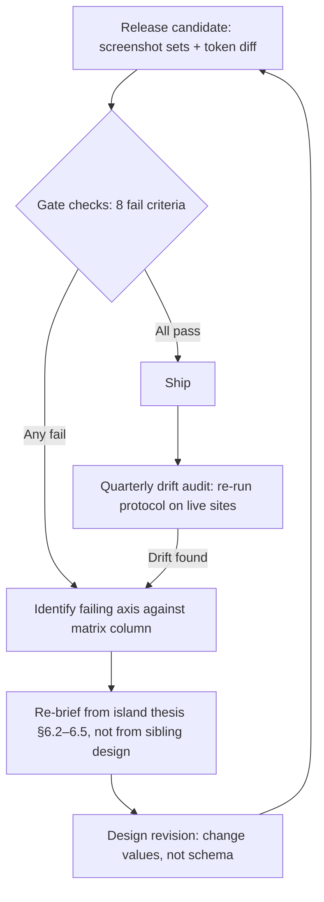

## 6. Design System: Four Island Worlds

The four island properties must fail a naive similarity test. If a visitor can open oahu.mychef-hawaii.com and maui.mychef-hawaii.com side by side and conclude "same site, different photo," the rebuild has failed its defining design requirement — because the evidence says these are four different buyers standing in four different landscapes, and the brand that looks native to each landscape wins the first five seconds of trust.[^03-49^][^04-62^][^05-57^][^06-45^]

This chapter specifies four genuinely different design worlds — Oʻahu's modern Pacific metropolitan luxury, Maui's cinematic resort-villa hospitality, Kauaʻi's organic estate luxury, and Hawaiʻi Island's volcanic minimalism — on one engineering platform, one brand, one quote infrastructure, and one design-token *schema* whose *values* diverge per island. Every choice is grounded in the per-island research: palettes from documented landscapes and architecture, typography from documented positioning, homepage composition from documented buyer behavior, image direction from documented accommodation stock. Two constraints govern everything. First, the proven trust assets are preserved, not redesigned away: the published rate cards, the fee stack (20% service, GET up to 4.7120% on its own line, 50% deposit), the honesty register, and the terse anti-hype voice appear inside all four worlds.[^01-8^][^01-19^][^01-10^] Second, performance is a design feature: every world must hit LCP < 2.5s, INP < 200ms, CLS < 0.1 on a mid-tier phone over hotel Wi-Fi, which caps hero video, webfont payload, and animation ambition before aesthetics begin.

### 6.1 Design Strategy Method

#### 6.1.1 Evidence-based thesis per island; shared engine, differentiated presentation

Each island thesis is a conclusion drawn from its dimension research, not a mood board. The reasoning chain is identical in all four cases: who is the buyer, where are they standing when they book, what does that exact place's luxury vernacular look like, and what does the competitive screen show.

- **Oʻahu** is the island where "metropolitan" is honest: 5,679,047 visitors in CY2025 spending $9.42B at $238.0 per person per day, luxury-hotel RevPAR up 13% year-to-date, and a stock that splits between vertical luxury (Waikīkī penthouse chef's kitchens, in-suite kaiseki at ESPACIO) and estate zones (Kahala, Ko Olina).[^03-49^][^03-71^][^03-50^][^03-48^] Thesis: editorial, architectural, city-to-ocean, concierge-grade.
- **Maui** is the state's cinematic luxury stage: South Maui resort ADRs of $623–$1,054 — Hawaiʻi's highest — Wailea/Makena estates at $6–32M, White Lotus imagery equity, ceremonies timed to sunset.[^04-65^][^04-67^][^04-62^][^04-96^] Thesis: dusk, atmosphere, landscape scale, wedding-week storytelling.
- **Kauaʻi** is the Garden Isle in the specific, sourced sense — oldest, "arguably the most unspoiled," plantation rather than resort vernacular, 88% US-domestic visitors, a 7.33-day average stay that is the state's long-stay outlier.[^05-57^][^05-60^][^05-66^][^05-32^] Thesis: botanical depth, tactile materiality, intimacy, two-shore storytelling.
- **Hawaiʻi Island** is elemental contrast: a Kona–Kohala coast built on black lava, its definitive reference Kona Village Rosewood — "buildings nestled right into cooled lava flows," Three MICHELIN Keys (2024) — and an ultra-luxury corridor priced in the tens of millions.[^06-45^][^06-27^] Thesis: basalt, bone, one ember accent, vast negative space, an inverted dark/light rhythm no sibling uses.

What the four worlds share is deliberately boring and deliberately strong: the myCHEF logo and wordmark, the engineering platform, the quote form and WhatsApp conversion door, the fee-stack notation, the honesty-register components, the UI primitive APIs, and the token schema described next. What they must never share is a hero concept, a type pairing, a section sequence, a spacing rhythm, a card language, a CTA treatment, a motion signature, or an image library. The sister sites prove the commercial logic: mychef.ae and mychef.id run identical conversion machinery (worked math, package cards, trust strips, WhatsApp-first CTAs) inside different presentation — presentation is what stops the four islands from cannibalizing each other's identity.[^02-13^][^02-16^][^02-18^]

#### 6.1.2 Design-token model (type, spacing, radius, shadow, motion) beyond color swaps

A color-swap theme is what the client has ruled out. The engineering answer is a two-layer token model: a **shared schema** (same token names, component APIs, and accessibility contracts everywhere) and **island-specific values** — including the tokens most theming systems never touch: typeface pairing, scale ratio, spacing rhythm, radius, shadow philosophy, motion duration/easing, and dark-band behavior.

| Token layer | Schema (shared across all five properties) | Value authority (set per island) |
|---|---|---|
| Type | `font-display`, `font-text`, `font-accent`, scale steps `t0–t9`, line-height tiers, measure caps | Typeface pairing, scale ratio, tracking, case rules, which steps get italic/display cuts |
| Space | `space-1…space-12` scale, section-pad tokens, gutter tokens, container widths | Base rhythm, section padding values, grid density, asymmetric offsets |
| Shape | `radius-s/m/l`, `border-hairline`, card anatomy (media/meta/title/price/CTA slots) | Radius values, border weight/color, card proportions, media aspect ratios |
| Depth | `elevation-0/1/2`, `scrim`, overlay opacity steps | Shadow presence/absence, blur, spread, texture treatments |
| Color | `bg`, `surface`, `card`, `ink`, `ink-2`, `line`, `accent`, `cta-bg`, `cta-ink`, `band-bg`, `band-ink`, focus ring, semantic states | Full hex value sets incl. surface philosophy (light-editorial / warm-atmospheric / botanical-tactile / inverted basalt) |
| Motion | `duration-fast/med/slow`, `ease-standard/emphasis`, reveal primitives, reduced-motion contract | Durations, easings, reveal type, hover behavior, parallax permission |
| Content | Price-line component, fee-stack footnote component, trust-chip component, quote-form API, WhatsApp deep link | Island rate-card values, travel-zone lines, inquiry-stage vs quote-open status |

*Table 6.1 — The shared token schema. Every island implements the same names; no two islands may share a value set.*

The practical consequence: `<PriceBand island="maui">` renders Maui's ember CTA on warm sand with Canela numerals, 10px radius, and a 640ms dusk-dissolve entrance — while the identical call on Oʻahu renders a black CTA on paper white with Söhne numerals, 2px radius, and a 150ms snap. The accessibility contract is shared and non-negotiable: WCAG 2.2 AA contrast on every text/background pair, visible focus rings, keyboard-complete navigation, `prefers-reduced-motion` collapsing every signature to a static cross-fade. The current site claims AA compliance, unverified; the rebuild makes it a build-time test, not a copy line.[^01-19^] Three schema rules prevent drift toward sameness: (1) island token files may not import from each other; (2) the shared primitive library contains zero color, radius, or motion literals — everything arrives via tokens; (3) the §6.6 gates run in CI, so a pull request that converges two islands' values fails the build like a broken test.

### 6.2 Oʻahu: Modern Pacific Metropolitan Luxury

#### 6.2.1 Thesis, typography direction, visual system, motion language

**Thesis.** Oʻahu is sold as a city with an ocean in front of it, because that is what the buyer occupies: a Waikīkī penthouse with a chef's kitchen 40 floors up, a Kahala estate behind a gate, a Ko Olina villa with a Sub-Zero/Wolf kitchen designed by Roy Yamaguchi.[^03-50^][^03-52^][^03-55^] The design language is editorial and architectural — a newspaper-of-record grid, glass-and-steel crispness warmed by paper tones, photography of in-residence service rather than beach sunsets. The audience split reinforces it: luxury travelers expecting concierge-grade polish (Japan sends roughly 693,000 visitors to Oʻahu a year; in-suite kaiseki is a proven product), alongside kamaʻāina households buying the published weekly cook-day line.[^03-47^][^03-48^][^03-45^] Oʻahu is effectively seasonless (37% seasonality index), so the design must not imply "season" — no seasonal hero swaps, no holiday decoration.[^03-51^]

**Typography direction.** The hypothesis — sharp grotesk plus crisp serif — is confirmed, resolved as **Söhne** (Klim Type Foundry) for display, UI, and data, paired with **Tiempos Headline** (Klim) for editorial statements and long-form. Söhne beats Neue Haas Grotesk or Inter for three reasons: its slightly condensed vertical stress reads as metropolitan architecture rather than tech-startup; its tabular figures are exceptional for the rate-card tables that are this island's conversion centerpiece; and Klim's hinting survives 375px rendering without the gray mush of older grotesks. Tiempos Headline supplies the editorial counterweight — enough snap to headline "Private Chef Oʻahu" above a skyline without tipping into wedding-invitation softness. Usage contract:

- Display/H1: Söhne Kräftig, 44px/48px mobile → 84px/88px desktop, tracking −0.02em, sentence case.
- H2/H3: Söhne Halbfett, scale steps t5–t7; eyebrow labels in Söhne Mono-adjacent small caps (Söhne, 11px, tracking +0.14em, uppercase).
- Editorial pull-lines and menu course names: Tiempos Headline Light, t6–t8; italic only for provenance lines.
- Body/data: Söhne Buch 17px/28px, measure capped at 66ch; rate tables in tabular figures.
- Scale ratio 1.333 (perfect fourth) — the tightest of the four islands, producing the dense editorial rhythm.
- JA-language pages (the Oʻahu-only Japanese cluster): pair with a system Japanese gothic (Hiragino Sans / Noto Sans JP) at +4% size compensation; never fake Japanese texture with Latin display type.

**Visual system.** Surface philosophy: crisp light editorial — paper, ink, hairlines, one steel accent. Shadows are banned in favor of 1px rules; the page should feel printed, not floating.

| Token | Value | Role |
|---|---|---|
| `bg` | `#FAF9F6` | Paper white — warm enough to avoid clinical, cool enough to read metropolitan |
| `surface` | `#FFFFFF` | Editorial panels, quote form |
| `card` | `#FFFFFF` + 1px `#E3E1DA` | Hairline-bordered, `radius-s` 2px, media aspect 4:3 |
| `ink` | `#191C20` | Headlines, body (contrast on bg ≈ 16.2:1) |
| `ink-2` | `#5A616B` | Captions, meta, fee-stack lines (contrast ≈ 5.9:1) |
| `line` | `#E3E1DA` | Hairlines, table rules |
| `accent` | `#3D5A68` | Desaturated steel-ocean — links, corridor map pins, JA-language toggle; never fills large areas |
| `cta-bg` / `cta-ink` | `#191C20` / `#FAF9F6` | Solid ink button, square-shouldered (2px radius), uppercase Söhne 12px tracking +0.08em |
| `band-bg` / `band-ink` | `#191C20` / `#EDEBE4` | Single dark band per page (pricing or footer), never more |
| Focus ring | `2px #3D5A68` offset 2px | Keyboard contract |

*Table 6.2 — Oʻahu token summary.*

Three decisions carry the interpretation. Oʻahu is the only island where the CTA is the darkest element on the page, because its buyer is comparison-shopping against concierge desks and marketplace tables — the button must read as infrastructure, not invitation. The steel accent, the coldest hue in the system, is restricted to functional elements (links, pins, toggles) so the palette never drifts into "beach blue." And the 2px radius plus hairline borders produce a print-like flatness that distinguishes this world at thumbnail distance from Maui's 10px softness — one of the measurable §6.6 checks. Spacing runs on an 8px base with dense section padding (64px mobile / 96px desktop) and a 12-column editorial grid collapsing to one column on mobile; cards never span full-bleed here. Rate cards render as ruled tables, not cards, because the tariff is this island's hero content: the live Kahala page's "$125–$190/pp CORE" presentation is carried over.[^03-44^]

**Motion language.** "Utility snap": the city's elevator, not the ocean. Durations 120–180ms, `ease-out cubic-bezier(0.2, 0.6, 0.2, 1)`; hovers lift 2px with a hairline color change, never a shadow grow; elements fade-and-rise 8px once on first scroll into view, then never move again; no parallax anywhere; the corridor map animates only pin states. Reduced-motion collapses everything to instant opacity.

#### 6.2.2 Homepage wireframe description and image art direction

**Homepage composition (mobile-first, top to bottom).** The sequencing answers the buyer's questions in the order a Waikīkī suite guest or Kahala householder asks them: what is this, what does it cost, does it cover my building, how does it work, can it handle my event, what do I do next.

1. **Header:** wordmark left; right-side utility cluster (EN/日本語 toggle, "Pricing," "Quote"). Sticky, hairline-ruled.
2. **Hero — split editorial composition (not a full-bleed photo).** Left column: eyebrow "PRIVATE CHEF OʻAHU — HONOLULU · KAHALA · KO OLINA · NORTH SHORE", H1 "A chef in your kitchen, from Waikīkī to the North Shore," price line "Signature dinner $125–$190 a guest, groceries included. Stay Chef from $850 a day. The written quote is the confirmed total."[^01-8^][^01-21^] Right column: a single 4:3 architectural photograph (suite kitchen, city grid beyond glass). Mobile stacks the image below the price line — commercial information never falls below the fold on a 375px screen.
3. **Trust strip (hairline-ruled band):** "Published prices · Written quote is the confirmed total · 20% service + GET up to 4.7120% on their own lines · No fake reviews — ever."[^01-8^][^01-10^]
4. **Two-door router:** "A chef for the stay" vs "Catering for the event" — the network two-core grammar as hairline cards with one-sentence scope.[^02-1^]
5. **Corridor directory:** the Oʻahu corridor set defined in §4.2.1 (Waikīkī, Honolulu, Kahala–Gold Coast, Ko Olina, Kapolei, Kailua–Lanikai, North Shore–Turtle Bay, Hawaiʻi Kai) as a text-led index with drive-time and surcharge annotations — an editorial table of contents, not a photo grid — where Waikīkī COI/freight-elevator and North Shore drive-fee logistics surface as trust copy.[^03-45^]
6. **Pricing band (the page's single dark band):** the full rate card as a ruled table — Table $95–$125, Signature $125–$190, Premium $190–$275, Chef's table $275–$400+, staffing hourlys, travel from $75 — with the fee-stack footnote component.[^01-21^]
7. **How it works:** four numbered steps (quote form → written quote → 50% deposit locks the date → we cook, we clean), Tiempos numerals on the paper ground.
8. **Kamaʻāina band:** the weekly household line ("from $300 a week plus groceries") in its own editorial panel — resident service is Oʻahu-specific and placed accordingly.[^03-45^]
9. **Group capability:** "10–75 guests, staffed; over 75 is a written exception," plus a corporate/convention-displacement line.[^01-18^]
10. **Quote block:** 5-field form (island pre-selected, dates, party size, service, contact) + WhatsApp; microcopy "The button is not 'Book now.' You get a written quote."[^01-9^]
11. **Footer:** dark ink band; full directory; fee-stack line repeated once.

**Image art direction.** Hero concept: *the service inside the architecture* — a cook's hands plating at a stone island, the city grid or Diamond Head line through floor-to-ceiling glass behind, shot at 35–50mm equivalent, eye level, the upper third held as quiet negative space for the H1 on desktop. Subjects: in-residence kitchens (penthouse galley, Kahala estate, Ko Olina villa), table detail against window light, the corridor map as designed graphic. Light: hard directional daylight or tungsten-practical evening; overcast flatness is the enemy; golden-hour beach silhouettes are banned here — they belong to Maui. Time of day: late afternoon into blue hour; the city-lights transition is Oʻahu's signature and no sibling may use urban blue hour. Mobile crops: 4:5, kitchen work plane in the lower two-thirds. Avoid: beach-and-palm clichés, lūʻau/torch imagery, generic chef-at-counter stock poses, AI-generated plating with physically impossible garnish, fake text on menus or screens. The current site's hero PNGs are documented as polished-but-synthetic and its About page disclaims crew photos as illustrative; the rebuild replaces both with commissioned photography — one unique hero per page, zero cross-island reuse.[^01-25^][^01-11^]

### 6.3 Maui: Cinematic Resort-Villa Hospitality

#### 6.3.1 Thesis, typography direction, visual system, motion language

**Thesis.** Maui's buyer is standing on a lānai in Wailea at 5:40 p.m., watching the light go horizontal, deciding whether the week — not the dinner — is handled. The evidence supports a cinematic thesis at every level: South Maui posts the state's highest resort ADRs ($623–$1,054), Wailea/Makena estates run $6–32M "micro-resorts," the Four Seasons Wailea carries White Lotus imagery equity, ceremonies are timed to sunset, and the documented demand structure is a multi-meal wedding week (welcome dinner → rehearsal → reception → recovery brunch) that no competitor sells as one contract.[^04-65^][^04-67^][^04-62^][^04-96^][^04-44^] DLNR beach-permit caps (~20 people, no structures) push receptions into estates and villas with kitchens — exactly myCHEF's stage.[^04-53^] Design translates this as atmosphere: warm dusk tones, deep space, slow type, the wedding week in hero-adjacent placement. One sensitivity is non-negotiable: nothing may aestheticize Lahaina town or the fire zone; West Maui imagery centers Kāʻanapali–Kapalua's operating present, and copy honors the community's stated welcome of respectful visitors.[^04-58^]

**Typography direction.** The hypothesis — high-contrast display serif plus warm humanist sans — is confirmed, resolved as **Canela** (Commercial Type) for display, paired with **Whitney** (Hoefler&Co.) for text and UI. Canela wins over Freight Big or Tiempos Headline because its contrast is warm rather than brittle: the thin strokes carry dusk light well at large sizes, and its oldstyle-feeling numerals make "$150–$250 a guest" read as hospitality rather than tariff. It is also unclaimed by any sibling (Oʻahu's Tiempos is crisper, more journalistic). Whitney supplies the humanist counterweight — open apertures, unhurried rhythm, exceptional small-size legibility for fee-stack footnotes and form fields; it reads as a concierge speaking, where a geometric sans would read as an app. Usage contract:

- Display/H1: Canela Light, 40px/44px mobile → 88px/96px desktop, tracking −0.01em, sentence case; italic permitted for one-line scene-setters.
- H2: Canela Deck t6–t7; section eyebrows in Whitney 11px uppercase, tracking +0.16em, muted terracotta.
- Body/UI/forms: Whitney Book 17px/29px, measure 62ch; rate tables in Whitney tabular figures inside Canela-numeral feature rows.
- Scale ratio 1.5 — the most dramatic of the four islands; the gap between body and display is itself the "cinema."
- Quote-form labels and legal lines always Whitney, never Canela: contracts are spoken in the sans.

**Visual system.** Surface philosophy: warm dusk atmospheric — layered warm grounds, soft depth, one ember accent, and a signature dusk-dark band that can appear twice per page (the only island allowed two).

| Token | Value | Role |
|---|---|---|
| `bg` | `#F4EDE2` | Warm sand — the page's ambient light |
| `surface` | `#FBF6EC` | Lifted warm panel |
| `card` | `#FBF6EC` + 1px `#E5D9C6`, `radius-m` 10px, soft diffuse shadow `0 18px 40px −24px rgba(44,34,26,0.35)` | Media aspect 3:2, image-first card anatomy |
| `ink` | `#2C221A` | Headlines/body (contrast on bg ≈ 13.4:1) |
| `ink-2` | `#6E5F52` | Meta, fee-stack lines (contrast ≈ 5.3:1) |
| `line` | `#E5D9C6` | Hairlines (used sparingly — Maui prefers space over rules) |
| `accent` | `#A65B38` | Muted ember/terracotta — active states, wedding-week motif, CTA fill; at 4.33:1 on sand it does **not** render as body-size text links |
| `accent-2` | `#7A5C60` | Dusk mauve — text links and secondary tags (5.12:1 on sand, verified AA) |
| `cta-bg` / `cta-ink` | `#A65B38` / `#FBF3E8` | Solid ember pill-adjacent (10px radius), Whitney 13px, sentence case; hover deepens to `#8F4C2E` |
| `band-bg` / `band-ink` | `#241C17` / `#F0E4D3` | Dusk band — hero-adjacent wedding-week feature and footer |
| Focus ring | `2px #A65B38` offset 2px | Keyboard contract |

*Table 6.3 — Maui token summary.*

Three decisions carry the differentiation load. Maui is the only island whose CTA is colored rather than neutral: the ember button is the warmest interactive element in the system and must survive a §6.6 check proving it cannot be confused with Kauaʻi's botanical CTA or Big Island's inverse bone button. The 10px radius plus long, low-opacity shadow gives cards a "printed on warm stock, lifted off the table" tactility — deliberately opposite to Oʻahu's flat hairlines. And the dusk band (`#241C17`) is a compositional instrument, not a footer default: it frames the wedding-week story in the homepage's upper half, letting the page enact a day-into-evening descent. Spacing is the system's most generous: 8px base, 96px mobile / 160px desktop section padding, single-column-dominant with occasional 2-up 3:2 image pairs; Maui's atmosphere comes from what is not on the page. Rates present as Canela-numeral feature rows ("Villa dinner $150–$250 · Stay Chef from $1,050/day · Wedding week from $150/guest + staffing") above the ruled detail table, because here the price is reassurance inside a story, not the story itself.[^01-8^]

**Motion language.** "Dusk dissolve": slow, cross-faded, horizontal. Durations 500–800ms, `ease cubic-bezier(0.4, 0, 0.2, 1)`; hero imagery settles with a 1.03→1.0 scale over 900ms on load; section transitions are opacity-and-4px-rise dissolves with 120ms stagger between image and caption; galleries cross-fade rather than slide. Parallax is permitted on exactly one element — the hero, ≤2% scroll ratio, desktop only — because a single slow parallax is the cinematic signature and anything more is a theme-park ride. Hover states warm (border and image saturation +6%) rather than lift. Reduced-motion: dissolves become instant cuts; parallax disabled on mobile regardless.

#### 6.3.2 Homepage wireframe description and image art direction

**Homepage composition (mobile-first, top to bottom).** The sequencing follows the destination-wedding buyer's decision path: confirm the dream, confirm the week is handled, then confirm the numbers.

1. **Header:** wordmark left; right links minimal ("Pricing," "Weddings," "Quote"); transparent over the hero, gaining a `#F4EDE2` ground after 40px of scroll.
2. **Hero — full-bleed cinematic image (the only full-bleed hero in the network).** A lānai table set for eight, low sun, ocean mid-ground. H1 in Canela Light: "Maui, set for dinner." Sub-line in Whitney: "A private chef for your Wailea villa, your Kapalua estate, your whole wedding week. Villa dinners $150–$250 a guest; the written quote is the confirmed total."[^01-8^] Mobile: image 4:5, H1 over the held sky; price line always visible without scroll.
3. **Trust strip** (the four network claims, Whitney, hairline-free — separated by space alone).
4. **Wedding-week feature (dusk band):** "Maui is a week, not a plated hour" — the five-meal arc (welcome dinner, rehearsal, ceremony-adjacent, reception, recovery brunch) as a horizontal day-by-day timeline scrolling sideways on mobile; Canela day labels, Whitney scope lines, ember CTA "Plan the week."[^04-44^]
5. **Experience cards (3:2, image-first):** Villa Dinner / Stay Chef / Date Night / Estate Catering — snap-scroll on mobile, each with "from $X" and a "Best for:" line per the sister-site card grammar.[^02-17^]
6. **Zone strip:** Wailea–Makena / Kāʻanapali–Kapalua / Upcountry (quoted) as three atmospheric text panels with one-line logistics notes — Upcountry and Pāʻia/Haʻikū honesty lines preserved.[^01-14^]
7. **Pricing scene (sand ground):** Canela-numeral feature rows + ruled detail table + fee-stack component + a wedding-week worked-math example (guests × meals × days) in the Bali pattern.[^02-13^]
8. **How it works:** four network steps, paced as full-width calm sections.
9. **Group capability:** estate receptions to 75, staffing hourlys, the 20%-vs-23–25% service-charge comparison against resort norms — a quantified wedge.[^06-15^][^06-36^]
10. **Quote block + WhatsApp**, microcopy unchanged in substance, warmed in tone: "Tell us the dates and the villa. We reply with a written quote — the confirmed total."
11. **Footer (dusk band):** full directory, fee-stack line, the support-local note.

**Image art direction.** Hero concept: *golden-hour lānai service* — the table as subject, the landscape as theater. Subjects: long tables in low sun, plated courses against ocean bokeh, estate kitchens with outdoor pavilions (documented in the villa stock), Makena lava-rock meeting sand, whale-season tableside moments (December–May) as seasonal swaps.[^04-100^][^04-98^] Composition: wide 3:2 and 16:9 frames, horizons level on the upper third so the sky holds copy; figures small in frame, mid-action, never posing; light is the last 90 minutes of day plus candle/practical warm sources after dark. Time-of-day discipline is absolute: no midday blue-sky imagery anywhere on this property. Mobile crops: 4:5 re-composed on the table, never a center-crop of the wide frame. Avoid: White Lotus mimicry or cast-adjacent compositions (borrow the light, not the IP); Lahaina fire-zone or ruin imagery; resort-pool drone clichés; food flat-lays; AI sunset composites with impossible suns; the "generic chef garnishing at counter" stock trope. Photography is commissioned per page, unique heroes, no cross-island reuse — Maui's library must never appear on Kauaʻi, whose greens read as a different island to anyone who has stood in both.

### 6.4 Kauaʻi: Organic Estate Luxury

#### 6.4.1 Thesis, typography direction, visual system, motion language

**Thesis.** Kauaʻi sells intimacy inside overwhelming landscape. The vernacular is documented: the Garden Isle — oldest, "arguably the most unspoiled," taro fields backed by waterfall-striped mountains — and its luxury architecture is plantation, not resort: Kukuiʻula's "sprawling plantation-style" clubhouse, Old Kōloa Town's plantation heritage, a 1930s plantation house restaurant.[^05-57^][^05-59^][^05-60^][^05-62^][^05-61^] The buyer is English-first (88% US domestic), stays 7.33 days — the state's long-stay outlier — and spends $281.30 per person per day, second only to Maui.[^05-66^][^05-32^] Long stays plus estate stock (Secret Cove at $3,750–$8,250/night, Pure Kauai's concierge funnel, retreat tickets at $2,000–$4,499) make Kauaʻi the natural home of Stay Chef and retreat catering — the market's clearest whitespace, with zero dedicated "retreat catering Kauai" SERP results.[^05-29^][^05-25^][^05-35^] Kauaʻi also owns a structural device no sibling can copy: two shores with inverted seasons (North Shore peaks June–September, South Shore carries November–March), which the design turns into a literal compositional element.[^05-44^][^05-68^] The island is inquiry-stage with published pricing (weddings from $175/guest, CORE $150–$250, Stay Chef from $1,100/day), and the design carries that honesty as texture, not apology.[^05-16^]

**Typography direction.** The hypothesis — organic serif plus understated sans — is confirmed, resolved as **GT Sectra** (Grilli Type) for display and editorial, paired with **Messina Sans** (Luzi Type) for text and UI. GT Sectra is the decisive choice: drawn with broad-nib, calligraphic logic, its strokes flare like stems — botanical character without a single decorative element; the Fine cut handles display sizes on canopy bands, the Book weight keeps long-form retreat and wedding copy warm. Rejected for cause: Canela is Maui's and too dusk-warm; a slab or "rustic" face would tip into farm-stand costume — exactly the cliché this chapter exists to prevent. Messina Sans is the right understudy: quiet, slightly narrow, even color that lets named-farm vocabulary (Kunana Dairy, Govinda's Farm, Hanalei Farmers' Market — the sourcing language competitors already use and myCHEF can match) read as provenance rather than marketing.[^05-1^][^05-3^][^05-70^] Usage contract:

- Display/H1: GT Sectra Fine, 38px/42px mobile → 76px/84px desktop, tracking 0, sentence case; italic for provenance and season lines.
- H2/H3: GT Sectra Book t5–t7; eyebrows in Messina Sans 11px uppercase, tracking +0.14em, fern.
- Body/UI: Messina Sans 17px/29px, measure 64ch; rate tables in Messina tabular figures.
- Scale ratio 1.414 (augmented fourth) — a gentle, irregular-feeling rhythm between Oʻahu's tightness and Maui's drama.
- The two-shore device gets a typographic tell: North Shore and South Shore section labels set in GT Sectra italic — the only place italics appear at label size.

**Visual system.** Surface philosophy: deep botanical tactility — mist grounds, canopy-dark bands, organic radius, and texture where the other islands have polish.

| Token | Value | Role |
|---|---|---|
| `bg` | `#EFEEE3` | Mist — a green-leaning off-white, never resort turquoise |
| `surface` | `#F7F6EC` | Lifted panel, paper-warm |
| `card` | `#F7F6EC` + 1px `#D8D6C4`, `radius-l` 14px, deep soft shadow `0 24px 48px −28px rgba(32,41,29,0.4)` | Media aspect 1:1 or 4:5 — intimate, portrait-biased |
| `ink` | `#24301F` | Deep green-ink headlines/body (contrast on bg ≈ 11.9:1) |
| `ink-2` | `#57624C` | Moss secondary text (contrast ≈ 5.5:1) |
| `line` | `#D8D6C4` | Hairlines, sparingly |
| `accent` | `#4E6B44` | Fern — links, tags, shore-selector active state |
| `cta-bg` / `cta-ink` | `#2E4028` / `#F2F1E6` | Deep botanical button, 14px radius, Messina 13px sentence case |
| `band-bg` / `band-ink` | `#20291D` / `#E9E8DA` | Canopy band — retreat feature and footer; photography may sit inside at 92% opacity |
| Focus ring | `2px #4E6B44` offset 2px | Keyboard contract |

*Table 6.4 — Kauaʻi token summary.*

The differentiators here are tactile. Kauaʻi is the only island with a 14px radius and portrait-biased card imagery (1:1/4:5): where Maui's 3:2 frames present landscape theater, Kauaʻi's tighter frames put the reader *inside* the garden — a table seen through foliage, rain on a veranda rail. The botanical CTA (`#2E4028`) reads as "estate gate" rather than Maui's "sunset"; §6.6's ΔE check guarantees the distinction. And the canopy band works differently from Maui's dusk band: photography may sit *inside* it at reduced opacity (mist-in-trees treatments), so band transitions feel like passing under tree cover, not a scene change. Spacing runs 96px mobile / 128px desktop with deliberate asymmetry — desktop content offsets one column, echoing plantation-veranda geometry; mobile collapses to one column with 1:1 image breaks. Rates use the ruled-table component like Oʻahu but framed by provenance copy, with the travel lines ("from $50–$75 Princeville/Poʻipū surcharge; far-North quote-only; Hāʻena needs 72-hour notice") surfaced as estate-logistics story — because on Kauaʻi logistics honesty *is* the luxury signal: the Hanalei-bridge weather clause (documented HDOT closures; "closures reschedule rather than forfeit") is a differentiator no competitor addresses, and it earns a permanent styled callout.[^05-16^][^05-40^][^05-41^]

**Motion language.** "Canopy stagger": gentle, organic, slightly irregular. Durations 300–500ms, `ease-in-out cubic-bezier(0.45, 0, 0.3, 1)`; lists and card groups reveal with 60ms staggers and a 12px rise, timed to feel like settling rather than snapping; the shore selector cross-fades imagery over 400ms with a 6px drift; hovers deepen image saturation (+5%) and border color rather than lifting. Nothing bounces; nothing slides horizontally except the retreat timeline. Reduced-motion: instant opacity, no staggers.

#### 6.4.2 Homepage wireframe description and image art direction

**Homepage composition (mobile-first, top to bottom).** The sequencing follows the estate guest's path: confirm the island feel, choose your shore, see the stay and retreat products, check the numbers, understand the logistics honesty, inquire.

1. **Header:** wordmark left; links "Stays," "Retreats," "Weddings," "Quote"; mist ground from first paint.
2. **Hero — framed landscape, not full-bleed.** A 4:5 (mobile) / 3:2 (desktop) photograph set inside the mist ground with asymmetric margins: a table on a plantation veranda, green depth beyond the rail. H1 in GT Sectra: "Kauaʻi, cooked in." Sub-line: "A private chef for your estate, your retreat, your whole stay — both shores. Signature dinners $150–$250 a guest; Stay Chef from $1,100 a day."[^05-16^] Inquiry-stage honesty chip beside the CTA: "Kauaʻi runs inquiry-first — written quote before any date is held."
3. **Two-shore selector (the island's signature module):** North Shore (Princeville · Hanalei · Kīlauea · Hāʻena) / South Shore (Poʻipū · Kōloa) as a two-panel toggle — one image, one season line ("Summer is the North Shore's prime; the South Shore carries winter"), estate/villa notes per panel; selecting a shore re-colors accent states and re-orders the corridor list below.[^05-44^][^05-68^]
4. **Stay & retreat band (canopy):** Stay Chef and retreat catering in the feature position — multi-day meal-plan framing, dietary-protocol vocabulary (plant-based, Ayurvedic-fluent, detox — the language retreat venues use), a host-facing B2B line.[^05-11^][^05-35^]
5. **Experience cards (1:1):** Estate Dinner / Stay Chef / Retreat Catering / Wedding Week — snap-scroll on mobile.
6. **Pricing on mist:** ruled table (Table $125–$150, CORE $150–$250, Premium $250–$350, Chef's table $350+, elopements $650–$950 fixed) + fee-stack + travel-zone lines as prose.[^01-23^]
7. **Logistics-honesty callout:** the Hanalei-bridge clause as a designed panel — "One bridge. One road. We plan around it: 72-hour notice for far-North service; closures reschedule rather than forfeit."[^05-40^][^05-16^]
8. **How it works:** four network steps, asymmetric layout.
9. **Weddings:** estate-wedding framing, from $175/guest + staffing, positioned against the local $75/pp caterer average with the estate-week justification explicit — the current /weddings page already does this; the rebuild keeps it.[^05-34^][^05-16^]
10. **Inquiry block:** 5-field form + WhatsApp; microcopy names the posture as a promise: "Inquiry-first means we never hold a date we can't crew."
11. **Footer (canopy band):** directory, fee-stack, shore-by-shore corridor list.

**Image art direction.** Hero concept: *the table inside the garden* — service framed by landscape, never in front of a postcard. Subjects: plantation verandas and deep lānai overhangs; taro-field and mountain-backdrop geometry; rain texture on leaves and rails; farmers' market provenance (Saturday Hanalei stalls); estate kitchens with worn wood and open windows; retreat communal tables.[^05-59^][^05-70^] Composition: portrait-biased frames (4:5, 1:1), foliage as natural vignette at the edges, subjects mid-ground so the garden stays present; light filtered, humid, green-bounced — overcast is an asset here, the inverse of Oʻahu's hard directional light. Time of day: morning mist and the soft post-rain hours; Kauaʻi owns overcast the way Maui owns golden hour, and neither may borrow the other's light. Mobile crops: native 4:5, no re-composition. Avoid: resort-brochure turquoise water; helicopter Nā Pali clichés; "tropical" props (tiki, torch, hibiscus-behind-ear styling); plastic AI greenery with impossible leaf geometry; staged farm-to-table tables in fields no one would actually dine in. Heroes unique per page, commissioned, never shared with Maui — the two islands' greens are different species and the libraries must be too.

### 6.5 Big Island: Volcanic Minimalism

#### 6.5.1 Thesis, typography direction, visual system, motion language

**Thesis.** Hawaiʻi Island is the only property in the network that leads with darkness. The research gives the thesis its spine: the Kona–Kohala coast is built on black lava; Kona Village Rosewood — the island's definitive luxury reference, holder of Three MICHELIN Keys (2024) — is "buildings nestled right into cooled lava flows" with a "simple luxury" ethos and basalt furnishings; and the ultra-luxury corridor is priced in the tens of millions (Kukio estates averaging $19M, Hualālai median $9.63M, Kohanaiki $8.5M in 2024).[^06-45^][^06-46^][^06-27^] The buyer is a West Coast second-home owner, a Hualālai or Mauna Kea resort guest, a Puako villa group — people for whom a plated dish on black basalt is the aesthetic, not a backdrop. Two operational truths become design content: the island is vast (Kona→Hilo is 2.5–3 hours; "east side is its own quote"), and the term duality is real — visitors search "Big Island" while "Hawaiʻi Island" is official usage, so H1s and titles say Big Island and body/alt text carries Hawaiʻi Island.[^06-24^][^06-7^] The thesis: basalt dark ground, bone neutrals, one ember accent drawn from ʻōhiʻa lehua, enormous negative space, and an inverted light-section rhythm — dark outside, light inside — that no sibling uses.

**Typography direction.** The hypothesis — neo-grotesk plus mono accents — is confirmed, resolved as **GT America** (Grilli Type) for display, text, and UI, with **GT America Mono** as the technical accent layer. GT America wins over Söhne (claimed by Oʻahu) and colder options like Neue Haas Grotesk because its slightly squared, engineered drawing sits naturally beside basalt and architecture photography, and its weight range allows a single-family system — itself the minimalist statement: one grotesk doing everything, discipline as luxury. The mono earns its place functionally: rate-card figures, travel-zone lines, coordinates-style location tags ("19.64° N — KUKIO"), distances ("KONA → HILO · 2 HR 50 MIN"), and fee-stack footnotes at 12–13px give the page a field-manual precision matching the island's geographic-honesty content.[^06-24^] Usage contract:

- Display/H1: GT America Light, 42px/46px mobile → 92px/100px desktop, tracking −0.015em, sentence case; the largest, emptiest headlines in the network.
- H2/H3: GT America Medium t5–t7; eyebrows in GT America Mono 11px uppercase, tracking +0.18em.
- Body: GT America Regular 17px/28px, measure 60ch (narrowest measure — minimalism enforced at the line level).
- Data/mono layer: GT America Mono for all price figures, zone lines, distances; rate tables set entirely in mono — the tariff as ledger.
- Scale ratio 1.25 (major third) — the flattest hierarchy, because contrast comes from darkness and space, not size jumps.

**Visual system.** Surface philosophy: volcanic inversion — the default ground is basalt dark, and *light sections are the interruption* (sand/bone bands for pricing, forms, and long-form). This inverts all three siblings and is the strongest single differentiator in the system.

| Token | Value | Role |
|---|---|---|
| `bg` | `#151412` | Basalt — default page ground |
| `surface` | `#1E1C1A` | Lifted basalt panel |
| `card` | `#1E1C1A` + 1px `#34302B`, `radius` 0, no shadow ever | Media aspect 16:10, brutal, edge-to-edge |
| `ink` (on dark) | `#ECE6DA` | Bone — headlines/body on dark (contrast ≈ 14.8:1) |
| `ink-2` (on dark) | `#9C9488` | Ash secondary (contrast ≈ 6.1:1) |
| `line` | `#34302B` | Hairlines on dark |
| `accent` | `#A24A2E` | Muted lehua ember — **non-text elements only** on basalt (map pins, focus ring, a single price figure set large); 3.12:1 on `#151412` fails AA for body-size links, so it never renders as text on dark ground; restraint is the rule — one accent element per viewport |
| `accent-text` | `#C8603F` on `#151412` (4.56:1) / `#A24A2E` on `#E8E2D4` (4.57:1) | Text-state lehua for links: the brighter cut on dark ground, the deeper cut on the light band — both verified AA |
| `cta-bg` / `cta-ink` (dark sections) | `#ECE6DA` / `#151412` | Inverse bone button, 0 radius, GT America Mono 12px uppercase tracking +0.1em |
| `band-bg` / `band-ink` (light sections) | `#E8E2D4` / `#181614` | Sand/bone band — pricing, quote form, long-form; CTA inverts to `#181412` on `#ECE6DA` |
| Focus ring | `2px #A24A2E` offset 2px | Keyboard contract on both grounds |

*Table 6.5 — Hawaiʻi Island token summary.*

Every value is engineered to be un-confusable with the siblings. The 0px radius and total shadow ban produce a hard-edged physicality that reads as cut stone — measurably different from Oʻahu's 2px hairlines, Maui's 10px softness, Kauaʻi's 14px roundness (a §6.6 gate enforces it). The inverse CTA logic — bone button on basalt, basalt button on bone — makes this the network's only achromatic button; color is rationed to the lehua ember, once per viewport, so a single ember element on black carries more charge than Maui's ember everywhere — and the two-state `accent`/`accent-text` rule keeps even that one element inside the AA contract the other islands meet by default. The light band is compositional, not structural: pricing and the quote form sit on `#E8E2D4` because forms demand light grounds for trust, then the page returns to basalt — dark → light → dark, an elemental alternation. Spacing is the system's emptiest: 112px mobile / 176px desktop, single-column-dominant, images edge-to-edge at 16:10 with no card chrome. The rate card — "Villa dinner $150–$225/guest; ENTRY from $110; Stay Chef from $950/day; travel outside Kona–Kohala from $75; east side quoted" — sets entirely in mono on the light band, a ledger aesthetic that makes the market's only published full rate card the page's visual centerpiece.[^06-24^] One copy QA fix rides along: the current hero says "from $125" against its own card's CORE $150–$225 / ENTRY from $110 — the rebuild locks the hero to the card.[^01-7^]

**Motion language.** "Hard cut": elemental, nearly absent. Durations 0–120ms, effectively instant; state changes swap (opacity cut, no transform); the single sanctioned animation is a 400ms cross-fade when dark and light bands alternate on scroll-linked imagery — the visual equivalent of stepping from sun into shade. No staggers, no parallax, no hover lifts; hovers are hairline changes to `#A24A2E` or inverse fills. Reduced-motion: identical — the system is already at floor.

#### 6.5.2 Homepage wireframe description and image art direction

**Homepage composition (mobile-first, top to bottom).** The sequencing follows the corridor guest's path: elemental arrest, corridor confirmation, the ledger, the geography honesty, the inquiry.

1. **Header:** wordmark left in bone; links "Pricing," "Corridor," "Quote" in mono uppercase; transparent over basalt, hairline appears after scroll.
2. **Hero — basalt dark, one image, one sentence.** A single 16:10 photograph: a plated course on black lava, ocean line behind, golden-hour Kona light. H1 in GT America Light: "Private chef, Big Island." Sub-line: "Kona–Kohala first. Villa dinners $150–$225 a guest, ENTRY from $110. Stay Chef from $950 a day. The written quote is the confirmed total."[^06-24^] The lehua ember appears here exactly once — on the "Kona–Kohala" link, rendered in the brighter `#C8603F` text state.
3. **Trust strip** (network four claims, mono, hairline-ruled on basalt).
4. **Corridor band:** Kailua-Kona · Keauhou · Kohala Coast (Mauna Kea / Hapuna / Mauna Lani / Waikoloa / Puako) as a mono-tagged index with drive times from Kona — the corridor as field data, including the gated-community note (Hualālai / Kukio / Kohanaiki via referral and chef travel).[^06-27^]
5. **Pricing (light band):** the full ledger in mono — ENTRY/CORE/PREMIUM rows, Date Night from $550, Packaged cart from $725/4 hr, staffing $55/$75 hourlys, 4-hr floor, travel from $75, fee-stack component.[^06-24^]
6. **Geography honesty panel (back to basalt):** "The island is 4,028 square miles. Kona to Hilo is 2.5–3 hours. East side is its own quote — written, never implied." Plus seasonal hooks (whale season December–April, Ironman October) as mono date-lines.[^06-24^][^06-49^]
7. **Wedding & event band:** wedding week from $150/guest + staffing, positioned under resort F&B minimums ($7,500–$15,000) with the 20%-vs-23–25% service-charge comparison — the quantified wedge, in ledger numbers.[^06-35^][^06-36^][^06-15^]
8. **Experience index (16:10, edge-to-edge):** Villa Dinner / Stay Chef / Date Night / Wedding Week — stacked full-width panels, not cards.
9. **How it works:** four network steps, mono numerals.
10. **Quote block (light band):** 5-field form + WhatsApp; inquiry-stage honesty stated as operational fact (permits, roster depth), never apology.
11. **Footer (basalt):** directory, fee-stack, the "Big Island / Hawaiʻi Island" naming note that doubles as the term-duality SEO device.

**Image art direction.** Hero concept: *plated dish as the only saturated object in a volcanic world* — the food carries the color; the island carries the monochrome. Subjects: single courses on basalt or dark stone; black-lava foregrounds with ocean lines; low horizontal resort architecture against cooled flows (the Kona Village reference); coffee-belt and ranch provenance (Kona coffee, Parker Ranch beef, Hāmākua mushrooms — Rio Chef's documented menu vocabulary) shot as still-life; golden-hour Kona light raking across lava texture.[^06-45^][^06-3^] Composition: extreme negative space — subject under a third of the frame, horizons low, shadows long; 16:10 masters with 4:5 mobile re-crops keeping the dish in the lower third, black texture above for the H1. Light: hard low sun or single-source practical; never overcast (that is Kauaʻi's light); night service shots with candle/practicals encouraged — darkness is this island's medium. Avoid: saturated tropical grading; jungle-waterfall heroes (east-side pages may use lush photography but never as heroes); eruption spectacle and lava-flow stock; AI "black sand + food" composites with impossible reflections; generic chef-at-counter poses. Unique commissioned heroes per page, zero cross-island reuse — a basalt hero on the wrong island reads as fraud to anyone who has been to either.

### 6.6 Differentiation Gates

#### 6.6.1 Side-by-side comparison protocol and fail/return-to-design criteria

Differentiation that is not measured will erode. The four worlds share an engineering platform, a component library, a quote API, and a content operations team — every one of those forces pulls toward convergence, and the only counterweight is a gate that runs at design review and again in CI at every release. The gate has two parts: a **differentiation matrix** defining the intended distance (the spec) and a **comparison protocol** measuring the actual distance (the test).

**The cross-island differentiation matrix (the spec).** Any two islands must differ on at least seven of the ten rows, and may never match on rows 1, 2, or 6.

| # | Differentiation axis | Oʻahu | Maui | Kauaʻi | Big Island |
|---|---|---|---|---|---|
| 1 | Type pairing | Söhne + Tiempos Headline (Klim) | Canela (Commercial) + Whitney (H&Co.) | GT Sectra (Grilli) + Messina Sans (Luzi) | GT America + GT America Mono (Grilli) |
| 2 | Surface philosophy | Crisp light editorial; dark band ×1 max | Warm sand; dusk band ×2 allowed | Mist ground; canopy band with embedded photo | Inverted: basalt default, light bands interrupt |
| 3 | Scale ratio / rhythm | 1.333 / dense (64/96px) | 1.5 / atmospheric (96/160px) | 1.414 / asymmetric (96/128px) | 1.25 / emptiest (112/176px) |
| 4 | Radius / shadow | 2px / none (hairlines) | 10px / long diffuse | 14px / deep soft | 0px / banned |
| 5 | Card media aspect | 4:3 | 3:2 | 1:1 / 4:5 | 16:10 edge-to-edge |
| 6 | CTA treatment | Solid ink, 2px, caps | Ember, 10px, sentence case | Deep botanical, 14px | Inverse bone↔basalt, 0px, mono caps |
| 7 | Hero concept | Split editorial grid, architecture + service | Full-bleed cinematic lānai dusk | Framed veranda-in-garden | Single dish on basalt, dark ground |
| 8 | Signature module | Corridor index + dark pricing band | Wedding-week timeline (dusk band) | Two-shore selector | Mono ledger + geography honesty panel |
| 9 | Motion signature | Utility snap 120–180ms | Dusk dissolve 500–800ms, hero parallax ≤2% | Canopy stagger 300–500ms | Hard cut 0–120ms |
| 10 | Section sequence | Price early (§6) after corridors | Dream → week → price | Shore → stay/retreat → price | Corridor → ledger → geography |

*Table 6.6 — Cross-island differentiation matrix. Rows 1, 2, 6 are hard constraints; seven-of-ten is the pass threshold.*

Reading the matrix vertically shows the engineering intent: no column shares more than three rows with any other, and the three hard-constraint rows guarantee that even a color-blind, font-blind reviewer sees four different sites — surface philosophy alone (light-default vs light-with-dusk vs mist-with-canopy vs dark-default) splits the four at the first pixel. Reading horizontally exposes the risk rows: rows 3 and 9 (spacing and motion) are where lazy implementation converges first, because they live in shared primitives — which is why §6.1.2 bans literal values in the primitive library and why the protocol below measures them rather than trusting the token files. The matrix also doubles as a briefing instrument: hand a photographer, copywriter, or motion designer one column and they can produce on-world work without a brand book, because the column *is* the brand book.

**The comparison protocol (the test).** At each design milestone and on every release candidate, these screenshot sets are captured and compared pairwise across all six island pairs:

| Artifact | Pages captured | Breakpoints | What is compared |
|---|---|---|---|
| Homepage set | All four island homepages, fold-by-fold to footer | 375×812, 768×1024, 1440×900 | Section order, hero composition, grayscale structural similarity (SSIM), palette distance |
| Money set | `/pricing`, `/quote` on all four hosts | 375, 1440 | Rate-card presentation, CTA treatment, form anatomy |
| Product set | `/weddings` (or `/wedding-week`), one corridor page per island (`/waikiki`, `/wailea`, `/princeville`, `/kona`) | 375, 1440 | Signature modules, card language, image art direction compliance |
| Token diff | Computed from token files in CI | n/a | Exact-match detection on radius, spacing, motion, CTA, type tokens |

*Table 6.7 — Screenshot comparison protocol.*

The protocol's teeth are its fail criteria, deliberately concrete so a review cannot be talked out of them. **Fail and return-to-design if any of the following holds for any island pair:**

1. **Hero convergence:** same composition class at the same breakpoint. Maui alone is permitted full-bleed; the split grid is Oʻahu's; the framed image is Kauaʻi's; the dark single-image is Big Island's.
2. **Structural similarity:** grayscale, text-masked SSIM > 0.85 on any matching page type at any breakpoint — catches "same layout, different paint" even when palettes differ.
3. **Palette convergence:** CIEDE2000 ΔE < 10 between two islands' `bg`, `cta-bg`, or `band-bg` token pairs; or both defaulting to the same dark/light philosophy (matrix row 2).
4. **Type convergence:** same display family, same foundry pairing, or scale ratios within 0.05.
5. **CTA convergence:** same fill strategy (colored vs neutral vs inverse) *and* radius within 4px.
6. **Sequence convergence:** same order of the first five homepage sections (price position is the tell — early on Oʻahu, mid on Maui/Kauaʻi, post-corridor on Big Island).
7. **Image crossover:** any photograph on two properties, any hero reused across pages, or any art-direction ban violated (beach sunset on Oʻahu, midday blue-sky on Maui, turquoise postcard on Kauaʻi, saturated tropical grade on Big Island).
8. **Performance regression:** any island failing LCP < 2.5s, INP < 200ms, or CLS < 0.1 on the throttled 375px run — motion signatures are the first suspect, then webfont payload.

**Contrast watch register.** All ratios printed in this chapter's token tables are computed with the WCAG relative-luminance formula and re-verified in CI on every token change. Two pairs run with thin margin and are named here so a "harmless" tweak cannot silently break them: Maui's CTA pair (`#FBF3E8` on `#A65B38` = 4.57:1 against the 4.50:1 AA threshold for body-size text — a 0.07 margin; any lightening of the cream or darkening of the ember fails it, and the hover state `#8F4C2E` at 5.89:1 is the required resting place for long labels) and Big Island's lehua pair, which is why the `accent`/`accent-text` split exists at all. Token diffs touching these four hex values require a design-lead sign-off, not just a passing build.

**Return-to-design loop.** A failed gate produces not a patch but a re-brief against the failing island's matrix column and research thesis:

Two governance notes close the loop. First, the quarterly drift audit exists because convergence pressure is continuous — a new component shipped to all four islands (a reviews module, a seasonal banner) is the classic vector, so shared components must pass the gate in all four skins before release. Second, the audit doubles as the evidence base for iteration: if analytics ever argues for converging an element (one CTA treatment outperforms everywhere), the matrix is amended deliberately, row by row — never by drift. The system may evolve; it may not dissolve.

The forward-looking implication: these gates make the rest of this report durable. The keyword-ownership architecture gives each island its SERP territory; the published rate cards give each its commercial voice; this design system gives each its face. Held apart by the matrix, the four properties compound as a network — shared authority, shared engineering, shared trust — while presenting to the market as what they are: four chefs' kitchens, in four different Hawaiʻis.

### Sources

[^01-7^] https://bigisland.mychef-hawaii.com/ — Hawaiʻi Island homepage (accessed 2026-09-06)
[^01-8^] https://mychef-hawaii.com/pricing — statewide tariff (accessed 2026-09-06)
[^01-9^] https://mychef-hawaii.com/quote — quote mechanism (accessed 2026-09-06)
[^01-10^] https://mychef-hawaii.com/trust — honesty register (accessed 2026-09-06)
[^01-11^] https://mychef-hawaii.com/about — brigade/about, photo disclaimer (accessed 2026-09-06)
[^01-14^] https://maui.mychef-hawaii.com/wailea — corridor page sample (accessed 2026-09-06)
[^01-18^] https://mychef-hawaii.com/catering — catering service page (accessed 2026-09-06)
[^01-19^] https://mychef-hawaii.com/legal — legal/booking notes: GET, HRS §481B-14, cancellation posture (accessed 2026-09-06)
[^01-21^] https://oahu.mychef-hawaii.com/pricing — Oʻahu rate card (accessed 2026-09-06)
[^01-23^] https://kauai.mychef-hawaii.com/pricing — Kauaʻi rate card (accessed 2026-09-06)
[^01-25^] Direct HTTP inspection (curl) of headers, HTML head, JSON-LD, and status codes for sitemap-vs-live URL comparison — internal inspection record, dim01 (accessed 2026-09-06)
[^02-1^] https://mychef.ae — myCHEF Dubai homepage (accessed 2026-09-06)
[^02-13^] https://mychef.id/pricing — at-a-glance rate table, embedded estimator, guest-count math table (accessed 2026-09-06)
[^02-16^] https://mychef.id/fine-dining/menus — 24 set menus, course breakdowns, dietary flags, priced add-ons (accessed 2026-09-06)
[^02-17^] https://mychef.id/catering/villa-catering — chapter-structured commercial page, packages, testimonials (accessed 2026-09-06)
[^02-18^] https://mychef.id/why-mychef — evidence pillars, freelance/marketplace comparison table, guarantees (accessed 2026-09-06)
[^03-44^] https://oahu.mychef-hawaii.com/kahala — myCHEF internal: "from $125/pp… CORE $125–$190/pp" (accessed 2026-09-06)
[^03-45^] https://oahu.mychef-hawaii.com/locations/hawaii-kai — myCHEF internal: kamaʻāina weekly line, North Shore surcharge, COI/building logistics (accessed 2026-09-06)
[^03-47^] https://roadgenius.com/statistics/tourism/usa/hawaii/oahu/ — 2024 Oʻahu visitors and source markets, Japan 693,066 (accessed 2026-09-06)
[^03-48^] https://www.espaciowaikiki.com/experiences/private-chef-experience/ — ESPACIO in-suite kaiseki by Chef Mamoru Tatemori (accessed 2026-09-06)
[^03-49^] https://dbedt.hawaii.gov/blog/26-04/ — DBEDT: Oʻahu CY2025 visitors 5,679,047; spending $9.42B; PPD $238.0 (accessed 2026-09-06)
[^03-50^] https://www.luxurytravelmagazine.com/news-articles/must-experience-suites-across-the-globe — Ritz-Carlton Residences Waikiki Sky Penthouse gourmet kitchen (accessed 2026-09-06)
[^03-51^] https://www.listingok.com/en/airbnb-occupancy/united-states/honolulu/ — Honolulu Airbnb 37% seasonality; Ordinance 22-7 STR limits (accessed 2026-09-06)
[^03-52^] https://www.hawaiiliving.com/4543-aukai-avenue-kahala-area-home-for-sale-202515828/ — "Kahala… Beverly Hills of Honolulu… approximately 1,200 homes" (accessed 2026-09-06)
[^03-55^] https://gathervacations.com/vrp/unit/490/ — Ko Olina Beach Villas, "Gourmet kitchen by Master Chef Roy Yamaguchi… Sub-Zero and Wolf" (accessed 2026-09-06)
[^03-71^] https://myemail.constantcontact.com/subject.html?soid=1134492189974&aid=rc7Xavn9iko — Hawaii Hotel Investment Update Oct 2025: luxury segment RevPAR +13% YTD (accessed 2026-09-06)
[^04-44^] https://maui.mychef-hawaii.com/wedding-catering — client wedding-week product + pricing (accessed 2026-09-06)
[^04-53^] https://mauidestinationweddings.com/maui-beach-wedding-permits-complete-guide-2026/ — DLNR permit, 20-person cap (accessed 2026-09-06)
[^04-58^] https://hawaii.com/blog/visiting-lahaina-maui-2026 — 2026 visitor guide; fire recovery; respectful-visitor guidance (accessed 2026-09-06)
[^04-62^] https://thepointsguy.com/hotel/reviews/andaz-maui-at-wailea/ — Wailea resort rates; Four Seasons Wailea White Lotus S1 location (accessed 2026-09-06)
[^04-65^] https://thehawaiivacationguide.com/where-to-stay-in-hawaii/ — hotel ADR by area, South Maui $623–$1,054 (accessed 2026-09-06)
[^04-67^] https://tylercoonsmaui.com/community/wailea-makena/ — Makena estates $6–32M, "micro-resorts" (accessed 2026-09-06)
[^04-70^] https://taraleephotography.net/kukahiko-estate-a-complete-guide/ — Kukahiko Estate, "cinematic", 2–40 guests (accessed 2026-09-06)
[^04-96^] https://mauiweddingvendors.com/maui-wedding-planning-guide/ — seasonal guide; ceremonies timed to sunset (accessed 2026-09-06)
[^04-98^] https://climocast.com/destinations/usa/hawaii/maui.html — 30-yr climate; whale season Dec–Apr; leeward drier (accessed 2026-09-06)
[^04-100^] https://www.blueplanetproductions.com/post/explore-maui-s-hidden-gems-the-best-unlisted-luxury-villas-with-private-chefs — villas with chef's kitchens and outdoor dining pavilions (accessed 2026-09-06)
[^05-1^] http://www.privatechefkauai.com/pricing and /menu — Private Chef Kauai (Chef Dani Felix) rate card, named North Shore farms (accessed 2026-09-06)
[^05-3^] https://farmcookkauai.com/ — Farm Cook Kauai about/farm story (accessed 2026-09-06)
[^05-11^] http://chef-leo-kauai.com/events/weddings — Chef Leo wedding catering; Ayurvedic/Detox dietary list (accessed 2026-09-06)
[^05-16^] https://kauai.mychef-hawaii.com/weddings and /journal/how-to-hire-a-private-chef — myCHEF Kauaʻi pages: pricing, bridge clause, inquiry-stage posture (accessed 2026-09-06)
[^05-25^] https://sunset.com/travel/travel-directory/pure-kauai-luxury-vacation-rentals — Pure Kauai, from $450/night, chef via concierge (accessed 2026-09-06)
[^05-29^] https://www.exceptionalvillas.com/secret-cove/l52002 — Secret Cove Kīlauea rate card $3,750–$8,250/night (accessed 2026-09-06)
[^05-32^] https://dbedt.hawaii.gov/blog/26-04/ — DBEDT CY2025 visitor statistics: Kauaʻi 1,419,943 visitors; $2.93B; $281.30 pp/day; 7.33-day stay (accessed 2026-09-06)
[^05-34^] https://alohabridalconnections.com/what-does-it-cost-to-get-married-on-kauai/ — Kauaʻi wedding cost breakdown, $75/pp catering average (accessed 2026-09-06)
[^05-35^] https://bookretreats.com/s/yoga-retreats/kauai — Kauaʻi yoga retreat listings and prices, $2,000–$4,499 (accessed 2026-09-06)
[^05-40^] https://hidot.hawaii.gov/highways/2025/05/page/2/ — HDOT: Hanalei Bridge full nightly closures May 12–16, 2025 (accessed 2026-09-06)
[^05-41^] https://hidot.hawaii.gov/blog/2025/03/28/full-closures-of-kuhio-highway-at-hanalei-hillside-every-half-hour-april-1-2/ — HDOT: Hanalei Hill slope stabilization closures (accessed 2026-09-06)
[^05-44^] https://www.lovebigisland.com/hawaii-blog/the-best-time-to-visit-kauai/ — Kauaʻi seasonality, N/S shore weather split (accessed 2026-09-06)
[^05-57^] https://www.rentalescapes.com/rentals/luxury-vacation-rentals-usa/hawaii/kauai — "Garden Isle… oldest and arguably most unspoiled" (accessed 2026-09-06)
[^05-59^] https://www.expedia.com/stories/beach-bliss-in-hanalei/ — Hanalei taro fields and waterfall-striped mountains (accessed 2026-09-06)
[^05-60^] https://kukuiula.com/club-villa-2-at-kukuiula/ — Kukuiʻula "plantation-style architecture" (accessed 2026-09-06)
[^05-61^] https://www.hawaiianbeachrentals.com/Hawaii/Kauai/Poipu/restaurants/ThePlantationGardens.htm — Plantation Gardens 1930s plantation house (accessed 2026-09-06)
[^05-62^] https://koloathai.com/about — Old Kōloa Town plantation heritage (accessed 2026-09-06)
[^05-66^] https://roadgenius.com/statistics/tourism/usa/hawaii/kauai/ — Kauaʻi tourism stats: 88% US domestic; ~7k Japan; 7.45-day stay — aggregator figure; DBEDT CY2025 value of 7.33 days governs in body text (accessed 2026-09-06)
[^05-68^] https://www.kauaiexclusive.com/blog/best-time-to-visit-kauai/ — wet/dry seasons; N vs S shore timing (accessed 2026-09-06)
[^05-70^] https://agpixart.com/destinations/north-america/kauai-hi/hanalei-princeville/ — Hanalei Farmers Market (~25 mostly-organic farmers) (accessed 2026-09-06)
[^06-3^] https://www.riochef.com/menus — Rio Chef: "Starting prices begin at $175 per person"; local-ingredient menu vocabulary (accessed 2026-09-06)
[^06-7^] https://www.takeachef.com/en-us/private-chef/big-island — Take a Chef Big Island price tiers and platform stats; "Big Island" term usage (accessed 2026-09-06)
[^06-15^] https://papakonaevents.com/ + venue-directory package data (2026) — Papa Kona packages; 23% service charge (accessed 2026-09-06)
[^06-24^] https://bigisland.mychef-hawaii.com/ — client Big Island rate card: CORE $150–$225, ENTRY from $110, Stay Chef from $950/day, travel from $75, east side quoted (accessed 2026-09-06)
[^06-27^] https://www.keteamhawaii.com/2024-big-island-real-estate-review-kailua-kona-and-resorts/ — 2024 medians: Mauna Lani $5.5M, Mauna Kea $6.75M, Kukio $19M, Hualālai $9.63M, Kohanaiki $8.5M (accessed 2026-09-06)
[^06-35^] https://www.fairmontorchid.com/gather/weddings/wedding-packages/ — Fairmont Orchid package tiers; F&B minimums $7,500–$15,000 (accessed 2026-09-06)
[^06-36^] https://www.herecomestheguide.com/wedding-venues/hawaii/fairmont-orchid — "$5,000–15,000/event… $120/person and up… 25%" service (accessed 2026-09-06)
[^06-45^] Kona Village Rosewood design coverage — LEO A DALY project page (leoadaly.com) and MICHELIN Guide Three Keys 2024 (guide.michelin.com) — internal inspection record, dim06 (accessed 2026-09-06)
[^06-46^] Forbes coverage of Kona Village Rosewood reopening (forbes.com) — basalt furnishings; 8,432-panel solar array — internal inspection record, dim06 (accessed 2026-09-06)
[^06-49^] Ironman World Championship Kona (annual October) — GoHawaii (gohawaii.com) / Ironman (ironman.com) event references — internal inspection record, dim06 (accessed 2026-09-06)
