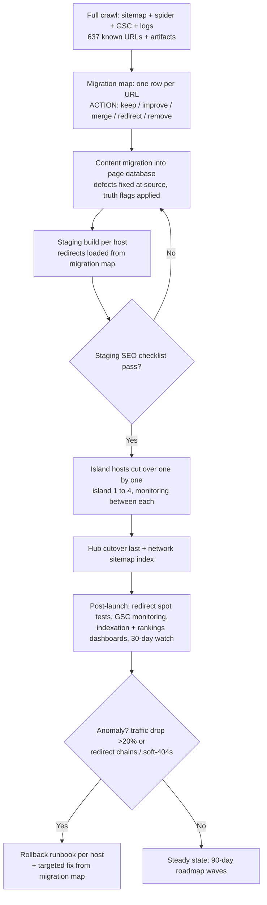

## 7. Technical, Analytics, Migration and Roadmap

The strategy in Chapters 1–6 succeeds or fails on execution discipline, and the audit evidence says execution — not strategy — is where the current estate bleeds. The site already runs a modern Next.js stack with rich JSON-LD and a sound keyword-ownership scheme, yet its highest-value pages (/pricing, /quote, /trust, /legal) sit outside every XML sitemap while ~150 thin editorial stubs are fully crawlable, edge caching is disabled, and internal SEO annotations leak into visible copy.[^01-2^][^01-25^][^01-13^][^01-15^] This chapter converts the rebuild into an engineering and operating specification: stack, content system, analytics, migration of 637 URLs, and the 30-day / 90-day execution sequence — closing with the decisions that still need a human signature and the risks that need an owner.

The chart frames the engineering problem: of 637 URLs across five hosts, 245 are journal and blog URLs — the largest single block — of which the audit identifies ~150 as 2–4-sentence doorway stubs, while the commercial pages that actually convert were never submitted to crawlers.[^01-2^][^01-13^][^01-22^][^01-25^] The rebuild inverts this: fewer URLs, deeper pages, and a governance layer that makes the current failure modes structurally impossible rather than merely discouraged.

### 7.1 Technical Architecture

#### 7.1.1 Stack decision (Next.js/TypeScript/Tailwind shared platform, island theming layer)

**Decision: keep Next.js on Vercel as a single shared platform; differentiate islands through a design-token theming layer, not code forks.** Three factors drive this. First, the stack is not the problem — the site already ships server-rendered HTML, canonicals, meta descriptions, and multiple JSON-LD blocks on Next.js/Vercel; the failures are configuration and governance (caching off, sitemap logic inverted), which any stack would allow.[^01-25^] Second, five properties demand one codebase: the network already clones 29 sub-directory slugs across all five hosts (145 URLs), and any fix to pricing copy, fee-stack wording, or schema must propagate from one edit, not five.[^01-2^] Third, the four island design territories are a theming problem, not a platform problem — the sister sites prove one platform can carry multiple market expressions.[^02-1^][^02-10^]

The concrete technical commitments:

- **App Router with React Server Components (RSC)** as the rendering baseline. Content pages are overwhelmingly read-only; RSC keeps client JavaScript near zero on commercial pages — the cheapest path to the §7.1.2 performance targets. Interactive islands (quote form, estimate builder, WhatsApp prefill) are client components scoped to the leaf, never the page.
- **Rendering strategy per page type** (table below): static generation (SSG) for stable commercial and corridor pages, Incremental Static Regeneration (ISR) for pages whose business facts can change (pricing, seasonal landings), server rendering only for genuinely dynamic routes (the quote flow).
- **Edge caching re-enabled as a launch-blocking defect.** The current homepage serves `cache-control: private, no-cache, no-store` with `x-vercel-cache: MISS` — every request hits the origin.[^01-25^] The rebuild sets explicit `s-maxage`/stale-while-revalidate headers per page type and treats a production cache MISS on a static commercial page as a bug.
- **Island theming via design tokens.** One Tailwind configuration; four island token sets (color, typography accent, imagery treatment) implementing the Oʻahu "modern Pacific metropolitan", Maui "cinematic resort-villa", Kauaʻi "organic estate", and Big Island "volcanic minimalism" territories specified in Chapter 6. Tokens switch at host level; components never hard-code island identity, and the design-uniqueness gate (§7.2.2) verifies four visibly distinct properties rather than recolored clones.
- **Shared component primitives with island-specific composition.** Rate-card, fee-stack, worked-math, FAQ, trust-strip, and corridor-map components are built once against the §7.2.1 content models and composed per island — making the per-island uniqueness requirements (unique price cards, FAQs, schema per ownership tier) enforceable in code rather than copy discipline alone.[^08-6^]
- **Image pipeline.** All photography through `next/image`, with illustrative/AI-looking heroes replaced by commissioned per-island photography as a planned asset deliverable — the audit flags current imagery as a documented conversion weakness.[^01-11^][^01-25^]

No materially better alternative to this stack exists for the requirement set: five hosts, one team, 531 governed pages, heavy structured data, and a content-operations model that assumes non-engineers publish weekly.

#### 7.1.2 Performance, accessibility (WCAG 2.2 AA), structured-data and SEO-metadata layer

Performance and structured data are conversion infrastructure here, not hygiene. The strongest SEO competitor (Take a Chef) ships template pages with FoodService, Product, and AggregateRating schema backed by thousands of reviews;[^08-2^][^08-3^] myCHEF cannot match review schema — its no-fake-reviews policy forbids it[^01-1^][^01-10^] — and must win on page experience, truthful markup depth, and metadata precision.

**Performance and accessibility budgets (launch gates, not aspirations):**

- Core Web Vitals: LCP < 2.5s, INP < 200ms, CLS < 0.1 at the 75th percentile on mobile, per template per island.
- Lighthouse: 95+ Performance / 95+ Accessibility / 95+ Best Practices / 100 SEO on every commercial template.
- WCAG 2.2 AA as a tested requirement: contrast ratios, keyboard-navigable quote funnel and menus, visible focus states, reduced-motion support, touch-target sizing. The current site claims WCAG 2.2 AA but the audit could not verify it;[^01-19^] in the rebuild the claim is either verified by automated plus manual audit or removed from /legal — the truth-flag system (§7.2.2) does not permit unverified self-claims to persist.
- QA automation on every deploy and weekly against production: broken internal links, missing/duplicate titles and metas, canonical correctness, stray noindex, orphan pages, missing alt text, JSON-LD validation, CWV regression against the budgets above.

**Rendering and caching strategy by page type:**

| Page type | Rendering | Cache policy | Revalidation trigger | Rationale |
|---|---|---|---|---|
| Island homepages, service pages (weddings, catering, private chef) | SSG | `s-maxage=86400`, SWR | Deploy or CMS publish | Stable commercial copy; highest organic entry volume |
| Pricing / rate-card pages | ISR | `s-maxage=3600`, SWR | BUSINESS FACTS file change | Prices must propagate network-wide within one hour of an approved change |
| Corridor/location pages | SSG | `s-maxage=86400`, SWR | CMS publish | Demand-driven set, rebuilt only when copy or zones change [^08-6^] |
| Seasonal landing pages (Ironman, whale season, holiday) | ISR | `s-maxage=3600` | Editorial calendar rotation | CTA and availability messaging rotate per island calendar [^08-52^] |
| Journal/guide content | SSG | `s-maxage=604800` | CMS publish | Long-lived informational assets |
| Quote flow, estimate builder | SSR (dynamic) | No cache | n/a | User-specific state; excluded from sitemaps, noindexed thank-you paths |

The interpretation that matters: the only dynamic surface in the estate is the conversion funnel itself. Everything a crawler or AI assistant reads is static, cacheable, and cheap to serve — the opposite of the current configuration, where the origin renders every request and the crawlable inventory is dominated by stubs.[^01-25^][^01-2^] The ISR trigger column is the operational heart of the table: pricing pages revalidate off the BUSINESS FACTS file (§7.2.1), so an approved rate change reaches all five hosts in one governed action — eliminating the class of inconsistency between the Big Island hero ("from $125") and its own rate card (CORE from $150).[^01-7^] Note also what is absent: no page type requires client-side rendering to be crawlable, which keeps the entire commercial estate eligible for the static edge cache and makes the Lighthouse budgets in this section achievable by construction rather than by tuning.

**Central metadata and schema layer.** Title, meta description, canonical, Open Graph, and robots directives are generated from page database fields (§7.2.1), never hand-edited in templates — this enforces the keyword-ownership scheme mechanically, replacing the current practice of stating ownership rules in visible body copy where users and competitors read them.[^01-8^][^01-15^][^08-67^] The schema plan:

| Schema type | Applied to | Key properties | Notes / guardrails |
|---|---|---|---|
| Organization | All pages, network-wide | name, url, logo, sameAs, contactPoint | Single canonical entity; subdomains reference, not redefine [^01-25^] |
| WebSite + SearchAction (if site search ships) | Hub root | name, url, potentialAction | SearchAction only if a real search endpoint exists |
| WebPage / CollectionPage | Every page | name, description, isPartOf, breadcrumb | Generated from page database; never hand-authored |
| BreadcrumbList | All non-home pages | itemListElement | Mirrors the hub-and-spoke silo structure [^02-6^][^02-11^] |
| Service / FoodService | Service pages, island homepages | serviceType, areaServed, provider, priceRange | areaServed scoped per island; priceRange from BUSINESS FACTS only [^01-25^] |
| Offer / OfferCatalog | Pricing and package pages | priceSpecification (min/max USD), availability | Prices injected from BUSINESS FACTS; re-implements the rich OfferCatalog the audit found, or rich-result eligibility is lost [^01-25^] |
| ItemList | Menu catalogues, package grids | itemListElement → Offer/MenuItem | Supports Bali-pattern menu catalogue cards [^02-16^] |
| FAQPage | Pages with visible FAQ sections | mainEntity | Only where FAQs are visibly rendered and compliant; never stuffed |
| Review / AggregateRating | **Prohibited until real** | — | No invented or self-authored ratings, ever. Ship the markup only when verified post-event reviews exist; the no-fake-reviews policy is a brand asset, not a gap to paper over [^01-1^][^01-10^] |

Two implications follow. First, schema is a data problem: every price, area, and offer in JSON-LD reads from the same BUSINESS FACTS source as the visible page, so markup can never drift from copy. Second, the AggregateRating prohibition is deliberate posture, not a gap; Take a Chef's review-rich snippets are its structural advantage,[^08-1^] and myCHEF's counter is published-fixed-price plus written-quote markup — but the moment verified reviews exist (§7.5.2), review schema ships, because map-pack competition runs on review counts and the current count is zero by policy.[^08-1^][^08-6^]

**Crawler and AI-search posture.** Sitemaps are generated from the page database, segmented by page type, with priorities reflecting commercial weight — the sister sites run pricing at priority 0.8–0.9, and the current Hawaii sitemap's inversion (money pages absent, stubs included, the rest flattened to 0.55–0.6) is corrected as a launch-blocking fix.[^02-2^][^02-11^][^01-2^] Each host serves its own robots.txt disallowing utility paths (quote internals, thank-you pages) and declaring its own sitemap. Following the Bali template, robots.txt explicitly welcomes AI crawlers (GPTBot, ChatGPT-User, PerplexityBot, ClaudeBot, Google-Extended, CCBot, Applebot) and each host serves an `llms.txt` summarizing services, pricing posture, and key URLs — AI Overviews already answer the cost and vacation-rental queries this ecosystem targets, so citation eligibility is free distribution.[^02-12^][^08-14^][^08-18^]

### 7.2 Content and CMS Architecture

#### 7.2.1 Structured content models, page database schema, business-facts single source of truth

The rebuild's most consequential architectural decision is not the framework — it is treating the five-property estate as a database that renders websites, rather than five websites that share code. The audit shows why: 637 hand-maintained pages produced leaked annotations, cloned blocks, contradictory prices, and money pages absent from every sitemap.[^01-15^][^01-4^][^01-7^][^01-25^] Governed fields make each of those failure modes a validation error instead of a published page.

Every URL in the ecosystem is a row in the page database with this schema:

| Field group | Fields | Purpose / gate enforced |
|---|---|---|
| Identity & placement | page ID, island (hub/oahu/maui/kauai/bigisland), URL slug, parent page, category, status (draft/in-review/approved/published/retired) | Orphan prevention (parent required); lifecycle control |
| SEO targeting | primary keyword, secondary keywords, search intent, cannibalization-risk flag, publish priority (P1–P3) | One owner per keyword — the ownership scheme becomes a uniqueness constraint, not copy conventions [^08-67^] |
| Metadata | title, H1, meta description, canonical, schema type(s) | Auto-generated drafts with editorial override; duplication gate blocks near-identical titles across hosts |
| Link architecture | internal links in (planned), internal links out, silo membership | Every commercial page must link up to its hub and across to siblings, per the sister-site silo-map pattern [^02-6^] |
| Content requirements | word-count target, CTA configuration, pricing block required (Y/N), FAQ required (Y/N), image requirements, truth-flag state | A page cannot publish with a required pricing block missing |
| Measurement | publish date, last substantive update, decay watch | Feeds the content-decay module of the SEO dashboard (§7.3.2) |

The analytical point is that this schema encodes the report's strategy as constraints. The cannibalization-risk field operationalizes dim08's pre-work — hub versus island versus corridor uniqueness, one canonical cost page per level, and sub-location pages only where service terms genuinely differ (travel fees, minimums, venue rules).[^08-6^][^08-13^] The publish-priority field makes the 90-day roadmap (§7.5.2) executable as waves. And the status field prevents the current estate's quietest defect — indexed parameter URLs and odd nested paths like `/bigisland/catering` and `/quote?island=maui&service=wedding` — because a URL that is not a governed row does not render.[^01-24^][^01-25^]

**BUSINESS FACTS: the single source of truth.** One version-controlled file holds every fact appearing on more than one page: per-island rate cards (Oʻahu Signature $125–$190, Stay Chef from $850; Maui $150–$250 / from $1,050; Kauaʻi $150–$250 / from $1,100; Big Island CORE $150–$225, ENTRY from $110 / from $950), the fee stack (20% service, GET up to 4.7120% valid through 12/31/2030, 50% deposit), staffing hourlys ($55 server / $75 sous-chef), travel-zone lines, and the approved terminology set.[^01-8^][^01-21^][^01-23^][^01-19^] Pages, schema, the estimate builder, and llms.txt all render from this file. Three rules govern it: (1) a fact enters only with a truth flag and an approver; (2) pricing changes are atomic — one edit revalidates every pricing surface network-wide via ISR; (3) the file carries the GET surcharge sunset (12/31/2030) as a scheduled review task, since the pass-on line must be revisited when the surcharges expire.[^07-28^]

#### 7.2.2 Content truth flags and quality gates (90/100 publication score, duplication gate)

The current site's honesty register — a public commitment not to invent reviews, chefs, licenses, or track records — is its most differentiated asset.[^01-10^] The rebuild generalizes that posture into a publish-time gate: every factual claim on every page carries one of five truth flags, and the CMS refuses to publish pages containing claims in blocked states.

| Truth flag | Meaning | Publication rule | Examples from this project's research |
|---|---|---|---|
| VERIFIED | Independently confirmed against a primary source | Publish freely | GET 4.7120% max pass-on through 12/31/2030 (DOTAX-verified) [^07-28^]; published myCHEF rate cards [^01-21^][^01-23^] |
| APPROVED BUSINESS POLICY | A stance the business has formally adopted | Publish in approved wording only | Written-quote-is-the-confirmed-total policy; no-fake-reviews stance; 50% deposit [^01-8^][^01-10^] |
| RESEARCH SUPPORTED | Evidence-backed, not independently verified | Publish with the framing the research specifies (years labeled, ESTIMATED kept where flagged) | Marketplace per-person bands; seasonality patterns [^07-49^][^08-33^] |
| REQUIRES APPROVAL | Awaiting owner/counsel sign-off | **Never publishes** — the CMS hard-block | Final pricing numbers not on the current approved cards; all REQUIRES LEGAL VERIFICATION items (§7.6.1) [^07-34^][^07-38^] |
| DO NOT PUBLISH | Confirmed unusable or prohibited | Stripped at build time | Sister-site track-record numbers ("560+ events, since 2019"); leaked keyword-volume annotations; unverified Bali/Dubai "Verified" claims [^02-18^][^01-15^][^01-24^] |

This table is the report's truth discipline made executable. Two rows deserve emphasis. REQUIRES APPROVAL is a hard block, not a warning — the current legal page already admits its cancellation tiers are "proposed, pending attorney review," and that posture is correct; what changes is that the platform, not editorial vigilance, prevents premature publication.[^01-19^] DO NOT PUBLISH exists because the sister sites' trust assets (named chefs, 560+ events, ratings since 2019) are tempting copy for a launch-stage property, and the do-not-copy rule is explicit that none of it may cross over.[^02-18^][^02-19^]

**Quality gates.** Before any page reaches `published` it clears three gates:

1. **Publication score ≥ 90/100** across 13 weighted criteria: intent match, title/H1/meta quality and uniqueness, keyword-ownership compliance, word count vs. target, pricing-block presence and BUSINESS FACTS consistency, required FAQs, internal-link minimums (up to parent, across to siblings), schema validity, image/alt compliance, CTA configuration, CWV-safe asset weight, truth-flag clearance, and ʻokina correctness in body copy (Oʻahu, Kauaʻi, Kāʻanapali, Poʻipū) with ASCII slugs and titles — the network's existing convention.[^01-2^][^01-4^]
2. **Duplication gate.** Near-duplicate detection across all five hosts at title, H1, and paragraph level — targeting the identical footer/locations block repeated on every page (rendered twice consecutively on the Oʻahu home) and the 29 cloned sub-directory pages across hosts.[^01-4^][^01-2^] Corridor pages must pass the Bali standard: genuinely unique local copy or no page at all.[^02-15^]
3. **Design-uniqueness gate.** A human checkpoint confirming each island property is visually and verbally distinct under its design territory — four properties, not one site in four colorways.

The "so what": the 90-day roadmap publishes hundreds of pages; without machine-enforced gates, volume guarantees the same thin-duplicate debt the migration is paying to remove.

### 7.3 Analytics Architecture

#### 7.3.1 GA4/Search Console event taxonomy: CTA, quote funnel, per-island segmentation

The current conversion system is a single door — a five-field quote form plus WhatsApp — and the audit notes Kauaʻi and Big Island CTAs route to a weaker "inquiry list" rather than a quote.[^01-9^][^01-6^] A single-door funnel is acceptable; an unmeasured one is not. Analytics here must answer three questions the business currently cannot: which island and page type produces quote intent, where the funnel leaks, and which published pages earn zero commercial engagement. One GA4 property serves all five hosts with cross-domain tracking (a §7.4.2 checklist item), and every event carries a consistent parameter set so per-island and per-page-type segmentation is a reporting default.

| Event name | Trigger | Required parameters | Business question answered |
|---|---|---|---|
| `page_view` (enhanced) | Every page | `island`, `page_category`, `page_id`, `organic_landing` (Y/N) | Which island/category combinations earn organic entries |
| `cta_click` | Any primary CTA | `island`, `page_category`, `cta_label`, `cta_position` | Which pages and positions start the funnel |
| `whatsapp_click` | WhatsApp button/prefill | `island`, `page_category`, `cta_position` | Size of the off-form channel (primary on sister sites) [^02-1^][^02-14^] |
| `quote_start` | First form-field interaction | `island` (page), `service_interest` | Funnel entry volume by island |
| `quote_step_progression` | Each completed form step | `island_selected`, `service_selected`, `step_number` | Leak localization (dates vs. party size vs. contact step) |
| `quote_complete` | Successful submission | `island_selected`, `service_selected`, `guest_count_band`, `lead_time_days` | Demand per island/service; validates roadmap priorities |
| `inquiry_list_join` | Kauaʻi/Big Island inquiry CTA completion | `island_selected`, `service_selected` | Measures the second-class funnel honestly [^01-6^] |
| `email_action` | mailto / email copy | `island`, `page_category` | The third contact path |
| `menu_interaction` | Menu card expand/download | `island`, `menu_id` | Which menus sell [^02-16^] |
| `pricing_interaction` | Rate-card/worked-math expansion, estimator use | `island`, `price_block_id` | Confirms pricing transparency is the conversion asset |
| `location_interaction` | Corridor map / travel-zone interaction | `island`, `corridor_id` | Which corridors deserve page investment vs. fold [^08-6^] |

Two design rules make this taxonomy durable. First, **naming is snake_case, verb-first, and frozen in a tracking-plan document** — the same discipline gap that let SEO annotations leak into copy produces `Quote Submit`, `quote_submit`, and `form_complete` as three competing events six months in. Second, **island is always a parameter, never an event variant**; `quote_complete` with `island_selected=maui` vs. `kauai` in one report is what lets the roadmap reallocate publish effort by measured demand. Search Console is verified per property with sitemaps submitted per host and the URL Inspection API wired into the dashboard — the audit's unverified ~40-result indexation estimate is replaced by daily measured truth.[^01-24^]

#### 7.3.2 Internal SEO dashboard specification

A five-property, 531-page ecosystem cannot be managed from Search Console's native interface; the dashboard is an operating tool, not a reporting artifact:

| Module | Data source | Contents | Decision it feeds |
|---|---|---|---|
| Inventory | Page database + GSC Inspection API | Pages by status (published/draft/retired), indexed vs. submitted, indexation lag per wave | Indexation management at scale (§7.6.2); wave pacing in §7.5.2 |
| Performance | GSC API | Clicks, impressions, CTR, average position per page and per query; ranking buckets (1–3, 4–10, 11–20, 21–50) | Page-2 attack targeting (positions 8–30); title/meta rewrites for low-CTR page-1 listings |
| Conversions | GA4 | quote_complete, inquiry_list_join, whatsapp_click per island/category; funnel step drop-off | Commercial prioritization; Kauaʻi/Big Island funnel-upgrade timing |
| Attention | GA4 + GSC | Zero-traffic pages (90-day window), zero-CTA pages, content decay (position/click decline vs. 90-day baseline) | Quarterly zero-traffic review (improve/merge/redirect/remove) [^01-2^] |
| Health | QA automation | Broken links, metadata errors, schema validation failures, orphan pages, cannibalization warnings (two pages ranking 11–50 for the same query), CWV vs. budget | Weekly fix queue; duplication-gate backstop |
| Local | GBP per island | Review count, review velocity, calls/directions, map-pack presence for tracked terms | Review-acquisition program KPI — the documented gap against the map-pack leader's 534 reviews [^08-6^] |

The module that pays for the whole build is Attention. The migration deletes or consolidates ~150 thin URLs; the dashboard's job is ensuring the estate never regrows that debt invisibly — every page earns traffic, earns assists, or enters quarterly review with a disposition deadline. Cannibalization warnings automate dim08's central risk: if hub and island host both surface in positions 11–50 for "private chef Maui", the ownership constraint failed in practice and the fix (merge, differentiate, canonicalize) is assigned, not debated.[^08-67^] The Health module is the backstop for the quality gates in §7.2.2: gates stop bad pages from publishing, but only continuous health monitoring catches the drift that appears afterward — template regressions, schema changes by Google, links broken by retired pages. Together the six modules convert the roadmap in §7.5 from a publishing schedule into a feedback system.

### 7.4 Migration Plan

#### 7.4.1 URL crawl → migration map (old → new, 301 one-to-one/closest-relevant)

Migration is a redirect-accounting exercise with one non-negotiable rule: **every one of the 637 known URLs — plus whatever the pre-migration crawl finds beyond the sitemap — gets an explicit, recorded disposition; nothing falls through to a wildcard.** The audit proves the sitemap understates the live estate: money pages return 200 outside it, and indexed artifacts (`/bigisland/catering`, `/kauai/events`, parameterized `/quote` URLs, legacy 301s like `/locations/waikiki` and `/wedding-catering`) show historical variants exist beyond any single inventory.[^01-24^][^01-25^] The crawl pulls from four sources — sitemap extraction, a full spider of all five hosts, Search Console export, and server/CDN logs — recording per URL: HTTP status, title/canonical, word count, inbound links, 12-month clicks/impressions, and rankings for tracked terms.

The migration map is the master document, one row per old URL:

| Column | Content | Example |
|---|---|---|
| OLD URL | Full URL incl. host and parameters | `bigisland.mychef-hawaii.com/bigisland/catering` |
| OLD status/type | Live/redirect/artifact; page type | Artifact duplicate, 200 |
| NEW URL | Target URL on new architecture | `bigisland.mychef-hawaii.com/catering` |
| ACTION | KEEP / IMPROVE / MERGE / REDIRECT / REMOVE | REDIRECT |
| 301 TARGET | Final one-hop destination | NEW URL or closest-relevant parent |
| REASON | Evidence basis | "Duplicate artifact; 0 clicks 12 mo; canonical page exists" [^01-24^] |
| OWNER + STATUS | Accountable editor; mapped/tested/live | — |

Disposition framework by estate segment:

- **Keep (one-to-one 301 or straight carryover):** the five homepages, all five `/pricing` pages, `/catering`, `/weddings`, `/private-chef-cost`, `/trust`, `/legal`, `/quote`, and corridor pages with confirmed indexation or equity (`/wailea`, `/honolulu`, `/kahala`, `/princeville`, `/kona`, `/waikoloa` class).[^01-24^][^01-25^] Renamed slugs get single-hop, one-to-one 301s.
- **Improve:** journal URLs mapped to real informational demand (dim08's FAQ/PAA bank) survive as full-prose pages — `/journal/how-much-does-a-private-chef-cost` becomes a governed guide linking up to the canonical cost page rather than competing with it.[^08-15^][^08-67^]
- **Merge:** the ~54 `blog/dining-in-*` posts fold into their parent corridor pages as unique local copy, strengthening exactly the pages the ownership scheme wants ranking; their URLs 301 to the corridor.[^01-2^]
- **Redirect (closest-relevant):** pruned stubs 301 to the closest-relevant surviving page — never a mass redirect to the homepage, which Google processes as soft-404s.
- **Remove (410/404):** URLs with zero traffic, zero links, and no relevant target — primarily the over-built corridors the demand evidence does not support (Kauaʻi west-side /waimea-/hanapepe-/eleele class; Maui /haleakala-/waikapu class).[^01-2^] Removal is confirmed only after the zero-traffic review: 12-month GSC clicks = 0, no backlinks, no assisted conversions.

Two preservation orders close this section. First, the rich JSON-LD now live (Organization, LocalBusiness with priceRange, OfferCatalog with USD price specifications, FoodService, FAQPage) must be re-implemented through the central schema layer before cutover — losing it voluntarily surrenders rich-result eligibility the site already holds.[^01-25^] Second, known copy defects are fixed at the source during content migration, not moved: the Big Island "from $125" hero, the ENTRY/Table terminology drift, the duplicated locations block, and every leaked SEO annotation.[^01-7^][^01-15^] Migrating defects is how rebuilds inherit the old site's reputation.

#### 7.4.2 Staging-first cutover, SEO launch checklist, redirect testing

Cutover happens on staging first, host by host, hub last — the hub is the network's canonicalization anchor and sitemap index, so it flips only after all four island properties pass checklist. The migration flow:

The SEO launch checklist — executed in full on staging, re-verified within 24 hours of each production cutover:

| # | Check | Pass standard |
|---|---|---|
| 1 | robots.txt per host | Content paths allowed; quote internals and thank-you disallowed; sitemap declared [^02-12^] |
| 2 | XML sitemaps | Auto-generated, segmented by page type; **all money pages present** (pricing, quote, trust, legal — the current inversion is a launch blocker); priorities reflect commercial weight [^01-25^][^02-2^] |
| 3 | Redirects | 100% of migration-map REDIRECT/MERGE rows return single-hop 301s to mapped targets; zero chains, loops, or wildcard-to-homepage rules |
| 4 | Canonicals | Self-referencing everywhere; parameter variants (`?island=`, `?service=`) canonicalized or blocked [^01-24^] |
| 5 | noindex audit | Only intentional exclusions; production sweep proves staging protections removed |
| 6 | Schema validation | Rich Results test passes per template; no AggregateRating/Review markup present [^01-10^] |
| 7 | Titles/metas | Cross-host uniqueness verified by crawl; ownership rules hold (hub statewide, hosts island phrases) [^08-67^] |
| 8 | Analytics | GA4 cross-domain tracking live; taxonomy firing; conversions marked; GSC verified per property; sitemaps submitted |
| 9 | www/non-www + protocol | One canonical host variant per property; single-hop redirects for all others; HSTS on |
| 10 | Subdomain behavior | Each host serves only its own content; cross-host URL guesses 301 to the correct host (kills the `/bigisland/catering` artifact class) [^01-24^] |
| 11 | Error handling | Custom 404 with recovery links and quote CTA; 500 alerting |
| 12 | Open Graph / social | OG title/description/image per template; cards validated on all five hosts |
| 13 | Forms & WhatsApp | Quote form end-to-end per island (incl. inquiry variants); WhatsApp prefill correct [^02-19^] |
| 14 | Performance | CWV budgets met on production infrastructure; edge-cache HIT confirmed on static pages [^01-25^] |
| 15 | llms.txt + AI crawlers | llms.txt served per host; AI-crawler allows in robots [^02-12^] |

Redirect testing deserves its own discipline because it is where migrations actually fail: the redirect map is loaded as data (not hand-written rules), an automated test asserts every row's status code, hop count, and final destination on staging, and the same test re-runs against production in the first hour after each cutover. High-equity URLs (indexed corridor pages, `/pricing` on all hosts) are additionally verified in GSC's URL Inspection after recrawl. The rollback runbook is per host and DNS-level, so a failed island cutover never contaminates the other four properties.

### 7.5 Execution Roadmaps

#### 7.5.1 30-day build order by commercial priority

One principle governs the sequence: revenue-adjacent surfaces ship first, and nothing ships without its gate. The order front-loads platform primitives, then the five homepages (the highest-value ranking assets), then P1 commercial clusters, then the pricing cluster that turns the transparency wedge into a conversion system. Migration preparation (§7.4.1) runs in parallel from day one so cutover never waits on inventory work. The target estate is deliberately smaller and deeper than the current one:

The consolidation is the point: 531 governed pages (123 Oʻahu / 126 Maui / 113 Kauaʻi / 121 Big Island / 48 hub) replace 637 loosely maintained URLs, with the reduction concentrated entirely in the stub and duplicate blocks — commercial coverage per island grows even as total URL count shrinks.

| Week | Build focus | Deliverables | Exit gate |
|---|---|---|---|
| 1 — Foundation | Platform + governance spine | Design-token theming (4 island token sets); component primitives (rate card, fee stack, worked-math, FAQ, trust strip); page database + CMS models; BUSINESS FACTS seeded with approved rate cards and fee stack [^01-8^][^01-21^][^01-23^]; metadata + schema layers; QA harness; GA4 tracking plan | Components render from BUSINESS FACTS only; a deliberate wrong price in a template fails build |
| 2 — Homepages | Hub + 4 island homepages | Five homepages with island-territory theming, owned-keyword titles, full schema, real photography where delivered; staging checklist items 1–7 passing | Design-uniqueness gate + 90/100 publication score on all five; QA gate green |
| 3 — P1 commercial clusters | Highest-intent service pages per island | Per island: private-chef (island-phrase owner), weddings + wedding-week, catering, vacation-chef/villa-chef; retreat-catering first on Kauaʻi and Big Island where SERP whitespace is documented [^08-7^][^08-13^]; vacation-rental chef page type statewide + per island [^08-18^] | Every page clears publication score, duplication gate, ownership constraints; zero leaked annotations (automated lint) |
| 4 — Pricing cluster + launch prep | The tariff, everywhere | /pricing per host (rate cards, fee-stack block, worked-math tables, estimator v1); canonical cost page per level with guides linking up [^08-67^]; GBP profiles per island with review pipeline armed [^08-6^]; migration map finalized, redirect suite green on staging | Full staging checklist pass; pricing pages in sitemaps at 0.8–0.9 [^02-2^]; cutover scheduled |

Two sequencing notes. First, GBP and the review pipeline land in week 4 deliberately — review acquisition must start the day real events occur, and the map-pack evidence (a 534-review leader on Maui) means every month of delay compounds.[^08-6^] Second, the corridor rebuild is intentionally *not* in the 30-day plan: corridor pages ship in the 90-day waves, only after each candidate passes the "service terms genuinely differ" test — shipping earlier would recreate the doorway-stub pattern under deadline pressure.[^08-6^][^02-15^]

#### 7.5.2 90-day SEO roadmap: publish waves, measurement, page-2 attack system

Days 31–90 convert the launch into an operating rhythm: three governed publish waves, weekly measurement, and two standing systems — page-2 attack and zero-traffic review — that turn the dashboard from observation into allocation.

| Phase | Publish waves | Measurement & iteration systems |
|---|---|---|
| Days 31–50 — Wave P1 completion | Remaining P1 service pages; corridor pages passing the uniqueness test (Wailea, Kāʻanapali, Lahaina, Kapalua; Waikīkī, Ko Olina; Princeville, Poʻipū; Kailua-Kona, Kohala Coast) [^08-6^]; /trust and /legal rebuilt with approved wording only [^01-10^][^01-19^] | Indexation monitoring per wave (submitted vs. indexed, lag days); weekly ranking-bucket report; GSC per-property baselines |
| Days 51–70 — Wave P2 | Guide layer answering the PAA/FAQ bank (cost, tipping, groceries, kitchen requirements, lead time) [^08-14^][^08-29^]; seasonal landing pages per island calendar (Ironman Kona, whale season, holiday peak) [^08-52^]; holiday-surcharge calendar by early Q4 (market-standard) [^07-13^]; B2B partner silo if approved (§7.6.1) [^02-11^] | Page-2 attack system live: positions 8–30 get targeted refreshes (title/CTR rewrite, PAA-mined FAQ enrichment, internal-link reinforcement, schema upgrade); per-island conversions reviewed against the funnel taxonomy |
| Days 71–90 — Wave P3 | Long-tail whitespace formats (welcome-dinner, rehearsal-dinner, recovery-brunch pages; omakase-at-home; retreat dietary depth); Oʻahu Japanese-language cluster only if approved (§7.6.1); Dec–Mar villa content front-loaded by Sep–Oct per booking-lead evidence [^08-33^][^08-37^] | First quarterly zero-traffic review (improve/merge/redirect/remove dispositions); content-decay watch armed; GBP review velocity vs. plan; roadmap re-planned from measured island-level demand (`quote_complete` + `inquiry_list_join`) |

The load-bearing system is the weekly iteration loop: dashboard review (Monday) → fix queue and page-2 targets (Tuesday) → publish and revalidate (Wednesday–Thursday) → indexation and redirect health check (Friday). Seasonality makes the calendar non-negotiable — statewide arrivals peak in March, June–July, and the mid-December holidays, with September the trough, but island demand inverts by shore and event, so CTA rotation and editorial front-loading are configured per island in the CMS, not managed as one statewide calendar.[^07-49^][^07-51^] The 90-day mark is also the first honest trust checkpoint: if verified-event reviews are accumulating on GBP, review schema ships in the next release; if not, the honesty register stays as-is — never fabricating social proof is itself the differentiating asset.[^01-10^]

### 7.6 Risks and Unresolved Business Decisions

#### 7.6.1 Decision register: pricing approvals, legal verification, coverage, staffing claims

Everything in this section is blocked on a human, not on engineering. Each item carries its evidence state and its publication consequence; until resolved, the truth-flag system keeps the related content in REQUIRES APPROVAL and off the site.

| # | Decision | Evidence state | Publication consequence until resolved |
|---|---|---|---|
| D1 | Final pricing numbers beyond the current approved cards (new packages, surcharges, discount tiers) | Current per-island cards are consistent and verified as published [^01-8^][^01-21^][^01-23^]; anything new is **PRICE REQUIRES APPROVAL** | Only approved cards render; estimator outputs labeled "from" pricing |
| D2 | Alcohol service posture — pouring client-supplied alcohol; whether the Packaged cart bar line triggers a county Class 13 caterer license | Gray area across four county Liquor Commissions; **REQUIRES LEGAL VERIFICATION**; top legal priority because a bar product is already on the rate card [^07-35^][^07-38^][^01-21^] | Bar line publishes with no alcohol-service claims beyond approved wording; wine-pairing add-on blocked |
| D3 | HRS §481B-14 disclosure wording for the 20% service line | Statute verified; exact wording/placement **REQUIRES LEGAL VERIFICATION** [^07-32^][^07-33^] | Fee stack keeps the verified posture ("distributed or disclosed"); no final-terms language |
| D4 | SB1256 (2025) and 2026 successors on mandatory gratuities/junk fees | BillTrack shows SB1256 dead in committee; outcomes **REQUIRES LEGAL VERIFICATION** [^07-34^] | Regulatory watch only; no legislative-status copy |
| D5 | DOH permit posture for in-home private-chef service, per island district | Act 195 exemption confirmed *not* to cover the service; district posture **REQUIRES LEGAL VERIFICATION** with DOH Food Safety Branch (808-586-4400) [^07-44^][^07-45^][^07-41^] | /legal keeps "licenses publish when issued and verifiable" [^01-19^] |
| D6 | Cancellation/deposit final terms | Current tiers "proposed, pending attorney review" [^01-19^] | 50% deposit (APPROVED BUSINESS POLICY) publishes; cancellation schedule labeled proposed |
| D7 | Coverage expansion — Kauaʻi west side, Maui Upcountry, Big Island east side | Demand evidence argues against west-side Kauaʻi pages; corridor rule is "service terms genuinely differ" [^08-6^]; permits and logistics constrain real coverage [^07-41^] | Coverage map publishes only zones the operation can serve; inquiry-stage framing retained |
| D8 | Named-chef / coordinator / photo policy vs. launch posture | Sister sites run named chefs and coordinators; Hawaii publishes no names, by policy [^02-19^][^01-1^] [^01-11^] | Team pages and coordinator names blocked until real people exist and consent |
| D9 | Phone number / NAP publication | No 808 number or address published today; GBP effectiveness and local trust depend on NAP [^01-1^][^08-6^] | GBP operates within approved contact policy; NAP schema fields stay empty |
| D10 | Review acquisition policy (post-event verified pipeline, platform mix) | Fake/purchased reviews prohibited; map-pack leader holds 534 reviews [^01-10^][^08-6^] | Review schema blocked; GBP collects only verified-event reviews |
| D11 | B2B partner program (villa managers, concierges, planners) and landing silo | Sister-site partner-silo pattern documented; vacation-rental chef intent currently ceded to concierge pages [^02-11^][^08-18^] | Partner silo ships in Wave P2 only with approved program terms |

The register resolves to three dependencies: D2–D6 wait on counsel, D8–D11 on operational maturity, D1/D7 on commercial judgment. Resolving in that order — counsel first, operations second, judgment last — unblocks the most publishable content per decision made. Two items carry outsized leverage. D2 (alcohol) is the only legal item blocking a product already sold on the approved rate card, so it should reach counsel first.[^07-38^][^01-21^] And D9/D10 (NAP and review acquisition) gate the entire local-search thesis: the map pack is the highest-converting SERP feature in every inspected market, the incumbent leader holds 534 Google reviews, and myCHEF's count is zero by policy — every week these two items remain undecided, the local funnel operates without its primary ranking lever.[^08-6^][^01-10^]

#### 7.6.2 Risk register with mitigations (indexation scale, content quality at 400+ pages, seasonality)

| Risk | Likelihood / impact | Mitigation | Early-warning indicator |
|---|---|---|---|
| Indexation lag or failure at 531 pages (current indexation unverified and plausibly shallow) [^01-24^] | Medium / High | Segmented sitemaps with money pages at 0.8–0.9; wave-based publishing, not big-bang; internal-link minimums in the page database; Inspection API monitoring per wave [^02-2^] | Wave indexation <70% within 14 days; crawl-stats decline |
| Content quality decays at scale — the stub pattern regrows | High / High | 90/100 score + duplication gate as hard blocks; corridor uniqueness test; quarterly zero-traffic review with disposition deadlines [^01-13^][^02-15^] | Sub-score pages published via override; near-duplicate alerts across hosts |
| Doorway-page classification if location pages thin out | Medium / High | Sub-location pages only where service terms genuinely differ; the rest fold into island "areas served" sections; Bali non-thin template as the floor [^08-6^][^02-15^] | Corridors stuck below position 50; "crawled, not indexed" clustering |
| Seasonality mis-timing — content lands after its booking window | Medium / Medium | Per-island editorial calendar in the CMS; Dec–Mar villa content front-loaded by Sep–Oct; wedding content 12+ months ahead; surcharge calendar by early Q4 [^08-33^][^08-37^][^07-13^] | Seasonal-term impression growth arriving post-peak |
| Marketplace SERP incumbency (Take a Chef per-city pages, AggregateRating, review depth) | High / Medium | Differentiate on what marketplaces cannot copy: fixed published prices, written-quote totals, fee transparency, island-operational depth; page-2 attack targets winnable 8–30 positions first [^08-2^][^01-8^] | Marketplace pages holding positions 1–5 with rating snippets on tracked terms |
| GBP review gap vs. incumbents (map-pack leader at 534) [^08-6^] | High / High (local funnel) | Verified-event review pipeline from day one; review velocity as a launch KPI; complete GBP profiles within the approved NAP policy (D9/D10) | Review velocity below plan two months running |
| Single-point conversion dependency on quote form + WhatsApp | Medium / High | Step-level funnel instrumentation (§7.3.1); email_action as third path now; phone/NAP decision (D9) as the structural fix [^01-9^][^02-19^] | quote_start→quote_complete drop-off >60% |
| Subdomain equity split — five hosts accumulate authority separately | Medium / Medium | Accepted as deliberate architecture mirroring legal/operational reality (per-island permits, county liquor rules, GET by place of performance) [^07-41^]; cross-host silo linking with the hub as anchor; no mid-roadmap consolidation | Island properties not ranking for their own owned phrases by day 90 |

The risk register resolves to one forward-looking implication: the rebuild's binding constraint over the next 90 days is not engineering capacity — the platform, gates, and maps specified here are buildable in 30 days — but the speed at which the decision register is signed. Every week D2–D6 sit with counsel, fee-stack and legal content publishes in provisional wording; every week D8–D11 wait on operational maturity, the map-pack gap against a 534-review incumbent widens by the reviews myCHEF did not collect.[^08-6^] The architecture absorbs late decisions gracefully — truth flags hold content back without blocking unrelated pages — but the strategy's compounding assets (reviews, local entity, partner channels) only start compounding once a human decides. That is the roadmap's real critical path.

---

### Sources

[^01-1^] myCHEF Hawaii — hub homepage — https://mychef-hawaii.com/ (accessed 2026-09-06)
[^01-2^] myCHEF Hawaii — network-wide sitemap (637 URLs) — https://mychef-hawaii.com/sitemap.xml (accessed 2026-09-06)
[^01-4^] myCHEF Oʻahu — homepage — https://oahu.mychef-hawaii.com/ (accessed 2026-09-06)
[^01-6^] myCHEF Kauaʻi — homepage — https://kauai.mychef-hawaii.com/ (accessed 2026-09-06)
[^01-7^] myCHEF Hawaiʻi Island — homepage — https://bigisland.mychef-hawaii.com/ (accessed 2026-09-06)
[^01-8^] myCHEF Hawaii — statewide tariff — https://mychef-hawaii.com/pricing (accessed 2026-09-06)
[^01-9^] myCHEF Hawaii — quote mechanism — https://mychef-hawaii.com/quote (accessed 2026-09-06)
[^01-10^] myCHEF Hawaii — honesty register — https://mychef-hawaii.com/trust (accessed 2026-09-06)
[^01-11^] myCHEF Hawaii — about/brigade, photo disclaimer — https://mychef-hawaii.com/about (accessed 2026-09-06)
[^01-13^] myCHEF Hawaii — hub journal stub — https://mychef-hawaii.com/journal/how-much-does-a-private-chef-cost (accessed 2026-09-06)
[^01-15^] myCHEF Oʻahu — island journal stub with leaked SEO note — https://oahu.mychef-hawaii.com/journal/how-much-does-a-private-chef-cost (accessed 2026-09-06)
[^01-19^] myCHEF Hawaii — legal/booking notes — https://mychef-hawaii.com/legal (accessed 2026-09-06)
[^01-21^] myCHEF Oʻahu — rate card — https://oahu.mychef-hawaii.com/pricing (accessed 2026-09-06)
[^01-22^] myCHEF Oʻahu — blog stub sample — https://oahu.mychef-hawaii.com/blog/cleanup-standard (accessed 2026-09-06)
[^01-23^] myCHEF Kauaʻi — rate card — https://kauai.mychef-hawaii.com/pricing (accessed 2026-09-06)
[^01-24^] Google site: queries (per-host index checks, 2026-09-06) — https://www.google.com/search?q=site:mychef-hawaii.com (accessed 2026-09-06)
[^01-25^] Direct HTTP inspection of headers, HTML head, JSON-LD, and status codes — curl, mychef-hawaii.com hosts (accessed 2026-09-06)
[^02-1^] myCHEF Dubai — homepage — https://mychef.ae (accessed 2026-09-06)
[^02-2^] myCHEF Dubai — sitemap with silo comments — https://www.mychef.ae/sitemap.xml (accessed 2026-09-06)
[^02-6^] myCHEF Dubai — catering packages hub — https://www.mychef.ae/catering-packages-dubai (accessed 2026-09-06)
[^02-10^] myCHEF Bali — homepage — https://mychef.id/ (accessed 2026-09-06)
[^02-11^] myCHEF Bali — sitemap — https://mychef.id/sitemap.xml (accessed 2026-09-06)
[^02-12^] myCHEF Bali — robots.txt (AI-crawler allows + llms.txt) — https://mychef.id/robots.txt (accessed 2026-09-06)
[^02-14^] myCHEF Bali — FAQ — https://mychef.id/faq (accessed 2026-09-06)
[^02-15^] myCHEF Bali — programmatic location-page template — https://mychef.id/private-chef/seminyak (accessed 2026-09-06)
[^02-16^] myCHEF Bali — fine-dining menu catalogue — https://mychef.id/fine-dining/menus (accessed 2026-09-06)
[^02-18^] myCHEF Bali — why-myCHEF evidence page — https://mychef.id/why-mychef (accessed 2026-09-06)
[^02-19^] myCHEF Bali — contact (named coordinators, office address) — https://mychef.id/contact (accessed 2026-09-06)
[^07-13^] Private Chef Kauai — pricing (holiday rates, travel fees) — http://www.privatechefkauai.com/pricing (accessed 2026-09-06)
[^07-28^] Hawaii Department of Taxation — County Surcharge on GET — https://tax.hawaii.gov/geninfo/countysurcharge/ (accessed 2026-09-06)
[^07-32^] ILWU Local 142 — HRS §481B-14 service-charge disclosure — https://www.ilwulocal142.org/hawaii-law-requires-service-charge-disclosure (accessed 2026-09-06)
[^07-33^] 7shifts — Hawaii tip laws for employers — https://www.7shifts.com/blog/hawaii-tip-laws/ (accessed 2026-09-06)
[^07-34^] BillTrack50 — HI SB1256 (2025) — https://www.billtrack50.com/billdetail/1796100 (accessed 2026-09-06)
[^07-35^] LiquorLicenseCost — Hawaii liquor license overview — https://liquorlicensecost.com/states/hi (accessed 2026-09-06)
[^07-38^] County of Maui Dept. of Liquor Control — Rules, MC-08 Chapter 101 (Class 13) — https://www.mauicounty.gov/DocumentCenter/View/106007/Rules---Chapter-101-PDF (accessed 2026-09-06)
[^07-41^] GetVendorLoop — Hawaii food-business permits, per-island DOH, Young Brothers — https://getvendorloop.com/guides/how-to-start-a-food-truck-in-hawaii (accessed 2026-09-06)
[^07-44^] CottageFoodLicense — Hawaii HAR 11-50 homemade-food exemption (Act 195) — https://www.cottagefoodlicense.com/blog/food-permit-hawaii-licenses-permits-cottage-food-options-explained (accessed 2026-09-06)
[^07-45^] Hawaii DOH Food Safety Branch — Food Establishment Permit Applications — https://health.hawaii.gov/san/permit-applications/food-establishment-permit-applications/ (accessed 2026-09-06)
[^07-49^] RoadGenius — Hawaii tourism statistics (monthly arrivals, seasonality) — https://roadgenius.com/statistics/tourism/usa/hawaii/ (accessed 2026-09-06)
[^07-51^] Hawaii Tribune-Herald — Hawaii visitor arrivals end 2025 below pre-pandemic peak — https://www.hawaiitribune-herald.com/2026/02/01/hawaii-news/hawaii-visitor-arrivals-end-2025-well-below-pre-pandemic-peak/ (accessed 2026-09-06)
[^08-1^] Google SERP "private chef hawaii" (map pack, PAA, PASF) — https://www.google.com/search?q=private+chef+hawaii (accessed 2026-09-06)
[^08-2^] Take a Chef — Honolulu County — https://www.takeachef.com/en-us/private-chef/honolulu-county (accessed 2026-09-06)
[^08-3^] Take a Chef — Kailua-Kona — https://www.takeachef.com/en-us/private-chef/kailua-kona (accessed 2026-09-06)
[^08-6^] Google SERP "private chef maui" (map pack; Raffin 534 reviews; PASF) — https://www.google.com/search?q=private+chef+maui (accessed 2026-09-06)
[^08-7^] Google SERP "private chef kauai" — https://www.google.com/search?q=private+chef+kauai (accessed 2026-09-06)
[^08-13^] myCHEF Kauaʻi — weddings page — https://kauai.mychef-hawaii.com/weddings (accessed 2026-09-06)
[^08-14^] Google SERP "private chef hawaii cost" (AI Overview, PAA) — https://www.google.com/search?q=private+chef+hawaii+cost (accessed 2026-09-06)
[^08-15^] Jason Raffin — Private Chef Pricing Maui — https://www.jasonraffin.com/post/breaking-down-the-cost-of-a-private-chef-in-maui-private-chef-pricing-maui (accessed 2026-09-06)
[^08-18^] Google SERP "private chef for vacation rental hawaii" (AI Overview; concierge pages) — https://www.google.com/search?q=private+chef+for+vacation+rental+hawaii (accessed 2026-09-06)
[^08-29^] Take a Chef blog — How much do you tip a private chef? — https://www.takeachef.com/blog/en/how-much-do-you-tip-private-chef (accessed 2026-09-06)
[^08-33^] myCHEF Big Island journal — How far ahead to book — https://bigisland.mychef-hawaii.com/journal/how-far-ahead-to-book (accessed 2026-09-06)
[^08-37^] Mauna Kea Residences — Hawaii vacation booking lead times — https://maunakearesidences.com/insights/useful-info/how-far-in-advance-should-you-book-a-hawaii-vacation/ (accessed 2026-09-06)
[^08-52^] Hawaii-Guide — Best time to visit Hawaii (whale season, Merrie Monarch, Ironman) — https://www.hawaii-guide.com/best-time-to-visit-hawaii (accessed 2026-09-06)
[^08-67^] myCHEF Hawaii — journal hub — https://mychef-hawaii.com/journal (accessed 2026-09-06)
